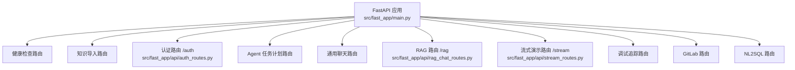
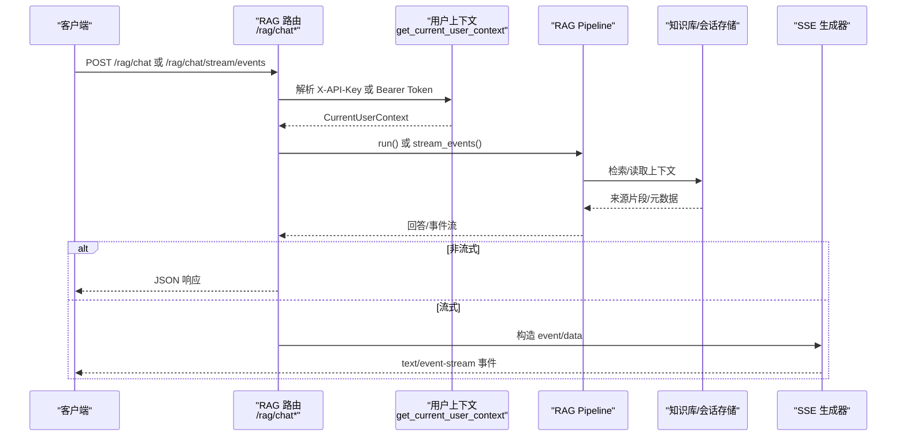
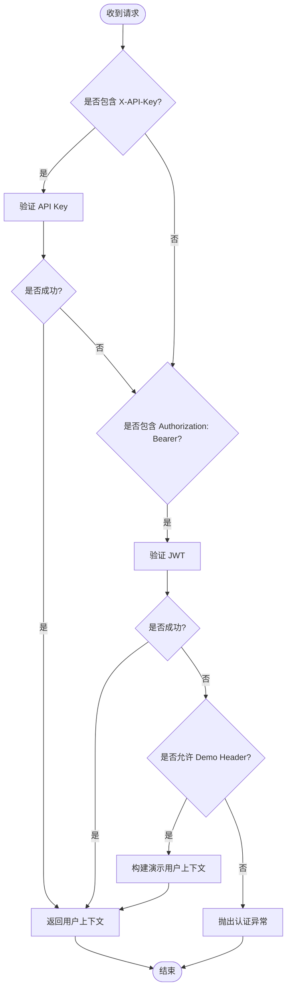
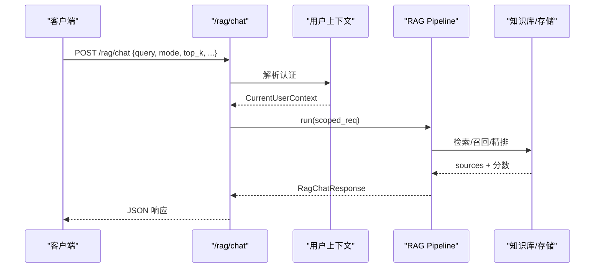
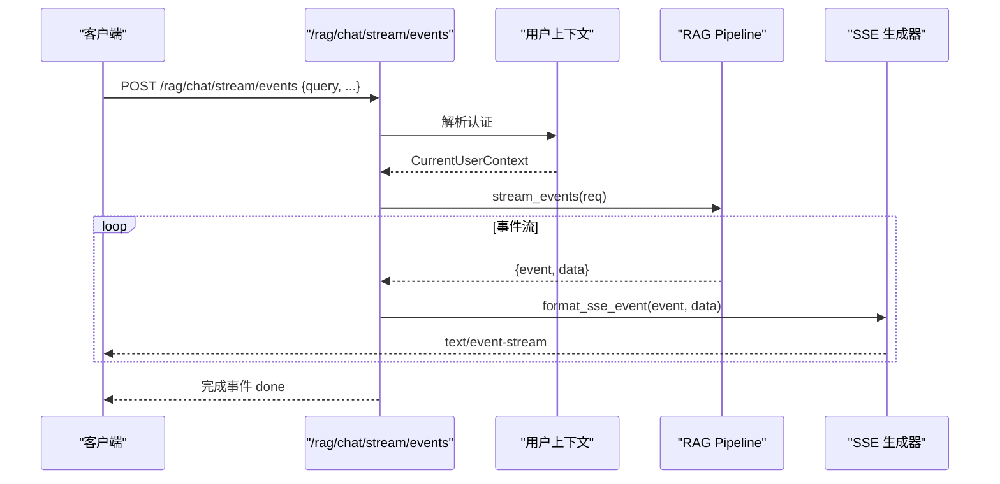
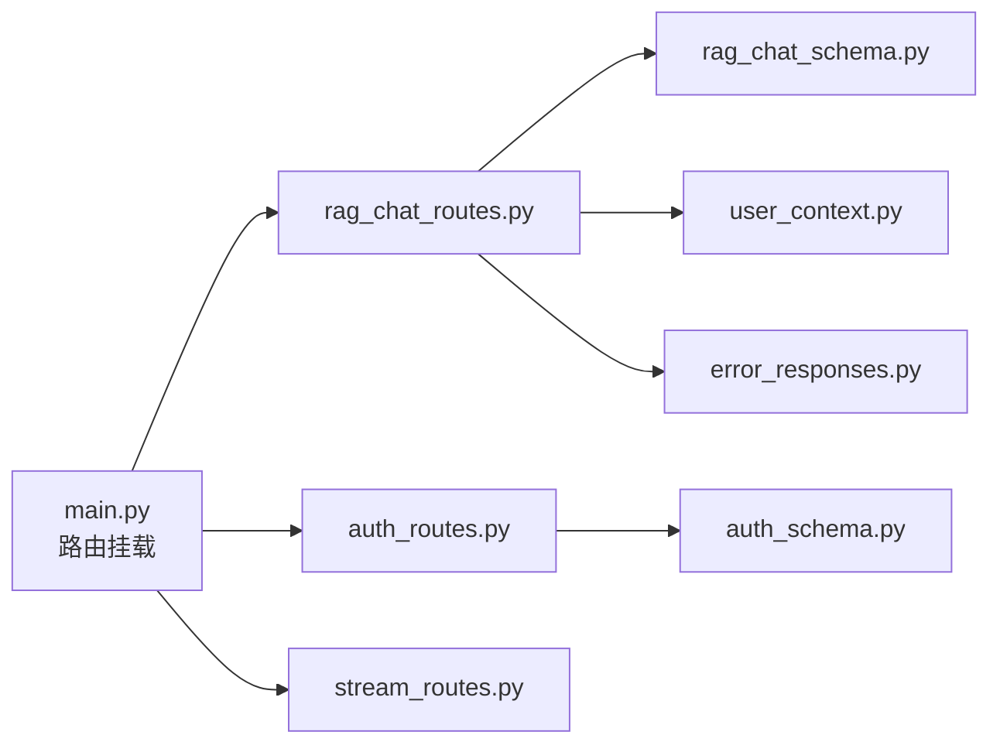

# API 接口参考

<cite>
**本文引用的文件**
- [src/fast_app/main.py](file://src/fast_app/main.py)
- [src/fast_app/api/rag_chat_routes.py](file://src/fast_app/api/rag_chat_routes.py)
- [src/fast_app/api/stream_routes.py](file://src/fast_app/api/stream_routes.py)
- [src/fast_app/schemas/rag_chat_schema.py](file://src/fast_app/schemas/rag_chat_schema.py)
- [src/fast_app/schemas/chat_schema.py](file://src/fast_app/schemas/chat_schema.py)
- [src/fast_app/api/auth_routes.py](file://src/fast_app/api/auth_routes.py)
- [src/fast_app/schemas/auth_schema.py](file://src/fast_app/schemas/auth_schema.py)
- [src/fast_app/dependencies/user_context.py](file://src/fast_app/dependencies/user_context.py)
- [src/fast_app/domain/user_context.py](file://src/fast_app/domain/user_context.py)
- [src/fast_app/core/error_responses.py](file://src/fast_app/core/error_responses.py)
</cite>

## 目录
1. [简介](#简介)
2. [项目结构](#项目结构)
3. [核心组件](#核心组件)
4. [架构总览](#架构总览)
5. [详细组件分析](#详细组件分析)
6. [依赖关系分析](#依赖关系分析)
7. [性能与流式处理注意事项](#性能与流式处理注意事项)
8. [故障排查指南](#故障排查指南)
9. [结论](#结论)
10. [附录：调用示例与客户端集成](#附录：调用示例与客户端集成)

## 简介
本接口参考文档面向前端开发者与第三方集成方，聚焦 RAG 主聊天接口与流式事件接口，覆盖以下要点：
- RESTful 端点、HTTP 方法、URL 模式
- 请求与响应模型字段说明
- 认证方式（JWT Bearer Token、API Key）
- 错误处理规范与统一错误体
- 参数校验规则
- SSE 事件类型与数据结构
- 实际调用示例与客户端集成建议

## 项目结构
FastAPI 应用通过生命周期管理外部资源（向量检索、关键词检索、重排、Redis、数据库等），并挂载多个路由模块。RAG 相关能力集中在 /rag 前缀下，流式演示在 /stream 前缀下，认证在 /auth 前缀下。

图表来源
- [src/fast_app/main.py:132-169](file://src/fast_app/main.py#L132-L169)

章节来源
- [src/fast_app/main.py:1-170](file://src/fast_app/main.py#L1-L170)

## 核心组件
- 认证与用户上下文
  - 支持两种认证：X-API-Key 头部或 Authorization: Bearer JWT
  - 未启用认证时可传入 X-Demo-User-Id 进行本地隔离测试
  - 解析结果以 CurrentUserContext 注入到各接口
- RAG 聊天接口
  - POST /rag/chat：一次性返回完整回答与来源
  - POST /rag/chat/stream/events：结构化 SSE 流式输出（sources、answer_delta、guard_sanitized、guard_blocked、done 等）
- 旧版兼容流式接口
  - POST /rag/chat/stream：已标记废弃，仅 token-only SSE
- 流式演示接口
  - GET /stream/text：纯文本流
  - GET /stream/sse：简单 SSE 演示

章节来源
- [src/fast_app/dependencies/user_context.py:16-62](file://src/fast_app/dependencies/user_context.py#L16-L62)
- [src/fast_app/api/rag_chat_routes.py:47-156](file://src/fast_app/api/rag_chat_routes.py#L47-L156)
- [src/fast_app/api/rag_chat_routes.py:277-311](file://src/fast_app/api/rag_chat_routes.py#L277-L311)
- [src/fast_app/api/stream_routes.py:17-37](file://src/fast_app/api/stream_routes.py#L17-L37)

## 架构总览
RAG 主链路从 HTTP 入口进入，经依赖注入获取当前用户上下文与 RAG Pipeline，执行检索、生成与权限控制，最终返回 JSON 或 SSE 事件。

图表来源
- [src/fast_app/api/rag_chat_routes.py:47-156](file://src/fast_app/api/rag_chat_routes.py#L47-L156)
- [src/fast_app/api/rag_chat_routes.py:277-311](file://src/fast_app/api/rag_chat_routes.py#L277-L311)
- [src/fast_app/dependencies/user_context.py:16-62](file://src/fast_app/dependencies/user_context.py#L16-L62)

## 详细组件分析

### 认证流程与鉴权头
- 支持的认证方式
  - X-API-Key：优先尝试 API Key 认证
  - Authorization: Bearer <token>：其次尝试 JWT 认证
  - X-Demo-User-Id：仅在配置允许时用于本地演示
- 失败策略
  - 开启认证且未提供有效凭证时抛出认证异常
  - 未开启认证时默认匿名上下文

图表来源
- [src/fast_app/dependencies/user_context.py:16-62](file://src/fast_app/dependencies/user_context.py#L16-L62)

章节来源
- [src/fast_app/dependencies/user_context.py:16-62](file://src/fast_app/dependencies/user_context.py#L16-L62)
- [src/fast_app/domain/user_context.py:9-41](file://src/fast_app/domain/user_context.py#L9-L41)

### 主聊天接口 POST /rag/chat
- 功能
  - 接收 RAG 查询请求，返回完整回答与来源
  - 可选 NL2SQL 直查路径（敏感数据集直接走结构化查询）
  - 自动附加 request_id、trace_id、knowledge_version、stale 信息
- 请求体关键字段
  - query：必填，去除空白后不能为空
  - mode：vector / keyword / hybrid，默认 hybrid
  - top_k：1-20，默认 5
  - min_score：0.0-1.0，默认 0.0
  - candidate_k：1-50，可选
  - filters.source_path、filters.section_path：检索过滤
  - allow_web_fallback、allow_direct_web：Web 搜索开关
  - min_knowledge_version：最小知识版本，低于活跃版本返回冲突
  - dataset_id、nl2sql_action：NL2SQL 场景绑定
- 响应体关键字段
  - request_id、trace_id、knowledge_version、stale、stale_doc_ids
  - query、answer、sources
  - clarification_*、route_*、agent_task_*、nl2sql_result 等扩展字段

图表来源
- [src/fast_app/api/rag_chat_routes.py:47-156](file://src/fast_app/api/rag_chat_routes.py#L47-L156)
- [src/fast_app/schemas/rag_chat_schema.py:17-134](file://src/fast_app/schemas/rag_chat_schema.py#L17-L134)
- [src/fast_app/schemas/rag_chat_schema.py:189-265](file://src/fast_app/schemas/rag_chat_schema.py#L189-L265)

章节来源
- [src/fast_app/api/rag_chat_routes.py:47-156](file://src/fast_app/api/rag_chat_routes.py#L47-L156)
- [src/fast_app/schemas/rag_chat_schema.py:17-134](file://src/fast_app/schemas/rag_chat_schema.py#L17-L134)
- [src/fast_app/schemas/rag_chat_schema.py:189-265](file://src/fast_app/schemas/rag_chat_schema.py#L189-L265)

### 流式接口 POST /rag/chat/stream/events
- 功能
  - 结构化 SSE 流式输出，事件包括 sources、answer_delta、guard_sanitized、guard_blocked、done 等
  - 支持 NL2SQL 敏感数据集的专用事件流
- 事件格式
  - 每个事件为两行：event: <类型> 与 data: <JSON>
  - done 事件携带 status、knowledge_version、stale、stale_doc_ids
- 与主接口的差异
  - 流式更适合长答案与增量渲染
  - 可结合 knowledge_version 判断引用文档是否过期

图表来源
- [src/fast_app/api/rag_chat_routes.py:217-311](file://src/fast_app/api/rag_chat_routes.py#L217-L311)

章节来源
- [src/fast_app/api/rag_chat_routes.py:217-311](file://src/fast_app/api/rag_chat_routes.py#L217-L311)

### 旧版兼容流式接口 POST /rag/chat/stream（已废弃）
- 行为
  - 返回 token-only SSE，不支持 NL2SQL 场景
  - 已标记 deprecated，建议使用 /rag/chat/stream/events
- 事件
  - 逐 token 推送 data
  - 结束时推送 event: done 与 data: [DONE]

章节来源
- [src/fast_app/api/rag_chat_routes.py:159-205](file://src/fast_app/api/rag_chat_routes.py#L159-L205)

### 流式演示接口
- GET /stream/text：纯文本流，便于测试客户端流式读取
- GET /stream/sse：简单 SSE 演示，便于测试事件解析

章节来源
- [src/fast_app/api/stream_routes.py:17-37](file://src/fast_app/api/stream_routes.py#L17-L37)

### 认证相关接口
- POST /auth/login：用户名/邮箱 + 密码换取 access_token 与 refresh_token
- POST /auth/refresh：使用 refresh_token 轮换新 token
- GET /auth/me：返回当前用户上下文摘要
- POST /auth/api-keys：创建 API Key（仅本次返回明文 key）
- GET /auth/api-keys：列出当前用户的 API Key 摘要
- DELETE /auth/api-keys/{api_key_id}：撤销指定 API Key

章节来源
- [src/fast_app/api/auth_routes.py:22-108](file://src/fast_app/api/auth_routes.py#L22-L108)
- [src/fast_app/schemas/auth_schema.py:8-123](file://src/fast_app/schemas/auth_schema.py#L8-L123)

## 依赖关系分析
- 路由注册
  - main.py 中集中 include_router，将 /rag、/auth、/stream 等路由挂载到 FastAPI 应用
- 依赖注入
  - get_current_user_context：统一解析认证头并返回用户上下文
  - get_rag_pipeline、get_db_session、get_nl2sql_service：由依赖层提供
- 数据模型
  - rag_chat_schema：定义 RAG 请求/响应、来源、分数拆解等
  - auth_schema：定义登录、刷新、API Key 等模型
  - user_context：定义当前用户上下文结构与权限快照

图表来源
- [src/fast_app/main.py:132-169](file://src/fast_app/main.py#L132-L169)
- [src/fast_app/api/rag_chat_routes.py:1-35](file://src/fast_app/api/rag_chat_routes.py#L1-L35)
- [src/fast_app/api/auth_routes.py:1-19](file://src/fast_app/api/auth_routes.py#L1-L19)
- [src/fast_app/api/stream_routes.py:1-8](file://src/fast_app/api/stream_routes.py#L1-L8)

章节来源
- [src/fast_app/main.py:132-169](file://src/fast_app/main.py#L132-L169)
- [src/fast_app/api/rag_chat_routes.py:1-35](file://src/fast_app/api/rag_chat_routes.py#L1-L35)
- [src/fast_app/api/auth_routes.py:1-19](file://src/fast_app/api/auth_routes.py#L1-L19)
- [src/fast_app/api/stream_routes.py:1-8](file://src/fast_app/api/stream_routes.py#L1-L8)

## 性能与流式处理注意事项
- 流式输出
  - 使用 StreamingResponse 与 async generator 实现低延迟增量输出
  - 结构化事件通过 format_sse_event 统一封装，避免重复序列化开销
- 超时与重试
  - 外部服务（如重排、ES、Milvus、Redis）在生命周期中创建并管理连接池
  - 建议在客户端侧实现重试与断线重连逻辑
- 版本一致性
  - 通过 min_knowledge_version 确保检索与回答基于一致的知识版本
  - done 事件中 stale/stale_doc_ids 提示引用文档是否已更新

[本节为通用指导，不直接分析具体代码文件]

## 故障排查指南
- 认证失败
  - 确认是否提供有效的 X-API-Key 或 Authorization: Bearer
  - 若开启认证但未提供凭证，会抛出认证异常
- 参数校验失败
  - query、session_id 等字段存在长度与空白字符校验
  - dataset_id 与 nl2sql_action 必须成对出现
- 知识版本冲突
  - 当 min_knowledge_version 高于活跃版本时返回冲突
- 内部错误
  - 统一错误体包含 code、message、error_category、request_id、trace_id
  - 流式错误通过 event: error 推送

章节来源
- [src/fast_app/dependencies/user_context.py:48-62](file://src/fast_app/dependencies/user_context.py#L48-L62)
- [src/fast_app/schemas/rag_chat_schema.py:106-134](file://src/fast_app/schemas/rag_chat_schema.py#L106-L134)
- [src/fast_app/core/error_responses.py:7-64](file://src/fast_app/core/error_responses.py#L7-L64)

## 结论
本接口参考明确了 RAG 主聊天与流式事件的使用方式、认证机制、错误规范与数据结构。建议生产环境优先采用 /rag/chat/stream/events 以获得更好的用户体验与可控性；同时结合 knowledge_version 与 stale 字段做好缓存与失效策略。

[本节为总结，不直接分析具体代码文件]

## 附录：调用示例与客户端集成

### 认证
- 登录获取 JWT
  - POST /auth/login
  - 请求体：username_or_email、password
  - 响应：access_token、refresh_token、token_type、expires_in
- 刷新 Token
  - POST /auth/refresh
  - 请求体：refresh_token
- 创建 API Key
  - POST /auth/api-keys
  - 请求体：name、expires_at（可选）
  - 响应：id、name、api_key（仅本次返回）、key_prefix、key_fingerprint、expires_at
- 列出/撤销 API Key
  - GET /auth/api-keys
  - DELETE /auth/api-keys/{api_key_id}

章节来源
- [src/fast_app/api/auth_routes.py:22-108](file://src/fast_app/api/auth_routes.py#L22-L108)
- [src/fast_app/schemas/auth_schema.py:8-123](file://src/fast_app/schemas/auth_schema.py#L8-L123)

### 主聊天接口
- POST /rag/chat
- 请求头
  - X-API-Key 或 Authorization: Bearer <token>
- 请求体关键字段
  - query、mode、top_k、min_score、candidate_k、filters、allow_web_fallback、allow_direct_web、min_knowledge_version、dataset_id、nl2sql_action
- 响应关键字段
  - request_id、trace_id、knowledge_version、stale、stale_doc_ids、query、answer、sources、clarification_*、route_*、agent_task_*、nl2sql_result

章节来源
- [src/fast_app/api/rag_chat_routes.py:47-156](file://src/fast_app/api/rag_chat_routes.py#L47-L156)
- [src/fast_app/schemas/rag_chat_schema.py:17-134](file://src/fast_app/schemas/rag_chat_schema.py#L17-L134)
- [src/fast_app/schemas/rag_chat_schema.py:189-265](file://src/fast_app/schemas/rag_chat_schema.py#L189-L265)

### 流式事件接口
- POST /rag/chat/stream/events
- 请求头
  - X-API-Key 或 Authorization: Bearer <token>
- 事件类型
  - sources：检索来源
  - answer_delta：答案增量
  - guard_sanitized：内容安全清洗后的片段
  - guard_blocked：被拦截的内容片段
  - done：完成事件，包含 status、knowledge_version、stale、stale_doc_ids
  - error：错误事件，包含统一错误体
- 事件格式
  - 每行 event: <类型>
  - 下一行 data: <JSON>
  - 空行分隔

章节来源
- [src/fast_app/api/rag_chat_routes.py:217-311](file://src/fast_app/api/rag_chat_routes.py#L217-L311)
- [src/fast_app/core/error_responses.py:7-64](file://src/fast_app/core/error_responses.py#L7-L64)

### 客户端集成建议
- 流式读取
  - 使用支持 SSE 的客户端库或原生 EventSource/ReadableStream
  - 按事件类型分别处理 sources、answer_delta、guard_*、done、error
- 重试与降级
  - 网络中断时重连并续传
  - 遇到系统错误可回退为非流式 /rag/chat
- 版本与缓存
  - 记录 knowledge_version 与 stale_doc_ids
  - 对 stale 的引用进行局部刷新或重新检索

[本节为通用指导，不直接分析具体代码文件]