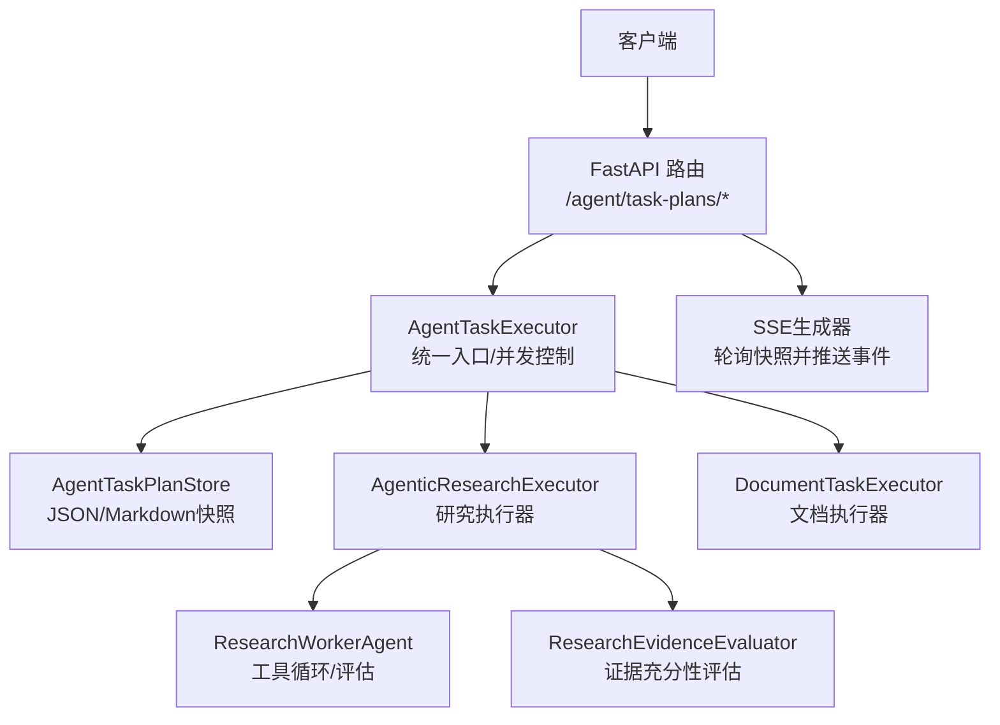
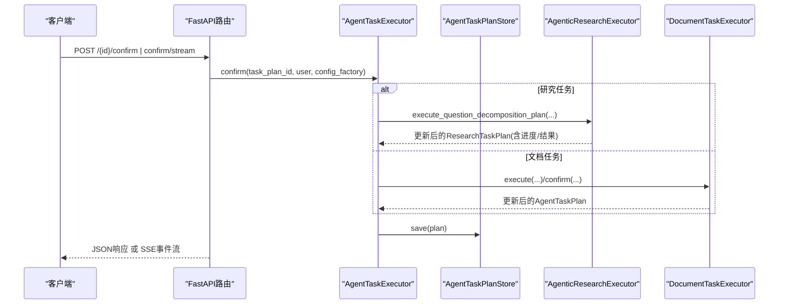
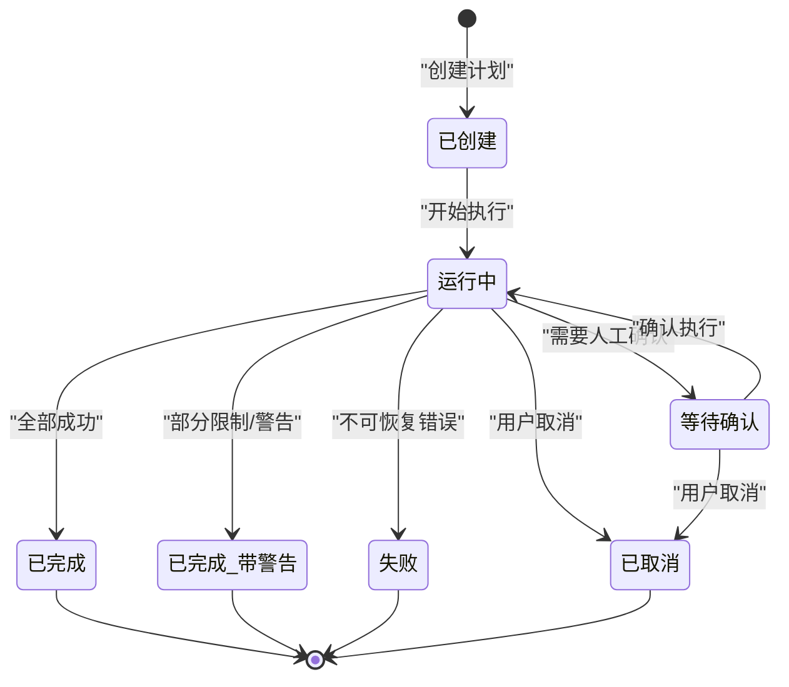
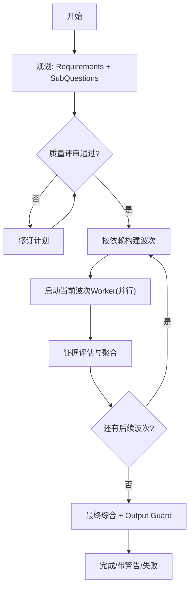
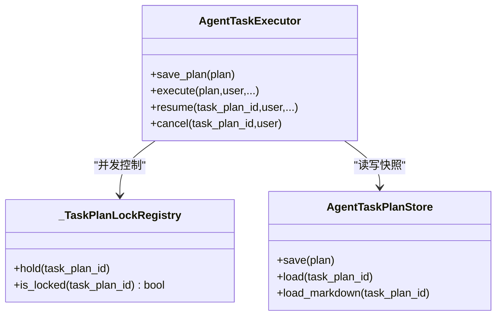
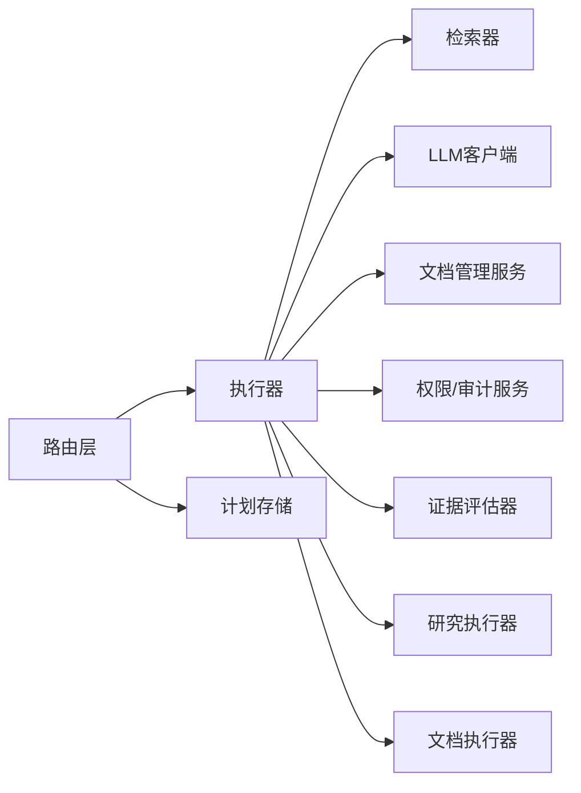

# Agent任务接口

<cite>
**本文引用的文件**
- [agent_task_plan_routes.py](file://python-agent-study/src/fast_app/api/agent_task_plan_routes.py)
- [agent_task_plan.py](file://python-agent-study/src/fast_app/domain/agent_task_plan.py)
- [research_task_plan.py](file://python-agent-study/src/fast_app/domain/research_task_plan.py)
- [agent_task_executor.py](file://python-agent-study/src/fast_app/services/agent_tasks/agent_task_executor.py)
- [agent_task_plan_store.py](file://python-agent-study/src/fast_app/services/agent_tasks/agent_task_plan_store.py)
</cite>

## 目录
1. [简介](#简介)
2. [项目结构](#项目结构)
3. [核心组件](#核心组件)
4. [架构总览](#架构总览)
5. [详细组件分析](#详细组件分析)
6. [依赖关系分析](#依赖关系分析)
7. [性能与调度](#性能与调度)
8. [故障排查指南](#故障排查指南)
9. [结论](#结论)
10. [附录：API契约与Schema](#附录api契约与schema)

## 简介
本文件面向“Agent任务管理”的RESTful接口，覆盖任务计划创建、查询、执行与状态管理的完整生命周期。重点说明：
- 意图识别、任务分解、并行执行与结果聚合的工作流程
- 任务计划的JSON Schema定义、状态转换图与生命周期管理
- 复杂研究任务的创建与执行示例（含依赖关系与错误处理）
- 任务调度与资源管理机制（并发控制、取消、重试、SSE进度推送）

## 项目结构
围绕Agent任务的核心代码分布在以下模块：
- API路由层：暴露任务计划查询、确认、取消、重试以及SSE流式进度接口
- 领域模型层：定义两类TaskPlan（通用文档管理与研究问题拆解）、状态枚举、子问题、证据与评审等
- 服务层：统一执行器Facade、任务快照存储、能力/权限校验、质量评审与验证
- 运行时持久化：以原子方式写入JSON与Markdown快照，供查询与审查使用

图表来源
- [agent_task_plan_routes.py:111-283](file://python-agent-study/src/fast_app/api/agent_task_plan_routes.py#L111-L283)
- [agent_task_executor.py:135-200](file://python-agent-study/src/fast_app/services/agent_tasks/agent_task_executor.py#L135-L200)
- [agent_task_plan_store.py:23-105](file://python-agent-study/src/fast_app/services/agent_tasks/agent_task_plan_store.py#L23-L105)

章节来源
- [agent_task_plan_routes.py:111-283](file://python-agent-study/src/fast_app/api/agent_task_plan_routes.py#L111-L283)
- [agent_task_executor.py:135-200](file://python-agent-study/src/fast_app/services/agent_tasks/agent_task_executor.py#L135-L200)
- [agent_task_plan_store.py:23-105](file://python-agent-study/src/fast_app/services/agent_tasks/agent_task_plan_store.py#L23-L105)

## 核心组件
- 路由层
  - GET /{task_plan_id}：读取任务计划（返回安全公开视图）
  - GET /{task_plan_id}/markdown：读取人类可读的Markdown审查视图
  - POST /{task_plan_id}/confirm：人工确认后执行等待确认的计划
  - POST /{task_plan_id}/confirm/stream：确认后通过SSE实时推送执行进度与最终输出
  - POST /{task_plan_id}/cancel：取消运行中的任务
  - POST /{task_plan_id}/retry：恢复可重试的任务
- 领域模型
  - AgentTaskPlan：通用文档管理类任务计划
  - ResearchTaskPlan：研究类问题拆解任务计划（v2），包含需求、子问题、证据注册表、评审与进度
- 执行器
  - AgentTaskExecutor：统一入口，负责鉴权、并发锁、分派到研究或文档执行器
  - AgentTaskPlanStore：原子写入JSON与Markdown快照，提供load/save/load_markdown
- 研究与文档执行器
  - AgenticResearchExecutor：多Worker波次调度、证据聚合、最终综合
  - DocumentTaskExecutor：文档内容生产/变更建议与确认执行

章节来源
- [agent_task_plan_routes.py:111-283](file://python-agent-study/src/fast_app/api/agent_task_plan_routes.py#L111-L283)
- [agent_task_plan.py:26-324](file://python-agent-study/src/fast_app/domain/agent_task_plan.py#L26-L324)
- [research_task_plan.py:787-824](file://python-agent-study/src/fast_app/domain/research_task_plan.py#L787-L824)
- [agent_task_executor.py:135-200](file://python-agent-study/src/fast_app/services/agent_tasks/agent_task_executor.py#L135-L200)
- [agent_task_plan_store.py:23-105](file://python-agent-study/src/fast_app/services/agent_tasks/agent_task_plan_store.py#L23-L105)

## 架构总览
下图展示从HTTP请求到执行器、再到Worker与快照存储的调用链，以及SSE轮询机制。

图表来源
- [agent_task_plan_routes.py:201-283](file://python-agent-study/src/fast_app/api/agent_task_plan_routes.py#L201-L283)
- [agent_task_executor.py:280-339](file://python-agent-study/src/fast_app/services/agent_tasks/agent_task_executor.py#L280-L339)
- [agent_task_plan_store.py:29-45](file://python-agent-study/src/fast_app/services/agent_tasks/agent_task_plan_store.py#L29-L45)

## 详细组件分析

### RESTful API契约
- 查询计划
  - GET /{task_plan_id}：返回公开视图；仅允许查看自己创建的计划或系统管理员
  - GET /{task_plan_id}/markdown：返回人类可读的Markdown审查视图
- 控制计划
  - POST /{task_plan_id}/confirm：需confirmed=true；进入执行并返回最终快照
  - POST /{task_plan_id}/confirm/stream：确认后以SSE推送状态、子问题完成、证据评估、最终输出与done事件
  - POST /{task_plan_id}/cancel：将状态置为已取消，清理未终态步骤/Worker
  - POST /{task_plan_id}/retry：按最近完整快照恢复执行（受限于当前状态）

章节来源
- [agent_task_plan_routes.py:111-283](file://python-agent-study/src/fast_app/api/agent_task_plan_routes.py#L111-L283)
- [agent_task_plan_routes.py:286-433](file://python-agent-study/src/fast_app/api/agent_task_plan_routes.py#L286-L433)
- [agent_task_plan_routes.py:436-668](file://python-agent-study/src/fast_app/api/agent_task_plan_routes.py#L436-L668)

### 任务计划Schema与公开视图
- 通用任务计划（AgentTaskPlan）
  - 关键字段：task_plan_id、task_kind、user_id、original_query、objective、task_type、goal、sub_questions、research_policy、final_synthesis_instruction、source_query、target_path、report_title、status、steps、final_output、created_at、updated_at、error
- 研究任务计划（ResearchTaskPlan v2）
  - 关键字段：schema_version=2、task_plan_id、task_kind="question_decomposition"、task_type="analysis"、user_id、original_query、source_query、objective、final_synthesis_instruction、requirements、sub_questions、quality_review、validation_issues、capability_snapshot、research_policy、progress、worker_checkpoints、sub_question_results、evidence_registry、requirement_evidence_statuses、status、final_output、created_at、updated_at、error_code、error_message
- 公开视图
  - ResearchTaskPlanPublicView：隐藏敏感字段，仅暴露安全可见的能力摘要、进度、证据引用、需求状态与最终输出

章节来源
- [agent_task_plan.py:26-324](file://python-agent-study/src/fast_app/domain/agent_task_plan.py#L26-L324)
- [research_task_plan.py:787-824](file://python-agent-study/src/fast_app/domain/research_task_plan.py#L787-L824)
- [research_task_plan.py:868-954](file://python-agent-study/src/fast_app/domain/research_task_plan.py#L868-L954)

### 状态机与生命周期
- 任务整体状态（AgentTaskPlanStatus）
  - created → running → waiting_confirmation → completed/completed_with_warnings/failed/cancelled
- 工具步骤状态（AgentToolStepStatus）
  - pending → running → waiting_confirmation → completed/failed/skipped
- 研究Worker阶段（ResearchWorkerStage）
  - starting → tool_setup → tool_selection → tool_execution → answer_generation → evidence_evaluation → retry_preparation → completed
- 取消与重试
  - cancel：立即标记CANCELLED，并将pending/running的Worker/步骤收敛为skipped
  - retry：仅在允许的状态下恢复（研究：running/failed/completed_with_warnings；文档：running/failed）

图表来源
- [agent_task_plan.py:26-47](file://python-agent-study/src/fast_app/domain/agent_task_plan.py#L26-L47)
- [agent_task_executor.py:212-278](file://python-agent-study/src/fast_app/services/agent_tasks/agent_task_executor.py#L212-L278)
- [agent_task_executor.py:341-400](file://python-agent-study/src/fast_app/services/agent_tasks/agent_task_executor.py#L341-L400)

章节来源
- [agent_task_plan.py:26-47](file://python-agent-study/src/fast_app/domain/agent_task_plan.py#L26-L47)
- [agent_task_executor.py:212-278](file://python-agent-study/src/fast_app/services/agent_tasks/agent_task_executor.py#L212-L278)
- [agent_task_executor.py:341-400](file://python-agent-study/src/fast_app/services/agent_tasks/agent_task_executor.py#L341-L400)

### 工作流：意图识别、任务分解、并行执行与结果聚合
- 意图识别与规划
  - Router/Planner根据用户输入与历史解析出resolved query，生成Requirements与SubQuestion候选
  - Reviewer进行质量门禁，产出accepted/revised计划
- 任务分解与依赖
  - SubQuestion之间声明depends_on，形成依赖图；执行器按波次（wave）组织并行执行
- 并行执行
  - 每个SubQuestion由ResearchWorkerAgent驱动，内部包含工具选择、执行、答案生成与证据评估
  - 同一波次内多个Worker可并行执行；跨波次按依赖顺序推进
- 结果聚合
  - 每个Worker产出结构化证据ID，进入Evidence Registry
  - Aggregator依据ExpectedEvidence阈值计算Requirement证据状态（satisfied/partially_satisfied/failed/pending）
  - 最终综合阶段结合所有Requirement状态生成最终答案，并通过Output Guard后持久化

图表来源
- [research_task_plan.py:200-244](file://python-agent-study/src/fast_app/domain/research_task_plan.py#L200-L244)
- [research_task_plan.py:631-770](file://python-agent-study/src/fast_app/domain/research_task_plan.py#L631-L770)
- [research_task_plan.py:772-824](file://python-agent-study/src/fast_app/domain/research_task_plan.py#L772-L824)

章节来源
- [research_task_plan.py:200-244](file://python-agent-study/src/fast_app/domain/research_task_plan.py#L200-L244)
- [research_task_plan.py:631-770](file://python-agent-study/src/fast_app/domain/research_task_plan.py#L631-L770)
- [research_task_plan.py:772-824](file://python-agent-study/src/fast_app/domain/research_task_plan.py#L772-L824)

### 执行器与并发控制
- 统一入口
  - AgentTaskExecutor根据task_kind分派到研究或文档执行器
  - 在confirm/retry时重新加载TaskPlan并以当前用户重建ACL
- 进程内互斥
  - _TaskPlanLockRegistry：按task_plan_id分配asyncio.Lock，防止同一任务被重复confirm/retry
  - cancel不进入长锁，直接写状态，让运行节点在安全边界停止
- 恢复策略
  - Research：基于TaskPlan中的Worker结果快照，重跑partial/failed/skipped与未开始子问题
  - 文档：LangGraph checkpoint或legacy final_output.checkpoint

图表来源
- [agent_task_executor.py:81-132](file://python-agent-study/src/fast_app/services/agent_tasks/agent_task_executor.py#L81-L132)
- [agent_task_executor.py:135-200](file://python-agent-study/src/fast_app/services/agent_tasks/agent_task_executor.py#L135-L200)
- [agent_task_plan_store.py:23-105](file://python-agent-study/src/fast_app/services/agent_tasks/agent_task_plan_store.py#L23-L105)

章节来源
- [agent_task_executor.py:81-132](file://python-agent-study/src/fast_app/services/agent_tasks/agent_task_executor.py#L81-L132)
- [agent_task_executor.py:135-200](file://python-agent-study/src/fast_app/services/agent_tasks/agent_task_executor.py#L135-L200)
- [agent_task_executor.py:212-400](file://python-agent-study/src/fast_app/services/agent_tasks/agent_task_executor.py#L212-L400)
- [agent_task_plan_store.py:23-105](file://python-agent-study/src/fast_app/services/agent_tasks/agent_task_plan_store.py#L23-L105)

### SSE进度与事件协议
- 事件类型
  - agent_task_execution_started：执行开始
  - agent_task_status：任务级状态变化
  - sub_question_started：子问题开始（含wave/attempt）
  - agent_task_research_wave_started / worker_progress / timed_out / sub_question_retrying / evidence_evaluated
  - agent_task_step_completed / agent_task_step_failed：工具步骤完成/失败
  - sub_question_evidence_updated / sub_question_completed：子问题证据更新/完成
  - requirement_satisfied / requirement_insufficient / requirement_evidence_updated：需求满足度变化
  - agent_task_document_*：文档相关事件（草稿、审阅、修订等）
  - sources：最终输出来源
  - agent_task_final_synthesis_completed：最终综合完成
  - done：执行结束
- 去重机制
  - 使用seen_sub_questions、seen_steps、seen_research_events集合避免重复推送
- 最终输出保护
  - 对最终答案进行分段token化，交由Prompt Guard检查，再逐步emit

章节来源
- [agent_task_plan_routes.py:286-433](file://python-agent-study/src/fast_app/api/agent_task_plan_routes.py#L286-L433)
- [agent_task_plan_routes.py:436-668](file://python-agent-study/src/fast_app/api/agent_task_plan_routes.py#L436-L668)

## 依赖关系分析
- 路由层依赖
  - 依赖执行器、计划存储、提示词守卫、设置与上下文
- 执行器依赖
  - 检索器、LLM客户端、文档管理服务、权限与审计服务、证据评估器、研究执行器、文档执行器
- 存储依赖
  - 配置项指定任务计划目录，原子写入JSON与Markdown

图表来源
- [agent_task_plan_routes.py:11-38](file://python-agent-study/src/fast_app/api/agent_task_plan_routes.py#L11-L38)
- [agent_task_executor.py:142-200](file://python-agent-study/src/fast_app/services/agent_tasks/agent_task_executor.py#L142-L200)
- [agent_task_plan_store.py:23-45](file://python-agent-study/src/fast_app/services/agent_tasks/agent_task_plan_store.py#L23-L45)

章节来源
- [agent_task_plan_routes.py:11-38](file://python-agent-study/src/fast_app/api/agent_task_plan_routes.py#L11-L38)
- [agent_task_executor.py:142-200](file://python-agent-study/src/fast_app/services/agent_tasks/agent_task_executor.py#L142-L200)
- [agent_task_plan_store.py:23-45](file://python-agent-study/src/fast_app/services/agent_tasks/agent_task_plan_store.py#L23-L45)

## 性能与调度
- 并发控制
  - 进程内按task_plan_id互斥，避免重复执行；cancel走快速路径，不阻塞长任务
- 并行执行
  - 研究任务按波次并行执行子问题；SSE每秒轮询快照，去重推送事件
- 持久化
  - 原子写入JSON与Markdown，避免读到半份快照
- 资源管理
  - 通过能力快照与来源策略限制Web/NL2SQL/知识库的使用范围
  - 工具调用轨迹与证据数量作为内部检查点，便于诊断与限流

章节来源
- [agent_task_executor.py:81-132](file://python-agent-study/src/fast_app/services/agent_tasks/agent_task_executor.py#L81-L132)
- [agent_task_plan_routes.py:286-433](file://python-agent-study/src/fast_app/api/agent_task_plan_routes.py#L286-L433)
- [agent_task_plan_store.py:46-68](file://python-agent-study/src/fast_app/services/agent_tasks/agent_task_plan_store.py#L46-L68)

## 故障排查指南
- 常见错误
  - 非法task_plan_id：格式校验失败
  - 任务不存在：找不到对应快照
  - 权限不足：只能查看/取消自己创建的计划
  - 任务繁忙：同一任务正在执行，拒绝重复confirm/retry
  - 状态不允许：cancel/retry对当前状态不合法
- 定位方法
  - 通过SSE事件追踪子问题与Worker阶段
  - 查看Markdown审查视图了解计划结构与执行进度
  - 关注Requirement证据状态与Evidence Registry中的合法证据ID

章节来源
- [agent_task_plan_store.py:69-86](file://python-agent-study/src/fast_app/services/agent_tasks/agent_task_plan_store.py#L69-L86)
- [agent_task_plan_routes.py:111-140](file://python-agent-study/src/fast_app/api/agent_task_plan_routes.py#L111-L140)
- [agent_task_executor.py:212-278](file://python-agent-study/src/fast_app/services/agent_tasks/agent_task_executor.py#L212-L278)
- [agent_task_executor.py:341-400](file://python-agent-study/src/fast_app/services/agent_tasks/agent_task_executor.py#L341-L400)

## 结论
该Agent任务接口提供了完整的任务计划生命周期管理能力，支持研究类问题的意图识别、任务分解、并行执行与结果聚合，并通过SSE提供细粒度执行进度。统一的执行器Facade确保跨任务类型的并发控制、权限重建与恢复策略一致。配合原子快照存储与严格的质量评审，可在保证安全性的前提下高效完成复杂研究任务。

## 附录：API契约与Schema

### 接口清单
- GET /{task_plan_id}：读取任务计划（公开视图）
- GET /{task_plan_id}/markdown：读取Markdown审查视图
- POST /{task_plan_id}/confirm：确认并执行
- POST /{task_plan_id}/confirm/stream：确认后以SSE推送执行进度与最终输出
- POST /{task_plan_id}/cancel：取消任务
- POST /{task_plan_id}/retry：恢复任务

章节来源
- [agent_task_plan_routes.py:111-283](file://python-agent-study/src/fast_app/api/agent_task_plan_routes.py#L111-L283)

### 关键Schema要点
- 任务计划状态
  - created、running、waiting_confirmation、completed、completed_with_warnings、failed、cancelled
- 工具步骤状态
  - pending、running、waiting_confirmation、completed、failed、skipped
- 研究Worker阶段
  - starting、tool_setup、tool_selection、tool_execution、answer_generation、evidence_evaluation、retry_preparation、completed
- 证据类型
  - knowledge_chunk、web_citation、sql_query_result、derived_synthesis
- 需求证据状态
  - pending、partially_satisfied、satisfied、failed

章节来源
- [agent_task_plan.py:26-47](file://python-agent-study/src/fast_app/domain/agent_task_plan.py#L26-L47)
- [research_task_plan.py:18-72](file://python-agent-study/src/fast_app/domain/research_task_plan.py#L18-L72)
- [research_task_plan.py:362-400](file://python-agent-study/src/fast_app/domain/research_task_plan.py#L362-L400)

### 复杂研究任务示例（概念流程）
- 创建计划
  - 输入原始问题，服务端解析为resolved query，生成Requirements与SubQuestion候选
  - Reviewer质量门禁通过后保存为ResearchTaskPlan v2
- 执行计划
  - 按依赖构建波次，并行执行子问题
  - 每步记录工具调用轨迹与证据ID，评估证据充分性
  - 最终综合生成答案，经Output Guard后持久化
- 依赖与错误处理
  - 依赖失败的子问题会被跳过，上层聚合继续推进
  - 可通过retry恢复失败或部分完成的子问题
  - 通过SSE观察各阶段事件，定位瓶颈与错误原因

章节来源
- [research_task_plan.py:200-244](file://python-agent-study/src/fast_app/domain/research_task_plan.py#L200-L244)
- [research_task_plan.py:631-770](file://python-agent-study/src/fast_app/domain/research_task_plan.py#L631-L770)
- [research_task_plan.py:772-824](file://python-agent-study/src/fast_app/domain/research_task_plan.py#L772-L824)
- [agent_task_plan_routes.py:286-433](file://python-agent-study/src/fast_app/api/agent_task_plan_routes.py#L286-L433)