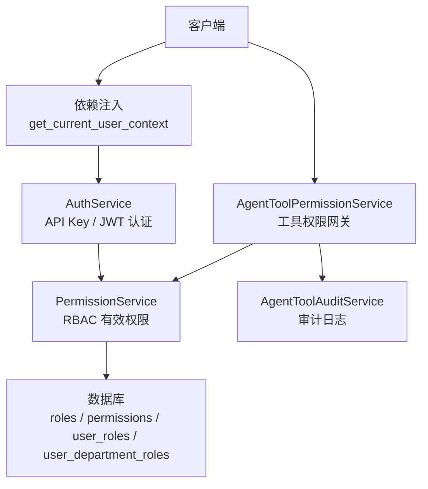
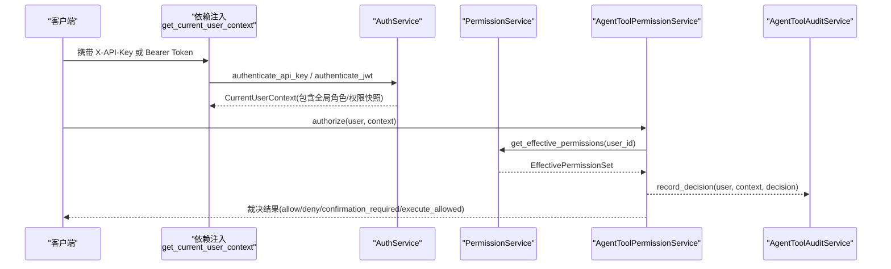
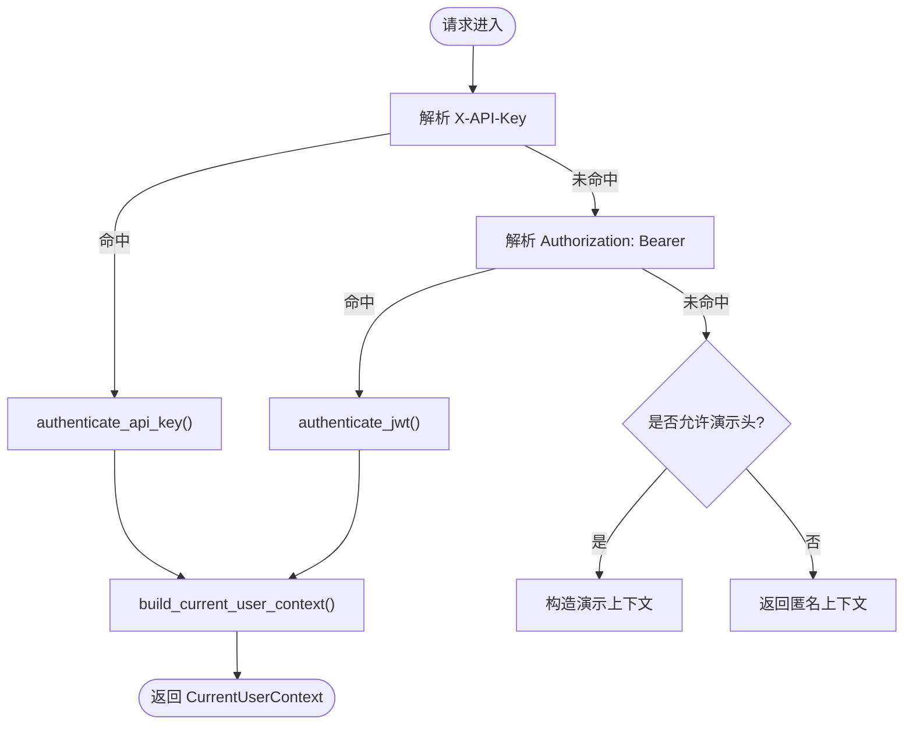
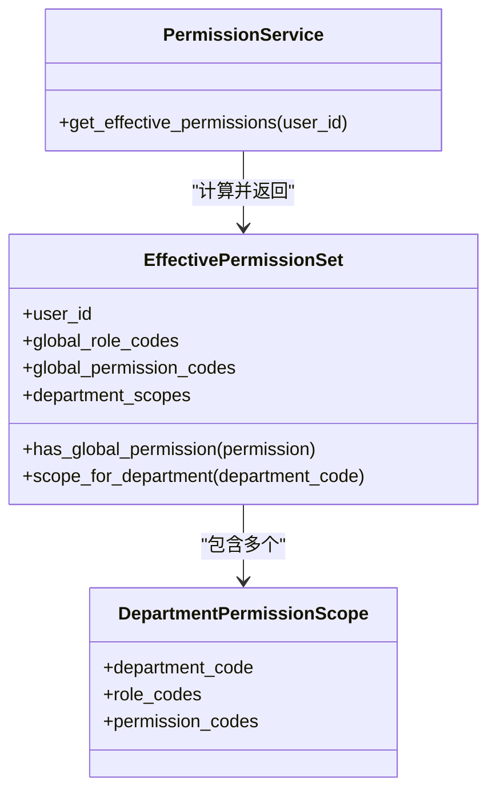
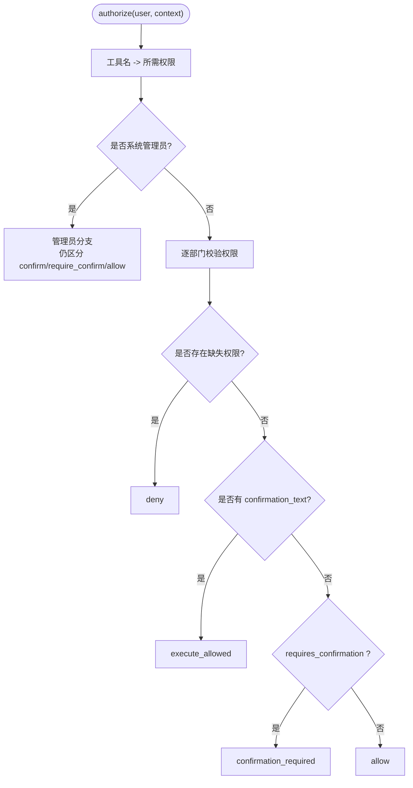
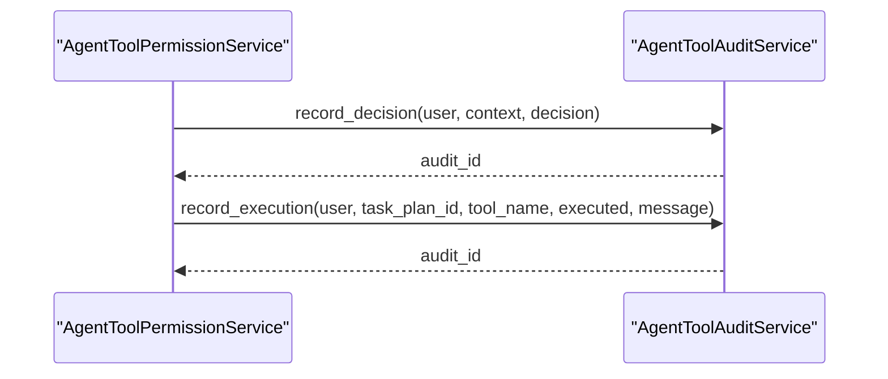
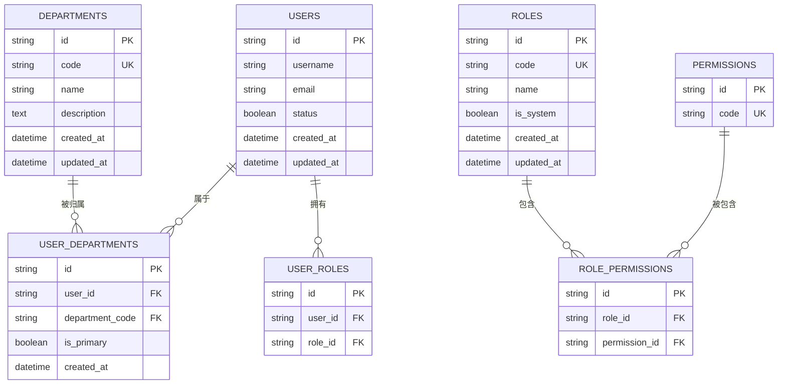
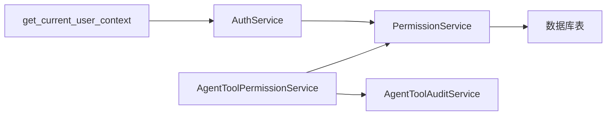

# 任务安全与权限

<cite>
**本文引用的文件**
- [src/fast_app/domain/agent_tool_permissions.py](file://src/fast_app/domain/agent_tool_permissions.py)
- [src/fast_app/services/auth/auth_service.py](file://src/fast_app/services/auth/auth_service.py)
- [src/fast_app/services/auth/permission_service.py](file://src/fast_app/services/auth/permission_service.py)
- [src/fast_app/dependencies/user_context.py](file://src/fast_app/dependencies/user_context.py)
- [src/fast_app/api/auth_routes.py](file://src/fast_app/api/auth_routes.py)
- [src/fast_app/services/agent_tasks/agent_tool_permission_service.py](file://src/fast_app/services/agent_tasks/agent_tool_permission_service.py)
- [src/fast_app/services/agent_tasks/agent_tool_audit_service.py](file://src/fast_app/services/agent_tasks/agent_tool_audit_service.py)
- [src/fast_app/db/auth_tables.py](file://src/fast_app/db/auth_tables.py)
- [alembic/versions/20260628_0004_create_department_acl_tables.py](file://alembic/versions/20260628_0004_create_department_acl_tables.py)
- [alembic/versions/20260704_0005_create_agent_tool_permission_tables.py](file://alembic/versions/20260704_0005_create_agent_tool_permission_tables.py)
- [scripts/tests/document_security/test_agent_tool_permission_policy.py](file://scripts/tests/document_security/test_agent_tool_permission_policy.py)
- [scripts/tests/document_security/test_rbac_auth_migration.py](file://scripts/tests/document_security/test_rbac_auth_migration.py)
</cite>

## 目录
1. [简介](#简介)
2. [项目结构](#项目结构)
3. [核心组件](#核心组件)
4. [架构总览](#架构总览)
5. [详细组件分析](#详细组件分析)
6. [依赖关系分析](#依赖关系分析)
7. [性能与安全考量](#性能与安全考量)
8. [故障排查指南](#故障排查指南)
9. [结论](#结论)
10. [附录：权限配置与管理接口示例](#附录：权限配置与管理接口示例)

## 简介
本文件聚焦 Agent 任务的安全与权限管理，覆盖用户身份认证、任务访问控制、基于角色的权限检查、部门级隔离、工具调用权限验证流程（含敏感操作确认机制）、权限配置与管理接口使用示例，以及执行过程中的安全审计与日志记录。目标是帮助开发者与运维人员理解并正确使用系统的安全能力，确保 Agent 在可控范围内完成任务。

## 项目结构
本项目将安全与权限相关的能力分布在以下层次：
- 请求入口层：统一解析认证头，生成当前用户上下文
- 认证服务层：支持 API Key、JWT、登录刷新等认证方式，并构建统一上下文
- 权限服务层：从数据库读取 RBAC 角色与权限，计算有效权限集合
- 工具权限网关：根据工具名、目标部门、风险等级和确认状态进行裁决
- 审计服务：对权限决策与工具执行进行结构化日志记录
- 数据模型与迁移：定义部门、角色、权限、用户-部门-角色等表结构

图表来源
- [src/fast_app/dependencies/user_context.py:16-62](file://src/fast_app/dependencies/user_context.py#L16-L62)
- [src/fast_app/services/auth/auth_service.py:114-170](file://src/fast_app/services/auth/auth_service.py#L114-L170)
- [src/fast_app/services/auth/permission_service.py:17-50](file://src/fast_app/services/auth/permission_service.py#L17-L50)
- [src/fast_app/services/agent_tasks/agent_tool_permission_service.py:53-83](file://src/fast_app/services/agent_tasks/agent_tool_permission_service.py#L53-L83)
- [src/fast_app/services/agent_tasks/agent_tool_audit_service.py:23-48](file://src/fast_app/services/agent_tasks/agent_tool_audit_service.py#L23-L48)

章节来源
- [src/fast_app/dependencies/user_context.py:16-62](file://src/fast_app/dependencies/user_context.py#L16-L62)
- [src/fast_app/services/auth/auth_service.py:114-170](file://src/fast_app/services/auth/auth_service.py#L114-L170)
- [src/fast_app/services/auth/permission_service.py:17-50](file://src/fast_app/services/auth/permission_service.py#L17-L50)
- [src/fast_app/services/agent_tasks/agent_tool_permission_service.py:53-83](file://src/fast_app/services/agent_tasks/agent_tool_permission_service.py#L53-L83)
- [src/fast_app/services/agent_tasks/agent_tool_audit_service.py:23-48](file://src/fast_app/services/agent_tasks/agent_tool_audit_service.py#L23-L48)

## 核心组件
- 当前用户上下文：统一封装认证来源、全局角色与权限快照、部门范围等信息，供后续链路消费
- 认证服务：提供登录、刷新令牌、API Key 认证、构建当前用户上下文
- 权限服务：从数据库加载全局角色、全局权限、部门角色与部门权限，组装为有效权限集
- 工具权限网关：依据工具名映射到所需权限，结合目标部门与风险等级，输出 allow/deny/confirmation_required/execute_allowed 等裁决
- 审计服务：记录权限决策与工具执行的结构化日志，便于追踪与审计

章节来源
- [src/fast_app/domain/user_context.py:9-51](file://src/fast_app/domain/user_context.py#L9-L51)
- [src/fast_app/services/auth/auth_service.py:35-51](file://src/fast_app/services/auth/auth_service.py#L35-L51)
- [src/fast_app/services/auth/permission_service.py:11-50](file://src/fast_app/services/auth/permission_service.py#L11-L50)
- [src/fast_app/services/agent_tasks/agent_tool_permission_service.py:42-83](file://src/fast_app/services/agent_tasks/agent_tool_permission_service.py#L42-L83)
- [src/fast_app/services/agent_tasks/agent_tool_audit_service.py:17-48](file://src/fast_app/services/agent_tasks/agent_tool_audit_service.py#L17-L48)

## 架构总览
下图展示一次 Agent 工具调用的完整安全链路：从请求进入、身份认证、权限计算、工具权限裁决到审计记录。

图表来源
- [src/fast_app/dependencies/user_context.py:16-62](file://src/fast_app/dependencies/user_context.py#L16-L62)
- [src/fast_app/services/auth/auth_service.py:114-170](file://src/fast_app/services/auth/auth_service.py#L114-L170)
- [src/fast_app/services/auth/permission_service.py:17-50](file://src/fast_app/services/auth/permission_service.py#L17-L50)
- [src/fast_app/services/agent_tasks/agent_tool_permission_service.py:53-83](file://src/fast_app/services/agent_tasks/agent_tool_permission_service.py#L53-L83)
- [src/fast_app/services/agent_tasks/agent_tool_audit_service.py:23-48](file://src/fast_app/services/agent_tasks/agent_tool_audit_service.py#L23-L48)

## 详细组件分析

### 用户身份认证与上下文构建
- 支持三种认证来源：API Key、JWT、演示头（仅本地测试）
- 优先尝试 API Key；其次尝试 Bearer Token；最后回退到演示头或匿名
- 认证成功后通过 AuthService 构建 CurrentUserContext，并附带全局角色与权限快照

图表来源
- [src/fast_app/dependencies/user_context.py:16-62](file://src/fast_app/dependencies/user_context.py#L16-L62)
- [src/fast_app/services/auth/auth_service.py:114-170](file://src/fast_app/services/auth/auth_service.py#L114-L170)
- [src/fast_app/services/auth/auth_service.py:236-267](file://src/fast_app/services/auth/auth_service.py#L236-L267)

章节来源
- [src/fast_app/dependencies/user_context.py:16-62](file://src/fast_app/dependencies/user_context.py#L16-L62)
- [src/fast_app/services/auth/auth_service.py:114-170](file://src/fast_app/services/auth/auth_service.py#L114-L170)
- [src/fast_app/services/auth/auth_service.py:236-267](file://src/fast_app/services/auth/auth_service.py#L236-L267)

### 基于角色的权限检查与部门级隔离
- 权限常量与角色常量集中定义，避免硬编码
- PermissionService 从数据库加载：
  - 全局角色与全局权限
  - 用户在各部门的角色与权限
- 工具权限网关按目标部门逐一校验权限；若任一目标部门缺失权限则拒绝
- 管理员走快速通道，但仍保留计划与确认语义

图表来源
- [src/fast_app/domain/agent_tool_permissions.py:103-151](file://src/fast_app/domain/agent_tool_permissions.py#L103-L151)
- [src/fast_app/services/auth/permission_service.py:17-50](file://src/fast_app/services/auth/permission_service.py#L17-L50)

章节来源
- [src/fast_app/domain/agent_tool_permissions.py:14-62](file://src/fast_app/domain/agent_tool_permissions.py#L14-L62)
- [src/fast_app/services/auth/permission_service.py:17-50](file://src/fast_app/services/auth/permission_service.py#L17-L50)
- [src/fast_app/services/agent_tasks/agent_tool_permission_service.py:85-185](file://src/fast_app/services/agent_tasks/agent_tool_permission_service.py#L85-L185)

### 工具调用权限验证流程与敏感操作确认
- 工具名到权限的映射固定且可维护，避免 LLM 自由发挥导致越权
- 高风险操作（如删除）默认需要人工确认；确认后需具备“审批”权限才能执行真实动作
- 无确认信息但标记为高风险时，返回 confirmation_required，交由 TaskPlan 人工确认
- 有确认信息且权限满足时，返回 execute_allowed，允许执行真实工具动作

图表来源
- [src/fast_app/services/agent_tasks/agent_tool_permission_service.py:53-83](file://src/fast_app/services/agent_tasks/agent_tool_permission_service.py#L53-L83)
- [src/fast_app/services/agent_tasks/agent_tool_permission_service.py:85-185](file://src/fast_app/services/agent_tasks/agent_tool_permission_service.py#L85-L185)
- [src/fast_app/services/agent_tasks/agent_tool_permission_service.py:187-213](file://src/fast_app/services/agent_tasks/agent_tool_permission_service.py#L187-L213)

章节来源
- [src/fast_app/services/agent_tasks/agent_tool_permission_service.py:53-83](file://src/fast_app/services/agent_tasks/agent_tool_permission_service.py#L53-L83)
- [src/fast_app/services/agent_tasks/agent_tool_permission_service.py:85-185](file://src/fast_app/services/agent_tasks/agent_tool_permission_service.py#L85-L185)
- [src/fast_app/services/agent_tasks/agent_tool_permission_service.py:187-213](file://src/fast_app/services/agent_tasks/agent_tool_permission_service.py#L187-L213)

### 安全审计与日志记录
- 权限决策阶段记录：事件类型、审计 ID、用户、认证来源、工具名、操作、风险等级、目标路径、目标部门、裁决动作、是否允许、原因、时间戳
- 工具执行阶段记录：事件类型、审计 ID、用户、认证来源、任务计划 ID、工具名、是否执行、消息、时间戳
- 当前以结构化日志为主，后续可扩展为持久化审计表

图表来源
- [src/fast_app/services/agent_tasks/agent_tool_audit_service.py:23-48](file://src/fast_app/services/agent_tasks/agent_tool_audit_service.py#L23-L48)
- [src/fast_app/services/agent_tasks/agent_tool_audit_service.py:50-75](file://src/fast_app/services/agent_tasks/agent_tool_audit_service.py#L50-L75)

章节来源
- [src/fast_app/services/agent_tasks/agent_tool_audit_service.py:23-48](file://src/fast_app/services/agent_tasks/agent_tool_audit_service.py#L23-L48)
- [src/fast_app/services/agent_tasks/agent_tool_audit_service.py:50-75](file://src/fast_app/services/agent_tasks/agent_tool_audit_service.py#L50-L75)

### 数据模型与部门 ACL
- 部门表与用户-部门关联表用于限定用户可访问的部门范围
- 角色、权限、用户-角色、用户-部门-角色等多表关联，支撑 RBAC 与部门级权限
- 迁移脚本定义了部门初始化数据与索引，便于查询与隔离

图表来源
- [alembic/versions/20260628_0004_create_department_acl_tables.py:19-120](file://alembic/versions/20260628_0004_create_department_acl_tables.py#L19-L120)
- [alembic/versions/20260704_0005_create_agent_tool_permission_tables.py:187-211](file://alembic/versions/20260704_0005_create_agent_tool_permission_tables.py#L187-L211)
- [src/fast_app/db/auth_tables.py:168-211](file://src/fast_app/db/auth_tables.py#L168-L211)

章节来源
- [alembic/versions/20260628_0004_create_department_acl_tables.py:19-120](file://alembic/versions/20260628_0004_create_department_acl_tables.py#L19-L120)
- [alembic/versions/20260704_0005_create_agent_tool_permission_tables.py:187-211](file://alembic/versions/20260704_0005_create_agent_tool_permission_tables.py#L187-L211)
- [src/fast_app/db/auth_tables.py:168-211](file://src/fast_app/db/auth_tables.py#L168-L211)

## 依赖关系分析
- 依赖注入层负责解析认证头并调用认证服务，保证主链路只消费统一的 CurrentUserContext
- 认证服务依赖权限服务获取有效权限，从而在上下文中固化全局角色与权限快照
- 工具权限网关依赖权限服务与领域模型，实现稳定的策略裁决
- 审计服务独立记录决策与执行，不耦合业务逻辑

图表来源
- [src/fast_app/dependencies/user_context.py:16-62](file://src/fast_app/dependencies/user_context.py#L16-L62)
- [src/fast_app/services/auth/auth_service.py:114-170](file://src/fast_app/services/auth/auth_service.py#L114-L170)
- [src/fast_app/services/auth/permission_service.py:17-50](file://src/fast_app/services/auth/permission_service.py#L17-L50)
- [src/fast_app/services/agent_tasks/agent_tool_permission_service.py:53-83](file://src/fast_app/services/agent_tasks/agent_tool_permission_service.py#L53-L83)
- [src/fast_app/services/agent_tasks/agent_tool_audit_service.py:23-48](file://src/fast_app/services/agent_tasks/agent_tool_audit_service.py#L23-L48)

章节来源
- [src/fast_app/dependencies/user_context.py:16-62](file://src/fast_app/dependencies/user_context.py#L16-L62)
- [src/fast_app/services/auth/auth_service.py:114-170](file://src/fast_app/services/auth/auth_service.py#L114-L170)
- [src/fast_app/services/auth/permission_service.py:17-50](file://src/fast_app/services/auth/permission_service.py#L17-L50)
- [src/fast_app/services/agent_tasks/agent_tool_permission_service.py:53-83](file://src/fast_app/services/agent_tasks/agent_tool_permission_service.py#L53-L83)
- [src/fast_app/services/agent_tasks/agent_tool_audit_service.py:23-48](file://src/fast_app/services/agent_tasks/agent_tool_audit_service.py#L23-L48)

## 性能与安全考量
- 认证与权限计算在请求入口处完成，避免重复解析与多次数据库查询
- 权限计算采用一次性加载有效权限集，减少后续判断开销
- 工具权限网关对未登记工具一律拒绝，防止 LLM 越权调用新工具
- 高风险操作强制人工确认，降低误操作风险
- 审计日志结构化输出，便于后续接入集中式日志平台与告警

[本节为通用指导，无需特定文件引用]

## 故障排查指南
- 认证失败：检查是否提供了有效的 X-API-Key 或 Authorization: Bearer；确认 API Key 状态与过期时间；确认 JWT 是否有效
- 权限不足：查看裁决结果中的 required_permissions 与 missing_permissions；确认用户在目标部门是否具备相应角色与权限
- 需要确认：当 requires_confirmation 为真时，需通过 TaskPlan 完成人工确认后再执行
- 审计定位：通过审计 ID 在日志中检索 agent_tool.audit.decision 与 agent_tool.audit.execution 事件，核对用户、工具、风险等级与裁决原因

章节来源
- [src/fast_app/dependencies/user_context.py:16-62](file://src/fast_app/dependencies/user_context.py#L16-L62)
- [src/fast_app/services/auth/auth_service.py:114-170](file://src/fast_app/services/auth/auth_service.py#L114-L170)
- [src/fast_app/services/agent_tasks/agent_tool_permission_service.py:85-185](file://src/fast_app/services/agent_tasks/agent_tool_permission_service.py#L85-L185)
- [src/fast_app/services/agent_tasks/agent_tool_audit_service.py:23-48](file://src/fast_app/services/agent_tasks/agent_tool_audit_service.py#L23-L48)

## 结论
本系统通过统一的认证上下文、严格的 RBAC 权限计算、部门级隔离与工具权限网关，实现了 Agent 任务的安全执行。高风险操作引入人工确认机制，配合结构化审计日志，形成闭环的安全保障。建议在生产环境中严格配置角色与权限，启用认证，并对所有工具调用进行审计与监控。

[本节为总结性内容，无需特定文件引用]

## 附录：权限配置与管理接口示例
- 登录与刷新令牌
  - POST /auth/login：提交用户名/邮箱与密码，返回 access_token 与 refresh_token
  - POST /auth/refresh：使用 refresh_token 轮换新的 token pair
- 当前用户信息
  - GET /auth/me：返回当前请求解析出的统一用户上下文（包含全局角色与权限快照）
- API Key 管理
  - POST /auth/api-keys：创建 API Key，原始 key 仅在响应中返回一次
  - GET /auth/api-keys：列出当前用户的 API Key 摘要（不包含原始 key）
  - DELETE /auth/api-keys/{api_key_id}：撤销当前用户的某个 API Key

章节来源
- [src/fast_app/api/auth_routes.py:22-108](file://src/fast_app/api/auth_routes.py#L22-L108)
- [src/fast_app/services/auth/auth_service.py:75-112](file://src/fast_app/services/auth/auth_service.py#L75-L112)
- [src/fast_app/services/auth/auth_service.py:172-234](file://src/fast_app/services/auth/auth_service.py#L172-L234)