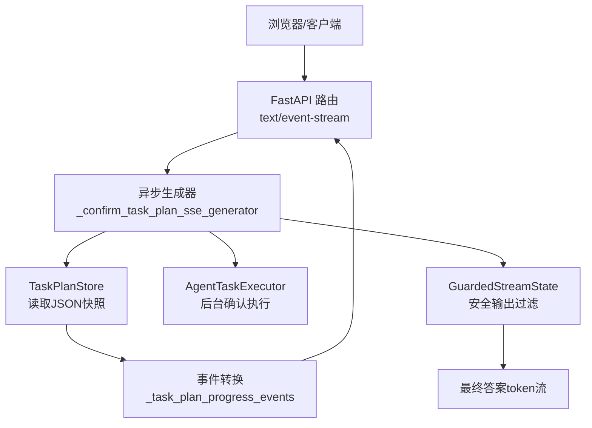
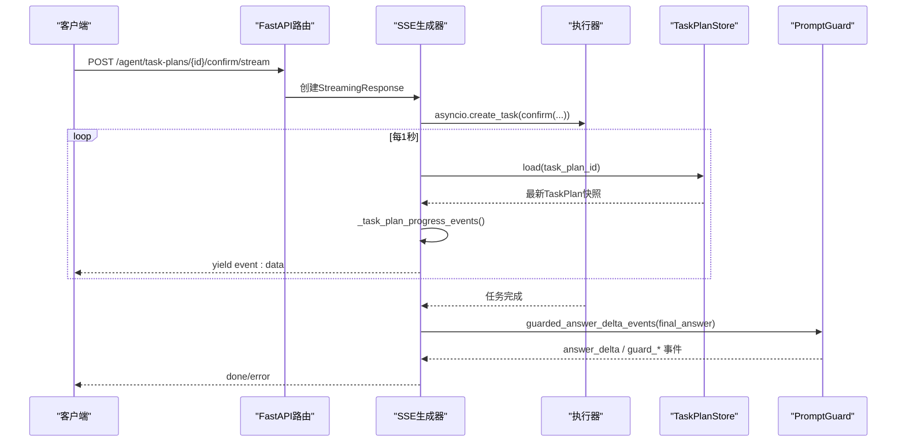
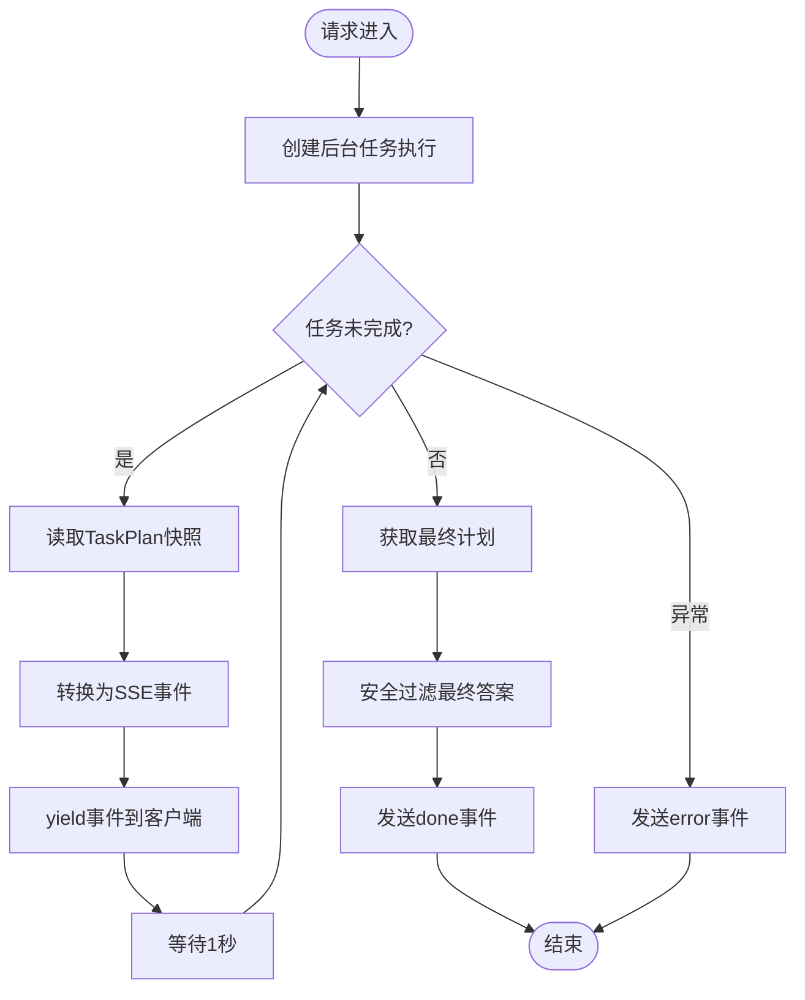
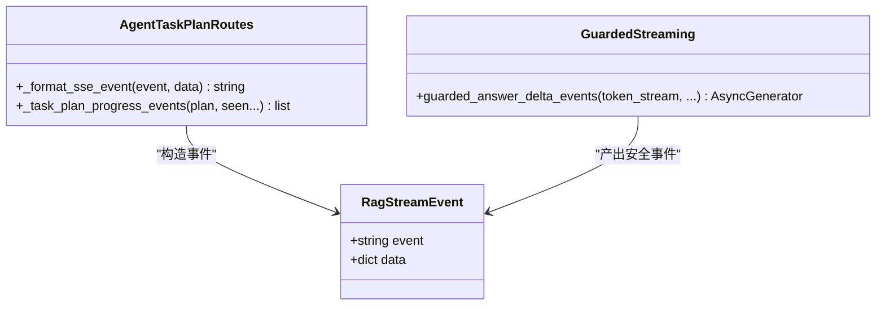
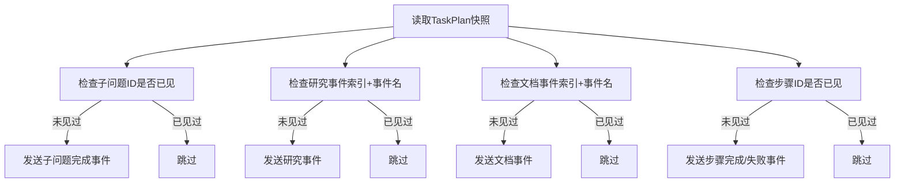
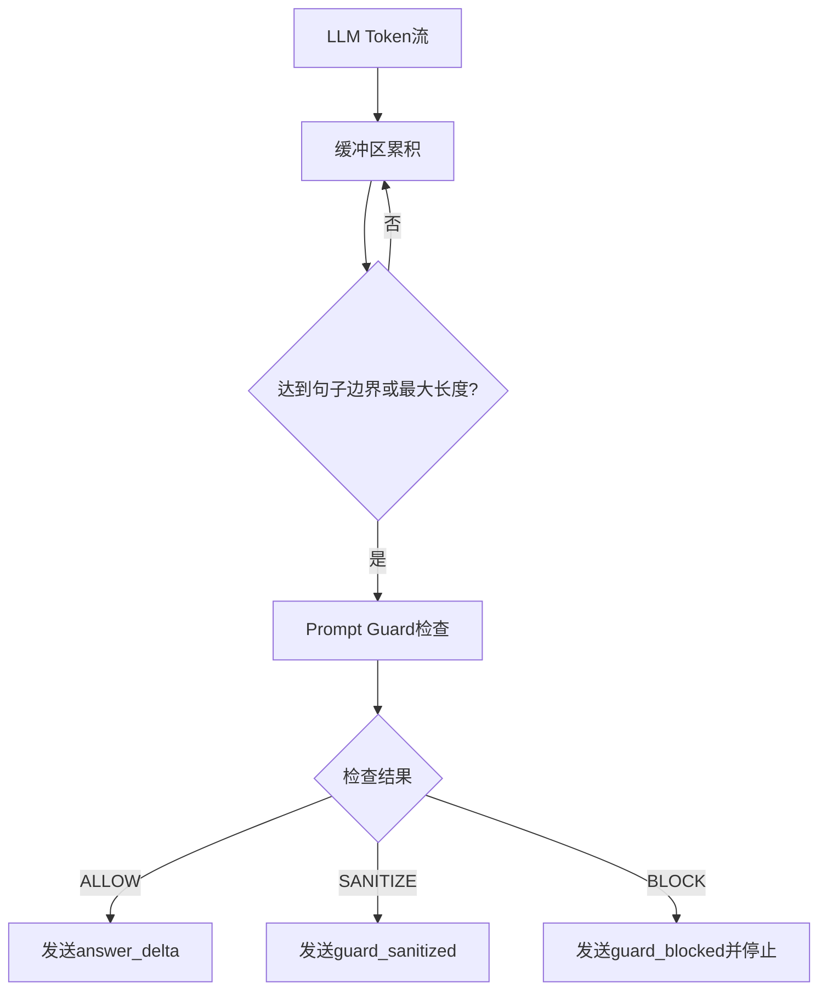
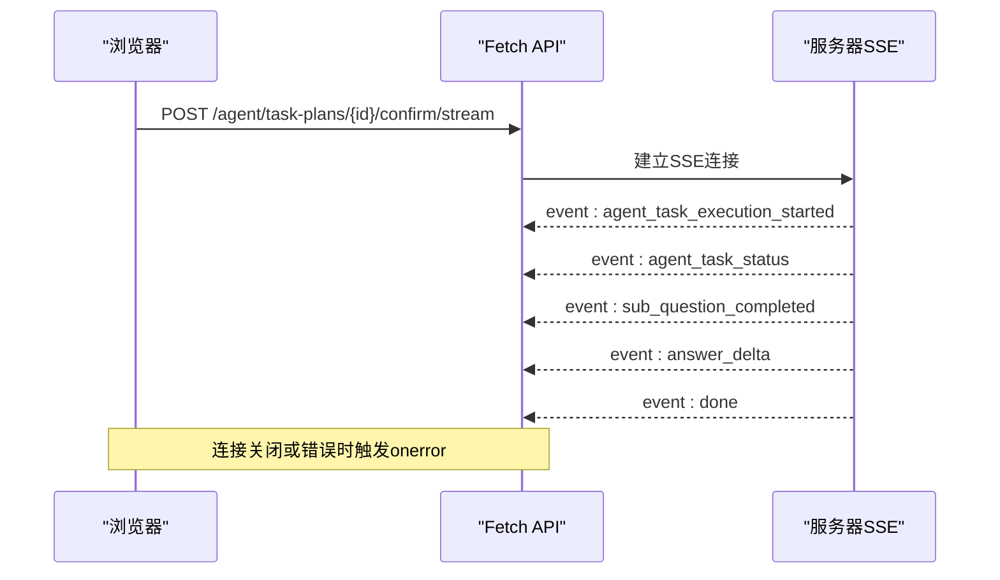
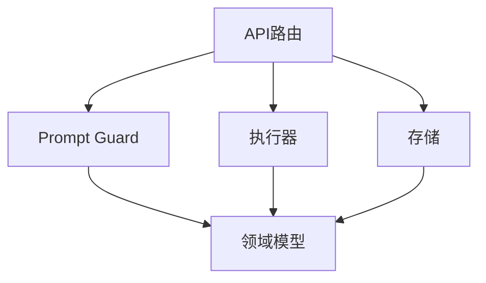

# SSE流式执行

<cite>
**本文引用的文件**
- [agent_task_plan_routes.py](file://src/fast_app/api/agent_task_plan_routes.py)
- [guarded_streaming.py](file://src/fast_app/services/rag/guarded_streaming.py)
- [rag_stream_models.py](file://src/fast_app/domain/rag_stream_models.py)
- [chat_routes.py](file://src/fast_app/api/chat_routes.py)
- [stream_routes.py](file://src/fast_app/api/stream_routes.py)
- [chat_service.py](file://src/fast_app/services/chat_service.py)
- [streaming.py](file://src/fast_app/rag_eval/streaming.py)
- [test_guarded_streaming.py](file://scripts/tests/document_security/test_guarded_streaming.py)
- [20-3-接口文档整理.md](file://learning-docs/phase-20/20-3-接口文档整理.md)
</cite>

## 目录
1. [简介](#简介)
2. [项目结构](#项目结构)
3. [核心组件](#核心组件)
4. [架构总览](#架构总览)
5. [详细组件分析](#详细组件分析)
6. [依赖关系分析](#依赖关系分析)
7. [性能考虑](#性能考虑)
8. [故障排查指南](#故障排查指南)
9. [结论](#结论)
10. [附录](#附录)

## 简介
本技术文档围绕项目中“SSE流式执行”的实现进行系统化说明，覆盖以下方面：
- Server-Sent Events（SSE）连接建立、事件推送机制与断线重连策略
- 任务执行过程中的实时进度推送：子问题完成、研究进展、文档处理等事件类型及格式
- 事件去重机制：确保前端不重复接收相同事件数据
- 客户端SSE连接示例与错误处理方案
- 性能优化建议与最佳实践：事件批量发送、连接池管理、轮询间隔与缓冲策略

## 项目结构
本项目在FastAPI中通过异步生成器与StreamingResponse实现SSE；同时提供结构化事件模型与安全输出过滤。关键位置如下：
- API层路由：负责将业务事件序列化为SSE文本并返回给客户端
- 服务层：负责产生业务事件（如TaskPlan快照、LLM token流）
- 领域模型：定义统一的结构化事件名称与数据结构
- 安全流：对最终回答进行Prompt Guard检查，产出安全事件

图表来源
- [agent_task_plan_routes.py:258-433](file://src/fast_app/api/agent_task_plan_routes.py#L258-L433)
- [guarded_streaming.py:36-133](file://src/fast_app/services/rag/guarded_streaming.py#L36-L133)
- [rag_stream_models.py:5-45](file://src/fast_app/domain/rag_stream_models.py#L5-L45)

章节来源
- [agent_task_plan_routes.py:258-433](file://src/fast_app/api/agent_task_plan_routes.py#L258-L433)
- [guarded_streaming.py:36-133](file://src/fast_app/services/rag/guarded_streaming.py#L36-L133)
- [rag_stream_models.py:5-45](file://src/fast_app/domain/rag_stream_models.py#L5-L45)

## 核心组件
- SSE路由与生成器
  - FastAPI路由使用StreamingResponse返回SSE流，媒体类型为text/event-stream
  - 异步生成器负责持续yield事件字符串，直到任务结束或发生错误
- TaskPlan快照轮询
  - 后台执行器在运行期间不断写入TaskPlan JSON快照
  - SSE生成器每秒读取一次快照，转换为SSE事件并发送给前端
- 结构化事件模型
  - 统一的事件名集合与RagStreamEvent数据结构，便于前后端契约对齐
- 安全输出过滤
  - 基于Prompt Guard的流式安全检查，支持三种模式：完整缓冲后检查、仅前置审计、句子缓冲模式
  - 输出事件包括answer_delta、guard_sanitized、guard_blocked等

章节来源
- [stream_routes.py:25-38](file://src/fast_app/api/stream_routes.py#L25-L38)
- [chat_routes.py:18-32](file://src/fast_app/api/chat_routes.py#L18-L32)
- [agent_task_plan_routes.py:258-433](file://src/fast_app/api/agent_task_plan_routes.py#L258-L433)
- [rag_stream_models.py:5-45](file://src/fast_app/domain/rag_stream_models.py#L5-L45)
- [guarded_streaming.py:36-133](file://src/fast_app/services/rag/guarded_streaming.py#L36-L133)

## 架构总览
下图展示了从请求到SSE输出的整体流程，包括后台执行、快照轮询、事件转换与安全过滤。

图表来源
- [agent_task_plan_routes.py:258-433](file://src/fast_app/api/agent_task_plan_routes.py#L258-L433)
- [guarded_streaming.py:36-133](file://src/fast_app/services/rag/guarded_streaming.py#L36-L133)

## 详细组件分析

### SSE连接建立与事件推送机制
- 连接建立
  - 路由返回StreamingResponse，设置media_type为text/event-stream
  - 异步生成器立即开始yield事件，客户端收到第一个事件即认为连接成功
- 事件推送
  - 后台执行器在运行过程中更新TaskPlan JSON快照
  - 生成器每秒读取快照，调用事件转换函数，将新增状态与结果转为SSE事件
  - 最终答案经安全过滤后，以answer_delta或guard_*事件形式推送
- 结束与错误
  - 正常结束时发送done事件
  - 异常时发送error事件，包含错误信息与上下文标识

图表来源
- [agent_task_plan_routes.py:258-433](file://src/fast_app/api/agent_task_plan_routes.py#L258-L433)

章节来源
- [agent_task_plan_routes.py:258-433](file://src/fast_app/api/agent_task_plan_routes.py#L258-L433)
- [stream_routes.py:25-38](file://src/fast_app/api/stream_routes.py#L25-L38)
- [chat_routes.py:18-32](file://src/fast_app/api/chat_routes.py#L18-L32)

### 实时进度推送事件类型与格式
- 任务状态事件
  - agent_task_status：每次快照都包含当前任务状态
- 子问题相关事件
  - sub_question_started：子问题开始执行
  - sub_question_completed：子问题完成，包含答案、工具调用等信息
  - sub_question_evidence_updated：证据校验结果更新
- 研究进展事件
  - agent_task_research_wave_started：研究波次开始
  - agent_task_research_worker_progress：Worker进度
  - agent_task_research_worker_timed_out：Worker超时
  - agent_task_evidence_evaluated：证据评估完成
  - agent_task_sub_question_retrying：子问题重试
- 文档处理事件
  - agent_task_document_supervised：文档监督
  - agent_task_document_subagent_started/completed/failed：子代理生命周期
  - agent_task_document_draft_created：草稿创建
  - agent_task_document_review_completed：审查完成
  - agent_task_document_revision_started：修订开始
  - agent_task_document_action_prepared：动作准备
- 步骤完成事件
  - agent_task_step_completed/agent_task_step_failed：步骤级完成或失败
- 最终合成事件
  - agent_task_final_synthesis_completed：最终合成完成，包含警告、工具使用等信息
- 结束与错误
  - done：任务结束
  - error：任务异常

图表来源
- [rag_stream_models.py:5-45](file://src/fast_app/domain/rag_stream_models.py#L5-L45)
- [agent_task_plan_routes.py:436-668](file://src/fast_app/api/agent_task_plan_routes.py#L436-L668)
- [guarded_streaming.py:36-133](file://src/fast_app/services/rag/guarded_streaming.py#L36-L133)

章节来源
- [agent_task_plan_routes.py:436-668](file://src/fast_app/api/agent_task_plan_routes.py#L436-L668)
- [20-3-接口文档整理.md:212-290](file://learning-docs/phase-20/20-3-接口文档整理.md#L212-L290)

### 事件去重机制
- 子问题完成去重
  - 使用seen_sub_questions集合记录已发送的子问题ID，避免重复推送
- 研究事件去重
  - 使用seen_research_events集合，键为索引+事件名，防止同一快照中的重复事件
- 文档事件去重
  - 使用document:{index}:{event_name}作为键，确保文档事件只推送一次
- 步骤完成去重
  - 使用seen_steps集合记录已完成或失败的步骤ID
- 前端相邻状态去重
  - 前端可忽略相邻相同的agent_task_status事件，避免日志被心跳事件淹没

图表来源
- [agent_task_plan_routes.py:436-668](file://src/fast_app/api/agent_task_plan_routes.py#L436-L668)

章节来源
- [agent_task_plan_routes.py:436-668](file://src/fast_app/api/agent_task_plan_routes.py#L436-L668)

### 安全输出过滤与事件格式
- 三种模式
  - buffer_then_emit：完整缓冲后检查，安全性最强，首包延迟最高
  - pre_guard_only：原始token先发送，结束后审计，不适合严格安全场景
  - sentence_buffer：默认主线，按句子边界或最大长度缓冲后检查
- 事件类型
  - answer_delta：安全通过的增量文本
  - guard_sanitized：已脱敏的文本
  - guard_blocked：高风险内容被阻止
- 状态累计
  - GuardedStreamState记录已发送的安全文本、原始token计数、是否被阻止

图表来源
- [guarded_streaming.py:36-133](file://src/fast_app/services/rag/guarded_streaming.py#L36-L133)

章节来源
- [guarded_streaming.py:36-133](file://src/fast_app/services/rag/guarded_streaming.py#L36-L133)
- [test_guarded_streaming.py:96-181](file://scripts/tests/document_security/test_guarded_streaming.py#L96-L181)

### 客户端SSE连接示例与错误处理
- 连接建立
  - 使用fetch或XMLHttpRequest发起POST请求，设置Accept: text/event-stream
  - 解析响应体，按双换行符分割事件块
- 事件解析
  - 提取event和data字段，data可能为JSON对象
  - 处理sources、answer_delta、guard_*、done、error等事件
- 错误处理
  - 捕获网络异常并重试
  - 处理done后的后续事件（应拒绝）
  - 记录request_id和trace_id用于追踪

图表来源
- [agent_task_plan_routes.py:258-433](file://src/fast_app/api/agent_task_plan_routes.py#L258-L433)
- [20-3-接口文档整理.md:212-290](file://learning-docs/phase-20/20-3-接口文档整理.md#L212-L290)

章节来源
- [agent_task_plan_routes.py:258-433](file://src/fast_app/api/agent_task_plan_routes.py#L258-L433)
- [20-3-接口文档整理.md:212-290](file://learning-docs/phase-20/20-3-接口文档整理.md#L212-L290)

## 依赖关系分析
- API层依赖
  - FastAPI路由依赖服务层的执行器和存储
  - 路由将业务事件转换为SSE格式
- 服务层依赖
  - 执行器负责TaskPlan的确认、取消、重试等操作
  - 存储层提供TaskPlan快照的读写
  - Prompt Guard服务负责输出安全检查
- 领域模型依赖
  - 统一的事件名和数据结构确保前后端契约一致

图表来源
- [agent_task_plan_routes.py:1-40](file://src/fast_app/api/agent_task_plan_routes.py#L1-L40)
- [rag_stream_models.py:5-45](file://src/fast_app/domain/rag_stream_models.py#L5-L45)

章节来源
- [agent_task_plan_routes.py:1-40](file://src/fast_app/api/agent_task_plan_routes.py#L1-L40)
- [rag_stream_models.py:5-45](file://src/fast_app/domain/rag_stream_models.py#L5-L45)

## 性能考虑
- 轮询间隔
  - 当前实现每秒读取一次快照，平衡了实时性与性能
  - 高并发场景下可考虑调整间隔或使用消息队列
- 事件批量发送
  - 单次快照转换多个事件，减少网络开销
  - 前端可合并相邻相同状态事件，降低UI刷新频率
- 缓冲策略
  - 安全过滤采用句子缓冲，避免过小的chunk导致频繁检查
  - 可根据配置调整最大字符数以平衡延迟与安全性
- 连接池管理
  - 服务端使用FastAPI内置连接管理，无需额外连接池
  - 客户端应复用HTTP连接，避免频繁建立SSE连接

[本节为通用性能指导，不直接分析具体文件]

## 故障排查指南
- 常见问题
  - 快照暂不可读：轮询异常被忽略，等待下一轮重试
  - 重复事件：检查去重逻辑是否正确，确认seen_*集合是否正常工作
  - 安全过滤阻断：查看guard_blocked事件，调整Prompt Guard配置
- 调试方法
  - 启用LangSmith追踪，查看pipeline执行情况
  - 检查request_id和trace_id，定位具体请求
  - 使用测试脚本验证事件流是否符合预期

章节来源
- [agent_task_plan_routes.py:351-355](file://src/fast_app/api/agent_task_plan_routes.py#L351-L355)
- [test_guarded_streaming.py:235-284](file://scripts/tests/document_security/test_guarded_streaming.py#L235-L284)

## 结论
本项目实现了完整的SSE流式执行机制，包括连接建立、实时进度推送、事件去重和安全过滤。通过TaskPlan快照轮询的方式，既保证了实现的简洁性，又提供了可靠的进度反馈。安全输出过滤确保了最终回答的安全性。建议在高并发场景下考虑升级事件总线，以提升性能和可扩展性。

[本节为总结性内容，不直接分析具体文件]

## 附录
- 客户端实现参考
  - 使用JavaScript Fetch API或原生EventSource
  - 解析SSE事件，处理不同类型的事件
  - 实现断线重连逻辑，指数退避重试
- 服务端配置
  - 调整Prompt Guard参数，平衡安全性与延迟
  - 配置轮询间隔，适应不同负载场景
  - 启用追踪和日志，便于问题定位

[本节为补充信息，不直接分析具体文件]