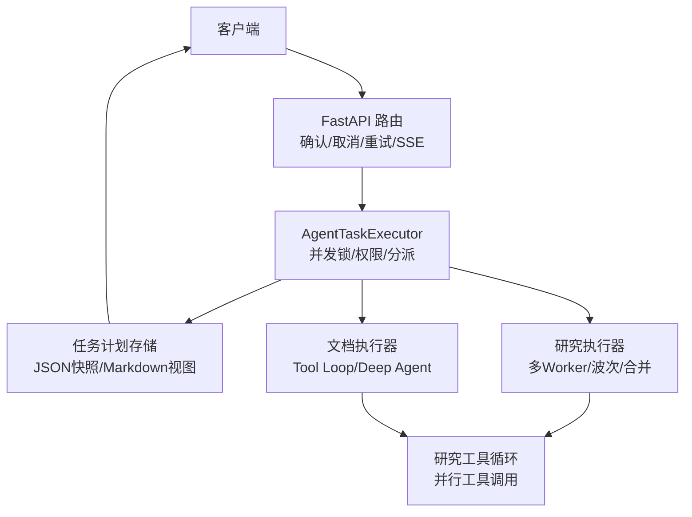
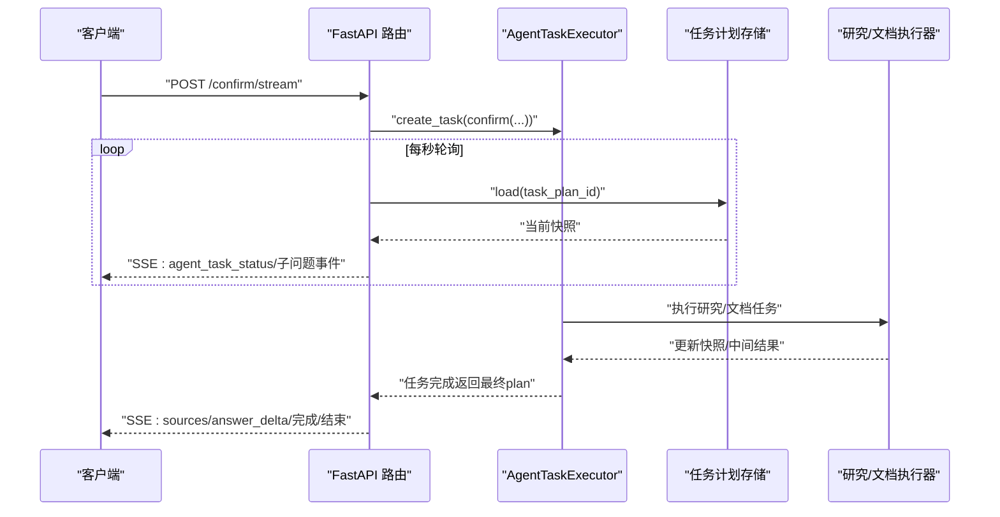
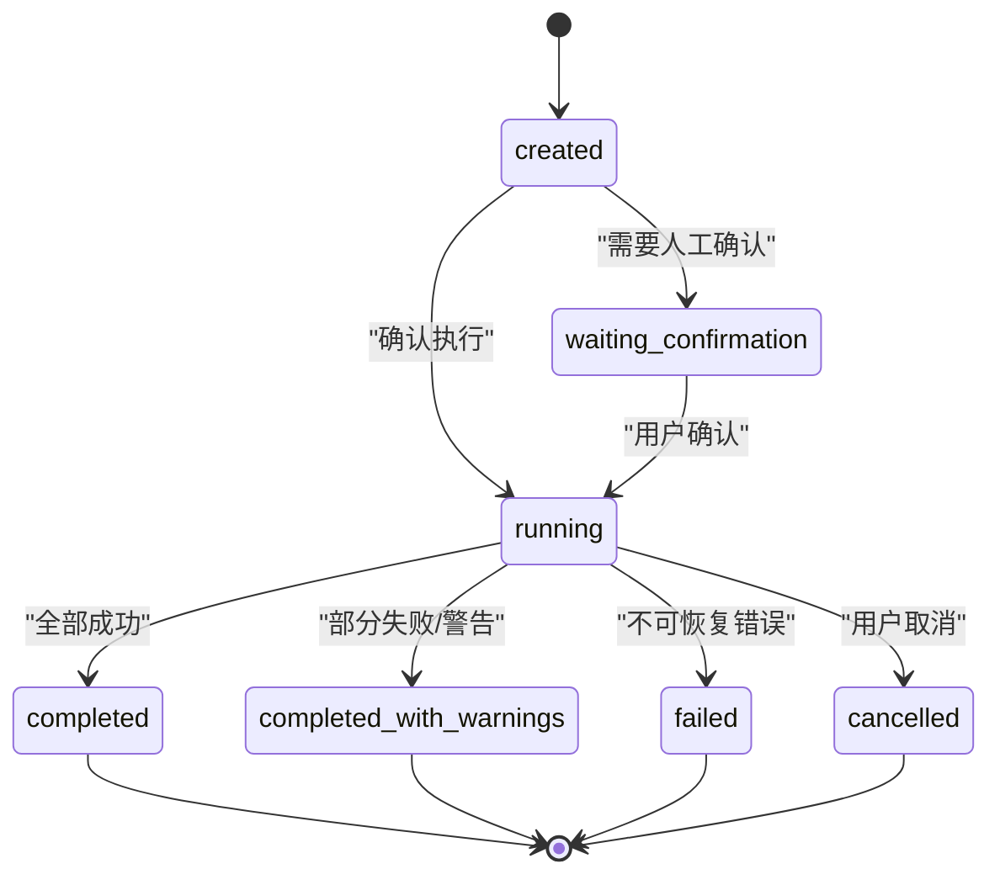
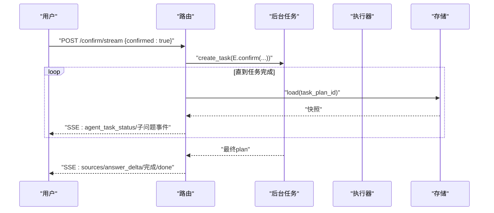
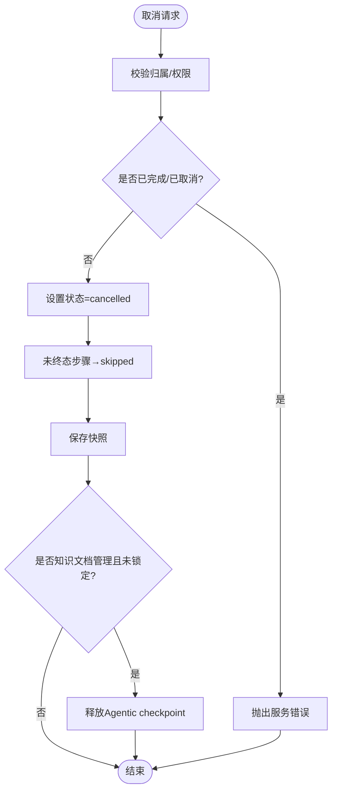
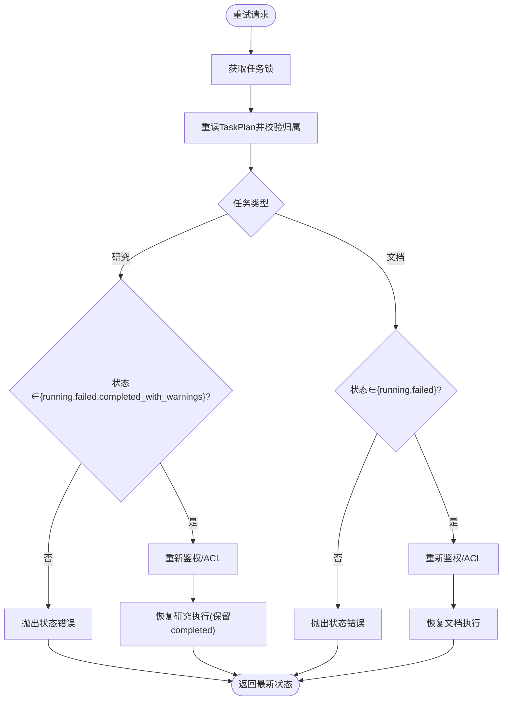
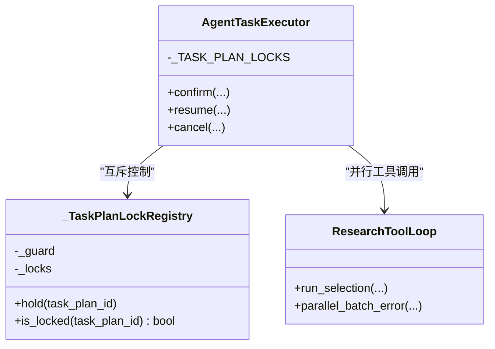
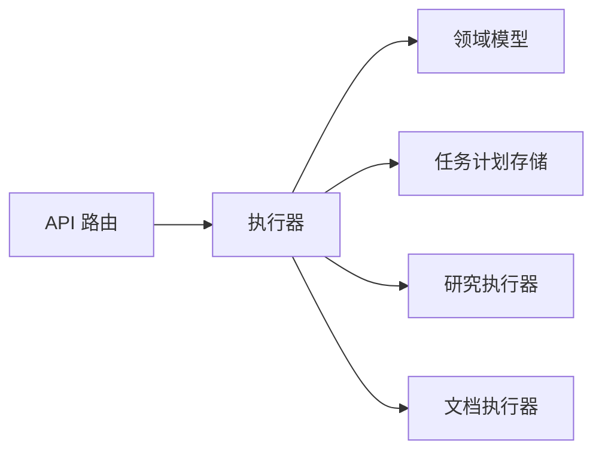
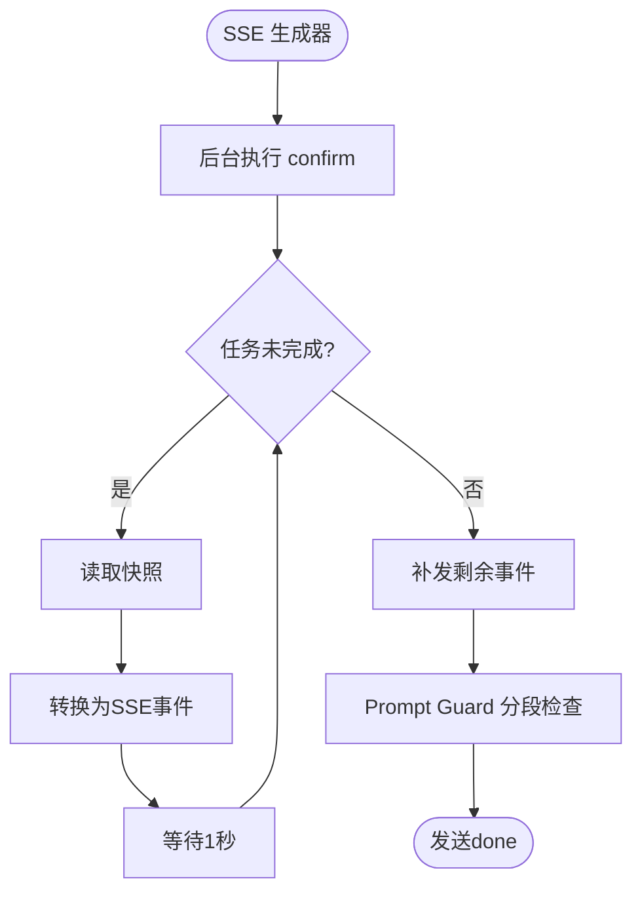

# 任务执行控制

<cite>
**本文引用的文件**
- [agent_task_plan_routes.py](file://src/fast_app/api/agent_task_plan_routes.py)
- [agent_task_executor.py](file://src/fast_app/services/agent_tasks/agent_task_executor.py)
- [agent_task_plan.py](file://src/fast_app/domain/agent_task_plan.py)
- [research_tool_loop.py](file://src/fast_app/services/research/research_tool_loop.py)
</cite>

## 目录
1. [简介](#简介)
2. [项目结构](#项目结构)
3. [核心组件](#核心组件)
4. [架构总览](#架构总览)
5. [详细组件分析](#详细组件分析)
6. [依赖关系分析](#依赖关系分析)
7. [性能与并发特性](#性能与并发特性)
8. [故障恢复与重试](#故障恢复与重试)
9. [SSE 流式进度说明](#sse-流式进度说明)
10. [常见问题排查](#常见问题排查)
11. [结论](#结论)

## 简介
本文件面向 Agent 任务执行控制，围绕“确认执行、取消、重试”三大控制能力展开，系统阐述任务状态机转换、SSE 流式进度推送、并行执行机制与资源管理策略，并给出错误恢复与重试逻辑的完整说明。文档以代码为依据，帮助读者在不深入源码的情况下理解端到端执行流程与边界条件。

## 项目结构
Agent 任务执行控制由三层构成：
- API 层：提供 REST 接口与 SSE 流式接口，负责鉴权、追踪、请求校验与事件格式化。
- 执行器层：统一入口，负责任务分派、并发互斥、权限与 ACL 重建、取消信号写入与恢复。
- 领域模型层：定义任务计划、步骤、子问题、工具调用轨迹、证据评估等数据结构与状态枚举。

**图示来源**
- [agent_task_plan_routes.py:201-283](file://src/fast_app/api/agent_task_plan_routes.py#L201-L283)
- [agent_task_executor.py:135-200](file://src/fast_app/services/agent_tasks/agent_task_executor.py#L135-L200)
- [agent_task_plan.py:26-47](file://src/fast_app/domain/agent_task_plan.py#L26-L47)

**章节来源**
- [agent_task_plan_routes.py:1-125](file://src/fast_app/api/agent_task_plan_routes.py#L1-L125)
- [agent_task_executor.py:1-133](file://src/fast_app/services/agent_tasks/agent_task_executor.py#L1-L133)
- [agent_task_plan.py:26-47](file://src/fast_app/domain/agent_task_plan.py#L26-L47)

## 核心组件
- 任务计划与状态
  - 任务整体状态：created、running、waiting_confirmation、completed、completed_with_warnings、failed、cancelled。
  - 工具步骤状态：pending、running、completed、waiting_confirmation、failed、skipped。
  - 子问题结果状态：completed、partial、failed、skipped。
- 执行器
  - 统一入口：confirm、resume、cancel；按 task_kind 分派到研究或文档执行器。
  - 进程内互斥：按 task_plan_id 分配 asyncio.Lock，防止重复 confirm/retry。
- API 路由
  - GET 读取计划、Markdown 审查视图。
  - POST 确认执行、取消、重试。
  - POST 确认执行流式接口（SSE）。

**章节来源**
- [agent_task_plan.py:26-47](file://src/fast_app/domain/agent_task_plan.py#L26-L47)
- [agent_task_plan.py:274-323](file://src/fast_app/domain/agent_task_plan.py#L274-L323)
- [agent_task_executor.py:135-200](file://src/fast_app/services/agent_tasks/agent_task_executor.py#L135-L200)
- [agent_task_plan_routes.py:111-199](file://src/fast_app/api/agent_task_plan_routes.py#L111-L199)

## 架构总览
下图展示从 HTTP 请求到任务执行的完整链路，包括 SSE 轮询与最终完成事件。

**图示来源**
- [agent_task_plan_routes.py:258-433](file://src/fast_app/api/agent_task_plan_routes.py#L258-L433)
- [agent_task_executor.py:212-278](file://src/fast_app/services/agent_tasks/agent_task_executor.py#L212-L278)

## 详细组件分析

### 任务状态机与转换条件
- 整体状态
  - created → running：确认后进入运行。
  - running → completed：所有子问题/步骤成功完成。
  - running → completed_with_warnings：存在警告或部分失败但可接受。
  - running → failed：不可恢复的错误。
  - running → cancelled：用户取消。
  - waiting_confirmation → running：人工确认后继续。
- 工具步骤状态
  - pending → running：开始执行。
  - running → completed/failed/waiting_confirmation/skipped：根据执行结果或取消。
- 子问题结果状态
  - completed/partial/failed/skipped：由 Worker/Evaluator/依赖解析决定。

**图示来源**
- [agent_task_plan.py:26-35](file://src/fast_app/domain/agent_task_plan.py#L26-L35)
- [agent_task_executor.py:230-278](file://src/fast_app/services/agent_tasks/agent_task_executor.py#L230-L278)

**章节来源**
- [agent_task_plan.py:26-47](file://src/fast_app/domain/agent_task_plan.py#L26-L47)
- [agent_task_executor.py:230-278](file://src/fast_app/services/agent_tasks/agent_task_executor.py#L230-L278)

### 确认执行接口
- 同步确认
  - 路径：POST /agent/task-plans/{task_plan_id}/confirm
  - 行为：校验 confirmed=true，创建 LangChain 子配置，调用执行器 confirm，返回最终 plan。
- 流式确认（SSE）
  - 路径：POST /agent/task-plans/{task_plan_id}/confirm/stream
  - 行为：后台执行 confirm，每秒读取任务快照，转换为 SSE 事件；完成后发送 sources、answer_delta、最终综合事件与 done。

**图示来源**
- [agent_task_plan_routes.py:201-255](file://src/fast_app/api/agent_task_plan_routes.py#L201-L255)
- [agent_task_plan_routes.py:258-433](file://src/fast_app/api/agent_task_plan_routes.py#L258-L433)

**章节来源**
- [agent_task_plan_routes.py:201-255](file://src/fast_app/api/agent_task_plan_routes.py#L201-L255)
- [agent_task_plan_routes.py:258-433](file://src/fast_app/api/agent_task_plan_routes.py#L258-L433)

### 取消接口
- 路径：POST /agent/task-plans/{task_plan_id}/cancel
- 行为：校验归属与权限，将任务状态置为 cancelled，未终态步骤收敛为 skipped；对正在运行的 Deep Agent 在下一安全边界释放 checkpoint。

**图示来源**
- [agent_task_executor.py:212-278](file://src/fast_app/services/agent_tasks/agent_task_executor.py#L212-L278)

**章节来源**
- [agent_task_plan_routes.py:143-169](file://src/fast_app/api/agent_task_plan_routes.py#L143-L169)
- [agent_task_executor.py:212-278](file://src/fast_app/services/agent_tasks/agent_task_executor.py#L212-L278)

### 重试接口
- 路径：POST /agent/task-plans/{task_plan_id}/retry
- 行为：获取任务锁后重读 TaskPlan，校验可重试状态；研究任务允许从 running、failed、completed_with_warnings 重试；文档任务允许从 running、failed 恢复；重新鉴权与 ACL，保留已完成结果，重跑未完成部分。

**图示来源**
- [agent_task_executor.py:341-400](file://src/fast_app/services/agent_tasks/agent_task_executor.py#L341-L400)
- [agent_task_plan_routes.py:172-199](file://src/fast_app/api/agent_task_plan_routes.py#L172-L199)

**章节来源**
- [agent_task_plan_routes.py:172-199](file://src/fast_app/api/agent_task_plan_routes.py#L172-L199)
- [agent_task_executor.py:341-400](file://src/fast_app/services/agent_tasks/agent_task_executor.py#L341-L400)

### 并行执行机制与资源管理
- 协程并发
  - 研究 Worker 通过异步图调度，多个 Worker 在同一事件循环中以 asyncio.Task 并发执行，遇到 await 让出执行权，适合 I/O 密集型任务。
- 工具并行
  - 工具选择批处理：先 LLM 提议一批调用，后端整批校验通过后使用 asyncio.gather 启动并行执行，保证输入顺序返回。
- 资源清理
  - 取消时立即写入 cancelled 信号，并在下一安全边界释放 checkpoint；若任务未锁定则立即释放 Agentic checkpoint，避免长任务阻塞 cancel。

**图示来源**
- [agent_task_executor.py:81-133](file://src/fast_app/services/agent_tasks/agent_task_executor.py#L81-L133)
- [research_tool_loop.py:449-475](file://src/fast_app/services/research/research_tool_loop.py#L449-L475)

**章节来源**
- [agent_task_executor.py:81-133](file://src/fast_app/services/agent_tasks/agent_task_executor.py#L81-L133)
- [research_tool_loop.py:449-475](file://src/fast_app/services/research/research_tool_loop.py#L449-L475)

## 依赖关系分析
- API 路由依赖执行器与存储，执行器依赖领域模型与专用执行器（研究/文档），并通过存储持久化快照。
- 状态机定义集中在领域模型，确保跨模块一致。
- 并发控制集中在执行器的锁注册表，避免重复操作与竞态。

**图示来源**
- [agent_task_plan_routes.py:1-41](file://src/fast_app/api/agent_task_plan_routes.py#L1-L41)
- [agent_task_executor.py:135-200](file://src/fast_app/services/agent_tasks/agent_task_executor.py#L135-L200)
- [agent_task_plan.py:274-323](file://src/fast_app/domain/agent_task_plan.py#L274-L323)

**章节来源**
- [agent_task_plan_routes.py:1-41](file://src/fast_app/api/agent_task_plan_routes.py#L1-L41)
- [agent_task_executor.py:135-200](file://src/fast_app/services/agent_tasks/agent_task_executor.py#L135-L200)
- [agent_task_plan.py:274-323](file://src/fast_app/domain/agent_task_plan.py#L274-L323)

## 性能与并发特性
- SSE 轮询间隔为约 1 秒，延迟可控；临时 load 异常被忽略，连接保持稳定。
- 并行工具调用通过 asyncio.gather 提升吞吐，适合网络与数据库 I/O。
- 锁粒度按 task_plan_id，不同任务互不影响；全局 guard 保护锁字典创建。
- 高并发场景下，文件快照轮询可能成为瓶颈，后续可升级为事件总线。

[本节为通用指导，不直接分析具体文件]

## 故障恢复与重试
- 已知运行失败（如超时、预算耗尽）会保存 TaskPlan 并返回 failed，同时保留 checkpoint，支持显式重试。
- 未知异常仍保存快照并抛出，便于日志与监控定位代码错误。
- 重试时重新鉴权与 ACL，保留已完成结果，仅重跑未完成部分；研究任务可从 running、failed、completed_with_warnings 恢复。

**章节来源**
- [agent_task_executor.py:341-400](file://src/fast_app/services/agent_tasks/agent_task_executor.py#L341-L400)
- [agent_task_plan_routes.py:172-199](file://src/fast_app/api/agent_task_plan_routes.py#L172-L199)

## SSE 流式进度说明
- 事件类型
  - 执行开始：agent_task_execution_started
  - 状态更新：agent_task_status
  - 研究事件：wave 开始、证据评估、子问题重试、子问题完成等
  - 文档事件：监督、子代理开始/完成/失败、草稿创建、审阅完成、修订开始、动作准备
  - 最终输出：sources、answer_delta、最终综合完成、done
- 去重策略
  - 维护 seen_sub_questions、seen_steps、seen_research_events，避免重复推送。
- 实现要点
  - 后台执行 confirm，生成器每秒读取快照并转换为 SSE；任务完成后补发剩余事件。
  - 最终答案经 Prompt Guard 分段检查，按 chunk 推送 token。

**图示来源**
- [agent_task_plan_routes.py:286-433](file://src/fast_app/api/agent_task_plan_routes.py#L286-L433)
- [agent_task_plan_routes.py:436-668](file://src/fast_app/api/agent_task_plan_routes.py#L436-L668)

**章节来源**
- [agent_task_plan_routes.py:286-433](file://src/fast_app/api/agent_task_plan_routes.py#L286-L433)
- [agent_task_plan_routes.py:436-668](file://src/fast_app/api/agent_task_plan_routes.py#L436-L668)

## 常见问题排查
- 重复确认/重试导致冲突
  - 现象：同一任务多次 confirm/retry 同时到达。
  - 原因：缺少互斥锁。
  - 解决：使用 _TASK_PLAN_LOCKS.hold(task_plan_id) 进行 fail-fast 互斥。
- 取消不生效
  - 现象：取消后仍在执行。
  - 原因：外部调用尚未返回，需等待安全边界。
  - 解决：在 wave 派发、attempt 开始、Evaluator 前检查取消状态。
- SSE 无事件或中断
  - 现象：前端长时间无事件或连接断开。
  - 原因：快照暂不可读或轮询异常。
  - 解决：忽略短暂异常，继续轮询；检查存储可用性。

**章节来源**
- [agent_task_executor.py:81-133](file://src/fast_app/services/agent_tasks/agent_task_executor.py#L81-L133)
- [agent_task_plan_routes.py:340-355](file://src/fast_app/api/agent_task_plan_routes.py#L340-L355)

## 结论
本系统通过统一的执行器与清晰的状态机，实现了 Agent 任务的确认执行、取消与重试控制；借助 SSE 轮询与事件去重，提供稳定的实时进度反馈；通过进程内锁与并行工具调用，保障并发安全与性能；结合错误恢复与重试机制，提升鲁棒性。未来可在高并发场景引入事件总线优化 SSE 推送效率。