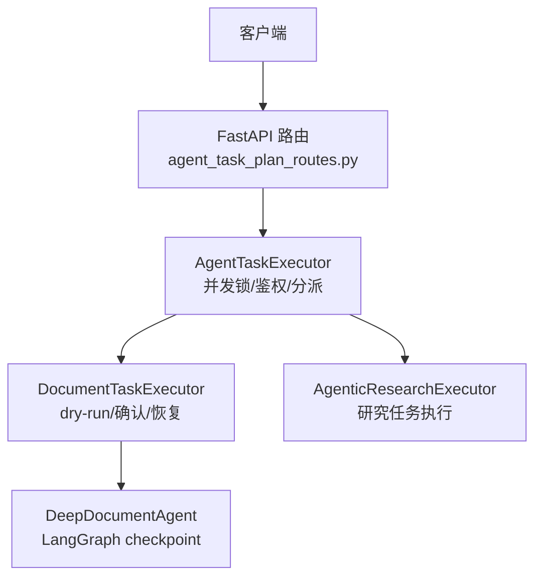
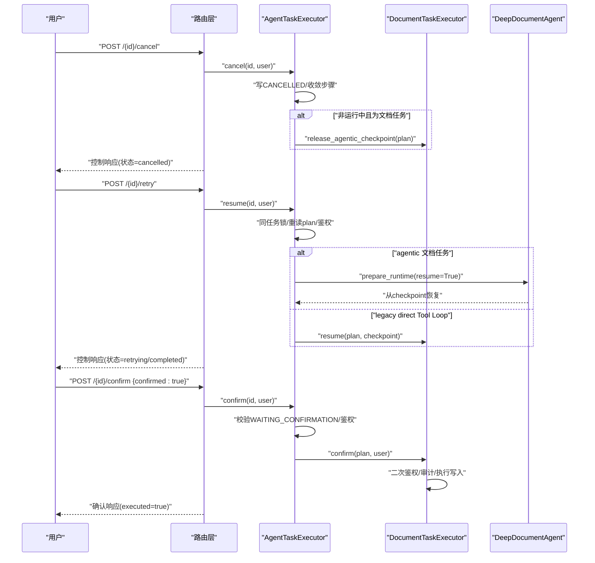
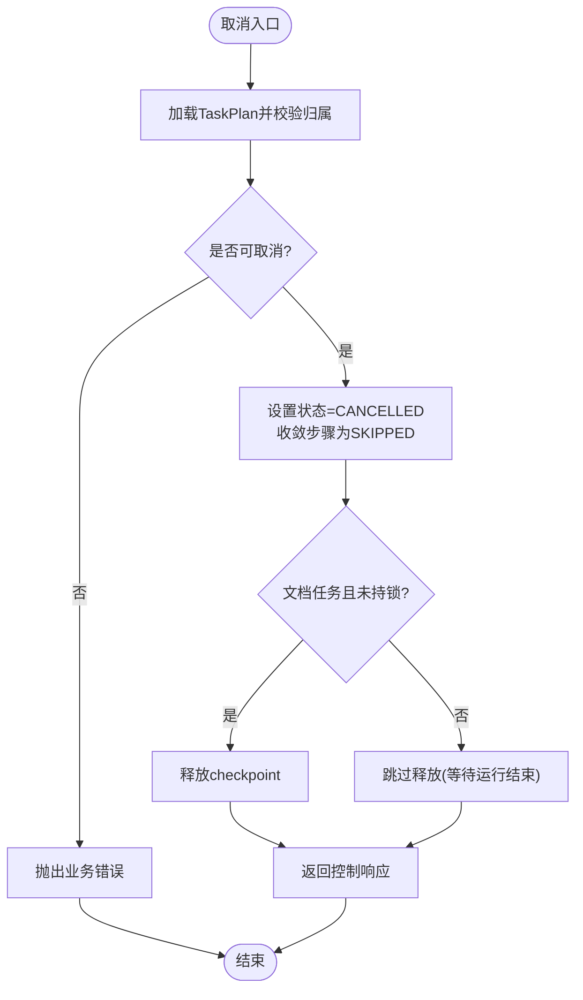
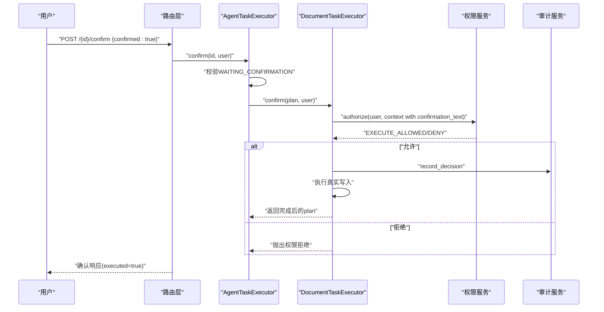
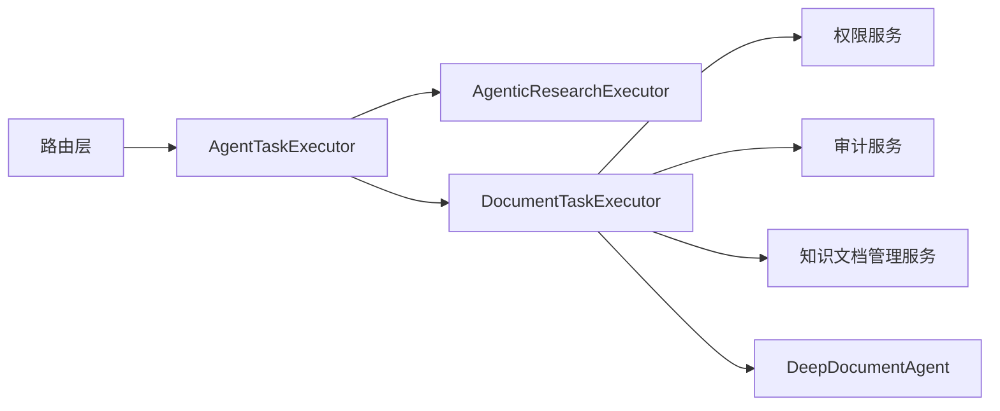

# 任务控制操作

<cite>
**本文引用的文件**
- [agent_task_plan_routes.py](file://python-agent-study/src/fast_app/api/agent_task_plan_routes.py)
- [agent_task_executor.py](file://python-agent-study/src/fast_app/services/agent_tasks/agent_task_executor.py)
- [document_task_executor.py](file://python-agent-study/src/fast_app/services/agent_tasks/document_task_executor.py)
- [deep_document_agent.py](file://python-agent-study/src/fast_app/services/agent_tasks/deep_document_agent.py)
- [15-7-Agent-tool-权限-工具调用与人工确认+【知识点讲解】.md](file://python-agent-study/learning-docs/phase-15/15-7-Agent-tool-权限-工具调用与人工确认+【知识点讲解】.md)
- [多Agent端到端测试复盘 + 知识点讲解.md](file://python-agent-study/scripts/docs/多Agent端到端测试复盘 + 知识点讲解.md)
</cite>

## 目录
1. [简介](#简介)
2. [项目结构](#项目结构)
3. [核心组件](#核心组件)
4. [架构总览](#架构总览)
5. [详细组件分析](#详细组件分析)
6. [依赖关系分析](#依赖关系分析)
7. [性能考虑](#性能考虑)
8. [故障排查指南](#故障排查指南)
9. [结论](#结论)
10. [附录：接口契约与示例](#附录接口契约与示例)

## 简介
本文件面向“任务控制操作”的API与实现，聚焦三类能力：
- 取消任务：对运行中的 Agent TaskPlan 发出优雅停止信号，确保 Tool Loop 在当前轮次屏障后安全退出。
- 重试恢复：基于最近完整快照（Research 子问题结果或 LangGraph checkpoint）进行可重试恢复，避免重复执行已完成节点。
- 确认执行：对高风险文档写入类操作实施人工确认、权限二次校验和执行授权，保证最终写入的安全边界。

同时提供每个控制接口的请求参数、响应格式、使用示例、异常处理策略以及并发安全性说明。

## 项目结构
任务控制相关代码主要分布在以下位置：
- API 路由层：暴露 /agent/task-plans/{task_plan_id}/cancel、/retry、/confirm、/confirm/stream。
- 执行器门面：AgentTaskExecutor 统一分派 Research 与文档任务，并负责并发锁、归属校验、当前ACL重建。
- 文档任务执行器：DocumentTaskExecutor 负责 dry-run、审批生成、确认执行、checkpoint 保留与释放。
- Deep Agent：在 agentic 模式下通过 LangGraph checkpoint 实现细粒度恢复与失败现场保留。



图表来源
- [agent_task_plan_routes.py:143-255](file://python-agent-study/src/fast_app/api/agent_task_plan_routes.py#L143-L255)
- [agent_task_executor.py:135-202](file://python-agent-study/src/fast_app/services/agent_tasks/agent_task_executor.py#L135-L202)
- [document_task_executor.py:1321-1350](file://python-agent-study/src/fast_app/services/agent_tasks/document_task_executor.py#L1321-L1350)
- [deep_document_agent.py:1496-1644](file://python-agent-study/src/fast_app/services/agent_tasks/deep_document_agent.py#L1496-L1644)

章节来源
- [agent_task_plan_routes.py:1-672](file://python-agent-study/src/fast_app/api/agent_task_plan_routes.py#L1-L672)
- [agent_task_executor.py:1-624](file://python-agent-study/src/fast_app/services/agent_tasks/agent_task_executor.py#L1-L624)

## 核心组件
- 路由层
  - 取消：POST /agent/task-plans/{task_plan_id}/cancel
  - 重试：POST /agent/task-plans/{task_plan_id}/retry
  - 确认：POST /agent/task-plans/{task_plan_id}/confirm
  - 流式确认：POST /agent/task-plans/{task_plan_id}/confirm/stream
- 执行器门面
  - cancel/resume/confirm：统一入口，负责并发互斥、归属校验、状态机约束、当前ACL重建。
- 文档任务执行器
  - dry-run 生成变更预览与审批；
  - confirm 阶段二次鉴权并执行真实写入；
  - resume 支持从 checkpoint 恢复。
- Deep Agent
  - 维护 LangGraph checkpoint；
  - 失败时标记 resumable，保留现场供 /retry 恢复；
  - 取消时根据是否仍在运行决定清理策略。

章节来源
- [agent_task_plan_routes.py:143-255](file://python-agent-study/src/fast_app/api/agent_task_plan_routes.py#L143-L255)
- [agent_task_executor.py:212-496](file://python-agent-study/src/fast_app/services/agent_tasks/agent_task_executor.py#L212-L496)
- [document_task_executor.py:1321-1350](file://python-agent-study/src/fast_app/services/agent_tasks/document_task_executor.py#L1321-L1350)
- [deep_document_agent.py:1496-1644](file://python-agent-study/src/fast_app/services/agent_tasks/deep_document_agent.py#L1496-L1644)

## 架构总览
任务控制的关键流程如下：
- 取消：路由层调用执行器写入 CANCELLED 状态，并设置步骤收敛为 SKIPPED；若文档任务未处于长锁中，则立即释放 checkpoint。
- 重试：执行器在同任务锁内重读最新 TaskPlan，按类型走 Research 或文档恢复路径；agentic 模式从 LangGraph checkpoint 恢复，legacy 模式从 final_output.checkpoint 恢复。
- 确认：执行器校验 WAITING_CONFIRMATION 状态，进入 DocumentTaskExecutor.confirm，再次构建上下文并二次鉴权，通过后执行真实写入。



图表来源
- [agent_task_plan_routes.py:143-255](file://python-agent-study/src/fast_app/api/agent_task_plan_routes.py#L143-L255)
- [agent_task_executor.py:212-496](file://python-agent-study/src/fast_app/services/agent_tasks/agent_task_executor.py#L212-L496)
- [document_task_executor.py:1321-1350](file://python-agent-study/src/fast_app/services/agent_tasks/document_task_executor.py#L1321-L1350)
- [deep_document_agent.py:1496-1644](file://python-agent-study/src/fast_app/services/agent_tasks/deep_document_agent.py#L1496-L1644)

## 详细组件分析

### 取消任务：优雅停止与屏障策略
- 路由层
  - 接收 task_plan_id，构造 trace，调用执行器 cancel。
  - 返回统一控制响应，包含 task_plan_id、status、message、request_id、trace_id。
- 执行器
  - 不进入长任务锁，直接写入 CANCELLED 并收敛未完成步骤为 SKIPPED，避免前端展示悬挂状态。
  - 对于文档任务，若进程内未持有该任务的锁，立即释放 checkpoint，防止残留现场影响后续重试。
- 运行期停止
  - 正在运行的 Deep Agent 会在下一个安全边界读取到 CANCELLED 并自行退出；Tool Loop 以“当前轮次屏障”方式停止，不会中断正在进行的工具调用。



图表来源
- [agent_task_plan_routes.py:143-169](file://python-agent-study/src/fast_app/api/agent_task_plan_routes.py#L143-L169)
- [agent_task_executor.py:212-278](file://python-agent-study/src/fast_app/services/agent_tasks/agent_task_executor.py#L212-L278)

章节来源
- [agent_task_plan_routes.py:143-169](file://python-agent-study/src/fast_app/api/agent_task_plan_routes.py#L143-L169)
- [agent_task_executor.py:212-278](file://python-agent-study/src/fast_app/services/agent_tasks/agent_task_executor.py#L212-L278)

### 重试恢复：可重试条件与最近完整快照
- 可重试条件
  - Research：仅 running、failed、completed_with_warnings 允许重试；completed 不允许。
  - 文档任务：仅 running 或 failed 允许重试；completed/cancelled 不允许。
  - 身份有效性：必须当前用户已认证，否则拒绝恢复。
- 恢复介质
  - agentic 文档任务：从 LangGraph checkpoint 恢复，仅重做未完成节点，不重复发送长上下文。
  - legacy direct Tool Loop：从 final_output.checkpoint 恢复轮次。
  - Research：从保存的子问题结果快照恢复，只重跑 partial/failed/skipped 和未开始子问题。
- 并发保护
  - 所有恢复操作进入同任务锁，避免同一任务被两个请求同时恢复。

```mermaid
flowchart TD
S(["重试入口"]) --> Lock["获取同任务锁"]
Lock --> Reload["重读TaskPlan并校验归属/身份"]
Reload --> Kind{"任务类型"}
Kind --> |Research| CheckRes["检查状态允许重试"]
CheckRes --> RunRes["执行/恢复Research"]
Kind --> |文档(agentic)| CheckDoc["检查状态允许重试"]
CheckDoc --> ResumeAG["从LangGraph checkpoint恢复"]
Kind --> |文档(live)| CheckLegacy["检查状态允许重试"]
CheckLegacy --> ResumeLegacy["从final_output.checkpoint恢复"]
RunRes --> Done(["返回新状态"])
ResumeAG --> Done
ResumeLegacy --> Done
```

图表来源
- [agent_task_executor.py:341-442](file://python-agent-study/src/fast_app/services/agent_tasks/agent_task_executor.py#L341-L442)
- [deep_document_agent.py:1496-1644](file://python-agent-study/src/fast_app/services/agent_tasks/deep_document_agent.py#L1496-L1644)

章节来源
- [agent_task_executor.py:341-442](file://python-agent-study/src/fast_app/services/agent_tasks/agent_task_executor.py#L341-L442)
- [deep_document_agent.py:1496-1644](file://python-agent-study/src/fast_app/services/agent_tasks/deep_document_agent.py#L1496-L1644)
- [多Agent端到端测试复盘 + 知识点讲解.md:1332-1610](file://python-agent-study/scripts/docs/多Agent端到端测试复盘 + 知识点讲解.md#L1332-L1610)

### 确认执行：安全检查、权限验证与执行授权
- 前置校验
  - 路由层要求 confirmed 必须为 true。
  - 执行器校验 TaskPlan 状态为 WAITING_CONFIRMATION，否则拒绝执行。
- 权限二次验证
  - 确认阶段重新构造 AgentToolCallContext，携带 confirmation_text，调用权限服务裁决。
  - 只有 action=EXECUTE_ALLOWED 才允许执行；否则抛出权限拒绝错误。
- 执行与审计
  - 通过后记录审计决策，执行真实写入（非 dry-run），更新计划状态为 executed。
- 流式确认
  - /confirm/stream 后台执行确认任务，每秒轮询 TaskPlan JSON 快照，将进度事件以 SSE 推送给前端，并在完成后输出 sources、warnings 等最终信息。



图表来源
- [agent_task_plan_routes.py:201-255](file://python-agent-study/src/fast_app/api/agent_task_plan_routes.py#L201-L255)
- [agent_task_executor.py:444-496](file://python-agent-study/src/fast_app/services/agent_tasks/agent_task_executor.py#L444-L496)
- [document_task_executor.py:1321-1350](file://python-agent-study/src/fast_app/services/agent_tasks/document_task_executor.py#L1321-L1350)
- [15-7-Agent-tool-权限-工具调用与人工确认+【知识点讲解】.md:3372-3445](file://python-agent-study/learning-docs/phase-15/15-7-Agent-tool-权限-工具调用与人工确认+【知识点讲解】.md#L3372-L3445)

章节来源
- [agent_task_plan_routes.py:201-255](file://python-agent-study/src/fast_app/api/agent_task_plan_routes.py#L201-L255)
- [agent_task_executor.py:444-496](file://python-agent-study/src/fast_app/services/agent_tasks/agent_task_executor.py#L444-L496)
- [document_task_executor.py:1321-1350](file://python-agent-study/src/fast_app/services/agent_tasks/document_task_executor.py#L1321-L1350)
- [15-7-Agent-tool-权限-工具调用与人工确认+【知识点讲解】.md:3372-3445](file://python-agent-study/learning-docs/phase-15/15-7-Agent-tool-权限-工具调用与人工确认+【知识点讲解】.md#L3372-L3445)

### 并发控制与操作安全性
- 同任务互斥
  - 使用 _TaskPlanLockRegistry 为每个 task_plan_id 分配 asyncio.Lock，防止同一任务被多个请求同时 confirm/retry。
  - cancel 不进入长锁，避免阻塞取消信号传播。
- 进程内活动集合
  - Research 链路使用 _ACTIVE_RESEARCH_TASK_PLAN_IDS 防止进程内重复确认/恢复。
- 归属与权限
  - 所有控制操作均从 Store 重读 TaskPlan，校验 user_id 与全局角色；权限在确认阶段二次校验。
- 快照一致性
  - 恢复操作在锁内重读最新 plan，避免基于过期状态做决策。

章节来源
- [agent_task_executor.py:76-132](file://python-agent-study/src/fast_app/services/agent_tasks/agent_task_executor.py#L76-L132)
- [agent_task_executor.py:341-496](file://python-agent-study/src/fast_app/services/agent_tasks/agent_task_executor.py#L341-L496)

## 依赖关系分析
- 路由层依赖
  - FastAPI 路由、依赖注入（用户上下文、设置、执行器、存储）。
  - LangSmith 追踪元数据与标签。
- 执行器依赖
  - 专用执行器：AgenticResearchExecutor、DocumentTaskExecutor。
  - 权限与审计：AgentToolPermissionService、AgentToolAuditService。
  - 存储：AgentTaskPlanStore。
- 文档任务依赖
  - KnowledgeDocumentManagementService 用于 dry-run 与执行。
  - DeepDocumentAgent 管理 LangGraph checkpoint。



图表来源
- [agent_task_plan_routes.py:1-672](file://python-agent-study/src/fast_app/api/agent_task_plan_routes.py#L1-L672)
- [agent_task_executor.py:135-202](file://python-agent-study/src/fast_app/services/agent_tasks/agent_task_executor.py#L135-L202)
- [document_task_executor.py:1321-1350](file://python-agent-study/src/fast_app/services/agent_tasks/document_task_executor.py#L1321-L1350)

章节来源
- [agent_task_plan_routes.py:1-672](file://python-agent-study/src/fast_app/api/agent_task_plan_routes.py#L1-L672)
- [agent_task_executor.py:135-202](file://python-agent-study/src/fast_app/services/agent_tasks/agent_task_executor.py#L135-L202)

## 性能考虑
- 取消不阻塞
  - cancel 不进入长任务锁，立即写入状态并收敛步骤，避免阻塞其他控制操作。
- 恢复最小化重做
  - 通过 checkpoint 仅重做未完成节点，避免重复发送长上下文与重复计算。
- 流式确认优化
  - /confirm/stream 每秒轮询快照并去重事件，减少前端重复渲染与网络开销。
- 并发隔离
  - 同任务互斥避免竞争态，降低重复执行与状态不一致风险。

[本节为通用指导，无需特定文件引用]

## 故障排查指南
- 常见错误
  - 状态非法：对已完成或已取消的任务再次取消/重试会抛出业务错误。
  - 权限不足：确认阶段权限裁决为 DENY 或 EXECUTE_ALLOWED 不满足时会抛出权限拒绝错误。
  - 身份失效：恢复或确认时若当前用户未认证，将被拒绝。
  - 无可用 checkpoint：legacy 任务没有可恢复轮次检查点时拒绝恢复。
- 异常与恢复
  - 已知运行失败（如模型超时）：保存 TaskPlan 与 checkpoint，返回 failed，可通过 /retry 恢复。
  - 未知异常：同样保留 checkpoint 并抛出异常，便于日志与监控定位系统 Bug。
- 调试建议
  - 查看 TaskPlan 状态与 final_output 中的 deep_agent_checkpoint 摘要。
  - 检查权限裁决与审计日志，确认确认口令 hash 与权限范围。
  - 使用 /confirm/stream 观察执行进度与事件，定位卡点。

章节来源
- [agent_task_executor.py:212-496](file://python-agent-study/src/fast_app/services/agent_tasks/agent_task_executor.py#L212-L496)
- [deep_document_agent.py:1496-1644](file://python-agent-study/src/fast_app/services/agent_tasks/deep_document_agent.py#L1496-L1644)
- [多Agent端到端测试复盘 + 知识点讲解.md:1302-1331](file://python-agent-study/scripts/docs/多Agent端到端测试复盘 + 知识点讲解.md#L1302-L1331)

## 结论
任务控制操作通过统一的执行器门面实现了取消、重试与确认三大能力，结合进程内并发锁、当前ACL重建与 checkpoint 机制，保证了：
- 取消的及时性与优雅性；
- 重试的最小化重做与幂等性；
- 确认执行的强安全边界与可审计性。

在生产环境中，建议配合 /confirm/stream 进行可视化监控，并结合权限与审计日志进行问题定位。

[本节为总结性内容，无需特定文件引用]

## 附录：接口契约与示例

### 取消任务
- 路径：POST /agent/task-plans/{task_plan_id}/cancel
- 请求参数
  - path: task_plan_id (string)
  - header: Authorization (Bearer Token)
- 响应体
  - task_plan_id (string)
  - status (string): cancelled
  - message (string)
  - request_id (string|null)
  - trace_id (string|null)
- 使用示例
  - curl -X POST https://host/agent/task-plans/{task_plan_id}/cancel -H "Authorization: Bearer <token>"

章节来源
- [agent_task_plan_routes.py:143-169](file://python-agent-study/src/fast_app/api/agent_task_plan_routes.py#L143-L169)

### 重试恢复
- 路径：POST /agent/task-plans/{task_plan_id}/retry
- 请求参数
  - path: task_plan_id (string)
  - header: Authorization (Bearer Token)
- 响应体
  - task_plan_id (string)
  - status (string): retrying/completed/failed
  - message (string)
  - request_id (string|null)
  - trace_id (string|null)
- 使用示例
  - curl -X POST https://host/agent/task-plans/{task_plan_id}/retry -H "Authorization: Bearer <token>"

章节来源
- [agent_task_plan_routes.py:172-198](file://python-agent-study/src/fast_app/api/agent_task_plan_routes.py#L172-L198)
- [agent_task_executor.py:341-442](file://python-agent-study/src/fast_app/services/agent_tasks/agent_task_executor.py#L341-L442)

### 确认执行
- 路径：POST /agent/task-plans/{task_plan_id}/confirm
- 请求体
  - confirmed (boolean): 必须为 true
- 响应体
  - task_plan_id (string)
  - status (string)
  - executed (boolean): true
  - message (string)
  - task_plan (object): 确认执行后的完整快照
  - request_id (string|null)
  - trace_id (string|null)
- 使用示例
  - curl -X POST https://host/agent/task-plans/{task_plan_id}/confirm -H "Authorization: Bearer <token>" -H "Content-Type: application/json" -d '{"confirmed":true}'

章节来源
- [agent_task_plan_routes.py:201-255](file://python-agent-study/src/fast_app/api/agent_task_plan_routes.py#L201-L255)
- [agent_task_executor.py:444-496](file://python-agent-study/src/fast_app/services/agent_tasks/agent_task_executor.py#L444-L496)

### 流式确认
- 路径：POST /agent/task-plans/{task_plan_id}/confirm/stream
- 请求体
  - confirmed (boolean): 必须为 true
- 响应
  - text/event-stream，事件包括：
    - agent_task_execution_started
    - agent_task_status
    - sub_question_started / sub_question_completed
    - agent_task_step_completed / agent_task_step_failed
    - agent_task_research_* 系列事件
    - agent_task_document_* 系列事件
    - sources
    - agent_task_final_synthesis_completed
    - done
    - error
- 使用示例
  - curl -N -X POST https://host/agent/task-plans/{task_plan_id}/confirm/stream -H "Authorization: Bearer <token>" -H "Content-Type: application/json" -d '{"confirmed":true}'

章节来源
- [agent_task_plan_routes.py:258-433](file://python-agent-study/src/fast_app/api/agent_task_plan_routes.py#L258-L433)