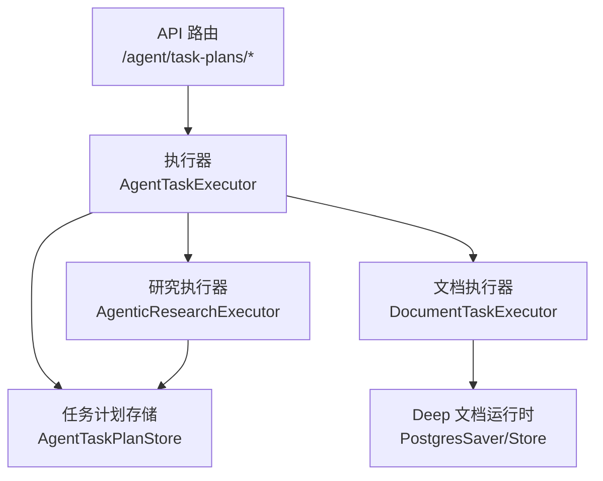
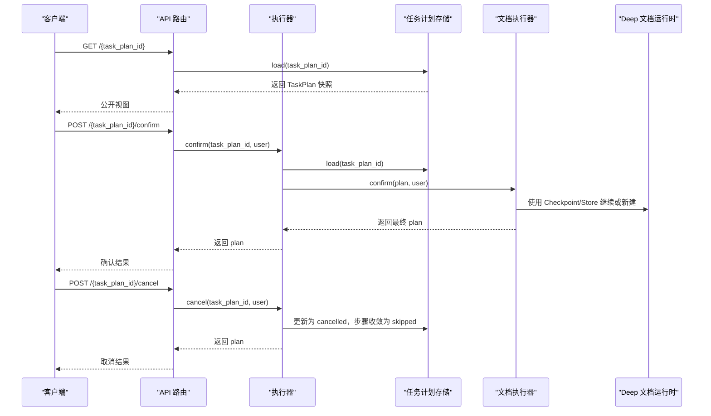
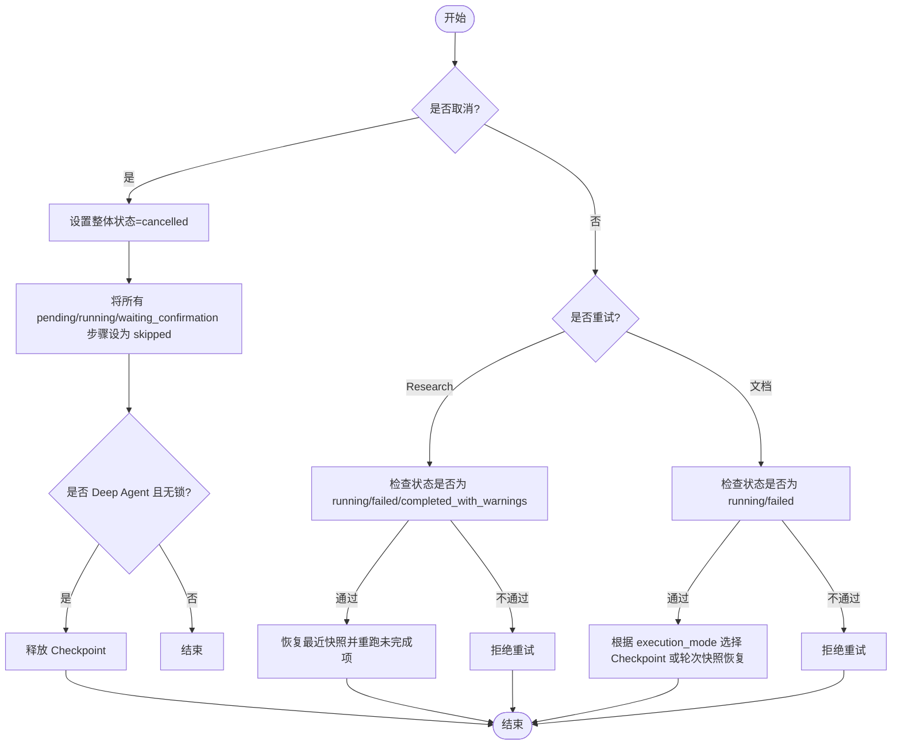
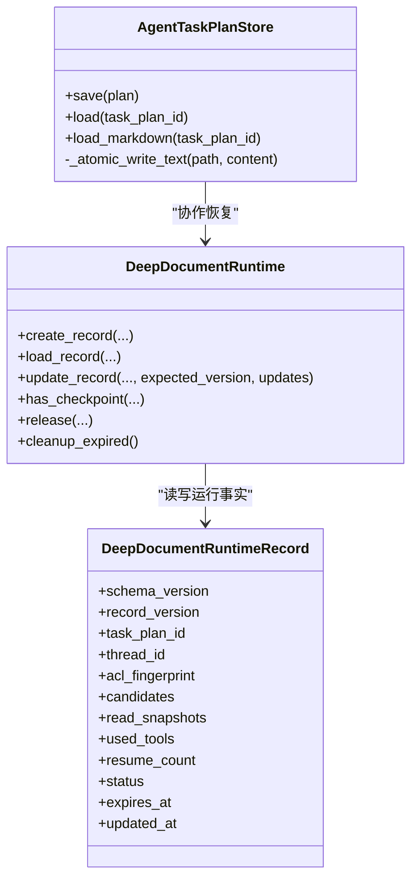
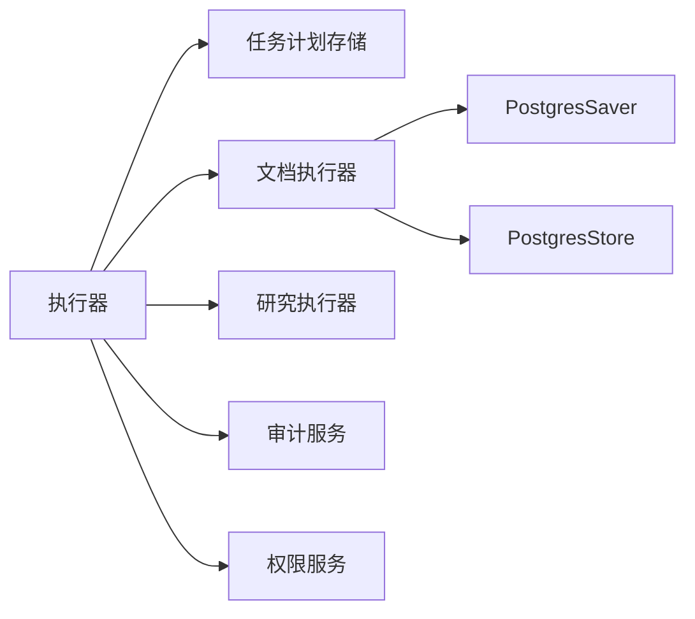

# 任务状态管理

<cite>
**本文引用的文件**
- [agent_task_plan.py](file://src/fast_app/domain/agent_task_plan.py)
- [agent_task_executor.py](file://src/fast_app/services/agent_tasks/agent_task_executor.py)
- [agent_task_plan_store.py](file://src/fast_app/services/agent_tasks/agent_task_plan_store.py)
- [deep_document_runtime.py](file://src/fast_app/services/agent_tasks/deep_document_runtime.py)
- [agent_task_plan_routes.py](file://src/fast_app/api/agent_task_plan_routes.py)
- [ingestion_tables.py](file://src/fast_app/db/ingestion_tables.py)
- [多Agent架构升级方案 + 模块代码讲解.md](file://scripts/docs/多Agent架构升级方案 + 模块代码讲解.md)
- [未完成功能-9-实现方案 + 模块讲解.md](file://scripts/docs/未完成功能-9-实现方案 + 模块讲解.md)
- [【重要问题】多Worker实例时的多线程问题.md](file://scripts/docs/【重要问题】多Worker实例时的多线程问题.md)
</cite>

## 目录
1. [简介](#简介)
2. [项目结构](#项目结构)
3. [核心组件](#核心组件)
4. [架构总览](#架构总览)
5. [详细组件分析](#详细组件分析)
6. [依赖关系分析](#依赖关系分析)
7. [性能与并发注意事项](#性能与并发注意事项)
8. [故障排查指南](#故障排查指南)
9. [结论](#结论)
10. [附录：接口与监控实践](#附录接口与监控实践)

## 简介
本文件系统化梳理 Agent 任务的状态机设计、状态持久化机制、状态变更触发条件与业务规则、状态查询与监控实践，以及迁移历史与审计追踪能力。内容覆盖两类任务：知识文档管理类（Tool Loop / Deep Agent）与研究类（问题拆解与证据评估）。重点说明 pending、running、completed、failed、cancelled、waiting_confirmation、skipped、partial 等状态的语义、转换条件与恢复策略。

## 项目结构
围绕任务状态管理的核心代码分布在领域模型、执行器、存储与 API 路由层：
- 领域模型定义任务计划、步骤、子问题及状态枚举。
- 执行器负责状态校验、并发控制、确认/取消/重试的分派。
- 存储层提供 TaskPlan JSON/Markdown 快照的原子写入与读取。
- 运行时层提供 Deep Agent 的 PostgreSQL Checkpoint 与运行事实记录。
- API 路由暴露查询、确认、取消、重试与 SSE 进度推送。

图表来源
- [agent_task_plan_routes.py:111-255](file://src/fast_app/api/agent_task_plan_routes.py#L111-L255)
- [agent_task_executor.py:135-202](file://src/fast_app/services/agent_tasks/agent_task_executor.py#L135-L202)
- [agent_task_plan_store.py:23-95](file://src/fast_app/services/agent_tasks/agent_task_plan_store.py#L23-L95)
- [deep_document_runtime.py:271-349](file://src/fast_app/services/agent_tasks/deep_document_runtime.py#L271-L349)

章节来源
- [agent_task_plan_routes.py:111-255](file://src/fast_app/api/agent_task_plan_routes.py#L111-L255)
- [agent_task_executor.py:135-202](file://src/fast_app/services/agent_tasks/agent_task_executor.py#L135-L202)
- [agent_task_plan_store.py:23-95](file://src/fast_app/services/agent_tasks/agent_task_plan_store.py#L23-L95)
- [deep_document_runtime.py:271-349](file://src/fast_app/services/agent_tasks/deep_document_runtime.py#L271-L349)

## 核心组件
- 任务计划与步骤状态枚举：定义整体任务状态与单个工具步骤状态，包括 created、running、waiting_confirmation、completed、completed_with_warnings、failed、cancelled、pending、waiting_confirmation、completed、failed、skipped。
- 执行器：统一入口，负责同任务互斥锁、归属校验、权限重建、确认/取消/重试分派。
- 任务计划存储：原子写入 JSON/Markdown 快照，支持按 task_plan_id 加载最新快照。
- Deep 文档运行时：PostgreSQL 加密 Checkpoint 与运行事实记录，提供创建、读取、更新、释放与过期清理。
- API 路由：提供查询、确认、取消、重试、SSE 进度事件流。

章节来源
- [agent_task_plan.py:26-47](file://src/fast_app/domain/agent_task_plan.py#L26-L47)
- [agent_task_executor.py:81-133](file://src/fast_app/services/agent_tasks/agent_task_executor.py#L81-L133)
- [agent_task_plan_store.py:23-95](file://src/fast_app/services/agent_tasks/agent_task_plan_store.py#L23-L95)
- [deep_document_runtime.py:170-208](file://src/fast_app/services/agent_tasks/deep_document_runtime.py#L170-L208)
- [agent_task_plan_routes.py:111-255](file://src/fast_app/api/agent_task_plan_routes.py#L111-L255)

## 架构总览
下图展示从 API 到执行器、存储与运行时的调用链，以及状态在确认、取消、重试过程中的流转。

图表来源
- [agent_task_plan_routes.py:111-255](file://src/fast_app/api/agent_task_plan_routes.py#L111-L255)
- [agent_task_executor.py:212-278](file://src/fast_app/services/agent_tasks/agent_task_executor.py#L212-L278)
- [agent_task_plan_store.py:29-95](file://src/fast_app/services/agent_tasks/agent_task_plan_store.py#L29-L95)
- [deep_document_runtime.py:379-506](file://src/fast_app/services/agent_tasks/deep_document_runtime.py#L379-L506)

## 详细组件分析

### 状态机设计与转换规则
- 整体任务状态
  - created：任务计划刚创建，尚未进入执行。
  - running：正在执行中。
  - waiting_confirmation：需要人工确认后才会真实执行（如文档修改建议）。
  - completed/completed_with_warnings：成功完成，后者表示存在警告但不影响成功。
  - failed：执行失败。
  - cancelled：被用户或系统取消。
- 工具步骤状态
  - pending：等待执行。
  - running：正在执行。
  - waiting_confirmation：需要人工确认。
  - completed：完成。
  - failed：失败。
  - skipped：因前置依赖失败或取消而跳过。
- 子问题结果状态
  - completed/partial/failed/skipped：分别表示完整回答、部分覆盖、失败、因依赖失败未执行。

关键转换规则
- 取消流程
  - 将整体状态置为 cancelled；所有 pending/running/waiting_confirmation 的步骤收敛为 skipped，并标记错误原因；记录取消时间。
  - 对于 Deep Agent 且当前无锁时，立即释放 checkpoint。
- 重试流程
  - Research：仅允许 running、failed、completed_with_warnings 重试；保留已完成 Worker，重跑 partial/failed/skipped 和未开始子问题。
  - 文档任务：仅允许 running 或 failed 重试；agentic 模式走 LangGraph Checkpoint 恢复，非 agentic 走 final_output.checkpoint 轮次快照。
- 依赖与跳过
  - 若前置子问题未完成或结果为 failed，则下游依赖不会进入 ready，而是等待或变为 skipped。
  - 前置结果为 completed 或 partial 时，下游可继续执行。

图表来源
- [agent_task_executor.py:212-278](file://src/fast_app/services/agent_tasks/agent_task_executor.py#L212-L278)
- [agent_task_executor.py:341-442](file://src/fast_app/services/agent_tasks/agent_task_executor.py#L341-L442)
- [多Agent架构升级方案 + 模块代码讲解.md:4549-4652](file://scripts/docs/多Agent架构升级方案 + 模块代码讲解.md#L4549-L4652)

章节来源
- [agent_task_plan.py:26-47](file://src/fast_app/domain/agent_task_plan.py#L26-L47)
- [agent_task_executor.py:212-278](file://src/fast_app/services/agent_tasks/agent_task_executor.py#L212-L278)
- [agent_task_executor.py:341-442](file://src/fast_app/services/agent_tasks/agent_task_executor.py#L341-L442)
- [多Agent架构升级方案 + 模块代码讲解.md:4549-4652](file://scripts/docs/多Agent架构升级方案 + 模块代码讲解.md#L4549-L4652)

### 状态持久化机制
- TaskPlan 快照
  - 以 JSON 为唯一事实源，Markdown 为人类可读审查视图。
  - 原子写入：先写临时文件再替换目标文件，避免读到半份快照。
  - 按 task_plan_id 命名，重复保存会覆盖同一 ID 的最新文件。
  - 加载时对 schema_version 进行校验，不支持的版本直接报错。
- Deep 文档运行时
  - PostgresSaver：保存 LangGraph 内部执行现场（消息、虚拟文件、节点进度），使用 AES 加密序列化。
  - PostgresStore：保存业务层运行事实（ACL 指纹、源文件 SHA、used_tools、record_version、status、expires_at），不包含完整正文。
  - 生命周期：创建记录 → 运行中 → 释放（删除 Saver 与 Store 记录）→ 启动时清理过期记录。
  - 版本管理：schema_version 用于兼容判断；record_version 用于乐观锁冲突检测。

图表来源
- [agent_task_plan_store.py:23-95](file://src/fast_app/services/agent_tasks/agent_task_plan_store.py#L23-L95)
- [deep_document_runtime.py:170-208](file://src/fast_app/services/agent_tasks/deep_document_runtime.py#L170-L208)
- [deep_document_runtime.py:379-506](file://src/fast_app/services/agent_tasks/deep_document_runtime.py#L379-L506)

章节来源
- [agent_task_plan_store.py:23-95](file://src/fast_app/services/agent_tasks/agent_task_plan_store.py#L23-L95)
- [deep_document_runtime.py:170-208](file://src/fast_app/services/agent_tasks/deep_document_runtime.py#L170-L208)
- [deep_document_runtime.py:379-506](file://src/fast_app/services/agent_tasks/deep_document_runtime.py#L379-L506)

### 状态变更触发条件与业务规则
- 人工确认
  - 仅当整体状态为 waiting_confirmation 时允许确认；确认前重新鉴权并重建 ACL。
  - 文档任务确认后进入高风险的真实写入流程；研究任务确认后启动多 Worker 波次执行。
- 错误处理与回退
  - 取消时将未终态步骤收敛为 skipped，并记录错误原因；Deep Agent 在无锁时立即释放 checkpoint。
  - 重试时保留已完成 Worker，仅重跑未完成项；非 agentic 文档任务基于轮次快照恢复。
- 依赖与跳过
  - 前置依赖未完成或失败时，下游不会进入 ready，可能保持等待或变为 skipped。
  - 前置结果为 completed 或 partial 时，下游可继续执行。

章节来源
- [agent_task_executor.py:444-496](file://src/fast_app/services/agent_tasks/agent_task_executor.py#L444-L496)
- [agent_task_executor.py:212-278](file://src/fast_app/services/agent_tasks/agent_task_executor.py#L212-L278)
- [多Agent架构升级方案 + 模块代码讲解.md:4549-4652](file://scripts/docs/多Agent架构升级方案 + 模块代码讲解.md#L4549-L4652)

### 状态查询接口与监控实践
- 查询接口
  - GET /agent/task-plans/{task_plan_id}：返回公开视图的任务计划快照。
  - GET /agent/task-plans/{task_plan_id}/markdown：返回 Markdown 审查视图。
- 控制接口
  - POST /agent/task-plans/{task_plan_id}/confirm：确认并执行等待确认的计划。
  - POST /agent/task-plans/{task_plan_id}/confirm/stream：确认并实时推送执行进度（SSE）。
  - POST /agent/task-plans/{task_plan_id}/cancel：取消任务。
  - POST /agent/task-plans/{task_plan_id}/retry：恢复最近完整快照并继续执行。
- 监控最佳实践
  - 使用 SSE 订阅 agent_task_status、sub_question_completed、agent_task_step_completed 等事件，前端去重显示。
  - 结合 LangSmith trace 元数据与 tags，按 pipeline、operation、task_plan_id 追踪链路。
  - 对失败/运行中的任务，关注 expires_at 与 status，避免长期占用资源。

章节来源
- [agent_task_plan_routes.py:111-255](file://src/fast_app/api/agent_task_plan_routes.py#L111-L255)
- [agent_task_plan_routes.py:258-433](file://src/fast_app/api/agent_task_plan_routes.py#L258-L433)
- [agent_task_plan_routes.py:436-661](file://src/fast_app/api/agent_task_plan_routes.py#L436-L661)

### 迁移历史与审计追踪
- 迁移历史
  - Alembic 版本包含对话表、摘要、认证、部门 ACL、工具权限、NL2SQL RBAC 与审计、数据集等迁移，支撑权限与审计能力。
  - 任务计划存储与运行时记录具备 schema_version 与 record_version，便于未来演进与兼容性控制。
- 审计追踪
  - 工具权限决策与执行记录结构化日志，后续可扩展为 PostgreSQL 审计表。
  - SSE 事件与 LangSmith trace 提供端到端执行轨迹，便于问题定位与合规审计。

章节来源
- [ingestion_tables.py:81-106](file://src/fast_app/db/ingestion_tables.py#L81-L106)
- [agent_tool_audit_service.py:20-57](file://src/fast_app/services/agent_tasks/agent_tool_audit_service.py#L20-L57)
- [agent_task_plan_routes.py:74-108](file://src/fast_app/api/agent_task_plan_routes.py#L74-L108)

## 依赖关系分析
- 执行器依赖
  - 任务计划存储：负责快照原子写入与读取。
  - 文档执行器与研究执行器：按 task_kind 分派具体执行逻辑。
  - 权限与审计服务：确认/恢复时重新鉴权，记录工具权限决策与执行。
- 运行时依赖
  - PostgresSaver：LangGraph 内部状态持久化，AES 加密。
  - PostgresStore：业务运行事实，包含 ACL 指纹、源文件 SHA、used_tools、record_version、status、expires_at。
- 外部依赖
  - PostgreSQL 连接池：共享于 Saver 与 Store。
  - LangSmith：trace 与 metadata/tags 用于链路追踪。

图表来源
- [agent_task_executor.py:135-202](file://src/fast_app/services/agent_tasks/agent_task_executor.py#L135-L202)
- [deep_document_runtime.py:271-349](file://src/fast_app/services/agent_tasks/deep_document_runtime.py#L271-L349)

章节来源
- [agent_task_executor.py:135-202](file://src/fast_app/services/agent_tasks/agent_task_executor.py#L135-L202)
- [deep_document_runtime.py:271-349](file://src/fast_app/services/agent_tasks/deep_document_runtime.py#L271-L349)

## 性能与并发注意事项
- 单进程互斥
  - 使用 _TaskPlanLockRegistry 保证同一 task_plan_id 的请求 fail-fast，避免重复执行。
  - cancel 不等待长任务锁，立即写入信号，让运行节点在安全边界停止。
- 多 Worker 风险
  - 当前实现适合单进程学习与有限测试；多 Uvicorn Worker 或多容器实例下任务并发一致性不安全。
  - 建议将 TaskPlan 业务事实迁入 PostgreSQL，使用租约/CAS 替代进程内锁。
- 恢复与清理
  - 失败/运行中的 Checkpoint 保留固定天数，完成后立即删除；清理前先保证 TaskPlan 已安全保存。
  - 启动时清理过期记录，避免遗留占用资源。

章节来源
- [agent_task_executor.py:81-133](file://src/fast_app/services/agent_tasks/agent_task_executor.py#L81-L133)
- [【重要问题】多Worker实例时的多线程问题.md:470-506](file://scripts/docs/【重要问题】多Worker实例时的多线程问题.md#L470-L506)
- [未完成功能-9-实现方案 + 模块讲解.md:4423-4509](file://scripts/docs/未完成功能-9-实现方案 + 模块讲解.md#L4423-L4509)

## 故障排查指南
- 常见错误
  - 非法 task_plan_id：需以 task_plan_ 开头。
  - 任务不存在：对应目录下无匹配 JSON。
  - 版本不受支持：schema_version 不匹配当前代码。
  - 运行记录损坏或版本不兼容：无法 model_validate 或 schema_version 不一致。
  - 并发冲突：record_version 不匹配，提示已被其他恢复请求更新。
- 排查步骤
  - 检查 API 返回的错误码与消息。
  - 查看 TaskPlan JSON/Markdown 快照，确认状态与步骤。
  - 检查 Deep 文档运行记录的 status、expires_at、acl_fingerprint。
  - 确认 SSE 事件是否到达，是否存在重复或丢失。
  - 验证权限与 ACL 是否变化，必要时重新鉴权后重试。

章节来源
- [agent_task_plan_store.py:69-95](file://src/fast_app/services/agent_tasks/agent_task_plan_store.py#L69-L95)
- [deep_document_runtime.py:411-481](file://src/fast_app/services/agent_tasks/deep_document_runtime.py#L411-L481)
- [agent_task_plan_routes.py:111-255](file://src/fast_app/api/agent_task_plan_routes.py#L111-L255)

## 结论
该任务状态管理体系通过明确的状态枚举、严格的转换规则、原子化的快照存储与加密的运行时持久化，实现了可靠的人工确认、取消与重试流程。SSE 与 LangSmith 提供了良好的可观测性。生产化需解决多 Worker 并发一致性与业务事实数据库化，以提升鲁棒性与可维护性。

## 附录：接口与监控实践
- 接口清单
  - GET /agent/task-plans/{task_plan_id}：查询任务计划。
  - GET /agent/task-plans/{task_plan_id}/markdown：查询 Markdown 审查视图。
  - POST /agent/task-plans/{task_plan_id}/confirm：确认执行。
  - POST /agent/task-plans/{task_plan_id}/confirm/stream：确认并流式推送进度。
  - POST /agent/task-plans/{task_plan_id}/cancel：取消任务。
  - POST /agent/task-plans/{task_plan_id}/retry：恢复并继续执行。
- 监控要点
  - 订阅 agent_task_status、sub_question_completed、agent_task_step_completed 等事件。
  - 使用 LangSmith trace 元数据与 tags 追踪 pipeline、operation、task_plan_id。
  - 关注 expires_at 与 status，及时清理过期记录。

章节来源
- [agent_task_plan_routes.py:111-255](file://src/fast_app/api/agent_task_plan_routes.py#L111-L255)
- [agent_task_plan_routes.py:258-433](file://src/fast_app/api/agent_task_plan_routes.py#L258-L433)
- [agent_task_plan_routes.py:436-661](file://src/fast_app/api/agent_task_plan_routes.py#L436-L661)