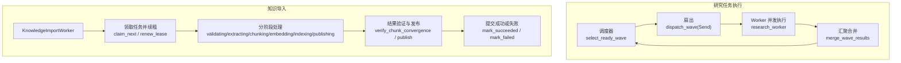
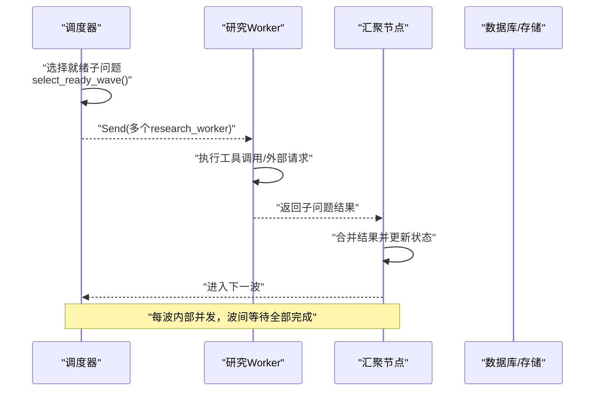
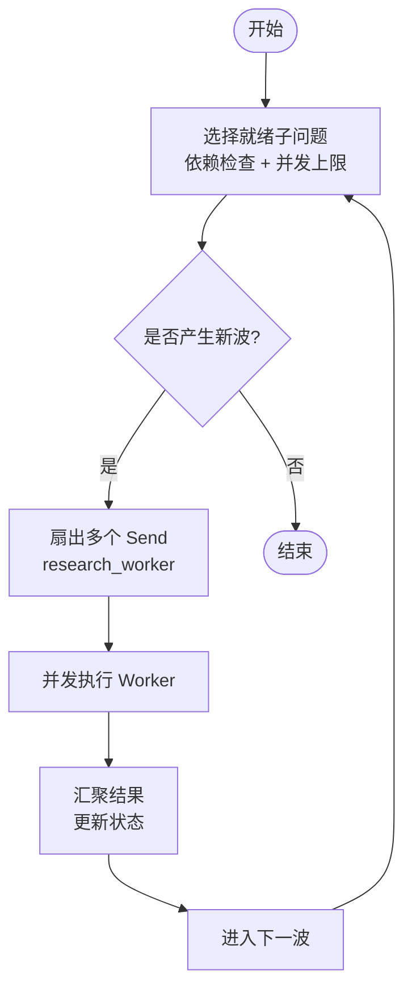
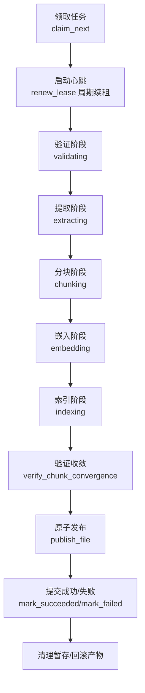
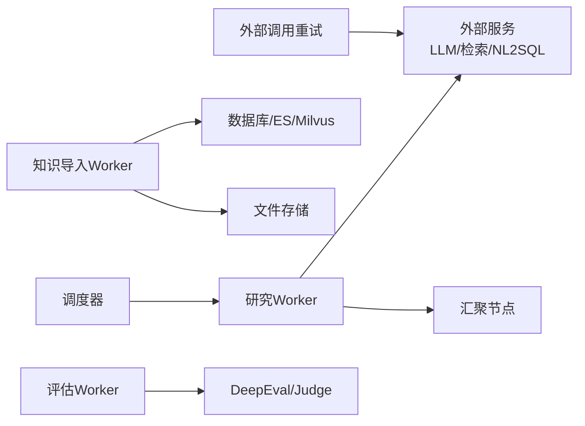

# 并行执行与资源管理

<cite>
**本文引用的文件**   
- [src/fast_app/ingestion/worker.py](file://src/fast_app/ingestion/worker.py)
- [src/fast_app/domain/research_task_plan.py](file://src/fast_app/domain/research_task_plan.py)
- [src/fast_app/services/external_call_policy.py](file://src/fast_app/services/external_call_policy.py)
- [src/fast_app/core/latency.py](file://src/fast_app/core/latency.py)
- [scripts/docs/多Agent架构升级方案 + 模块代码讲解.md](file://scripts/docs/多Agent架构升级方案 + 模块代码讲解.md)
- [scripts/tests/nl2sql/test_real_databases.py](file://scripts/tests/nl2sql/test_real_databases.py)
- [src/fast_app/rag_eval/generation_worker.py](file://src/fast_app/rag_eval/generation_worker.py)
</cite>

## 目录
1. [简介](#简介)
2. [项目结构](#项目结构)
3. [核心组件](#核心组件)
4. [架构总览](#架构总览)
5. [详细组件分析](#详细组件分析)
6. [依赖关系分析](#依赖关系分析)
7. [性能考虑](#性能考虑)
8. [故障排查指南](#故障排查指南)
9. [结论](#结论)
10. [附录](#附录)

## 简介
本文件围绕“并行执行与资源管理”主题，系统化梳理项目中多 Worker 并行执行机制、任务分解与并行度控制（Wave 概念、尝试次数限制、超时处理）、资源管理机制（内存、外部服务限流、并发连接池），以及性能监控与优化建议、故障隔离与容错策略。文档以仓库中实际实现为依据，结合图示帮助读者理解调度、执行、汇聚与恢复的完整链路。

## 项目结构
本项目在 FastAPI 应用内实现了两类主要并行场景：
- 研究型多 Agent 任务：基于 LangGraph Pregel 的异步图执行，使用 Send 将同一节点拆分为多个并发 Worker，按 Wave 分批扇出与汇聚。
- 知识导入 Worker：独立进程/线程中的持久化导入任务，具备租约、心跳、阶段推进、回滚与重试能力。

图表来源
- [scripts/docs/多Agent架构升级方案 + 模块代码讲解.md:3672-4335](file://scripts/docs/多Agent架构升级方案 + 模块代码讲解.md#L3672-L4335)
- [src/fast_app/ingestion/worker.py:116-419](file://src/fast_app/ingestion/worker.py#L116-L419)

章节来源
- [scripts/docs/多Agent架构升级方案 + 模块代码讲解.md:3672-4335](file://scripts/docs/多Agent架构升级方案 + 模块代码讲解.md#L3672-L4335)
- [src/fast_app/ingestion/worker.py:116-419](file://src/fast_app/ingestion/worker.py#L116-L419)

## 核心组件
- 研究任务计划与进度模型：定义子问题、依赖、证据、波次、尝试次数、阶段等状态，支撑 Wave 调度与可观测性。
- 研究 Worker 执行与调度：通过 Send 扇出、Pregel 并发执行、统一汇聚，形成带依赖屏障的批次执行。
- 知识导入 Worker：具备租约、心跳、阶段推进、差异同步、双存储写入、原子发布与回滚。
- 外部调用重试策略：统一的 call_with_retry，支持超时、传输错误与特定 HTTP 状态码的重试。
- 延迟与慢操作日志：提供计时与慢操作告警工具，便于性能监控。
- 评估 Worker：隔离环境运行 DeepEval 指标，单项失败不影响整体评测。

章节来源
- [src/fast_app/domain/research_task_plan.py:631-769](file://src/fast_app/domain/research_task_plan.py#L631-L769)
- [scripts/docs/多Agent架构升级方案 + 模块代码讲解.md:3672-4335](file://scripts/docs/多Agent架构升级方案 + 模块代码讲解.md#L3672-L4335)
- [src/fast_app/ingestion/worker.py:116-419](file://src/fast_app/ingestion/worker.py#L116-L419)
- [src/fast_app/services/external_call_policy.py:21-74](file://src/fast_app/services/external_call_policy.py#L21-L74)
- [src/fast_app/core/latency.py:7-37](file://src/fast_app/core/latency.py#L7-L37)
- [src/fast_app/rag_eval/generation_worker.py:112-220](file://src/fast_app/rag_eval/generation_worker.py#L112-L220)

## 架构总览
下图展示了研究任务的 Wave 调度与汇聚流程，以及知识导入 Worker 的阶段化执行与回滚路径。两者共同体现“批内并发、批间屏障”的设计思想。

图表来源
- [scripts/docs/多Agent架构升级方案 + 模块代码讲解.md:3672-4335](file://scripts/docs/多Agent架构升级方案 + 模块代码讲解.md#L3672-L4335)

章节来源
- [scripts/docs/多Agent架构升级方案 + 模块代码讲解.md:3672-4335](file://scripts/docs/多Agent架构升级方案 + 模块代码讲解.md#L3672-L4335)

## 详细组件分析

### 研究任务：Wave 调度与负载均衡
- Wave 概念：一批依赖已满足且受并发上限允许的任务集合；同一波内可并发执行，下一波必须等待上一波结果。
- 扇出与汇聚：调度器根据依赖与 max_parallel_workers 裁剪 ready 列表，生成多个 Send；Worker 完成后统一汇聚，再进入下一波。
- 负载均衡：通过限制每波最大并发数，避免瞬时过载；依赖传播确保下游仅在直接依赖 completed/partial 后启动。
- 取消与重试：在派发新波前、Worker 尝试开始前、合并前检查取消；失败依赖使下游变为 skipped，无关任务继续运行。

图表来源
- [scripts/docs/多Agent架构升级方案 + 模块代码讲解.md:3672-4335](file://scripts/docs/多Agent架构升级方案 + 模块代码讲解.md#L3672-L4335)

章节来源
- [scripts/docs/多Agent架构升级方案 + 模块代码讲解.md:3672-4335](file://scripts/docs/多Agent架构升级方案 + 模块代码讲解.md#L3672-L4335)

### 研究任务：尝试次数限制与超时处理
- 尝试次数：每个 Worker 维护 attempt_count，用于记录当前子问题的研究尝试次数；达到预算后可判定 partial/failed。
- 超时处理：外部调用使用统一重试策略，httpx 超时会被包装为外部服务超时异常；Worker 内部应周期性检查取消状态并设置 HTTP 超时。
- 失败传播：若某 Worker 失败，其下游依赖将被标记为 skipped，但其他无关联分支继续执行。

章节来源
- [src/fast_app/domain/research_task_plan.py:266-297](file://src/fast_app/domain/research_task_plan.py#L266-L297)
- [src/fast_app/services/external_call_policy.py:21-74](file://src/fast_app/services/external_call_policy.py#L21-L74)
- [scripts/docs/多Agent架构升级方案 + 模块代码讲解.md:6404-6468](file://scripts/docs/多Agent架构升级方案 + 模块代码讲解.md#L6404-L6468)

### 知识导入 Worker：租约、心跳与阶段推进
- 租约与心跳：Worker 领取任务后启动后台心跳任务，定期续租；失租时立即停止后续共享状态写入。
- 阶段推进：在每个阶段切换前检查租约，并通过数据库记录阶段；长耗时阶段（如 Embedding、索引）仍保持心跳续租。
- 差异同步与双写：计算 ES/Milvus 的 chunk 差异，仅对变更部分进行 embedding 与索引更新，最后验证收敛并发布文件。
- 回滚与向前修复：Create 失败清理产物；Update 失败根据目标文件提交点选择回滚旧版或向前完成。

图表来源
- [src/fast_app/ingestion/worker.py:116-419](file://src/fast_app/ingestion/worker.py#L116-L419)
- [src/fast_app/ingestion/worker.py:529-560](file://src/fast_app/ingestion/worker.py#L529-L560)
- [src/fast_app/ingestion/worker.py:746-800](file://src/fast_app/ingestion/worker.py#L746-L800)

章节来源
- [src/fast_app/ingestion/worker.py:116-419](file://src/fast_app/ingestion/worker.py#L116-L419)
- [src/fast_app/ingestion/worker.py:529-560](file://src/fast_app/ingestion/worker.py#L529-L560)
- [src/fast_app/ingestion/worker.py:746-800](file://src/fast_app/ingestion/worker.py#L746-L800)

### 外部服务调用限流与重试
- 重试策略：call_with_retry 接收任意异步函数，判断异常是否可重试（超时、传输错误、特定 HTTP 状态码），按 base_delay * attempt 指数退避。
- 超时包装：httpx.TimeoutException 被包装为 ExternalServiceTimeoutError，便于上层统一处理。
- 适用场景：适用于 LLM 调用、检索服务、NL2SQL 查询等外部依赖，降低瞬时失败对整体任务的影响。

章节来源
- [src/fast_app/services/external_call_policy.py:21-74](file://src/fast_app/services/external_call_policy.py#L21-L74)

### 并发连接池控制
- 数据库连接池：测试脚本中使用 asyncpg.create_pool 创建连接池，并设置 min_size/max_size，确保并发访问时的连接复用与上限控制。
- 作用域隔离：在同一物理连接上连续服务不同 Scope 时，事务级 set_config 不会串线，保证数据隔离。

章节来源
- [scripts/tests/nl2sql/test_real_databases.py:12-42](file://scripts/tests/nl2sql/test_real_databases.py#L12-L42)

### 评估 Worker：隔离执行与单项失败隔离
- 隔离环境：DeepEval 指标在隔离虚拟环境中运行，避免第三方库污染主进程。
- 单项失败隔离：每个指标独立 try/except，失败时返回 error 状态，不影响其他指标评估。
- 跳过与零分：缺少上下文或答案时，相应指标被跳过或给出零分，保证评测完整性。

章节来源
- [src/fast_app/rag_eval/generation_worker.py:112-220](file://src/fast_app/rag_eval/generation_worker.py#L112-L220)

## 依赖关系分析
- 研究任务依赖：Wave 调度依赖子问题依赖图与 max_parallel_workers；Worker 执行依赖外部工具与存储服务；汇聚节点依赖所有 Worker 结果。
- 知识导入依赖：Worker 依赖数据库会话、Embedding 客户端、ES/Milvus 客户端；阶段推进依赖租约与心跳；发布依赖原子文件替换。
- 外部调用依赖：call_with_retry 依赖 httpx 异常类型与重试策略；评估 Worker 依赖 DeepEval 指标与 Judge 模型。

图表来源
- [scripts/docs/多Agent架构升级方案 + 模块代码讲解.md:3672-4335](file://scripts/docs/多Agent架构升级方案 + 模块代码讲解.md#L3672-L4335)
- [src/fast_app/ingestion/worker.py:116-419](file://src/fast_app/ingestion/worker.py#L116-L419)
- [src/fast_app/services/external_call_policy.py:21-74](file://src/fast_app/services/external_call_policy.py#L21-L74)
- [src/fast_app/rag_eval/generation_worker.py:112-220](file://src/fast_app/rag_eval/generation_worker.py#L112-L220)

章节来源
- [scripts/docs/多Agent架构升级方案 + 模块代码讲解.md:3672-4335](file://scripts/docs/多Agent架构升级方案 + 模块代码讲解.md#L3672-L4335)
- [src/fast_app/ingestion/worker.py:116-419](file://src/fast_app/ingestion/worker.py#L116-L419)
- [src/fast_app/services/external_call_policy.py:21-74](file://src/fast_app/services/external_call_policy.py#L21-L74)
- [src/fast_app/rag_eval/generation_worker.py:112-220](file://src/fast_app/rag_eval/generation_worker.py#L112-L220)

## 性能考虑
- CPU 利用率：研究任务以协程并发为主，CPU 密集操作应限制并发或使用线程池；知识导入的解析与分块可能涉及 CPU 密集，建议使用 asyncio.to_thread 避免阻塞事件循环。
- 内存使用：Embedding 与向量写入需关注内存峰值；差异同步减少不必要写入，降低内存与网络开销。
- 执行时间统计：使用 start_timer/elapsed_ms 记录关键阶段耗时，log_slow_operation 输出慢操作告警；结合 SSE 或日志系统聚合指标。
- 外部服务限流：通过 call_with_retry 的 base_delay 与 max_retries 控制重试频率，避免雪崩；对高频服务增加熔断或降级逻辑。
- 连接池调优：根据并发量调整数据库连接池大小，避免连接耗尽；使用只读事务与 Scope 隔离提升吞吐与一致性。

章节来源
- [src/fast_app/core/latency.py:7-37](file://src/fast_app/core/latency.py#L7-L37)
- [src/fast_app/services/external_call_policy.py:21-74](file://src/fast_app/services/external_call_policy.py#L21-L74)
- [scripts/tests/nl2sql/test_real_databases.py:12-42](file://scripts/tests/nl2sql/test_real_databases.py#L12-L42)

## 故障排查指南
- Worker 失败隔离：单个 Worker 失败不会影响整体任务执行；下游依赖失败会传播 skipped，但无关分支继续运行。
- 取消与重试：在派发新波前、Worker 尝试开始前、合并前检查取消；外部调用失败按策略重试，超时包装为统一异常。
- 知识导入回滚：Create 失败清理产物；Update 失败根据目标文件提交点选择回滚旧版或向前完成；失租时立即停止写入。
- 慢操作定位：使用 log_slow_operation 输出慢操作日志，结合事件追踪定位瓶颈；评估 Worker 单项失败不影响整体评测。

章节来源
- [scripts/docs/多Agent架构升级方案 + 模块代码讲解.md:6404-6468](file://scripts/docs/多Agent架构升级方案 + 模块代码讲解.md#L6404-L6468)
- [src/fast_app/ingestion/worker.py:116-419](file://src/fast_app/ingestion/worker.py#L116-L419)
- [src/fast_app/services/external_call_policy.py:21-74](file://src/fast_app/services/external_call_policy.py#L21-L74)
- [src/fast_app/core/latency.py:7-37](file://src/fast_app/core/latency.py#L7-L37)
- [src/fast_app/rag_eval/generation_worker.py:112-220](file://src/fast_app/rag_eval/generation_worker.py#L112-L220)

## 结论
本项目通过 Wave 调度、租约心跳、差异同步与重试策略，实现了高并发、强一致与可恢复的并行执行体系。研究任务以协程并发为主，知识导入以阶段化与原子发布保障一致性；外部调用限流与连接池控制提升了鲁棒性与性能。建议在生产环境中持续监控 CPU、内存与执行时间，结合慢操作日志与事件追踪优化瓶颈，并根据负载动态调整并发上限与重试参数。

## 附录
- Wave 调度最佳实践：合理设置 max_parallel_workers，避免过度并发导致外部服务拥塞；利用依赖图最大化并行度。
- 资源管理建议：对 CPU 密集操作使用线程池，I/O 密集操作使用协程；对外部服务实施限流与熔断。
- 监控与告警：集成延迟与慢操作日志，建立性能基线与告警阈值；对关键阶段（Embedding、索引、发布）增加健康检查。