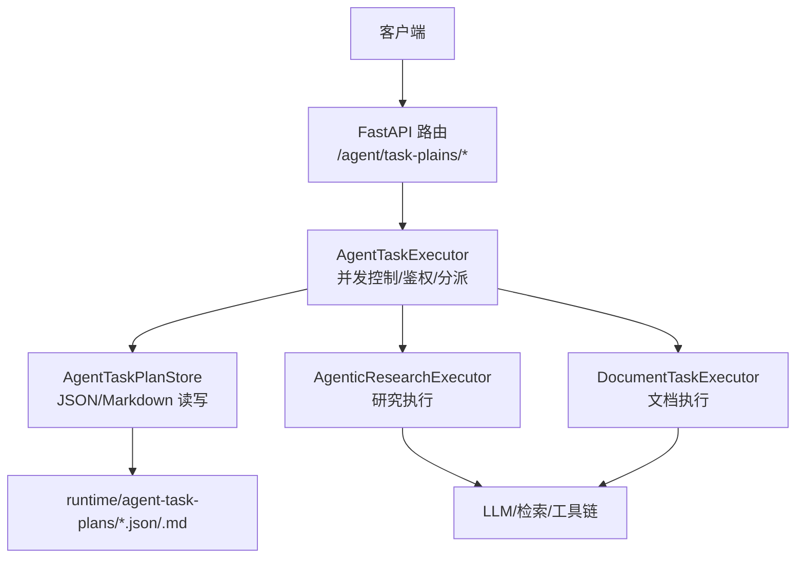
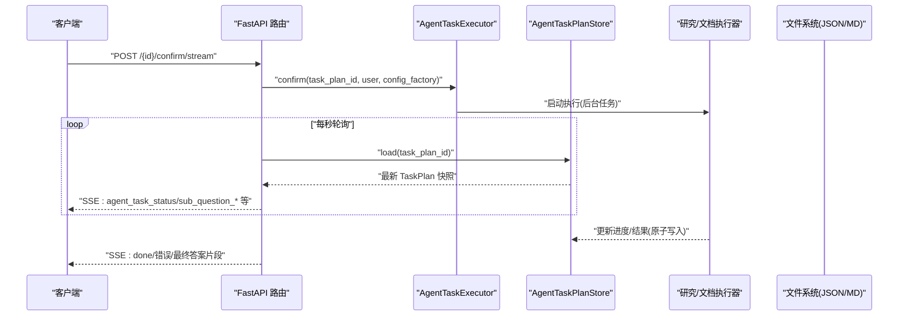
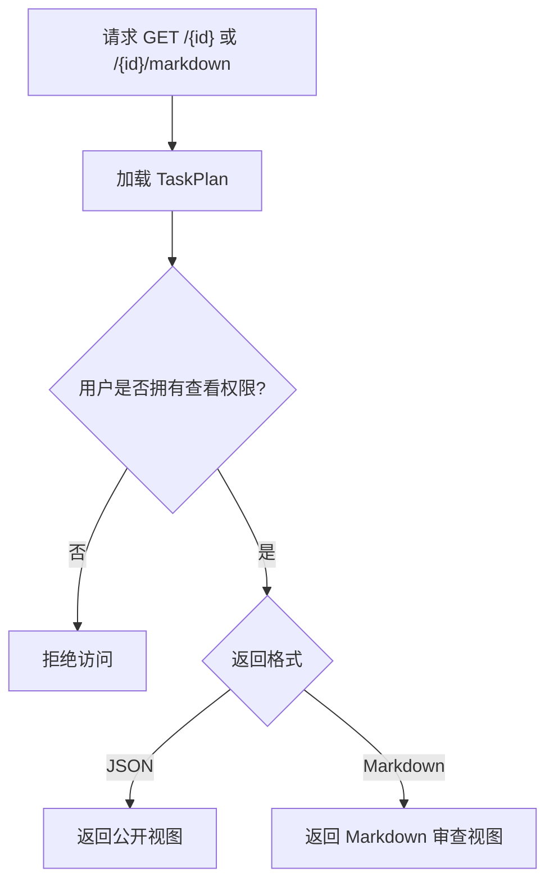
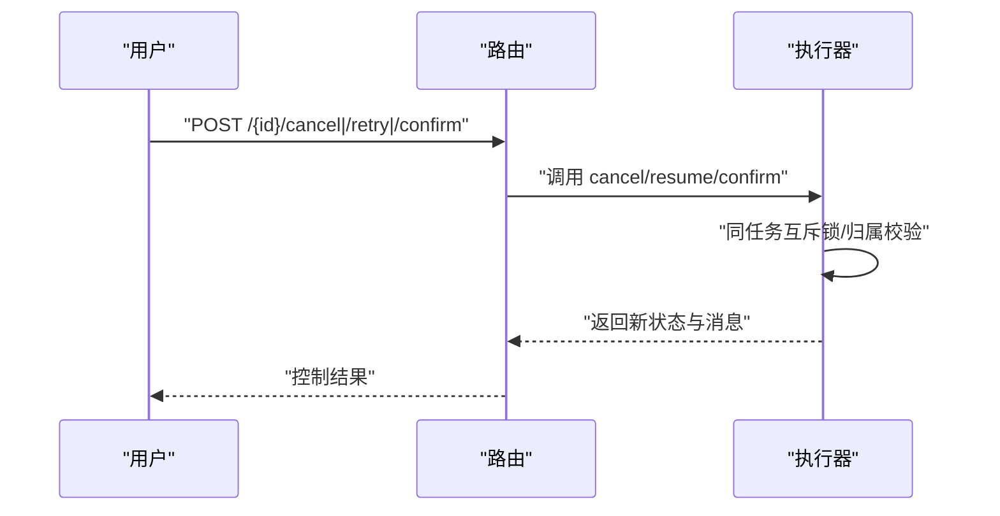
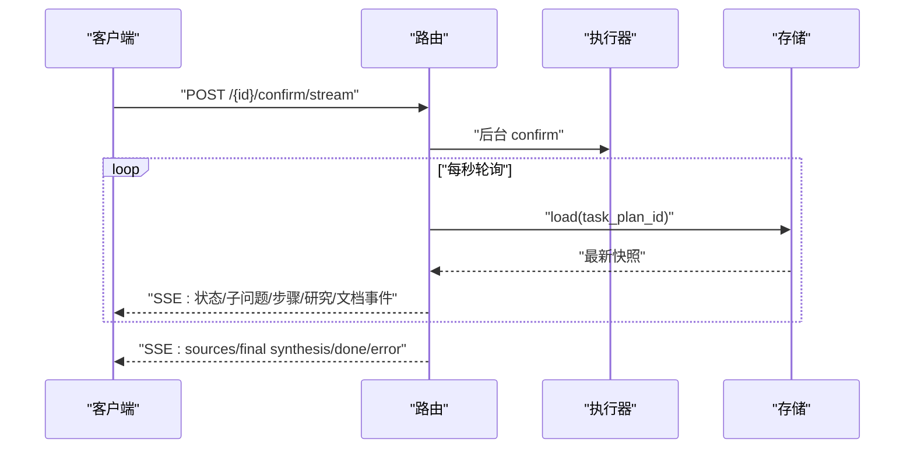
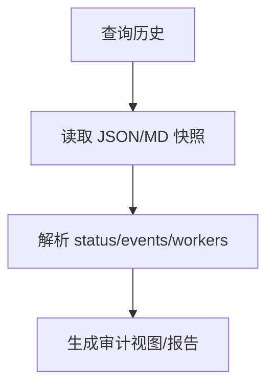
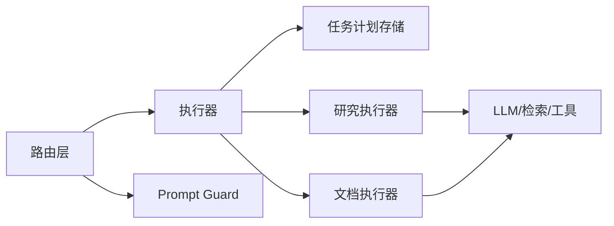

# 任务监控与查询

<cite>
**本文引用的文件**
- [agent_task_plan_routes.py](file://python-agent-study/src/fast_app/api/agent_task_plan_routes.py)
- [agent_task_executor.py](file://python-agent-study/src/fast_app/services/agent_tasks/agent_task_executor.py)
- [research_task_plan.py](file://python-agent-study/src/fast_app/domain/research_task_plan.py)
- [20260803_100145_task_plan_20260803100145_04bf20347c3c.json](file://python-agent-study/runtime/agent-task-plans/20260803_100145_task_plan_20260803100145_04bf20347c3c.json)
</cite>

## 目录
1. [简介](#简介)
2. [项目结构](#项目结构)
3. [核心组件](#核心组件)
4. [架构总览](#架构总览)
5. [详细组件分析](#详细组件分析)
6. [依赖关系分析](#依赖关系分析)
7. [性能与可观测性](#性能与可观测性)
8. [故障排查指南](#故障排查指南)
9. [结论](#结论)
10. [附录：事件与字段速查](#附录：事件与字段速查)

## 简介
本文件面向“Agent 任务监控与查询”，聚焦以下目标：
- 如何查询任务计划的状态、进度和详细信息，支持 JSON 与 Markdown 两种响应。
- 解释任务执行过程中的事件流（子问题开始、完成、失败等）以及前端如何通过 SSE 实时消费。
- 说明任务历史查询与审计日志的使用方法。
- 说明任务性能指标收集与监控告警机制。
- 提供调试工具与故障排查指南。

## 项目结构
围绕任务监控与查询的关键代码位于 FastAPI 路由层与服务层：
- API 路由：提供任务计划的读取、确认、取消、重试、SSE 流式进度等接口。
- 执行器：统一入口，负责并发控制、权限校验、分派到研究或文档执行器。
- 领域模型：定义 Research TaskPlan v2 的结构、进度、事件、证据与最终输出。
- 运行时快照：TaskPlan 的 JSON 与 Markdown 持久化产物，用于查询与审计。

图表来源
- [agent_task_plan_routes.py:111-283](file://python-agent-study/src/fast_app/api/agent_task_plan_routes.py#L111-L283)
- [agent_task_executor.py:135-201](file://python-agent-study/src/fast_app/services/agent_tasks/agent_task_executor.py#L135-L201)
- [research_task_plan.py:762-784](file://python-agent-study/src/fast_app/domain/research_task_plan.py#L762-L784)

章节来源
- [agent_task_plan_routes.py:111-283](file://python-agent-study/src/fast_app/api/agent_task_plan_routes.py#L111-L283)
- [agent_task_executor.py:135-201](file://python-agent-study/src/fast_app/services/agent_tasks/agent_task_executor.py#L135-L201)
- [research_task_plan.py:762-784](file://python-agent-study/src/fast_app/domain/research_task_plan.py#L762-L784)

## 核心组件
- 任务计划查询与展示
  - JSON 视图：GET /agent/task-plans/{task_plan_id}
  - Markdown 视图：GET /agent/task-plans/{task_plan_id}/markdown
- 任务控制
  - 取消：POST /agent/task-plans/{task_plan_id}/cancel
  - 恢复：POST /agent/task-plans/{task_plan_id}/retry
  - 确认执行：POST /agent/task-plans/{task_plan_id}/confirm
  - 确认并流式推送进度：POST /agent/task-plans/{task_plan_id}/confirm/stream
- 执行器与存储
  - AgentTaskExecutor：统一入口，负责并发互斥、归属校验、状态机推进、分派到具体执行器。
  - AgentTaskPlanStore：负责 TaskPlan 的 JSON/Markdown 原子写入与读取，供查询与审计使用。
- 领域模型
  - ResearchTaskPlan：包含需求、子问题、进度、证据注册表、要求满足状态、最终输出等。
  - 进度与事件：progress.workers、progress.events、requirement_evidence_statuses 等。

章节来源
- [agent_task_plan_routes.py:111-283](file://python-agent-study/src/fast_app/api/agent_task_plan_routes.py#L111-L283)
- [agent_task_executor.py:212-278](file://python-agent-study/src/fast_app/services/agent_tasks/agent_task_executor.py#L212-L278)
- [research_task_plan.py:762-784](file://python-agent-study/src/fast_app/domain/research_task_plan.py#L762-L784)

## 架构总览
下图展示了从 HTTP 请求到任务执行与事件回传的完整链路。

图表来源
- [agent_task_plan_routes.py:258-433](file://python-agent-study/src/fast_app/api/agent_task_plan_routes.py#L258-L433)
- [agent_task_executor.py:444-496](file://python-agent-study/src/fast_app/services/agent_tasks/agent_task_executor.py#L444-L496)
- [research_task_plan.py:762-784](file://python-agent-study/src/fast_app/domain/research_task_plan.py#L762-L784)

## 详细组件分析

### 任务计划查询（JSON 与 Markdown）
- JSON 查询
  - 路径：GET /agent/task-plans/{task_plan_id}
  - 行为：加载 TaskPlan，进行归属校验后返回公开视图。
  - 适用场景：获取当前状态、进度、证据、最终输出等结构化数据。
- Markdown 查询
  - 路径：GET /agent/task-plans/{task_plan_id}/markdown
  - 行为：返回可读的审查视图，便于人工复核与审计。
  - 适用场景：生成报告、归档、合规审计。

图表来源
- [agent_task_plan_routes.py:111-140](file://python-agent-study/src/fast_app/api/agent_task_plan_routes.py#L111-L140)

章节来源
- [agent_task_plan_routes.py:111-140](file://python-agent-study/src/fast_app/api/agent_task_plan_routes.py#L111-L140)

### 任务控制（取消、恢复、确认）
- 取消
  - 路径：POST /agent/task-plans/{task_plan_id}/cancel
  - 行为：将任务置为已取消；对运行中的 Tool Loop，会在当前轮次屏障后停止。
- 恢复
  - 路径：POST /agent/task-plans/{task_plan_id}/retry
  - 行为：按最近完整快照恢复可重试的研究或文档任务。
- 确认执行
  - 路径：POST /agent/task-plans/{task_plan_id}/confirm
  - 行为：在 WAITING_CONFIRMATION 状态下进入真实执行；研究任务启动多 Worker 波次，文档任务进入高风险写入前校验。

图表来源
- [agent_task_plan_routes.py:143-255](file://python-agent-study/src/fast_app/api/agent_task_plan_routes.py#L143-L255)
- [agent_task_executor.py:212-278](file://python-agent-study/src/fast_app/services/agent_tasks/agent_task_executor.py#L212-L278)
- [agent_task_executor.py:341-496](file://python-agent-study/src/fast_app/services/agent_tasks/agent_task_executor.py#L341-L496)

章节来源
- [agent_task_plan_routes.py:143-255](file://python-agent-study/src/fast_app/api/agent_task_plan_routes.py#L143-L255)
- [agent_task_executor.py:212-278](file://python-agent-study/src/fast_app/services/agent_tasks/agent_task_executor.py#L212-L278)
- [agent_task_executor.py:341-496](file://python-agent-study/src/fast_app/services/agent_tasks/agent_task_executor.py#L341-L496)

### 流式进度与事件（SSE）
- 入口：POST /agent/task-plans/{task_plan_id}/confirm/stream
- 机制：
  - 后台执行 confirm，同时每秒轮询 TaskPlan 快照。
  - 将新增的子问题开始/完成、步骤完成/失败、研究事件、文档事件转换为 SSE 事件推送。
  - 最终答案经 Prompt Guard 分段检查后以 token 流形式推送。
- 关键事件类型（节选）：
  - agent_task_execution_started
  - sub_question_started
  - agent_task_step_completed / agent_task_step_failed
  - agent_task_research_wave_started / agent_task_research_worker_progress / agent_task_research_worker_timed_out / agent_task_sub_question_retrying
  - agent_task_document_*（如草稿创建、子代理完成/失败、审阅完成等）
  - sources（最终答案来源）
  - agent_task_final_synthesis_completed
  - done / error

图表来源
- [agent_task_plan_routes.py:258-433](file://python-agent-study/src/fast_app/api/agent_task_plan_routes.py#L258-L433)
- [agent_task_plan_routes.py:436-661](file://python-agent-study/src/fast_app/api/agent_task_plan_routes.py#L436-L661)

章节来源
- [agent_task_plan_routes.py:258-433](file://python-agent-study/src/fast_app/api/agent_task_plan_routes.py#L258-L433)
- [agent_task_plan_routes.py:436-661](file://python-agent-study/src/fast_app/api/agent_task_plan_routes.py#L436-L661)

### 任务历史与审计
- 历史快照
  - 位置：runtime/agent-task-plans/*.json 与 *.md
  - 内容：包含 schema_version、task_plan_id、status、progress、events、requirement_evidence_statuses、final_output 等。
  - 用途：离线审计、回溯、报告生成。
- 审计要点
  - 通过 events 与 workers 状态还原执行过程。
  - 通过 requirement_evidence_statuses 核对需求满足情况。
  - 通过 final_output.used_tools/warnings 了解实际使用能力与安全限制。

图表来源
- [20260803_100145_task_plan_20260803100145_04bf20347c3c.json:1-342](file://python-agent-study/runtime/agent-task-plans/20260803_100145_task_plan_20260803100145_04bf20347c3c.json#L1-L342)

章节来源
- [20260803_100145_task_plan_20260803100145_04bf20347c3c.json:1-342](file://python-agent-study/runtime/agent-task-plans/20260803_100145_task_plan_20260803100145_04bf20347c3c.json#L1-L342)

### 性能指标与监控告警
- 追踪与元数据
  - 每个确认/恢复/取消操作均创建 LangSmith trace，附带 pipeline、operation、task_plan_id、user_id 等元数据。
  - 子节点配置通过 build_rag_langchain_pipeline_child_config 注入，便于在追踪平台中定位子阶段。
- 可观测点
  - 路由层：trace name 包含 operation（confirm/cancel/retry/confirm_stream）。
  - 执行器：同任务互斥锁、活动任务集合、能力刷新与权限重建。
  - 领域模型：progress.events、workers.stage/tool_call_count/evidence_count 等。
- 告警建议
  - 基于 events 中的超时、失败、重试计数设置阈值告警。
  - 基于 workers.attempt、tool_call_count、evidence_count 检测异常增长。
  - 基于 final_output.guard_action/guard_reason_codes 监控安全拦截。

章节来源
- [agent_task_plan_routes.py:74-108](file://python-agent-study/src/fast_app/api/agent_task_plan_routes.py#L74-L108)
- [agent_task_executor.py:516-554](file://python-agent-study/src/fast_app/services/agent_tasks/agent_task_executor.py#L516-L554)
- [research_task_plan.py:631-700](file://python-agent-study/src/fast_app/domain/research_task_plan.py#L631-L700)
- [research_task_plan.py:772-784](file://python-agent-study/src/fast_app/domain/research_task_plan.py#L772-L784)

## 依赖关系分析
- 路由依赖
  - 依赖执行器、任务计划存储、Prompt Guard、用户上下文、配置。
- 执行器依赖
  - 依赖检索器、LLM、文档管理、工具权限与审计服务、证据评估、研究/文档执行器。
- 领域模型依赖
  - 依赖基础任务状态、工具调用轨迹、证据评估等。

图表来源
- [agent_task_plan_routes.py:11-38](file://python-agent-study/src/fast_app/api/agent_task_plan_routes.py#L11-L38)
- [agent_task_executor.py:142-201](file://python-agent-study/src/fast_app/services/agent_tasks/agent_task_executor.py#L142-L201)

章节来源
- [agent_task_plan_routes.py:11-38](file://python-agent-study/src/fast_app/api/agent_task_plan_routes.py#L11-L38)
- [agent_task_executor.py:142-201](file://python-agent-study/src/fast_app/services/agent_tasks/agent_task_executor.py#L142-L201)

## 性能与可观测性
- 并发控制
  - 单进程内按 task_plan_id 互斥，避免重复确认/恢复导致的状态竞争。
  - cancel 不等待长任务锁，直接写入取消信号，由运行节点在安全边界停止。
- 流式效率
  - 通过每秒轮询快照+去重集合（seen_sub_questions/seen_steps/seen_research_events）减少重复事件。
  - 最终答案分段缓冲并通过 Prompt Guard 检查，避免一次性大文本带来的延迟。
- 追踪与指标
  - 每次操作创建根 trace，子阶段通过 child config 注入，便于在 LangSmith 等平台聚合分析。
  - 建议在外部监控系统采集：
    - 事件速率（sub_question_started/completed/failed）
    - 重试次数与超时率
    - 工具调用耗时分布
    - 安全拦截率（guard_action=block/sanitize）

[本节为通用指导，无需特定文件引用]

## 故障排查指南
- 常见问题定位
  - 无法查看任务：检查用户归属与全局角色权限。
  - 任务被占用：确认是否存在同一 task_plan_id 的并发 confirm/retry。
  - 取消无效：确认任务是否已完成/已取消；检查运行节点是否在安全边界可见取消信号。
  - 恢复失败：检查任务状态是否允许恢复（running/failed），以及是否有可恢复的检查点。
  - 流式无事件：检查快照是否可读取、去重集合是否正确、后端任务是否启动。
- 诊断手段
  - 使用 JSON/Markdown 快照进行离线回放。
  - 通过 LangSmith trace 定位子阶段耗时与错误。
  - 关注 progress.events 与 workers.stage/tool_call_count/evidence_count。
  - 关注 final_output.guard_action/guard_reason_codes 判断安全策略影响。

章节来源
- [agent_task_plan_routes.py:111-140](file://python-agent-study/src/fast_app/api/agent_task_plan_routes.py#L111-L140)
- [agent_task_executor.py:212-278](file://python-agent-study/src/fast_app/services/agent_tasks/agent_task_executor.py#L212-L278)
- [agent_task_executor.py:341-496](file://python-agent-study/src/fast_app/services/agent_tasks/agent_task_executor.py#L341-L496)
- [research_task_plan.py:631-700](file://python-agent-study/src/fast_app/domain/research_task_plan.py#L631-L700)
- [research_task_plan.py:772-784](file://python-agent-study/src/fast_app/domain/research_task_plan.py#L772-L784)

## 结论
本系统通过统一的执行器与清晰的领域模型，提供了完整的任务监控与查询能力：
- 支持 JSON/Markdown 双格式的任务详情与审查视图。
- 通过 SSE 实时推送任务状态与事件，覆盖子问题、步骤、研究与文档全生命周期。
- 以 TaskPlan 快照作为历史与审计依据，结合 LangSmith 追踪实现端到端可观测。
- 通过并发控制、权限重建与安全策略保障任务执行的可靠性与安全性。

[本节为总结，无需特定文件引用]

## 附录：事件与字段速查
- 常用 SSE 事件
  - agent_task_status：任务总体状态变化
  - sub_question_started：子问题开始
  - agent_task_step_completed / agent_task_step_failed：步骤完成/失败
  - agent_task_research_wave_started / agent_task_research_worker_progress / agent_task_research_worker_timed_out / agent_task_sub_question_retrying：研究阶段事件
  - agent_task_document_*：文档相关事件（草稿、子代理、审阅等）
  - sources：最终答案来源
  - agent_task_final_synthesis_completed：综合完成
  - done / error：结束或错误
- 关键字段（来自 TaskPlan 快照）
  - status：任务状态
  - progress.workers：各子问题执行进度
  - progress.events：结构化进度事件
  - requirement_evidence_statuses：需求满足状态
  - final_output：最终输出（含 used_tools、warnings、guard_action 等）

章节来源
- [agent_task_plan_routes.py:436-661](file://python-agent-study/src/fast_app/api/agent_task_plan_routes.py#L436-L661)
- [research_task_plan.py:631-700](file://python-agent-study/src/fast_app/domain/research_task_plan.py#L631-L700)
- [research_task_plan.py:772-784](file://python-agent-study/src/fast_app/domain/research_task_plan.py#L772-L784)
- [20260803_100145_task_plan_20260803100145_04bf20347c3c.json:1-342](file://python-agent-study/runtime/agent-task-plans/20260803_100145_task_plan_20260803100145_04bf20347c3c.json#L1-L342)