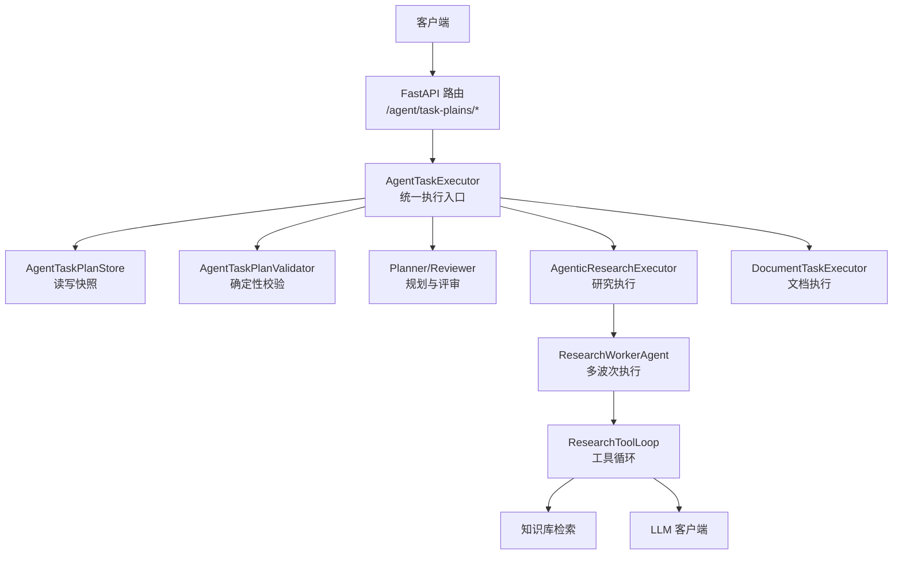
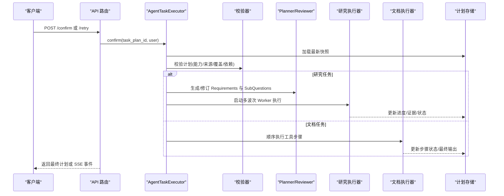
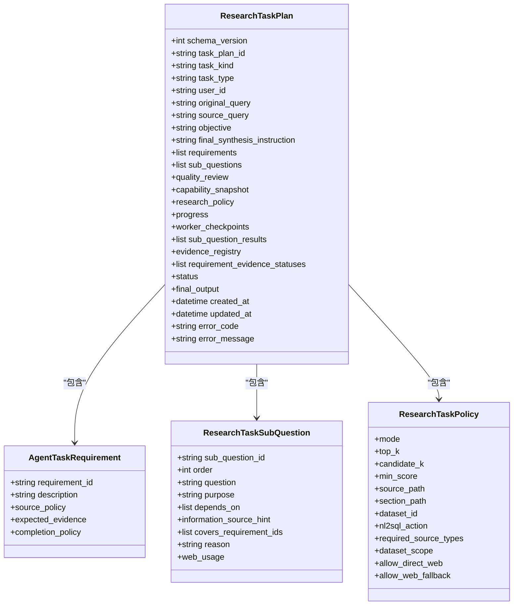
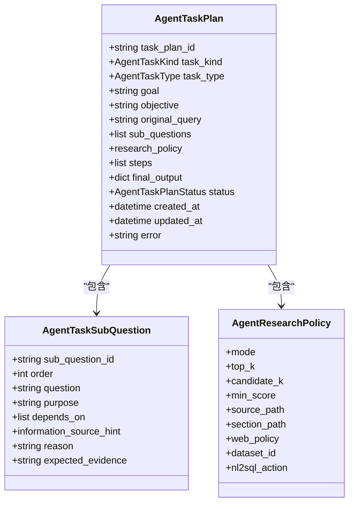
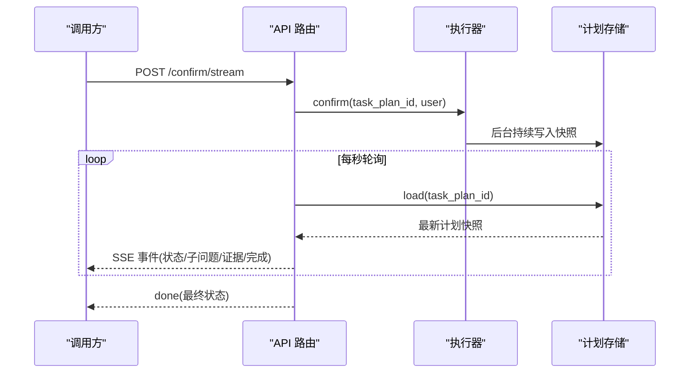
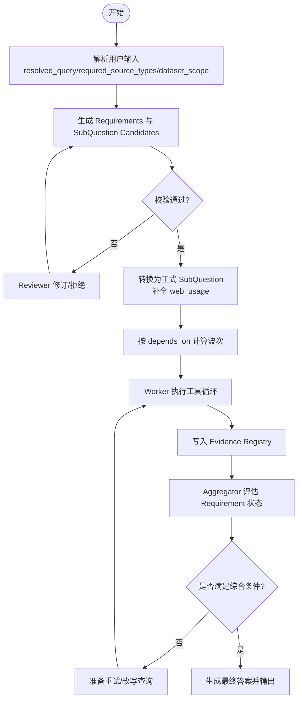
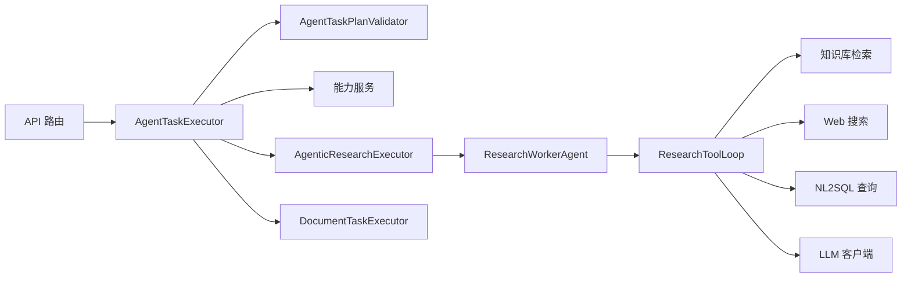
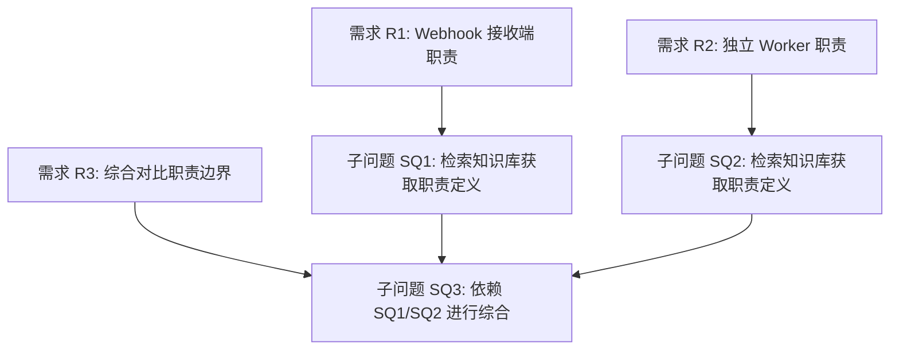

# 任务计划创建

<cite>
**本文引用的文件**
- [agent_task_plan_routes.py](file://src/fast_app/api/agent_task_plan_routes.py)
- [research_task_plan.py](file://src/fast_app/domain/research_task_plan.py)
- [agent_task_plan.py](file://src/fast_app/domain/agent_task_plan.py)
- [agent_task_executor.py](file://src/fast_app/services/agent_tasks/agent_task_executor.py)
- [agent_task_plan_validator.py](file://src/fast_app/services/agent_tasks/agent_task_plan_validator.py)
- [20260811_130934_task_plan_20260811130934_0531c9dc1f2c.json](file://runtime/agent-task-plans/20260811_130934_task_plan_20260811130934_0531c9dc1f2c.json)
</cite>

## 目录
1. [简介](#简介)
2. [项目结构](#项目结构)
3. [核心组件](#核心组件)
4. [架构总览](#架构总览)
5. [详细组件分析](#详细组件分析)
6. [依赖关系分析](#依赖关系分析)
7. [性能与执行特性](#性能与执行特性)
8. [故障排查指南](#故障排查指南)
9. [结论](#结论)
10. [附录：复杂研究任务创建示例](#附录：复杂研究任务创建示例)

## 简介
本文件面向“Agent 任务计划创建”的端到端实现，聚焦两类任务：
- 研究任务（Research TaskPlan v2）：通过意图识别、需求拆解、子问题规划、证据契约与质量评审，生成可执行的 ResearchTaskPlan。
- 文档处理任务（Document TaskPlan）：以知识文档管理为主，基于工具步骤顺序执行并支持人工确认。

本文说明如何通过 API 创建、确认、控制任务计划；解释 ResearchTaskPlan 与 AgentTaskPlan 的数据结构与字段语义；阐述子问题分解、工具选择策略、执行优先级与依赖关系；并提供复杂研究任务的创建示例、验证规则与错误处理机制。

## 项目结构
围绕任务计划创建的关键代码分布在以下模块：
- API 路由层：提供任务计划的读取、确认、取消、重试以及 SSE 流式进度推送。
- 领域模型层：定义 ResearchTaskPlan、AgentTaskPlan、Requirement、SubQuestion、Evidence、Policy 等核心数据结构。
- 服务编排层：统一入口执行器负责鉴权、并发控制、分派到 Research 或 Document 专用执行器。
- 校验与评审层：确定性校验与 Reviewer 质量门禁，确保计划可执行且符合用户原意。
- 运行时快照：持久化的 JSON 快照用于恢复、SSE 轮询和审计。

图表来源
- [agent_task_plan_routes.py:41-672](file://src/fast_app/api/agent_task_plan_routes.py#L41-L672)
- [agent_task_executor.py:135-200](file://src/fast_app/services/agent_tasks/agent_task_executor.py#L135-L200)
- [research_task_plan.py:787-824](file://src/fast_app/domain/research_task_plan.py#L787-L824)
- [agent_task_plan.py:274-324](file://src/fast_app/domain/agent_task_plan.py#L274-L324)

章节来源
- [agent_task_plan_routes.py:41-672](file://src/fast_app/api/agent_task_plan_routes.py#L41-L672)
- [agent_task_executor.py:135-200](file://src/fast_app/services/agent_tasks/agent_task_executor.py#L135-L200)

## 核心组件
- 统一执行器 AgentTaskExecutor：对外暴露 confirm/retry/cancel，按 task_kind 分派到 Research 或 Document 执行器，并在每次操作前重新鉴权与重建 ACL。
- 研究任务计划 ResearchTaskPlan：包含 Requirements、SubQuestions、QualityReview、CapabilitySnapshot、ResearchPolicy、Progress、EvidenceRegistry、RequirementEvidenceStatuses 等，是研究链路的权威模型。
- 通用任务计划 AgentTaskPlan：兼容旧链路，包含 SubQuestions、Steps、FinalOutput 等，用于知识文档管理等场景。
- 校验器 AgentTaskPlanValidator：对 Candidate 进行确定性校验，包括来源可用性、覆盖度、依赖图、证据契约、数量上限等。
- API 路由：提供 GET/POST 接口，支持普通确认与 SSE 流式确认，输出安全公开视图。

章节来源
- [agent_task_executor.py:135-200](file://src/fast_app/services/agent_tasks/agent_task_executor.py#L135-L200)
- [research_task_plan.py:787-824](file://src/fast_app/domain/research_task_plan.py#L787-L824)
- [agent_task_plan.py:274-324](file://src/fast_app/domain/agent_task_plan.py#L274-L324)
- [agent_task_plan_validator.py:26-190](file://src/fast_app/services/agent_tasks/agent_task_plan_validator.py#L26-L190)
- [agent_task_plan_routes.py:111-283](file://src/fast_app/api/agent_task_plan_routes.py#L111-L283)

## 架构总览
下图展示从 API 请求到任务执行与结果输出的整体流程，涵盖研究任务与文档任务两条路径。

图表来源
- [agent_task_plan_routes.py:201-283](file://src/fast_app/api/agent_task_plan_routes.py#L201-L283)
- [agent_task_executor.py:135-200](file://src/fast_app/services/agent_tasks/agent_task_executor.py#L135-L200)
- [research_task_plan.py:787-824](file://src/fast_app/domain/research_task_plan.py#L787-L824)
- [agent_task_plan.py:274-324](file://src/fast_app/domain/agent_task_plan.py#L274-L324)

## 详细组件分析

### 研究任务计划 ResearchTaskPlan 数据模型
ResearchTaskPlan 是 v2 研究链路的权威模型，关键字段与职责如下：
- 基础信息：schema_version、task_plan_id、task_kind、task_type、user_id、original_query、source_query、objective、final_synthesis_instruction。
- 需求与子问题：requirements（原子需求及证据契约）、sub_questions（正式子问题，含 web_usage）。
- 质量评审：quality_review（接受/修订结论、检查项、发现项、修订摘要与次数）。
- 能力快照：capability_snapshot（可用来源、Web 策略、知识库/NL2SQL 可用性、Dataset 上下文、上限约束）。
- 研究策略：research_policy（检索模式、top_k、候选数、最低分数、路径限定、NL2SQL 动作、必需来源、Dataset 范围、Web 策略）。
- 执行进度：progress（当前波次、各 SubQuestion 的 Worker 进度、事件列表）。
- 内部现场：worker_checkpoints（超时前 ToolCall/Evidence 摘要，不进入公开视图）。
- 结果与证据：sub_question_results（已提交的子问题结果）、evidence_registry（唯一 Typed Evidence 事实源）、requirement_evidence_statuses（Aggregator 计算的 Requirement 状态）。
- 生命周期：status、final_output（通过 Output Guard 的最终答案）、created_at/updated_at、error_code/error_message。

图表来源
- [research_task_plan.py:787-824](file://src/fast_app/domain/research_task_plan.py#L787-L824)
- [research_task_plan.py:200-244](file://src/fast_app/domain/research_task_plan.py#L200-L244)
- [research_task_plan.py:604-629](file://src/fast_app/domain/research_task_plan.py#L604-L629)

章节来源
- [research_task_plan.py:787-824](file://src/fast_app/domain/research_task_plan.py#L787-L824)
- [research_task_plan.py:200-244](file://src/fast_app/domain/research_task_plan.py#L200-L244)
- [research_task_plan.py:604-629](file://src/fast_app/domain/research_task_plan.py#L604-L629)

### 通用任务计划 AgentTaskPlan 数据模型
AgentTaskPlan 用于知识文档管理等场景，关键要素：
- 任务元信息：task_plan_id、task_kind、task_type、goal/objective、original_query。
- 子问题与步骤：sub_questions（问题拆解）、steps（顺序工具步骤）。
- 研究策略：research_policy（检索模式、top_k、候选数、最低分数、路径限定、Web 策略、Dataset 绑定）。
- 输出与状态：final_output、status、created_at/updated_at、error。

图表来源
- [agent_task_plan.py:274-324](file://src/fast_app/domain/agent_task_plan.py#L274-L324)
- [agent_task_plan.py:76-97](file://src/fast_app/domain/agent_task_plan.py#L76-L97)
- [agent_task_plan.py:99-146](file://src/fast_app/domain/agent_task_plan.py#L99-L146)

章节来源
- [agent_task_plan.py:274-324](file://src/fast_app/domain/agent_task_plan.py#L274-L324)
- [agent_task_plan.py:76-97](file://src/fast_app/domain/agent_task_plan.py#L76-L97)
- [agent_task_plan.py:99-146](file://src/fast_app/domain/agent_task_plan.py#L99-L146)

### API 接口与执行流程
- 读取计划：GET /{task_plan_id} 返回公开视图；GET /{task_plan_id}/markdown 返回 Markdown 审查视图。
- 控制计划：POST /{task_plan_id}/cancel 取消；POST /{task_plan_id}/retry 恢复最近快照继续执行。
- 确认执行：POST /{task_plan_id}/confirm 同步确认；POST /{task_plan_id}/confirm/stream 流式确认，使用 SSE 推送执行进度与最终输出。
- 权限与安全：仅允许查看自己创建的计划（系统管理员除外），确认时重新鉴权，SSE 输出经过 Prompt Guard 过滤。

图表来源
- [agent_task_plan_routes.py:201-283](file://src/fast_app/api/agent_task_plan_routes.py#L201-L283)
- [agent_task_plan_routes.py:286-433](file://src/fast_app/api/agent_task_plan_routes.py#L286-L433)

章节来源
- [agent_task_plan_routes.py:111-283](file://src/fast_app/api/agent_task_plan_routes.py#L111-L283)
- [agent_task_plan_routes.py:286-433](file://src/fast_app/api/agent_task_plan_routes.py#L286-L433)

### 意图识别、任务分解与依赖关系
- 意图识别：Router/Planner 将用户输入解析为 resolved_query，提取 required_source_types 与 dataset_scope，形成统一的规划请求。
- 任务分解：Planner 生成 Requirements（原子需求）与 SubQuestion Candidates（候选子问题），每个 SubQuestion 声明 covers_requirement_ids、depends_on、information_source_hint。
- 依赖关系：SubQuestion 之间通过 depends_on 构建 DAG；Aggregator 根据依赖波次调度 Worker，保证前置子问题完成后才执行后续综合。
- 工具选择策略：Worker 在 ToolLoop 中依据 SubQuestion 的目标与证据契约选择工具（知识库检索、Web 搜索、NL2SQL 查询），并通过 Evidence Registry 记录结构化证据。

图表来源
- [research_task_plan.py:115-140](file://src/fast_app/domain/research_task_plan.py#L115-L140)
- [research_task_plan.py:216-244](file://src/fast_app/domain/research_task_plan.py#L216-L244)
- [research_task_plan.py:362-400](file://src/fast_app/domain/research_task_plan.py#L362-L400)
- [agent_task_plan_validator.py:26-190](file://src/fast_app/services/agent_tasks/agent_task_plan_validator.py#L26-L190)

章节来源
- [research_task_plan.py:115-140](file://src/fast_app/domain/research_task_plan.py#L115-L140)
- [research_task_plan.py:216-244](file://src/fast_app/domain/research_task_plan.py#L216-L244)
- [research_task_plan.py:362-400](file://src/fast_app/domain/research_task_plan.py#L362-L400)
- [agent_task_plan_validator.py:26-190](file://src/fast_app/services/agent_tasks/agent_task_plan_validator.py#L26-L190)

### 执行优先级与波次调度
- 波次（wave）：由 depends_on 决定的依赖层级，波次内并行执行，波次间串行推进。
- 尝试（attempt）：单个 SubQuestion 的研究尝试次数，失败时可重试。
- 阶段（stage）：starting/tool_setup/tool_selection/tool_execution/answer_generation/evidence_evaluation/retry_preparation/completed。
- 公开进度：ResearchTaskProgress 暴露 current_wave、workers、events，供 SSE 与前端展示。

章节来源
- [research_task_plan.py:631-662](file://src/fast_app/domain/research_task_plan.py#L631-L662)
- [research_task_plan.py:762-770](file://src/fast_app/domain/research_task_plan.py#L762-L770)

### 证据契约与来源策略
- 来源类型：knowledge_retrieval、web_search、nl2sql_query。
- 期望证据：knowledge_chunk、web_citation、sql_query_result、derived_synthesis，每种证据有 minimum_count、requires_query_id、required_attributes 等约束。
- 来源策略：RequirementSourcePolicy.mode 支持 all_of/any_of/none，限制外部来源组合。
- 合法性校验：EvidenceRef 针对不同类型严格校验字段组合，如 sql_query_result 必须携带 query_id，web_citation 必须为合法 HTTP(S) URL。

章节来源
- [research_task_plan.py:18-72](file://src/fast_app/domain/research_task_plan.py#L18-L72)
- [research_task_plan.py:142-198](file://src/fast_app/domain/research_task_plan.py#L142-L198)
- [research_task_plan.py:299-360](file://src/fast_app/domain/research_task_plan.py#L299-L360)

## 依赖关系分析
- 模块耦合：API 路由依赖执行器与存储；执行器依赖校验器、能力服务、专用执行器；研究执行器依赖 Worker、ToolLoop、Evaluator。
- 直接依赖：ResearchTaskPlan 依赖 Requirement、SubQuestion、Policy、Progress、EvidenceRegistry；AgentTaskPlan 依赖 SubQuestion、Policy、Steps。
- 外部集成：知识库检索、Web 搜索、NL2SQL 查询、LLM 客户端、Prompt Guard。

图表来源
- [agent_task_plan_routes.py:41-672](file://src/fast_app/api/agent_task_plan_routes.py#L41-L672)
- [agent_task_executor.py:135-200](file://src/fast_app/services/agent_tasks/agent_task_executor.py#L135-L200)
- [research_task_plan.py:787-824](file://src/fast_app/domain/research_task_plan.py#L787-L824)

章节来源
- [agent_task_plan_routes.py:41-672](file://src/fast_app/api/agent_task_plan_routes.py#L41-L672)
- [agent_task_executor.py:135-200](file://src/fast_app/services/agent_tasks/agent_task_executor.py#L135-L200)

## 性能与执行特性
- 并发控制：进程内按 task_plan_id 互斥锁，防止同一任务重复执行；cancel 在不阻塞长任务的前提下写入信号。
- 流式进度：SSE 每秒轮询快照，去重后推送子问题开始、证据更新、步骤完成、最终合成完成等事件。
- 资源限制：CapabilitySnapshot 中的 max_requirements/max_sub_questions 限制计划规模；top_k/candidate_k/min_score 控制检索成本。
- 可恢复性：WorkerCheckpoint 保存内部阶段与 ToolCall/Evidence 摘要，支持超时恢复与断点续跑。

章节来源
- [agent_task_executor.py:81-132](file://src/fast_app/services/agent_tasks/agent_task_executor.py#L81-L132)
- [agent_task_plan_routes.py:286-433](file://src/fast_app/api/agent_task_plan_routes.py#L286-L433)
- [research_task_plan.py:538-572](file://src/fast_app/domain/research_task_plan.py#L538-L572)
- [research_task_plan.py:703-760](file://src/fast_app/domain/research_task_plan.py#L703-L760)

## 故障排查指南
- 常见错误码与原因：
  - PLAN_REQUIRED_SOURCE_DROPPED：遗漏用户必需来源。
  - PLAN_SUB_QUESTION_ORDER_DUPLICATED：子问题排序重复。
  - PLAN_REQUIREMENT_UNCOVERED：需求未被任何子问题覆盖。
  - PLAN_SOURCE_COVERAGE_MISMATCH：子问题来源无法产生所需证据。
  - PLAN_DIRECT_WEB_DISABLED：请求策略不允许明确 Web。
  - PLAN_WEB_USAGE_INVALID：web_usage 与来源提示不一致。
- 处理建议：
  - 调整 Planner/Reviewer 输出，确保覆盖所有 Requirement 且来源匹配。
  - 修正 depends_on 依赖图，避免环路与孤立节点。
  - 根据 CapabilitySnapshot 调整 allowed_dataset_fields/views 与 NL2SQL 动作。
  - 对于 Web 受限环境，改用知识库或 NL2SQL 替代。
- 定位方法：
  - 查看 quality_review.reviewer_findings 与 validation_issues。
  - 通过 SSE 事件追踪 worker stage、tool_call_count、evidence_count。
  - 使用 Markdown 审查视图快速定位问题。

章节来源
- [agent_task_plan_validator.py:26-190](file://src/fast_app/services/agent_tasks/agent_task_plan_validator.py#L26-L190)
- [research_task_plan.py:402-524](file://src/fast_app/domain/research_task_plan.py#L402-L524)
- [agent_task_plan_routes.py:436-661](file://src/fast_app/api/agent_task_plan_routes.py#L436-L661)

## 结论
本研究任务计划体系通过严格的模型定义、确定性校验与质量评审，实现了从意图识别到证据驱动的综合回答闭环。ResearchTaskPlan 提供了细粒度的需求契约、子问题依赖与执行进度可见性；AgentTaskPlan 则覆盖了文档管理的工具步骤执行与人工确认流程。API 层提供简洁的控制面与丰富的 SSE 事件，便于前端实时反馈与调试。

## 附录：复杂研究任务创建示例
以下示例基于运行时快照，展示一个关于“GitLab MR 合并后文档发布任务在 Webhook 接收端与独立 Worker 之间的职责分工”的研究任务计划。该计划包含三个原子需求与三个子问题，依赖关系清晰，证据契约明确，最终通过质量评审进入等待确认状态。

图表来源
- [20260811_130934_task_plan_20260811130934_0531c9dc1f2c.json:11-111](file://runtime/agent-task-plans/20260811_130934_task_plan_20260811130934_0531c9dc1f2c.json#L11-L111)

参数与约束要点：
- 需求与证据：
  - R1/R2 要求 knowledge_chunk 至少 1 条，strict 完成策略。
  - R3 要求 derived_synthesis 至少 1 条，strict 完成策略。
- 子问题与依赖：
  - SQ1/SQ2 无依赖，information_source_hint 为 knowledge_retrieval。
  - SQ3 依赖 SQ1 与 SQ2，information_source_hint 为 none，用于综合。
- 能力快照：
  - available_source_types 仅包含 knowledge_retrieval，web_direct_allowed/web_fallback_allowed 均为 false。
- 研究策略：
  - mode=hybrid，top_k=5，candidate_k=10，min_score=0.0，未限定 source_path/section_path。
- 质量评审：
  - verdict=accepted，所有检查项 pass，无修订。
- 状态：
  - status=waiting_confirmation，等待人工确认后执行。

章节来源
- [20260811_130934_task_plan_20260811130934_0531c9dc1f2c.json:1-249](file://runtime/agent-task-plans/20260811_130934_task_plan_20260811130934_0531c9dc1f2c.json#L1-L249)