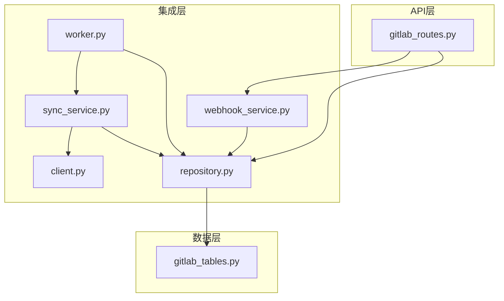
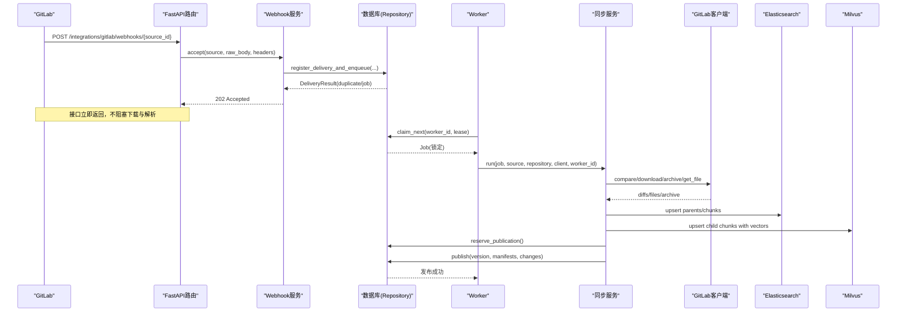
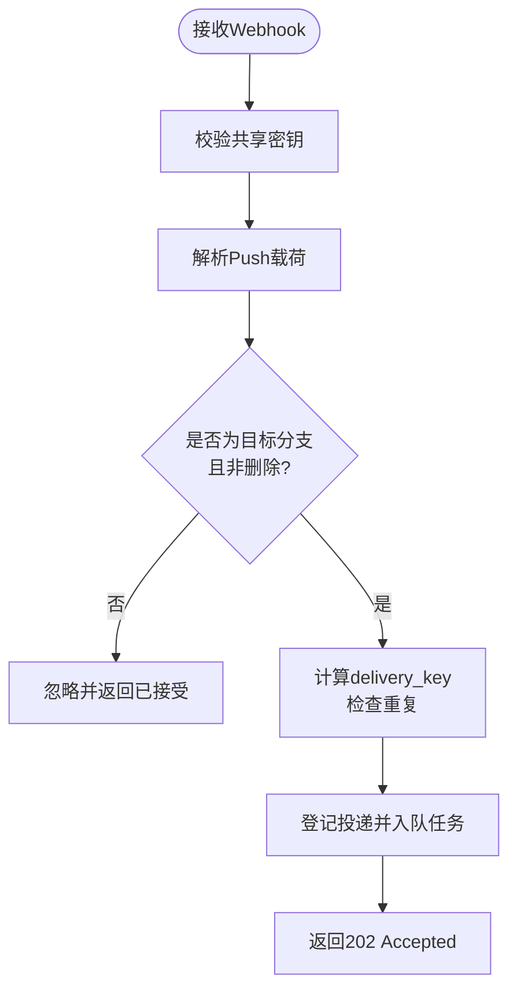
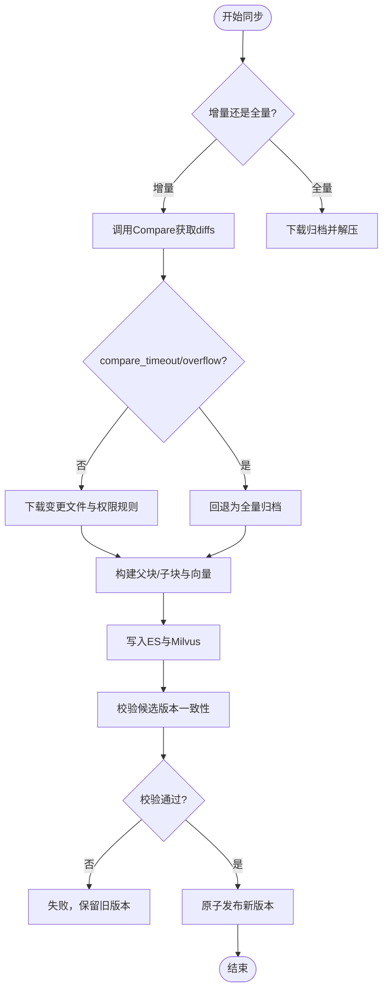
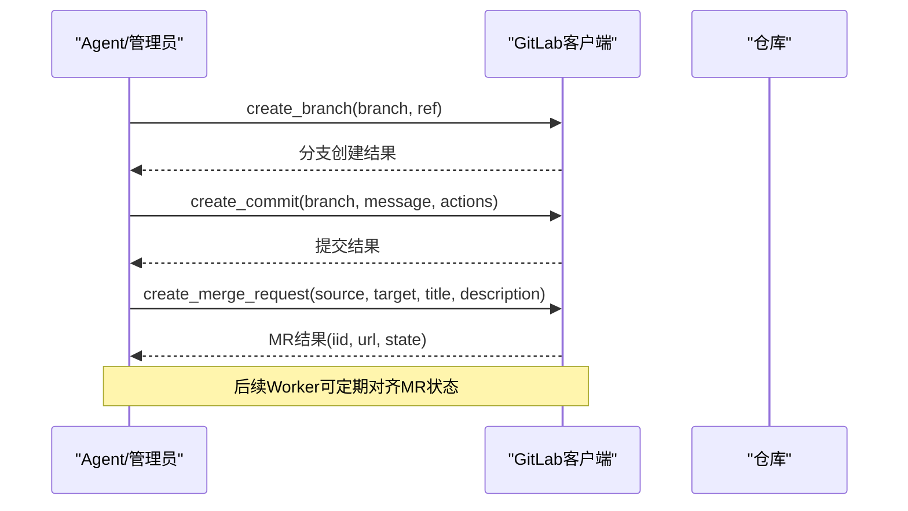
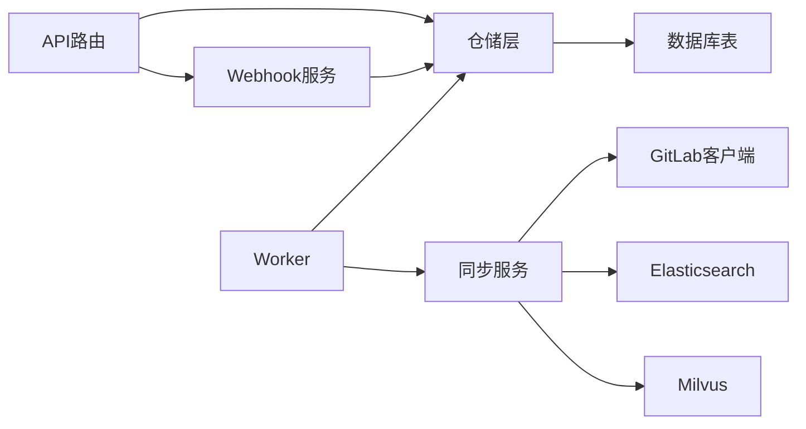

# GitLab集成接口

<cite>
**本文引用的文件**
- [gitlab_routes.py](file://python-agent-study/src/fast_app/api/gitlab_routes.py)
- [webhook_service.py](file://python-agent-study/src/fast_app/integrations/gitlab/webhook_service.py)
- [sync_service.py](file://python-agent-study/src/fast_app/integrations/gitlab/sync_service.py)
- [client.py](file://python-agent-study/src/fast_app/integrations/gitlab/client.py)
- [models.py](file://python-agent-study/src/fast_app/integrations/gitlab/models.py)
- [worker.py](file://python-agent-study/src/fast_app/integrations/gitlab/worker.py)
- [repository.py](file://python-agent-study/src/fast_app/integrations/gitlab/repository.py)
- [gitlab_tables.py](file://python-agent-study/src/fast_app/db/gitlab_tables.py)
</cite>

## 目录
1. [简介](#简介)
2. [项目结构](#项目结构)
3. [核心组件](#核心组件)
4. [架构总览](#架构总览)
5. [详细组件分析](#详细组件分析)
6. [依赖关系分析](#依赖关系分析)
7. [性能与可靠性](#性能与可靠性)
8. [故障排查指南](#故障排查指南)
9. [结论](#结论)
10. [附录：Webhook配置与示例](#附录webhook配置与示例)

## 简介
本文件面向GitLab企业文档资产与知识库系统的集成，覆盖以下能力：
- Webhook事件接收、鉴权与去重投递
- 仓库同步（全量/增量/对账）与知识版本发布
- Merge Request自动化（分支创建、提交、MR创建与状态对齐）
- 变更检测与文档同步流程（Markdown、文本、PPT、XLSX等）
- 项目配置、分支管理与权限控制（部门级可见性、用户白名单）
- 与知识库系统（Elasticsearch、Milvus）的集成与数据同步策略
- Webhook配置示例与常见问题排查

该集成以FastAPI暴露管理接口与Webhook入口，通过独立Worker进程执行耗时的下载、解析、向量化与写入操作，保证接口快速响应与任务高可用。

## 项目结构
GitLab集成相关代码主要分布在以下模块：
- API路由层：对外暴露Webhook与管理接口
- Webhook服务：校验、解析、登记投递并触发入队
- 同步服务：组织一次固定SHA的知识构建与原子发布
- 客户端：封装GitLab API v4调用（比较、归档、分支、提交、MR）
- Worker：从数据库领取任务、执行同步、心跳保活与重试
- 仓储层：Source、Job、Document、Publication、Change Events等持久化
- 数据模型：Pydantic请求/响应模型与GitLab事件模型

图表来源
- [gitlab_routes.py:42-70](file://python-agent-study/src/fast_app/api/gitlab_routes.py#L42-L70)
- [webhook_service.py:23-78](file://python-agent-study/src/fast_app/integrations/gitlab/webhook_service.py#L23-L78)
- [sync_service.py:90-181](file://python-agent-study/src/fast_app/integrations/gitlab/sync_service.py#L90-L181)
- [client.py:20-314](file://python-agent-study/src/fast_app/integrations/gitlab/client.py#L20-L314)
- [worker.py:28-146](file://python-agent-study/src/fast_app/integrations/gitlab/worker.py#L28-L146)
- [repository.py:32-747](file://python-agent-study/src/fast_app/integrations/gitlab/repository.py#L32-L747)
- [gitlab_tables.py:24-317](file://python-agent-study/src/fast_app/db/gitlab_tables.py#L24-L317)

章节来源
- [gitlab_routes.py:1-284](file://python-agent-study/src/fast_app/api/gitlab_routes.py#L1-L284)
- [gitlab_tables.py:24-317](file://python-agent-study/src/fast_app/db/gitlab_tables.py#L24-L317)

## 核心组件
- Webhook入口与鉴权：接收GitLab推送事件，验证共享密钥，解析载荷，登记投递并去重，更新desired_sha并合并或创建同步任务。
- 同步任务编排：按目标SHA冻结一次“候选版本”，拉取差异或归档，解析文档、生成父子块与向量，双写ES/Milvus，校验收敛后原子发布。
- GitLab客户端：最小化封装v4 API，支持分页Compare、归档下载、分支/提交/MR操作，具备超时与指数退避重试。
- Worker进程：独立常驻，领取任务、心跳续租、失败重试、周期性对账，确保崩溃恢复与多实例安全。
- 仓储与模型：Source、Job、Document、Publication、ChangeEvents等表结构；统一的Pydantic模型用于输入输出校验。

章节来源
- [webhook_service.py:19-88](file://python-agent-study/src/fast_app/integrations/gitlab/webhook_service.py#L19-L88)
- [sync_service.py:72-181](file://python-agent-study/src/fast_app/integrations/gitlab/sync_service.py#L72-L181)
- [client.py:20-314](file://python-agent-study/src/fast_app/integrations/gitlab/client.py#L20-L314)
- [worker.py:28-146](file://python-agent-study/src/fast_app/integrations/gitlab/worker.py#L28-L146)
- [repository.py:32-747](file://python-agent-study/src/fast_app/integrations/gitlab/repository.py#L32-L747)
- [models.py:9-195](file://python-agent-study/src/fast_app/integrations/gitlab/models.py#L9-L195)

## 架构总览
整体采用“接口快速应答 + 异步Worker处理”的分层架构：
- FastAPI仅做轻量校验与入队，返回202接受事件
- Worker在后台完成下载、解析、向量化、写入与发布
- 使用数据库锁与租约机制保障并发安全与崩溃恢复
- 发布前进行候选版本一致性校验，确保ES/Milvus数据正确后再切换正式指针

图表来源
- [gitlab_routes.py:42-70](file://python-agent-study/src/fast_app/api/gitlab_routes.py#L42-L70)
- [webhook_service.py:23-78](file://python-agent-study/src/fast_app/integrations/gitlab/webhook_service.py#L23-L78)
- [repository.py:121-200](file://python-agent-study/src/fast_app/integrations/gitlab/repository.py#L121-L200)
- [worker.py:44-146](file://python-agent-study/src/fast_app/integrations/gitlab/worker.py#L44-L146)
- [sync_service.py:90-181](file://python-agent-study/src/fast_app/integrations/gitlab/sync_service.py#L90-L181)
- [client.py:115-158](file://python-agent-study/src/fast_app/integrations/gitlab/client.py#L115-L158)

## 详细组件分析

### Webhook处理与事件监听
- 鉴权：基于环境变量中的共享密钥进行HMAC校验，拒绝非法请求。
- 解析与过滤：仅接受push事件、指定Project与目标分支、非删除分支。
- 去重：优先使用事件UUID，否则基于before/after/payload_hash生成稳定键，避免重复投递导致重复任务。
- 入队：登记投递记录，更新Source.desired_sha，合并或新建同步任务，接口快速返回202。

图表来源
- [webhook_service.py:23-78](file://python-agent-study/src/fast_app/integrations/gitlab/webhook_service.py#L23-L78)
- [repository.py:121-200](file://python-agent-study/src/fast_app/integrations/gitlab/repository.py#L121-L200)

章节来源
- [webhook_service.py:19-88](file://python-agent-study/src/fast_app/integrations/gitlab/webhook_service.py#L19-L88)
- [gitlab_routes.py:42-70](file://python-agent-study/src/fast_app/api/gitlab_routes.py#L42-L70)

### 仓库同步与文档处理
- 模式选择：首次或before_sha不连续时走全量；否则尝试增量Compare，若超时/溢出则回退全量。
- 文件获取：增量模式下按需下载变更文件与可选权限规则；全量模式下载归档并安全解压。
- 文档类型：支持Markdown、文本、PowerPoint、Excel；PDF在当前阶段不支持。
- 分块与向量：Markdown使用父子块策略，子块参与向量检索；其他类型按各自Builder生成子块。
- 双写与校验：先写入ES父子集合与Milvus子块集合，再校验候选版本一致性（字段、维度、父子引用）。
- 原子发布：校验通过后在同一事务中应用Manifest、更新版本指针、记录变更事件。

图表来源
- [sync_service.py:276-408](file://python-agent-study/src/fast_app/integrations/gitlab/sync_service.py#L276-L408)
- [sync_service.py:410-532](file://python-agent-study/src/fast_app/integrations/gitlab/sync_service.py#L410-L532)
- [sync_service.py:643-796](file://python-agent-study/src/fast_app/integrations/gitlab/sync_service.py#L643-L796)
- [repository.py:401-539](file://python-agent-study/src/fast_app/integrations/gitlab/repository.py#L401-L539)

章节来源
- [sync_service.py:90-181](file://python-agent-study/src/fast_app/integrations/gitlab/sync_service.py#L90-L181)
- [sync_service.py:276-532](file://python-agent-study/src/fast_app/integrations/gitlab/sync_service.py#L276-L532)
- [sync_service.py:643-796](file://python-agent-study/src/fast_app/integrations/gitlab/sync_service.py#L643-L796)

### Merge Request自动化
- 分支与提交：Worker在执行同步前会尝试对齐本地打开的MR状态；后续可通过Agent工具链创建分支、提交变更。
- MR创建：当需要评审时，可调用客户端创建MR，设置源/目标分支、标题与描述，并自动移除源分支。
- 状态同步：Worker周期查询GitLab MR状态，更新本地记录，保持两端一致。

图表来源
- [client.py:183-250](file://python-agent-study/src/fast_app/integrations/gitlab/client.py#L183-L250)
- [worker.py:186-204](file://python-agent-study/src/fast_app/integrations/gitlab/worker.py#L186-L204)

章节来源
- [client.py:183-250](file://python-agent-study/src/fast_app/integrations/gitlab/client.py#L183-L250)
- [worker.py:186-204](file://python-agent-study/src/fast_app/integrations/gitlab/worker.py#L186-L204)

### 项目配置、分支管理与权限控制
- Source配置：包含base_url、project_id、target_branch、department_code、默认可见性、Token与Secret环境变量名等。
- 分支管理：仅对配置的target_branch进行同步；删除分支事件被忽略。
- 权限控制：
  - 文档ACL：支持visibility、allowed_users、allowed_departments。
  - 接口访问：管理接口需认证与特定角色/权限；变更事件列表按用户权限过滤可见项。
  - Source级别隔离：通过department_code划分安全边界。

章节来源
- [gitlab_tables.py:24-63](file://python-agent-study/src/fast_app/db/gitlab_tables.py#L24-L63)
- [gitlab_routes.py:219-244](file://python-agent-study/src/fast_app/api/gitlab_routes.py#L219-L244)
- [sync_service.py:449-514](file://python-agent-study/src/fast_app/integrations/gitlab/sync_service.py#L449-L514)

### 与知识库系统的集成与数据同步策略
- Elasticsearch：存储父子块，用于命中后扩展上下文；发布前校验父子集合与元数据一致性。
- Milvus：存储子块向量，用于语义检索；发布前校验向量维度与记录集合一致性。
- 版本化发布：候选版本双写完成后，统一切换active_version，保证新旧请求平滑过渡。
- 变更事件：每次发布记录affected_documents，供前端轮询展示变更通知。

章节来源
- [sync_service.py:138-181](file://python-agent-study/src/fast_app/integrations/gitlab/sync_service.py#L138-L181)
- [sync_service.py:643-796](file://python-agent-study/src/fast_app/integrations/gitlab/sync_service.py#L643-L796)
- [repository.py:476-539](file://python-agent-study/src/fast_app/integrations/gitlab/repository.py#L476-L539)

## 依赖关系分析
- API路由依赖Webhook服务与仓储层，负责鉴权、入队与查询。
- Webhook服务依赖仓储层进行投递登记与任务合并/创建。
- Worker依赖仓储层领取任务，依赖同步服务执行具体逻辑。
- 同步服务依赖GitLab客户端获取差异/文件/归档，依赖ES/Milvus写入与校验。
- 仓储层直接映射数据库表，提供事务化操作与并发控制。

图表来源
- [gitlab_routes.py:42-70](file://python-agent-study/src/fast_app/api/gitlab_routes.py#L42-L70)
- [webhook_service.py:23-78](file://python-agent-study/src/fast_app/integrations/gitlab/webhook_service.py#L23-L78)
- [worker.py:44-146](file://python-agent-study/src/fast_app/integrations/gitlab/worker.py#L44-L146)
- [sync_service.py:90-181](file://python-agent-study/src/fast_app/integrations/gitlab/sync_service.py#L90-L181)
- [client.py:20-314](file://python-agent-study/src/fast_app/integrations/gitlab/client.py#L20-L314)
- [repository.py:32-747](file://python-agent-study/src/fast_app/integrations/gitlab/repository.py#L32-L747)
- [gitlab_tables.py:24-317](file://python-agent-study/src/fast_app/db/gitlab_tables.py#L24-L317)

章节来源
- [gitlab_routes.py:1-284](file://python-agent-study/src/fast_app/api/gitlab_routes.py#L1-L284)
- [repository.py:32-747](file://python-agent-study/src/fast_app/integrations/gitlab/repository.py#L32-L747)

## 性能与可靠性
- 接口性能：Webhook接口只做轻量校验与入队，避免阻塞下载与解析，快速返回202。
- 并发安全：使用数据库行级锁与skip_locked避免重复领取；租约机制防止Worker崩溃导致任务悬挂。
- 重试与降级：Compare超时/溢出自动回退全量；网络异常与限流采用指数退避重试。
- 资源限制：归档大小、文件数量、单文件大小限制，防止恶意或超大仓库影响稳定性。
- 版本一致性：发布前严格校验ES/Milvus数据，确保只读流量始终看到一致快照。

章节来源
- [client.py:259-310](file://python-agent-study/src/fast_app/integrations/gitlab/client.py#L259-L310)
- [repository.py:202-241](file://python-agent-study/src/fast_app/integrations/gitlab/repository.py#L202-L241)
- [sync_service.py:298-313](file://python-agent-study/src/fast_app/integrations/gitlab/sync_service.py#L298-L313)
- [sync_service.py:643-796](file://python-agent-study/src/fast_app/integrations/gitlab/sync_service.py#L643-L796)

## 故障排查指南
- Webhook未生效
  - 检查共享密钥是否正确配置，接口是否返回202。
  - 确认事件UUID或payload_hash生成的delivery_key未被判定为重复。
  - 核对目标分支与Project ID是否与Source配置一致。
- 同步任务失败
  - 查看Job.error_code与error_message，区分内容错误与临时错误。
  - 对于确定性内容错误（如PDF不支持、XLSX缺少Profile），需修正仓库内容后重试。
  - 可使用管理接口手动重试失败任务。
- 版本不一致
  - 检查候选版本校验日志，定位ES/Milvus字段不一致或向量维度问题。
  - 确认发布前双写已完成且收敛，必要时回滚到上一版本。
- 权限问题
  - 变更事件列表按用户权限过滤，确认用户角色/部门/白名单配置。
  - 管理接口需系统管理员或特定权限，否则会被拒绝。

章节来源
- [webhook_service.py:80-84](file://python-agent-study/src/fast_app/integrations/gitlab/webhook_service.py#L80-L84)
- [repository.py:302-336](file://python-agent-study/src/fast_app/integrations/gitlab/repository.py#L302-L336)
- [sync_service.py:596-613](file://python-agent-study/src/fast_app/integrations/gitlab/sync_service.py#L596-L613)
- [gitlab_routes.py:219-244](file://python-agent-study/src/fast_app/api/gitlab_routes.py#L219-L244)

## 结论
该GitLab集成方案通过“接口快速应答 + 异步Worker处理”的架构，实现了高吞吐、高可用的企业级文档同步与发布。借助严格的鉴权、去重、版本化发布与跨存储一致性校验，系统在复杂变更场景下仍能保持稳定与正确性。配合Merge Request自动化与权限控制，能够满足企业对代码与文档资产的治理需求。

## 附录：Webhook配置与示例
- 在GitLab项目中添加Webhook：
  - URL：指向FastAPI的Webhook端点路径
  - Secret Token：与Source配置中的webhook_secret_env对应
  - 触发事件：勾选Push events
- 管理接口示例（概念说明）：
  - 列出Source：GET /admin/gitlab/sources
  - 触发同步：POST /admin/gitlab/sources/{source_id}/sync，body包含mode与可选target_sha
  - 查询Job：GET /admin/gitlab/sync-jobs?status=...&limit=...
  - 重试Job：POST /admin/gitlab/sync-jobs/{job_id}/retry
  - 发布状态：GET /knowledge/publication/status
  - 变更事件：GET /knowledge/change-events?after_id=...&limit=...

章节来源
- [gitlab_routes.py:73-180](file://python-agent-study/src/fast_app/api/gitlab_routes.py#L73-L180)
- [models.py:86-174](file://python-agent-study/src/fast_app/integrations/gitlab/models.py#L86-L174)