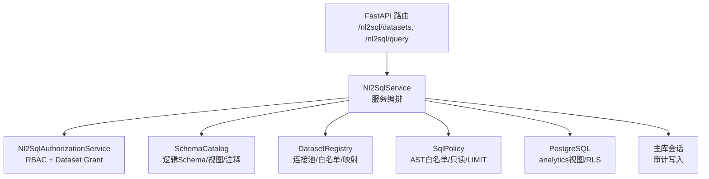
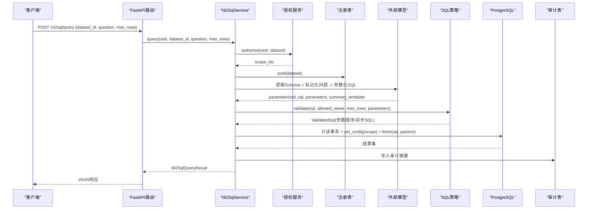
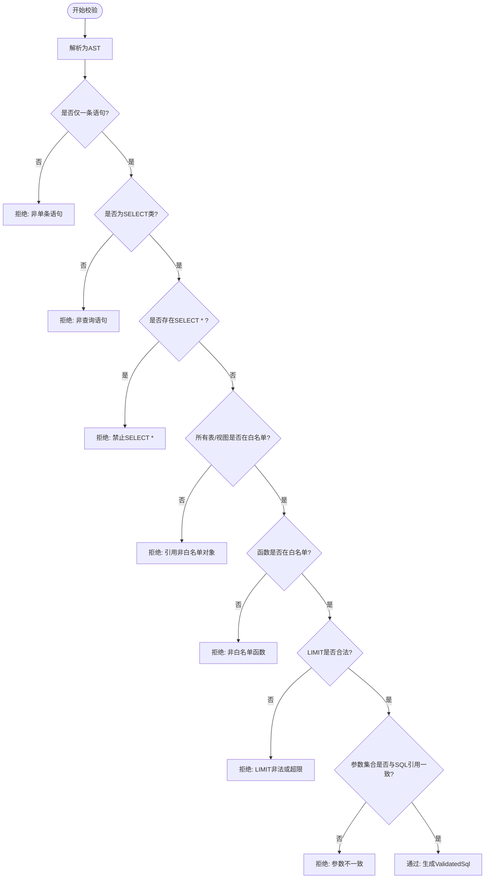
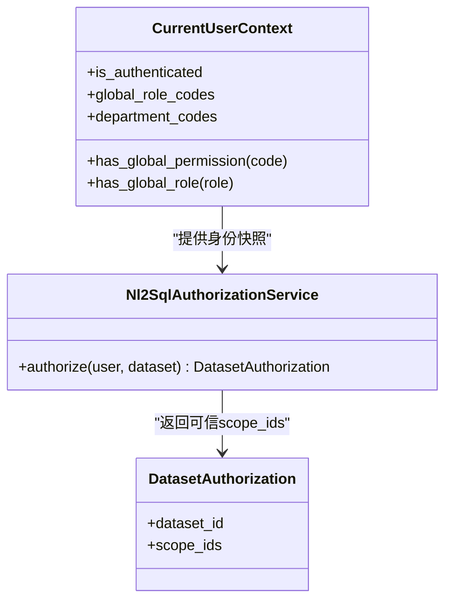
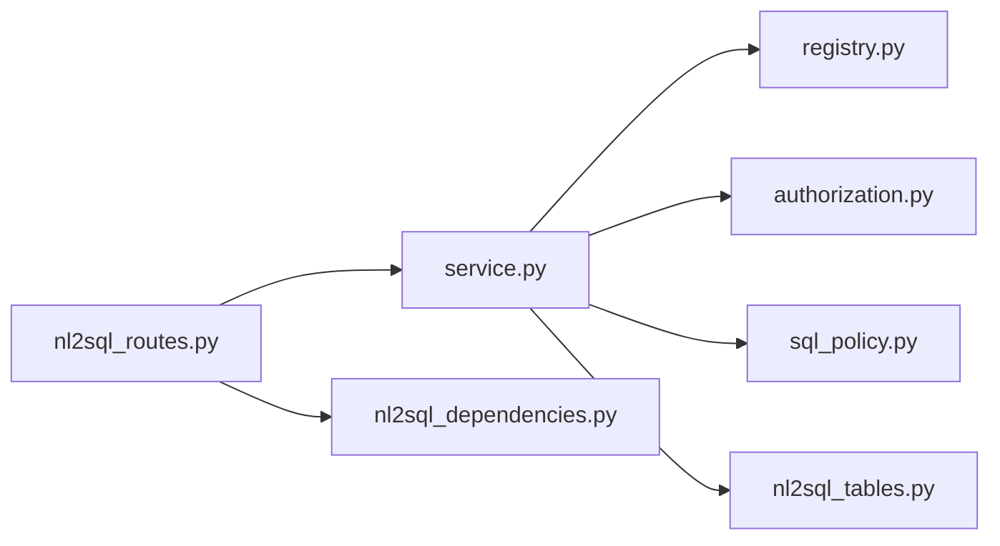

# NL2SQL接口

<cite>
**本文引用的文件**
- [nl2sql_routes.py](file://src/fast_app/api/nl2sql_routes.py)
- [service.py](file://src/fast_app/services/nl2sql/service.py)
- [sql_policy.py](file://src/fast_app/services/nl2sql/sql_policy.py)
- [models.py](file://src/fast_app/services/nl2sql/models.py)
- [authorization.py](file://src/fast_app/services/nl2sql/authorization.py)
- [registry.py](file://src/fast_app/services/nl2sql/registry.py)
- [nl2sql_tables.py](file://src/fast_app/db/nl2sql_tables.py)
- [nl2sql_dependencies.py](file://src/fast_app/dependencies/nl2sql_dependencies.py)
- [NL2SQL实现方案：.md](file://scripts/docs/NL2SQL实现方案：.md)
</cite>

## 目录
1. [简介](#简介)
2. [项目结构](#项目结构)
3. [核心组件](#核心组件)
4. [架构总览](#架构总览)
5. [详细组件分析](#详细组件分析)
6. [依赖关系分析](#依赖关系分析)
7. [性能与缓存](#性能与缓存)
8. [故障排查指南](#故障排查指南)
9. [结论](#结论)
10. [附录](#附录)

## 简介
本文件面向“自然语言转SQL”的查询接口，覆盖以下目标：
- 说明查询端点、数据集绑定、SQL生成与执行机制。
- 解释SQL Policy的安全控制与只读限制。
- 说明查询历史、结果截断与性能监控能力。
- 给出复杂查询场景示例（多表关联、条件过滤、聚合统计）。
- 说明数据集权限管理与审计日志记录。

该模块以FastAPI暴露REST接口，通过服务层编排外部模型生成参数化SQL，再由AST安全策略校验后在PostgreSQL中执行只读查询，并持久化审计摘要。

**章节来源**
- [nl2sql_routes.py:14-36](file://src/fast_app/api/nl2sql_routes.py#L14-L36)
- [NL2SQL实现方案：.md:174-187](file://scripts/docs/NL2SQL实现方案：.md#L174-L187)

## 项目结构
NL2SQL相关代码主要分布在以下位置：
- API路由：定义对外端点与请求响应模型绑定。
- 服务层：封装授权、Schema目录、SQL生成、AST校验、执行与审计。
- 数据模型：Pydantic模型定义请求、响应与内部结构。
- 数据库表：Dataset配置、授权、审计日志。
- 依赖注入：为路由提供服务实例与注册表。

**图表来源**
- [nl2sql_routes.py:14-36](file://src/fast_app/api/nl2sql_routes.py#L14-L36)
- [service.py:41-55](file://src/fast_app/services/nl2sql/service.py#L41-L55)
- [authorization.py:15-74](file://src/fast_app/services/nl2sql/authorization.py#L15-L74)
- [registry.py:24-128](file://src/fast_app/services/nl2sql/registry.py#L24-L128)
- [sql_policy.py:52-179](file://src/fast_app/services/nl2sql/sql_policy.py#L52-L179)
- [nl2sql_tables.py:12-108](file://src/fast_app/db/nl2sql_tables.py#L12-L108)

**章节来源**
- [nl2sql_routes.py:14-36](file://src/fast_app/api/nl2sql_routes.py#L14-L36)
- [nl2sql_dependencies.py:11-23](file://src/fast_app/dependencies/nl2sql_dependencies.py#L11-L23)

## 核心组件
- Nl2SqlService：统一入口，负责授权、标记化、SQL生成、AST校验、执行、序列化、总结与审计。
- SqlPolicy：基于SQLGlot AST的只读白名单校验器，强制单条SELECT、禁止危险函数与对象、限制LIMIT与参数集合。
- Nl2SqlAuthorizationService：复用全局RBAC快照，合并用户/角色/部门的Dataset Grant，产出可信scope_ids。
- DatasetRegistry：加载平台侧Dataset配置，维护业务库连接池，拒绝将平台主库注册为Dataset。
- SchemaCatalog：从业务库读取逻辑Schema、视图关系与字段注释，供模型生成SQL时参考。
- 数据模型：定义请求、响应、SQL生成结果、授权上下文等结构化契约。
- 审计表：保存查询ID、用户、数据集、标记化问题、参数化SQL、状态、耗时、行数与错误码。

**章节来源**
- [service.py:41-55](file://src/fast_app/services/nl2sql/service.py#L41-L55)
- [sql_policy.py:52-179](file://src/fast_app/services/nl2sql/sql_policy.py#L52-L179)
- [authorization.py:15-74](file://src/fast_app/services/nl2sql/authorization.py#L15-L74)
- [registry.py:24-128](file://src/fast_app/services/nl2sql/registry.py#L24-L128)
- [models.py:12-134](file://src/fast_app/services/nl2sql/models.py#L12-L134)
- [nl2sql_tables.py:12-108](file://src/fast_app/db/nl2sql_tables.py#L12-L108)

## 架构总览
下图展示一次NL2SQL查询从HTTP到数据库执行的完整链路，包括敏感实体标记化、模型生成、AST校验、RLS执行与审计。

**图表来源**
- [nl2sql_routes.py:25-36](file://src/fast_app/api/nl2sql_routes.py#L25-L36)
- [service.py:95-284](file://src/fast_app/services/nl2sql/service.py#L95-L284)
- [authorization.py:21-74](file://src/fast_app/services/nl2sql/authorization.py#L21-L74)
- [registry.py:102-114](file://src/fast_app/services/nl2sql/registry.py#L102-L114)
- [sql_policy.py:55-179](file://src/fast_app/services/nl2sql/sql_policy.py#L55-L179)
- [nl2sql_tables.py:76-100](file://src/fast_app/db/nl2sql_tables.py#L76-L100)

## 详细组件分析

### 查询端点与请求响应
- GET /nl2sql/datasets：返回当前用户可访问的数据集列表，包含隐私等级与是否支持报告。
- POST /nl2sql/query：接收dataset_id、question、max_rows；返回query_id、parameterized_sql、columns、rows、row_count、truncated、execution_ms、attempt_count、summary、warnings、markdown_table等。

请求与响应均使用Pydantic模型进行强约束，防止非法字段进入系统。

**章节来源**
- [nl2sql_routes.py:17-36](file://src/fast_app/api/nl2sql_routes.py#L17-L36)
- [models.py:48-114](file://src/fast_app/services/nl2sql/models.py#L48-L114)

### 数据集绑定与可见性
- DatasetDefinition由平台主库加载，包含domain、database_key、privacy_classification、allowed_views、logical_view_mapping、relationships、synonyms、report_supported、enabled等。
- DatasetRegistry负责：
  - 从环境变量解析业务库连接URL映射，拒绝将平台主库注册为Dataset。
  - 按database_key创建并复用asyncpg连接池。
  - 提供enabled()与get()方法用于路由与服务调用。

**章节来源**
- [models.py:12-46](file://src/fast_app/services/nl2sql/models.py#L12-L46)
- [registry.py:24-128](file://src/fast_app/services/nl2sql/registry.py#L24-L128)

### SQL生成与执行机制
- 敏感数据集：先识别真实实体并替换为请求级占位符，仅将标记化问题与逻辑Schema发送给外部模型；模型返回参数化SQL与受限模板；后端在本地回填真实值并执行。
- 非敏感数据集：允许将受控结果发送给外部模型生成中文结论。
- 执行流程：
  - 构建逻辑Schema目录。
  - 调用外部模型生成SqlGenerationResult。
  - 使用SqlPolicy进行AST校验与改写。
  - 在只读事务中设置statement_timeout、lock_timeout、search_path与app.scope_ids。
  - 执行参数化查询并序列化结果。

**章节来源**
- [service.py:138-284](file://src/fast_app/services/nl2sql/service.py#L138-L284)
- [service.py:286-360](file://src/fast_app/services/nl2sql/service.py#L286-L360)
- [service.py:362-465](file://src/fast_app/services/nl2sql/service.py#L362-L465)

### SQL Policy安全控制与只读限制
- 仅允许单条SELECT/UNION/INTERSECT/EXCEPT，拒绝DML、DDL、COPY、事务命令等。
- 禁止SELECT *，必须显式列名。
- 严格白名单函数：仅允许已知安全函数，匿名函数不在白名单即拒绝。
- LIMIT保护：未指定LIMIT时注入max_rows+1；若指定LIMIT参数或常量超过上限则裁剪。
- 参数一致性：SQL中使用的参数集合必须与模型返回的参数完全一致，防止校验与执行不一致。
- 参数转换：将命名参数转换为asyncpg位置参数，避免拼接用户输入。

**图表来源**
- [sql_policy.py:55-179](file://src/fast_app/services/nl2sql/sql_policy.py#L55-L179)

**章节来源**
- [sql_policy.py:55-179](file://src/fast_app/services/nl2sql/sql_policy.py#L55-L179)

### 权限管理与范围隔离
- 功能权限：需要data:query:execute全局权限。
- 数据集授权：合并用户、全局角色、部门的Dataset Grant，得到scope_ids。
- 超级管理员：scope_ids为"*"，仍受白名单视图、AST与只读事务限制。
- 数据库级隔离：通过set_config('app.scope_ids', ...)在只读事务内生效，配合PostgreSQL RLS进一步限制行级访问。

**图表来源**
- [authorization.py:15-74](file://src/fast_app/services/nl2sql/authorization.py#L15-L74)
- [models.py:117-122](file://src/fast_app/services/nl2sql/models.py#L117-L122)

**章节来源**
- [authorization.py:21-74](file://src/fast_app/services/nl2sql/authorization.py#L21-L74)

### 查询历史与审计日志
- 成功路径：记录query_id、user_id、dataset_id、tokenized_question、parameterized_sql、sql_hash、status=completed、execution_ms、row_count、request_id、trace_id。
- 失败路径：记录error_code、status=failed，不记录原始问题、参数与结果明文，确保隐私边界。
- 索引：按用户与数据集维度建立索引，便于审计检索。

**章节来源**
- [service.py:104-136](file://src/fast_app/services/nl2sql/service.py#L104-L136)
- [service.py:265-283](file://src/fast_app/services/nl2sql/service.py#L265-L283)
- [nl2sql_tables.py:76-100](file://src/fast_app/db/nl2sql_tables.py#L76-L100)

### 结果序列化与Markdown表格
- Decimal转为字符串，日期时间转为ISO格式，UUID转为字符串。
- 长文本字段截断至2000字符并产生warning。
- 自动生成Markdown表格，供下游报告证据使用。

**章节来源**
- [service.py:521-582](file://src/fast_app/services/nl2sql/service.py#L521-L582)

### 复杂查询场景示例
以下为典型复杂查询模式，实际SQL由外部模型根据逻辑Schema与注释动态生成，并由AST策略保障安全：
- 多表关联：对多个analytics视图进行JOIN，例如楼盘库存视图与价格汇总视图关联，按楼栋或户型分组。
- 条件过滤：使用参数化WHERE条件过滤时间范围、状态、区域等，如限定某时间段内的房源状态。
- 聚合统计：使用SUM/COUNT/AVG/MIN/MAX等聚合函数计算指标，如总价、均价、套数、去化率等。
- 排序与分页：ORDER BY排序，LIMIT限制返回行数，后端额外取一行判断是否截断。

注意：
- 所有SQL均为只读且受白名单视图限制。
- 敏感数据集的真实实体值不会进入外部模型，仅在本地回填。
- 最终结果经序列化和截断后返回。

**章节来源**
- [service.py:138-284](file://src/fast_app/services/nl2sql/service.py#L138-L284)
- [sql_policy.py:55-179](file://src/fast_app/services/nl2sql/sql_policy.py#L55-L179)
- [NL2SQL实现方案：.md:456-484](file://scripts/docs/NL2SQL实现方案：.md#L456-L484)

## 依赖关系分析
- 路由依赖服务：FastAPI路由通过依赖注入获取Nl2SqlService实例。
- 服务依赖注册表：服务通过DatasetRegistry获取连接池与Dataset配置。
- 服务依赖授权：服务调用Nl2SqlAuthorizationService完成RBAC与Grant校验。
- 服务依赖策略：服务调用SqlPolicy进行AST校验与参数转换。
- 服务依赖会话：服务使用AsyncSession写入审计日志。

**图表来源**
- [nl2sql_routes.py:1-36](file://src/fast_app/api/nl2sql_routes.py#L1-L36)
- [nl2sql_dependencies.py:11-23](file://src/fast_app/dependencies/nl2sql_dependencies.py#L11-L23)
- [service.py:41-55](file://src/fast_app/services/nl2sql/service.py#L41-L55)

**章节来源**
- [nl2sql_routes.py:1-36](file://src/fast_app/api/nl2sql_routes.py#L1-L36)
- [nl2sql_dependencies.py:11-23](file://src/fast_app/dependencies/nl2sql_dependencies.py#L11-L23)

## 性能与缓存
- 连接池：每个Dataset对应一个asyncpg连接池，复用连接减少握手开销。
- 超时控制：statement_timeout=8s，lock_timeout=1s，防止慢查询与锁等待。
- 行数限制：默认max_rows=200，硬上限500；后端额外取一行判断是否截断。
- 结果截断：超过限制的行会被丢弃并在响应中标记truncated。
- 长文本处理：字段长度超过阈值时截断并产生warning。
- 缓存说明：当前实现未实现查询结果缓存；如需缓存可在服务层引入键控缓存（如基于参数化SQL哈希），但需考虑权限与Scope差异导致的缓存污染风险。

**章节来源**
- [registry.py:102-114](file://src/fast_app/services/nl2sql/registry.py#L102-L114)
- [service.py:159-160](file://src/fast_app/services/nl2sql/service.py#L159-L160)
- [service.py:227-232](file://src/fast_app/services/nl2sql/service.py#L227-L232)
- [service.py:521-543](file://src/fast_app/services/nl2sql/service.py#L521-L543)

## 故障排查指南
常见错误与定位建议：
- 无权限：检查用户是否具备data:query:execute权限以及Dataset Grant是否有效。
- 非白名单对象：确认模型生成的SQL仅引用allowed_views中的视图。
- 非白名单函数：确认仅使用允许函数，避免匿名函数或危险函数。
- LIMIT异常：确认LIMIT为整数常量或受控参数，且不超过上限。
- 参数不一致：确认SQL中使用的参数集合与模型返回的参数完全一致。
- 执行超时：检查数据库负载与RLS复杂度，必要时优化视图或调整超时。
- 审计缺失：检查主库会话与提交逻辑，确保审计写入成功。

**章节来源**
- [authorization.py:21-74](file://src/fast_app/services/nl2sql/authorization.py#L21-L74)
- [sql_policy.py:55-179](file://src/fast_app/services/nl2sql/sql_policy.py#L55-L179)
- [service.py:104-136](file://src/fast_app/services/nl2sql/service.py#L104-L136)
- [service.py:218-225](file://src/fast_app/services/nl2sql/service.py#L218-L225)

## 结论
NL2SQL接口通过“外部模型生成参数化SQL + 后端AST安全校验 + PostgreSQL只读执行 + 审计日志”的闭环，实现了安全可控的自然语言查询能力。其核心优势在于：
- 严格的只读与白名单控制，防止写操作与越权访问。
- 敏感数据的标记化与本地回填，避免真实实体泄露。
- 清晰的权限分层：RBAC + Dataset Grant + RLS。
- 完整的审计与性能保护：超时、锁超时、行数限制与结果截断。

建议在后续迭代中评估引入查询结果缓存（需考虑Scope与权限隔离）、扩展更多业务视图与同义词以提升SQL生成准确率，并持续完善测试用例与验收标准。

## 附录
- 接口清单：
  - GET /nl2sql/datasets：列出可访问数据集。
  - POST /nl2sql/query：执行NL2SQL查询。
- 关键模型：
  - Nl2SqlQueryRequest：dataset_id、question、max_rows。
  - Nl2SqlQueryResult：query_id、parameterized_sql、columns、rows、row_count、truncated、execution_ms、attempt_count、summary、warnings、markdown_table。
  - SqlGenerationResult：parameterized_sql、parameters、summary_template。
- 安全要点：
  - 仅SELECT类查询。
  - 禁止SELECT *。
  - 函数白名单。
  - LIMIT上限保护。
  - 参数一致性校验。
  - 只读事务与超时。

**章节来源**
- [nl2sql_routes.py:17-36](file://src/fast_app/api/nl2sql_routes.py#L17-L36)
- [models.py:58-114](file://src/fast_app/services/nl2sql/models.py#L58-L114)
- [sql_policy.py:55-179](file://src/fast_app/services/nl2sql/sql_policy.py#L55-L179)
- [service.py:159-160](file://src/fast_app/services/nl2sql/service.py#L159-L160)
- [service.py:227-232](file://src/fast_app/services/nl2sql/service.py#L227-L232)