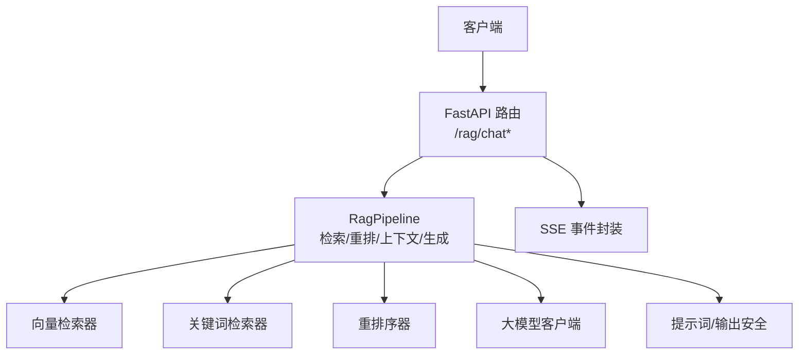
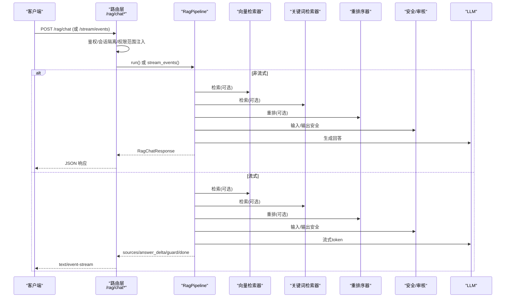
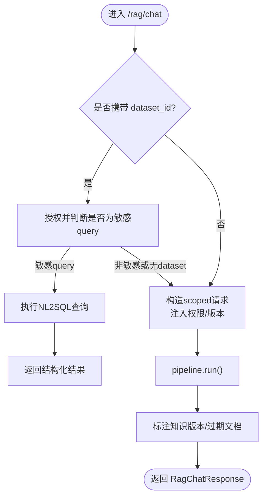
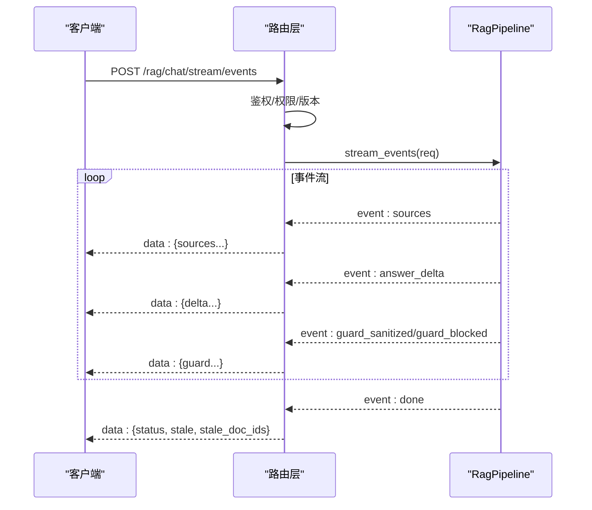
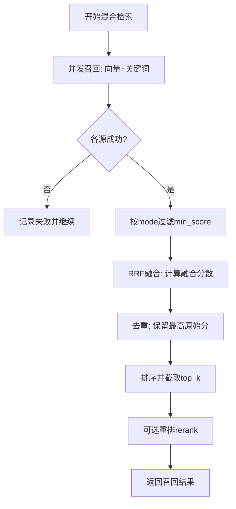
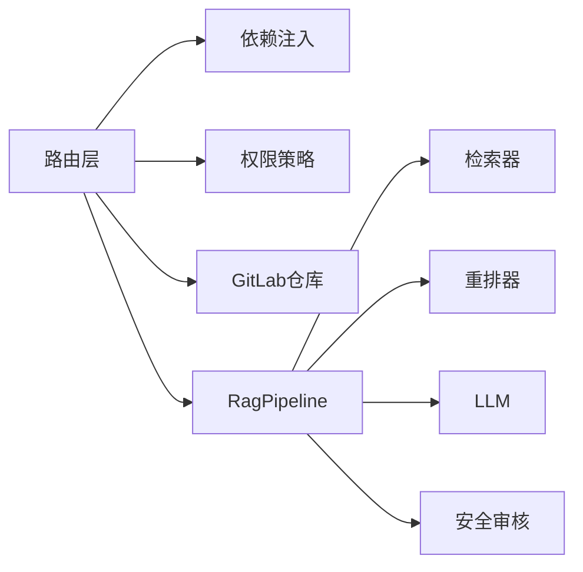

# RAG聊天接口

<cite>
**本文引用的文件**
- [rag_chat_routes.py](file://src/fast_app/api/rag_chat_routes.py)
- [rag_chat_schema.py](file://src/fast_app/schemas/rag_chat_schema.py)
- [rag_stream_models.py](file://src/fast_app/domain/rag_stream_models.py)
- [rag_pipeline_service.py](file://src/fast_app/services/rag/rag_pipeline_service.py)
- [retrieval_fusion.py](file://src/fast_app/services/rag/retrieval_fusion.py)
- [knowledge_permissions.py](file://src/fast_app/domain/knowledge_permissions.py)
</cite>

## 目录
1. [简介](#简介)
2. [项目结构](#项目结构)
3. [核心组件](#核心组件)
4. [架构总览](#架构总览)
5. [详细组件分析](#详细组件分析)
6. [依赖关系分析](#依赖关系分析)
7. [性能考虑](#性能考虑)
8. [故障排查指南](#故障排查指南)
9. [结论](#结论)
10. [附录：调用示例与最佳实践](#附录调用示例与最佳实践)

## 简介
本文件面向使用 /rag/chat 系列接口的开发者，提供端到端文档：包括请求参数、响应结构、流式输出格式、混合检索工作原理、上下文构建、引用来源展示、答案生成机制，以及多场景调用示例和性能优化建议。该接口支持普通问答、多轮对话、带知识库过滤的查询，并兼容结构化数据查询（NL2SQL）路径。

## 项目结构
RAG聊天能力由“路由层 + 管道服务层 + 领域模型/Schema + 检索融合”等模块组成：
- 路由层：定义 /rag/chat、/rag/chat/stream、/rag/chat/stream/events 等端点，负责鉴权、权限范围注入、版本控制、异常处理与SSE封装。
- 管道服务层：RagPipeline 编排检索、重排、上下文组装、LLM生成与流式事件输出。
- Schema与领域模型：定义请求/响应结构、流事件类型、检索权限范围等。
- 检索融合：RRF 融合向量与关键词召回结果。

图表来源
- [rag_chat_routes.py:47-156](file://src/fast_app/api/rag_chat_routes.py#L47-L156)
- [rag_pipeline_service.py:558-800](file://src/fast_app/services/rag/rag_pipeline_service.py#L558-L800)

章节来源
- [rag_chat_routes.py:47-156](file://src/fast_app/api/rag_chat_routes.py#L47-L156)
- [rag_pipeline_service.py:558-800](file://src/fast_app/services/rag/rag_pipeline_service.py#L558-L800)

## 核心组件
- 请求与响应模型：RagChatRequest、RagChatResponse、RagSource、RagScoreBreakdown、RagRetrievalFilters。
- 流事件模型：RagStreamEvent（sources、answer_delta、guard_*、done、error 等）。
- 路由端点：/rag/chat（同步）、/rag/chat/stream（已废弃）、/rag/chat/stream/events（结构化SSE）。
- 管道服务：RagPipeline（检索、合并、重排、上下文、生成、流式事件）。
- 检索融合：reciprocal_rank_fusion（RRF）。
- 权限与版本：RetrievalPermissionScope、知识版本冻结与过期检测。

章节来源
- [rag_chat_schema.py:10-268](file://src/fast_app/schemas/rag_chat_schema.py#L10-L268)
- [rag_stream_models.py:1-46](file://src/fast_app/domain/rag_stream_models.py#L1-L46)
- [rag_chat_routes.py:47-373](file://src/fast_app/api/rag_chat_routes.py#L47-L373)
- [rag_pipeline_service.py:558-800](file://src/fast_app/services/rag/rag_pipeline_service.py#L558-L800)
- [retrieval_fusion.py:1-80](file://src/fast_app/services/rag/retrieval_fusion.py#L1-L80)
- [knowledge_permissions.py:1-20](file://src/fast_app/domain/knowledge_permissions.py#L1-L20)

## 架构总览
下图展示了从HTTP请求到最终回答的完整链路，包括权限注入、混合检索、重排、上下文构建、LLM生成与SSE事件输出。

图表来源
- [rag_chat_routes.py:47-373](file://src/fast_app/api/rag_chat_routes.py#L47-L373)
- [rag_pipeline_service.py:558-800](file://src/fast_app/services/rag/rag_pipeline_service.py#L558-L800)

## 详细组件分析

### 主聊天端点 /rag/chat
- 功能：接收 RagChatRequest，执行权限校验与版本控制，调用 RagPipeline 完成检索、上下文构建与回答生成，返回 RagChatResponse。
- 关键流程：
  - 若携带 dataset_id 且为敏感数据集的 query 动作，走 NL2SQL 直查分支，直接返回结构化结果。
  - 否则构造 scoped 请求，注入用户上下文、检索权限范围、知识版本，再进入 pipeline。
  - 完成后记录耗时、来源数量、答案长度等指标。
- 错误处理：捕获业务异常与未知异常，记录日志并抛出。

图表来源
- [rag_chat_routes.py:47-156](file://src/fast_app/api/rag_chat_routes.py#L47-L156)
- [rag_chat_routes.py:336-373](file://src/fast_app/api/rag_chat_routes.py#L336-L373)

章节来源
- [rag_chat_routes.py:47-156](file://src/fast_app/api/rag_chat_routes.py#L47-L156)
- [rag_chat_routes.py:336-373](file://src/fast_app/api/rag_chat_routes.py#L336-L373)

### 流式端点 /rag/chat/stream/events
- 功能：以结构化SSE事件流输出 sources、answer_delta、guard_*、done 等事件。
- 关键流程：
  - 同样支持 dataset_id 的 NL2SQL 分支，返回 nl2sql_sql_generated、nl2sql_result、done 事件。
  - 对普通RAG请求，通过 pipeline.stream_events() 获取事件并封装为SSE。
  - done 事件中附带 knowledge_version、stale、stale_doc_ids，便于前端感知知识更新。
- 兼容性：/rag/chat/stream 已标记废弃，建议使用 /rag/chat/stream/events。

图表来源
- [rag_chat_routes.py:217-311](file://src/fast_app/api/rag_chat_routes.py#L217-L311)
- [rag_stream_models.py:1-46](file://src/fast_app/domain/rag_stream_models.py#L1-L46)

章节来源
- [rag_chat_routes.py:217-311](file://src/fast_app/api/rag_chat_routes.py#L217-L311)
- [rag_stream_models.py:1-46](file://src/fast_app/domain/rag_stream_models.py#L1-L46)

### 请求参数说明（RagChatRequest）
- query：必填，用户问题，会被规范化去空白。
- mode：检索模式，vector / keyword / hybrid，默认 hybrid。
- top_k：最多返回文档数量，1-20，默认5。
- min_score：最低文档分数阈值，0.0-1.0，默认0.0；仅 vector 模式严格过滤。
- candidate_k：每个召回源先取多少候选文档；为空时使用 top_k。
- filters：metadata过滤条件，包含 source_path、section_path。
- allow_web_fallback / allow_direct_web：是否允许公开Web搜索回退或明确请求。
- min_knowledge_version：可选最低正式知识版本；低于当前版本时返回409。
- dataset_id / nl2sql_action：可选，用于结构化数据查询；二者需成对出现。
- session_id：可选，多轮对话会话ID；为空按单轮处理。

章节来源
- [rag_chat_schema.py:17-134](file://src/fast_app/schemas/rag_chat_schema.py#L17-L134)

### 响应结构说明（RagChatResponse）
- request_id / trace_id：本次请求追踪标识。
- knowledge_version：本次请求全程使用的正式知识版本。
- stale / stale_doc_ids：响应完成时引用文档是否已有更高版本及具体文档ID。
- query：实际用于回答或检索的问题（可能经改写）。
- answer：最终回答文本。
- sources：本次回答引用或检索到的来源列表。
- clarification_required / clarification_code / clarification_question：是否需要澄清意图。
- route_intent / route_confidence / route_source：Router选择的业务意图、置信度与来源。
- agent_task_plan_id / agent_task_status / agent_task_plan / task_confirmation_required / task_confirm_endpoint：Agent任务计划相关字段。
- nl2sql_result：结构化数据查询的完整结果。

章节来源
- [rag_chat_schema.py:189-268](file://src/fast_app/schemas/rag_chat_schema.py#L189-L268)

### 混合检索工作原理
- 模式选择：
  - vector：仅向量检索，应用 min_score 过滤。
  - keyword：仅关键词检索，不应用 min_score 过滤。
  - hybrid：并发执行向量与关键词检索，分别过滤后合并。
- 合并策略：
  - 基于文档id去重，保留最高原始分数的文档对象。
  - 使用 RRF（倒数秩融合）计算融合分数，并按融合分数排序截取 top_k。
- 重排：
  - 可选 rerank 阶段，失败时降级为前 top_k 候选。
- 权限与版本：
  - 将 RetrievalPermissionScope 下推为检索过滤条件，确保只检索用户有权访问的知识。
  - 冻结知识版本，避免检索过程中版本漂移导致不一致。

图表来源
- [rag_pipeline_service.py:236-328](file://src/fast_app/services/rag/rag_pipeline_service.py#L236-L328)
- [retrieval_fusion.py:1-80](file://src/fast_app/services/rag/retrieval_fusion.py#L1-L80)

章节来源
- [rag_pipeline_service.py:236-328](file://src/fast_app/services/rag/rag_pipeline_service.py#L236-L328)
- [retrieval_fusion.py:1-80](file://src/fast_app/services/rag/retrieval_fusion.py#L1-L80)

### 上下文构建过程
- 输入：召回文档列表 RetrievedDoc。
- 步骤：
  - 将每篇文档内容拼接为上下文片段，附带来源与分数信息，便于回答时引用与溯源。
  - 支持 Markdown 父块扩展，提升上下文完整性。
  - 通过 assemble_rag_context 统一组装，并接入 PromptGuard 进行安全审核。
- 输出：RagContext，包含 context_text 与 docs 引用。

章节来源
- [rag_pipeline_service.py:331-347](file://src/fast_app/services/rag/rag_pipeline_service.py#L331-L347)
- [rag_pipeline_service.py:605-626](file://src/fast_app/services/rag/rag_pipeline_service.py#L605-L626)

### 引用来源展示
- RagSource 字段：
  - id：最终送入LLM的上下文记录ID（Markdown父块扩展成功时为parent_id）。
  - doc_id：跨Chunk、父块和知识版本稳定的文档ID。
  - logical_chunk_id / logical_parent_id：不包含版本号的稳定身份。
  - source_revision：生成该记录的GitLab main Commit SHA。
  - parent_id / matched_child_ids / chunk_level：Markdown子块与父块关系。
  - source / retrieval_sources：主来源与实际命中来源列表。
  - title / section_path / metadata：标题、章节路径与结构化元数据。
  - score / scores：最终分数与各阶段分数明细。
  - content_preview：内容预览（截断）。
- 转换逻辑：docs_to_sources 将内部 RetrievedDoc 转为对外 RagSource，并清理内部字段。

章节来源
- [rag_chat_schema.py:137-187](file://src/fast_app/schemas/rag_chat_schema.py#L137-L187)
- [rag_pipeline_service.py:469-555](file://src/fast_app/services/rag/rag_pipeline_service.py#L469-L555)

### 答案生成机制与安全
- 生成：
  - 非流式：generate_answer_node（旧版），新实现通过 LLM 客户端生成。
  - 流式：stream_answer_node（旧版），新实现通过 LLM 流式 token 输出。
- 安全：
  - 输入安全：_ensure_query_allowed 检查用户输入。
  - 输出安全：_ensure_output_allowed 与 _audit_stream_output 审核输出。
  - 流式安全：guarded_answer_delta_events 对增量输出进行清洗或阻断。
- 降级：
  - 重排失败时降级为候选前 top_k。
  - 外部服务异常时记录并抛出业务异常。

章节来源
- [rag_pipeline_service.py:591-604](file://src/fast_app/services/rag/rag_pipeline_service.py#L591-L604)
- [rag_pipeline_service.py:656-752](file://src/fast_app/services/rag/rag_pipeline_service.py#L656-L752)

## 依赖关系分析
- 路由层依赖：
  - 依赖注入：get_rag_pipeline、get_db_session、get_current_user_context、get_nl2sql_service。
  - 权限与版本：KnowledgePermissionPolicy、GitLabRepository。
- 管道层依赖：
  - 检索器：BaseRetriever（向量/关键词）。
  - 重排器：BaseReranker。
  - LLM：BaseLLMClient。
  - 安全：PromptGuardService。
  - 上下文：assemble_rag_context、MarkdownParentContextExpander。
- 领域模型：
  - RetrievalPermissionScope：服务端生成的检索权限范围。
  - RagStreamEvent：结构化事件类型。

图表来源
- [rag_chat_routes.py:47-156](file://src/fast_app/api/rag_chat_routes.py#L47-L156)
- [rag_pipeline_service.py:558-800](file://src/fast_app/services/rag/rag_pipeline_service.py#L558-L800)
- [knowledge_permissions.py:1-20](file://src/fast_app/domain/knowledge_permissions.py#L1-L20)

章节来源
- [rag_chat_routes.py:47-156](file://src/fast_app/api/rag_chat_routes.py#L47-L156)
- [rag_pipeline_service.py:558-800](file://src/fast_app/services/rag/rag_pipeline_service.py#L558-L800)
- [knowledge_permissions.py:1-20](file://src/fast_app/domain/knowledge_permissions.py#L1-L20)

## 性能考虑
- 并发召回：混合模式下并发执行向量与关键词检索，降低整体延迟。
- 候选与截断：candidate_k 控制召回规模，top_k 控制最终上下文大小，平衡质量与成本。
- 重排降级：rerank 失败时自动降级，保证可用性。
- 最小分数过滤：vector 模式严格过滤低相关性文档，减少无效上下文。
- 版本冻结：知识版本在请求入口冻结，避免检索过程中版本漂移导致的重复计算与不一致。
- 日志与慢操作监控：记录各阶段耗时与慢操作阈值，便于定位瓶颈。

[本节为通用性能指导，无需特定文件来源]

## 故障排查指南
- 常见错误：
  - NoSearchResultError：检索结果为空，检查 min_score、filters、权限范围与知识版本。
  - ExternalServiceError：外部服务异常，检查向量/关键词检索器与健康状态。
  - KnowledgeVersionNotReadyError：知识仍在更新，等待目标版本发布后重试。
  - Nl2SqlLegacyStreamUnsupportedError：旧版流式接口不支持NL2SQL，改用 /rag/chat 或 /rag/chat/stream/events。
- 排查要点：
  - 查看 sources 中的 retrieval_sources 与 scores，确认各阶段召回情况。
  - 关注 done 事件中的 stale 与 stale_doc_ids，判断引用文档是否已更新。
  - 检查 guard_sanitized/guard_blocked 事件，了解输出安全处理结果。

章节来源
- [rag_chat_routes.py:105-156](file://src/fast_app/api/rag_chat_routes.py#L105-L156)
- [rag_chat_routes.py:263-274](file://src/fast_app/api/rag_chat_routes.py#L263-L274)
- [rag_chat_routes.py:336-373](file://src/fast_app/api/rag_chat_routes.py#L336-L373)

## 结论
/rags/chat 系列接口提供了完整的RAG聊天能力，支持多种检索模式、权限控制、知识版本管理、流式输出与安全审核。通过混合检索与RRF融合，结合重排与上下文构建，能够在保证可用性的同时提升回答质量。建议在生产环境中合理配置 top_k、candidate_k、min_score 与 rerank_top_k，并结合日志与监控持续优化。

[本节为总结性内容，无需特定文件来源]

## 附录：调用示例与最佳实践

### 简单问答
- 端点：POST /rag/chat
- 请求体关键字段：
  - query：用户问题
  - mode：hybrid（默认）
  - top_k：5（默认）
  - min_score：0.0（默认）
  - filters：可选，source_path、section_path
- 响应关键字段：
  - answer：最终回答
  - sources：引用来源列表
  - knowledge_version / stale / stale_doc_ids：知识版本与过期信息

章节来源
- [rag_chat_schema.py:17-134](file://src/fast_app/schemas/rag_chat_schema.py#L17-L134)
- [rag_chat_schema.py:189-268](file://src/fast_app/schemas/rag_chat_schema.py#L189-L268)

### 多轮对话
- 端点：POST /rag/chat
- 请求体关键字段：
  - session_id：多轮会话ID
  - query：当前轮次问题
- 行为：
  - 服务端会生成 scoped session_id，保持会话隔离。
  - 历史消息窗口与短期记忆由其他模块管理，此处通过 session_id 关联。

章节来源
- [rag_chat_schema.py:34-39](file://src/fast_app/schemas/rag_chat_schema.py#L34-L39)
- [rag_chat_routes.py:84-103](file://src/fast_app/api/rag_chat_routes.py#L84-L103)

### 带知识库过滤的查询
- 端点：POST /rag/chat
- 请求体关键字段：
  - filters.source_path：限定原始文档路径
  - filters.section_path：限定章节路径
- 行为：
  - 服务端会将 RetrievalPermissionScope 与 filters 合并为检索过滤条件，确保只检索用户有权访问的知识。

章节来源
- [rag_chat_schema.py:13-16](file://src/fast_app/schemas/rag_chat_schema.py#L13-L16)
- [rag_pipeline_service.py:221-233](file://src/fast_app/services/rag/rag_pipeline_service.py#L221-L233)
- [knowledge_permissions.py:1-20](file://src/fast_app/domain/knowledge_permissions.py#L1-L20)

### 流式输出（结构化SSE）
- 端点：POST /rag/chat/stream/events
- 事件类型：
  - sources：召回来源
  - answer_delta：答案增量
  - guard_sanitized / guard_blocked：安全处理结果
  - done：完成事件，包含 status、knowledge_version、stale、stale_doc_ids
- 行为：
  - 支持 NL2SQL 分支，返回 nl2sql_sql_generated、nl2sql_result、done。
  - 推荐使用结构化SSE，而非已废弃的 /rag/chat/stream。

章节来源
- [rag_stream_models.py:1-46](file://src/fast_app/domain/rag_stream_models.py#L1-L46)
- [rag_chat_routes.py:217-311](file://src/fast_app/api/rag_chat_routes.py#L217-L311)

### 最佳实践
- 合理设置 top_k 与 candidate_k：在保证质量的前提下控制上下文大小与成本。
- 谨慎使用 min_score：仅在 vector 模式严格过滤，keyword/hybrid 模式通常不过滤。
- 启用 rerank：提升最终排序质量，但需容忍降级。
- 使用 filters：精确限定检索范围，提高召回准确率。
- 关注 stale_doc_ids：前端可提示用户刷新或重新检索。
- 监控日志与慢操作：利用事件日志与慢操作阈值定位瓶颈。

[本节为通用最佳实践，无需特定文件来源]