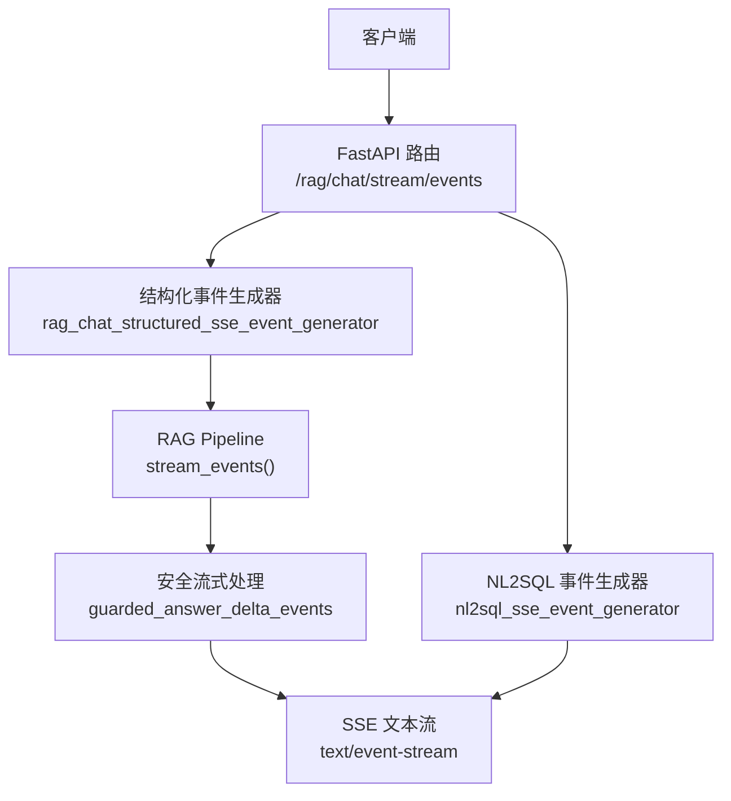
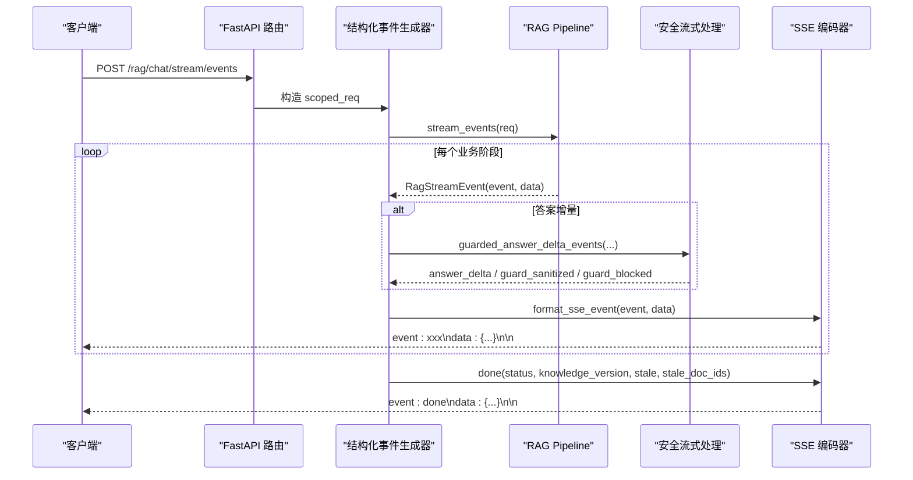
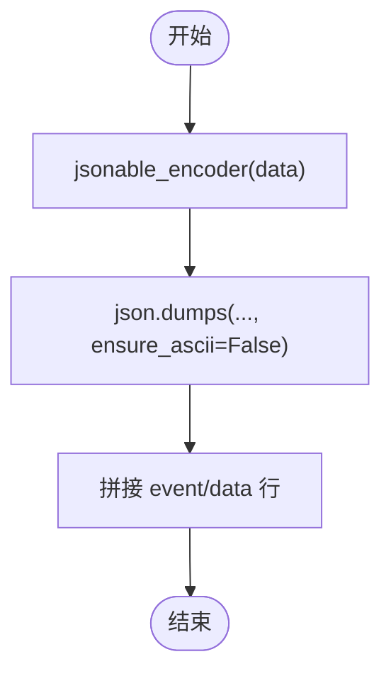
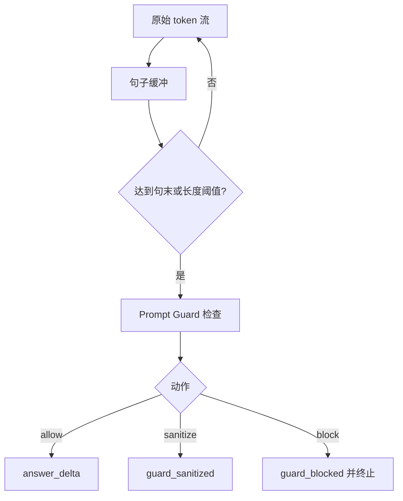
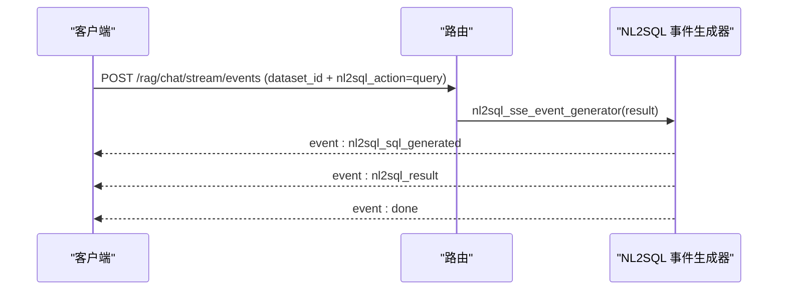
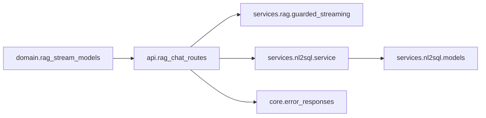

# SSE事件格式规范

<cite>
**本文引用的文件**
- [rag_stream_models.py](file://src/fast_app/domain/rag_stream_models.py)
- [rag_chat_routes.py](file://src/fast_app/api/rag_chat_routes.py)
- [guarded_streaming.py](file://src/fast_app/services/rag/guarded_streaming.py)
- [streaming.py](file://src/fast_app/rag_eval/streaming.py)
- [error_responses.py](file://src/fast_app/core/error_responses.py)
- [models.py](file://src/fast_app/services/nl2sql/models.py)
- [service.py](file://src/fast_app/services/nl2sql/service.py)
- [langgraph_rag_pipeline_service.py](file://src/fast_app/services/rag/langgraph_rag_pipeline_service.py)
</cite>

## 目录
1. [简介](#简介)
2. [项目结构](#项目结构)
3. [核心组件](#核心组件)
4. [架构总览](#架构总览)
5. [详细组件分析](#详细组件分析)
6. [依赖关系分析](#依赖关系分析)
7. [性能与序列化注意事项](#性能与序列化注意事项)
8. [客户端解析与错误处理指南](#客户端解析与错误处理指南)
9. [结论](#结论)
10. [附录：事件字段速查表](#附录事件字段速查表)

## 简介
本规范定义当前系统通过 Server-Sent Events（SSE）对外暴露的结构化流式接口，覆盖检索、生成、安全过滤、完成信号以及 NL2SQL 相关事件。重点说明：
- 所有事件类型及其 data 字段结构
- Pydantic 模型在 SSE 中的 JSON 编码方式
- 为什么使用 jsonable_encoder 进行序列化
- 客户端如何解析事件并处理 error 等终态
- NL2SQL 的 nl2sql_sql_generated 与 nl2sql_result 事件格式

## 项目结构
SSE 事件从 Pipeline 层产生结构化事件对象，API 层将其转换为标准 SSE 文本流；NL2SQL 分支在特定条件下直接输出专用事件序列。

图表来源
- [rag_chat_routes.py:217-333](file://src/fast_app/api/rag_chat_routes.py#L217-L333)
- [guarded_streaming.py:36-222](file://src/fast_app/services/rag/guarded_streaming.py#L36-L222)
- [langgraph_rag_pipeline_service.py:489-519](file://src/fast_app/services/rag/langgraph_rag_pipeline_service.py#L489-L519)

章节来源
- [rag_chat_routes.py:186-333](file://src/fast_app/api/rag_chat_routes.py#L186-L333)
- [guarded_streaming.py:36-222](file://src/fast_app/services/rag/guarded_streaming.py#L36-L222)
- [langgraph_rag_pipeline_service.py:489-519](file://src/fast_app/services/rag/langgraph_rag_pipeline_service.py#L489-L519)

## 核心组件
- 事件名称与载体：统一的事件名枚举和事件数据载体，用于在 Pipeline 与 API 之间传递结构化事件。
- 事件格式化：将事件名与数据序列化为标准 SSE 文本行。
- 安全流式处理：对 LLM 原始 token 流进行句子级缓冲与安全检测，产出 answer_delta、guard_sanitized、guard_blocked。
- NL2SQL 事件：当请求命中敏感数据集查询时，输出 SQL 生成结果与查询结果事件。
- 错误事件：统一错误结构，包含 code、message、error_category、request_id、trace_id。

章节来源
- [rag_stream_models.py:5-45](file://src/fast_app/domain/rag_stream_models.py#L5-L45)
- [rag_chat_routes.py:208-215](file://src/fast_app/api/rag_chat_routes.py#L208-L215)
- [guarded_streaming.py:36-222](file://src/fast_app/services/rag/guarded_streaming.py#L36-L222)
- [error_responses.py:7-63](file://src/fast_app/core/error_responses.py#L7-L63)
- [models.py:95-114](file://src/fast_app/services/nl2sql/models.py#L95-L114)

## 架构总览
下图展示一次结构化 RAG 流式请求的关键调用链与事件产出点。

图表来源
- [rag_chat_routes.py:217-333](file://src/fast_app/api/rag_chat_routes.py#L217-L333)
- [guarded_streaming.py:36-222](file://src/fast_app/services/rag/guarded_streaming.py#L36-L222)
- [langgraph_rag_pipeline_service.py:489-519](file://src/fast_app/services/rag/langgraph_rag_pipeline_service.py#L489-L519)

## 详细组件分析

### 事件类型与数据结构
- sources：检索来源列表。data.sources 为对象数组，至少包含 doc_id 等标识字段。
- answer_delta：答案增量片段。data.text 为字符串片段。
- guard_sanitized：安全脱敏后的片段。data.answer 或 data.text 为脱敏后文本，data.action 为 sanitize，data.risk_level、data.categories、data.reason 来自安全检测结果。
- guard_blocked：安全拦截。data.answer 或 data.text 为被阻断时的安全文本，data.action 为 block，其余字段同上。
- done：完成信号。data.status 为 done；data.knowledge_version 为冻结知识版本；data.stale 与 data.stale_doc_ids 表示来源是否过期。
- error：错误信号。data.code、data.message、data.error_category、data.request_id、data.trace_id 由统一错误构建函数提供。
- agent_route_selected：路由结论。data.intent、data.source 表示意图与来源。
- tool_execution_result 与 Agent TaskPlan 相关事件：用于任务执行进度、工具调用状态等，具体以 Pipeline 产出的 data 为准。
- nl2sql_sql_generated：NL2SQL SQL 已生成。data.query_id、data.dataset_id、data.parameterized_sql、data.attempt_count。
- nl2sql_result：NL2SQL 查询结果。data 为 Nl2SqlQueryResult 的 JSON 编码，包含 query_id、dataset_id、parameterized_sql、columns、rows、row_count、truncated、execution_ms、attempt_count、summary、warnings、markdown_table 等。

章节来源
- [rag_stream_models.py:5-45](file://src/fast_app/domain/rag_stream_models.py#L5-L45)
- [rag_chat_routes.py:217-333](file://src/fast_app/api/rag_chat_routes.py#L217-L333)
- [guarded_streaming.py:192-222](file://src/fast_app/services/rag/guarded_streaming.py#L192-L222)
- [models.py:95-114](file://src/fast_app/services/nl2sql/models.py#L95-L114)

### 事件序列化与 jsonable_encoder
- 所有事件通过统一的 SSE 格式化函数输出，event 字段写入 SSE 的 event 行，data 字段写入 SSE 的 data 行。
- data 对象可能包含 Pydantic 模型（例如 sources 中的 RagSource、NL2SQL 的 Nl2SqlQueryResult）。由于 json.dumps 无法直接序列化 Pydantic 模型，需先使用 jsonable_encoder 将模型转为可序列化的 dict，再进行 JSON 编码。
- ensure_ascii=False 保证中文字符不被转义，便于前端直接显示。

图表来源
- [rag_chat_routes.py:208-215](file://src/fast_app/api/rag_chat_routes.py#L208-L215)
- [agent_task_plan_routes.py:664-668](file://src/fast_app/api/agent_task_plan_routes.py#L664-L668)

章节来源
- [rag_chat_routes.py:208-215](file://src/fast_app/api/rag_chat_routes.py#L208-L215)
- [agent_task_plan_routes.py:664-668](file://src/fast_app/api/agent_task_plan_routes.py#L664-L668)

### 安全流式处理流程
- 默认模式为句子缓冲：token 进入缓冲区，到达句末标点或最大字符数时，交给 Prompt Guard 检查。
- 检查结果分类：
  - allow：直接产出 answer_delta。
  - sanitize：产出 guard_sanitized，并附带脱敏文本。
  - block：产出 guard_blocked，停止后续输出。
- 兼容模式：
  - buffer_then_emit：先缓冲完整回答再一次性检查，延迟最高但最安全。
  - pre_guard_only：先发送原始 token，结束后审计，仅适合观察。

图表来源
- [guarded_streaming.py:55-134](file://src/fast_app/services/rag/guarded_streaming.py#L55-L134)
- [guarded_streaming.py:148-222](file://src/fast_app/services/rag/guarded_streaming.py#L148-L222)

章节来源
- [guarded_streaming.py:55-134](file://src/fast_app/services/rag/guarded_streaming.py#L55-L134)
- [guarded_streaming.py:148-222](file://src/fast_app/services/rag/guarded_streaming.py#L148-L222)

### NL2SQL 事件序列
当请求命中敏感数据集且 action=query 时，走 NL2SQL 分支，依次输出：
- nl2sql_sql_generated：包含 query_id、dataset_id、parameterized_sql、attempt_count。
- nl2sql_result：Nl2SqlQueryResult 的 JSON 编码，包含 columns、rows、row_count、truncated、execution_ms、summary、warnings、markdown_table 等。
- done：status=done，并携带 query_id。

图表来源
- [rag_chat_routes.py:277-333](file://src/fast_app/api/rag_chat_routes.py#L277-L333)
- [models.py:95-114](file://src/fast_app/services/nl2sql/models.py#L95-L114)

章节来源
- [rag_chat_routes.py:277-333](file://src/fast_app/api/rag_chat_routes.py#L277-L333)
- [models.py:95-114](file://src/fast_app/services/nl2sql/models.py#L95-L114)

### 错误事件与协议约束
- error 事件为终态之一，出现后不应继续发送其他事件。
- error 事件必须包含 code、message、error_category、request_id、trace_id。
- 结构化流必须以唯一的 done 或 error 结束；重复终态或缺失终态视为协议错误。

章节来源
- [streaming.py:13-172](file://src/fast_app/rag_eval/streaming.py#L13-L172)
- [error_responses.py:7-63](file://src/fast_app/core/error_responses.py#L7-L63)

## 依赖关系分析
- 事件名与载体定义位于 domain 层，供 pipeline 与 API 共享。
- API 路由负责选择 RAG 或 NL2SQL 分支，并统一格式化为 SSE。
- 安全流式处理作为输出边界，确保只有允许的内容进入 answer_delta。
- NL2SQL 服务负责授权、标记化、SQL 生成、执行与结果序列化，并通过事件输出。

图表来源
- [rag_stream_models.py:5-45](file://src/fast_app/domain/rag_stream_models.py#L5-L45)
- [rag_chat_routes.py:208-333](file://src/fast_app/api/rag_chat_routes.py#L208-L333)
- [guarded_streaming.py:36-222](file://src/fast_app/services/rag/guarded_streaming.py#L36-L222)
- [service.py:95-284](file://src/fast_app/services/nl2sql/service.py#L95-L284)
- [models.py:95-114](file://src/fast_app/services/nl2sql/models.py#L95-L114)
- [error_responses.py:7-63](file://src/fast_app/core/error_responses.py#L7-L63)

章节来源
- [rag_stream_models.py:5-45](file://src/fast_app/domain/rag_stream_models.py#L5-L45)
- [rag_chat_routes.py:208-333](file://src/fast_app/api/rag_chat_routes.py#L208-L333)
- [guarded_streaming.py:36-222](file://src/fast_app/services/rag/guarded_streaming.py#L36-L222)
- [service.py:95-284](file://src/fast_app/services/nl2sql/service.py#L95-L284)
- [models.py:95-114](file://src/fast_app/services/nl2sql/models.py#L95-L114)
- [error_responses.py:7-63](file://src/fast_app/core/error_responses.py#L7-L63)

## 性能与序列化注意事项
- 安全流式处理采用句子缓冲，避免逐 token 检查带来的高频外部调用，同时兼顾首包延迟与安全性。
- 对于需要最强安全的场景，可使用“缓冲后一次性检查”模式，但会增大首包延迟。
- 使用 jsonable_encoder 将 Pydantic 模型转为 dict，避免序列化失败；ensure_ascii=False 提升可读性。
- NL2SQL 结果包含行数限制与长文本截断警告，避免响应过大。

章节来源
- [guarded_streaming.py:55-134](file://src/fast_app/services/rag/guarded_streaming.py#L55-L134)
- [rag_chat_routes.py:208-215](file://src/fast_app/api/rag_chat_routes.py#L208-L215)
- [service.py:227-264](file://src/fast_app/services/nl2sql/service.py#L227-L264)

## 客户端解析与错误处理指南
- 解析步骤：
  - 按行读取 SSE 流，识别 event 与 data 行。
  - 对 data 行进行 JSON 解码，得到字典。
  - 根据 event 类型分发处理：
    - sources：记录 sources 列表。
    - answer_delta：追加 text 到最终答案。
    - guard_sanitized / guard_blocked：记录安全事件并追加脱敏或阻断文本。
    - agent_route_selected：记录路由意图与来源。
    - nl2sql_sql_generated：展示 SQL、query_id、attempt_count。
    - nl2sql_result：展示 columns、rows、summary 等。
    - done：确认完成，读取 knowledge_version、stale、stale_doc_ids。
    - error：终止流，记录错误信息。
- 协议校验：
  - 必须在收到唯一 done 或 error 后停止消费。
  - 若出现重复终态或无终态，应视为协议错误。
- 错误处理策略：
  - 优先读取 error 事件的 code、message、error_category。
  - 使用 request_id 与 trace_id 进行日志关联与问题定位。
  - 对 system_error 与 external_service_error 可考虑重试；user_error 通常不重试。

章节来源
- [streaming.py:13-172](file://src/fast_app/rag_eval/streaming.py#L13-L172)
- [error_responses.py:7-63](file://src/fast_app/core/error_responses.py#L7-L63)

## 结论
本规范明确了结构化 SSE 事件体系，涵盖检索来源、答案增量、安全过滤、完成信号与 NL2SQL 事件。通过统一的事件名、标准化的 data 结构与严格的协议约束，客户端可以稳定地解析与消费流式数据。安全流式处理在保证用户体验的同时，提供了灵活的安全策略。NL2SQL 分支在敏感数据集场景下提供完整的 SQL 生成与查询结果事件，便于前端展示与分析。

## 附录：事件字段速查表
- sources
  - data.sources：对象数组，至少包含 doc_id 等标识字段。
- answer_delta
  - data.text：字符串片段。
- guard_sanitized
  - data.text 或 data.answer：脱敏后文本。
  - data.action：sanitize。
  - data.risk_level、data.categories、data.reason：安全检测结果。
- guard_blocked
  - data.text 或 data.answer：阻断时的安全文本。
  - data.action：block。
  - data.risk_level、data.categories、data.reason：安全检测结果。
- done
  - data.status：done。
  - data.knowledge_version：冻结知识版本。
  - data.stale：是否过期。
  - data.stale_doc_ids：过期来源 ID 列表。
- error
  - data.code：错误码。
  - data.message：用户可见消息。
  - data.error_category：user_error / external_service_error / system_error。
  - data.request_id：请求追踪 ID。
  - data.trace_id：业务链路追踪 ID。
- agent_route_selected
  - data.intent：业务意图。
  - data.source：路由来源。
- nl2sql_sql_generated
  - data.query_id：查询审计 ID。
  - data.dataset_id：数据集 ID。
  - data.parameterized_sql：参数化 SQL。
  - data.attempt_count：尝试次数。
- nl2sql_result
  - data.query_id、data.dataset_id、data.parameterized_sql、data.columns、data.rows、data.row_count、data.truncated、data.execution_ms、data.attempt_count、data.summary、data.warnings、data.markdown_table。

章节来源
- [rag_chat_routes.py:217-333](file://src/fast_app/api/rag_chat_routes.py#L217-L333)
- [guarded_streaming.py:192-222](file://src/fast_app/services/rag/guarded_streaming.py#L192-L222)
- [models.py:95-114](file://src/fast_app/services/nl2sql/models.py#L95-L114)
- [error_responses.py:7-63](file://src/fast_app/core/error_responses.py#L7-L63)