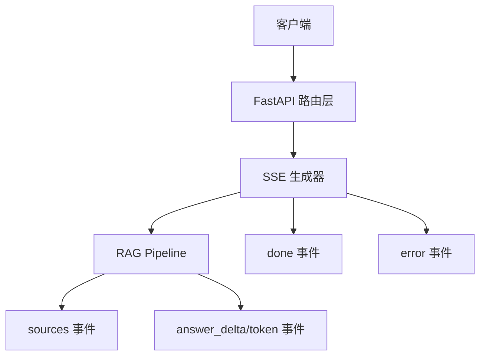
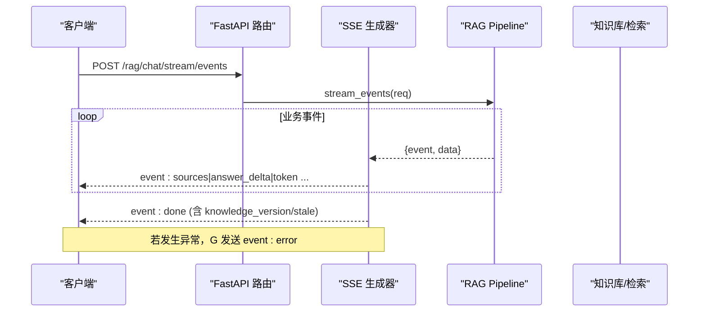
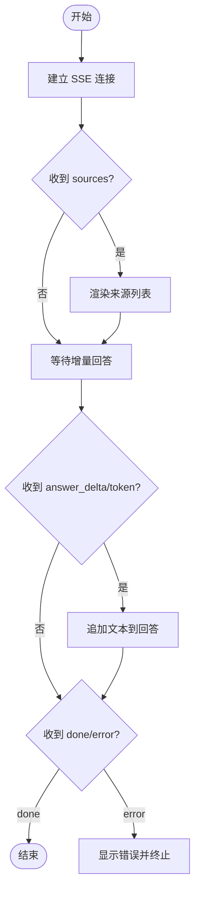
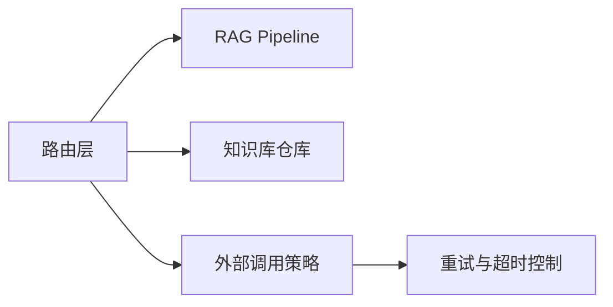

# 客户端集成指南

<cite>
**本文引用的文件**
- [rag_chat_routes.py](file://src/fast_app/api/rag_chat_routes.py)
- [rag_stream_models.py](file://src/fast_app/domain/rag_stream_models.py)
- [test_rag_chat_api.py](file://scripts/tests/rag_memory/test_rag_chat_api.py)
- [20-3-接口文档整理.md](file://learning-docs/phase-20/20-3-接口文档整理.md)
- [agent_task_plan_routes.py](file://src/fast_app/api/agent_task_plan_routes.py)
- [external_call_policy.py](file://src/fast_app/services/external_call_policy.py)
- [9-8-超时重试降级与fallback.md](file://learning-docs/phase-9/9-8-超时重试降级与fallback.md)
- [stream_routes.py](file://src/fast_app/api/stream_routes.py)
</cite>

## 目录
1. [简介](#简介)
2. [项目结构](#项目结构)
3. [核心组件](#核心组件)
4. [架构总览](#架构总览)
5. [详细组件分析](#详细组件分析)
6. [依赖关系分析](#依赖关系分析)
7. [性能考虑](#性能考虑)
8. [故障排查指南](#故障排查指南)
9. [结论](#结论)
10. [附录：多语言客户端实现要点](#附录多语言客户端实现要点)

## 简介
本指南面向需要接入服务端流式接口的客户端开发者，重点说明如何建立 SSE（Server-Sent Events）连接、处理事件流、管理连接状态与断线重连，并给出 Python、JavaScript、Go 等语言的实现要点。内容基于仓库中已实现的 /rag/chat/stream/events（新版结构化 SSE）和 /rag/chat/stream（旧版 token-only SSE）两个端点，结合测试用例与服务端代码，帮助你在前端或后端服务中稳定地消费流式数据，尤其是 sources 与 answer_delta/token 事件的实时渲染。

## 项目结构
本项目在服务端通过 FastAPI 暴露两类流式接口：
- 新版结构化 SSE：POST /rag/chat/stream/events，返回 sources、answer_delta（兼容 token）、done、error 等结构化事件。
- 旧版 token-only SSE：POST /rag/chat/stream（已标记废弃），仅返回逐字符 token 的默认消息，以及 done/error 事件。

此外，仓库还包含通用 SSE 示例路由与测试脚本，用于演示基础 SSE 行为与解析逻辑。

图表来源
- [rag_chat_routes.py:159-311](file://src/fast_app/api/rag_chat_routes.py#L159-L311)
- [rag_stream_models.py:5-45](file://src/fast_app/domain/rag_stream_models.py#L5-L45)

章节来源
- [rag_chat_routes.py:159-311](file://src/fast_app/api/rag_chat_routes.py#L159-L311)
- [20-3-接口文档整理.md:212-290](file://learning-docs/phase-20/20-3-接口文档整理.md#L212-L290)

## 核心组件
- 结构化事件模型：定义事件名集合与事件载体，明确 sources、answer_delta、token、done、error 等事件类型。
- 新版事件生成器：将 pipeline 产生的业务事件转换为 SSE 文本流，并在结束时附加 knowledge_version 与 stale 信息。
- 旧版事件生成器：将 pipeline.stream 的纯 token 字符串包装为 SSE，最后发送 done 事件。
- 错误封装：统一将应用异常与内部异常转为 error 事件，便于客户端识别和处理。

章节来源
- [rag_stream_models.py:5-45](file://src/fast_app/domain/rag_stream_models.py#L5-L45)
- [rag_chat_routes.py:159-274](file://src/fast_app/api/rag_chat_routes.py#L159-L274)

## 架构总览
下图展示了从客户端请求到服务端事件输出的完整流程，包括新旧端点的差异与事件流转。

图表来源
- [rag_chat_routes.py:217-311](file://src/fast_app/api/rag_chat_routes.py#L217-L311)
- [rag_stream_models.py:5-45](file://src/fast_app/domain/rag_stream_models.py#L5-L45)

## 详细组件分析

### 新版结构化 SSE：/rag/chat/stream/events
- 用途：适合需要展示检索来源与增量回答的前端场景。
- 事件顺序：先 sources，再 answer_delta（或兼容的 token），最后 done；失败时发送 error。
- 结束事件：包含 knowledge_version 与 stale/stale_doc_ids，便于客户端判断是否需要刷新来源。
- 兼容性：保留 token 事件名以兼容旧客户端，但新主线推荐使用 answer_delta。

图表来源
- [rag_chat_routes.py:217-274](file://src/fast_app/api/rag_chat_routes.py#L217-L274)
- [rag_stream_models.py:5-45](file://src/fast_app/domain/rag_stream_models.py#L5-L45)

章节来源
- [rag_chat_routes.py:217-311](file://src/fast_app/api/rag_chat_routes.py#L217-L311)
- [20-3-接口文档整理.md:257-290](file://learning-docs/phase-20/20-3-接口文档整理.md#L257-L290)

### 旧版 token-only SSE：/rag/chat/stream（已废弃）
- 特点：只返回 token 字符串，不携带 sources；done 事件固定为 [DONE]；错误事件携带结构化错误信息。
- 建议：新项目优先使用结构化 SSE；旧客户端可继续兼容此端点直至迁移完成。

章节来源
- [rag_chat_routes.py:159-205](file://src/fast_app/api/rag_chat_routes.py#L159-L205)
- [20-3-接口文档整理.md:212-256](file://learning-docs/phase-20/20-3-接口文档整理.md#L212-L256)

### 事件模型与命名约定
- 事件名：sources、answer_delta、guard_sanitized、guard_blocked、token、done、error、tool_execution_result、各类 agent_task_*、nl2sql_* 等。
- 语义：
  - sources：检索来源列表，包含 scores、retrieval_sources、metadata 等字段。
  - answer_delta：增量回答片段；token 作为兼容事件名保留。
  - guard_*：安全策略对输出进行清洗或拦截的结果。
  - done：流结束，附带 knowledge_version 与 stale 信息。
  - error：错误事件，包含 code、message、error_category、request_id、trace_id 等。

章节来源
- [rag_stream_models.py:5-45](file://src/fast_app/domain/rag_stream_models.py#L5-L45)

### 服务端示例与测试参考
- 通用 SSE 示例：提供 text/plain 与 text/event-stream 的基础示例，便于理解 SSE 格式。
- 测试脚本：演示如何解析 SSE 行、区分 event/data、处理 sources/token/done/error，并验证数据结构。

章节来源
- [stream_routes.py:1-38](file://src/fast_app/api/stream_routes.py#L1-L38)
- [test_rag_chat_api.py:468-763](file://scripts/tests/rag_memory/test_rag_chat_api.py#L468-L763)

## 依赖关系分析
- 路由层依赖：
  - 获取 RAG Pipeline 实例，调用 stream_events 或 stream。
  - 构建授权后的 scoped 请求，注入用户上下文与权限范围。
  - 在结构化 SSE 结束时查询知识版本变更，计算 stale_doc_ids。
- 外部调用策略：
  - 统一的超时与重试封装，支持指数退避与可重试状态码判定。
  - 将超时异常包装为外部服务超时错误，便于上层捕获与上报。

图表来源
- [rag_chat_routes.py:336-373](file://src/fast_app/api/rag_chat_routes.py#L336-L373)
- [external_call_policy.py:39-74](file://src/fast_app/services/external_call_policy.py#L39-L74)

章节来源
- [rag_chat_routes.py:336-373](file://src/fast_app/api/rag_chat_routes.py#L336-L373)
- [external_call_policy.py:39-74](file://src/fast_app/services/external_call_policy.py#L39-L74)
- [9-8-超时重试降级与fallback.md:345-417](file://learning-docs/phase-9/9-8-超时重试降级与fallback.md#L345-L417)

## 性能考虑
- 流式传输：
  - 使用 text/event-stream 媒体类型，避免缓冲整段响应。
  - 增量渲染 answer_delta/token，减少 UI 重排开销。
- 事件去重：
  - 对于高频状态事件（如 agent_task_status），客户端可做相邻重复过滤，避免日志风暴。
- 资源清理：
  - 客户端应在 finally 块中关闭连接、释放读取器与解码器，防止资源泄漏。
- 超时与重试：
  - 设置合理的连接与读取超时；网络抖动时采用指数退避重试，限制最大重试次数。
- 缓存与版本：
  - 利用 done 中的 knowledge_version 与 stale_doc_ids 判断是否需要刷新来源，减少无效请求。

[本节为通用指导，无需特定文件引用]

## 故障排查指南
- 常见错误事件：
  - error：检查 code、message、error_category、request_id、trace_id，定位问题来源。
  - NO_SEARCH_RESULT：提高 min_score 或调整检索参数。
- 调试技巧：
  - 打印原始 SSE 行，确认 event/data 是否正确解析。
  - 使用 X-Request-ID 与 X-Debug-Trace-Token 关联服务端日志。
- 重试策略：
  - 针对 429/500/502/503/504 等可重试状态码实施重试。
  - 超时异常应单独处理，避免无限重试。

章节来源
- [test_rag_chat_api.py:739-763](file://scripts/tests/rag_memory/test_rag_chat_api.py#L739-L763)
- [9-8-超时重试降级与fallback.md:345-417](file://learning-docs/phase-9/9-8-超时重试降级与fallback.md#L345-L417)

## 结论
- 新项目优先使用 /rag/chat/stream/events，获得结构化事件与更丰富的上下文信息。
- 旧客户端可继续使用 /rag/chat/stream，但需尽快迁移至结构化 SSE。
- 客户端应正确处理 sources、answer_delta/token、done、error 事件，实现增量渲染、错误提示与资源清理。
- 结合超时、重试与版本感知，提升流式体验的稳定性与性能。

[本节为总结性内容，无需特定文件引用]

## 附录：多语言客户端实现要点

### Python 客户端要点
- 使用 requests.post(..., stream=True) 建立长连接。
- 逐行解析 SSE：
  - 遇到 event: 行更新当前事件类型。
  - 遇到 data: 行解析 JSON 或文本。
- 事件处理：
  - sources：渲染来源列表。
  - token/answer_delta：追加文本到回答。
  - done：结束流。
  - error：显示错误并终止。
- 超时与重试：
  - 设置 timeout；捕获超时与网络异常后指数退避重试。
- 资源清理：
  - 在 finally 中确保关闭响应对象。

章节来源
- [test_rag_chat_api.py:468-763](file://scripts/tests/rag_memory/test_rag_chat_api.py#L468-L763)

### JavaScript 客户端要点
- 使用 fetch 发起 POST 请求，获取 ReadableStream。
- 使用 TextDecoder 解码字节流，按 \r\n\r\n 分割成 SSE 块。
- 解析每个块：
  - 提取 event 与 data 行。
  - 尝试 JSON.parse(data)，否则视为文本。
- 事件处理：
  - sources：渲染来源。
  - answer_delta/token：追加文本。
  - done：结束。
  - error：提示错误。
- 中止与清理：
  - 使用 AbortController 中止请求。
  - 在 finally 中释放 reader 与控制器。

章节来源
- [rag_agent_manual_acceptance.html:639-825](file://scripts/phase_15/rag_agent_manual_acceptance.html#L639-L825)

### Go 客户端要点
- 使用 net/http 发起 POST，启用流式读取。
- 使用 bufio.Scanner 或自定义分帧器按行读取 SSE。
- 解析 event 与 data：
  - 维护当前事件类型。
  - 解析 JSON 数据体。
- 事件处理：
  - sources：渲染来源。
  - answer_delta/token：追加文本。
  - done：结束。
  - error：提示错误。
- 超时与重试：
  - 配置 http.Client 的超时。
  - 对可重试错误实施指数退避重试。
- 资源清理：
  - 确保关闭 Response.Body。

[本节为通用指导，无需特定文件引用]