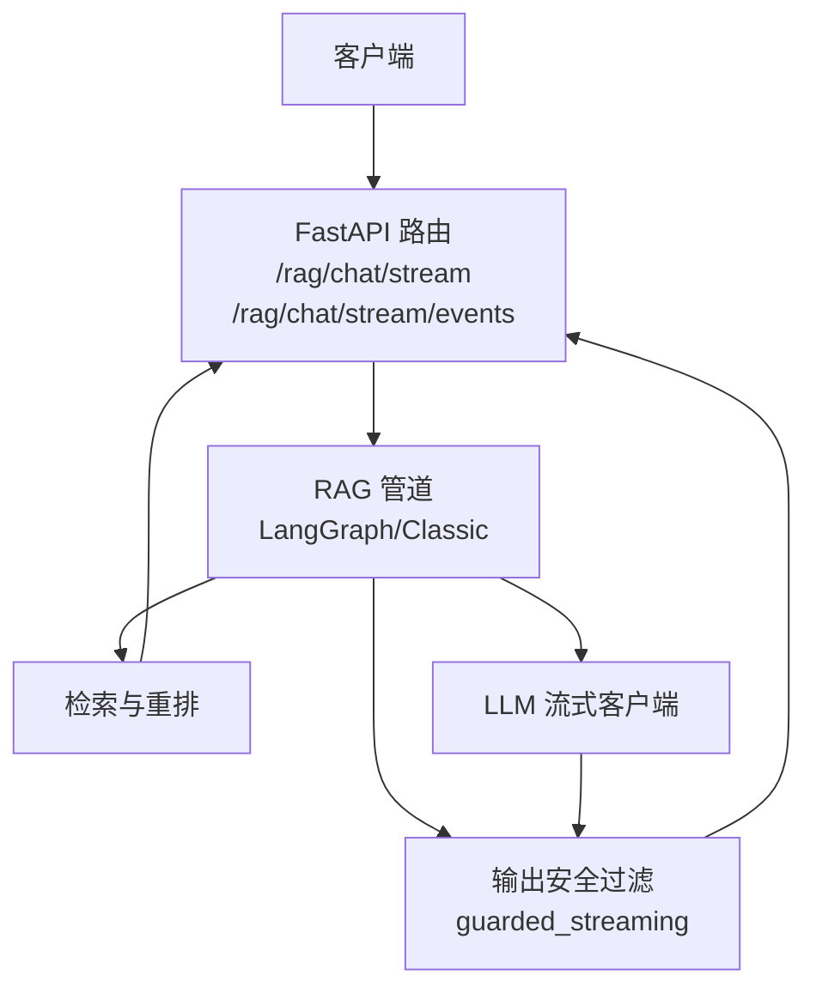
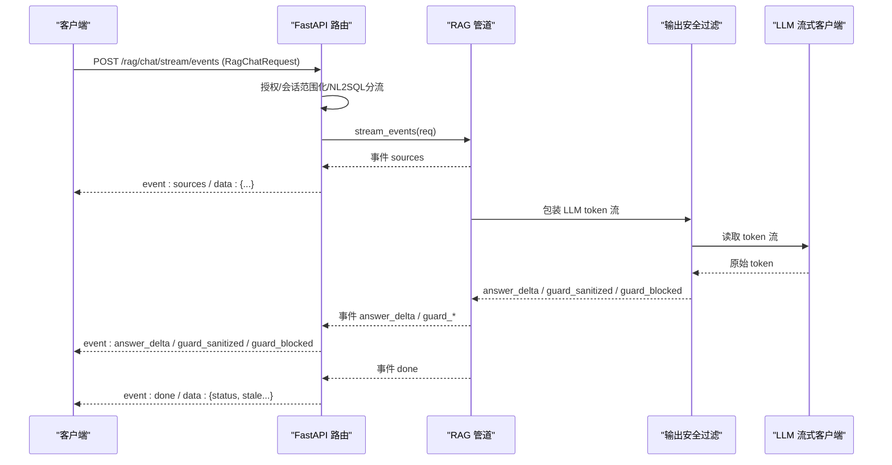
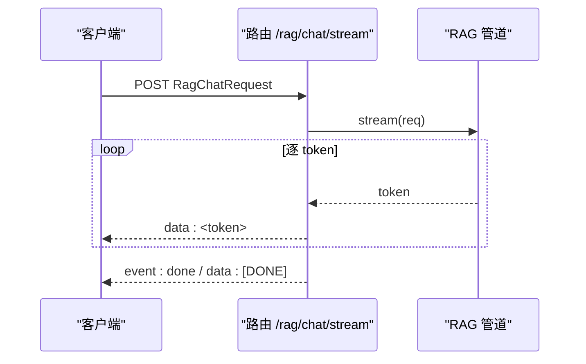
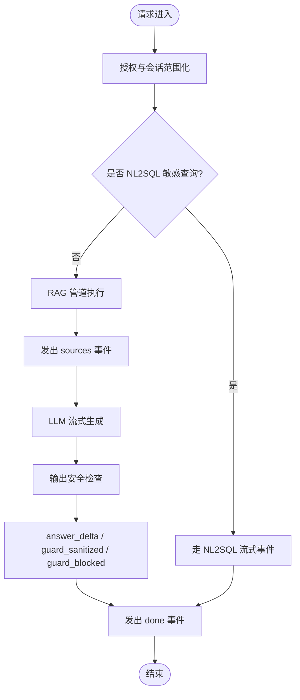
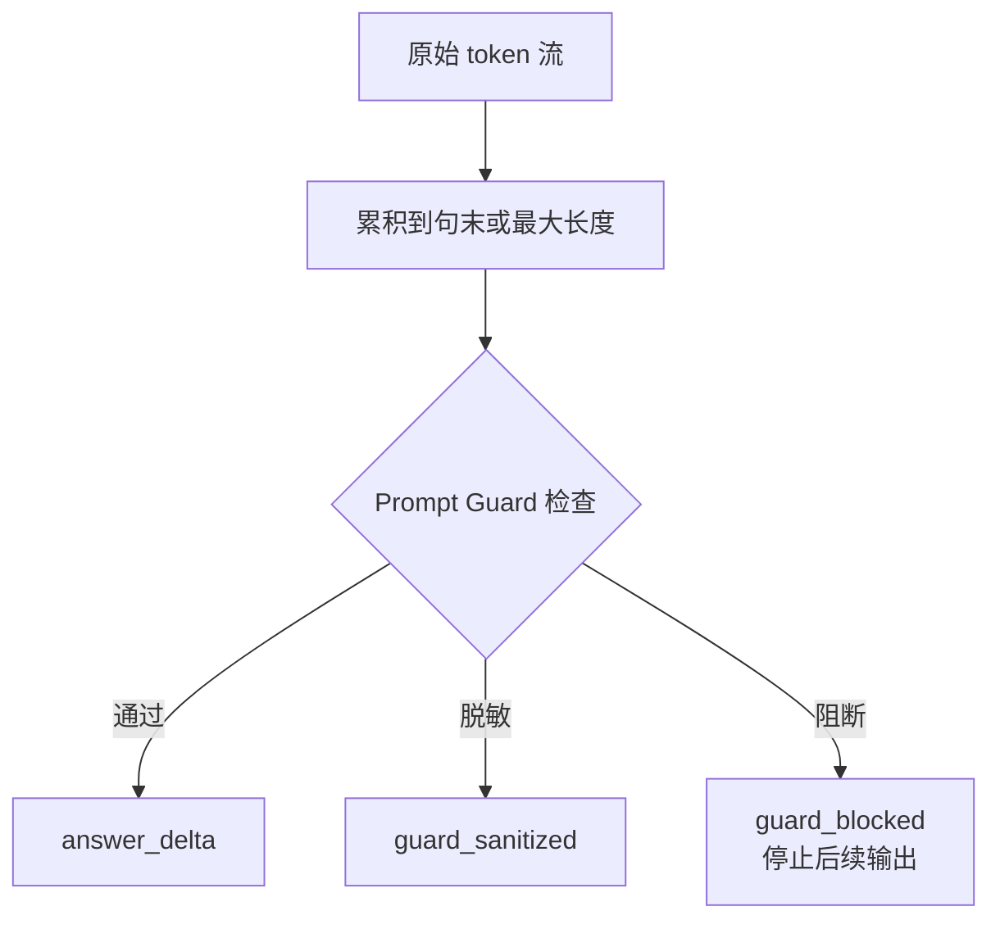
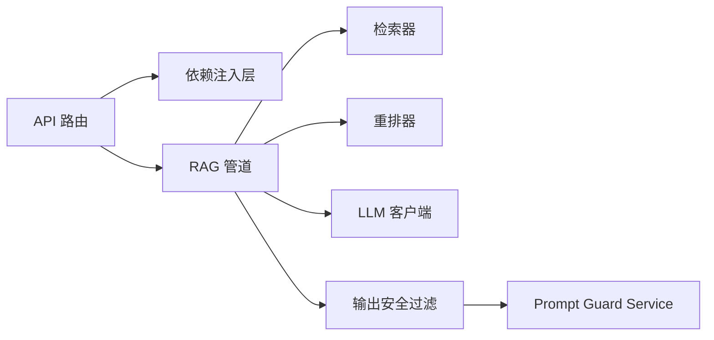
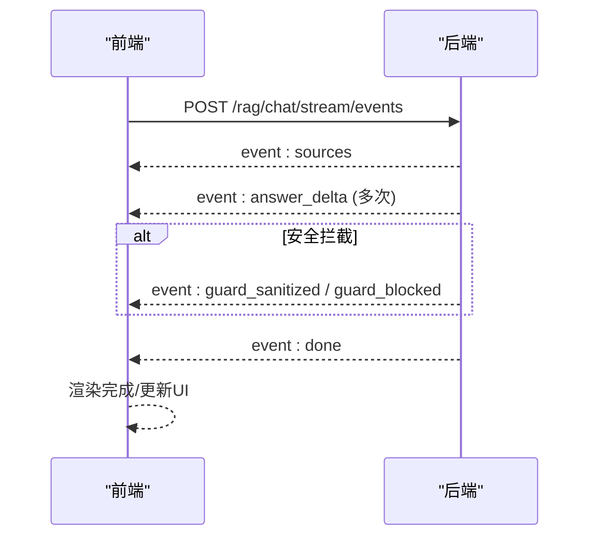

# 流式聊天接口

<cite>
**本文引用的文件**
- [rag_chat_routes.py](file://src/fast_app/api/rag_chat_routes.py)
- [stream_routes.py](file://src/fast_app/api/stream_routes.py)
- [rag_stream_models.py](file://src/fast_app/domain/rag_stream_models.py)
- [rag_chat_schema.py](file://src/fast_app/schemas/rag_chat_schema.py)
- [guarded_streaming.py](file://src/fast_app/services/rag/guarded_streaming.py)
- [langgraph_rag_pipeline_service.py](file://src/fast_app/services/rag/langgraph_rag_pipeline_service.py)
- [rag_pipeline_service.py](file://src/fast_app/services/rag/rag_pipeline_service.py)
</cite>

## 目录
1. [简介](#简介)
2. [项目结构](#项目结构)
3. [核心组件](#核心组件)
4. [架构总览](#架构总览)
5. [详细组件分析](#详细组件分析)
6. [依赖关系分析](#依赖关系分析)
7. [性能考虑](#性能考虑)
8. [故障排查指南](#故障排查指南)
9. [结论](#结论)
10. [附录：客户端集成示例与最佳实践](#附录客户端集成示例与最佳实践)

## 简介
本文件面向需要接入 RAG 流式聊天能力的客户端与服务端开发者，完整说明两个流式端点：
- 兼容旧版的 /rag/chat/stream（仅 token-only SSE）
- 新版的 /rag/chat/stream/events（结构化 SSE 事件）

重点解释结构化事件格式（sources、answer_delta、guard_sanitized、guard_blocked、done、error 等），阐述流式输出工作原理（异步生成器、事件序列化、错误处理），并提供客户端连接与解析示例、性能优化建议与最佳实践。

## 项目结构
RAG 流式聊天能力由 API 路由层、领域模型、服务编排层与安全过滤层共同组成：
- API 路由层：定义并暴露流式端点，负责请求授权、会话范围化、NL2SQL 分流、SSE 事件封装
- 领域模型：定义结构化事件类型与数据契约
- 服务编排层：实现检索、上下文构建、LLM 流式生成、事件序列
- 安全过滤层：对 LLM 输出进行句子级缓冲与 Prompt Guard 检查，产出安全事件

图表来源
- [rag_chat_routes.py:186-311](file://src/fast_app/api/rag_chat_routes.py#L186-L311)
- [langgraph_rag_pipeline_service.py:378-573](file://src/fast_app/services/rag/langgraph_rag_pipeline_service.py#L378-L573)
- [guarded_streaming.py:36-134](file://src/fast_app/services/rag/guarded_streaming.py#L36-L134)

章节来源
- [rag_chat_routes.py:186-311](file://src/fast_app/api/rag_chat_routes.py#L186-L311)
- [stream_routes.py:1-38](file://src/fast_app/api/stream_routes.py#L1-L38)

## 核心组件
- 结构化事件模型：统一的事件名枚举与事件载体，确保 API 层与管道层事件契约一致
- 流式路由：提供旧版 token-only SSE 与新版结构化 SSE 两种端点
- 管道流式事件：LangGraph/Classic 管道按阶段产生 sources 与 answer_delta 等事件
- 输出安全过滤：将原始 token 流转换为安全事件（answer_delta、guard_sanitized、guard_blocked），并在必要时阻断后续输出
- 请求范围化与权限：为每次请求注入用户上下文、知识库版本、检索权限范围

章节来源
- [rag_stream_models.py:1-46](file://src/fast_app/domain/rag_stream_models.py#L1-L46)
- [rag_chat_routes.py:186-311](file://src/fast_app/api/rag_chat_routes.py#L186-L311)
- [langgraph_rag_pipeline_service.py:378-573](file://src/fast_app/services/rag/langgraph_rag_pipeline_service.py#L378-L573)
- [guarded_streaming.py:36-134](file://src/fast_app/services/rag/guarded_streaming.py#L36-L134)

## 架构总览
下图展示从客户端到服务端再到下游服务的端到端调用链，以及结构化事件的流向。

图表来源
- [rag_chat_routes.py:218-311](file://src/fast_app/api/rag_chat_routes.py#L218-L311)
- [langgraph_rag_pipeline_service.py:378-573](file://src/fast_app/services/rag/langgraph_rag_pipeline_service.py#L378-L573)
- [guarded_streaming.py:36-134](file://src/fast_app/services/rag/guarded_streaming.py#L36-L134)

## 详细组件分析

### 端点一：兼容旧版 /rag/chat/stream
- 功能：返回 token-only 的 SSE 流，每个 token 以 data: xxx 形式推送，结束时发送 event: done / data: [DONE]
- 限制：不支持 NL2SQL 场景（会抛出专用异常）
- 适用：仅需逐 token 实时文本、无需结构化元数据的简单客户端

图表来源
- [rag_chat_routes.py:160-205](file://src/fast_app/api/rag_chat_routes.py#L160-L205)

章节来源
- [rag_chat_routes.py:160-205](file://src/fast_app/api/rag_chat_routes.py#L160-L205)

### 端点二：新版 /rag/chat/stream/events
- 功能：返回结构化 SSE 事件，包括 sources、answer_delta、guard_sanitized、guard_blocked、done、error 等
- 流程：
  - 路由层进行授权、会话范围化、NL2SQL 分流
  - 管道层执行检索、重排、上下文构建，并产生 sources 事件
  - 管道层通过安全过滤层包装 LLM 流，产出 answer_delta 与安全事件
  - 完成后发送 done 事件，包含知识版本与过期文档提示
- 优势：支持前端渲染引用来源、安全审计、可控截断与阻断

图表来源
- [rag_chat_routes.py:218-311](file://src/fast_app/api/rag_chat_routes.py#L218-L311)
- [langgraph_rag_pipeline_service.py:378-573](file://src/fast_app/services/rag/langgraph_rag_pipeline_service.py#L378-L573)
- [guarded_streaming.py:36-134](file://src/fast_app/services/rag/guarded_streaming.py#L36-L134)

章节来源
- [rag_chat_routes.py:218-311](file://src/fast_app/api/rag_chat_routes.py#L218-L311)
- [langgraph_rag_pipeline_service.py:378-573](file://src/fast_app/services/rag/langgraph_rag_pipeline_service.py#L378-L573)

### 结构化 SSE 事件格式
- 通用格式：event: <事件名>\ndata: <JSON 字符串>\n\n
- 事件类型与含义：
  - sources：检索结果列表，用于前端展示引用来源
  - answer_delta：安全的回答增量片段
  - guard_sanitized：片段被脱敏后仍可展示
  - guard_blocked：高风险片段被阻断，应停止后续输出
  - done：流结束，包含 knowledge_version、stale、stale_doc_ids
  - error：应用或内部错误信息
- 事件名常量：在领域模型中统一定义，避免硬编码

章节来源
- [rag_stream_models.py:1-46](file://src/fast_app/domain/rag_stream_models.py#L1-L46)
- [rag_chat_routes.py:208-274](file://src/fast_app/api/rag_chat_routes.py#L208-L274)

### 流式输出的工作原理
- 异步生成器：API 路由使用 AsyncGenerator 逐步产出 SSE 文本；管道层同样以异步生成器推进检索、上下文构建与 LLM 流
- 事件序列化：使用统一的格式化函数将事件名与数据转为 SSE 文本；Pydantic 对象需先转 dict 再序列化
- 错误处理：捕获应用异常与未知异常，分别输出 error 事件；NL2SQL 特殊路径也遵循相同模式
- 安全边界：所有 LLM 输出必须经过安全过滤，默认采用句子缓冲策略，达到句末或最大长度时进行检查；出现 guard_blocked 立即终止后续输出

章节来源
- [rag_chat_routes.py:160-274](file://src/fast_app/api/rag_chat_routes.py#L160-L274)
- [guarded_streaming.py:36-134](file://src/fast_app/services/rag/guarded_streaming.py#L36-L134)

### 安全过滤与事件分类
- 缓冲区策略：
  - buffer_then_emit：整段缓冲后再检查，首包延迟最高但最安全
  - pre_guard_only：先直接发送 token，结束后审计（不阻止已发出内容，仅用于兼容/观察）
  - sentence_buffer（默认）：到达句末或最大字符数时检查，兼顾实时性与安全性
- 事件分类：
  - answer_delta：安全片段，可直接展示
  - guard_sanitized：片段被脱敏，展示脱敏后的文本
  - guard_blocked：高风险，设置阻断标志并停止后续输出

图表来源
- [guarded_streaming.py:55-134](file://src/fast_app/services/rag/guarded_streaming.py#L55-L134)

章节来源
- [guarded_streaming.py:55-134](file://src/fast_app/services/rag/guarded_streaming.py#L55-L134)

### 管道层事件生产
- LangGraph 管道：
  - 路由判断：若直答则跳过检索，直接生成答案
  - 检索与重排：合并多路召回结果，构造上下文
  - 事件发射：先 emit sources，再经安全过滤发射 answer_delta 与安全事件
  - 完成标记：记录 token 计数与慢操作日志
- Classic 管道：
  - 提供 run 与 stream 方法，作为历史兼容入口
  - 当前主流事件由 LangGraph 管道与 guarded_streaming 组合产生

章节来源
- [langgraph_rag_pipeline_service.py:378-573](file://src/fast_app/services/rag/langgraph_rag_pipeline_service.py#L378-L573)
- [rag_pipeline_service.py:558-800](file://src/fast_app/services/rag/rag_pipeline_service.py#L558-L800)

## 依赖关系分析
- API 路由依赖：
  - 依赖注入：RAG 管道、数据库会话、NL2SQL 服务、用户上下文
  - 工具函数：SSE 事件格式化、错误响应构建
- 管道依赖：
  - 检索器：向量检索、关键词检索
  - 重排器：可选，失败时降级
  - LLM 客户端：流式生成
  - Prompt Guard：输入校验与输出安全检查
- 安全过滤依赖：
  - Prompt Guard Service：对 chunk 进行风险评估与脱敏/阻断决策

图表来源
- [rag_chat_routes.py:186-311](file://src/fast_app/api/rag_chat_routes.py#L186-L311)
- [langgraph_rag_pipeline_service.py:378-573](file://src/fast_app/services/rag/langgraph_rag_pipeline_service.py#L378-L573)
- [guarded_streaming.py:36-134](file://src/fast_app/services/rag/guarded_streaming.py#L36-L134)

章节来源
- [rag_chat_routes.py:186-311](file://src/fast_app/api/rag_chat_routes.py#L186-L311)
- [langgraph_rag_pipeline_service.py:378-573](file://src/fast_app/services/rag/langgraph_rag_pipeline_service.py#L378-L573)

## 性能考虑
- 首包延迟：buffer_then_emit 模式首包延迟较高；sentence_buffer 模式在实时性与安全性之间取得平衡
- 网络与序列化：SSE 事件较小且频繁，注意客户端批量渲染与节流，避免 UI 抖动
- 检索与重排：混合检索并发召回，重排失败时降级；合理设置 top_k、candidate_k、min_score
- 超时与重试：外部服务调用应有超时与重试策略，避免阻塞流式链路
- 日志与追踪：关键步骤记录耗时与指标，便于定位慢操作

[本节为通用指导，不直接分析具体文件]

## 故障排查指南
- 常见错误事件：
  - error：应用错误或内部异常，查看后端日志中的异常堆栈与请求上下文
  - guard_blocked：检测到高风险输出，检查 Prompt Guard 配置与风险类别
- 排查步骤：
  - 确认请求参数合法（query、mode、top_k、min_score）
  - 检查 NL2SQL 分支是否正确分流
  - 验证知识库版本与权限范围是否满足
  - 关注慢操作日志与 LangSmith 追踪
- 日志关键字：
  - rag.chat.request.start/finish
  - rag.stream.slow / rag.stream_events.slow
  - rag.rerank.fallback

章节来源
- [rag_chat_routes.py:105-156](file://src/fast_app/api/rag_chat_routes.py#L105-L156)
- [langgraph_rag_pipeline_service.py:378-573](file://src/fast_app/services/rag/langgraph_rag_pipeline_service.py#L378-L573)

## 结论
- 推荐使用 /rag/chat/stream/events 获取结构化 SSE 事件，以获得更好的可观测性、安全性与前端渲染能力
- 旧版 /rag/chat/stream 仅适用于简单 token-only 场景，不建议在新项目中继续使用
- 通过句子缓冲与 Prompt Guard 的安全过滤机制，可在保证安全的前提下提供低延迟的流式体验
- 客户端应正确处理 sources、answer_delta、guard_* 与 done/error 事件，实现稳健的实时交互

[本节为总结，不直接分析具体文件]

## 附录：客户端集成示例与最佳实践

### 连接与解析流程
- 建立 SSE 连接：POST 到 /rag/chat/stream/events，携带 RagChatRequest
- 解析事件：
  - sources：渲染引用来源卡片
  - answer_delta：追加显示回答片段
  - guard_sanitized：替换为脱敏文本继续显示
  - guard_blocked：停止追加并提示“内容被安全策略拦截”
  - done：关闭连接，更新状态（knowledge_version、stale）
  - error：展示错误信息并允许重试

图表来源
- [rag_chat_routes.py:218-311](file://src/fast_app/api/rag_chat_routes.py#L218-L311)
- [langgraph_rag_pipeline_service.py:378-573](file://src/fast_app/services/rag/langgraph_rag_pipeline_service.py#L378-L573)

### 最佳实践
- 事件顺序：始终等待 sources 后再渲染引用；answer_delta 增量追加
- 安全事件：遇到 guard_blocked 立即停止后续渲染，并提示用户
- 性能优化：
  - 前端节流渲染（如每 50ms 刷新一次）
  - 合理设置 top_k、min_score，减少不必要的数据传输
  - 使用 connection pooling 与 HTTP/2 提升 SSE 吞吐
- 容错与重试：
  - 网络中断后自动重连
  - 错误事件后提供重试按钮
  - 记录 request_id 与 trace_id 便于问题定位

[本节为通用指导，不直接分析具体文件]