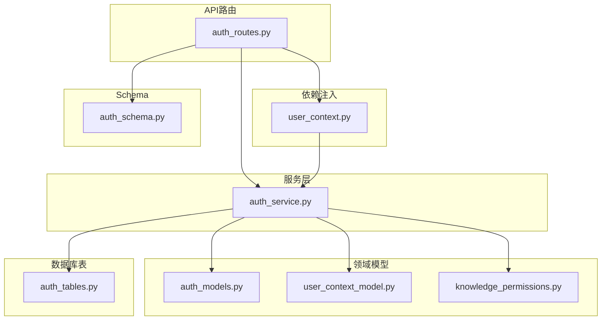
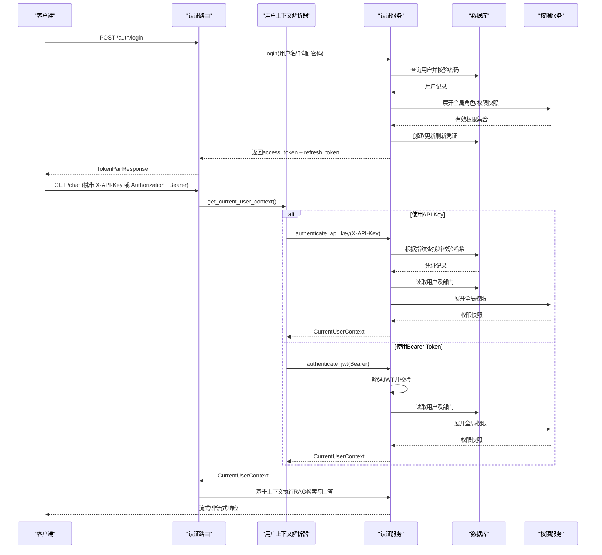
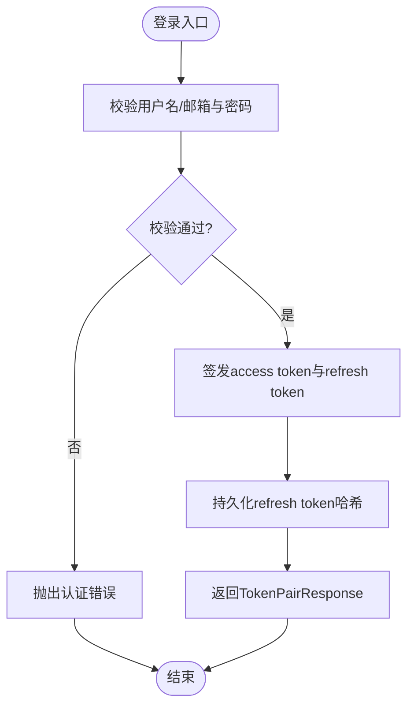
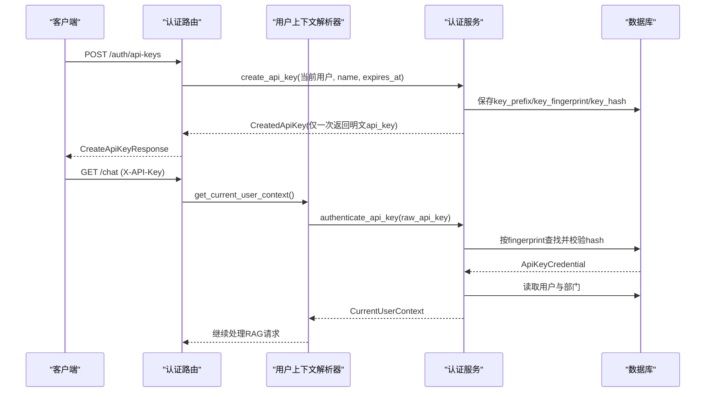
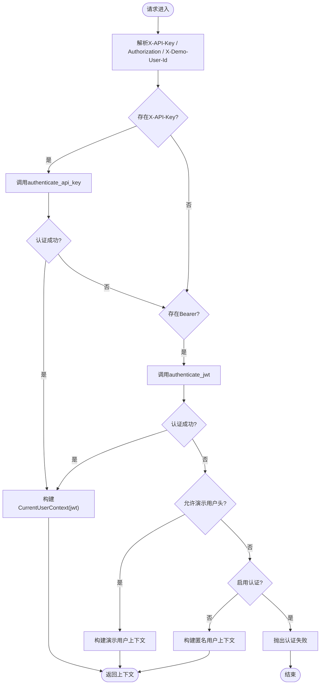
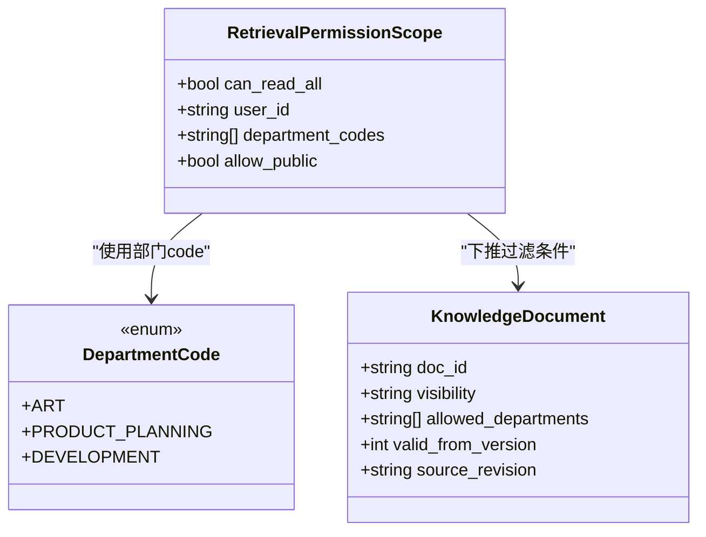
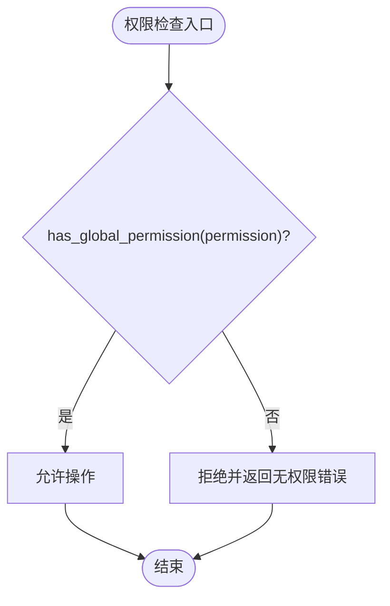
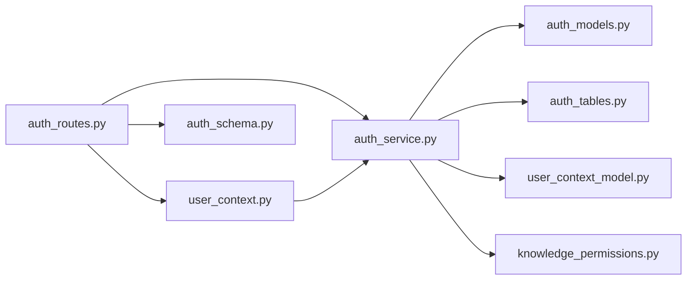

# 认证与权限控制

<cite>
**本文引用的文件**
- [auth_routes.py](file://src/fast_app/api/auth_routes.py)
- [user_context.py](file://src/fast_app/dependencies/user_context.py)
- [auth_models.py](file://src/fast_app/domain/auth_models.py)
- [knowledge_permissions.py](file://src/fast_app/domain/knowledge_permissions.py)
- [auth_tables.py](file://src/fast_app/db/auth_tables.py)
- [auth_service.py](file://src/fast_app/services/auth/auth_service.py)
- [auth_schema.py](file://src/fast_app/schemas/auth_schema.py)
- [user_context_model.py](file://src/fast_app/domain/user_context.py)
</cite>

## 目录
1. [简介](#简介)
2. [项目结构](#项目结构)
3. [核心组件](#核心组件)
4. [架构总览](#架构总览)
5. [详细组件分析](#详细组件分析)
6. [依赖关系分析](#依赖关系分析)
7. [性能与安全考量](#性能与安全考量)
8. [故障排查指南](#故障排查指南)
9. [结论](#结论)
10. [附录](#附录)

## 简介
本文件面向RAG聊天接口的认证与权限控制，系统性说明以下能力：
- JWT认证流程、API Key验证与用户上下文获取机制
- 知识库权限控制：部门级ACL、知识版本管理与文档访问控制
- 会话隔离：确保不同用户的数据隔离
- 权限检查实现细节与自定义权限策略扩展方法
- 安全最佳实践与常见问题解决方案

## 项目结构
认证与权限相关代码主要分布在以下模块：
- API路由层：提供登录、刷新令牌、当前用户信息、API Key管理等接口
- 依赖注入层：解析请求头并生成统一用户上下文
- 领域模型：用户、部门、角色、权限、凭证等数据模型
- 服务层：认证业务逻辑（JWT签发/校验、API Key校验、RBAC权限展开）
- 数据库表：用户、部门、角色、权限、API Key、Refresh Token等持久化结构
- Schema：请求/响应数据结构定义

图表来源
- [auth_routes.py:1-112](file://src/fast_app/api/auth_routes.py#L1-L112)
- [user_context.py:1-149](file://src/fast_app/dependencies/user_context.py#L1-L149)
- [auth_models.py:1-158](file://src/fast_app/domain/auth_models.py#L1-L158)
- [user_context_model.py:1-55](file://src/fast_app/domain/user_context.py#L1-L55)
- [knowledge_permissions.py:1-20](file://src/fast_app/domain/knowledge_permissions.py#L1-L20)
- [auth_service.py:1-327](file://src/fast_app/services/auth/auth_service.py#L1-L327)
- [auth_tables.py:1-431](file://src/fast_app/db/auth_tables.py#L1-L431)
- [auth_schema.py:1-123](file://src/fast_app/schemas/auth_schema.py#L1-L123)

章节来源
- [auth_routes.py:1-112](file://src/fast_app/api/auth_routes.py#L1-L112)
- [user_context.py:1-149](file://src/fast_app/dependencies/user_context.py#L1-L149)
- [auth_models.py:1-158](file://src/fast_app/domain/auth_models.py#L1-L158)
- [user_context_model.py:1-55](file://src/fast_app/domain/user_context.py#L1-L55)
- [knowledge_permissions.py:1-20](file://src/fast_app/domain/knowledge_permissions.py#L1-L20)
- [auth_service.py:1-327](file://src/fast_app/services/auth/auth_service.py#L1-L327)
- [auth_tables.py:1-431](file://src/fast_app/db/auth_tables.py#L1-L431)
- [auth_schema.py:1-123](file://src/fast_app/schemas/auth_schema.py#L1-L123)

## 核心组件
- 认证路由：提供登录、刷新令牌、查看当前用户、创建/列出/撤销API Key等能力
- 用户上下文解析器：从请求头提取X-API-Key或Authorization: Bearer，必要时支持演示用户头，最终产出CurrentUserContext
- 认证服务：封装JWT签发/校验、API Key校验、RBAC权限展开、用户状态校验、凭证生命周期管理
- 领域模型：AuthUser、ApiKeyCredential、RefreshTokenRecord、Department、Role、Permission、CurrentUserContext、RetrievalPermissionScope
- 数据库表：users、departments、user_departments、roles、permissions、role_permissions、user_roles、user_department_roles、api_keys、refresh_tokens
- Schema：登录/刷新请求、令牌对返回、当前用户响应、API Key创建/列表/撤销响应

章节来源
- [auth_routes.py:22-108](file://src/fast_app/api/auth_routes.py#L22-L108)
- [user_context.py:16-62](file://src/fast_app/dependencies/user_context.py#L16-L62)
- [auth_service.py:35-327](file://src/fast_app/services/auth/auth_service.py#L35-L327)
- [auth_models.py:9-158](file://src/fast_app/domain/auth_models.py#L9-L158)
- [user_context_model.py:9-55](file://src/fast_app/domain/user_context.py#L9-L55)
- [knowledge_permissions.py:4-19](file://src/fast_app/domain/knowledge_permissions.py#L4-L19)
- [auth_tables.py:13-431](file://src/fast_app/db/auth_tables.py#L13-L431)
- [auth_schema.py:8-123](file://src/fast_app/schemas/auth_schema.py#L8-L123)

## 架构总览
下图展示了从请求进入、身份解析、到权限下推的完整链路。

图表来源
- [auth_routes.py:22-108](file://src/fast_app/api/auth_routes.py#L22-L108)
- [user_context.py:16-62](file://src/fast_app/dependencies/user_context.py#L16-L62)
- [auth_service.py:75-170](file://src/fast_app/services/auth/auth_service.py#L75-L170)
- [auth_tables.py:13-431](file://src/fast_app/db/auth_tables.py#L13-L431)

## 详细组件分析

### JWT认证流程
- 登录：校验用户名/邮箱与密码，成功后签发短期access token与长期refresh token，并持久化refresh token的哈希
- 刷新：校验refresh token哈希，标记已使用并撤销旧凭证，签发新token对
- 鉴权：在后续请求中解析Authorization: Bearer，解码JWT得到用户ID与token ID，再加载用户与权限快照

图表来源
- [auth_routes.py:22-44](file://src/fast_app/api/auth_routes.py#L22-L44)
- [auth_service.py:75-112](file://src/fast_app/services/auth/auth_service.py#L75-L112)
- [auth_schema.py:8-41](file://src/fast_app/schemas/auth_schema.py#L8-L41)

章节来源
- [auth_routes.py:22-44](file://src/fast_app/api/auth_routes.py#L22-L44)
- [auth_service.py:75-112](file://src/fast_app/services/auth/auth_service.py#L75-L112)
- [auth_schema.py:8-41](file://src/fast_app/schemas/auth_schema.py#L8-L41)

### API Key验证流程
- 创建：仅认证用户可创建，服务端生成随机Key，保存前缀、指纹与哈希，明文仅在创建时返回一次
- 认证：优先从X-API-Key头解析，按指纹查库并校验哈希，检查状态与过期时间，加载用户与部门，展开全局权限
- 管理：列出当前用户的API Key摘要；撤销指定API Key

图表来源
- [auth_routes.py:56-108](file://src/fast_app/api/auth_routes.py#L56-L108)
- [user_context.py:16-62](file://src/fast_app/dependencies/user_context.py#L16-L62)
- [auth_service.py:114-151](file://src/fast_app/services/auth/auth_service.py#L114-L151)
- [auth_tables.py:322-369](file://src/fast_app/db/auth_tables.py#L322-L369)

章节来源
- [auth_routes.py:56-108](file://src/fast_app/api/auth_routes.py#L56-L108)
- [user_context.py:16-62](file://src/fast_app/dependencies/user_context.py#L16-L62)
- [auth_service.py:114-151](file://src/fast_app/services/auth/auth_service.py#L114-L151)
- [auth_tables.py:322-369](file://src/fast_app/db/auth_tables.py#L322-L369)

### 用户上下文获取机制
- 优先级：X-API-Key > Authorization: Bearer > 演示用户头（受配置开关控制）> 匿名
- 输出：统一的CurrentUserContext，包含用户ID、是否认证、认证来源、全局角色/权限快照、部门范围、主部门、邮箱、展示名、token_id或api_key_id
- 演示模式：用于本地多用户隔离测试，is_authenticated为False，不视为真实认证

图表来源
- [user_context.py:16-62](file://src/fast_app/dependencies/user_context.py#L16-L62)
- [auth_service.py:153-170](file://src/fast_app/services/auth/auth_service.py#L153-L170)
- [user_context_model.py:9-55](file://src/fast_app/domain/user_context.py#L9-L55)

章节来源
- [user_context.py:16-62](file://src/fast_app/dependencies/user_context.py#L16-L62)
- [auth_service.py:153-170](file://src/fast_app/services/auth/auth_service.py#L153-L170)
- [user_context_model.py:9-55](file://src/fast_app/domain/user_context.py#L9-L55)

### 知识库权限控制（部门级ACL、版本与文档访问）
- 部门级ACL：用户拥有department_codes集合，检索时将部门范围下推到查询条件，限制只能召回允许部门的文档
- 公共文档：allow_public默认开启，public可见性文档对所有具备读取权限的用户开放
- 私有文档：restricted或department可见性文档需匹配用户部门或特定用户白名单
- 版本管理：文档切片包含valid_from_version字段，结合source_revision进行版本控制，确保只召回有效版本的片段
- 权限范围对象：RetrievalPermissionScope由认证后上下文转换而来，不可从请求体直接构造，保证安全性

图表来源
- [knowledge_permissions.py:4-19](file://src/fast_app/domain/knowledge_permissions.py#L4-L19)
- [auth_models.py:27-39](file://src/fast_app/domain/auth_models.py#L27-L39)

章节来源
- [knowledge_permissions.py:4-19](file://src/fast_app/domain/knowledge_permissions.py#L4-L19)
- [auth_models.py:27-39](file://src/fast_app/domain/auth_models.py#L27-L39)

### 会话隔离机制
- 用户隔离：所有操作以CurrentUserContext.user_id为维度进行数据隔离，如对话、消息、检索结果均绑定用户ID
- 演示用户隔离：X-Demo-User-Id可用于本地测试的多用户隔离，但is_authenticated为False，不会获得真实权限
- 审计追踪：JWT认证附带token_id，API Key认证附带api_key_id，便于审计与问题定位

章节来源
- [user_context_model.py:9-55](file://src/fast_app/domain/user_context.py#L9-L55)
- [auth_service.py:236-267](file://src/fast_app/services/auth/auth_service.py#L236-L267)

### 权限检查与自定义策略
- 全局RBAC：CurrentUserContext包含global_role_codes与global_permission_codes快照，可在路由或服务层进行快速判断
- 便捷函数：require_permission(user, permission)用于检查当前用户是否具备指定全局权限
- 自定义策略：可通过扩展CurrentUserContext或新增中间件，将部门级ACL、资源属性（如doc.visibility、allowed_departments）与用户属性组合成ABAC规则，并在检索阶段下推为查询过滤器

图表来源
- [auth_service.py:314-323](file://src/fast_app/services/auth/auth_service.py#L314-L323)
- [user_context_model.py:43-51](file://src/fast_app/domain/user_context.py#L43-L51)

章节来源
- [auth_service.py:314-323](file://src/fast_app/services/auth/auth_service.py#L314-L323)
- [user_context_model.py:43-51](file://src/fast_app/domain/user_context.py#L43-L51)

## 依赖关系分析
认证与权限子系统的关键依赖如下：
- 路由依赖：认证路由依赖用户上下文解析器与认证服务
- 上下文解析依赖：解析请求头，调用认证服务完成JWT/API Key校验
- 认证服务依赖：用户仓库、权限服务、JWT服务、加密工具
- 数据模型依赖：AuthUser、ApiKeyCredential、RefreshTokenRecord、Department、Role、Permission、CurrentUserContext、RetrievalPermissionScope
- 数据库表依赖：users、departments、user_departments、roles、permissions、role_permissions、user_roles、user_department_roles、api_keys、refresh_tokens

图表来源
- [auth_routes.py:1-112](file://src/fast_app/api/auth_routes.py#L1-L112)
- [user_context.py:1-149](file://src/fast_app/dependencies/user_context.py#L1-L149)
- [auth_service.py:1-327](file://src/fast_app/services/auth/auth_service.py#L1-L327)
- [auth_models.py:1-158](file://src/fast_app/domain/auth_models.py#L1-L158)
- [auth_tables.py:1-431](file://src/fast_app/db/auth_tables.py#L1-L431)
- [user_context_model.py:1-55](file://src/fast_app/domain/user_context.py#L1-L55)
- [knowledge_permissions.py:1-20](file://src/fast_app/domain/knowledge_permissions.py#L1-L20)
- [auth_schema.py:1-123](file://src/fast_app/schemas/auth_schema.py#L1-L123)

章节来源
- [auth_routes.py:1-112](file://src/fast_app/api/auth_routes.py#L1-L112)
- [user_context.py:1-149](file://src/fast_app/dependencies/user_context.py#L1-L149)
- [auth_service.py:1-327](file://src/fast_app/services/auth/auth_service.py#L1-L327)
- [auth_models.py:1-158](file://src/fast_app/domain/auth_models.py#L1-L158)
- [auth_tables.py:1-431](file://src/fast_app/db/auth_tables.py#L1-L431)
- [user_context_model.py:1-55](file://src/fast_app/domain/user_context.py#L1-L55)
- [knowledge_permissions.py:1-20](file://src/fast_app/domain/knowledge_permissions.py#L1-L20)
- [auth_schema.py:1-123](file://src/fast_app/schemas/auth_schema.py#L1-L123)

## 性能与安全考量
- 性能
  - 认证路径尽量短：优先API Key认证，避免每次请求都进行复杂计算
  - 权限快照：在认证阶段一次性展开全局角色与权限，减少后续重复查询
  - 检索下推：将部门级ACL与文档可见性下推到查询层，减少内存过滤开销
- 安全
  - 密钥安全：API Key与Refresh Token仅保存哈希与指纹，不在数据库中存储明文
  - 最小权限：默认不允许读取全部知识库，必须显式授权
  - 状态校验：严格校验用户状态与凭证状态，禁用账号或过期凭证一律拒绝
  - 审计：记录token_id与api_key_id，便于追踪与回溯

[本节为通用指导，无需具体文件引用]

## 故障排查指南
- 常见错误
  - 认证失败：未提供有效的X-API-Key或Authorization: Bearer，或配置禁止演示用户头
  - 凭证无效：API Key不存在、哈希不匹配、状态为revoked或已过期
  - Refresh token无效：token不存在、已过期、已被撤销或对应用户不存在
  - 无权限：当前用户不具备所需的全局权限或部门范围不匹配
- 排查步骤
  - 确认请求头是否正确：X-API-Key或Authorization: Bearer格式
  - 检查用户状态与凭证状态：active/revoked、expires_at是否过期
  - 查看权限快照：global_role_codes与global_permission_codes是否包含所需权限
  - 核对部门范围：department_codes是否与文档allowed_departments匹配
  - 审计日志：利用token_id或api_key_id定位具体请求与凭证

章节来源
- [user_context.py:16-62](file://src/fast_app/dependencies/user_context.py#L16-L62)
- [auth_service.py:75-170](file://src/fast_app/services/auth/auth_service.py#L75-L170)
- [auth_service.py:300-323](file://src/fast_app/services/auth/auth_service.py#L300-L323)

## 结论
本系统通过统一的认证与权限框架，实现了JWT与API Key双通道认证、RBAC全局权限快照、部门级ACL检索下推以及严格的凭证生命周期管理。借助CurrentUserContext与RetrievalPermissionScope，RAG检索能够在认证阶段即确定权限边界，从而保障不同用户的数据隔离与知识库访问安全。建议在生产环境中关闭演示用户头、严格管理API Key与Refresh Token、持续完善权限策略与审计能力。

[本节为总结，无需具体文件引用]

## 附录
- 关键接口
  - 登录：POST /auth/login
  - 刷新：POST /auth/refresh
  - 当前用户：GET /auth/me
  - 创建API Key：POST /auth/api-keys
  - 列出API Key：GET /auth/api-keys
  - 撤销API Key：DELETE /auth/api-keys/{api_key_id}
- 关键模型
  - CurrentUserContext：统一用户上下文
  - RetrievalPermissionScope：检索权限范围
  - AuthUser、ApiKeyCredential、RefreshTokenRecord：认证与凭证模型
  - Department、Role、Permission：组织与权限模型

章节来源
- [auth_routes.py:22-108](file://src/fast_app/api/auth_routes.py#L22-L108)
- [auth_schema.py:8-123](file://src/fast_app/schemas/auth_schema.py#L8-L123)
- [user_context_model.py:9-55](file://src/fast_app/domain/user_context.py#L9-L55)
- [knowledge_permissions.py:4-19](file://src/fast_app/domain/knowledge_permissions.py#L4-L19)
- [auth_models.py:9-158](file://src/fast_app/domain/auth_models.py#L9-L158)