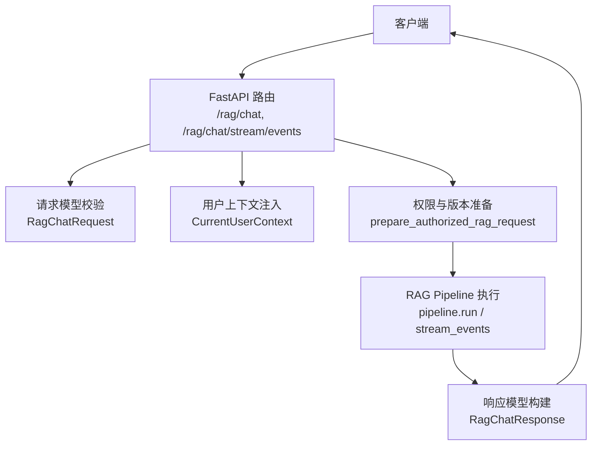
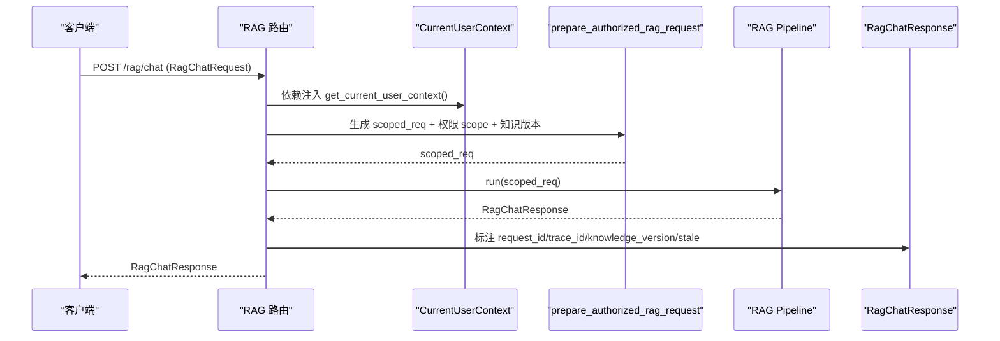
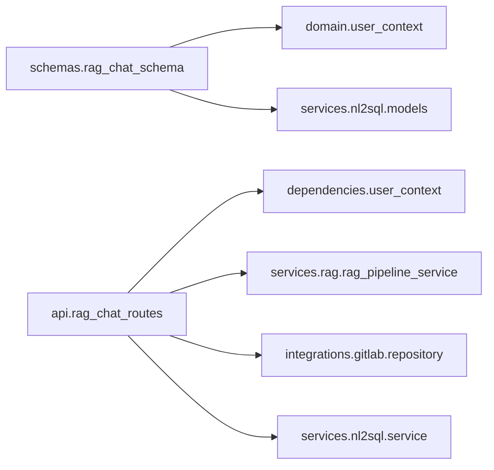

# 请求响应模型

<cite>
**本文引用的文件**
- [rag_chat_schema.py](file://src/fast_app/schemas/rag_chat_schema.py)
- [user_context.py](file://src/fast_app/domain/user_context.py)
- [rag_chat_routes.py](file://src/fast_app/api/rag_chat_routes.py)
- [user_context_dependency.py](file://src/fast_app/dependencies/user_context.py)
- [test_rag_chat_api.py](file://scripts/tests/rag_memory/test_rag_chat_api.py)
- [test_nl2sql_api_contract.py](file://scripts/tests/nl2sql/test_nl2sql_api_contract.py)
</cite>

## 目录
1. [简介](#简介)
2. [项目结构](#项目结构)
3. [核心组件](#核心组件)
4. [架构总览](#架构总览)
5. [详细组件分析](#详细组件分析)
6. [依赖关系分析](#依赖关系分析)
7. [性能与配置建议](#性能与配置建议)
8. [故障排查指南](#故障排查指南)
9. [结论](#结论)
10. [附录：使用示例与常见配置模式](#附录使用示例与常见配置模式)

## 简介
本文件面向 RAG 聊天接口的请求与响应数据模型，系统性说明 RagChatRequest、RagChatResponse 的字段定义、验证规则、默认值与作用约束；解释用户上下文 CurrentUserContext 在请求处理中的角色；并提供完整的使用示例与常见配置模式，帮助开发者正确构造请求并理解返回结果。

## 项目结构
RAG 聊天接口相关的数据模型集中在 schemas 层，路由与处理逻辑位于 api 层，用户上下文定义在 domain 层，认证与上下文注入在 dependencies 层，测试用例在 scripts/tests 中提供端到端调用示例。

图表来源
- [rag_chat_routes.py:47-156](file://src/fast_app/api/rag_chat_routes.py#L47-L156)
- [rag_chat_routes.py:277-311](file://src/fast_app/api/rag_chat_routes.py#L277-L311)
- [rag_chat_routes.py:336-358](file://src/fast_app/api/rag_chat_routes.py#L336-L358)
- [rag_chat_schema.py:17-134](file://src/fast_app/schemas/rag_chat_schema.py#L17-L134)
- [rag_chat_schema.py:189-265](file://src/fast_app/schemas/rag_chat_schema.py#L189-L265)

章节来源
- [rag_chat_schema.py:1-268](file://src/fast_app/schemas/rag_chat_schema.py#L1-L268)
- [rag_chat_routes.py:1-373](file://src/fast_app/api/rag_chat_routes.py#L1-L373)
- [user_context.py:1-55](file://src/fast_app/domain/user_context.py#L1-L55)
- [user_context_dependency.py:1-149](file://src/fast_app/dependencies/user_context.py#L1-L149)

## 核心组件
- RagChatRequest：客户端请求体，包含检索参数、过滤条件、NL2SQL 意图等，并通过 Pydantic 进行严格校验。
- RagChatResponse：服务端响应体，包含答案、来源、路由信息、任务计划、NL2SQL 结果等。
- CurrentUserContext：当前请求的用户上下文，承载认证来源、全局角色与权限快照、部门范围等，用于权限控制与审计。

章节来源
- [rag_chat_schema.py:17-134](file://src/fast_app/schemas/rag_chat_schema.py#L17-L134)
- [rag_chat_schema.py:189-265](file://src/fast_app/schemas/rag_chat_schema.py#L189-L265)
- [user_context.py:9-55](file://src/fast_app/domain/user_context.py#L9-L55)

## 架构总览
下图展示了从请求进入路由到响应返回的关键流程，包括用户上下文注入、NL2SQL 授权、知识库版本检查、Pipeline 执行与响应标注。

图表来源
- [rag_chat_routes.py:47-156](file://src/fast_app/api/rag_chat_routes.py#L47-L156)
- [rag_chat_routes.py:336-358](file://src/fast_app/api/rag_chat_routes.py#L336-L358)
- [rag_chat_routes.py:361-373](file://src/fast_app/api/rag_chat_routes.py#L361-L373)
- [user_context_dependency.py:16-62](file://src/fast_app/dependencies/user_context.py#L16-L62)

## 详细组件分析

### RagChatRequest 模型
- 基本约束
  - 禁止额外字段：通过配置拒绝未声明字段，避免客户端伪造内部字段。
  - 私有属性：用于在服务端内部传递用户 ID、用户上下文、外部 session_id、检索权限范围、知识版本、NL2SQL 授权等，不暴露给客户端。
- 关键字段
  - session_id：多轮对话会话标识，为空时按单轮处理；支持空值与非空值的空白字符清洗与校验。
  - query：用户问题，必填，长度限制，且会进行空白字符规范化；空或仅空白将触发校验失败。
  - mode：检索模式，枚举 vector / keyword / hybrid，默认 hybrid。
  - top_k：最多返回文档数量，整数，范围 1-20，默认 5。
  - min_score：最低文档分数阈值，浮点，范围 0.0-1.0，默认 0.0。
  - candidate_k：每个召回源先取候选数，可选；若未提供则回退为 top_k；范围 1-50。
  - filters：metadata 过滤条件，包含 source_path（字符串）与 section_path（字符串列表），用于限定检索范围。
  - allow_web_fallback：复杂研究本地证据不足时是否允许将公开问题发送给 WebSearch，默认 False。
  - allow_direct_web：是否允许用户明确要求的公开 Web 查询，默认 True。
  - min_knowledge_version：可选的最低正式知识版本；当服务端版本低于该值时，入口会提前返回错误，避免检索旧数据。
  - dataset_id：可选的 NL2SQL Dataset ID，存在时必须显式提供 nl2sql_action。
  - nl2sql_action：Dataset 请求动作，query 表示直接查询，report 表示进入受控文档报告链路。
- 自定义验证
  - query 字段：strip 后不能为空，否则抛出校验错误。
  - session_id 字段：非空时需 strip 后不为空白。
  - 模型级验证：dataset_id 与 nl2sql_action 必须成对出现；缺少任一都会触发校验错误。

章节来源
- [rag_chat_schema.py:17-134](file://src/fast_app/schemas/rag_chat_schema.py#L17-L134)

### RagChatResponse 模型
- 追踪与版本
  - request_id：本次请求的唯一标识，便于日志对齐。
  - trace_id：本次请求的追踪标识，当前阶段默认与 request_id 相同。
  - knowledge_version：本次请求全程冻结使用的正式知识版本。
  - stale：响应完成时其引用文档是否已有更高正式版本。
  - stale_doc_ids：响应生成期间发生正式更新且与 sources 相交的文档 ID 列表。
- 回答与来源
  - query：实际用于回答或检索的问题，可能经过多轮改写。
  - answer：RAG/Agent 生成的最终回答文本。
  - sources：本次回答引用或检索到的来源列表；无检索时为空列表。
- 路由与澄清
  - clarification_required：Router 是否需要用户补充任务意图。
  - clarification_code：澄清原因，如 ambiguous_intent / router_low_confidence / router_unavailable。
  - clarification_question：需要用户回答的澄清问题。
  - route_intent：结构化 Router 选择的业务意图。
  - route_confidence：结构化 Router 的置信度，范围 0.0-1.0。
  - route_source：路由结论来源，rule / model / fallback。
- 任务计划
  - agent_task_plan_id：当 Agent 生成多步骤任务计划时返回的 plan 标识。
  - agent_task_status：多步骤任务计划状态；普通 RAG 请求为空。
  - agent_task_plan：Agent 多步骤任务计划摘要；普通 RAG 请求为空。
  - task_confirmation_required：TaskPlan 是否等待人工确认后继续执行。
  - task_confirm_endpoint：TaskPlan 确认执行接口；无需确认时为空。
- NL2SQL 结果
  - nl2sql_result：结构化数据 query 的完整结果；普通 RAG 或报告任务为空。

章节来源
- [rag_chat_schema.py:189-265](file://src/fast_app/schemas/rag_chat_schema.py#L189-L265)

### CurrentUserContext 的作用
- 作用概述
  - 由依赖注入层解析认证头（API Key、Bearer Token、Demo Header）生成可信用户上下文。
  - 携带 user_id、is_authenticated、auth_source、全局角色与权限快照、部门范围等，供 RAG Agent 工具权限链路与知识库 ACL 读取。
  - 在路由中作为依赖注入参数传入，参与 prepare_authorized_rag_request 构建检索权限范围与知识版本检查。
- 关键行为
  - 认证优先级：API Key > JWT > Demo Header（受配置开关控制）。
  - 匿名/演示用户：当认证关闭或允许 demo header 时，可构造匿名用户或演示用户上下文。
  - 方法：提供 has_global_role 与 has_global_permission 便捷判断。

章节来源
- [user_context.py:9-55](file://src/fast_app/domain/user_context.py#L9-L55)
- [user_context_dependency.py:16-62](file://src/fast_app/dependencies/user_context.py#L16-L62)
- [rag_chat_routes.py:47-54](file://src/fast_app/api/rag_chat_routes.py#L47-L54)
- [rag_chat_routes.py:336-358](file://src/fast_app/api/rag_chat_routes.py#L336-L358)

### 数据处理流程与关键节点
- 入口校验与授权
  - 若请求包含 dataset_id，则先进行 NL2SQL 授权；敏感数据集的 query 动作会走专用路径并直接返回结构化结果。
- 权限与版本准备
  - 生成 scoped 请求，绑定 _current_user_context、_nl2sql_authorization、_retrieval_permission_scope。
  - 获取活跃知识版本，若客户端要求的最小版本高于当前版本，则提前返回错误。
- Pipeline 执行与响应标注
  - 调用 pipeline.run 或 stream_events 执行检索与生成。
  - 为响应填充 request_id、trace_id、knowledge_version，并计算 stale 与 stale_doc_ids。

章节来源
- [rag_chat_routes.py:56-83](file://src/fast_app/api/rag_chat_routes.py#L56-L83)
- [rag_chat_routes.py:84-156](file://src/fast_app/api/rag_chat_routes.py#L84-L156)
- [rag_chat_routes.py:336-373](file://src/fast_app/api/rag_chat_routes.py#L336-L373)

## 依赖关系分析
- 模块耦合
  - rag_chat_schema.py 依赖 domain.user_context 与 services.nl2sql.models，以支持用户上下文与 NL2SQL 结果类型。
  - rag_chat_routes.py 依赖 dependencies.user_context 注入用户上下文，依赖 services.rag.rag_pipeline_service 执行检索与生成，依赖 services.nl2sql.service 进行数据集授权与查询。
- 外部集成点
  - GitLabRepository：用于获取活跃知识版本与变更文档集合，支撑 stale 检测。
  - AuthService：用于 API Key/JWT 认证。
  - Milvus/Elasticsearch/Reranker：通过 Pipeline 实现向量、关键词与重排检索。

图表来源
- [rag_chat_schema.py:1-7](file://src/fast_app/schemas/rag_chat_schema.py#L1-L7)
- [rag_chat_routes.py:1-35](file://src/fast_app/api/rag_chat_routes.py#L1-L35)

章节来源
- [rag_chat_schema.py:1-268](file://src/fast_app/schemas/rag_chat_schema.py#L1-L268)
- [rag_chat_routes.py:1-373](file://src/fast_app/api/rag_chat_routes.py#L1-L373)

## 性能与配置建议
- 检索参数调优
  - top_k：控制最终返回文档数量，建议根据下游 LLM 上下文窗口与成本权衡设置。
  - candidate_k：在混合检索或多源召回场景下，适当增大候选集有助于提升融合效果，但会增加后续排序与重排开销。
  - min_score：提高阈值可减少低质量来源，但可能导致无结果；需结合业务容忍度调整。
- 模式选择
  - vector：适合语义匹配，适合长文本与概念性问题。
  - keyword：适合精确匹配与术语检索。
  - hybrid：推荐默认，兼顾语义与关键词召回。
- 安全与权限
  - 通过 CurrentUserContext 的 department_codes 与 global_permission_codes 控制知识库检索范围，避免越权访问。
  - 使用 min_knowledge_version 确保检索最新稳定版本，降低因知识更新导致的回答不一致风险。
- 流式输出
  - 推荐使用结构化 SSE 接口 /rag/chat/stream/events，可获得 sources、token、done 等事件，便于前端增量渲染与调试。

[本节为通用指导，不直接分析具体文件]

## 故障排查指南
- 常见校验错误
  - query 为空或仅空白：检查客户端是否正确传入并清理空白字符。
  - dataset_id 与 nl2sql_action 不匹配：确保两者同时提供或同时为空。
  - session_id 仅空白：检查客户端是否正确清理并传值。
- 权限与版本错误
  - 知识库版本未就绪：当 min_knowledge_version 高于当前活跃版本时，会返回错误；等待版本发布后重试。
  - 认证失败：确保提供有效的 X-API-Key 或 Authorization: Bearer Token；或在开发环境启用 demo header。
- 无搜索结果
  - 提高 candidate_k 或降低 min_score；检查 filters 是否过严；确认知识库已正确入库。
- 流式异常
  - 关注 error 事件内容；区分应用错误与内部错误；必要时开启 debug trace 定位。

章节来源
- [rag_chat_schema.py:106-134](file://src/fast_app/schemas/rag_chat_schema.py#L106-L134)
- [rag_chat_routes.py:56-83](file://src/fast_app/api/rag_chat_routes.py#L56-L83)
- [rag_chat_routes.py:336-358](file://src/fast_app/api/rag_chat_routes.py#L336-L358)
- [user_context_dependency.py:16-62](file://src/fast_app/dependencies/user_context.py#L16-L62)

## 结论
RagChatRequest 与 RagChatResponse 构成了 RAG 聊天接口的核心契约，前者负责严格的输入校验与意图表达，后者承载完整的回答、来源、路由与任务信息。CurrentUserContext 贯穿认证、权限与审计环节，保障数据安全与可追溯性。通过合理配置检索参数与模式，并结合流式接口与调试能力，可实现高效、可控的 RAG 问答体验。

[本节为总结，不直接分析具体文件]

## 附录：使用示例与常见配置模式

### 典型请求示例
- 基础混合检索
  - 请求体包含 query、mode=hybrid、top_k、min_score；filters 可按需指定 source_path 与 section_path。
  - 参考测试脚本的请求构造方式，见测试文件中 build_payload 与 scenario payload 的组装逻辑。
- 带 NL2SQL 的结构化查询
  - 提供 dataset_id 与 nl2sql_action=query；服务端会进行授权并直接返回结构化结果，route_intent 标记为 structured_data_query。
  - 参考 NL2SQL API 合同测试中对请求与响应的断言。

章节来源
- [test_rag_chat_api.py:94-128](file://scripts/tests/rag_memory/test_rag_chat_api.py#L94-L128)
- [test_nl2sql_api_contract.py:88-108](file://scripts/tests/nl2sql/test_nl2sql_api_contract.py#L88-L108)

### 常见配置模式
- 高召回优先
  - mode=hybrid，candidate_k 略大于 top_k，min_score 较低，确保召回充分；后续由重排与 LLM 筛选。
- 精准匹配优先
  - mode=keyword 或 vector，min_score 较高，filters 限定 source_path/section_path，减少噪声。
- 安全与版本控制
  - 设置 min_knowledge_version 保证检索最新稳定版本；通过 CurrentUserContext 的部门与权限控制检索范围。
- 流式交互
  - 使用 /rag/chat/stream/events，监听 sources、token、done 事件，实现实时渲染与进度反馈。

章节来源
- [test_rag_chat_api.py:475-631](file://scripts/tests/rag_memory/test_rag_chat_api.py#L475-L631)
- [rag_chat_routes.py:277-311](file://src/fast_app/api/rag_chat_routes.py#L277-L311)