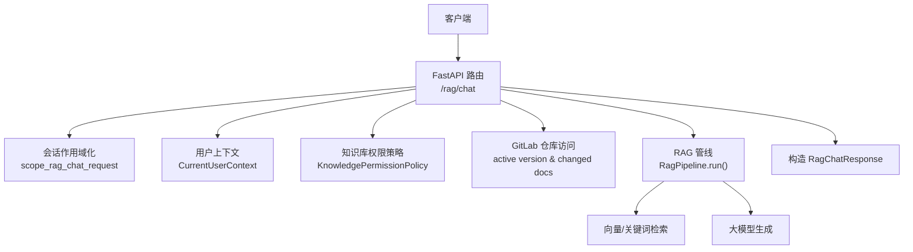
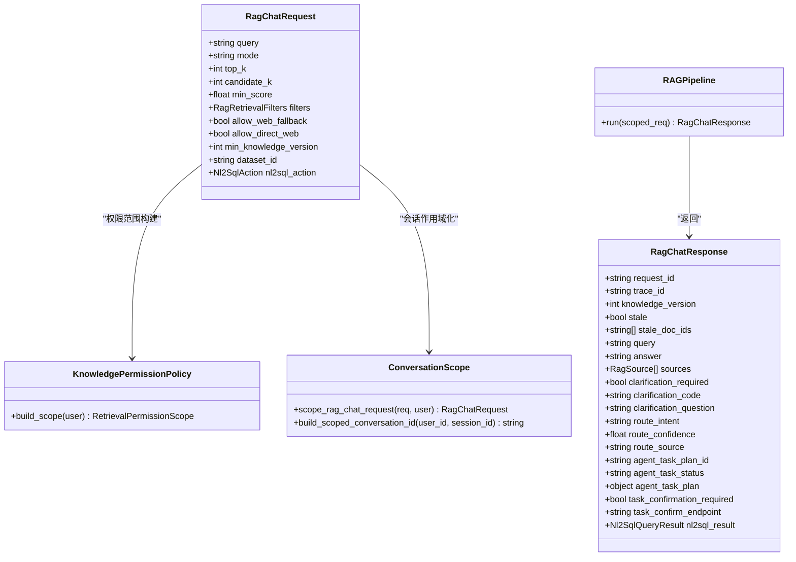

# 非流式聊天接口

<cite>
**本文引用的文件**
- [rag_chat_routes.py](file://src/fast_app/api/rag_chat_routes.py)
- [rag_chat_schema.py](file://src/fast_app/schemas/rag_chat_schema.py)
- [rag_dependencies.py](file://src/fast_app/dependencies/rag_dependencies.py)
- [conversation_scope.py](file://src/fast_app/services/conversation/conversation_scope.py)
- [knowledge_permission_policy.py](file://src/fast_app/services/knowledge/knowledge_permission_policy.py)
- [user_context.py](file://src/fast_app/domain/user_context.py)
</cite>

## 目录
1. [简介](#简介)
2. [项目结构](#项目结构)
3. [核心组件](#核心组件)
4. [架构总览](#架构总览)
5. [详细组件分析](#详细组件分析)
6. [依赖关系分析](#依赖关系分析)
7. [性能考虑](#性能考虑)
8. [故障排查指南](#故障排查指南)
9. [结论](#结论)
10. [附录：调用示例](#附录调用示例)

## 简介
本文件面向后端开发者与集成方，系统化说明 RAG 非流式聊天接口 POST /rag/chat 的完整实现。重点覆盖：
- 请求参数校验、NL2SQL 路由判断、权限检查与知识库版本控制
- RagChatRequest 与 RagChatResponse 字段语义
- 典型调用场景：简单问答、多轮对话、带知识库过滤查询
- 错误处理机制与性能优化建议

## 项目结构
该接口位于 FastAPI 路由层，结合 Pydantic 模型进行入参出参校验，通过依赖注入装配检索管线、会话作用域、权限策略与 NL2SQL 服务，最终由 RAG Pipeline 执行并返回结构化响应。



图示来源
- [rag_chat_routes.py:47-156](file://src/fast_app/api/rag_chat_routes.py#L47-L156)
- [rag_dependencies.py:463-549](file://src/fast_app/dependencies/rag_dependencies.py#L463-L549)
- [conversation_scope.py:30-50](file://src/fast_app/services/conversation/conversation_scope.py#L30-L50)
- [knowledge_permission_policy.py:20-41](file://src/fast_app/services/knowledge/knowledge_permission_policy.py#L20-L41)

章节来源
- [rag_chat_routes.py:47-156](file://src/fast_app/api/rag_chat_routes.py#L47-L156)
- [rag_chat_schema.py:17-134](file://src/fast_app/schemas/rag_chat_schema.py#L17-L134)
- [rag_dependencies.py:463-549](file://src/fast_app/dependencies/rag_dependencies.py#L463-L549)

## 核心组件
- 路由端点：POST /rag/chat，负责请求校验、NL2SQL 分流、权限与版本控制、调用 RAG 管线并返回结果。
- 请求模型：RagChatRequest，定义 query、mode、top_k、candidate_k、min_score、filters、会话、NL2SQL 等字段及校验规则。
- 响应模型：RagChatResponse，包含 answer、sources、route_intent、nl2sql_result、知识版本与过期文档标记等。
- 会话作用域：将外部 session_id 映射为按用户隔离的内部会话 ID，避免跨用户冲突。
- 权限策略：基于 CurrentUserContext 构建检索权限范围，限制可检索的知识范围。
- 依赖注入：装配 LLM、检索器、重排器、PromptGuard、Parent Context 扩展、Agent 任务执行器等。

章节来源
- [rag_chat_routes.py:47-156](file://src/fast_app/api/rag_chat_routes.py#L47-L156)
- [rag_chat_schema.py:17-134](file://src/fast_app/schemas/rag_chat_schema.py#L17-L134)
- [rag_chat_schema.py:189-265](file://src/fast_app/schemas/rag_chat_schema.py#L189-L265)
- [conversation_scope.py:30-50](file://src/fast_app/services/conversation/conversation_scope.py#L30-L50)
- [knowledge_permission_policy.py:20-41](file://src/fast_app/services/knowledge/knowledge_permission_policy.py#L20-L41)
- [rag_dependencies.py:463-549](file://src/fast_app/dependencies/rag_dependencies.py#L463-L549)

## 架构总览
下图展示一次 /rag/chat 请求从进入路由到返回响应的关键步骤，包括 NL2SQL 分流、会话作用域化、权限与版本控制、以及 RAG 管线执行。

```mermaid
sequenceDiagram
participant C as "客户端"
participant R as "路由 /rag/chat"
participant S as "会话作用域"
participant P as "权限策略"
participant G as "GitLab 仓库"
participant N as "NL2SQL 服务"
participant H as "RAG 管线"
C->>R : POST /rag/chat {RagChatRequest}
alt 携带 dataset_id
R->>N : authorize_action(user, dataset_id, nl2sql_action)
N-->>R : 授权结果/数据集信息
opt 敏感数据集且 action=query
R->>N : query(user, dataset_id, question)
N-->>R : Nl2SqlQueryResult
R-->>C : RagChatResponse(route_intent=structured_data_query, nl2sql_result)
else 非敏感或报告链路
R->>S : scope_rag_chat_request(req, user)
R->>P : build_scope(user)
R->>G : get_active_version()
R->>H : run(scoped_req)
H-->>R : RagChatResponse
R-->>C : RagChatResponse
end
else 无 dataset_id
R->>S : scope_rag_chat_request(req, user)
R->>P : build_scope(user)
R->>G : get_active_version()
R->>H : run(scoped_req)
H-->>R : RagChatResponse
R-->>C : RagChatResponse
end
```

图示来源
- [rag_chat_routes.py:47-156](file://src/fast_app/api/rag_chat_routes.py#L47-L156)
- [rag_chat_routes.py:336-358](file://src/fast_app/api/rag_chat_routes.py#L336-L358)
- [rag_chat_routes.py:361-373](file://src/fast_app/api/rag_chat_routes.py#L361-L373)
- [conversation_scope.py:30-50](file://src/fast_app/services/conversation/conversation_scope.py#L30-L50)
- [knowledge_permission_policy.py:20-41](file://src/fast_app/services/knowledge/knowledge_permission_policy.py#L20-L41)

## 详细组件分析

### 路由端点 POST /rag/chat
- 职责
  - 解析并校验 RagChatRequest
  - 若携带 dataset_id，则先执行 NL2SQL 授权；当满足“敏感数据集 + query 动作”时直接走 NL2SQL 查询并返回结构化数据
  - 否则进入 RAG 主链路：会话作用域化、权限范围构建、活跃知识版本检查、调用 RAG 管线
  - 在响应中附加 request_id、trace_id、knowledge_version、stale/stale_doc_ids
- 关键点
  - NL2SQL 分流优先于普通 RAG，避免误入检索链路
  - 使用 GitLabRepository 获取 active version，并在 min_knowledge_version 不满足时拒绝请求
  - 统一日志埋点（开始、失败、完成），便于追踪与性能分析

章节来源
- [rag_chat_routes.py:47-156](file://src/fast_app/api/rag_chat_routes.py#L47-L156)
- [rag_chat_routes.py:336-358](file://src/fast_app/api/rag_chat_routes.py#L336-L358)
- [rag_chat_routes.py:361-373](file://src/fast_app/api/rag_chat_routes.py#L361-L373)

### 请求模型 RagChatRequest
- 关键字段与作用
  - query：用户问题，必填，长度与空白字符校验
  - mode：检索模式 vector/keyword/hybrid，默认 hybrid
  - top_k：最多返回文档数量，范围 1-20
  - candidate_k：候选召回数，为空时使用 top_k
  - min_score：最低分数阈值，范围 0.0-1.0
  - filters：metadata 过滤条件，支持 source_path、section_path
  - allow_web_fallback / allow_direct_web：是否允许公开 Web 搜索回退或直接查询
  - min_knowledge_version：可选的最低正式知识版本；低于当前活跃版本时返回错误
  - dataset_id / nl2sql_action：NL2SQL 相关；二者需成对出现，action 可为 query 或 report
- 校验规则
  - extra="forbid"：禁止未声明字段
  - field_validator：query/session_id 空白清洗与合法性校验
  - model_validator：dataset_id 与 nl2sql_action 绑定校验

章节来源
- [rag_chat_schema.py:17-134](file://src/fast_app/schemas/rag_chat_schema.py#L17-L134)

### 响应模型 RagChatResponse
- 关键字段与含义
  - request_id / trace_id：用于日志对齐与链路追踪
  - knowledge_version：本次请求全程冻结使用的正式知识版本
  - stale / stale_doc_ids：响应完成时引用文档是否已更新，以及相交的文档 ID
  - query：实际用于回答或检索的问题（可能经改写）
  - answer：最终回答文本
  - sources：本次回答引用或检索到的来源列表
  - clarification_required / clarification_code / clarification_question：是否需要澄清意图
  - route_intent / route_confidence / route_source：结构化 Router 选择的业务意图、置信度与来源
  - agent_task_plan_id / agent_task_status / agent_task_plan / task_confirmation_required / task_confirm_endpoint：Agent 多步任务计划相关字段
  - nl2sql_result：结构化数据查询的完整结果（普通 RAG 为空）

章节来源
- [rag_chat_schema.py:189-265](file://src/fast_app/schemas/rag_chat_schema.py#L189-L265)

### 会话作用域与多轮对话
- 作用
  - 将外部 session_id 与 user_id 组合生成内部 scoped conversation_id，避免跨用户冲突
  - 下游 memory/summary/persistence 均使用该 scoped id，保证多轮对话隔离
- 行为
  - 若未提供 session_id，则按单轮请求处理
  - 对外仍只暴露原始 session_id，内部使用稳定哈希拼接

章节来源
- [conversation_scope.py:11-27](file://src/fast_app/services/conversation/conversation_scope.py#L11-L27)
- [conversation_scope.py:30-50](file://src/fast_app/services/conversation/conversation_scope.py#L30-L50)

### 权限检查与知识库版本控制
- 权限策略
  - 基于 CurrentUserContext 构建 RetrievalPermissionScope，区分系统管理员/全局权限与部门级可见性
  - 将权限范围注入检索链路，确保仅检索用户有权访问的知识
- 版本控制
  - 入口读取活跃知识版本，若客户端指定 min_knowledge_version 高于当前版本，直接拒绝
  - 响应中记录 knowledge_version，并计算 stale/stale_doc_ids，提示引用文档是否已更新

章节来源
- [knowledge_permission_policy.py:20-41](file://src/fast_app/services/knowledge/knowledge_permission_policy.py#L20-L41)
- [rag_chat_routes.py:336-358](file://src/fast_app/api/rag_chat_routes.py#L336-L358)
- [rag_chat_routes.py:361-373](file://src/fast_app/api/rag_chat_routes.py#L361-L373)
- [user_context.py:9-51](file://src/fast_app/domain/user_context.py#L9-L51)

### NL2SQL 路由判断
- 触发条件
  - 请求携带 dataset_id 且提供 nl2sql_action
  - 授权通过后，若 action 为 query 且数据集隐私级别为 sensitive，则直接进入 NL2SQL 查询
- 返回结构
  - route_intent 固定为 structured_data_query
  - nl2sql_result 携带 SQL 生成与查询结果摘要
- 兼容性
  - 旧版 SSE 流式接口不支持 NL2SQL，会抛出专用异常

章节来源
- [rag_chat_routes.py:56-83](file://src/fast_app/api/rag_chat_routes.py#L56-L83)
- [rag_chat_routes.py:186-205](file://src/fast_app/api/rag_chat_routes.py#L186-L205)

### 依赖注入与管线装配
- 管线选择
  - 根据配置选择 classic/langgraph/rag_agent 三种 RAG 管线实现
  - 注入检索器（向量/关键词）、LLM、重排器、PromptGuard、Parent Context 扩展、Agent 任务执行器等
- 数据库与会话
  - 每次请求打开 AsyncSession，异常时自动回滚
  - 会话记忆存储支持内存或 Redis

章节来源
- [rag_dependencies.py:463-549](file://src/fast_app/dependencies/rag_dependencies.py#L463-L549)
- [rag_dependencies.py:196-216](file://src/fast_app/dependencies/rag_dependencies.py#L196-L216)

## 依赖关系分析


图示来源
- [rag_chat_schema.py:17-134](file://src/fast_app/schemas/rag_chat_schema.py#L17-L134)
- [rag_chat_schema.py:189-265](file://src/fast_app/schemas/rag_chat_schema.py#L189-L265)
- [knowledge_permission_policy.py:20-41](file://src/fast_app/services/knowledge/knowledge_permission_policy.py#L20-L41)
- [conversation_scope.py:30-50](file://src/fast_app/services/conversation/conversation_scope.py#L30-L50)
- [rag_dependencies.py:463-549](file://src/fast_app/dependencies/rag_dependencies.py#L463-L549)

## 性能考虑
- 检索参数调优
  - top_k 控制最终上下文规模，过大增加 LLM 成本与延迟；过小可能遗漏关键信息
  - candidate_k 可在融合前扩大候选集，配合 rerank 提升质量但增加开销
  - min_score 过滤低分片段，减少噪声
- 检索模式选择
  - vector：适合语义匹配；keyword：适合精确匹配；hybrid：综合两者
- 重排器开关
  - 开启 reranker 可提升排序质量，但引入额外网络与计算开销
- 会话与记忆
  - 多轮对话建议使用 Redis 记忆存储以支持横向扩展
- 版本控制
  - 合理设置 min_knowledge_version，避免读到过期数据；关注 stale_doc_ids 提示
- 日志与追踪
  - 利用 request_id/trace_id 与耗时统计定位瓶颈

[本节为通用指导，无需特定文件来源]

## 故障排查指南
- 常见错误
  - 参数校验失败：如 query 为空、session_id 仅空白、dataset_id 与 nl2sql_action 不匹配
  - 权限不足：无法检索受限知识
  - 版本不满足：min_knowledge_version 高于当前活跃版本
  - NL2SQL 兼容：旧版 SSE 接口不支持 NL2SQL
- 排查步骤
  - 检查请求体字段是否符合 RagChatRequest 约束
  - 确认用户上下文与权限范围是否正确注入
  - 查看日志中的事件：rag.chat.request.start/failed/finish
  - 关注 stale_doc_ids，必要时重试或提示前端刷新
- 错误来源参考
  - 应用服务异常与内部异常封装
  - NL2SQL 专用异常类型

章节来源
- [rag_chat_schema.py:106-134](file://src/fast_app/schemas/rag_chat_schema.py#L106-L134)
- [rag_chat_routes.py:105-126](file://src/fast_app/api/rag_chat_routes.py#L105-L126)
- [rag_chat_routes.py:186-205](file://src/fast_app/api/rag_chat_routes.py#L186-L205)

## 结论
POST /rag/chat 提供了统一的非流式 RAG 问答入口，具备：
- 严格的请求校验与意图分流（含 NL2SQL）
- 细粒度的权限控制与知识版本一致性保障
- 丰富的响应元数据，便于前端展示与后续处理
建议在生产环境中结合缓存、限流、降级策略与监控告警，持续优化端到端延迟与稳定性。

[本节为总结性内容，无需特定文件来源]

## 附录：调用示例
以下为三类典型调用场景的请求体结构与预期响应要点（以 JSON 形式示意）。请根据实际部署替换鉴权头与域名。

- 简单问答
  - 请求体
    - query：必填，例如“什么是 RAG？”
    - mode：可选，默认 hybrid
    - top_k：可选，默认 5
    - min_score：可选，默认 0.0
  - 响应要点
    - answer：自然语言回答
    - sources：命中文档片段列表
    - route_intent：可能为空或普通 RAG 意图
    - nl2sql_result：空

- 多轮对话
  - 请求体
    - session_id：首次由客户端生成，后续复用
    - query：当前轮次问题
  - 响应要点
    - 同上；下游会使用 scoped conversation_id 维护上下文

- 带知识库过滤的查询
  - 请求体
    - filters.source_path：限定文档路径
    - filters.section_path：限定章节路径
    - min_knowledge_version：可选，要求不低于某版本
  - 响应要点
    - knowledge_version：本次使用的知识版本
    - stale/stale_doc_ids：若引用文档已更新，提示前端刷新

注意：
- 若携带 dataset_id，必须同时提供 nl2sql_action；当为敏感数据集且 action=query 时，将直接返回结构化数据查询结果，而非普通 RAG 答案。
- 所有字段遵循 RagChatRequest/RagChatResponse 的约束，服务端会拒绝未声明字段。

章节来源
- [rag_chat_schema.py:17-134](file://src/fast_app/schemas/rag_chat_schema.py#L17-L134)
- [rag_chat_schema.py:189-265](file://src/fast_app/schemas/rag_chat_schema.py#L189-L265)
- [rag_chat_routes.py:56-83](file://src/fast_app/api/rag_chat_routes.py#L56-L83)