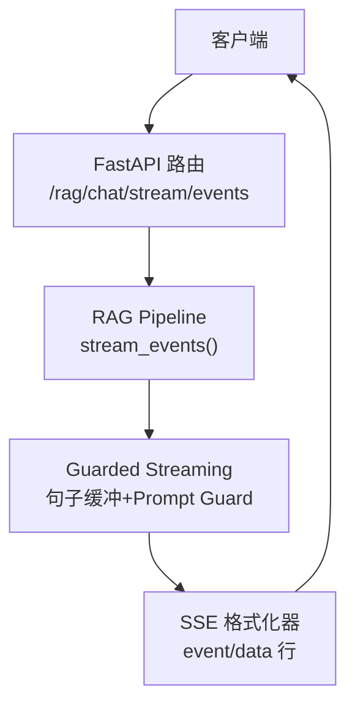
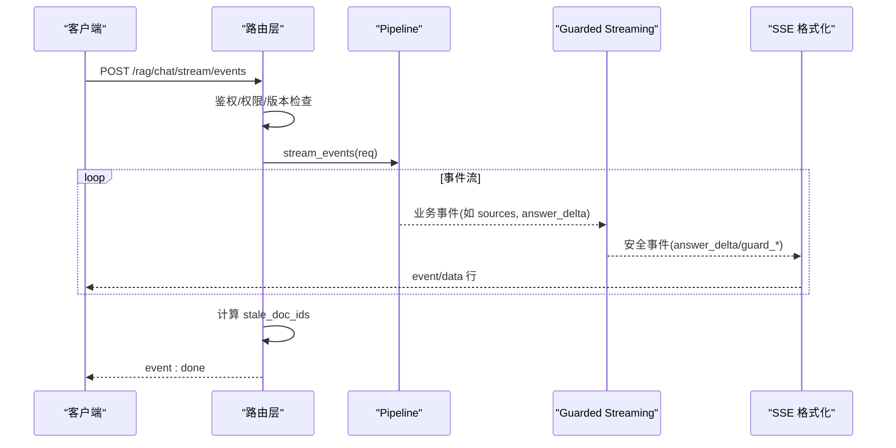
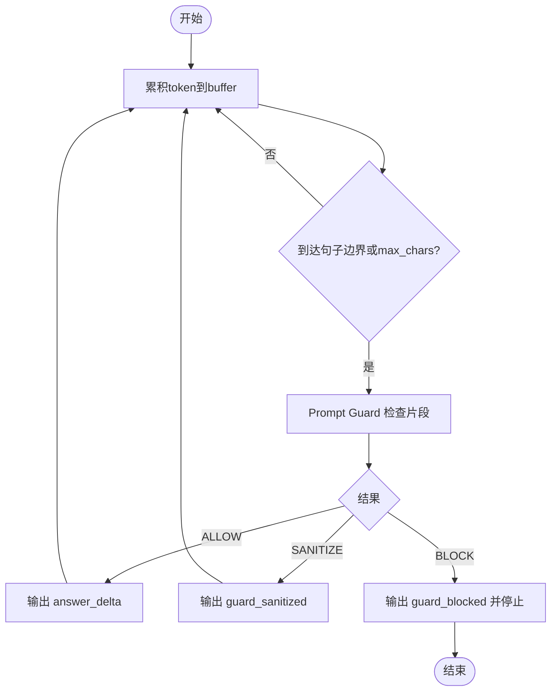
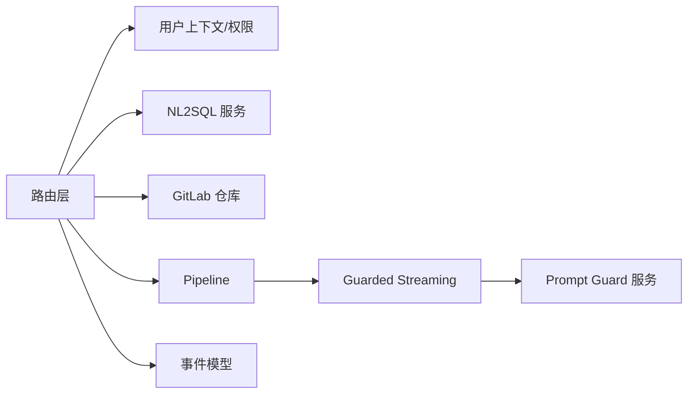

# 流式接口

<cite>
**本文引用的文件**
- [rag_chat_routes.py](file://src/fast_app/api/rag_chat_routes.py)
- [guarded_streaming.py](file://src/fast_app/services/rag/guarded_streaming.py)
- [rag_stream_models.py](file://src/fast_app/domain/rag_stream_models.py)
- [prompt_guard_service.py](file://src/fast_app/services/rag/prompt_guard_service.py)
- [test_rag_chat_api.py](file://scripts/tests/rag_memory/test_rag_chat_api.py)
- [20-3-接口文档整理.md](file://learning-docs/phase-20/20-3-接口文档整理.md)
</cite>

## 目录
1. [简介](#简介)
2. [项目结构](#项目结构)
3. [核心组件](#核心组件)
4. [架构总览](#架构总览)
5. [详细组件分析](#详细组件分析)
6. [依赖关系分析](#依赖关系分析)
7. [性能考量](#性能考量)
8. [故障排查指南](#故障排查指南)
9. [结论](#结论)
10. [附录](#附录)

## 简介
本文件面向需要接入 `/rag/chat/stream/events` 的客户端开发者，系统性说明该 SSE（Server-Sent Events）端点的连接建立、事件类型与数据格式、SSE 生命周期、错误处理与连接关闭策略；并解释 Guarded Streaming 的安全机制与性能优化策略。同时提供客户端实现建议，包括错误重试与断线重连。

## 项目结构
与 `/rag/chat/stream/events` 相关的代码主要分布在以下模块：
- API 路由层：负责接收请求、权限校验、会话隔离、知识库版本控制、结构化事件生成与 SSE 输出。
- 安全流控层：对 LLM 输出的 token 流进行句子级缓冲与安全检测，产出安全的事件。
- 领域模型：定义结构化事件名称与数据结构。
- 测试与示例：展示客户端如何消费 SSE 事件、解析 event/data 行、处理 error/done 等。

图表来源
- [rag_chat_routes.py:277-311](file://src/fast_app/api/rag_chat_routes.py#L277-L311)
- [guarded_streaming.py:36-133](file://src/fast_app/services/rag/guarded_streaming.py#L36-L133)
- [rag_stream_models.py:5-35](file://src/fast_app/domain/rag_stream_models.py#L5-L35)

章节来源
- [rag_chat_routes.py:277-311](file://src/fast_app/api/rag_chat_routes.py#L277-L311)
- [20-3-接口文档整理.md:257-290](file://learning-docs/phase-20/20-3-接口文档整理.md#L257-L290)

## 核心组件
- 结构化 SSE 生成器：将 Pipeline 产出的业务事件转换为 SSE 文本流，并在结束时追加 done 事件；异常时输出 error 事件。
- Guarded Streaming：对原始 token 流进行句子级缓冲，按最大字符阈值或句子边界触发 Prompt Guard 检查，产出 answer_delta、guard_sanitized、guard_blocked 等事件。
- 事件模型：统一的事件名与数据结构，便于前后端契约稳定。
- Prompt Guard 服务：对用户输入和输出进行规则/LLM/混合模式检测，支持审计、脱敏、阻断。

章节来源
- [rag_chat_routes.py:217-274](file://src/fast_app/api/rag_chat_routes.py#L217-L274)
- [guarded_streaming.py:36-133](file://src/fast_app/services/rag/guarded_streaming.py#L36-L133)
- [rag_stream_models.py:5-46](file://src/fast_app/domain/rag_stream_models.py#L5-L46)
- [prompt_guard_service.py:193-214](file://src/fast_app/services/rag/prompt_guard_service.py#L193-L214)

## 架构总览
SSE 端点的工作流程如下：
- 客户端 POST 到 /rag/chat/stream/events，携带 RagChatRequest。
- 路由层进行用户上下文注入、NL2SQL 授权判断、知识库版本检查与权限 scope 构建。
- 调用 Pipeline.stream_events(req) 获取结构化事件流。
- 对 sources 事件收集 doc_id，用于后续 stale 检测。
- 通过 format_sse_event 将每个事件序列化为 SSE 文本。
- 结束后计算知识版本变更，输出 done 事件。
- 异常路径统一输出 error 事件。

图表来源
- [rag_chat_routes.py:277-311](file://src/fast_app/api/rag_chat_routes.py#L277-L311)
- [rag_chat_routes.py:217-274](file://src/fast_app/api/rag_chat_routes.py#L217-L274)
- [guarded_streaming.py:36-133](file://src/fast_app/services/rag/guarded_streaming.py#L36-L133)

## 详细组件分析

### 端点与生命周期
- 连接建立：POST /rag/chat/stream/events，返回 HTTP 200 与 text/event-stream。
- 消息推送：持续推送 sources、answer_delta、guard_sanitized、guard_blocked 等事件。
- 结束：推送 done 事件，包含 status、knowledge_version、stale、stale_doc_ids。
- 错误：在 AppServiceError 或未知异常路径中推送 error 事件，包含应用错误或内部错误信息。
- 连接关闭：服务端完成所有事件后关闭流；客户端应据此释放资源。

章节来源
- [rag_chat_routes.py:277-311](file://src/fast_app/api/rag_chat_routes.py#L277-L311)
- [rag_chat_routes.py:217-274](file://src/fast_app/api/rag_chat_routes.py#L217-L274)

### 事件类型与数据格式
- sources：检索来源列表，data.sources 为源对象集合，包含 doc_id 等字段。
- answer_delta：安全回答增量片段，data.text 为允许展示的文本片段。
- guard_sanitized：已脱敏的安全片段，data 包含 text、answer、action、risk_level、categories、reason。
- guard_blocked：高风险片段被阻断，data 同上，且后续输出应停止。
- token：兼容旧事件名，新主线使用 answer_delta。
- done：流结束，data.status="done"，并附带 knowledge_version、stale、stale_doc_ids。
- error：错误事件，data 包含错误码、消息、错误分类、request_id、trace_id 等。
- 其他 Agent/NL2SQL 相关事件：如 agent_task_*、nl2sql_sql_generated、nl2sql_result 等，由上游事件驱动。

章节来源
- [rag_stream_models.py:5-46](file://src/fast_app/domain/rag_stream_models.py#L5-L46)
- [rag_chat_routes.py:217-274](file://src/fast_app/api/rag_chat_routes.py#L217-L274)
- [20-3-接口文档整理.md:257-290](file://learning-docs/phase-20/20-3-接口文档整理.md#L257-L290)

### Guarded Streaming 安全机制
- 三种模式：
  - buffer_then_emit：先完整缓冲再一次性安全检查，首包延迟最高但最安全。
  - pre_guard_only：先发送原始 token，结束后审计，仅适合兼容或观察。
  - sentence_buffer（默认）：按句子边界或最大字符阈值分片检查，平衡体验与安全。
- 输出安全边界：
  - 通过 Prompt Guard 对每个片段进行检查，产出 allow/sanitize/block。
  - 若 block，设置 blocked=true，停止后续输出，避免高风险扩散。
  - 累计 state.answer 为最终可持久化的安全回答。
- 句子边界与缓冲区：
  - 当缓冲区达到 max_chars 或最后一个 token 以句号/换行等结尾时触发检查。
  - 尾部未达边界的文本也会在流结束时再次检查。

图表来源
- [guarded_streaming.py:55-133](file://src/fast_app/services/rag/guarded_streaming.py#L55-L133)
- [guarded_streaming.py:136-145](file://src/fast_app/services/rag/guarded_streaming.py#L136-L145)
- [guarded_streaming.py:148-190](file://src/fast_app/services/rag/guarded_streaming.py#L148-L190)

章节来源
- [guarded_streaming.py:36-133](file://src/fast_app/services/rag/guarded_streaming.py#L36-L133)
- [prompt_guard_service.py:369-385](file://src/fast_app/services/rag/prompt_guard_service.py#L369-L385)

### 客户端 SSE 连接实现建议
- 连接建立：
  - 使用 HTTP POST 到 /rag/chat/stream/events，Content-Type: application/json。
  - 读取响应体为流，逐行解析 event/data 行。
- 事件处理：
  - 遇到 sources 事件：记录来源，可用于前端展示引用。
  - 遇到 answer_delta/guard_sanitized：拼接显示文本。
  - 遇到 guard_blocked：提示风险并停止渲染。
  - 遇到 error：终止渲染并提示错误。
  - 遇到 done：结束处理，释放资源。
- 错误重试与断线重连：
  - 网络错误：指数退避重试，限制最大重试次数。
  - 服务端中断：检测到流关闭但未收到 done 时，尝试重连并恢复上下文（如 session_id）。
  - 超时保护：设置合理超时，避免长时间挂起。
- 参考测试中的客户端行为：
  - 解析 event/data 行，维护 current_event，聚合 data 行，JSON 解析 payload。
  - 验证 sources/token/done/error 事件的存在与结构。

章节来源
- [test_rag_chat_api.py:648-763](file://scripts/tests/rag_memory/test_rag_chat_api.py#L648-L763)
- [20-3-接口文档整理.md:257-290](file://learning-docs/phase-20/20-3-接口文档整理.md#L257-L290)

## 依赖关系分析
- 路由层依赖：
  - 用户上下文与权限策略：确保请求具备访问知识库的 scope。
  - NL2SQL 服务：敏感数据集走专用流式路径。
  - GitLab 仓库：获取活跃版本与变更后文档 ID。
- 安全依赖：
  - Prompt Guard 服务：规则扫描与 LLM 分类，支持审计日志。
- 事件模型依赖：
  - RagStreamEventName 枚举约束事件名，保证前后端契约一致。

图表来源
- [rag_chat_routes.py:277-311](file://src/fast_app/api/rag_chat_routes.py#L277-L311)
- [prompt_guard_service.py:193-214](file://src/fast_app/services/rag/prompt_guard_service.py#L193-L214)
- [rag_stream_models.py:5-46](file://src/fast_app/domain/rag_stream_models.py#L5-L46)

章节来源
- [rag_chat_routes.py:277-311](file://src/fast_app/api/rag_chat_routes.py#L277-L311)
- [prompt_guard_service.py:193-214](file://src/fast_app/services/rag/prompt_guard_service.py#L193-L214)
- [rag_stream_models.py:5-46](file://src/fast_app/domain/rag_stream_models.py#L5-L46)

## 性能考量
- 句子级缓冲：减少 Prompt Guard 调用频率，降低首包延迟与开销。
- 最大字符阈值：避免过长片段导致检查耗时与内存占用过高。
- 模式选择：
  - buffer_then_emit：最安全但首包延迟高，适用于对安全性要求极高的场景。
  - sentence_buffer：默认推荐，兼顾体验与安全。
  - pre_guard_only：仅用于兼容或审计，不推荐作为主线。
- 知识版本 stale 检测：仅在完成后计算，避免阻塞流式输出。
- 日志与追踪：在错误路径记录 request_id、trace_id，便于定位问题。

章节来源
- [guarded_streaming.py:55-133](file://src/fast_app/services/rag/guarded_streaming.py#L55-L133)
- [rag_chat_routes.py:245-261](file://src/fast_app/api/rag_chat_routes.py#L245-L261)

## 故障排查指南
- 常见问题：
  - 未收到 sources：确认上游是否返回 sources 事件，或检索结果为空。
  - 未收到 done：检查流是否提前关闭或发生异常。
  - 收到 guard_blocked：查看 risk_level、categories、reason，定位高风险内容。
  - 收到 error：根据错误码与消息定位问题，必要时结合 request_id、trace_id 查询日志。
- 调试建议：
  - 打印 event/data 行，确认事件顺序与数据完整性。
  - 检查 Prompt Guard 配置与模式，必要时切换为更严格模式。
  - 关注知识库版本变化，确认 stale_doc_ids 是否为空。
- 参考测试用例：
  - 验证 sources/token/done/error 事件存在性与结构。
  - 模拟错误路径，确保 error 事件正确输出。

章节来源
- [test_rag_chat_api.py:648-763](file://scripts/tests/rag_memory/test_rag_chat_api.py#L648-L763)
- [rag_chat_routes.py:263-274](file://src/fast_app/api/rag_chat_routes.py#L263-L274)

## 结论
`/rag/chat/stream/events` 提供了结构化、安全的 SSE 流式接口，支持检索来源、增量回答、安全拦截与结束通知。通过 Guarded Streaming 的句子级缓冲与 Prompt Guard 检查，系统在保障安全的同时优化了用户体验。客户端应按事件类型处理数据，实现健壮的重试与重连机制，并充分利用 error/done 事件进行状态管理。

## 附录
- 请求示例与 SSE 输出格式参考：
  - 结构化 SSE 用途与事件约定见文档整理。
- 客户端解析示例：
  - 测试脚本展示了如何逐行解析 event/data，聚合 JSON 数据，并处理各事件。

章节来源
- [20-3-接口文档整理.md:257-290](file://learning-docs/phase-20/20-3-接口文档整理.md#L257-L290)
- [test_rag_chat_api.py:648-763](file://scripts/tests/rag_memory/test_rag_chat_api.py#L648-L763)