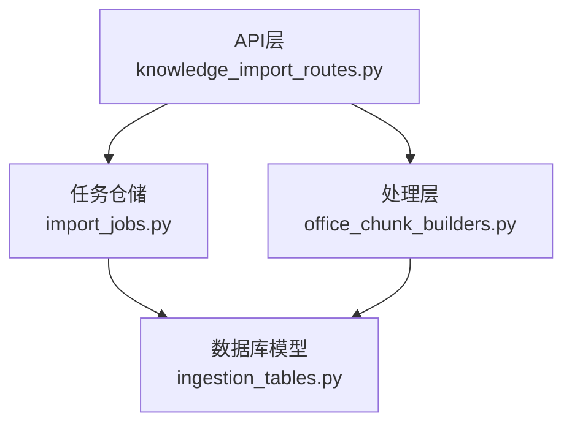
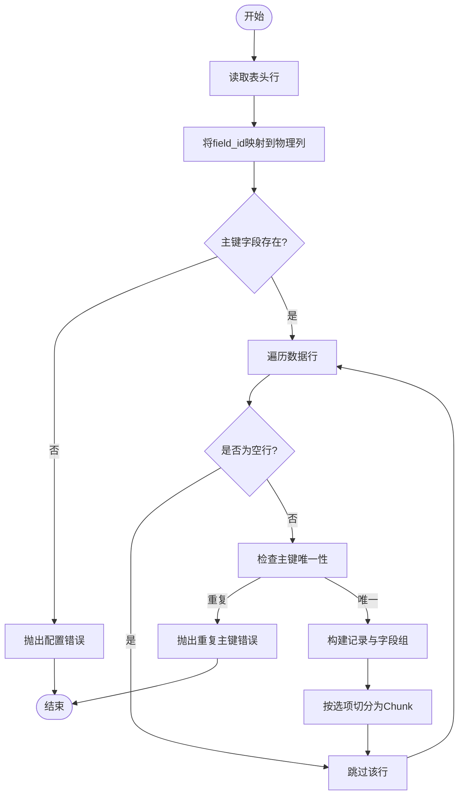
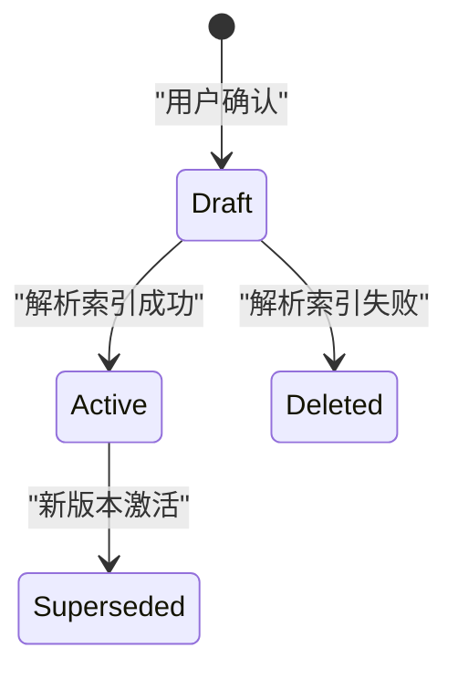
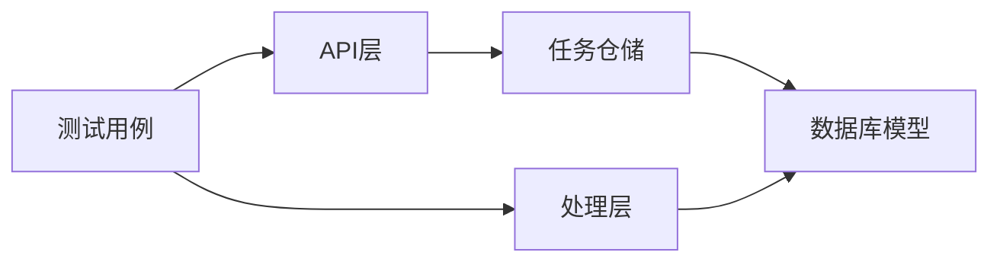

# Excel配置管理

<cite>
**本文引用的文件**
- [knowledge_import_routes.py](file://python-agent-study/src/fast_app/api/knowledge_import_routes.py)
- [office_chunk_builders.py](file://python-agent-study/src/fast_app/ingestion/processing/office_chunk_builders.py)
- [ingestion_tables.py](file://python-agent-study/src/fast_app/db/ingestion_tables.py)
- [import_jobs.py](file://python-agent-study/src/fast_app/ingestion/import_jobs.py)
- [test_office_ingestion.py](file://python-agent-study/scripts/tests/ingestion/test_office_ingestion.py)
</cite>

## 目录
1. [简介](#简介)
2. [项目结构](#项目结构)
3. [核心组件](#核心组件)
4. [架构总览](#架构总览)
5. [详细组件分析](#详细组件分析)
6. [依赖关系分析](#依赖关系分析)
7. [性能考虑](#性能考虑)
8. [故障排查指南](#故障排查指南)
9. [结论](#结论)
10. [附录：配置示例与常见问题](#附录：配置示例与常见问题)

## 简介
本文件面向Excel Profile配置管理，系统性说明Excel文件的解析流程、三种模式（Record、Section、Mixed）的区别与适用场景、数据结构定义、确认与激活流程、校验规则以及版本管理与状态流转。目标是帮助读者在不深入代码的情况下也能正确设计、使用和维护Excel导入Profile。

## 项目结构
Excel配置管理涉及API层、处理层、数据模型与任务仓储四个层次：
- API层：定义Profile请求/响应模型、确认接口、查询接口。
- 处理层：根据Profile将Excel解析为结构化记录或区段，并生成可检索的Chunk。
- 数据模型：持久化导入任务、文档注册表、Excel Profile版本及状态。
- 任务仓储：负责任务状态机、预览指纹校验、Profile创建与激活、并发安全。



**图表来源**
- [knowledge_import_routes.py:164-196](file://python-agent-study/src/fast_app/api/knowledge_import_routes.py#L164-L196)
- [office_chunk_builders.py:128-240](file://python-agent-study/src/fast_app/ingestion/processing/office_chunk_builders.py#L128-L240)
- [import_jobs.py:241-295](file://python-agent-study/src/fast_app/ingestion/import_jobs.py#L241-L295)
- [ingestion_tables.py:164-196](file://python-agent-study/src/fast_app/db/ingestion_tables.py#L164-L196)

**章节来源**
- [knowledge_import_routes.py:164-196](file://python-agent-study/src/fast_app/api/knowledge_import_routes.py#L164-L196)
- [office_chunk_builders.py:128-240](file://python-agent-study/src/fast_app/ingestion/processing/office_chunk_builders.py#L128-L240)
- [import_jobs.py:241-295](file://python-agent-study/src/fast_app/ingestion/import_jobs.py#L241-L295)
- [ingestion_tables.py:164-196](file://python-agent-study/src/fast_app/db/ingestion_tables.py#L164-L196)

## 核心组件
- Excel字段与Sheet配置模型：ExcelFieldProfile、ExcelSheetProfile。
- Profile确认请求与响应：ExcelProfileConfirmRequest、ExcelProfileResponse。
- Excel解析与分块：ExcelChunkBuilder，支持Record/Section/Mixed三种模式。
- 任务与Profile状态机：ImportJobRepository.confirm_excel_profile、mark_succeeded等。
- 数据库模型：KnowledgeIngestionJobTable、KnowledgeDocumentTable、KnowledgeExcelImportProfileTable。

**章节来源**
- [knowledge_import_routes.py:105-196](file://python-agent-study/src/fast_app/api/knowledge_import_routes.py#L105-L196)
- [office_chunk_builders.py:128-240](file://python-agent-study/src/fast_app/ingestion/processing/office_chunk_builders.py#L128-L240)
- [import_jobs.py:241-295](file://python-agent-study/src/fast_app/ingestion/import_jobs.py#L241-L295)
- [ingestion_tables.py:24-196](file://python-agent-study/src/fast_app/db/ingestion_tables.py#L24-L196)

## 架构总览
下图展示了从上传到Profile确认、再到激活的端到端流程，包括预览指纹校验、冲突检测与状态迁移。

```mermaid
sequenceDiagram
participant Client as "客户端"
participant API as "API层"
participant Repo as "任务仓储"
participant Worker as "Worker/处理层"
participant DB as "数据库"
Client->>API : "上传Excel/更新Excel"
API->>Repo : "创建导入任务(暂存+校验)"
Repo-->>API : "返回任务ID与初始状态"
API-->>Client : "任务状态(可能进入awaiting_configuration)"
Note over Worker,DB : "Worker解析Excel并生成预览"
Worker->>DB : "写入preview_json和preview_fingerprint"
Worker-->>Client : "前端轮询获取预览"
Client->>API : "提交ExcelProfileConfirmRequest(含preview_fingerprint)"
API->>Repo : "confirm_excel_profile(校验fingerprint, 创建draft Profile)"
Repo->>DB : "插入新version=latest+1, status=draft"
Repo-->>API : "返回新Profile"
API-->>Client : "返回ExcelProfileResponse"
Note over Worker,DB : "Worker再次执行，使用新Profile解析并索引"
Worker->>Repo : "mark_succeeded(成功完成)"
Repo->>DB : "旧active Profile -> superseded; 新draft -> active; 文档version+1"
Repo-->>Client : "任务完成，可用新Profile"
```

**图表来源**
- [knowledge_import_routes.py:314-350](file://python-agent-study/src/fast_app/api/knowledge_import_routes.py#L314-L350)
- [import_jobs.py:241-295](file://python-agent-study/src/fast_app/ingestion/import_jobs.py#L241-L295)
- [import_jobs.py:400-452](file://python-agent-study/src/fast_app/ingestion/import_jobs.py#L400-L452)
- [office_chunk_builders.py:46-63](file://python-agent-study/src/fast_app/ingestion/processing/office_chunk_builders.py#L46-L63)

## 详细组件分析

### 模式与使用场景
- Record模式
  - 用途：将每一行视为一条业务记录，按主键唯一标识，适合“表格即数据”的场景。
  - 关键配置：sheet_key、header_row、identity_field_ids、fields（包含field_id、display_name、header_aliases、required、indexed、field_group）。
  - 行为：按字段分组构建Chunk；未配置的有值列会触发重新配置；空列跳过但记录警告。
- Section模式
  - 用途：将整张Sheet作为区段内容保留原始行列结构，适合“报表/清单/非结构化表格”。
  - 关键配置：sheet_key、sheet_name_aliases；fields可为空。
  - 行为：按固定行数分块生成Chunk；结构变化通过结构Hash更新索引。
- Mixed模式
  - 用途：同一工作簿中不同Sheet采用不同模式，灵活组合Record与Section。
  - 关键约束：每个可见非空Sheet必须声明mode；Workbook顶层mode仅用于继承。
  - 行为：逐Sheet匹配配置后分别走Record或Section分支。

**章节来源**
- [knowledge_import_routes.py:131-161](file://python-agent-study/src/fast_app/api/knowledge_import_routes.py#L131-L161)
- [office_chunk_builders.py:146-240](file://python-agent-study/src/fast_app/ingestion/processing/office_chunk_builders.py#L146-L240)
- [test_office_ingestion.py:599-636](file://python-agent-study/scripts/tests/ingestion/test_office_ingestion.py#L599-L636)

### 数据结构：ExcelSheetProfile与ExcelFieldProfile
- ExcelSheetProfile
  - sheet_key：稳定业务身份，不随Sheet名称变化而变化。
  - mode：该Sheet的处理模式；mixed模式下必填，否则可省略并继承顶层mode。
  - sheet_name_aliases：当前名称和历史别名，用于跨版本匹配。
  - header_row：Record模式下的表头行号。
  - identity_field_ids：Record模式组合主键使用的稳定field_id列表。
  - fields：Record模式的字段映射；Section模式可为空。
- ExcelFieldProfile
  - field_id：跨版本稳定的业务字段ID。
  - display_name：Profile与前端展示的字段名称。
  - header_aliases：允许匹配该字段的历史或替代表头文本。
  - required：更新文件中是否必须匹配到该字段。
  - indexed：该字段内容是否进入检索Chunk。
  - field_group：宽表分组标识；为空时使用默认分组。

**章节来源**
- [knowledge_import_routes.py:105-161](file://python-agent-study/src/fast_app/api/knowledge_import_routes.py#L105-L161)

### 解析与分块流程（Record模式）
Record模式解析的关键步骤：
- 定位表头行并读取headers。
- 通过display_name/aliases将field_id唯一映射到物理列。
- 校验主键字段存在且唯一；空行跳过；重复主键报错。
- 未知有值列触发重新配置；空白未配置列记录警告。
- 按字段组渲染内容并生成Chunk，附带坐标与显示名元数据。



**图表来源**
- [office_chunk_builders.py:307-466](file://python-agent-study/src/fast_app/ingestion/processing/office_chunk_builders.py#L307-L466)

**章节来源**
- [office_chunk_builders.py:307-466](file://python-agent-study/src/fast_app/ingestion/processing/office_chunk_builders.py#L307-L466)

### 解析与分块流程（Section模式）
Section模式将整张Sheet按固定行数分块，保留原始行列结构，适合报表类文档。结构变化通过结构Hash影响索引更新。

```mermaid
flowchart TD
SStart(["开始"]) --> GroupRows["按固定行数分组"]
GroupRows --> Render["渲染为Markdown表格片段"]
Render --> Split["按字符/Token限制切分"]
Split --> AddMeta["附加结构Hash与坐标信息"]
AddMeta --> SEnd(["结束"])
```



**图表来源**
- [office_chunk_builders.py:242-305](file://python-agent-study/src/fast_app/ingestion/processing/office_chunk_builders.py#L242-L305)
- [office_chunk_builders.py:533-606](file://python-agent-study/src/fast_app/ingestion/processing/office_chunk_builders.py#L533-L606)
- [office_chunk_builders.py:669-683](file://python-agent-study/src/fast_app/ingestion/processing/office_chunk_builders.py#L669-L683)

**章节来源**
- [office_chunk_builders.py:242-305](file://python-agent-study/src/fast_app/ingestion/processing/office_chunk_builders.py#L242-L305)
- [office_chunk_builders.py:533-606](file://python-agent-study/src/fast_app/ingestion/processing/office_chunk_builders.py#L533-L606)
- [office_chunk_builders.py:669-683](file://python-agent-study/src/fast_app/ingestion/processing/office_chunk_builders.py#L669-L683)

### 混合模式（Mixed）
Mixed模式要求每个可见非空Sheet声明mode；若缺失则拒绝确认。Workbook顶层mode仅用于继承。

**章节来源**
- [knowledge_import_routes.py:172-183](file://python-agent-study/src/fast_app/api/knowledge_import_routes.py#L172-L183)
- [test_office_ingestion.py:599-636](file://python-agent-study/scripts/tests/ingestion/test_office_ingestion.py#L599-L636)

### 配置确认流程（预览生成、用户确认、Profile激活）
- 预览生成：解析Excel并生成sheets与preview_fingerprint。
- 用户确认：前端展示预览，用户选择mode、profile_name与sheets配置，携带preview_fingerprint提交。
- 仓库校验：校验fingerprint一致性，创建新version的draft Profile，并将任务放回pending队列。
- 激活：Worker再次执行解析与索引成功后，将旧active Profile标记为superseded，新draft转为active，并更新文档version与active_excel_profile_id。

```mermaid
sequenceDiagram
participant W as "Worker"
participant R as "Repository"
participant DB as "Database"
W->>R : "暂停任务并写入preview_json/fingerprint"
R->>DB : "更新job.status=awaiting_configuration"
Note over W,DB : "前端轮询获取预览"
R->>DB : "confirm_excel_profile(创建draft, version=latest+1)"
R->>DB : "job.status=pending, phase=queued"
W->>R : "mark_succeeded(成功完成)"
R->>DB : "active->superseded; draft->active; doc.version+1"
```

**图表来源**
- [office_chunk_builders.py:46-63](file://python-agent-study/src/fast_app/ingestion/processing/office_chunk_builders.py#L46-L63)
- [import_jobs.py:219-295](file://python-agent-study/src/fast_app/ingestion/import_jobs.py#L219-L295)
- [import_jobs.py:400-452](file://python-agent-study/src/fast_app/ingestion/import_jobs.py#L400-L452)

**章节来源**
- [office_chunk_builders.py:46-63](file://python-agent-study/src/fast_app/ingestion/processing/office_chunk_builders.py#L46-L63)
- [import_jobs.py:219-295](file://python-agent-study/src/fast_app/ingestion/import_jobs.py#L219-L295)
- [import_jobs.py:400-452](file://python-agent-study/src/fast_app/ingestion/import_jobs.py#L400-L452)

### 配置验证规则
- sheet_key唯一性：同一Profile内不允许重复sheet_key。
- field_id不重复：Record模式下fields中的field_id不能为空或重复。
- 主键字段存在性：identity_field_ids必须是fields的子集。
- Mixed模式约束：每个Sheet必须声明mode；否则拒绝确认。
- 表头匹配唯一性：字段无法唯一匹配表头时抛出配置错误。
- 未知有值列：存在未配置的有值列时要求重新配置。
- 空列处理：空白未配置列跳过并记录警告。

**章节来源**
- [knowledge_import_routes.py:505-535](file://python-agent-study/src/fast_app/api/knowledge_import_routes.py#L505-L535)
- [office_chunk_builders.py:318-361](file://python-agent-study/src/fast_app/ingestion/processing/office_chunk_builders.py#L318-L361)
- [office_chunk_builders.py:469-494](file://python-agent-study/src/fast_app/ingestion/processing/office_chunk_builders.py#L469-L494)

### 版本管理与状态流转
- Profile状态：draft（草稿）、active（生效）、superseded（被替代）。
- 文档状态：pending、active。
- 任务状态：pending、running、awaiting_configuration、succeeded、failed。
- 流转要点：
  - 确认时创建新version的draft Profile，任务回到pending。
  - 成功完成后，旧active Profile标记为superseded，新draft转为active，文档version+1。
  - 失败时删除draft Profile（create任务还会清理pending文档）。



**图表来源**
- [import_jobs.py:241-295](file://python-agent-study/src/fast_app/ingestion/import_jobs.py#L241-L295)
- [import_jobs.py:400-452](file://python-agent-study/src/fast_app/ingestion/import_jobs.py#L400-L452)
- [import_jobs.py:484-525](file://python-agent-study/src/fast_app/ingestion/import_jobs.py#L484-L525)

**章节来源**
- [import_jobs.py:241-295](file://python-agent-study/src/fast_app/ingestion/import_jobs.py#L241-L295)
- [import_jobs.py:400-452](file://python-agent-study/src/fast_app/ingestion/import_jobs.py#L400-L452)
- [import_jobs.py:484-525](file://python-agent-study/src/fast_app/ingestion/import_jobs.py#L484-L525)

## 依赖关系分析
- API层依赖任务仓储进行权限校验、任务创建与Profile确认。
- 处理层依赖数据模型与工具函数进行解析与分块。
- 任务仓储依赖数据库模型实现状态机与并发控制。
- 测试覆盖Mixed模式校验、Record模式解析等关键路径。



**图表来源**
- [knowledge_import_routes.py:164-196](file://python-agent-study/src/fast_app/api/knowledge_import_routes.py#L164-L196)
- [import_jobs.py:241-295](file://python-agent-study/src/fast_app/ingestion/import_jobs.py#L241-L295)
- [office_chunk_builders.py:128-240](file://python-agent-study/src/fast_app/ingestion/processing/office_chunk_builders.py#L128-L240)
- [test_office_ingestion.py:599-636](file://python-agent-study/scripts/tests/ingestion/test_office_ingestion.py#L599-L636)

**章节来源**
- [knowledge_import_routes.py:164-196](file://python-agent-study/src/fast_app/api/knowledge_import_routes.py#L164-L196)
- [import_jobs.py:241-295](file://python-agent-study/src/fast_app/ingestion/import_jobs.py#L241-L295)
- [office_chunk_builders.py:128-240](file://python-agent-study/src/fast_app/ingestion/processing/office_chunk_builders.py#L128-L240)
- [test_office_ingestion.py:599-636](file://python-agent-study/scripts/tests/ingestion/test_office_ingestion.py#L599-L636)

## 性能考虑
- 分块大小：Section模式按固定行数分块，避免单Chunk过大导致索引成本上升。
- 字段索引：仅indexed字段参与Chunk构建，减少不必要的内容与Embedding开销。
- 结构Hash：Section模式通过结构Hash快速识别变更，避免全量重建。
- 预览指纹：preview_fingerprint防止并发确认导致的错配，降低重试与回滚成本。

[本节提供通用指导，无需特定文件引用]

## 故障排查指南
- 常见错误与原因
  - “字段无法唯一匹配表头”：display_name/aliases与实际表头不一致或存在歧义。
  - “主键为空/重复”：identity_field_ids对应的列值为空或重复。
  - “存在未配置的有值列”：新增列未加入fields，需重新配置。
  - “Mixed Sheet缺少mode”：Mixed模式下每个Sheet必须声明mode。
  - “预览已变化”：确认时携带的preview_fingerprint与当前任务不一致，需刷新重新确认。
- 排查建议
  - 核对header_row与表头位置。
  - 检查field_id与header_aliases映射是否唯一。
  - 确认identity_field_ids属于fields子集。
  - 在Mixed模式下确保每个Sheet声明mode。
  - 查看任务warnings与diff_counts，定位新增/删除列的影响。

**章节来源**
- [office_chunk_builders.py:318-361](file://python-agent-study/src/fast_app/ingestion/processing/office_chunk_builders.py#L318-L361)
- [office_chunk_builders.py:469-494](file://python-agent-study/src/fast_app/ingestion/processing/office_chunk_builders.py#L469-L494)
- [knowledge_import_routes.py:505-535](file://python-agent-study/src/fast_app/api/knowledge_import_routes.py#L505-L535)
- [import_jobs.py:241-295](file://python-agent-study/src/fast_app/ingestion/import_jobs.py#L241-L295)

## 结论
Excel Profile配置管理通过稳定的sheet_key与field_id解耦了物理列与业务语义，结合Record/Section/Mixed三种模式满足不同场景需求。确认流程引入preview_fingerprint保障并发安全，版本化Profile与状态机确保平滑升级与回滚能力。遵循校验规则与最佳实践，可有效提升Excel导入的稳定性与可维护性。

[本节总结性内容，无需特定文件引用]

## 附录：配置示例与常见问题

### 配置示例（Record模式）
- 目标：员工信息表，稳定sheet_key为employees，第1行为表头，employee_id为主键，部分字段进入检索。
- 关键字段：
  - sheet_key: employees
  - header_row: 1
  - identity_field_ids: ["employee_id"]
  - fields:
    - field_id: employee_id, display_name: 员工编号, header_aliases: ["工号","员工ID"], required: true, indexed: true
    - field_id: employee_name, display_name: 姓名, header_aliases: ["姓名","员工姓名"], required: true, indexed: true
    - field_id: department, display_name: 部门, header_aliases: ["所属部门","部门名称"], required: false, indexed: true
    - field_id: internal_comment, display_name: 内部备注, header_aliases: ["管理员备注"], required: false, indexed: false

**章节来源**
- [knowledge_import_routes.py:105-161](file://python-agent-study/src/fast_app/api/knowledge_import_routes.py#L105-L161)

### 常见问题解决方案
- 新增列如何处理
  - 全空列：可忽略或记录warning继续导入。
  - 有值的未知列：进入awaiting_configuration，由用户决定是否加入Profile并配置field_id、required、indexed等。
- 删除列如何处理
  - required=true：暂停或失败，要求用户处理。
  - required=false：继续导入，但需更新旧记录内容并重新计算hash/Embedding。
- 首次上传完整流程
  - 无Profile时先生成预览，用户确认后创建draft Profile，再执行解析与索引，成功后激活并替换旧active Profile。

**章节来源**
- [office_chunk_builders.py:318-361](file://python-agent-study/src/fast_app/ingestion/processing/office_chunk_builders.py#L318-L361)
- [import_jobs.py:219-295](file://python-agent-study/src/fast_app/ingestion/import_jobs.py#L219-L295)
- [import_jobs.py:400-452](file://python-agent-study/src/fast_app/ingestion/import_jobs.py#L400-L452)