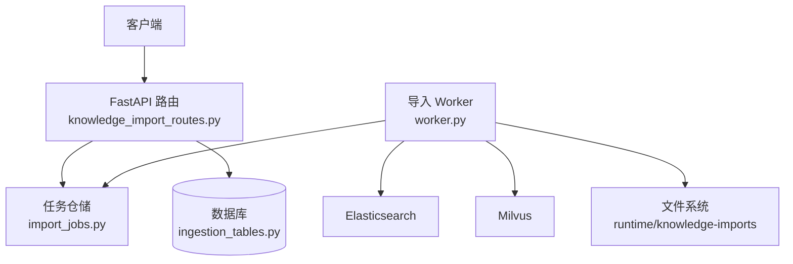
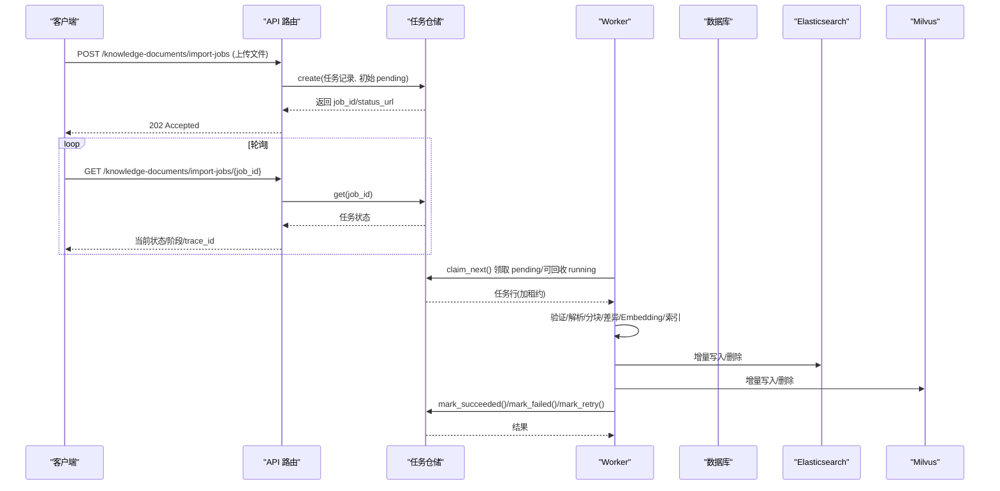
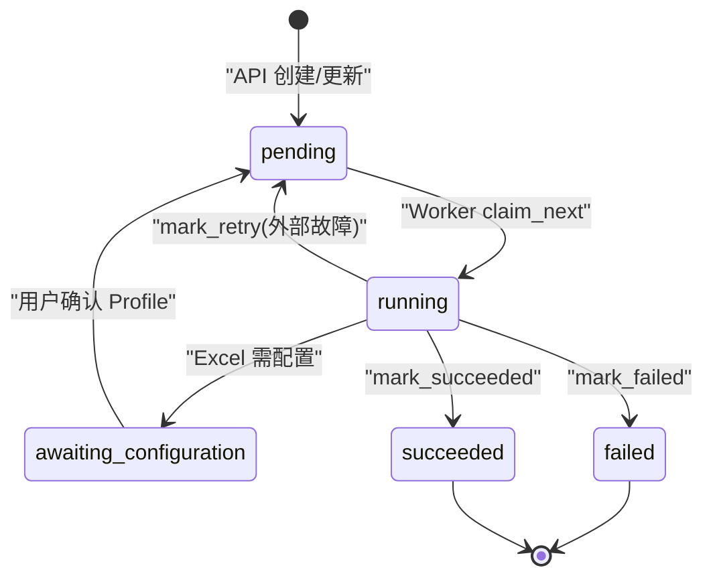
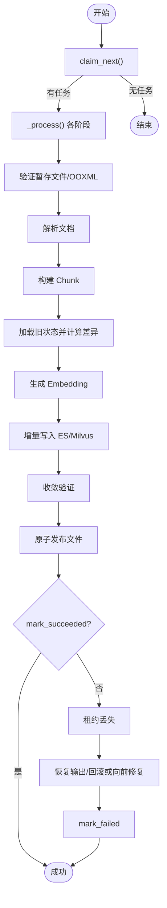
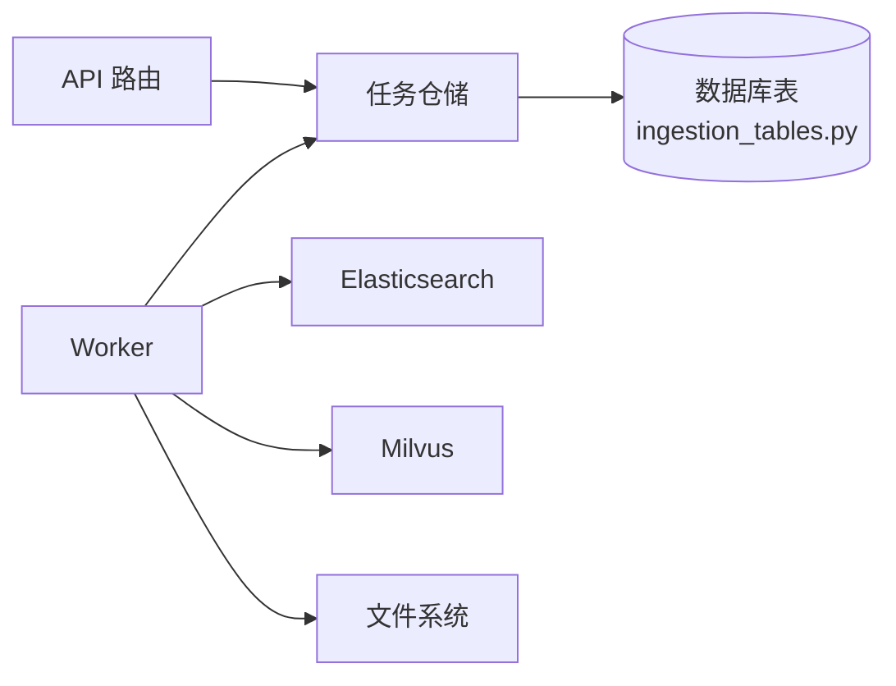

# 导入任务生命周期

<cite>
**本文引用的文件**
- [knowledge_import_routes.py](file://python-agent-study/src/fast_app/api/knowledge_import_routes.py)
- [import_jobs.py](file://python-agent-study/src/fast_app/ingestion/import_jobs.py)
- [worker.py](file://python-agent-study/src/fast_app/ingestion/worker.py)
- [ingestion_tables.py](file://python-agent-study/src/fast_app/db/ingestion_tables.py)
- [request_context.py](file://python-agent-study/src/fast_app/core/request_context.py)
</cite>

## 目录
1. [简介](#简介)
2. [项目结构](#项目结构)
3. [核心组件](#核心组件)
4. [架构总览](#架构总览)
5. [详细组件分析](#详细组件分析)
6. [依赖关系分析](#依赖关系分析)
7. [性能与可靠性](#性能与可靠性)
8. [故障排查指南](#故障排查指南)
9. [结论](#结论)
10. [附录：接口与字段说明](#附录接口与字段说明)

## 简介
本文件面向“知识库文档导入”的异步任务体系，系统化说明导入任务从创建到终态的生命周期、状态流转条件、Worker 执行机制（调度、租约、重试与恢复）、查询接口使用方法（含状态过滤、分页与权限控制），以及任务元数据字段含义、监控与调试方法。目标是帮助开发者与运维人员准确理解并高效排障。

## 项目结构
导入任务涉及三层协作：
- API 层：接收上传、校验、创建任务记录，提供任务查询与列表接口。
- 仓储层：封装任务的持久化、并发领取、租约更新与状态机操作。
- Worker 层：后台进程持续领取任务，执行解析、分块、增量同步、索引写入、发布与收尾。

图表来源
- [knowledge_import_routes.py:207-427](file://python-agent-study/src/fast_app/api/knowledge_import_routes.py#L207-L427)
- [import_jobs.py:86-525](file://python-agent-study/src/fast_app/ingestion/import_jobs.py#L86-L525)
- [worker.py:94-419](file://python-agent-study/src/fast_app/ingestion/worker.py#L94-L419)
- [ingestion_tables.py:24-120](file://python-agent-study/src/fast_app/db/ingestion_tables.py#L24-L120)

章节来源
- [knowledge_import_routes.py:207-427](file://python-agent-study/src/fast_app/api/knowledge_import_routes.py#L207-L427)
- [import_jobs.py:86-525](file://python-agent-study/src/fast_app/ingestion/import_jobs.py#L86-L525)
- [worker.py:94-419](file://python-agent-study/src/fast_app/ingestion/worker.py#L94-L419)
- [ingestion_tables.py:24-120](file://python-agent-study/src/fast_app/db/ingestion_tables.py#L24-L120)

## 核心组件
- 任务仓储 KnowledgeImportJobRepository：负责任务创建、领取、续租、阶段切换、成功/失败/重试标记、Excel Profile 确认等。
- 导入 Worker KnowledgeImportWorker：循环领取任务，执行验证、解析、分块、差异计算、Embedding、索引写入、收敛验证、文件发布与收尾；维护心跳与租约。
- API 路由 knowledge_import_routes：创建/更新任务、确认 Excel Profile、查询单个任务与任务列表，统一权限与参数校验。
- 数据模型 ingestion_tables：定义任务表、文档表、Excel Profile 表及约束索引。
- 请求上下文 request_context：贯穿请求与 Worker 的 request_id 与 trace_id 追踪。

章节来源
- [import_jobs.py:86-525](file://python-agent-study/src/fast_app/ingestion/import_jobs.py#L86-L525)
- [worker.py:94-419](file://python-agent-study/src/fast_app/ingestion/worker.py#L94-L419)
- [knowledge_import_routes.py:207-427](file://python-agent-study/src/fast_app/api/knowledge_import_routes.py#L207-L427)
- [ingestion_tables.py:24-120](file://python-agent-study/src/fast_app/db/ingestion_tables.py#L24-L120)
- [request_context.py:1-39](file://python-agent-study/src/fast_app/core/request_context.py#L1-L39)

## 架构总览
导入任务采用“API 异步提交 + Worker 拉取执行”的解耦模式。API 仅做轻量校验与落库，真正耗时逻辑由 Worker 在后台完成。任务通过数据库行级锁与租约机制实现多 Worker 安全并发；通过 diff 与双存储（ES/Milvus）增量同步保证一致性；通过回滚与向前修复保障崩溃恢复。

图表来源
- [knowledge_import_routes.py:207-427](file://python-agent-study/src/fast_app/api/knowledge_import_routes.py#L207-L427)
- [import_jobs.py:297-525](file://python-agent-study/src/fast_app/ingestion/import_jobs.py#L297-L525)
- [worker.py:116-419](file://python-agent-study/src/fast_app/ingestion/worker.py#L116-L419)

## 详细组件分析

### 状态机与流转条件
任务状态包括：pending、running、awaiting_configuration、succeeded、failed。phase 表示运行期细粒度阶段（如 validating、extracting、chunking、diffing、embedding、indexing、verifying、publishing）。

关键流转：
- 创建/更新接口：插入任务记录，status=pending，phase=queued。
- Worker 领取：claim_next 将 pending 或租约过期的 running 改为 running，设置 worker_id 与 lease_expires_at，attempt_count+1（清理型回收不增加）。
- 需要配置：当 Excel 未配置 Profile 时，Worker 保存预览并置 status=awaiting_configuration，phase=profiling，释放租约。
- 用户确认 Profile：confirm_excel_profile 创建 draft Profile，将任务重置为 pending，phase=queued。
- 成功：mark_succeeded 将 status=succeeded，phase=completed，记录 document_count、chunk_count、warnings、diff_counts，激活 Profile，提升文档版本。
- 失败：mark_failed 将 status=failed，phase=completed，记录 error_code/message，清理草稿 Profile，必要时回滚新建文档。
- 重试：mark_retry 将 status=pending，phase=queued，保留错误信息供前端展示。

图表来源
- [import_jobs.py:210-525](file://python-agent-study/src/fast_app/ingestion/import_jobs.py#L210-L525)
- [worker.py:126-419](file://python-agent-study/src/fast_app/ingestion/worker.py#L126-L419)

章节来源
- [import_jobs.py:210-525](file://python-agent-study/src/fast_app/ingestion/import_jobs.py#L210-L525)
- [worker.py:126-419](file://python-agent-study/src/fast_app/ingestion/worker.py#L126-L419)

### Worker 执行机制：调度、重试与恢复
- 调度：run_once 循环调用 claim_next 领取任务；无任务则退出本轮。
- 租约与心跳：每 60 秒 renew_lease；阶段切换 set_phase 同时续租；失租立即中断后续写操作。
- 重试策略：外部异常且 attempt_count < max_attempts 时，按退避延迟后 mark_retry；超过上限则尝试恢复输出并标记 failed。
- 恢复策略：
  - Create 失败：清理新建的文件与索引。
  - Update 失败：若目标文件已替换为新版本，则向前修复索引并补提交；否则尝试回滚旧版索引。
- 阶段推进：validating → extracting → chunking → loading_existing_chunks → diffing → embedding → indexing → verifying → publishing。

图表来源
- [worker.py:116-419](file://python-agent-study/src/fast_app/ingestion/worker.py#L116-L419)
- [worker.py:581-723](file://python-agent-study/src/fast_app/ingestion/worker.py#L581-L723)

章节来源
- [worker.py:116-419](file://python-agent-study/src/fast_app/ingestion/worker.py#L116-L419)
- [worker.py:581-723](file://python-agent-study/src/fast_app/ingestion/worker.py#L581-L723)

### 任务查询接口与权限控制
- GET /knowledge-documents/import-jobs/{job_id}
  - 功能：读取单个任务详情，包含 status、phase、trace_id、status_url 等。
  - 权限：非管理员只能查看自己创建的任务；认证失败抛出鉴权错误。
  - 用途：前端轮询任务状态，结合 status_url 进行稳定路径访问。
- GET /knowledge-documents/import-jobs
  - 功能：列出任务，支持 status 过滤（pending/running/awaiting_configuration/succeeded/failed），limit 分页（默认 20，最大 100）。
  - 权限：管理员可查看全局；普通用户仅查看自己的任务。
  - 返回：items 数组，每项为任务响应体。

章节来源
- [knowledge_import_routes.py:382-427](file://python-agent-study/src/fast_app/api/knowledge_import_routes.py#L382-L427)

### 任务元数据字段说明
- attempt_count：任务已被 Worker 尝试执行的次数；每次 claim_next 会递增（清理型回收除外）。
- max_attempts：允许的最大尝试次数；达到上限后不再自动重试。
- document_count：本次解析产生的 LoadedDocument 数量；成功时记录。
- chunk_count：本次目标版本的唯一 Chunk 数量；成功时记录。
- diff_counts：增量对比计数，包含 added、changed、removed、embedded、unchanged、metadata_only、repaired 等键，反映对检索存储的实际变更。
- preview_json：Excel 待确认的预览快照；用于防止过期确认。
- excel_profile_id/excel_profile_snapshot_json：当前任务使用或等待激活的 Excel Profile ID 与其快照。
- warnings：解析、Profile 或索引过程中产生的结构化警告。
- error_code/error_message：机器可读错误码与人类可读错误摘要。
- request_id/trace_id：跨组件追踪标识，便于日志关联与链路追踪。
- status_url：稳定的任务状态查询路径，便于前端轮询。

章节来源
- [knowledge_import_routes.py:44-97](file://python-agent-study/src/fast_app/api/knowledge_import_routes.py#L44-L97)
- [knowledge_import_routes.py:586-620](file://python-agent-study/src/fast_app/api/knowledge_import_routes.py#L586-L620)
- [ingestion_tables.py:24-120](file://python-agent-study/src/fast_app/db/ingestion_tables.py#L24-L120)

### 监控与调试方法
- 状态轮询：前端周期性 GET /knowledge-documents/import-jobs/{job_id}，关注 status、phase、error_code、finished_at。
- 追踪链路：使用 response 中的 trace_id 在日志系统或 LangSmith 中定位完整执行链；Worker 内部通过 langsmith_trace 包裹主流程。
- 日志关键字：
  - knowledge_import.phase：阶段切换事件。
  - knowledge_import.awaiting_configuration：暂停等待配置。
  - knowledge_import.external_failure：外部服务失败。
  - knowledge_import.lease_lost：租约丢失。
  - knowledge_import.rollback_failed：回滚失败。
- 诊断要点：
  - 长时间 running：检查 phase 是否停滞；核对租约是否续租成功。
  - awaiting_configuration：确认 Excel Profile 是否被正确提交，preview_fingerprint 是否匹配。
  - failed：查看 error_code 与 error_message，结合 diff_counts 判断索引写入是否部分成功。

章节来源
- [worker.py:156-266](file://python-agent-study/src/fast_app/ingestion/worker.py#L156-L266)
- [worker.py:484-549](file://python-agent-study/src/fast_app/ingestion/worker.py#L484-L549)
- [request_context.py:1-39](file://python-agent-study/src/fast_app/core/request_context.py#L1-L39)

## 依赖关系分析
- API 依赖仓储：创建/更新任务、确认 Profile、查询任务均通过 KnowledgeImportJobRepository。
- Worker 依赖仓储与外部存储：Worker 通过仓储管理任务状态，通过 ES/Milvus 客户端进行增量索引写入，并通过文件系统发布最终文件。
- 数据模型约束：
  - 活动任务唯一性：同一 target_path 在同一时刻只允许一个 pending/running/awaiting_configuration 任务。
  - 索引优化：user_id+created_at、status+created_at 索引加速列表查询。
  - Profile 版本唯一：doc_id+version 唯一约束避免冲突。

图表来源
- [knowledge_import_routes.py:207-427](file://python-agent-study/src/fast_app/api/knowledge_import_routes.py#L207-L427)
- [import_jobs.py:86-525](file://python-agent-study/src/fast_app/ingestion/import_jobs.py#L86-L525)
- [worker.py:94-419](file://python-agent-study/src/fast_app/ingestion/worker.py#L94-L419)
- [ingestion_tables.py:24-120](file://python-agent-study/src/fast_app/db/ingestion_tables.py#L24-L120)

章节来源
- [knowledge_import_routes.py:207-427](file://python-agent-study/src/fast_app/api/knowledge_import_routes.py#L207-L427)
- [import_jobs.py:86-525](file://python-agent-study/src/fast_app/ingestion/import_jobs.py#L86-L525)
- [worker.py:94-419](file://python-agent-study/src/fast_app/ingestion/worker.py#L94-L419)
- [ingestion_tables.py:24-120](file://python-agent-study/src/fast_app/db/ingestion_tables.py#L24-L120)

## 性能与可靠性
- 并发安全：claim_next 使用 SKIP LOCKED 避免阻塞；set_phase/renew_lease 条件更新确保只有持有者能继续。
- 增量同步：通过 build_chunk_diff 与 apply_chunk_diff 最小化 ES/Milvus 写入量，降低网络与索引压力。
- 幂等与健壮：文件发布使用临时文件与原子替换；相同内容跳过重复复制；崩溃后可向前修复或回滚。
- 重试与退避：外部故障有限次重试，退避间隔 5 秒与 30 秒，避免雪崩。
- 资源隔离：每个 Worker 独立心跳任务，数据库异常不影响其他任务；失租快速传播，避免脏写。

章节来源
- [import_jobs.py:297-377](file://python-agent-study/src/fast_app/ingestion/import_jobs.py#L297-L377)
- [worker.py:529-549](file://python-agent-study/src/fast_app/ingestion/worker.py#L529-L549)
- [worker.py:746-800](file://python-agent-study/src/fast_app/ingestion/worker.py#L746-L800)

## 故障排查指南
- 常见问题定位步骤：
  1) 获取 job_id，调用 GET /knowledge-documents/import-jobs/{job_id} 查看 status、phase、error_code、trace_id。
  2) 若 status=awaiting_configuration，检查 Excel Profile 是否已确认，preview_fingerprint 是否一致。
  3) 若 status=running 长时间不变，检查 phase 是否停滞；查看日志中 knowledge_import.phase 与 knowledge_import.heartbeat_failed。
  4) 若 status=failed，根据 error_code 分类处理：
     - KNOWLEDGE_IMPORT_PARSE_FAILED：Office 解析失败，检查文件格式与内容。
     - KNOWLEDGE_IMPORT_CHUNK_VALIDATION_FAILED：分块校验失败，检查分块配置。
     - KNOWLEDGE_IMPORT_EXTERNAL_FAILURE：外部服务失败，观察重试次数与退避。
     - KNOWLEDGE_IMPORT_ROLLBACK_FAILED：回滚失败，检查 ES/Milvus 状态与目标文件哈希。
  5) 使用 trace_id 在日志系统中检索完整链路，定位具体阶段失败点。
- 最佳实践：
  - 前端轮询建议指数退避，避免高频请求。
  - 对 awaiting_configuration 任务设置超时提醒，引导用户尽快确认。
  - 定期巡检 failed 任务，统计 error_code 分布，优化上游输入与外部服务稳定性。

章节来源
- [knowledge_import_routes.py:382-427](file://python-agent-study/src/fast_app/api/knowledge_import_routes.py#L382-L427)
- [worker.py:201-266](file://python-agent-study/src/fast_app/ingestion/worker.py#L201-L266)
- [worker.py:581-723](file://python-agent-study/src/fast_app/ingestion/worker.py#L581-L723)

## 结论
导入任务通过清晰的狀態机、稳健的租约机制、增量同步与崩溃恢复，实现了高可靠的知识库文档导入流程。API 提供简洁的状态查询与列表能力，配合 trace_id 与结构化日志，便于监控与排障。遵循本文的最佳实践可有效提升系统可用性与可观测性。

## 附录：接口与字段说明

### 接口定义
- POST /knowledge-documents/import-jobs
  - 作用：创建新文档导入任务。
  - 权限：需认证，具备对应部门文档创建权限。
  - 返回：任务响应体，包含 job_id、status、status_url、trace_id。
- POST /knowledge-documents/{doc_id}/import-jobs
  - 作用：更新已有文档导入任务。
  - 权限：需认证，具备对应部门文档更新权限；需校验 expected_sha256。
  - 返回：同创建接口。
- POST /knowledge-documents/import-jobs/{job_id}/excel-profile/confirm
  - 作用：确认 Excel Profile，将任务重新放回队列。
  - 权限：需认证，具备对应权限；校验 preview_fingerprint。
- GET /knowledge-documents/import-jobs/{job_id}
  - 作用：查询单个任务状态。
  - 权限：仅本人或管理员。
- GET /knowledge-documents/import-jobs
  - 作用：列出任务，支持 status 过滤与 limit 分页。
  - 权限：仅本人或管理员。

章节来源
- [knowledge_import_routes.py:207-427](file://python-agent-study/src/fast_app/api/knowledge_import_routes.py#L207-L427)

### 字段语义速查
- status：pending/running/awaiting_configuration/succeeded/failed。
- phase：queued/validating/extracting/chunking/loading_existing_chunks/diffing/embedding/indexing/verifying/publishing/completed/profiling。
- attempt_count/max_attempts：重试计数与上限。
- document_count/chunk_count：成功时的产出规模。
- diff_counts：增量变更明细。
- error_code/error_message：失败原因。
- request_id/trace_id：追踪标识。
- status_url：稳定状态查询路径。

章节来源
- [knowledge_import_routes.py:44-97](file://python-agent-study/src/fast_app/api/knowledge_import_routes.py#L44-L97)
- [ingestion_tables.py:24-120](file://python-agent-study/src/fast_app/db/ingestion_tables.py#L24-L120)