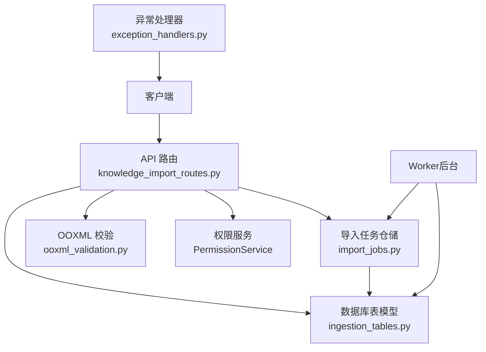
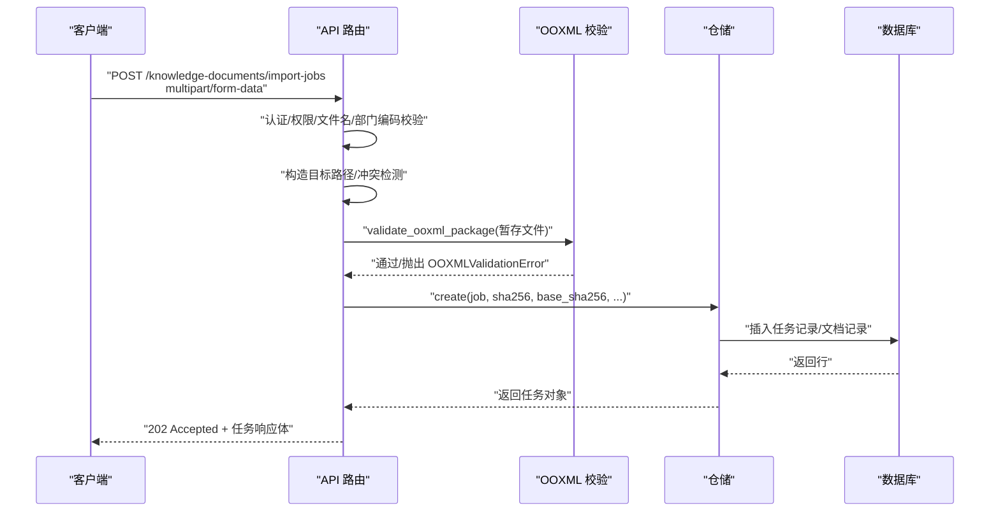
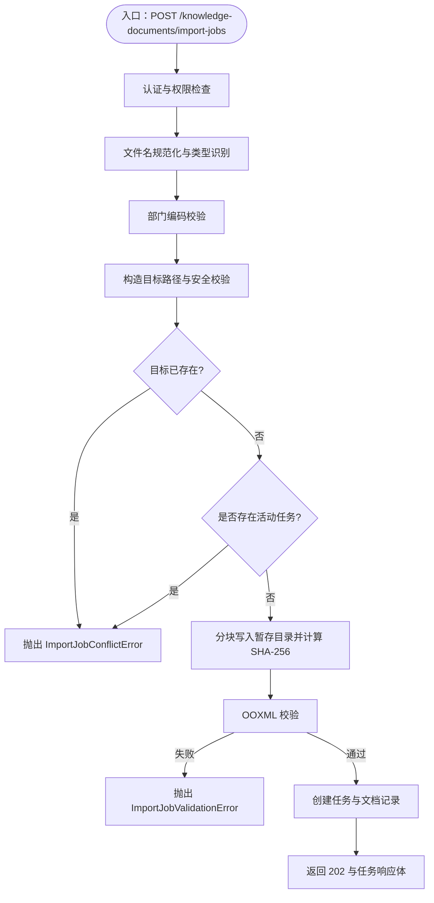
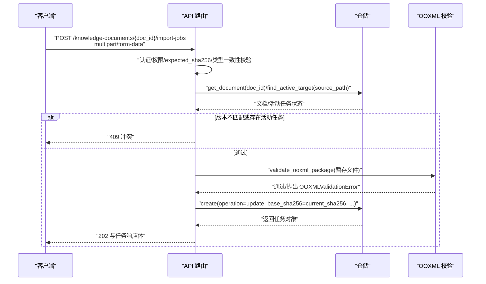
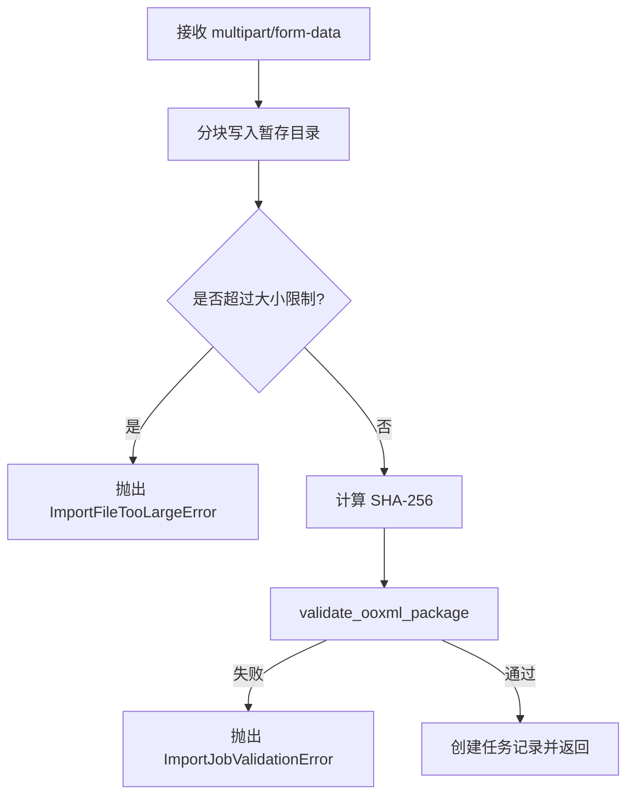
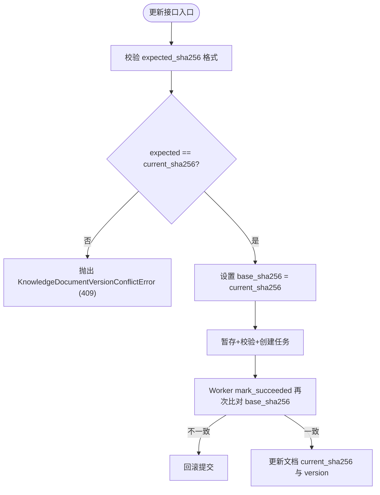
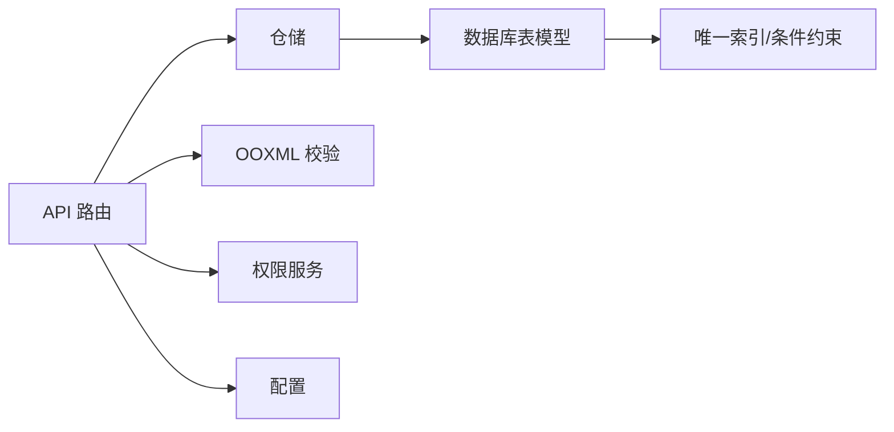

# 文档导入接口

<cite>
**本文引用的文件**
- [knowledge_import_routes.py](file://python-agent-study/src/fast_app/api/knowledge_import_routes.py)
- [import_jobs.py](file://python-agent-study/src/fast_app/ingestion/import_jobs.py)
- [ooxml_validation.py](file://python-agent-study/src/fast_app/ingestion/validation/ooxml_validation.py)
- [ingestion_tables.py](file://python-agent-study/src/fast_app/db/ingestion_tables.py)
- [exception_handlers.py](file://python-agent-study/src/fast_app/core/exception_handlers.py)
- [test_office_ingestion.py](file://python-agent-study/scripts/tests/ingestion/test_office_ingestion.py)
</cite>

## 目录
1. [简介](#简介)
2. [项目结构](#项目结构)
3. [核心组件](#核心组件)
4. [架构总览](#架构总览)
5. [详细组件分析](#详细组件分析)
6. [依赖关系分析](#依赖关系分析)
7. [性能与限制](#性能与限制)
8. [故障排查指南](#故障排查指南)
9. [结论](#结论)
10. [附录：请求与响应示例](#附录请求与响应示例)

## 简介
本文件面向“知识文档导入”能力，聚焦以下两个 POST 接口的使用与实现细节：
- POST /knowledge-documents/import-jobs：创建新文档导入任务（服务端生成路径、doc_id 和 ACL）。
- POST /knowledge-documents/{doc_id}/import-jobs：更新已有文档的导入任务（增量更新、版本冲突检测）。

文档将说明：
- 文件上传流程、部门编码校验、权限检查。
- 导入任务创建流程：文件暂存、OOXML 校验、SHA-256 计算、任务状态管理。
- 增量更新机制：expected_sha256 参数、base_sha256 字段、版本冲突检测。
- 错误处理策略：ImportJobConflictError、ImportJobValidationError 等异常及 HTTP 状态码。
- 完整请求/响应示例与常见使用场景。

## 项目结构
与导入接口直接相关的代码主要分布在以下模块：
- API 路由层：定义并编排导入接口，负责鉴权、参数校验、调用仓储与共享逻辑。
- 导入任务仓储与领域模型：封装任务持久化、并发领取、租约、状态机与冲突控制。
- OOXML 校验：对 PPTX/XLSX ZIP 包进行安全与完整性校验。
- 数据库表模型：任务、文档、Excel Profile 的 ORM 映射与约束。
- 全局异常处理器：将业务异常转换为统一 JSON 错误响应。

**图表来源**
- [knowledge_import_routes.py:207-311](file://python-agent-study/src/fast_app/api/knowledge_import_routes.py#L207-L311)
- [import_jobs.py:86-158](file://python-agent-study/src/fast_app/ingestion/import_jobs.py#L86-L158)
- [ooxml_validation.py:29-108](file://python-agent-study/src/fast_app/ingestion/validation/ooxml_validation.py#L29-L108)
- [ingestion_tables.py:24-120](file://python-agent-study/src/fast_app/db/ingestion_tables.py#L24-L120)
- [exception_handlers.py:93-125](file://python-agent-study/src/fast_app/core/exception_handlers.py#L93-L125)

**章节来源**
- [knowledge_import_routes.py:207-311](file://python-agent-study/src/fast_app/api/knowledge_import_routes.py#L207-L311)
- [import_jobs.py:22-76](file://python-agent-study/src/fast_app/ingestion/import_jobs.py#L22-L76)
- [ooxml_validation.py:29-108](file://python-agent-study/src/fast_app/ingestion/validation/ooxml_validation.py#L29-L108)
- [ingestion_tables.py:24-120](file://python-agent-study/src/fast_app/db/ingestion_tables.py#L24-L120)
- [exception_handlers.py:93-125](file://python-agent-study/src/fast_app/core/exception_handlers.py#L93-L125)

## 核心组件
- 路由层
  - 创建接口：POST /knowledge-documents/import-jobs
  - 更新接口：POST /knowledge-documents/{doc_id}/import-jobs
  - 公共逻辑：_stage_and_create_job 负责文件暂存、OOXML 校验、SHA-256 计算与任务落库。
- 仓储层
  - KnowledgeImportJobRepository：任务创建、查询、领取、续租、阶段更新、成功/失败标记、Excel Profile 确认等。
  - 活动目标唯一性约束：防止同一路径同时存在多个活动任务。
- 校验器
  - validate_ooxml_package：校验 PPTX/XLSX 的 ZIP 结构、核心文件、压缩比、条目数量、加密与路径安全。
- 数据模型
  - KnowledgeIngestionJobTable：任务状态机、租约、结果、追踪信息。
  - KnowledgeDocumentTable：文档身份、当前 SHA-256、版本号、状态。
  - KnowledgeExcelImportProfileTable：Excel 导入配置快照与版本。
- 异常与响应
  - ImportJobConflictError、ImportJobValidationError、KnowledgeDocumentVersionConflictError 等。
  - 全局异常处理器将 AppServiceError 转为统一 JSON 响应，携带 error_code、message、request_id、trace_id。

**章节来源**
- [knowledge_import_routes.py:44-97](file://python-agent-study/src/fast_app/api/knowledge_import_routes.py#L44-L97)
- [import_jobs.py:29-76](file://python-agent-study/src/fast_app/ingestion/import_jobs.py#L29-L76)
- [ingestion_tables.py:24-120](file://python-agent-study/src/fast_app/db/ingestion_tables.py#L24-L120)
- [exception_handlers.py:93-125](file://python-agent-study/src/fast_app/core/exception_handlers.py#L93-L125)

## 架构总览
导入接口采用“路由 + 仓储 + 校验 + 数据库”的分层设计：
- 路由层负责认证、权限、参数校验、路径构造、冲突检测，以及调用共享的暂存与任务创建逻辑。
- 仓储层提供原子化的任务状态机操作，包括并发领取、租约续期、阶段推进、成功/失败提交。
- 校验器在任务落库前完成 OOXML 安全与完整性校验，避免恶意或损坏文件进入后续处理。
- 数据库通过唯一索引与条件约束保证同一目标路径不会同时存在多个活动任务。

**图表来源**
- [knowledge_import_routes.py:207-249](file://python-agent-study/src/fast_app/api/knowledge_import_routes.py#L207-L249)
- [knowledge_import_routes.py:430-493](file://python-agent-study/src/fast_app/api/knowledge_import_routes.py#L430-L493)
- [ooxml_validation.py:29-108](file://python-agent-study/src/fast_app/ingestion/validation/ooxml_validation.py#L29-L108)
- [import_jobs.py:94-158](file://python-agent-study/src/fast_app/ingestion/import_jobs.py#L94-L158)

## 详细组件分析

### 接口一：POST /knowledge-documents/import-jobs（创建）
- 用途：上传 Office 文档（PPTX/XLSX），由服务端生成知识库目标路径、稳定 doc_id 与初始 ACL。
- 关键步骤
  - 认证与权限：需要已认证用户，并在目标部门拥有“创建”权限。
  - 文件名规范化与类型识别：仅允许 .pptx/.xlsx；拒绝不安全字符与 Windows 保留名。
  - 部门编码校验：限制为字母数字与下划线/连字符，确保目录拼接安全。
  - 目标路径构造与安全校验：目标必须位于知识库根目录下，且不允许覆盖已存在文件。
  - 活动任务冲突检测：若同名目标已有 pending/running/awaiting_configuration 任务，则拒绝。
  - 文件暂存与校验：分块写入 runtime/knowledge-imports，计算 SHA-256，执行 OOXML 校验。
  - 任务落库：创建导入任务，状态为 pending，阶段为 queued；创建场景同时登记文档记录（status=pending）。
  - 响应：返回 202 Accepted，包含 job_id、operation=create、doc_id、status、phase、target_path、department_code、document_type、file_size、new_sha256、status_url 等。

**图表来源**
- [knowledge_import_routes.py:207-249](file://python-agent-study/src/fast_app/api/knowledge_import_routes.py#L207-L249)
- [knowledge_import_routes.py:430-493](file://python-agent-study/src/fast_app/api/knowledge_import_routes.py#L430-L493)
- [import_jobs.py:534-564](file://python-agent-study/src/fast_app/ingestion/import_jobs.py#L534-L564)
- [import_jobs.py:567-573](file://python-agent-study/src/fast_app/ingestion/import_jobs.py#L567-L573)
- [ooxml_validation.py:29-108](file://python-agent-study/src/fast_app/ingestion/validation/ooxml_validation.py#L29-L108)

**章节来源**
- [knowledge_import_routes.py:207-249](file://python-agent-study/src/fast_app/api/knowledge_import_routes.py#L207-L249)
- [knowledge_import_routes.py:430-493](file://python-agent-study/src/fast_app/api/knowledge_import_routes.py#L430-L493)
- [import_jobs.py:534-573](file://python-agent-study/src/fast_app/ingestion/import_jobs.py#L534-L573)
- [ooxml_validation.py:29-108](file://python-agent-study/src/fast_app/ingestion/validation/ooxml_validation.py#L29-L108)

### 接口二：POST /knowledge-documents/{doc_id}/import-jobs（更新/增量）
- 用途：基于已注册文档进行受控更新，支持 Excel Profile 重新配置。
- 关键步骤
  - 认证与权限：需要已认证用户，并在文档所属部门拥有“更新”权限。
  - 文档存在性与状态校验：doc_id 必须存在且 status=active。
  - expected_sha256 校验：必须是 64 位十六进制字符串，且与文档 current_sha256 一致，否则抛出版本冲突。
  - 文件类型一致性：更新文件类型必须与现有文档一致。
  - 活动任务冲突检测：若该文档已有活动任务，则拒绝。
  - Excel Profile 重配置：reconfigure_excel_profile=true 时，跳过复用 active Profile，让 Worker 重新生成预览并暂停。
  - 共享逻辑：调用 _stage_and_create_job，设置 operation=update、base_sha256=current_sha256。
  - 响应：返回 202 Accepted，包含 operation=update、base_sha256、new_sha256、requires_configuration、status_url 等。

**图表来源**
- [knowledge_import_routes.py:252-311](file://python-agent-study/src/fast_app/api/knowledge_import_routes.py#L252-L311)
- [knowledge_import_routes.py:430-493](file://python-agent-study/src/fast_app/api/knowledge_import_routes.py#L430-L493)
- [import_jobs.py:94-158](file://python-agent-study/src/fast_app/ingestion/import_jobs.py#L94-L158)

**章节来源**
- [knowledge_import_routes.py:252-311](file://python-agent-study/src/fast_app/api/knowledge_import_routes.py#L252-L311)
- [knowledge_import_routes.py:430-493](file://python-agent-study/src/fast_app/api/knowledge_import_routes.py#L430-L493)
- [import_jobs.py:94-158](file://python-agent-study/src/fast_app/ingestion/import_jobs.py#L94-L158)

### 文件暂存、OOXML 校验与 SHA-256 计算
- 文件暂存
  - 分块读取上传流，写入 runtime/knowledge-imports/<job_id>.ext，累计字节数并计算 SHA-256。
  - 超过 max_upload_file_bytes 立即终止并清理暂存文件。
- OOXML 校验
  - 仅允许 .pptx/.xlsx；检查 ZIP 核心文件、条目数量、压缩比、加密标志、路径安全、完整性。
  - 失败时抛出 OOXMLValidationError，被路由层转换为 ImportJobValidationError。
- SHA-256
  - 用于任务 new_sha256、文档 current_sha256、增量更新 expected_sha256 对比。

**图表来源**
- [knowledge_import_routes.py:563-583](file://python-agent-study/src/fast_app/api/knowledge_import_routes.py#L563-L583)
- [ooxml_validation.py:29-108](file://python-agent-study/src/fast_app/ingestion/validation/ooxml_validation.py#L29-L108)
- [import_jobs.py:57-62](file://python-agent-study/src/fast_app/ingestion/import_jobs.py#L57-L62)

**章节来源**
- [knowledge_import_routes.py:563-583](file://python-agent-study/src/fast_app/api/knowledge_import_routes.py#L563-L583)
- [ooxml_validation.py:29-108](file://python-agent-study/src/fast_app/ingestion/validation/ooxml_validation.py#L29-L108)
- [import_jobs.py:57-62](file://python-agent-study/src/fast_app/ingestion/import_jobs.py#L57-L62)

### 增量更新机制：expected_sha256 与 base_sha256
- expected_sha256
  - 客户端在更新接口中传入，表示“期望的旧版本 SHA-256”。
  - 路由层校验其格式并与文档 current_sha256 比较，不一致则抛出 KnowledgeDocumentVersionConflictError（409）。
- base_sha256
  - 任务记录中的 base_sha256 表示更新任务开始时的旧文件 SHA-256。
  - 创建任务为空；更新任务设置为文档 current_sha256。
  - Worker 在最终提交前再次比对 base_sha256，关闭竞态窗口，确保发布前版本未变化。
- 版本冲突检测
  - 路由层：expected_sha256 != current_sha256 → 409。
  - 仓储层：mark_succeeded 时再次比对 base_sha256，不一致则回滚提交。

**图表来源**
- [knowledge_import_routes.py:252-311](file://python-agent-study/src/fast_app/api/knowledge_import_routes.py#L252-L311)
- [import_jobs.py:379-452](file://python-agent-study/src/fast_app/ingestion/import_jobs.py#L379-L452)
- [ingestion_tables.py:123-162](file://python-agent-study/src/fast_app/db/ingestion_tables.py#L123-L162)

**章节来源**
- [knowledge_import_routes.py:252-311](file://python-agent-study/src/fast_app/api/knowledge_import_routes.py#L252-L311)
- [import_jobs.py:379-452](file://python-agent-study/src/fast_app/ingestion/import_jobs.py#L379-L452)
- [ingestion_tables.py:123-162](file://python-agent-study/src/fast_app/db/ingestion_tables.py#L123-L162)

### 权限检查与部门编码验证
- 权限检查
  - 创建接口要求用户在目标部门具备“创建”权限；更新接口要求“更新”权限。
  - 系统管理员可绕过部门级权限限制。
- 部门编码验证
  - 仅允许字母数字开头，后跟字母数字、下划线或连字符，长度不超过 64。
  - 目的：确保服务端拼接出的目录名可预测且安全。

**章节来源**
- [knowledge_import_routes.py:222-228](file://python-agent-study/src/fast_app/api/knowledge_import_routes.py#L222-L228)
- [knowledge_import_routes.py:269-279](file://python-agent-study/src/fast_app/api/knowledge_import_routes.py#L269-L279)
- [knowledge_import_routes.py:538-552](file://python-agent-study/src/fast_app/api/knowledge_import_routes.py#L538-L552)
- [import_jobs.py:567-573](file://python-agent-study/src/fast_app/ingestion/import_jobs.py#L567-L573)

### 错误处理策略
- 异常类与状态码
  - ImportJobConflictError：409，冲突（目标已存在、同名活动任务、版本冲突等）。
  - ImportJobValidationError：422，校验失败（文件名非法、部门编码非法、OOXML 校验失败、类型不一致等）。
  - ImportFileTooLargeError：413，文件过大。
  - KnowledgeDocumentVersionConflictError：409，版本冲突（expected_sha256 不匹配）。
  - ImportJobNotFoundError：404，任务或文档不存在。
- 全局异常处理器
  - 将 AppServiceError 转换为统一 JSON 响应，包含 code、message、error_category、request_id、trace_id。
  - 日志记录包含 path、method、status_code、error_type、message。

**章节来源**
- [import_jobs.py:29-76](file://python-agent-study/src/fast_app/ingestion/import_jobs.py#L29-L76)
- [exception_handlers.py:93-125](file://python-agent-study/src/fast_app/core/exception_handlers.py#L93-L125)

## 依赖关系分析
- 路由层依赖
  - 仓储层：KnowledgeImportJobRepository，用于任务创建、查询、列表、Excel Profile 确认等。
  - 校验器：validate_ooxml_package，用于 OOXML 安全与完整性校验。
  - 权限服务：PermissionService，用于部门级权限检查与管理员角色判断。
  - 配置：Settings，用于知识库根目录与上传大小限制。
- 仓储层依赖
  - 数据库表模型：KnowledgeIngestionJobTable、KnowledgeDocumentTable、KnowledgeExcelImportProfileTable。
  - 唯一索引与条件约束：uq_knowledge_ingestion_jobs_active_target 防止活动任务重复。
- 外部依赖
  - 文件系统：runtime/knowledge-imports 作为暂存目录。
  - 数据库：PostgreSQL（JSONB、条件唯一索引、事务与锁）。

**图表来源**
- [knowledge_import_routes.py:207-311](file://python-agent-study/src/fast_app/api/knowledge_import_routes.py#L207-L311)
- [import_jobs.py:86-158](file://python-agent-study/src/fast_app/ingestion/import_jobs.py#L86-L158)
- [ingestion_tables.py:24-120](file://python-agent-study/src/fast_app/db/ingestion_tables.py#L24-L120)

**章节来源**
- [knowledge_import_routes.py:207-311](file://python-agent-study/src/fast_app/api/knowledge_import_routes.py#L207-L311)
- [import_jobs.py:86-158](file://python-agent-study/src/fast_app/ingestion/import_jobs.py#L86-L158)
- [ingestion_tables.py:24-120](file://python-agent-study/src/fast_app/db/ingestion_tables.py#L24-L120)

## 性能与限制
- 文件大小限制
  - 分块读取并实时统计累计字节，超过 max_upload_file_bytes 立即终止并清理暂存文件。
- OOXML 安全限制
  - 最大解压大小、最大条目数量、最大压缩比、禁止加密、路径安全、完整性检查。
- 并发与租约
  - 任务领取使用 SKIP LOCKED 避免阻塞；租约过期后可被其他 Worker 回收。
  - 阶段更新与续租在同一事务中进行，减少竞态。
- 数据库约束
  - 活动任务唯一索引防止同一路径并发创建；最终提交前再次比对 base_sha256 关闭竞态窗口。

[本节为通用性能讨论，无需特定文件引用]

## 故障排查指南
- 常见问题与定位
  - 409 冲突：检查目标路径是否已存在、是否有活动任务、expected_sha256 是否与 current_sha256 一致。
  - 422 校验失败：检查文件名、部门编码、OOXML 内容、文件类型一致性。
  - 413 文件过大：检查上传大小限制与网络传输。
  - 404 不存在：检查 doc_id 或 job_id 是否正确，用户是否有权限感知。
- 日志与追踪
  - 使用 request_id 与 trace_id 关联请求与跨组件日志。
  - 关注 knowledge_import 相关事件：awaiting_configuration、lease_lost、failed 等。
- 恢复与重试
  - 可重试错误会标记为 pending 并增加 attempt_count；耗尽次数后标记 failed。
  - 租约丢失不改任务状态，由新所有者继续或收尾。

**章节来源**
- [import_jobs.py:292-338](file://python-agent-study/src/fast_app/ingestion/import_jobs.py#L292-L338)
- [import_jobs.py:454-525](file://python-agent-study/src/fast_app/ingestion/import_jobs.py#L454-L525)
- [exception_handlers.py:93-125](file://python-agent-study/src/fast_app/core/exception_handlers.py#L93-L125)

## 结论
知识文档导入接口通过严格的认证、权限、校验与状态机管理，实现了安全可控的文件上传与增量更新能力。路由层负责编排与校验，仓储层提供原子化状态操作，OOXML 校验保障文件安全，数据库约束防止并发冲突。expected_sha256 与 base_sha256 共同构成增量更新的版本保护机制，确保发布前的最终一致性。

[本节为总结性内容，无需特定文件引用]

## 附录：请求与响应示例

### 创建接口：POST /knowledge-documents/import-jobs
- 请求
  - Content-Type: multipart/form-data
  - 表单字段
    - file: Office 文件（.pptx 或 .xlsx）
    - department_code: 部门编码（如 development）
- 成功响应
  - 状态码：202 Accepted
  - 响应体关键字段
    - job_id: 任务 ID
    - operation: create
    - doc_id: 稳定文档 ID
    - status: pending
    - phase: queued
    - target_path: 服务端生成的目标路径
    - department_code: 部门编码
    - document_type: powerpoint 或 spreadsheet
    - file_size: 实际字节数
    - new_sha256: 本次上传文件的 SHA-256
    - status_url: /knowledge-documents/import-jobs/{job_id}
- 失败响应
  - 409 Conflict：目标已存在或已有活动任务
  - 422 Unprocessable Entity：文件名/部门编码/OOXML 校验失败
  - 413 Payload Too Large：文件过大

**章节来源**
- [knowledge_import_routes.py:207-249](file://python-agent-study/src/fast_app/api/knowledge_import_routes.py#L207-L249)
- [knowledge_import_routes.py:430-493](file://python-agent-study/src/fast_app/api/knowledge_import_routes.py#L430-L493)
- [test_office_ingestion.py:966-1005](file://python-agent-study/scripts/tests/ingestion/test_office_ingestion.py#L966-L1005)

### 更新接口：POST /knowledge-documents/{doc_id}/import-jobs
- 请求
  - Content-Type: multipart/form-data
  - 表单字段
    - file: Office 文件（类型必须与现有文档一致）
    - expected_sha256: 64 位十六进制字符串，必须等于文档 current_sha256
    - reconfigure_excel_profile: true/false（仅 Excel 文档可重新配置）
- 成功响应
  - 状态码：202 Accepted
  - 响应体关键字段
    - job_id: 任务 ID
    - operation: update
    - base_sha256: 更新任务开始时的旧文件 SHA-256
    - new_sha256: 本次上传文件的 SHA-256
    - requires_configuration: 是否需要用户确认 Excel Profile
    - status_url: /knowledge-documents/import-jobs/{job_id}
- 失败响应
  - 409 Conflict：版本冲突或已有活动任务
  - 422 Unprocessable Entity：expected_sha256 格式错误或类型不一致
  - 404 Not Found：文档不存在

**章节来源**
- [knowledge_import_routes.py:252-311](file://python-agent-study/src/fast_app/api/knowledge_import_routes.py#L252-L311)
- [knowledge_import_routes.py:430-493](file://python-agent-study/src/fast_app/api/knowledge_import_routes.py#L430-L493)
- [test_office_ingestion.py:966-1005](file://python-agent-study/scripts/tests/ingestion/test_office_ingestion.py#L966-L1005)