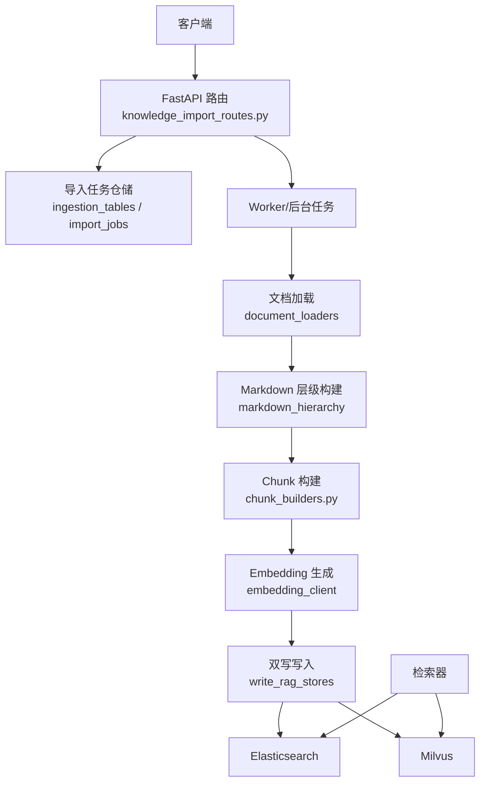
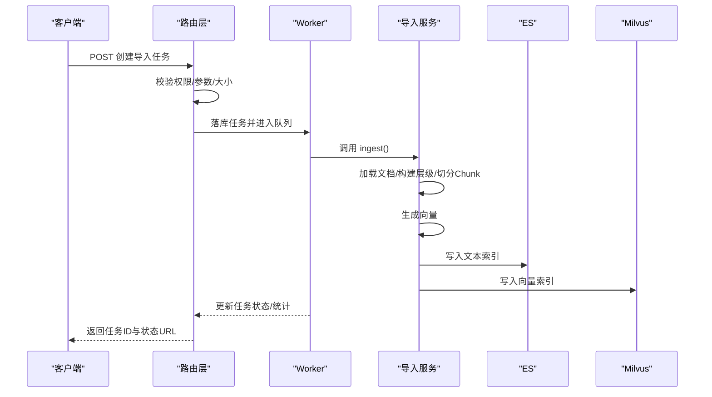
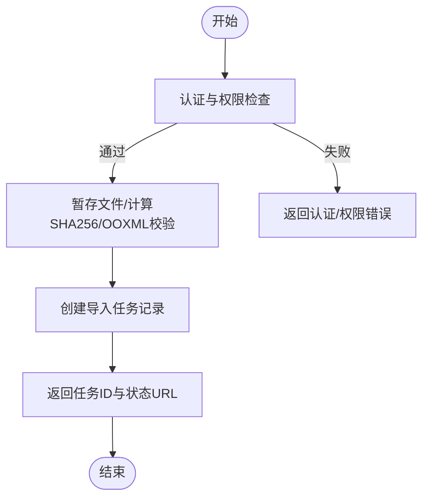
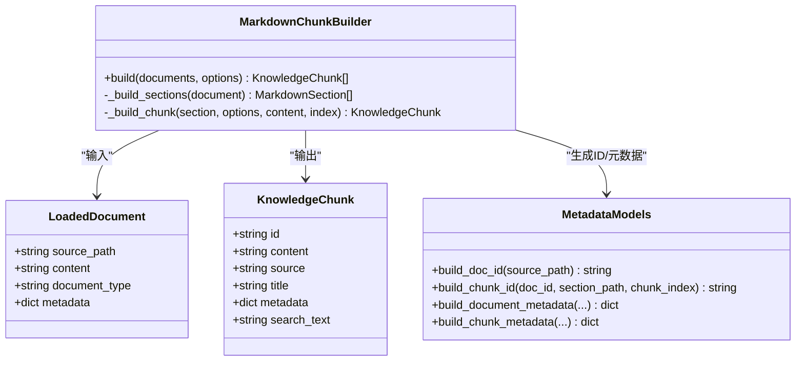
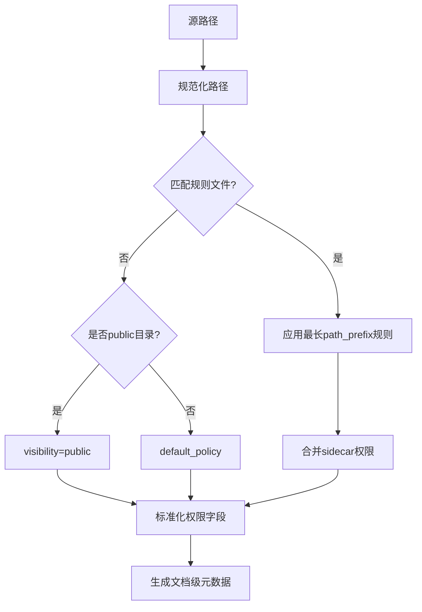
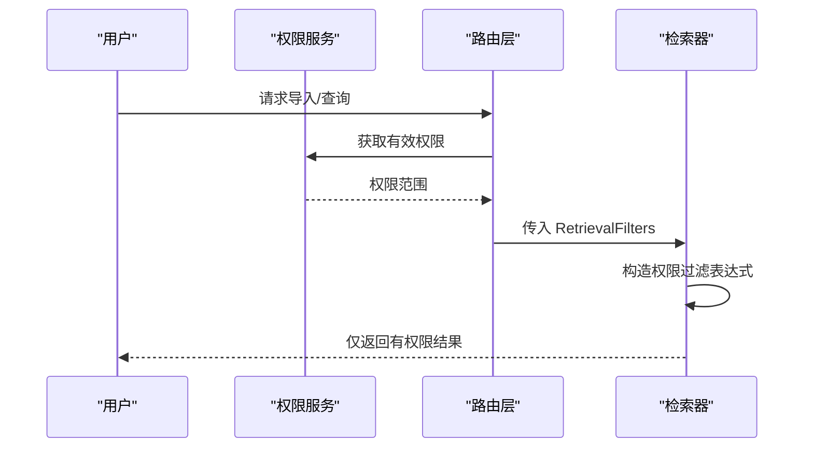
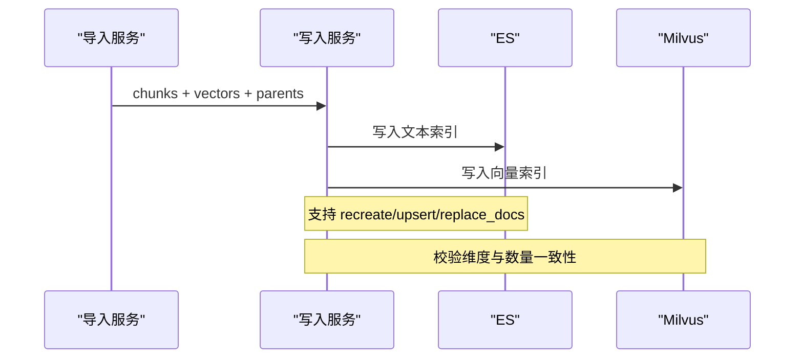
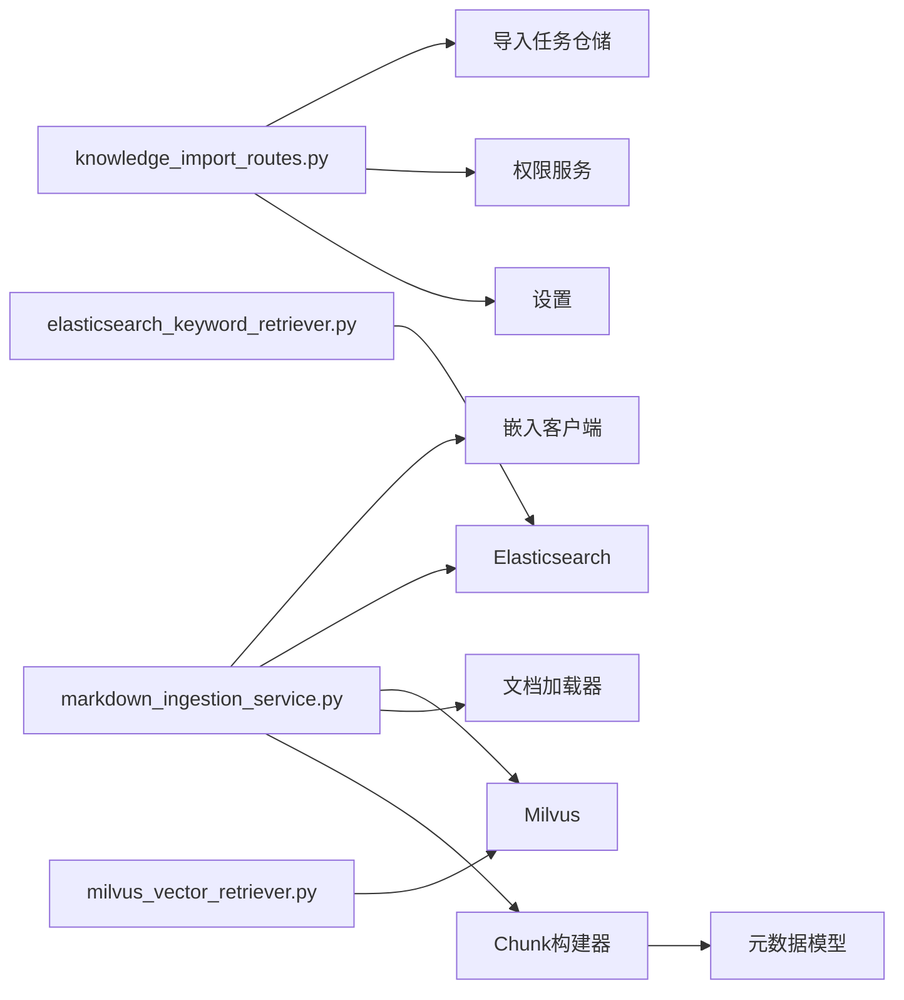

# 知识库接口

<cite>
**本文引用的文件**
- [knowledge_import_routes.py](file://src/fast_app/api/knowledge_import_routes.py)
- [markdown_ingestion_service.py](file://src/fast_app/ingestion/markdown_ingestion_service.py)
- [chunk_builders.py](file://src/fast_app/ingestion/processing/chunk_builders.py)
- [metadata_models.py](file://src/fast_app/ingestion/processing/metadata_models.py)
- [milvus_vector_retriever.py](file://src/fast_app/components/retrievers/milvus_vector_retriever.py)
- [elasticsearch_keyword_retriever.py](file://src/fast_app/components/retrievers/elasticsearch_keyword_retriever.py)
- [knowledge_permissions.py](file://src/fast_app/domain/knowledge_permissions.py)
- [knowledge_models.py](file://src/fast_app/domain/knowledge_models.py)
</cite>

## 目录
1. [简介](#简介)
2. [项目结构](#项目结构)
3. [核心组件](#核心组件)
4. [架构总览](#架构总览)
5. [详细组件分析](#详细组件分析)
6. [依赖关系分析](#依赖关系分析)
7. [性能考虑](#性能考虑)
8. [故障排查指南](#故障排查指南)
9. [结论](#结论)
10. [附录](#附录)

## 简介
本文件面向知识库管理接口的使用与实现说明，覆盖知识文档的导入、更新、删除和查询操作；重点解释 Markdown 文档解析与 Chunk 构建过程（含元数据处理与版本管理）；说明批量导入、增量更新与冲突解决机制；阐述文档权限控制与安全访问；描述与 Milvus 和 Elasticsearch 的同步机制；并给出文档预览、搜索与统计分析能力的接入点。

## 项目结构
知识库能力由“API 路由层 + 导入任务仓储 + 导入处理服务 + 存储写入 + 检索器”组成：
- API 路由层负责接收上传、校验权限、创建/更新导入任务、轮询任务状态与 Excel Profile 确认。
- 导入任务仓储持久化任务元数据、阶段、统计与错误信息，供 Worker 与前端轮询。
- 导入处理服务编排文档加载、Markdown 层级构建、Chunk 切分、Embedding 生成与双写 ES/Milvus。
- 存储写入统一对接 ES 与 Milvus，支持不同写入模式与版本范围控制。
- 检索器提供关键词与向量检索，并在检索阶段下推权限过滤。

图表来源
- [knowledge_import_routes.py:207-428](file://src/fast_app/api/knowledge_import_routes.py#L207-L428)
- [markdown_ingestion_service.py:73-142](file://src/fast_app/ingestion/markdown_ingestion_service.py#L73-L142)
- [chunk_builders.py:79-108](file://src/fast_app/ingestion/processing/chunk_builders.py#L79-L108)
- [milvus_vector_retriever.py:182-303](file://src/fast_app/components/retrievers/milvus_vector_retriever.py#L182-L303)
- [elasticsearch_keyword_retriever.py:227-309](file://src/fast_app/components/retrievers/elasticsearch_keyword_retriever.py#L227-L309)

章节来源
- [knowledge_import_routes.py:207-428](file://src/fast_app/api/knowledge_import_routes.py#L207-L428)
- [markdown_ingestion_service.py:73-142](file://src/fast_app/ingestion/markdown_ingestion_service.py#L73-L142)

## 核心组件
- 导入任务路由：提供创建/更新导入任务、Excel Profile 确认、任务状态查询与列表。
- Markdown 导入服务：读取文档、构建 Markdown 父子层级、切分 Chunk、生成向量、双写 ES/Milvus。
- Chunk 构建器：按标题段落切分、滑动窗口分割、生成稳定 chunk_id 与 metadata。
- 元数据模型：生成 doc_id、chunk_id、文档级与 Chunk 级 metadata，包含权限字段。
- 检索器：ES 关键词检索与 Milvus 向量检索，均支持权限下推与版本过滤。
- 权限范围：RetrievalPermissionScope 定义可检索的部门、用户与公共文档范围。

章节来源
- [knowledge_import_routes.py:44-97](file://src/fast_app/api/knowledge_import_routes.py#L44-L97)
- [markdown_ingestion_service.py:21-72](file://src/fast_app/ingestion/markdown_ingestion_service.py#L21-L72)
- [chunk_builders.py:14-21](file://src/fast_app/ingestion/processing/chunk_builders.py#L14-L21)
- [metadata_models.py:21-75](file://src/fast_app/ingestion/processing/metadata_models.py#L21-L75)
- [knowledge_permissions.py:4-19](file://src/fast_app/domain/knowledge_permissions.py#L4-L19)

## 架构总览
知识库导入与检索的整体流程如下：
- 导入：客户端上传文件 -> 路由校验权限与参数 -> 暂存文件并创建导入任务 -> Worker 执行解析、切分、向量化、双写 -> 返回任务结果。
- 检索：客户端发起检索 -> 检索器根据配置构造查询与权限过滤 -> 从 ES/Milvus 召回 -> 转换为统一 RetrievedDoc -> 上层聚合与重排。

图表来源
- [knowledge_import_routes.py:207-311](file://src/fast_app/api/knowledge_import_routes.py#L207-L311)
- [markdown_ingestion_service.py:73-142](file://src/fast_app/ingestion/markdown_ingestion_service.py#L73-L142)

## 详细组件分析

### 导入与更新接口
- 创建导入任务：POST /knowledge-documents/import-jobs
  - 校验认证与部门权限，生成目标路径，防止覆盖已存在文档与同名活动任务。
  - 暂存上传文件、计算 SHA-256、OOXML 校验、创建任务记录并返回任务 ID 与状态 URL。
- 更新导入任务：POST /knowledge-documents/{doc_id}/import-jobs
  - 校验 expected_sha256 与当前版本一致，类型必须匹配，可选重新配置 Excel Profile。
  - 复用 active Profile 或暂停等待确认，创建更新任务。
- Excel Profile 确认：POST /knowledge-documents/import-jobs/{job_id}/excel-profile/confirm
  - 校验 preview_fingerprint、mode/sheets 合法性，保存 Profile 并恢复任务执行。
- 查询任务：GET /knowledge-documents/import-jobs/{job_id} 与列表 GET /knowledge-documents/import-jobs
  - 非管理员仅能查看自己创建的任务；支持按状态筛选与分页限制。

图表来源
- [knowledge_import_routes.py:207-249](file://src/fast_app/api/knowledge_import_routes.py#L207-L249)
- [knowledge_import_routes.py:252-311](file://src/fast_app/api/knowledge_import_routes.py#L252-L311)
- [knowledge_import_routes.py:314-350](file://src/fast_app/api/knowledge_import_routes.py#L314-L350)
- [knowledge_import_routes.py:382-428](file://src/fast_app/api/knowledge_import_routes.py#L382-L428)

章节来源
- [knowledge_import_routes.py:207-428](file://src/fast_app/api/knowledge_import_routes.py#L207-L428)

### Markdown 解析与 Chunk 构建
- 文档加载：默认加载器支持文本与 Office 文档；Markdown 文档走层级构建。
- 层级构建：基于标题层级组织父子块，父块用于上下文扩展，子块用于检索。
- Chunk 切分：按标题段落分段，再按滑动窗口与 token 估算进行分割，保证最小长度与重叠。
- 元数据生成：为每个 Chunk 生成稳定 id、标题路径、heading_level、section_index、chunk_index，并继承文档级权限字段。
- 向量与双写：对每个 Chunk 生成 embedding，校验维度后统一写入 ES 与 Milvus。

图表来源
- [chunk_builders.py:79-108](file://src/fast_app/ingestion/processing/chunk_builders.py#L79-L108)
- [chunk_builders.py:110-188](file://src/fast_app/ingestion/processing/chunk_builders.py#L110-L188)
- [metadata_models.py:21-75](file://src/fast_app/ingestion/processing/metadata_models.py#L21-L75)
- [knowledge_models.py:8-18](file://src/fast_app/domain/knowledge_models.py#L8-L18)
- [knowledge_models.py:94-109](file://src/fast_app/domain/knowledge_models.py#L94-L109)

章节来源
- [markdown_ingestion_service.py:73-142](file://src/fast_app/ingestion/markdown_ingestion_service.py#L73-L142)
- [chunk_builders.py:79-188](file://src/fast_app/ingestion/processing/chunk_builders.py#L79-L188)
- [metadata_models.py:21-75](file://src/fast_app/ingestion/processing/metadata_models.py#L21-L75)
- [knowledge_models.py:8-18](file://src/fast_app/domain/knowledge_models.py#L8-L18)
- [knowledge_models.py:94-109](file://src/fast_app/domain/knowledge_models.py#L94-L109)

### 元数据处理与版本管理
- 文档级元数据：包含 doc_id、source_path、document_type、file_name、file_extension 以及权限字段 visibility、allowed_departments、allowed_users、permission_source。
- 权限来源：优先匹配知识库根目录 .permission-rules.json 的规则，其次 sidecar .meta.json 覆盖，最后回退到 public 或 default_policy。
- Chunk 级元数据：在文档级基础上补充 chunk_id、title、section_path、heading_level、section_index、chunk_index。
- 版本管理：检索时可通过 knowledge_version 过滤有效版本区间；写入侧支持 replace_docs/upsert/recreate 等模式（由写入服务决定）。

图表来源
- [metadata_models.py:78-133](file://src/fast_app/ingestion/processing/metadata_models.py#L78-L133)
- [metadata_models.py:136-198](file://src/fast_app/ingestion/processing/metadata_models.py#L136-L198)
- [metadata_models.py:275-323](file://src/fast_app/ingestion/processing/metadata_models.py#L275-L323)
- [metadata_models.py:342-366](file://src/fast_app/ingestion/processing/metadata_models.py#L342-L366)

章节来源
- [metadata_models.py:78-133](file://src/fast_app/ingestion/processing/metadata_models.py#L78-L133)
- [metadata_models.py:136-198](file://src/fast_app/ingestion/processing/metadata_models.py#L136-L198)
- [metadata_models.py:275-323](file://src/fast_app/ingestion/processing/metadata_models.py#L275-L323)
- [metadata_models.py:342-366](file://src/fast_app/ingestion/processing/metadata_models.py#L342-L366)

### 批量导入、增量更新与冲突解决
- 批量导入：通过多次调用创建导入任务接口，或使用 CLI/脚本批量触发；每个任务独立记录进度与结果。
- 增量更新：更新接口要求 expected_sha256 与当前版本一致，确保并发安全；若类型不匹配或已有活动任务则拒绝。
- 冲突解决：同名文档不允许覆盖创建；同名活动任务会冲突；更新时版本不一致将抛出版本冲突错误；Excel Profile 可重新配置以适配新表头。

章节来源
- [knowledge_import_routes.py:207-311](file://src/fast_app/api/knowledge_import_routes.py#L207-L311)

### 文档权限控制与安全访问
- 路由层权限：创建/更新/确认等操作需具备对应部门的文档权限；管理员可跨部门操作。
- 检索权限：RetrievalPermissionScope 定义 can_read_all、department_codes、allow_public、user_id；检索器在 ES/Milvus 查询阶段下推权限过滤，避免无权限数据进入候选集。
- 权限来源：规则文件与 sidecar 元数据共同决定 visibility、allowed_departments、allowed_users。

图表来源
- [knowledge_import_routes.py:538-560](file://src/fast_app/api/knowledge_import_routes.py#L538-L560)
- [knowledge_permissions.py:4-19](file://src/fast_app/domain/knowledge_permissions.py#L4-L19)
- [elasticsearch_keyword_retriever.py:93-133](file://src/fast_app/components/retrievers/elasticsearch_keyword_retriever.py#L93-L133)
- [milvus_vector_retriever.py:96-133](file://src/fast_app/components/retrievers/milvus_vector_retriever.py#L96-L133)

章节来源
- [knowledge_import_routes.py:538-560](file://src/fast_app/api/knowledge_import_routes.py#L538-L560)
- [knowledge_permissions.py:4-19](file://src/fast_app/domain/knowledge_permissions.py#L4-L19)
- [elasticsearch_keyword_retriever.py:93-133](file://src/fast_app/components/retrievers/elasticsearch_keyword_retriever.py#L93-L133)
- [milvus_vector_retriever.py:96-133](file://src/fast_app/components/retrievers/milvus_vector_retriever.py#L96-L133)

### 与 Milvus 和 Elasticsearch 的同步机制
- 写入：导入服务将 chunks 与 vectors 交给统一写入函数，分别完成 ES 文本索引与 Milvus 向量索引写入；支持不同写入模式与版本范围控制。
- 检索：ES 关键词检索与 Milvus 向量检索均支持业务过滤与权限过滤；检索结果转换为统一 RetrievedDoc，便于后续融合与重排。
- 日志与监控：检索器记录 embedding 耗时、filter_expr、命中数、跳过数与慢查询告警，便于定位问题。

图表来源
- [markdown_ingestion_service.py:112-142](file://src/fast_app/ingestion/markdown_ingestion_service.py#L112-L142)
- [milvus_vector_retriever.py:182-303](file://src/fast_app/components/retrievers/milvus_vector_retriever.py#L182-L303)
- [elasticsearch_keyword_retriever.py:227-309](file://src/fast_app/components/retrievers/elasticsearch_keyword_retriever.py#L227-L309)

章节来源
- [markdown_ingestion_service.py:112-142](file://src/fast_app/ingestion/markdown_ingestion_service.py#L112-L142)
- [milvus_vector_retriever.py:182-303](file://src/fast_app/components/retrievers/milvus_vector_retriever.py#L182-L303)
- [elasticsearch_keyword_retriever.py:227-309](file://src/fast_app/components/retrievers/elasticsearch_keyword_retriever.py#L227-L309)

### 文档预览、搜索与统计分析
- 文档预览：Excel 导入任务支持预览 Sheet、表头与候选主键；确认后生成 Profile 并继续执行。
- 搜索：ES 关键词检索与 Milvus 向量检索均可用；支持按 source_path、section_path、knowledge_version 过滤；权限过滤在查询阶段下推。
- 统计分析：导入任务返回 document_count、chunk_count、diff_counts、warnings、error_code 等；检索器记录 hit_count、skipped_hit_count、latency_ms 等指标。

章节来源
- [knowledge_import_routes.py:44-97](file://src/fast_app/api/knowledge_import_routes.py#L44-L97)
- [knowledge_import_routes.py:314-350](file://src/fast_app/api/knowledge_import_routes.py#L314-L350)
- [knowledge_import_routes.py:586-620](file://src/fast_app/api/knowledge_import_routes.py#L586-L620)
- [milvus_vector_retriever.py:182-303](file://src/fast_app/components/retrievers/milvus_vector_retriever.py#L182-L303)
- [elasticsearch_keyword_retriever.py:227-309](file://src/fast_app/components/retrievers/elasticsearch_keyword_retriever.py#L227-L309)

## 依赖关系分析
- 路由层依赖：数据库会话、权限服务、设置、导入任务仓储。
- 导入服务依赖：嵌入客户端、ES/Milvus 客户端、文档加载器、Chunk 构建器、层级构建器。
- 检索器依赖：设置、嵌入客户端（Milvus）、ES 客户端。
- 元数据依赖：路径规范化、规则文件、sidecar 元数据、权限字段标准化。

图表来源
- [knowledge_import_routes.py:207-428](file://src/fast_app/api/knowledge_import_routes.py#L207-L428)
- [markdown_ingestion_service.py:73-142](file://src/fast_app/ingestion/markdown_ingestion_service.py#L73-L142)
- [chunk_builders.py:79-108](file://src/fast_app/ingestion/processing/chunk_builders.py#L79-L108)
- [metadata_models.py:21-75](file://src/fast_app/ingestion/processing/metadata_models.py#L21-L75)
- [elasticsearch_keyword_retriever.py:227-309](file://src/fast_app/components/retrievers/elasticsearch_keyword_retriever.py#L227-L309)
- [milvus_vector_retriever.py:182-303](file://src/fast_app/components/retrievers/milvus_vector_retriever.py#L182-L303)

章节来源
- [knowledge_import_routes.py:207-428](file://src/fast_app/api/knowledge_import_routes.py#L207-L428)
- [markdown_ingestion_service.py:73-142](file://src/fast_app/ingestion/markdown_ingestion_service.py#L73-L142)
- [chunk_builders.py:79-108](file://src/fast_app/ingestion/processing/chunk_builders.py#L79-L108)
- [metadata_models.py:21-75](file://src/fast_app/ingestion/processing/metadata_models.py#L21-L75)
- [elasticsearch_keyword_retriever.py:227-309](file://src/fast_app/components/retrievers/elasticsearch_keyword_retriever.py#L227-L309)
- [milvus_vector_retriever.py:182-303](file://src/fast_app/components/retrievers/milvus_vector_retriever.py#L182-L303)

## 性能考虑
- 切分策略：滑动窗口与 token 估算结合，避免过大 Chunk 导致向量维度或检索效率问题。
- 权限下推：在 ES/Milvus 查询阶段下推权限过滤，减少无效候选集。
- 慢查询告警：检索器记录慢查询阈值与关键指标，便于定位瓶颈。
- 写入校验：提前校验 chunk 与向量数量及维度，避免脏数据。

[本节为通用指导，不直接分析具体文件]

## 故障排查指南
- 认证与权限错误：检查用户是否已认证、是否具备目标部门文档操作权限。
- 版本冲突：更新接口 expected_sha256 与当前版本不一致时会拒绝；确认客户端传递的版本正确。
- 文件类型不匹配：更新时文件类型必须与现有文档一致；否则拒绝。
- 活动任务冲突：同名文档已有活动导入任务时会拒绝；等待任务完成或清理后再试。
- 检索失败：检查 embedding 维度是否与设置一致；查看检索器日志中的 filter_expr、hit_count、skipped_hit_count。
- 权限问题：确认权限规则文件或 sidecar 元数据是否正确；检查 allowed_departments、allowed_users 与 visibility。

章节来源
- [knowledge_import_routes.py:207-311](file://src/fast_app/api/knowledge_import_routes.py#L207-L311)
- [knowledge_import_routes.py:538-560](file://src/fast_app/api/knowledge_import_routes.py#L538-L560)
- [milvus_vector_retriever.py:215-233](file://src/fast_app/components/retrievers/milvus_vector_retriever.py#L215-L233)
- [elasticsearch_keyword_retriever.py:311-340](file://src/fast_app/components/retrievers/elasticsearch_keyword_retriever.py#L311-L340)

## 结论
本知识库接口提供了完整的导入、更新、查询与检索能力，支持 Markdown 文档的层级化解析与 Chunk 构建，具备稳定的元数据与权限控制，并通过 ES 与 Milvus 双写实现关键词与向量检索。通过任务化导入、增量更新与冲突解决机制，系统在保证一致性的同时具备良好的可扩展性与可观测性。

[本节为总结，不直接分析具体文件]

## 附录
- 常用接口路径：
  - 创建导入任务：POST /knowledge-documents/import-jobs
  - 更新导入任务：POST /knowledge-documents/{doc_id}/import-jobs
  - 确认 Excel Profile：POST /knowledge-documents/import-jobs/{job_id}/excel-profile/confirm
  - 查询任务：GET /knowledge-documents/import-jobs/{job_id}
  - 任务列表：GET /knowledge-documents/import-jobs
- 关键配置项：
  - 知识库目录、ES 索引名、Milvus 集合名、嵌入维度、慢查询阈值等。
- 建议实践：
  - 使用 stable doc_id 与 chunk_id 进行幂等写入与溯源。
  - 通过权限规则文件集中管理文档可见性。
  - 利用任务状态与统计字段进行监控与审计。

[本节为补充信息，不直接分析具体文件]