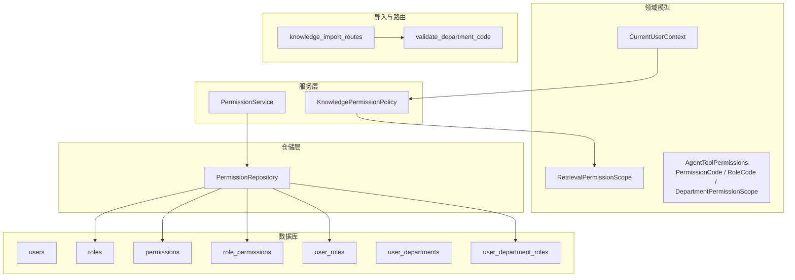
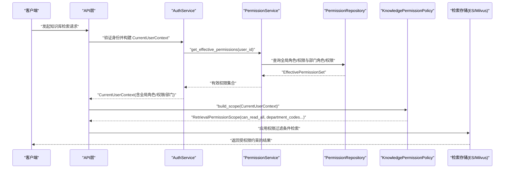
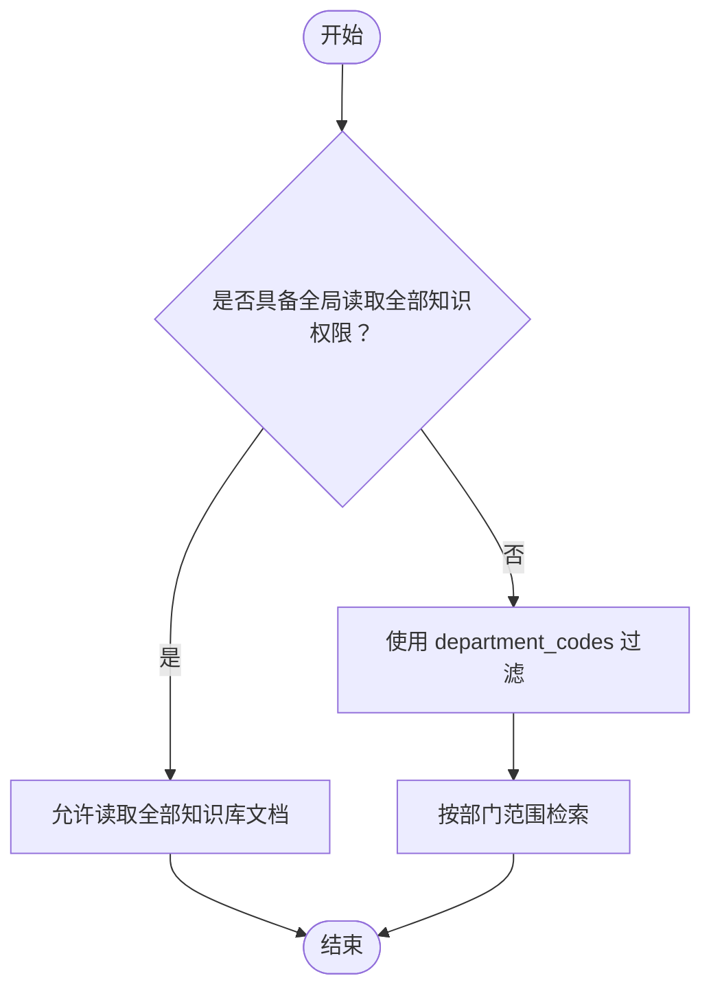
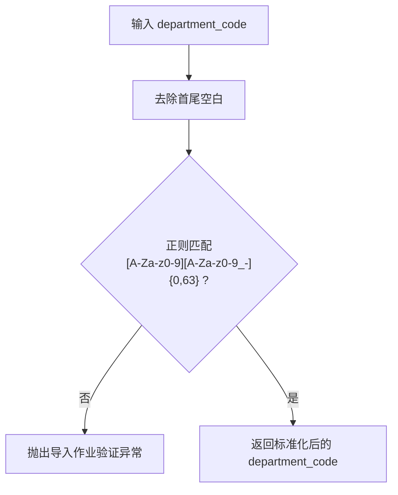
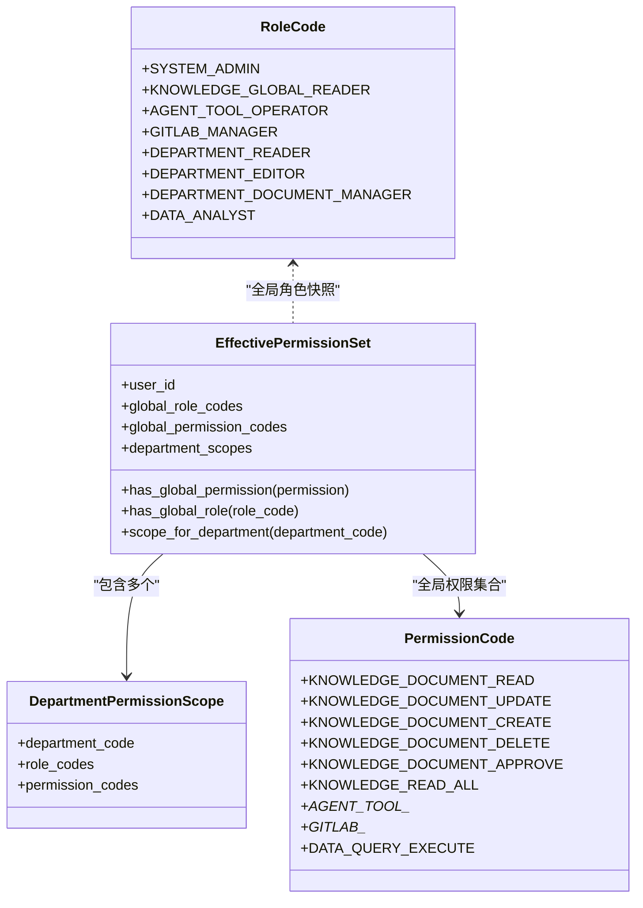
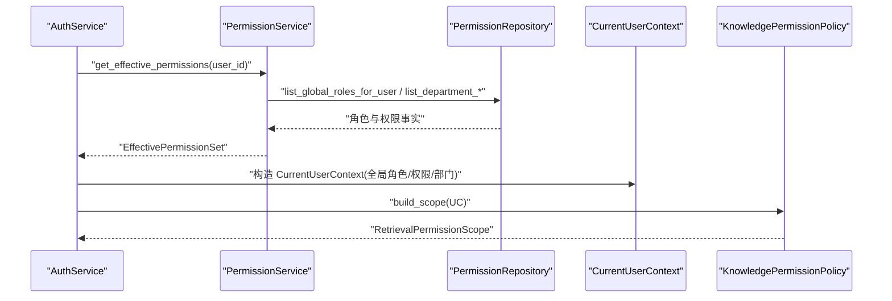
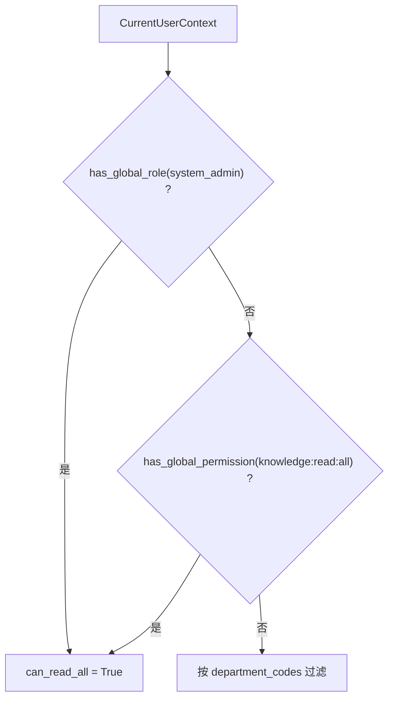
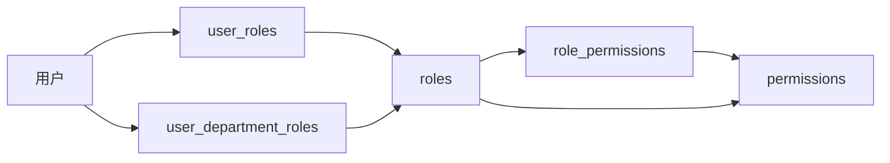
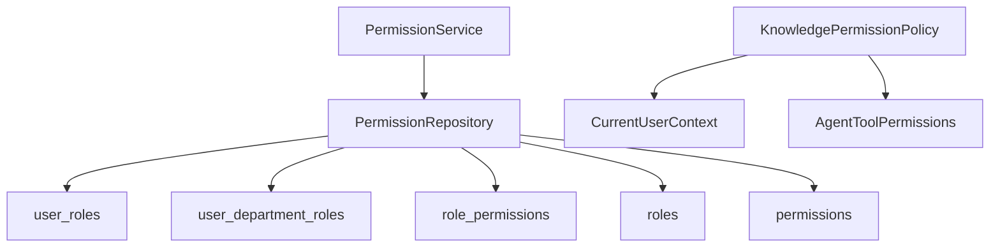

# 知识库权限控制

<cite>
**本文引用的文件**
- [permission_service.py](file://python-agent-study/src/fast_app/services/auth/permission_service.py)
- [permission_repository.py](file://python-agent-study/src/fast_app/services/auth/permission_repository.py)
- [auth_tables.py](file://python-agent-study/src/fast_app/db/auth_tables.py)
- [user_context.py](file://python-agent-study/src/fast_app/domain/user_context.py)
- [knowledge_permissions.py](file://python-agent-study/src/fast_app/domain/knowledge_permissions.py)
- [knowledge_permission_policy.py](file://python-agent-study/src/fast_app/services/knowledge/knowledge_permission_policy.py)
- [agent_tool_permissions.py](file://python-agent-study/src/fast_app/domain/agent_tool_permissions.py)
- [import_jobs.py](file://python-agent-study/src/fast_app/ingestion/import_jobs.py)
- [knowledge_import_routes.py](file://python-agent-study/src/fast_app/api/knowledge_import_routes.py)
- [auth_service.py](file://python-agent-study/src/fast_app/services/auth/auth_service.py)
- [问题14-旧权限模块代码残留.md](file://python-agent-study/scripts/docs/问题14-旧权限模块代码残留.md)
</cite>

## 目录
1. [简介](#简介)
2. [项目结构](#项目结构)
3. [核心组件](#核心组件)
4. [架构总览](#架构总览)
5. [详细组件分析](#详细组件分析)
6. [依赖关系分析](#依赖关系分析)
7. [性能考虑](#性能考虑)
8. [故障排查指南](#故障排查指南)
9. [结论](#结论)
10. [附录](#附录)

## 简介
本文件面向“知识库权限控制”的部门级权限模型与实现，重点说明：
- 部门编码 department_code 的作用与 validate_department_code 的校验逻辑。
- 权限检查机制中 PermissionCode.KNOWLEDGE_DOCUMENT_CREATE 与 PermissionCode.KNOWLEDGE_DOCUMENT_UPDATE 的使用场景。
- CurrentUserContext 与 PermissionService 的集成方式：用户身份认证、角色检查、权限范围确定。
- 管理员权限的特殊处理：系统管理员角色与全局权限在检索与文档操作中的影响。
- 权限继承与组合规则（全局作用域 + 部门作用域）。
- 权限拒绝时的错误处理与审计建议。
- 权限配置最佳实践与安全建议（最小权限原则、审计日志记录）。

## 项目结构
知识库权限控制涉及领域模型、服务层、仓储层、数据库表以及导入路由等模块。整体分层如下：
- 领域模型：CurrentUserContext、RetrievalPermissionScope、AgentToolPermissions（权限码、角色码、部门作用域等）。
- 服务层：PermissionService（计算有效权限）、KnowledgePermissionPolicy（将用户上下文转换为检索权限范围）。
- 仓储层：PermissionRepository（从 RBAC 表查询用户的全局角色、全局权限、部门角色与部门权限）。
- 数据库表：users、roles、permissions、role_permissions、user_roles、user_departments、user_department_roles。
- 导入与路由：validate_department_code 用于限制部门编码格式；知识导入路由调用该函数进行输入校验。

图表来源
- [permission_service.py:11-50](file://python-agent-study/src/fast_app/services/auth/permission_service.py#L11-L50)
- [permission_repository.py:17-80](file://python-agent-study/src/fast_app/services/auth/permission_repository.py#L17-L80)
- [auth_tables.py:66-319](file://python-agent-study/src/fast_app/db/auth_tables.py#L66-L319)
- [knowledge_permission_policy.py:13-41](file://python-agent-study/src/fast_app/services/knowledge/knowledge_permission_policy.py#L13-L41)
- [import_jobs.py:567-573](file://python-agent-study/src/fast_app/ingestion/import_jobs.py#L567-L573)
- [knowledge_import_routes.py:33-33](file://python-agent-study/src/fast_app/api/knowledge_import_routes.py#L33-L33)

章节来源
- [permission_service.py:11-50](file://python-agent-study/src/fast_app/services/auth/permission_service.py#L11-L50)
- [permission_repository.py:17-80](file://python-agent-study/src/fast_app/services/auth/permission_repository.py#L17-L80)
- [auth_tables.py:66-319](file://python-agent-study/src/fast_app/db/auth_tables.py#L66-L319)
- [knowledge_permission_policy.py:13-41](file://python-agent-study/src/fast_app/services/knowledge/knowledge_permission_policy.py#L13-L41)
- [import_jobs.py:567-573](file://python-agent-study/src/fast_app/ingestion/import_jobs.py#L567-L573)
- [knowledge_import_routes.py:33-33](file://python-agent-study/src/fast_app/api/knowledge_import_routes.py#L33-L33)

## 核心组件
- CurrentUserContext：承载当前请求的用户身份、认证来源、全局角色与全局权限快照、可访问部门列表、主归属部门等。提供 has_global_role 与 has_global_permission 方法用于快速判断。
- PermissionService：根据用户 ID 从 RBAC 表展开并计算 EffectivePermissionSet，包含全局角色、全局权限和各部门作用域的角色与权限集合。
- KnowledgePermissionPolicy：将可信的 CurrentUserContext 转换为 RetrievalPermissionScope，决定是否可以读取全部知识库或按部门过滤。
- AgentToolPermissions：定义权限码、角色码、部门作用域、工具调用上下文与裁决结果等，支撑文档创建/更新等操作所需的细粒度权限。
- PermissionRepository：封装对 users、roles、permissions、role_permissions、user_roles、user_departments、user_department_roles 的查询，返回用户的有效权限事实。
- validate_department_code：限制部门编码字符集与长度，确保服务端拼接目录名安全可预测。

章节来源
- [user_context.py:9-51](file://python-agent-study/src/fast_app/domain/user_context.py#L9-L51)
- [permission_service.py:11-50](file://python-agent-study/src/fast_app/services/auth/permission_service.py#L11-L50)
- [knowledge_permission_policy.py:13-41](file://python-agent-study/src/fast_app/services/knowledge/knowledge_permission_policy.py#L13-L41)
- [agent_tool_permissions.py:14-62](file://python-agent-study/src/fast_app/domain/agent_tool_permissions.py#L14-L62)
- [permission_repository.py:17-80](file://python-agent-study/src/fast_app/services/auth/permission_repository.py#L17-L80)
- [import_jobs.py:567-573](file://python-agent-study/src/fast_app/ingestion/import_jobs.py#L567-L573)

## 架构总览
下图展示一次知识库检索请求的权限判定流程：认证后生成 CurrentUserContext，PermissionService 计算有效权限，KnowledgePermissionPolicy 将其转换为检索权限范围，最终下推到检索过滤条件。

图表来源
- [auth_service.py:314-323](file://python-agent-study/src/fast_app/services/auth/auth_service.py#L314-L323)
- [permission_service.py:17-50](file://python-agent-study/src/fast_app/services/auth/permission_service.py#L17-L50)
- [permission_repository.py:27-80](file://python-agent-study/src/fast_app/services/auth/permission_repository.py#L27-L80)
- [knowledge_permission_policy.py:20-41](file://python-agent-study/src/fast_app/services/knowledge/knowledge_permission_policy.py#L20-L41)

## 详细组件分析

### 部门级权限模型与 department_code 的作用
- department_code 是部门标识，用于限定用户在特定部门内的角色与权限。系统在 user_departments 与 user_department_roles 中维护用户与部门的关联及部门内角色。
- PermissionRepository 会查询用户在各部门的角色与权限，并在 PermissionService 中聚合为 DepartmentPermissionScope 列表，形成部门作用域的权限集合。
- 检索时，若用户不具备跨部门读取全部知识的权限，则使用 department_codes 作为过滤条件，仅返回其有权访问的部门文档。

图表来源
- [knowledge_permission_policy.py:20-41](file://python-agent-study/src/fast_app/services/knowledge/knowledge_permission_policy.py#L20-L41)
- [permission_repository.py:46-80](file://python-agent-study/src/fast_app/services/auth/permission_repository.py#L46-L80)
- [auth_tables.py:93-131](file://python-agent-study/src/fast_app/db/auth_tables.py#L93-L131)
- [auth_tables.py:278-319](file://python-agent-study/src/fast_app/db/auth_tables.py#L278-L319)

章节来源
- [permission_repository.py:46-80](file://python-agent-study/src/fast_app/services/auth/permission_repository.py#L46-L80)
- [permission_service.py:17-50](file://python-agent-study/src/fast_app/services/auth/permission_service.py#L17-L50)
- [knowledge_permission_policy.py:20-41](file://python-agent-study/src/fast_app/services/knowledge/knowledge_permission_policy.py#L20-L41)
- [auth_tables.py:93-131](file://python-agent-study/src/fast_app/db/auth_tables.py#L93-L131)
- [auth_tables.py:278-319](file://python-agent-study/src/fast_app/db/auth_tables.py#L278-L319)

### validate_department_code 的验证逻辑
- 该函数对输入的部门编码进行规范化与严格匹配：去除首尾空白，要求以字母或数字开头，后续字符仅允许字母、数字、下划线与连字符，且总长度不超过 64 个字符。
- 不合法时抛出导入作业验证异常，防止非法字符污染服务端目录路径。
- 知识导入路由在接收 department_code 参数时会调用该函数进行前置校验，确保后续入库与索引构建的安全。

图表来源
- [import_jobs.py:567-573](file://python-agent-study/src/fast_app/ingestion/import_jobs.py#L567-L573)
- [knowledge_import_routes.py:33-33](file://python-agent-study/src/fast_app/api/knowledge_import_routes.py#L33-L33)

章节来源
- [import_jobs.py:567-573](file://python-agent-study/src/fast_app/ingestion/import_jobs.py#L567-L573)
- [knowledge_import_routes.py:33-33](file://python-agent-study/src/fast_app/api/knowledge_import_routes.py#L33-L33)

### 权限检查机制与 PermissionCode 的使用场景
- 全局权限：KNOWLEDGE_READ_ALL 用于决定是否允许读取全部知识库内容。当用户具备 system_admin 全局角色或 KNOWLEDGE_READ_ALL 全局权限时，检索不受部门限制。
- 部门权限：KNOWLEDGE_DOCUMENT_CREATE 与 KNOWLEDGE_DOCUMENT_UPDATE 属于部门级文档操作权限，通常由部门角色（如 department_document_manager、department_editor）通过 role_permissions 授予。
- 工具权限网关：AgentToolCallContext 携带目标路径、风险等级、目标部门范围等信息，结合 EffectivePermissionSet 进行裁决，输出 allow/deny/confirmation_required 等动作。

图表来源
- [agent_tool_permissions.py:14-62](file://python-agent-study/src/fast_app/domain/agent_tool_permissions.py#L14-L62)
- [agent_tool_permissions.py:103-151](file://python-agent-study/src/fast_app/domain/agent_tool_permissions.py#L103-L151)

章节来源
- [agent_tool_permissions.py:14-62](file://python-agent-study/src/fast_app/domain/agent_tool_permissions.py#L14-L62)
- [agent_tool_permissions.py:103-151](file://python-agent-study/src/fast_app/domain/agent_tool_permissions.py#L103-L151)
- [knowledge_permission_policy.py:20-41](file://python-agent-study/src/fast_app/services/knowledge/knowledge_permission_policy.py#L20-L41)

### CurrentUserContext 与 PermissionService 的集成
- 认证阶段：AuthService 校验 JWT/API Key，重新查询用户信息，调用 PermissionService 实时展开 RBAC，构造本次请求的 CurrentUserContext。
- 角色检查：CurrentUserContext 提供 has_global_role 与 has_global_permission 方法，供业务逻辑快速判断。
- 权限范围确定：PermissionService 汇总全局角色、全局权限与部门作用域权限，形成 EffectivePermissionSet；KnowledgePermissionPolicy 据此生成 RetrievalPermissionScope，决定检索范围。

图表来源
- [auth_service.py:314-323](file://python-agent-study/src/fast_app/services/auth/auth_service.py#L314-L323)
- [permission_service.py:17-50](file://python-agent-study/src/fast_app/services/auth/permission_service.py#L17-L50)
- [permission_repository.py:27-80](file://python-agent-study/src/fast_app/services/auth/permission_repository.py#L27-L80)
- [user_context.py:9-51](file://python-agent-study/src/fast_app/domain/user_context.py#L9-L51)
- [knowledge_permission_policy.py:20-41](file://python-agent-study/src/fast_app/services/knowledge/knowledge_permission_policy.py#L20-L41)

章节来源
- [auth_service.py:314-323](file://python-agent-study/src/fast_app/services/auth/auth_service.py#L314-L323)
- [permission_service.py:17-50](file://python-agent-study/src/fast_app/services/auth/permission_service.py#L17-L50)
- [permission_repository.py:27-80](file://python-agent-study/src/fast_app/services/auth/permission_repository.py#L27-L80)
- [user_context.py:9-51](file://python-agent-study/src/fast_app/domain/user_context.py#L9-L51)
- [knowledge_permission_policy.py:20-41](file://python-agent-study/src/fast_app/services/knowledge/knowledge_permission_policy.py#L20-L41)

### 管理员权限的特殊处理
- 系统管理员角色：RoleCode.SYSTEM_ADMIN 表示系统管理员，具备跨部门读取全部知识的权限。
- 全局权限：KNOWLEDGE_READ_ALL 同样允许跨部门读取全部知识库内容。
- 在 KnowledgePermissionPolicy 中，只要满足上述任一条件，即可设置 can_read_all=True，从而绕过部门过滤。

图表来源
- [knowledge_permission_policy.py:20-41](file://python-agent-study/src/fast_app/services/knowledge/knowledge_permission_policy.py#L20-L41)
- [agent_tool_permissions.py:43-62](file://python-agent-study/src/fast_app/domain/agent_tool_permissions.py#L43-L62)

章节来源
- [knowledge_permission_policy.py:20-41](file://python-agent-study/src/fast_app/services/knowledge/knowledge_permission_policy.py#L20-L41)
- [agent_tool_permissions.py:43-62](file://python-agent-study/src/fast_app/domain/agent_tool_permissions.py#L43-L62)

### 权限继承与组合规则
- 全局作用域：用户通过 user_roles 绑定全局角色，再通过 role_permissions 展开得到全局权限集合。适用于平台级能力（如 Web Search、GitLab 数据源管理、全库读取）。
- 部门作用域：用户通过 user_department_roles 绑定部门角色，再展开得到部门权限集合。适用于文档读写、审批等具体业务操作。
- 组合规则：同一用户可同时拥有多个部门角色与全局角色，权限取并集；但部门文档操作仍需明确授权对应部门。

图表来源
- [auth_tables.py:246-319](file://python-agent-study/src/fast_app/db/auth_tables.py#L246-L319)
- [auth_tables.py:168-243](file://python-agent-study/src/fast_app/db/auth_tables.py#L168-L243)
- [permission_repository.py:27-80](file://python-agent-study/src/fast_app/services/auth/permission_repository.py#L27-L80)

章节来源
- [auth_tables.py:168-243](file://python-agent-study/src/fast_app/db/auth_tables.py#L168-L243)
- [auth_tables.py:246-319](file://python-agent-study/src/fast_app/db/auth_tables.py#L246-L319)
- [permission_repository.py:27-80](file://python-agent-study/src/fast_app/services/auth/permission_repository.py#L27-L80)

### 权限拒绝时的错误处理
- 全局权限检查失败：require_permission 在用户不具备指定全局权限时抛出 AppServiceError，提示“当前用户没有执行该操作的权限”。
- 部门编码校验失败：validate_department_code 对非法部门编码抛出 ImportJobValidationError，阻止后续入库与索引构建。
- 工具权限网关：AgentToolPermissionDecision 可返回 deny 或 confirmation_required，配合审计字段（missing_permissions、reason）便于定位原因。

章节来源
- [auth_service.py:314-323](file://python-agent-study/src/fast_app/services/auth/auth_service.py#L314-L323)
- [import_jobs.py:567-573](file://python-agent-study/src/fast_app/ingestion/import_jobs.py#L567-L573)
- [agent_tool_permissions.py:242-279](file://python-agent-study/src/fast_app/domain/agent_tool_permissions.py#L242-L279)

## 依赖关系分析
- PermissionService 依赖 PermissionRepository 获取 RBAC 事实，避免在服务层直接写 SQL。
- KnowledgePermissionPolicy 依赖 CurrentUserContext 与 AgentToolPermissions 的常量，保证策略只基于可信上下文。
- 数据库表之间通过外键与唯一约束保障一致性：user_roles、user_department_roles、role_permissions、departments 等。

图表来源
- [permission_service.py:11-50](file://python-agent-study/src/fast_app/services/auth/permission_service.py#L11-L50)
- [permission_repository.py:17-80](file://python-agent-study/src/fast_app/services/auth/permission_repository.py#L17-L80)
- [auth_tables.py:168-319](file://python-agent-study/src/fast_app/db/auth_tables.py#L168-L319)
- [knowledge_permission_policy.py:13-41](file://python-agent-study/src/fast_app/services/knowledge/knowledge_permission_policy.py#L13-L41)
- [agent_tool_permissions.py:14-62](file://python-agent-study/src/fast_app/domain/agent_tool_permissions.py#L14-L62)

章节来源
- [permission_service.py:11-50](file://python-agent-study/src/fast_app/services/auth/permission_service.py#L11-L50)
- [permission_repository.py:17-80](file://python-agent-study/src/fast_app/services/auth/permission_repository.py#L17-L80)
- [auth_tables.py:168-319](file://python-agent-study/src/fast_app/db/auth_tables.py#L168-L319)
- [knowledge_permission_policy.py:13-41](file://python-agent-study/src/fast_app/services/knowledge/knowledge_permission_policy.py#L13-L41)
- [agent_tool_permissions.py:14-62](file://python-agent-study/src/fast_app/domain/agent_tool_permissions.py#L14-L62)

## 性能考虑
- 权限展开应缓存热点用户的有效权限集合，减少每次请求都查库的压力。
- 部门权限查询建议使用索引（user_id、department_code、role_id），已在 auth_tables.py 中建立相关索引。
- 检索时优先利用 can_read_all 短路，避免不必要的部门过滤。
- 对大部门集合的 department_codes 过滤，建议在检索层做批量匹配或预聚合。

## 故障排查指南
- 登录与 JWT 链路：确认 JWT 仅保存身份信息，权限在每次请求时实时展开，避免过期快照导致越权。
- 权限来源迁移：旧版 users.role 与 permissions_json 已移除，统一通过 roles/role_permissions/permissions 与 user_roles/user_department_roles 表达。
- 常见错误：
  - 全局权限检查失败：检查 require_permission 抛出的错误消息，确认用户是否具备所需全局权限。
  - 部门编码非法：检查 validate_department_code 抛出的导入作业验证异常，修正部门编码格式。
  - 工具权限被拒：查看 AgentToolPermissionDecision 的 missing_permissions 与 reason，补充相应权限或调整目标部门范围。

章节来源
- [问题14-旧权限模块代码残留.md:102-153](file://python-agent-study/scripts/docs/问题14-旧权限模块代码残留.md#L102-L153)
- [问题14-旧权限模块代码残留.md:229-284](file://python-agent-study/scripts/docs/问题14-旧权限模块代码残留.md#L229-L284)
- [auth_service.py:314-323](file://python-agent-study/src/fast_app/services/auth/auth_service.py#L314-L323)
- [import_jobs.py:567-573](file://python-agent-study/src/fast_app/ingestion/import_jobs.py#L567-L573)
- [agent_tool_permissions.py:242-279](file://python-agent-study/src/fast_app/domain/agent_tool_permissions.py#L242-L279)

## 结论
本权限体系通过“全局作用域 + 部门作用域”的双链路设计，既支持跨部门的全局能力（如全库读取、工具调用），又实现了严格的部门级文档管控。CurrentUserContext 与 PermissionService 的集成确保了每次请求都能基于最新 RBAC 事实进行权限判定。validate_department_code 强化了部门编码的安全性。通过最小权限原则与完善的错误处理与审计字段，系统可在企业环境中安全落地。

## 附录
- 权限配置最佳实践
  - 遵循最小权限原则：仅授予完成工作所需的最小权限集合。
  - 区分全局与部门权限：平台级能力走全局链路，文档操作走部门链路。
  - 使用角色聚合权限：通过 roles 与 role_permissions 集中管理权限，避免散乱授权。
  - 定期审计：关注 AgentToolPermissionDecision 的 missing_permissions 与 reason，及时补全或收紧权限。
- 安全建议
  - 禁止在请求体中传入权限字段，所有权限必须来自可信 CurrentUserContext。
  - 对部门编码进行严格校验，防止路径注入与目录污染。
  - 对高风险操作启用人工确认流程（confirmation_required），并记录审计日志。
  - 对敏感接口增加速率限制与异常告警，防范滥用。