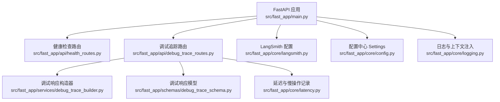
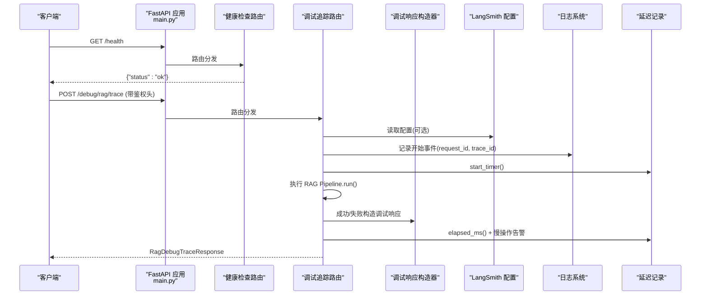
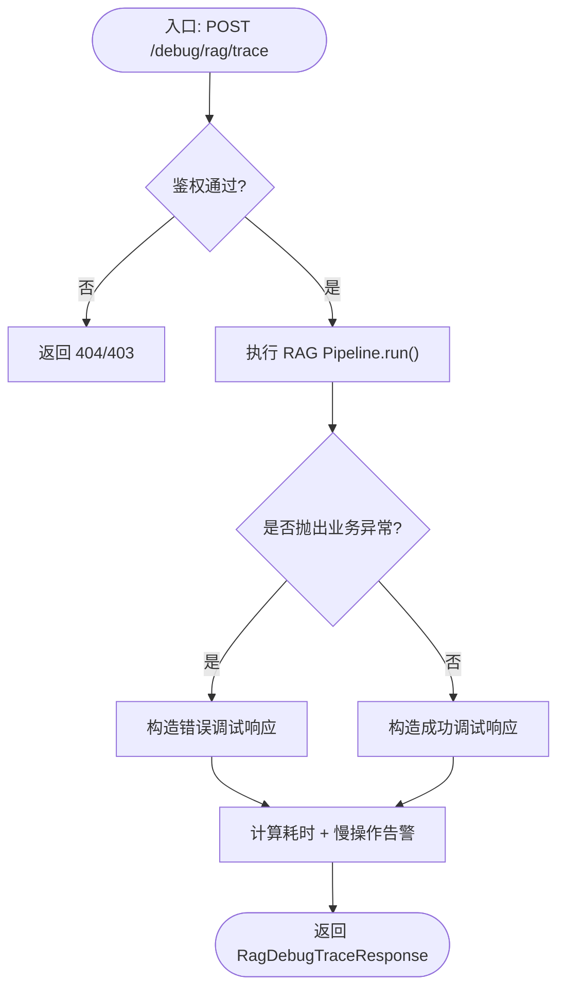
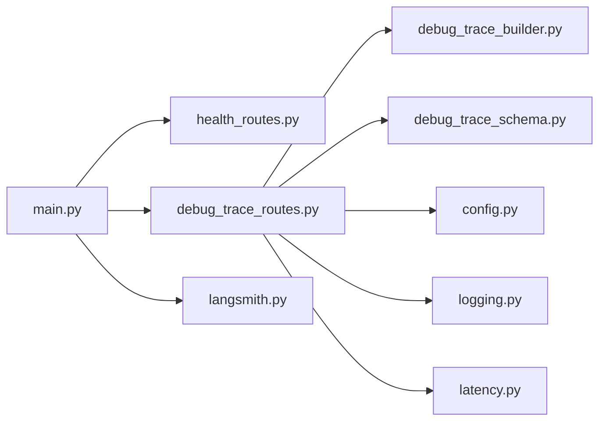

# 系统管理接口

<cite>
**本文引用的文件**
- [src/fast_app/main.py](file://src/fast_app/main.py)
- [src/fast_app/api/health_routes.py](file://src/fast_app/api/health_routes.py)
- [src/fast_app/api/debug_trace_routes.py](file://src/fast_app/api/debug_trace_routes.py)
- [src/fast_app/schemas/debug_trace_schema.py](file://src/fast_app/schemas/debug_trace_schema.py)
- [src/fast_app/services/debug_trace_builder.py](file://src/fast_app/services/debug_trace_builder.py)
- [src/fast_app/core/langsmith.py](file://src/fast_app/core/langsmith.py)
- [src/fast_app/core/config.py](file://src/fast_app/core/config.py)
- [src/fast_app/core/logging.py](file://src/fast_app/core/logging.py)
- [src/fast_app/core/latency.py](file://src/fast_app/core/latency.py)
</cite>

## 目录
1. [简介](#简介)
2. [项目结构](#项目结构)
3. [核心组件](#核心组件)
4. [架构总览](#架构总览)
5. [详细组件分析](#详细组件分析)
6. [依赖关系分析](#依赖关系分析)
7. [性能与监控](#性能与监控)
8. [故障诊断与排错指南](#故障诊断与排错指南)
9. [结论](#结论)
10. [附录：接口清单与字段说明](#附录接口清单与字段说明)

## 简介
本文件面向系统管理员与运维人员，系统化说明本项目的系统管理接口能力，包括：
- 健康检查端点及其返回格式
- 系统状态与调试追踪（RAG 链路）的查询方法
- LangSmith 追踪信息的开启、配置、查询与分析方式
- 系统性能监控与慢操作告警
- 日志收集、错误追踪与问题诊断工具使用方法

## 项目结构
系统基于 FastAPI 构建，应用启动时完成日志初始化、LangSmith 配置、外部客户端创建与资源释放；各功能以路由模块组织，并通过中间件统一处理请求上下文、大小限制与跨域。

图表来源
- [src/fast_app/main.py:132-169](file://src/fast_app/main.py#L132-L169)
- [src/fast_app/api/health_routes.py:1-11](file://src/fast_app/api/health_routes.py#L1-L11)
- [src/fast_app/api/debug_trace_routes.py:1-130](file://src/fast_app/api/debug_trace_routes.py#L1-L130)
- [src/fast_app/services/debug_trace_builder.py:1-104](file://src/fast_app/services/debug_trace_builder.py#L1-L104)
- [src/fast_app/schemas/debug_trace_schema.py:1-58](file://src/fast_app/schemas/debug_trace_schema.py#L1-L58)
- [src/fast_app/core/langsmith.py:1-604](file://src/fast_app/core/langsmith.py#L1-L604)
- [src/fast_app/core/config.py:1-800](file://src/fast_app/core/config.py#L1-L800)
- [src/fast_app/core/logging.py:1-77](file://src/fast_app/core/logging.py#L1-L77)
- [src/fast_app/core/latency.py:1-38](file://src/fast_app/core/latency.py#L1-L38)

章节来源
- [src/fast_app/main.py:132-169](file://src/fast_app/main.py#L132-L169)

## 核心组件
- 健康检查：提供轻量级存活探针，便于容器编排与健康探测。
- 调试追踪：在受控条件下执行 RAG 链路并返回结构化调试快照，包含请求参数、运行时配置、耗时、命中来源与错误信息。
- LangSmith 追踪：通过环境变量将项目配置同步至 LangChain/LangSmith SDK，支持按项目、标签、元数据过滤与检索 trace。
- 日志与上下文：为所有日志自动注入 request_id 与 trace_id，便于跨服务关联。
- 延迟与慢操作：统一计时与阈值告警，帮助定位慢调用。

章节来源
- [src/fast_app/api/health_routes.py:7-11](file://src/fast_app/api/health_routes.py#L7-L11)
- [src/fast_app/api/debug_trace_routes.py:22-130](file://src/fast_app/api/debug_trace_routes.py#L22-L130)
- [src/fast_app/core/langsmith.py:34-80](file://src/fast_app/core/langsmith.py#L34-L80)
- [src/fast_app/core/logging.py:8-77](file://src/fast_app/core/logging.py#L8-L77)
- [src/fast_app/core/latency.py:7-38](file://src/fast_app/core/latency.py#L7-L38)

## 架构总览
下图展示从请求进入 FastAPI 到健康检查与调试追踪的处理路径，以及 LangSmith 追踪的生命周期集成点。

图表来源
- [src/fast_app/main.py:132-169](file://src/fast_app/main.py#L132-L169)
- [src/fast_app/api/health_routes.py:7-11](file://src/fast_app/api/health_routes.py#L7-L11)
- [src/fast_app/api/debug_trace_routes.py:22-130](file://src/fast_app/api/debug_trace_routes.py#L22-L130)
- [src/fast_app/services/debug_trace_builder.py:14-104](file://src/fast_app/services/debug_trace_builder.py#L14-L104)
- [src/fast_app/core/langsmith.py:46-80](file://src/fast_app/core/langsmith.py#L46-L80)
- [src/fast_app/core/logging.py:59-77](file://src/fast_app/core/logging.py#L59-L77)
- [src/fast_app/core/latency.py:7-38](file://src/fast_app/core/latency.py#L7-L38)

## 详细组件分析

### 健康检查接口
- 端点：GET /health
- 作用：快速验证服务进程是否存活并可响应请求。
- 返回格式：
  - status: 字符串，当前固定为 "ok"。
- 使用建议：
  - 用于容器编排（如 Kubernetes Liveness/Readiness）、负载均衡健康探测。
  - 若需更丰富指标，可在后续扩展该端点（例如增加依赖组件健康状态）。

章节来源
- [src/fast_app/api/health_routes.py:7-11](file://src/fast_app/api/health_routes.py#L7-L11)

### 调试追踪接口（RAG 链路）
- 端点：POST /debug/rag/trace
- 鉴权：
  - 需在请求头携带 X-Debug-Trace-Token，且与服务端配置的 debug_trace_token 一致。
  - 若未启用或令牌不匹配，将返回 404 或 403。
- 请求体：复用 RAG 聊天请求模型（query、mode、top_k、candidate_k、min_score、filters 等）。
- 返回体：RagDebugTraceResponse，包含：
  - status: success 或 failed
  - request_id / trace_id: 本次请求的唯一标识
  - request: 请求参数快照
  - runtime: 运行时 provider 与模型配置快照（pipeline_provider、llm_provider、retriever/reranker 等）
  - latency_ms: 总耗时（毫秒）
  - answer_length: 回答长度（成功时有值）
  - source_count: 命中来源数量
  - sources: 命中来源快照列表（id、source、score、scores、metadata、content_preview 等）
  - error: 失败时的错误快照（code、message、error_category、error_type）
- 处理流程要点：
  - 记录开始日志（含 request_id、trace_id）
  - 执行 RAG Pipeline.run()
  - 构造成功或失败的结构化调试响应
  - 计算耗时并记录慢操作告警（基于 slow_rag_pipeline_threshold_ms）

图表来源
- [src/fast_app/api/debug_trace_routes.py:28-130](file://src/fast_app/api/debug_trace_routes.py#L28-L130)
- [src/fast_app/services/debug_trace_builder.py:38-104](file://src/fast_app/services/debug_trace_builder.py#L38-L104)
- [src/fast_app/core/latency.py:15-38](file://src/fast_app/core/latency.py#L15-L38)

章节来源
- [src/fast_app/api/debug_trace_routes.py:22-130](file://src/fast_app/api/debug_trace_routes.py#L22-L130)
- [src/fast_app/schemas/debug_trace_schema.py:8-58](file://src/fast_app/schemas/debug_trace_schema.py#L8-L58)
- [src/fast_app/services/debug_trace_builder.py:14-104](file://src/fast_app/services/debug_trace_builder.py#L14-L104)

### LangSmith 追踪配置与使用
- 开关与凭证：
  - 需要同时满足 langsmith_tracing=true 且 langsmith_api_key 非空才会真正写入远端。
  - 应用启动时会把配置同步到环境变量（LANGSMITH_TRACING、LANGCHAIN_TRACING_V2、LANGSMITH_API_KEY、LANGSMITH_ENDPOINT、LANGSMITH_PROJECT）。
- 元数据与脱敏：
  - 默认对敏感字段进行脱敏（如 query、filters、user_id、sql 等），可通过 langsmith_include_sensitive_data 控制是否上传完整敏感数据。
  - 统一的 metadata 包含 request_id、trace_id、app_name、app_env 及 pipeline/provider/model 等信息，便于本地日志与 LangSmith trace 关联。
- 标签与过滤：
  - tags 包含 env、operation、pipeline、llm 等短标签，便于在 UI 中快速筛选。
- 使用建议：
  - 在 .env 中设置 LANGSMITH_TRACING、LANGSMITH_API_KEY、LANGSMITH_PROJECT 等。
  - 结合 request_id/trace_id 在本地日志与 LangSmith 中交叉定位问题。
  - 生产环境谨慎开启敏感数据上传。

章节来源
- [src/fast_app/core/langsmith.py:34-80](file://src/fast_app/core/langsmith.py#L34-L80)
- [src/fast_app/core/langsmith.py:83-134](file://src/fast_app/core/langsmith.py#L83-L134)
- [src/fast_app/core/config.py:86-102](file://src/fast_app/core/config.py#L86-L102)

### 日志与上下文
- 启动时调用 setup_logging，设置日志级别与格式，并为根 logger 注入 RequestContextFilter。
- 每个日志自动附带 request_id 与 trace_id，便于跨层、跨服务追踪。
- format_log_fields 将复杂类型规范化为 JSON 字符串，避免换行破坏日志行。

章节来源
- [src/fast_app/core/logging.py:8-77](file://src/fast_app/core/logging.py#L8-L77)

### 延迟与慢操作告警
- 统一计时：start_timer/elapsed_ms 提供高精度耗时统计。
- 慢操作告警：log_slow_operation 根据阈值（如 slow_rag_pipeline_threshold_ms）输出警告日志，便于发现性能瓶颈。

章节来源
- [src/fast_app/core/latency.py:7-38](file://src/fast_app/core/latency.py#L7-L38)

## 依赖关系分析
- 应用主入口负责：
  - 注册中间件（CORS、请求大小限制、请求 ID 注入）
  - 注册异常处理器
  - 挂载各路由（健康检查、调试追踪、RAG、流式、NL2SQL 等）
- 调试追踪依赖：
  - 配置中心（Settings）获取开关与阈值
  - 日志系统记录关键事件
  - 延迟工具统计耗时
  - 响应构造器生成标准化调试结果
- LangSmith 依赖：
  - 配置中心决定是否启用与如何脱敏
  - 通过环境变量与 SDK 对接

图表来源
- [src/fast_app/main.py:132-169](file://src/fast_app/main.py#L132-L169)
- [src/fast_app/api/debug_trace_routes.py:1-130](file://src/fast_app/api/debug_trace_routes.py#L1-L130)
- [src/fast_app/services/debug_trace_builder.py:1-104](file://src/fast_app/services/debug_trace_builder.py#L1-L104)
- [src/fast_app/schemas/debug_trace_schema.py:1-58](file://src/fast_app/schemas/debug_trace_schema.py#L1-L58)
- [src/fast_app/core/config.py:1-800](file://src/fast_app/core/config.py#L1-L800)
- [src/fast_app/core/logging.py:1-77](file://src/fast_app/core/logging.py#L1-L77)
- [src/fast_app/core/latency.py:1-38](file://src/fast_app/core/latency.py#L1-L38)
- [src/fast_app/core/langsmith.py:1-604](file://src/fast_app/core/langsmith.py#L1-L604)

## 性能与监控
- 慢操作阈值：
  - HTTP 慢请求阈值：slow_http_request_threshold_ms
  - RAG 链路慢阈值：slow_rag_pipeline_threshold_ms
  - 检索/重排/LLM 等细分阈值可分别配置
- 监控建议：
  - 关注日志中的 slow_operation 事件，结合 request_id/trace_id 定位具体请求。
  - 在 LangSmith 中按 tags（如 pipeline、operation、llm）过滤 trace，对比不同配置下的耗时与命中率。
  - 通过调试接口的 latency_ms 与 source_count 评估检索质量与性能。

章节来源
- [src/fast_app/core/config.py:33-52](file://src/fast_app/core/config.py#L33-L52)
- [src/fast_app/core/latency.py:15-38](file://src/fast_app/core/latency.py#L15-L38)
- [src/fast_app/api/debug_trace_routes.py:120-128](file://src/fast_app/api/debug_trace_routes.py#L120-L128)

## 故障诊断与排错指南
- 无法访问调试接口：
  - 确认已启用 DEBUG_TRACE_ENABLED 且设置了正确的 DEBUG_TRACE_TOKEN。
  - 检查请求头 X-Debug-Trace-Token 是否与配置一致。
- 调试接口返回失败：
  - 查看 RagDebugTraceResponse.error 中的 code、message、error_category、error_type。
  - 结合 request_id/trace_id 在日志中搜索对应事件（debug.trace.start/failed/finish）。
- 性能问题定位：
  - 观察 latency_ms 是否超过 slow_rag_pipeline_threshold_ms。
  - 在 LangSmith 中查看 step 级 trace，识别检索、重排、LLM 等阶段的耗时分布。
- 日志缺失或无法关联：
  - 确认应用启动时已调用 setup_logging。
  - 检查日志格式是否包含 request_id 与 trace_id。

章节来源
- [src/fast_app/api/debug_trace_routes.py:28-130](file://src/fast_app/api/debug_trace_routes.py#L28-L130)
- [src/fast_app/services/debug_trace_builder.py:73-104](file://src/fast_app/services/debug_trace_builder.py#L73-L104)
- [src/fast_app/core/logging.py:59-77](file://src/fast_app/core/logging.py#L59-L77)

## 结论
本项目提供了简洁的健康检查与强大的调试追踪能力，配合 LangSmith 追踪、结构化日志与慢操作告警，形成完整的系统管理与问题诊断闭环。建议在生产环境中：
- 保持健康检查可用，用于自动化巡检
- 按需启用调试追踪并严格保护令牌
- 合理配置 LangSmith 追踪与脱敏策略
- 持续监控慢操作与关键指标，结合 request_id/trace_id 快速定位问题

## 附录：接口清单与字段说明

### 健康检查
- 端点：GET /health
- 返回字段：
  - status: 字符串，示例 "ok"

章节来源
- [src/fast_app/api/health_routes.py:7-11](file://src/fast_app/api/health_routes.py#L7-L11)

### 调试追踪
- 端点：POST /debug/rag/trace
- 请求头：
  - X-Debug-Trace-Token: 必须与服务端配置一致
- 请求体：RagChatRequest（query、mode、top_k、candidate_k、min_score、filters）
- 返回体：RagDebugTraceResponse
  - status: "success" | "failed"
  - request_id / trace_id: 字符串
  - request: DebugTraceRequestSnapshot
    - query、mode、top_k、candidate_k、min_score、filters
  - runtime: DebugTraceRuntimeSnapshot
    - pipeline_provider、llm_provider、llm_model_name、vector_retriever_provider、keyword_retriever_provider、reranker_provider、rerank_model_name、langsmith_project
  - latency_ms: 浮点数（毫秒）
  - answer_length: 整数（成功时有值）
  - source_count: 整数
  - sources: DebugTraceSourceSnapshot[]
    - id、source、retrieval_sources、title、section_path、score、scores、metadata、content_preview
  - error: DebugTraceErrorSnapshot（失败时有值）
    - code、message、error_category、error_type

章节来源
- [src/fast_app/api/debug_trace_routes.py:43-130](file://src/fast_app/api/debug_trace_routes.py#L43-L130)
- [src/fast_app/schemas/debug_trace_schema.py:8-58](file://src/fast_app/schemas/debug_trace_schema.py#L8-L58)
- [src/fast_app/services/debug_trace_builder.py:14-104](file://src/fast_app/services/debug_trace_builder.py#L14-L104)

### LangSmith 追踪
- 环境变量（由应用启动时设置）：
  - LANGSMITH_TRACING、LANGCHAIN_TRACING_V2、LANGSMITH_API_KEY、LANGSMITH_ENDPOINT、LANGSMITH_PROJECT
- 关键配置项（Settings）：
  - langsmith_tracing、langsmith_api_key、langsmith_endpoint、langsmith_project、langsmith_tags、langsmith_include_sensitive_data
- 使用建议：
  - 在 .env 中设置上述变量
  - 通过 request_id/trace_id 关联本地日志与 LangSmith trace
  - 谨慎开启敏感数据上传

章节来源
- [src/fast_app/core/langsmith.py:34-80](file://src/fast_app/core/langsmith.py#L34-L80)
- [src/fast_app/core/config.py:86-102](file://src/fast_app/core/config.py#L86-L102)