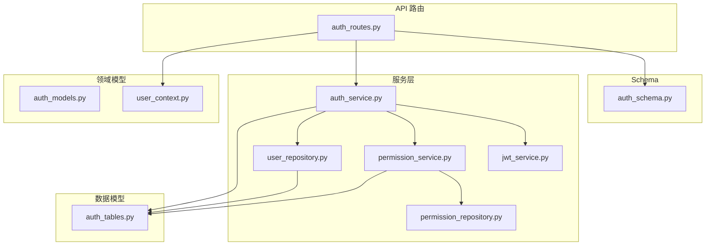
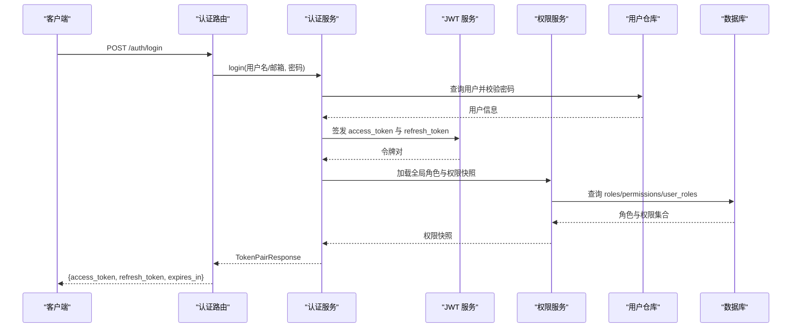
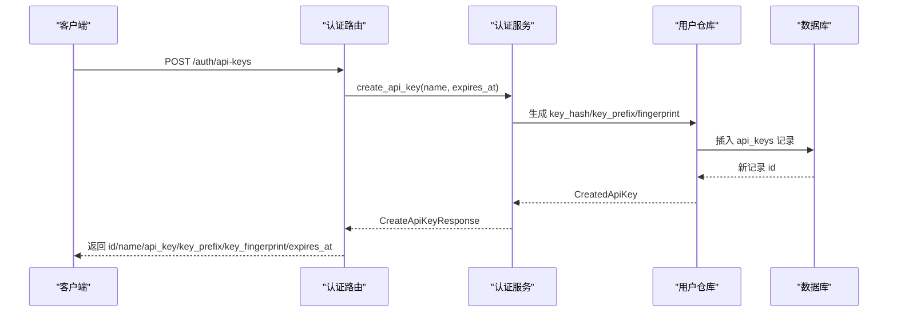
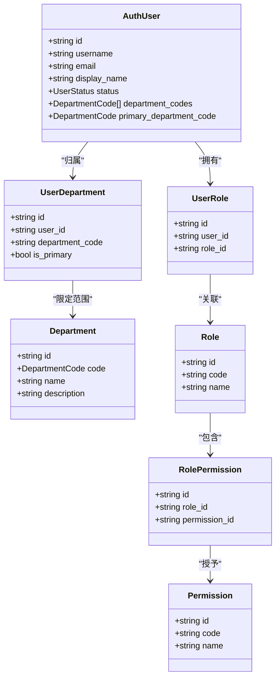
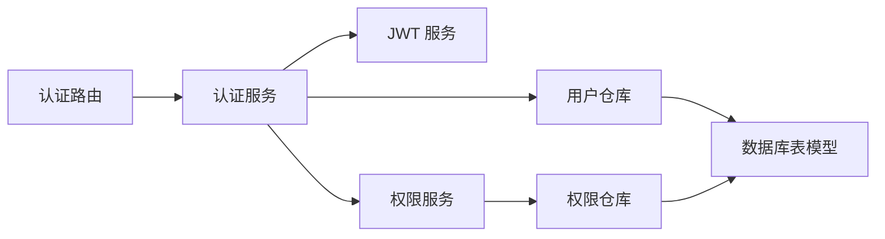

# 认证授权接口

<cite>
**本文引用的文件**
- [auth_routes.py](file://src/fast_app/api/auth_routes.py)
- [auth_schema.py](file://src/fast_app/schemas/auth_schema.py)
- [auth_models.py](file://src/fast_app/domain/auth_models.py)
- [user_context.py](file://src/fast_app/domain/user_context.py)
- [auth_tables.py](file://src/fast_app/db/auth_tables.py)
- [auth_service.py](file://src/fast_app/services/auth/auth_service.py)
- [jwt_service.py](file://src/fast_app/services/auth/jwt_service.py)
- [permission_repository.py](file://src/fast_app/services/auth/permission_repository.py)
- [permission_service.py](file://src/fast_app/services/auth/permission_service.py)
- [user_repository.py](file://src/fast_app/services/auth/user_repository.py)
</cite>

## 目录
1. [简介](#简介)
2. [项目结构](#项目结构)
3. [核心组件](#核心组件)
4. [架构总览](#架构总览)
5. [详细组件分析](#详细组件分析)
6. [依赖关系分析](#依赖关系分析)
7. [性能考虑](#性能考虑)
8. [故障排查指南](#故障排查指南)
9. [结论](#结论)
10. [附录：前端集成与调用示例](#附录前端集成与调用示例)

## 简介
本文件面向前后端开发者，系统化说明系统的认证与授权能力，包括：
- JWT 令牌的获取、刷新与验证流程
- API Key 的创建、列表、撤销与使用方式
- 用户登录、当前用户信息、权限检查等端点
- Bearer Token 与 API Key 的传递方式
- RBAC 全局角色与权限模型，以及部门级 ACL（访问控制列表）的使用
- 错误处理与常见问题的定位方法
- 前端集成的准确步骤与注意事项

## 项目结构
认证授权相关代码主要分布在以下模块：
- API 路由层：定义 HTTP 端点与请求/响应契约
- Schema 层：定义请求体、响应体的字段约束
- 领域模型层：定义用户、部门、凭证、令牌等核心业务对象
- 服务层：封装认证、JWT、权限校验、用户与权限仓库调用
- 数据库表模型：持久化用户、角色、权限、API Key、Refresh Token、部门及关系表

图表来源
- [auth_routes.py:1-112](file://src/fast_app/api/auth_routes.py#L1-L112)
- [auth_schema.py:1-123](file://src/fast_app/schemas/auth_schema.py#L1-L123)
- [auth_models.py:1-158](file://src/fast_app/domain/auth_models.py#L1-L158)
- [user_context.py:1-55](file://src/fast_app/domain/user_context.py#L1-L55)
- [auth_service.py](file://src/fast_app/services/auth/auth_service.py)
- [jwt_service.py](file://src/fast_app/services/auth/jwt_service.py)
- [permission_service.py](file://src/fast_app/services/auth/permission_service.py)
- [permission_repository.py](file://src/fast_app/services/auth/permission_repository.py)
- [user_repository.py](file://src/fast_app/services/auth/user_repository.py)
- [auth_tables.py:1-431](file://src/fast_app/db/auth_tables.py#L1-L431)

章节来源
- [auth_routes.py:1-112](file://src/fast_app/api/auth_routes.py#L1-L112)
- [auth_schema.py:1-123](file://src/fast_app/schemas/auth_schema.py#L1-L123)
- [auth_models.py:1-158](file://src/fast_app/domain/auth_models.py#L1-L158)
- [user_context.py:1-55](file://src/fast_app/domain/user_context.py#L1-L55)
- [auth_tables.py:1-431](file://src/fast_app/db/auth_tables.py#L1-L431)

## 核心组件
- 认证路由：提供登录、刷新、当前用户、API Key 管理等端点
- 认证服务：统一编排登录、刷新、API Key 生命周期、权限上下文构建
- JWT 服务：签发、校验、解析 access token；支持审计字段 token_id
- 权限服务与仓库：从 RBAC 表计算全局角色与权限快照，并注入到用户上下文
- 用户仓库：查询用户、部门、角色、权限等信息
- 领域模型与上下文：描述用户、部门、凭证、令牌、当前请求上下文
- 数据库表：用户、部门、角色、权限、API Key、Refresh Token 及其关系

章节来源
- [auth_routes.py:1-112](file://src/fast_app/api/auth_routes.py#L1-L112)
- [auth_service.py](file://src/fast_app/services/auth/auth_service.py)
- [jwt_service.py](file://src/fast_app/services/auth/jwt_service.py)
- [permission_service.py](file://src/fast_app/services/auth/permission_service.py)
- [permission_repository.py](file://src/fast_app/services/auth/permission_repository.py)
- [user_repository.py](file://src/fast_app/services/auth/user_repository.py)
- [auth_models.py:1-158](file://src/fast_app/domain/auth_models.py#L1-L158)
- [user_context.py:1-55](file://src/fast_app/domain/user_context.py#L1-L55)
- [auth_tables.py:1-431](file://src/fast_app/db/auth_tables.py#L1-L431)

## 架构总览
系统采用分层架构：
- 路由层暴露 RESTful 接口，负责参数校验与响应建模
- 服务层实现认证与授权的核心逻辑，协调 JWT、权限、用户数据
- 领域模型与上下文承载身份与权限快照，供后续业务使用
- 数据层通过 ORM 映射到关系型数据库，存储用户、角色、权限、凭证等

图表来源
- [auth_routes.py:22-44](file://src/fast_app/api/auth_routes.py#L22-L44)
- [auth_service.py](file://src/fast_app/services/auth/auth_service.py)
- [jwt_service.py](file://src/fast_app/services/auth/jwt_service.py)
- [permission_service.py](file://src/fast_app/services/auth/permission_service.py)
- [user_repository.py](file://src/fast_app/services/auth/user_repository.py)
- [auth_tables.py:13-64](file://src/fast_app/db/auth_tables.py#L13-L64)

## 详细组件分析

### 认证路由与端点
- 登录
  - 方法：POST
  - URL：/auth/login
  - 请求体：username_or_email、password
  - 响应：access_token、refresh_token、token_type、expires_in
  - 说明：成功后返回短期 access token 与长期 refresh token
- 刷新令牌
  - 方法：POST
  - URL：/auth/refresh
  - 请求体：refresh_token
  - 响应：新的 access_token 与 refresh_token
  - 说明：用于轮换凭证，避免频繁重新登录
- 当前用户
  - 方法：GET
  - URL：/auth/me
  - 鉴权：需要已认证（Bearer Token 或 API Key）
  - 响应：用户 ID、是否已认证、认证来源、全局角色与权限快照、部门范围、展示信息等
- 创建 API Key
  - 方法：POST
  - URL：/auth/api-keys
  - 鉴权：需要已认证
  - 请求体：name、可选 expires_at
  - 响应：id、name、一次性返回的完整 api_key、key_prefix、key_fingerprint、expires_at
- 列出 API Key
  - 方法：GET
  - URL：/auth/api-keys
  - 鉴权：需要已认证
  - 响应：仅摘要信息（不包含明文 key），包含状态、过期时间、最近使用时间等
- 撤销 API Key
  - 方法：DELETE
  - URL：/auth/api-keys/{api_key_id}
  - 鉴权：需要已认证
  - 响应：被撤销的 api_key_id 与是否成功标记

章节来源
- [auth_routes.py:22-108](file://src/fast_app/api/auth_routes.py#L22-L108)
- [auth_schema.py:8-123](file://src/fast_app/schemas/auth_schema.py#L8-L123)

### 令牌获取与刷新流程
- 登录流程
  - 客户端提交用户名/邮箱与密码
  - 服务端校验用户与密码，签发 access_token 与 refresh_token
  - 同时加载用户的全局角色与权限快照，写入后续请求的用户上下文
- 刷新流程
  - 客户端携带 refresh_token 请求刷新
  - 服务端校验 refresh_token 有效性（状态、过期时间）
  - 签发新的 access_token 与 refresh_token，并更新最后使用时间
- 验证流程
  - 受保护接口优先解析 Authorization: Bearer <access_token>
  - 若未携带 Bearer，可尝试解析 API Key（详见“认证来源与传递方式”）
  - 解析成功后，将用户上下文注入到请求中，供业务使用

```mermaid
flowchart TD
Start(["开始"]) --> Login["登录：提交用户名/邮箱与密码"]
Login --> Validate{"用户存在且密码正确？"}
Validate --> |否| ErrLogin["返回认证失败"]
Validate --> |是| IssueTokens["签发 access_token 与 refresh_token"]
IssueTokens --> LoadPerms["加载全局角色与权限快照"]
LoadPerms --> ReturnTokens["返回令牌对"]
ReturnTokens --> End(["结束"])
ErrLogin --> End
```

图表来源
- [auth_routes.py:22-44](file://src/fast_app/api/auth_routes.py#L22-L44)
- [auth_service.py](file://src/fast_app/services/auth/auth_service.py)
- [jwt_service.py](file://src/fast_app/services/auth/jwt_service.py)
- [permission_service.py](file://src/fast_app/services/auth/permission_service.py)

章节来源
- [auth_routes.py:22-44](file://src/fast_app/api/auth_routes.py#L22-L44)
- [auth_schema.py:8-40](file://src/fast_app/schemas/auth_schema.py#L8-L40)

### API Key 的创建与管理机制
- 创建
  - 仅创建时返回一次完整明文 api_key
  - 数据库保存 key_hash、key_prefix、key_fingerprint，不保存明文
  - 支持设置过期时间
- 列表
  - 仅返回摘要信息（id、name、key_prefix、key_fingerprint、status、expires_at、last_used_at、created_at、revoked_at）
- 撤销
  - 将状态标记为 revoked，后续请求拒绝使用该 key
  - 记录撤销时间，便于审计

图表来源
- [auth_routes.py:56-69](file://src/fast_app/api/auth_routes.py#L56-L69)
- [auth_schema.py:65-90](file://src/fast_app/schemas/auth_schema.py#L65-L90)
- [auth_tables.py:322-368](file://src/fast_app/db/auth_tables.py#L322-L368)

章节来源
- [auth_routes.py:56-108](file://src/fast_app/api/auth_routes.py#L56-L108)
- [auth_schema.py:65-110](file://src/fast_app/schemas/auth_schema.py#L65-L110)
- [auth_tables.py:322-368](file://src/fast_app/db/auth_tables.py#L322-L368)

### 权限检查与 RBAC 模型
- 全局角色与权限
  - 用户通过 user_roles 关联 roles
  - roles 通过 role_permissions 关联 permissions
  - 认证阶段实时展开为用户的 global_role_codes 与 global_permission_codes
- 部门级 ACL
  - 用户通过 user_departments 关联 departments，获得 department_codes 与 primary_department_code
  - 知识库检索等业务可根据 department_codes 进行资源过滤
- 上下文使用
  - CurrentUserContext 提供 has_global_role、has_global_permission 便捷判断
  - 业务层可直接基于这些快照做细粒度授权

图表来源
- [auth_models.py:41-82](file://src/fast_app/domain/auth_models.py#L41-L82)
- [auth_tables.py:66-131](file://src/fast_app/db/auth_tables.py#L66-L131)
- [auth_tables.py:134-275](file://src/fast_app/db/auth_tables.py#L134-L275)

章节来源
- [user_context.py:9-55](file://src/fast_app/domain/user_context.py#L9-L55)
- [auth_models.py:41-82](file://src/fast_app/domain/auth_models.py#L41-L82)
- [auth_tables.py:66-131](file://src/fast_app/db/auth_tables.py#L66-L131)
- [auth_tables.py:134-275](file://src/fast_app/db/auth_tables.py#L134-L275)

### 认证来源与传递方式
- Bearer Token
  - 在请求头中设置 Authorization: Bearer <access_token>
  - 适用于 Web、移动端、后端服务间调用
- API Key
  - 通过特定请求头传递（例如 X-API-Key 或 Authorization: ApiKey <api_key>，具体由依赖解析器决定）
  - 适用于程序化访问、脚本、第三方系统集成
- 当前用户上下文
  - 无论哪种认证方式，最终都会解析为统一的 CurrentUserContext
  - 可通过 /auth/me 查看当前用户的认证来源、角色与权限快照

章节来源
- [auth_schema.py:43-63](file://src/fast_app/schemas/auth_schema.py#L43-L63)
- [user_context.py:9-55](file://src/fast_app/domain/user_context.py#L9-L55)

### 错误处理与常见问题
- 登录失败
  - 用户名/邮箱不存在或密码错误
  - 账号状态为禁用
- 刷新失败
  - refresh_token 无效、过期或被撤销
- API Key 管理
  - 名称为空或非法
  - 目标 API Key 不属于当前用户或已被撤销
- 权限不足
  - 缺少所需全局角色或权限
  - 不在允许的部门范围内
- 建议
  - 前端应捕获 401/403 并提示重新登录或申请权限
  - 对敏感操作增加二次确认与审计日志

章节来源
- [auth_routes.py:22-108](file://src/fast_app/api/auth_routes.py#L22-L108)
- [auth_schema.py:8-123](file://src/fast_app/schemas/auth_schema.py#L8-L123)
- [auth_models.py:9-25](file://src/fast_app/domain/auth_models.py#L9-L25)

## 依赖关系分析
- 路由依赖服务：认证路由通过依赖注入获取 AuthService，并复用用户上下文依赖
- 服务依赖仓库与服务：AuthService 组合 JWT 服务、权限服务、用户仓库
- 权限与用户数据：权限服务与用户仓库通过 ORM 访问数据库表模型
- 上下文传播：CurrentUserContext 贯穿请求链路，供业务层直接判断权限

图表来源
- [auth_routes.py:1-17](file://src/fast_app/api/auth_routes.py#L1-L17)
- [auth_service.py](file://src/fast_app/services/auth/auth_service.py)
- [jwt_service.py](file://src/fast_app/services/auth/jwt_service.py)
- [permission_service.py](file://src/fast_app/services/auth/permission_service.py)
- [permission_repository.py](file://src/fast_app/services/auth/permission_repository.py)
- [user_repository.py](file://src/fast_app/services/auth/user_repository.py)
- [auth_tables.py:1-431](file://src/fast_app/db/auth_tables.py#L1-L431)

章节来源
- [auth_routes.py:1-17](file://src/fast_app/api/auth_routes.py#L1-L17)
- [auth_service.py](file://src/fast_app/services/auth/auth_service.py)
- [auth_tables.py:1-431](file://src/fast_app/db/auth_tables.py#L1-L431)

## 性能考虑
- 令牌缓存
  - access_token 短效，减少服务端校验负担
  - refresh_token 长效但需定期轮换，降低泄露风险
- 权限快照
  - 在认证阶段计算并缓存到用户上下文，避免每次请求重复查库
- 数据库索引
  - 用户、角色、权限、API Key、Refresh Token 均有关键索引，提升查询效率
- 并发与限流
  - 对登录与刷新接口建议加限流，防止暴力破解
- 审计与监控
  - 记录 last_used_at、revoked_at、token_id 等字段，便于追踪与分析

[本节为通用指导，不直接分析具体文件]

## 故障排查指南
- 无法登录
  - 检查用户名/邮箱是否存在、密码是否正确、账号状态是否为 active
  - 查看用户仓库查询与密码校验逻辑
- 刷新失败
  - 检查 refresh_token 是否有效、是否过期、是否被撤销
  - 核对 RefreshTokenTable 的状态与过期时间
- API Key 无效
  - 检查 key_hash 匹配、状态是否为 active、是否过期
  - 核对 ApiKeyTable 的 key_prefix、key_fingerprint、last_used_at
- 权限不足
  - 检查 user_roles、role_permissions、user_departments 配置
  - 查看 CurrentUserContext 中的 global_role_codes、global_permission_codes、department_codes
- 建议工具
  - 使用 /auth/me 验证当前用户上下文
  - 结合日志与审计字段定位问题

章节来源
- [auth_tables.py:322-416](file://src/fast_app/db/auth_tables.py#L322-L416)
- [user_context.py:9-55](file://src/fast_app/domain/user_context.py#L9-L55)
- [auth_models.py:84-129](file://src/fast_app/domain/auth_models.py#L84-L129)

## 结论
本系统提供了完善的认证与授权能力：
- 通过 JWT 与 API Key 双通道认证，满足不同场景需求
- 通过 RBAC 与部门级 ACL，实现细粒度的权限控制
- 通过统一的 CurrentUserContext，简化业务层的权限判断
- 通过完善的错误处理与审计字段，保障安全与可追溯性

[本节为总结，不直接分析具体文件]

## 附录：前端集成与调用示例
- 登录
  - 调用 POST /auth/login，提交 username_or_email 与 password
  - 保存返回的 access_token 与 refresh_token
  - 后续请求在 Authorization 头添加 Bearer Token
- 刷新令牌
  - 当 access_token 即将过期或失效时，调用 POST /auth/refresh
  - 使用 refresh_token 换取新的令牌对
- 获取当前用户
  - 调用 GET /auth/me，验证当前用户上下文与权限
- 管理 API Key
  - 创建：POST /auth/api-keys，保存一次性返回的 api_key
  - 列表：GET /auth/api-keys，查看摘要信息
  - 撤销：DELETE /auth/api-keys/{api_key_id}，及时回收不再使用的凭证
- 传递方式
  - Bearer Token：Authorization: Bearer <access_token>
  - API Key：按依赖解析器要求传递（如 X-API-Key 或 Authorization: ApiKey <api_key>）
- 错误处理
  - 401 未认证：提示重新登录或刷新令牌
  - 403 无权限：提示申请权限或切换账号
  - 其他错误：根据响应消息提示用户或重试

章节来源
- [auth_routes.py:22-108](file://src/fast_app/api/auth_routes.py#L22-L108)
- [auth_schema.py:8-123](file://src/fast_app/schemas/auth_schema.py#L8-L123)
- [user_context.py:9-55](file://src/fast_app/domain/user_context.py#L9-L55)