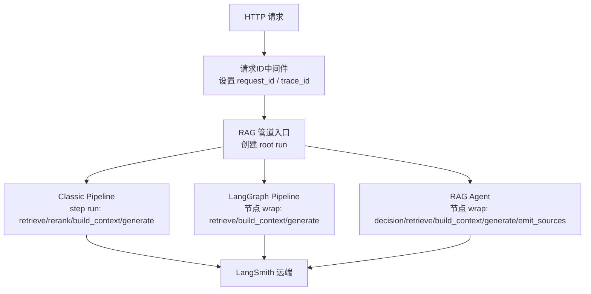
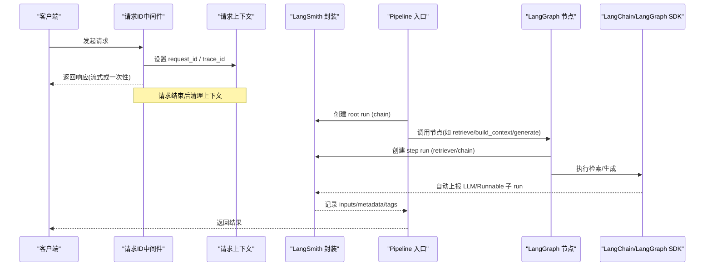
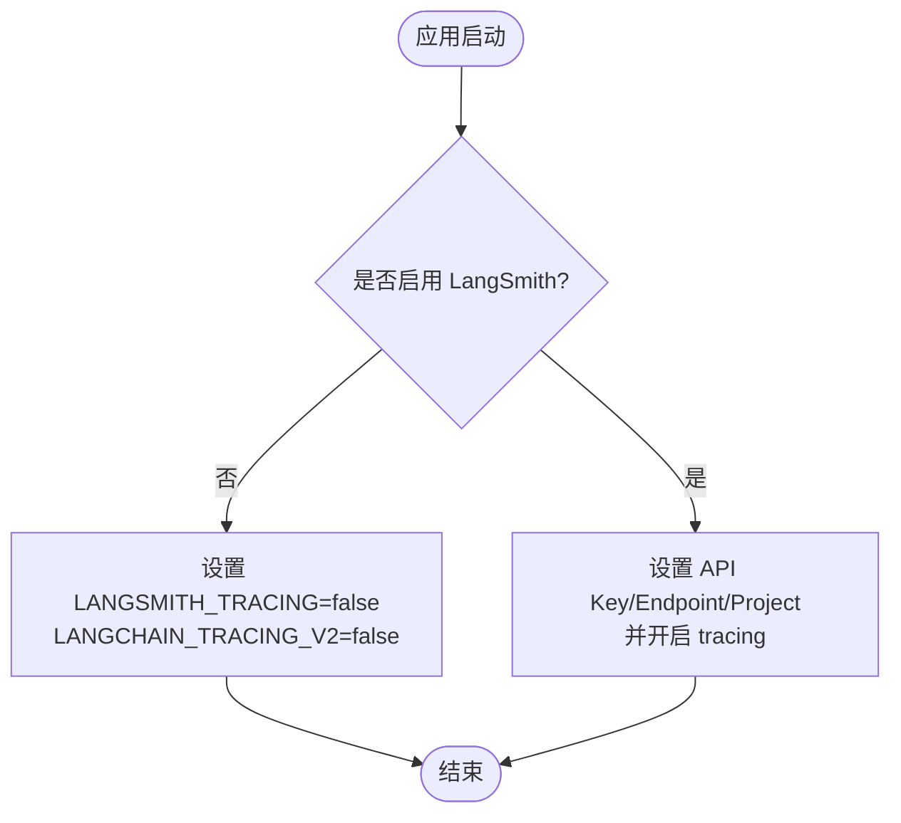
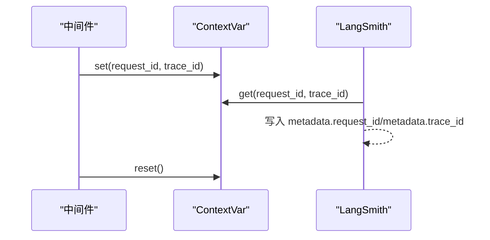
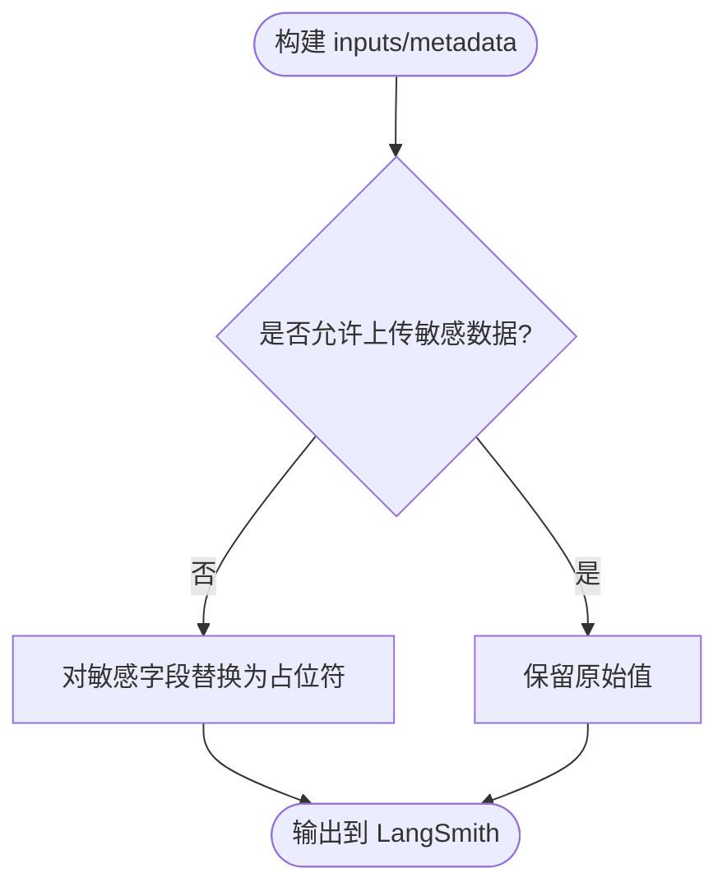
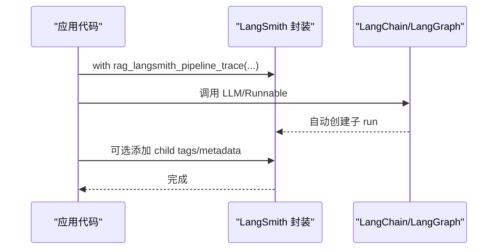
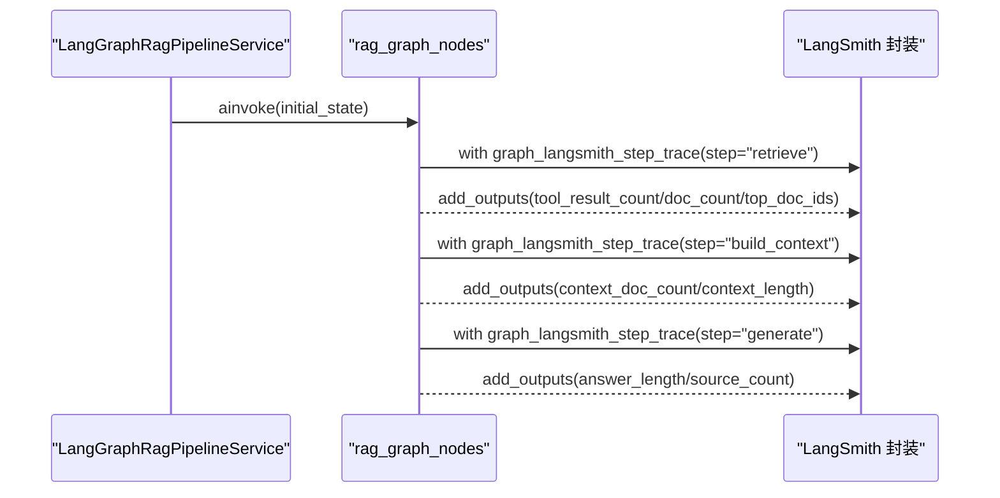
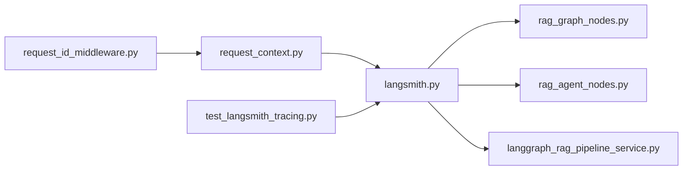

# LangSmith 追踪集成

<cite>
**本文引用的文件**
- [src/fast_app/core/langsmith.py](file://src/fast_app/core/langsmith.py)
- [src/fast_app/core/config.py](file://src/fast_app/core/config.py)
- [src/fast_app/core/request_context.py](file://src/fast_app/core/request_context.py)
- [src/fast_app/middlewares/request_id_middleware.py](file://src/fast_app/middlewares/request_id_middleware.py)
- [src/fast_app/graph/rag/rag_graph_nodes.py](file://src/fast_app/graph/rag/rag_graph_nodes.py)
- [src/fast_app/graph/rag/rag_graph_state.py](file://src/fast_app/graph/rag/rag_graph_state.py)
- [src/fast_app/services/rag/langgraph_rag_pipeline_service.py](file://src/fast_app/services/rag/langgraph_rag_pipeline_service.py)
- [src/fast_app/services/rag/rag_agent_pipeline_service.py](file://src/fast_app/services/rag/rag_agent_pipeline_service.py)
- [src/fast_app/graph/rag_agent/rag_agent_nodes.py](file://src/fast_app/graph/rag_agent/rag_agent_nodes.py)
- [scripts/tests/integrations/test_langsmith_tracing.py](file://scripts/tests/integrations/test_langsmith_tracing.py)
- [learning-docs/phase-12/12-7-LangSmith-Python接入+知识点讲解.md](file://learning-docs/phase-12/12-7-LangSmith-Python接入+知识点讲解.md)
- [learning-docs/phase-12/12-8-Classic Pipeline与LangGraph Pipeline的trace对齐.md](file://learning-docs/phase-12/12-8-Classic Pipeline与LangGraph Pipeline的trace对齐.md)
</cite>

## 目录
1. [简介](#简介)
2. [项目结构](#项目结构)
3. [核心组件](#核心组件)
4. [架构总览](#架构总览)
5. [详细组件分析](#详细组件分析)
6. [依赖关系分析](#依赖关系分析)
7. [性能考虑](#性能考虑)
8. [故障排查指南](#故障排查指南)
9. [结论](#结论)
10. [附录：配置与使用模式](#附录配置与使用模式)

## 简介
本文件面向开发者，系统性说明如何在当前 RAG 工程中启用并规范使用 LangSmith 追踪。内容覆盖：
- 环境配置与开关控制
- 追踪上下文管理（request_id、trace_id）
- 敏感数据脱敏策略
- trace ID 传递机制
- RAG Pipeline 根运行与步骤运行的创建方法
- metadata 与 tags 的标准格式
- LangChain/LangGraph 子调用的上下文继承
- Classic Pipeline、LangGraph Pipeline、RAG Agent 的追踪实现
- 追踪数据的收集、分析与调试实践

## 项目结构
LangSmith 追踪能力集中在 core 层，并在各 Pipeline 节点中按统一规范注入 step run；HTTP 中间件负责 request_id/trace_id 的上下文设置；测试脚本验证输入脱敏与标签一致性。



**图表来源**
- [src/fast_app/middlewares/request_id_middleware.py:74-97](file://src/fast_app/middlewares/request_id_middleware.py#L74-L97)
- [src/fast_app/core/langsmith.py:221-240](file://src/fast_app/core/langsmith.py#L221-L240)
- [src/fast_app/graph/rag/rag_graph_nodes.py:427-589](file://src/fast_app/graph/rag/rag_graph_nodes.py#L427-L589)
- [src/fast_app/graph/rag_agent/rag_agent_nodes.py:322-354](file://src/fast_app/graph/rag_agent/rag_agent_nodes.py#L322-L354)

**章节来源**
- [src/fast_app/core/langsmith.py:221-240](file://src/fast_app/core/langsmith.py#L221-L240)
- [src/fast_app/middlewares/request_id_middleware.py:74-97](file://src/fast_app/middlewares/request_id_middleware.py#L74-L97)

## 核心组件
- 配置与环境同步：将 Pydantic Settings 中的 LangSmith 配置写入进程环境变量，统一开启/关闭 tracing。
- 元数据与标签构造：为所有 trace 提供统一的 metadata/tags，包含 request_id、trace_id、pipeline_provider、operation、llm 等。
- 脱敏策略：默认对敏感字段进行脱敏，仅在显式开关下上传真实值。
- 根运行与步骤运行：为 RAG Pipeline 提供统一的 root run 和 step run 封装，支持 Classic、LangGraph、RAG Agent 三种场景。
- 上下文传播：通过 ContextVar 在异步调用链中传递 request_id 与 trace_id，确保 LangSmith 子调用可关联到同一请求。

**章节来源**
- [src/fast_app/core/langsmith.py:46-80](file://src/fast_app/core/langsmith.py#L46-L80)
- [src/fast_app/core/langsmith.py:83-107](file://src/fast_app/core/langsmith.py#L83-L107)
- [src/fast_app/core/langsmith.py:109-162](file://src/fast_app/core/langsmith.py#L109-L162)
- [src/fast_app/core/request_context.py:1-38](file://src/fast_app/core/request_context.py#L1-L38)

## 架构总览
下图展示一次 RAG 请求从 HTTP 进入，到创建 LangSmith root run，再到各 Pipeline 节点创建 step run，最终由 LangChain/LangGraph 自动上报 LLM 子调用的完整链路。



**图表来源**
- [src/fast_app/middlewares/request_id_middleware.py:74-97](file://src/fast_app/middlewares/request_id_middleware.py#L74-L97)
- [src/fast_app/core/langsmith.py:221-240](file://src/fast_app/core/langsmith.py#L221-L240)
- [src/fast_app/graph/rag/rag_graph_nodes.py:427-589](file://src/fast_app/graph/rag/rag_graph_nodes.py#L427-L589)

## 详细组件分析

### 配置与环境同步
- 通过配置项判断是否启用 LangSmith，并将相关环境变量写入进程环境，兼容 LangChain/LangGraph 的 tracing 开关。
- 未启用时显式关闭 tracing，避免误写远端。



**图表来源**
- [src/fast_app/core/langsmith.py:46-80](file://src/fast_app/core/langsmith.py#L46-L80)

**章节来源**
- [src/fast_app/core/langsmith.py:46-80](file://src/fast_app/core/langsmith.py#L46-L80)
- [src/fast_app/core/config.py](file://src/fast_app/core/config.py)

### 追踪上下文管理与 trace ID 传递
- 使用 ContextVar 维护 request_id 与 trace_id，中间件在请求开始时设置，结束时清理，保证跨异步任务的一致性。
- metadata 中始终包含 request_id 与 trace_id，便于本地日志与 LangSmith trace 对齐。



**图表来源**
- [src/fast_app/core/request_context.py:1-38](file://src/fast_app/core/request_context.py#L1-L38)
- [src/fast_app/middlewares/request_id_middleware.py:74-97](file://src/fast_app/middlewares/request_id_middleware.py#L74-L97)
- [src/fast_app/core/langsmith.py:83-107](file://src/fast_app/core/langsmith.py#L83-L107)

**章节来源**
- [src/fast_app/core/request_context.py:1-38](file://src/fast_app/core/request_context.py#L1-L38)
- [src/fast_app/middlewares/request_id_middleware.py:74-97](file://src/fast_app/middlewares/request_id_middleware.py#L74-L97)
- [src/fast_app/core/langsmith.py:83-107](file://src/fast_app/core/langsmith.py#L83-L107)

### 敏感数据脱敏
- 默认对自定义 payload 中的敏感字段递归脱敏，仅当显式开关开启时才允许上传真实值。
- inputs 中 query/filters 默认脱敏，仅长度信息可见；metadata 中的敏感字段需通过 sensitive_metadata 显式传入且受开关控制。



**图表来源**
- [src/fast_app/core/langsmith.py:109-162](file://src/fast_app/core/langsmith.py#L109-L162)

**章节来源**
- [src/fast_app/core/langsmith.py:109-162](file://src/fast_app/core/langsmith.py#L109-L162)
- [scripts/tests/integrations/test_langsmith_tracing.py:16-71](file://scripts/tests/integrations/test_langsmith_tracing.py#L16-L71)

### RAG Pipeline 根运行与步骤运行
- 根运行：统一命名规则，包含 pipeline 类型与 operation，inputs 包含业务输入摘要，metadata/tags 包含环境与链路信息。
- 步骤运行：每个业务步骤（retrieve、rerank、build_context、generate、stream_generate、emit_sources）均创建 step run，附加 step_name、step_index、trace_level=step。

```mermaid
classDiagram
class LangSmithCore {
+configure_langsmith(settings)
+langsmith_trace(name, run_type, inputs, metadata, tags)
+build_rag_langsmith_inputs(req)
+build_rag_langsmith_metadata(settings, req, provider)
+build_rag_langsmith_tags(settings, provider, operation)
+sanitize_langsmith_payload(settings, payload)
}
class RootRun {
+name : "{pipeline}.{operation}"
+run_type : "chain"
+metadata.trace_level : "pipeline"
+tags : ["trace-level : pipeline", ...]
}
class StepRun {
+name : "{pipeline}.{operation}.{step}"
+run_type : "retriever"/"chain"
+metadata.trace_level : "step"
+tags : ["trace-level : step", "step : {step}", ...]
}
LangSmithCore --> RootRun : "创建"
LangSmithCore --> StepRun : "创建"
```

**图表来源**
- [src/fast_app/core/langsmith.py:203-240](file://src/fast_app/core/langsmith.py#L203-L240)
- [src/fast_app/core/langsmith.py:270-291](file://src/fast_app/core/langsmith.py#L270-L291)
- [src/fast_app/core/langsmith.py:392-456](file://src/fast_app/core/langsmith.py#L392-L456)
- [src/fast_app/core/langsmith.py:577-603](file://src/fast_app/core/langsmith.py#L577-L603)

**章节来源**
- [src/fast_app/core/langsmith.py:203-240](file://src/fast_app/core/langsmith.py#L203-L240)
- [src/fast_app/core/langsmith.py:270-291](file://src/fast_app/core/langsmith.py#L270-L291)
- [src/fast_app/core/langsmith.py:392-456](file://src/fast_app/core/langsmith.py#L392-L456)
- [src/fast_app/core/langsmith.py:577-603](file://src/fast_app/core/langsmith.py#L577-L603)

### LangChain 子调用上下文继承
- 当启用 tracing 后，LangChain/LangGraph 内部自动创建的子 run 会挂在当前 root run 之下。
- 子 run 可通过统一的 helper 添加 tags 与 metadata，标注 child_name、trace_level=langchain_child，便于区分业务步骤与框架自动追踪。



**图表来源**
- [src/fast_app/core/langsmith.py:550-574](file://src/fast_app/core/langsmith.py#L550-L574)

**章节来源**
- [src/fast_app/core/langsmith.py:550-574](file://src/fast_app/core/langsmith.py#L550-L574)

### Classic Pipeline 追踪实现
- 在 root run 内部为关键步骤创建 step run，例如 retrieve、rerank、build_context、generate。
- 每个 step run 附带统一的 metadata/tags，确保与 LangGraph Pipeline 的 trace 对齐。

**章节来源**
- [learning-docs/phase-12/12-8-Classic Pipeline与LangGraph Pipeline的trace对齐.md:179-252](file://learning-docs/phase-12/12-8-Classic Pipeline与LangGraph Pipeline的trace对齐.md#L179-L252)
- [src/fast_app/core/langsmith.py:392-456](file://src/fast_app/core/langsmith.py#L392-L456)

### LangGraph Pipeline 追踪实现
- 在 graph nodes 中使用 step trace 包装 retrieve、build_context、generate 等节点，记录工具名、文档数量、错误信息等 outputs。
- initial state 携带 operation 字段，使节点能识别当前调用来自 run/stream/stream_events。



**图表来源**
- [src/fast_app/graph/rag/rag_graph_nodes.py:427-589](file://src/fast_app/graph/rag/rag_graph_nodes.py#L427-L589)
- [src/fast_app/graph/rag/rag_graph_state.py:39-64](file://src/fast_app/graph/rag/rag_graph_state.py#L39-L64)
- [src/fast_app/services/rag/langgraph_rag_pipeline_service.py:142-164](file://src/fast_app/services/rag/langgraph_rag_pipeline_service.py#L142-L164)

**章节来源**
- [src/fast_app/graph/rag/rag_graph_nodes.py:427-589](file://src/fast_app/graph/rag/rag_graph_nodes.py#L427-L589)
- [src/fast_app/graph/rag/rag_graph_state.py:39-64](file://src/fast_app/graph/rag/rag_graph_state.py#L39-L64)
- [src/fast_app/services/rag/langgraph_rag_pipeline_service.py:142-164](file://src/fast_app/services/rag/langgraph_rag_pipeline_service.py#L142-L164)

### RAG Agent 追踪实现
- 为决策、检索、构建上下文、生成回答、发射来源等节点创建 step run，记录路由原因、任务计划、token 计数、源文档数量等。
- 使用 from_state 版本的 metadata builder，将 RagAgentState 转换为 LangSmith 可读的 step 元数据。

**章节来源**
- [src/fast_app/graph/rag_agent/rag_agent_nodes.py:322-354](file://src/fast_app/graph/rag_agent/rag_agent_nodes.py#L322-L354)
- [src/fast_app/services/rag/rag_agent_pipeline_service.py:948-975](file://src/fast_app/services/rag/rag_agent_pipeline_service.py#L948-L975)
- [src/fast_app/services/rag/rag_agent_pipeline_service.py:1245-1275](file://src/fast_app/services/rag/rag_agent_pipeline_service.py#L1245-L1275)

## 依赖关系分析
- langsmith.py 作为集中封装层，被各 Pipeline 与节点引用，提供统一的 root/step trace 与 metadata/tags 构造。
- request_context.py 提供 request_id/trace_id 的上下文变量，被中间件与 langsmith.py 共同使用。
- 中间件负责生命周期内设置与清理上下文，确保异步调用链一致。
- 测试脚本验证脱敏行为与标签一致性，保障实现正确性。



**图表来源**
- [src/fast_app/core/langsmith.py:221-240](file://src/fast_app/core/langsmith.py#L221-L240)
- [src/fast_app/core/request_context.py:1-38](file://src/fast_app/core/request_context.py#L1-L38)
- [src/fast_app/middlewares/request_id_middleware.py:74-97](file://src/fast_app/middlewares/request_id_middleware.py#L74-L97)
- [scripts/tests/integrations/test_langsmith_tracing.py:16-71](file://scripts/tests/integrations/test_langsmith_tracing.py#L16-L71)

**章节来源**
- [src/fast_app/core/langsmith.py:221-240](file://src/fast_app/core/langsmith.py#L221-L240)
- [src/fast_app/core/request_context.py:1-38](file://src/fast_app/core/request_context.py#L1-L38)
- [src/fast_app/middlewares/request_id_middleware.py:74-97](file://src/fast_app/middlewares/request_id_middleware.py#L74-L97)
- [scripts/tests/integrations/test_langsmith_tracing.py:16-71](file://scripts/tests/integrations/test_langsmith_tracing.py#L16-L71)

## 性能考虑
- 仅在需要时启用 LangSmith tracing，避免生产高吞吐场景下的额外开销。
- 控制 inputs/metadata 的数据量，避免上传大文本或完整文档内容。
- 合理使用 step run，只包裹关键业务步骤，减少不必要的 trace 创建。
- 利用 tags 快速过滤与分析，提高问题定位效率。

[本节为通用指导，不直接分析具体文件]

## 故障排查指南
- 确认已调用配置函数，将 Settings 同步到环境变量，否则 SDK 无法读取配置。
- 检查 request_id/trace_id 是否正确设置与清理，确保日志与 trace 对齐。
- 若未看到 step run，检查节点是否使用了统一的 step trace 封装。
- 若敏感数据未脱敏，检查是否误开敏感数据上传开关。
- 使用测试脚本验证 inputs 脱敏与 tags 一致性。

**章节来源**
- [src/fast_app/core/langsmith.py:46-80](file://src/fast_app/core/langsmith.py#L46-L80)
- [src/fast_app/core/request_context.py:1-38](file://src/fast_app/core/request_context.py#L1-L38)
- [src/fast_app/middlewares/request_id_middleware.py:74-97](file://src/fast_app/middlewares/request_id_middleware.py#L74-L97)
- [scripts/tests/integrations/test_langsmith_tracing.py:16-71](file://scripts/tests/integrations/test_langsmith_tracing.py#L16-L71)

## 结论
本项目通过集中化的 LangSmith 封装、统一的 metadata/tags 规范、严格的敏感数据脱敏以及一致的上下文传播机制，实现了 Classic Pipeline、LangGraph Pipeline 与 RAG Agent 的可观测性对齐。开发者可在不同 Pipeline 间复用相同的追踪模式，结合 tags 与 metadata 高效定位问题、分析性能瓶颈与优化检索/生成质量。

[本节为总结，不直接分析具体文件]

## 附录：配置与使用模式

### 环境配置
- 在 Settings 中新增 LangSmith 相关字段，并在应用启动时调用配置函数，将配置同步到环境变量。
- 建议按阶段或环境划分 project，便于隔离与对比。

**章节来源**
- [src/fast_app/core/config.py](file://src/fast_app/core/config.py)
- [src/fast_app/core/langsmith.py:46-80](file://src/fast_app/core/langsmith.py#L46-L80)
- [learning-docs/phase-12/12-7-LangSmith-Python接入+知识点讲解.md:965-1054](file://learning-docs/phase-12/12-7-LangSmith-Python接入+知识点讲解.md#L965-L1054)

### 使用模式
- Classic Pipeline：在 root run 内部为 retrieve、rerank、build_context、generate 创建 step run，保持与 LangGraph 的 trace 对齐。
- LangGraph Pipeline：在 graph nodes 中用 step trace 包装关键节点，记录 outputs 与错误信息。
- RAG Agent：为决策、检索、构建上下文、生成回答、发射来源等节点创建 step run，记录路由与任务计划信息。

**章节来源**
- [learning-docs/phase-12/12-8-Classic Pipeline与LangGraph Pipeline的trace对齐.md:179-252](file://learning-docs/phase-12/12-8-Classic Pipeline与LangGraph Pipeline的trace对齐.md#L179-L252)
- [src/fast_app/graph/rag/rag_graph_nodes.py:427-589](file://src/fast_app/graph/rag/rag_graph_nodes.py#L427-L589)
- [src/fast_app/graph/rag_agent/rag_agent_nodes.py:322-354](file://src/fast_app/graph/rag_agent/rag_agent_nodes.py#L322-L354)
- [src/fast_app/services/rag/rag_agent_pipeline_service.py:948-975](file://src/fast_app/services/rag/rag_agent_pipeline_service.py#L948-L975)
- [src/fast_app/services/rag/rag_agent_pipeline_service.py:1245-1275](file://src/fast_app/services/rag/rag_agent_pipeline_service.py#L1245-L1275)

### 标准格式
- metadata：包含 request_id、trace_id、app_name、app_env、pipeline_provider、operation、trace_level、step_name、step_index 等。
- tags：包含 rag、operation:*、pipeline:*、env:*、llm:*、trace-level:*、step:* 等。
- inputs：默认脱敏，仅长度与必要参数可见；敏感数据需显式开启上传。

**章节来源**
- [src/fast_app/core/langsmith.py:83-107](file://src/fast_app/core/langsmith.py#L83-L107)
- [src/fast_app/core/langsmith.py:137-162](file://src/fast_app/core/langsmith.py#L137-L162)
- [src/fast_app/core/langsmith.py:203-218](file://src/fast_app/core/langsmith.py#L203-L218)
- [src/fast_app/core/langsmith.py:392-456](file://src/fast_app/core/langsmith.py#L392-L456)

### 调试与验证
- 使用测试脚本验证 inputs 脱敏、tags 一致性以及 root run 命名规范。
- 在 LangSmith UI 中通过 tags 过滤特定 pipeline、operation、step，快速定位问题。

**章节来源**
- [scripts/tests/integrations/test_langsmith_tracing.py:16-71](file://scripts/tests/integrations/test_langsmith_tracing.py#L16-L71)
- [learning-docs/phase-12/12-7-LangSmith-Python接入+知识点讲解.md:487-681](file://learning-docs/phase-12/12-7-LangSmith-Python接入+知识点讲解.md#L487-L681)