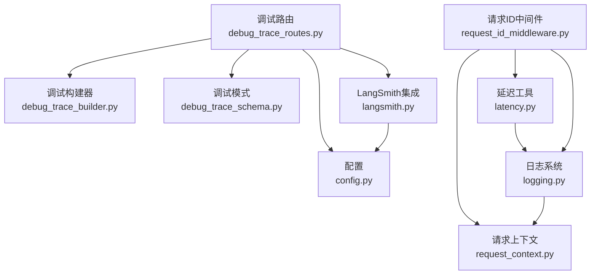
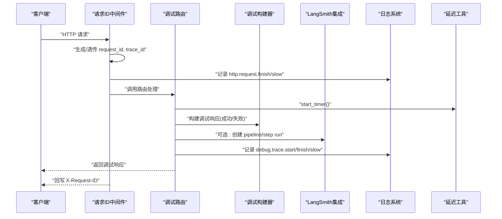
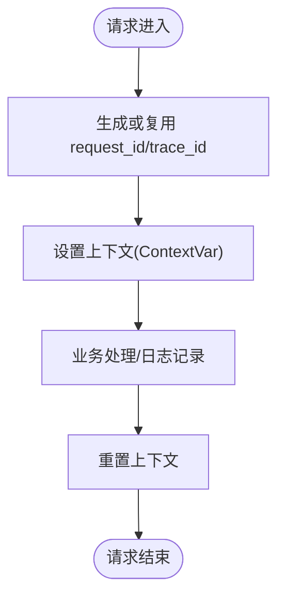
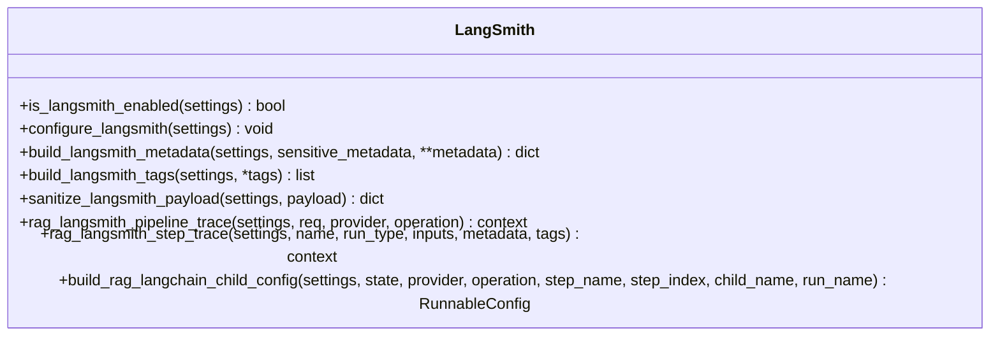
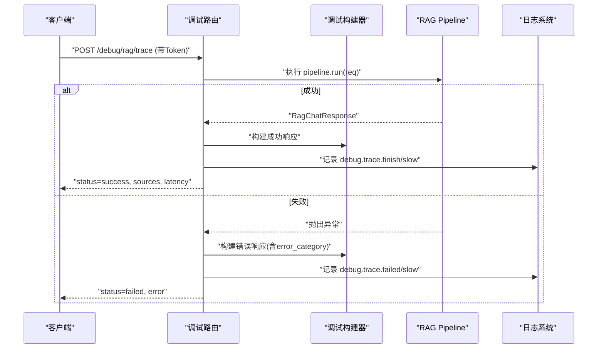
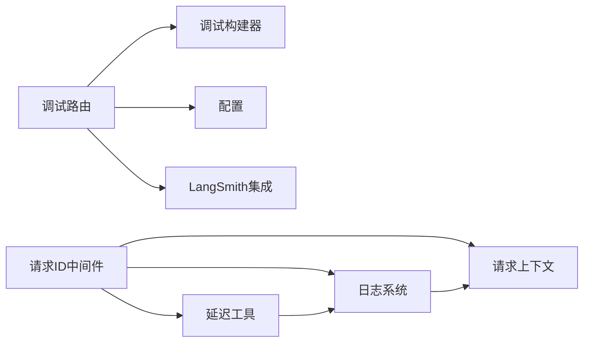

# 可观测性与监控

<cite>
**本文引用的文件**
- [src/fast_app/core/langsmith.py](file://src/fast_app/core/langsmith.py)
- [src/fast_app/core/logging.py](file://src/fast_app/core/logging.py)
- [src/fast_app/api/debug_trace_routes.py](file://src/fast_app/api/debug_trace_routes.py)
- [src/fast_app/core/request_context.py](file://src/fast_app/core/request_context.py)
- [src/fast_app/core/latency.py](file://src/fast_app/core/latency.py)
- [src/fast_app/schemas/debug_trace_schema.py](file://src/fast_app/schemas/debug_trace_schema.py)
- [src/fast_app/services/debug_trace_builder.py](file://src/fast_app/services/debug_trace_builder.py)
- [src/fast_app/middlewares/request_id_middleware.py](file://src/fast_app/middlewares/request_id_middleware.py)
- [src/fast_app/core/config.py](file://src/fast_app/core/config.py)
</cite>

## 目录
1. [简介](#简介)
2. [项目结构](#项目结构)
3. [核心组件](#核心组件)
4. [架构总览](#架构总览)
5. [详细组件分析](#详细组件分析)
6. [依赖关系分析](#依赖关系分析)
7. [性能考量](#性能考量)
8. [故障排查指南](#故障排查指南)
9. [结论](#结论)
10. [附录](#附录)

## 简介
本文件面向运维与开发者，系统化说明本项目的可观测性与监控系统实现，包括：
- LangSmith 追踪集成：如何启用、配置、构造根 run 与 step run、敏感字段脱敏、trace ID 传递。
- 结构化日志记录：请求上下文注入、统一格式、日志级别控制。
- 调试接口：受保护的 RAG 调试端点、请求/运行时快照、错误分类与慢请求告警。
- 性能监控：HTTP 层与 RAG Pipeline 层的耗时统计、慢操作阈值告警。
- 最佳实践：trace ID 贯穿链路、请求上下文管理、错误分类策略、问题定位方法。

## 项目结构
围绕可观测性的关键模块分布如下：
- 中间件层：负责生成并传播 request_id/trace_id，记录 HTTP 耗时与慢请求告警。
- 核心能力：
  - 请求上下文：基于 ContextVar 的线程安全上下文存储。
  - 日志系统：统一格式化、自动注入 request_id/trace_id、日志级别控制。
  - 延迟工具：高精度计时、慢操作告警。
  - LangSmith 集成：开关判断、环境变量同步、metadata/tags 构造、payload 脱敏、根 run/step run 封装。
- API 层：提供受保护的调试接口，返回请求/运行时/来源/错误快照。
- 数据模型：调试响应与快照的结构化定义。
- 配置中心：集中管理日志级别、慢阈值、LangSmith 开关与参数等。

**图表来源**
- [src/fast_app/middlewares/request_id_middleware.py:19-98](file://src/fast_app/middlewares/request_id_middleware.py#L19-L98)
- [src/fast_app/core/request_context.py:1-39](file://src/fast_app/core/request_context.py#L1-L39)
- [src/fast_app/core/latency.py:1-38](file://src/fast_app/core/latency.py#L1-L38)
- [src/fast_app/core/logging.py:1-77](file://src/fast_app/core/logging.py#L1-L77)
- [src/fast_app/api/debug_trace_routes.py:1-130](file://src/fast_app/api/debug_trace_routes.py#L1-L130)
- [src/fast_app/services/debug_trace_builder.py:1-104](file://src/fast_app/services/debug_trace_builder.py#L1-L104)
- [src/fast_app/schemas/debug_trace_schema.py:1-58](file://src/fast_app/schemas/debug_trace_schema.py#L1-L58)
- [src/fast_app/core/config.py:1-200](file://src/fast_app/core/config.py#L1-L200)
- [src/fast_app/core/langsmith.py:1-604](file://src/fast_app/core/langsmith.py#L1-L604)

**章节来源**
- [src/fast_app/middlewares/request_id_middleware.py:19-98](file://src/fast_app/middlewares/request_id_middleware.py#L19-L98)
- [src/fast_app/core/request_context.py:1-39](file://src/fast_app/core/request_context.py#L1-L39)
- [src/fast_app/core/latency.py:1-38](file://src/fast_app/core/latency.py#L1-L38)
- [src/fast_app/core/logging.py:1-77](file://src/fast_app/core/logging.py#L1-L77)
- [src/fast_app/api/debug_trace_routes.py:1-130](file://src/fast_app/api/debug_trace_routes.py#L1-L130)
- [src/fast_app/services/debug_trace_builder.py:1-104](file://src/fast_app/services/debug_trace_builder.py#L1-L104)
- [src/fast_app/schemas/debug_trace_schema.py:1-58](file://src/fast_app/schemas/debug_trace_schema.py#L1-L58)
- [src/fast_app/core/config.py:1-200](file://src/fast_app/core/config.py#L1-L200)
- [src/fast_app/core/langsmith.py:1-604](file://src/fast_app/core/langsmith.py#L1-L604)

## 核心组件
- 请求上下文管理
  - 使用 ContextVar 维护 request_id 与 trace_id，支持在异步/多线程环境下安全传递。
  - 提供设置与重置函数，确保请求结束后清理上下文，避免污染后续请求。
- 结构化日志
  - 启动时通过配置设置日志级别，并为根 logger 和所有 handler 注入 RequestContextFilter，自动附加 request_id/trace_id。
  - 提供 format_log_fields 将任意键值对规范化为单行结构化字符串，便于日志采集与分析。
- 延迟与慢操作告警
  - 使用 perf_counter 进行高精度计时，提供 elapsed_ms 计算耗时。
  - log_slow_operation 根据阈值输出警告日志，用于识别慢请求与慢步骤。
- LangSmith 追踪集成
  - 通过 Settings 控制是否启用，并在进程内同步环境变量到 LangChain/LangSmith SDK。
  - 提供统一的 metadata/tags 构造器，保证 pipeline root run 与 step run 的一致性。
  - 内置敏感字段脱敏逻辑，默认不上传 query/filters/user_id/sql 等敏感信息。
  - 封装 rag_langsmith_pipeline_trace 与 rag_langsmith_step_trace，简化业务接入。
- 调试接口
  - /debug/rag/trace 受保护（需开启且携带 Token），执行 RAG Pipeline 并返回结构化调试响应。
  - 响应包含请求快照、运行时快照、来源快照、错误快照、耗时与状态。

**章节来源**
- [src/fast_app/core/request_context.py:1-39](file://src/fast_app/core/request_context.py#L1-L39)
- [src/fast_app/core/logging.py:1-77](file://src/fast_app/core/logging.py#L1-L77)
- [src/fast_app/core/latency.py:1-38](file://src/fast_app/core/latency.py#L1-L38)
- [src/fast_app/core/langsmith.py:1-604](file://src/fast_app/core/langsmith.py#L1-L604)
- [src/fast_app/api/debug_trace_routes.py:1-130](file://src/fast_app/api/debug_trace_routes.py#L1-L130)
- [src/fast_app/services/debug_trace_builder.py:1-104](file://src/fast_app/services/debug_trace_builder.py#L1-L104)
- [src/fast_app/schemas/debug_trace_schema.py:1-58](file://src/fast_app/schemas/debug_trace_schema.py#L1-L58)
- [src/fast_app/core/config.py:1-200](file://src/fast_app/core/config.py#L1-L200)

## 架构总览
下图展示了从 HTTP 请求进入，到中间件注入上下文、日志记录、RAG 调试执行、LangSmith 追踪写入的整体流程。

**图表来源**
- [src/fast_app/middlewares/request_id_middleware.py:19-98](file://src/fast_app/middlewares/request_id_middleware.py#L19-L98)
- [src/fast_app/api/debug_trace_routes.py:1-130](file://src/fast_app/api/debug_trace_routes.py#L1-L130)
- [src/fast_app/services/debug_trace_builder.py:1-104](file://src/fast_app/services/debug_trace_builder.py#L1-L104)
- [src/fast_app/core/langsmith.py:1-604](file://src/fast_app/core/langsmith.py#L1-L604)
- [src/fast_app/core/logging.py:1-77](file://src/fast_app/core/logging.py#L1-L77)
- [src/fast_app/core/latency.py:1-38](file://src/fast_app/core/latency.py#L1-L38)

## 详细组件分析

### 请求上下文与 Trace ID 传递
- 设计要点
  - 使用 ContextVar 保存 request_id 与 trace_id，确保跨调用链可见。
  - 中间件在请求开始时设置上下文，结束时重置，防止上下文泄漏。
  - 日志过滤器自动注入 request_id/trace_id，无需业务代码手动添加。
- 使用建议
  - 所有日志应通过 get_logger(__name__) 获取 logger，并使用 format_log_fields 输出结构化字段。
  - 在需要跨组件传递上下文的场景，优先依赖中间件设置的上下文，而非全局变量。

**图表来源**
- [src/fast_app/middlewares/request_id_middleware.py:19-98](file://src/fast_app/middlewares/request_id_middleware.py#L19-L98)
- [src/fast_app/core/request_context.py:1-39](file://src/fast_app/core/request_context.py#L1-L39)
- [src/fast_app/core/logging.py:1-77](file://src/fast_app/core/logging.py#L1-L77)

**章节来源**
- [src/fast_app/middlewares/request_id_middleware.py:19-98](file://src/fast_app/middlewares/request_id_middleware.py#L19-L98)
- [src/fast_app/core/request_context.py:1-39](file://src/fast_app/core/request_context.py#L1-L39)
- [src/fast_app/core/logging.py:1-77](file://src/fast_app/core/logging.py#L1-L77)

### 结构化日志与日志级别控制
- 设计要点
  - setup_logging 在应用启动时设置日志级别，并注入 RequestContextFilter。
  - format_log_fields 将复杂类型标准化为 JSON 字符串，避免换行破坏日志行。
- 使用建议
  - 通过 Settings.log_level 控制日志级别，生产环境建议 INFO 或 WARNING。
  - 使用 format_log_fields(event=..., ...) 输出事件驱动日志，便于检索与聚合。

**章节来源**
- [src/fast_app/core/logging.py:1-77](file://src/fast_app/core/logging.py#L1-L77)
- [src/fast_app/core/config.py:1-200](file://src/fast_app/core/config.py#L1-L200)

### 性能监控与慢操作告警
- 设计要点
  - start_timer/elapsed_ms 提供高精度耗时统计。
  - log_slow_operation 根据阈值输出警告日志，区分 HTTP 层与 RAG Pipeline 层。
- 使用建议
  - 在关键路径（HTTP、检索、重排、LLM 调用）前后使用计时与慢操作告警。
  - 通过 Settings 中的不同阈值分别控制各层慢告警灵敏度。

**章节来源**
- [src/fast_app/core/latency.py:1-38](file://src/fast_app/core/latency.py#L1-L38)
- [src/fast_app/core/config.py:1-200](file://src/fast_app/core/config.py#L1-L200)

### LangSmith 追踪集成
- 设计要点
  - is_langsmith_enabled 同时检查 tracing 开关与 API Key，避免无效调用。
  - configure_langsmith 将 Settings 同步到环境变量，供 LangChain/LangSmith SDK 读取。
  - build_langsmith_metadata/tags 统一附加 request_id/trace_id、环境、provider、模型等信息。
  - sanitize_langsmith_payload 递归脱敏敏感字段，默认不上传 query/filters/user_id/sql 等。
  - rag_langsmith_pipeline_trace 与 rag_langsmith_step_trace 提供统一入口，减少重复代码。
  - build_rag_langchain_child_config 将当前 step 上下文传递给 LangChain 子调用，保持父子关系。
- 使用建议
  - 在 Pipeline 入口处创建 root run，在检索/重排/LLM 等步骤创建 step run。
  - 通过 tags 过滤 pipeline/provider/operation，通过 metadata 关联本地日志与远程 trace。
  - 谨慎开启 langsmith_include_sensitive_data，仅在可信环境上传敏感数据。

**图表来源**
- [src/fast_app/core/langsmith.py:1-604](file://src/fast_app/core/langsmith.py#L1-L604)

**章节来源**
- [src/fast_app/core/langsmith.py:1-604](file://src/fast_app/core/langsmith.py#L1-L604)
- [src/fast_app/core/config.py:1-200](file://src/fast_app/core/config.py#L1-L200)

### 调试接口与错误分类
- 设计要点
  - /debug/rag/trace 受保护：需开启 debug_trace_enabled 并携带正确 Token。
  - 成功路径：执行 RAG Pipeline，构建成功响应，包含请求/运行时/来源快照与耗时。
  - 失败路径：捕获 AppServiceError 与通用异常，构建错误响应，包含错误分类与类型。
  - 慢请求告警：记录 debug.trace.slow，结合 slow_rag_pipeline_threshold_ms。
- 使用建议
  - 仅在内网或可信环境暴露该接口，严格限制访问。
  - 通过 response.error.error_category 快速定位错误来源（如 validation/provider/unexpected）。

**图表来源**
- [src/fast_app/api/debug_trace_routes.py:1-130](file://src/fast_app/api/debug_trace_routes.py#L1-L130)
- [src/fast_app/services/debug_trace_builder.py:1-104](file://src/fast_app/services/debug_trace_builder.py#L1-L104)
- [src/fast_app/schemas/debug_trace_schema.py:1-58](file://src/fast_app/schemas/debug_trace_schema.py#L1-L58)

**章节来源**
- [src/fast_app/api/debug_trace_routes.py:1-130](file://src/fast_app/api/debug_trace_routes.py#L1-L130)
- [src/fast_app/services/debug_trace_builder.py:1-104](file://src/fast_app/services/debug_trace_builder.py#L1-L104)
- [src/fast_app/schemas/debug_trace_schema.py:1-58](file://src/fast_app/schemas/debug_trace_schema.py#L1-L58)

## 依赖关系分析
- 中间件依赖请求上下文与日志系统，负责上下文生命周期管理与 HTTP 层耗时统计。
- 调试路由依赖调试构建器与配置，负责受保护访问校验与响应组装。
- LangSmith 集成依赖配置与请求上下文，负责追踪开关、元数据构造与脱敏。
- 日志系统依赖请求上下文，自动注入 trace 标识。
- 延迟工具被中间件与调试路由共同使用，提供一致的耗时统计与慢告警。

**图表来源**
- [src/fast_app/middlewares/request_id_middleware.py:19-98](file://src/fast_app/middlewares/request_id_middleware.py#L19-L98)
- [src/fast_app/core/request_context.py:1-39](file://src/fast_app/core/request_context.py#L1-L39)
- [src/fast_app/core/logging.py:1-77](file://src/fast_app/core/logging.py#L1-L77)
- [src/fast_app/core/latency.py:1-38](file://src/fast_app/core/latency.py#L1-L38)
- [src/fast_app/api/debug_trace_routes.py:1-130](file://src/fast_app/api/debug_trace_routes.py#L1-L130)
- [src/fast_app/services/debug_trace_builder.py:1-104](file://src/fast_app/services/debug_trace_builder.py#L1-L104)
- [src/fast_app/core/config.py:1-200](file://src/fast_app/core/config.py#L1-L200)
- [src/fast_app/core/langsmith.py:1-604](file://src/fast_app/core/langsmith.py#L1-L604)

**章节来源**
- [src/fast_app/middlewares/request_id_middleware.py:19-98](file://src/fast_app/middlewares/request_id_middleware.py#L19-L98)
- [src/fast_app/core/request_context.py:1-39](file://src/fast_app/core/request_context.py#L1-L39)
- [src/fast_app/core/logging.py:1-77](file://src/fast_app/core/logging.py#L1-L77)
- [src/fast_app/core/latency.py:1-38](file://src/fast_app/core/latency.py#L1-L38)
- [src/fast_app/api/debug_trace_routes.py:1-130](file://src/fast_app/api/debug_trace_routes.py#L1-L130)
- [src/fast_app/services/debug_trace_builder.py:1-104](file://src/fast_app/services/debug_trace_builder.py#L1-L104)
- [src/fast_app/core/config.py:1-200](file://src/fast_app/core/config.py#L1-L200)
- [src/fast_app/core/langsmith.py:1-604](file://src/fast_app/core/langsmith.py#L1-L604)

## 性能考量
- 日志开销
  - 结构化日志使用 format_log_fields，避免大对象频繁序列化；必要时可对敏感字段截断。
  - 生产环境建议关闭不必要的 DEBUG 日志，降低 I/O 压力。
- 追踪开销
  - LangSmith 追踪默认关闭，仅在明确开启且有 API Key 时生效；避免无意义网络调用。
  - 对高频步骤（如检索、重排）谨慎创建 step run，避免过多子 run 影响性能。
- 慢操作阈值
  - 合理设置各层阈值（HTTP/RAG/检索/重排/LLM），平衡告警敏感度与噪音。
  - 结合日志与 LangSmith 元数据，定位瓶颈步骤。

[本节为通用指导，不直接分析具体文件]

## 故障排查指南
- 定位请求链路
  - 通过日志中的 request_id/trace_id 关联 HTTP 请求、业务日志与 LangSmith trace。
  - 在 LangSmith 中按 tags 过滤 pipeline/provider/operation，快速定位对应 trace。
- 常见问题
  - 未收到 trace：检查 is_langsmith_enabled 条件（tracing 开关与 API Key）。
  - 敏感数据泄露：确认 sanitize_langsmith_payload 已启用，或关闭 langsmith_include_sensitive_data。
  - 调试接口不可用：确认 debug_trace_enabled 与 Token 配置正确。
  - 慢请求告警过多：调整 slow_*_threshold_ms 阈值，或优化对应步骤。
- 推荐步骤
  - 先查日志：搜索 event=http.request.slow 或 event=debug.trace.slow。
  - 再查 LangSmith：按 trace_id 或 tags 查看根 run 与 step run 详情。
  - 最后复现：使用 /debug/rag/trace 传入相同参数，对比响应与错误分类。

**章节来源**
- [src/fast_app/core/langsmith.py:1-604](file://src/fast_app/core/langsmith.py#L1-L604)
- [src/fast_app/api/debug_trace_routes.py:1-130](file://src/fast_app/api/debug_trace_routes.py#L1-L130)
- [src/fast_app/core/logging.py:1-77](file://src/fast_app/core/logging.py#L1-L77)
- [src/fast_app/core/latency.py:1-38](file://src/fast_app/core/latency.py#L1-L38)
- [src/fast_app/core/config.py:1-200](file://src/fast_app/core/config.py#L1-L200)

## 结论
本项目构建了完整的可观测性体系：以请求上下文为核心，贯穿日志、延迟统计与 LangSmith 追踪；通过受保护的调试接口提供端到端的诊断能力；借助结构化日志与统一元数据，实现本地日志与远程 trace 的无缝关联。建议在生产环境中：
- 严格控制调试接口访问范围。
- 按需开启 LangSmith 追踪，并谨慎处理敏感数据。
- 持续优化慢阈值与日志级别，平衡可观测性与性能。
- 建立基于 request_id/trace_id 的问题定位标准流程。

[本节为总结，不直接分析具体文件]

## 附录
- 关键配置项（来自 Settings）
  - 日志级别：log_level
  - 慢阈值：slow_http_request_threshold_ms、slow_rag_pipeline_threshold_ms、slow_retrieval_threshold_ms、slow_rerank_threshold_ms、slow_llm_threshold_ms
  - LangSmith：langsmith_tracing、langsmith_api_key、langsmith_endpoint、langsmith_project、langsmith_tags、langsmith_include_sensitive_data
  - 调试接口：debug_trace_enabled、debug_trace_token、debug_trace_max_sources

**章节来源**
- [src/fast_app/core/config.py:1-200](file://src/fast_app/core/config.py#L1-L200)