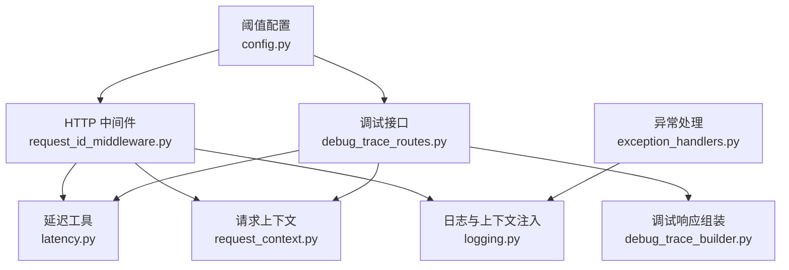
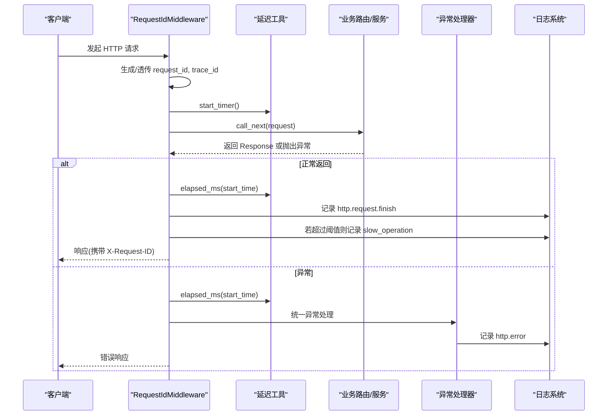
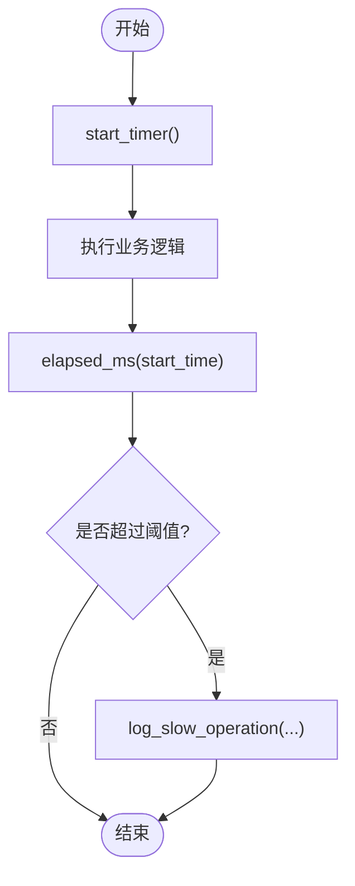
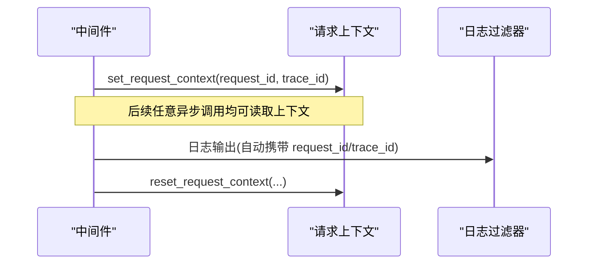
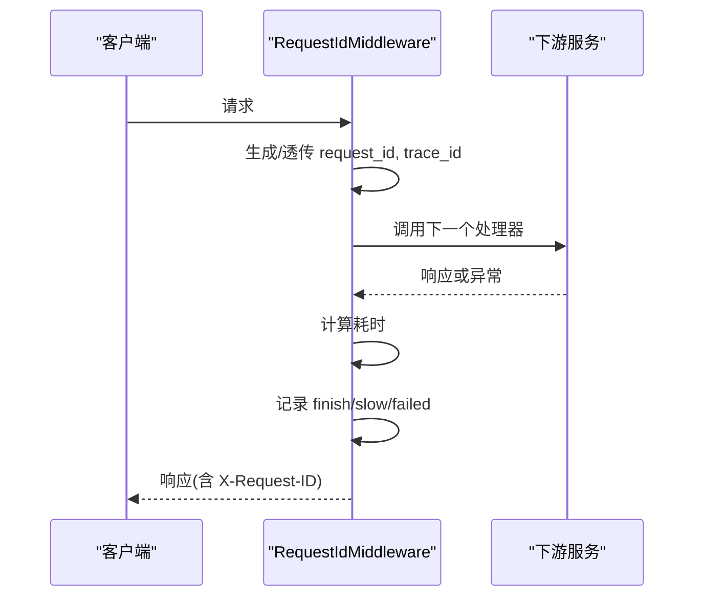
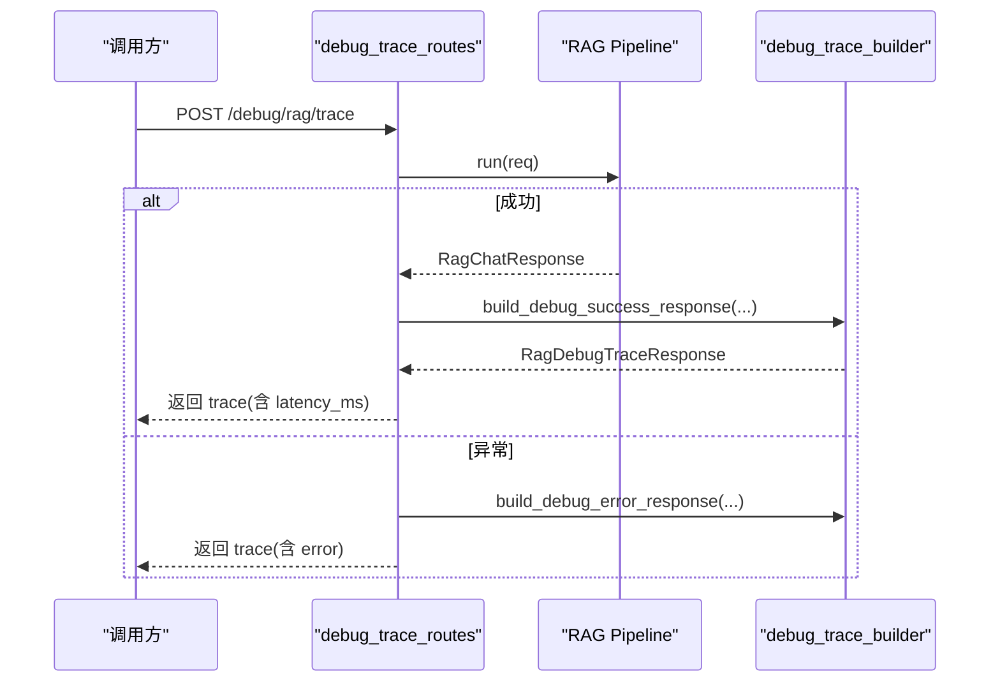
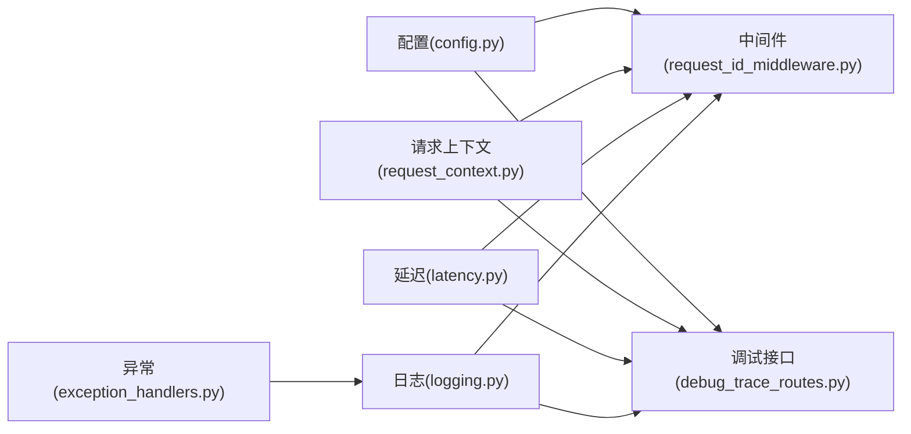

# 性能监控与分析

<cite>
**本文引用的文件**
- [src/fast_app/core/latency.py](file://src/fast_app/core/latency.py)
- [src/fast_app/core/request_context.py](file://src/fast_app/core/request_context.py)
- [src/fast_app/middlewares/request_id_middleware.py](file://src/fast_app/middlewares/request_id_middleware.py)
- [src/fast_app/core/logging.py](file://src/fast_app/core/logging.py)
- [src/fast_app/api/debug_trace_routes.py](file://src/fast_app/api/debug_trace_routes.py)
- [src/fast_app/services/debug_trace_builder.py](file://src/fast_app/services/debug_trace_builder.py)
- [src/fast_app/core/config.py](file://src/fast_app/core/config.py)
- [src/fast_app/core/exception_handlers.py](file://src/fast_app/core/exception_handlers.py)
</cite>

## 目录
1. [简介](#简介)
2. [项目结构](#项目结构)
3. [核心组件](#核心组件)
4. [架构总览](#架构总览)
5. [详细组件分析](#详细组件分析)
6. [依赖关系分析](#依赖关系分析)
7. [性能考量](#性能考量)
8. [故障排查指南](#故障排查指南)
9. [结论](#结论)
10. [附录](#附录)

## 简介
本文件面向团队对系统性能监控与优化的统一理解，聚焦以下目标：
- 延迟监控的实现原理与采集点
- 请求上下文管理（request_id、trace_id）如何贯穿全链路
- 性能指标的收集、统计与可视化建议
- 慢查询识别、资源使用率监控策略
- 性能优化最佳实践与常见问题排查方法

本项目在 HTTP 层通过中间件完成请求级耗时统计与慢请求告警；在 RAG 调试接口中实现端到端耗时与结构化 trace 输出；日志系统自动注入 request_id 与 trace_id，便于跨模块追踪。

## 项目结构
围绕性能监控的关键代码分布在如下位置：
- 延迟工具：core/latency.py
- 请求上下文：core/request_context.py
- HTTP 中间件：middlewares/request_id_middleware.py
- 日志与上下文注入：core/logging.py
- 调试接口：api/debug_trace_routes.py
- 调试响应组装：services/debug_trace_builder.py
- 阈值配置：core/config.py
- 异常处理与错误分类：core/exception_handlers.py

**图表来源**
- [src/fast_app/middlewares/request_id_middleware.py:1-98](file://src/fast_app/middlewares/request_id_middleware.py#L1-L98)
- [src/fast_app/core/latency.py:1-38](file://src/fast_app/core/latency.py#L1-L38)
- [src/fast_app/core/request_context.py:1-39](file://src/fast_app/core/request_context.py#L1-L39)
- [src/fast_app/core/logging.py:1-77](file://src/fast_app/core/logging.py#L1-L77)
- [src/fast_app/api/debug_trace_routes.py:1-130](file://src/fast_app/api/debug_trace_routes.py#L1-L130)
- [src/fast_app/services/debug_trace_builder.py:1-104](file://src/fast_app/services/debug_trace_builder.py#L1-L104)
- [src/fast_app/core/config.py:18-53](file://src/fast_app/core/config.py#L18-L53)
- [src/fast_app/core/exception_handlers.py:93-152](file://src/fast_app/core/exception_handlers.py#L93-L152)

**章节来源**
- [src/fast_app/middlewares/request_id_middleware.py:1-98](file://src/fast_app/middlewares/request_id_middleware.py#L1-L98)
- [src/fast_app/core/latency.py:1-38](file://src/fast_app/core/latency.py#L1-L38)
- [src/fast_app/core/request_context.py:1-39](file://src/fast_app/core/request_context.py#L1-L39)
- [src/fast_app/core/logging.py:1-77](file://src/fast_app/core/logging.py#L1-L77)
- [src/fast_app/api/debug_trace_routes.py:1-130](file://src/fast_app/api/debug_trace_routes.py#L1-L130)
- [src/fast_app/services/debug_trace_builder.py:1-104](file://src/fast_app/services/debug_trace_builder.py#L1-L104)
- [src/fast_app/core/config.py:18-53](file://src/fast_app/core/config.py#L18-L53)
- [src/fast_app/core/exception_handlers.py:93-152](file://src/fast_app/core/exception_handlers.py#L93-L152)

## 核心组件
- 延迟工具：提供高精度计时、耗时计算、慢操作判定与记录。
- 请求上下文：基于 ContextVar 维护 request_id 与 trace_id，贯穿异步调用链。
- HTTP 中间件：生成/透传 request_id，记录请求成功/失败事件，统计并上报慢请求。
- 日志系统：为所有日志自动附加 request_id 与 trace_id，统一格式化字段。
- 调试接口：封装一次 RAG 调用的完整 trace，包含请求快照、运行时配置、结果与耗时。
- 配置项：集中定义各层慢阈值（HTTP、RAG、检索、重排、LLM）。
- 异常处理：统一捕获应用异常与未预期异常，写入结构化错误日志。

**章节来源**
- [src/fast_app/core/latency.py:1-38](file://src/fast_app/core/latency.py#L1-L38)
- [src/fast_app/core/request_context.py:1-39](file://src/fast_app/core/request_context.py#L1-L39)
- [src/fast_app/middlewares/request_id_middleware.py:1-98](file://src/fast_app/middlewares/request_id_middleware.py#L1-L98)
- [src/fast_app/core/logging.py:1-77](file://src/fast_app/core/logging.py#L1-L77)
- [src/fast_app/api/debug_trace_routes.py:1-130](file://src/fast_app/api/debug_trace_routes.py#L1-L130)
- [src/fast_app/services/debug_trace_builder.py:1-104](file://src/fast_app/services/debug_trace_builder.py#L1-L104)
- [src/fast_app/core/config.py:18-53](file://src/fast_app/core/config.py#L18-L53)
- [src/fast_app/core/exception_handlers.py:93-152](file://src/fast_app/core/exception_handlers.py#L93-L152)

## 架构总览
下图展示一次 HTTP 请求从进入中间件到返回响应的关键监控路径，以及调试接口的端到端 trace 流程。

**图表来源**
- [src/fast_app/middlewares/request_id_middleware.py:28-97](file://src/fast_app/middlewares/request_id_middleware.py#L28-L97)
- [src/fast_app/core/latency.py:7-37](file://src/fast_app/core/latency.py#L7-L37)
- [src/fast_app/core/exception_handlers.py:93-152](file://src/fast_app/core/exception_handlers.py#L93-L152)
- [src/fast_app/core/logging.py:8-26](file://src/fast_app/core/logging.py#L8-L26)

## 详细组件分析

### 延迟监控与慢操作告警
- 高精度计时：使用高性能时钟测量起止时间，并以毫秒为单位计算耗时。
- 慢操作判定：当耗时达到配置的阈值时，以警告级别记录慢操作事件，附带事件名、耗时、阈值及扩展字段。
- 适用场景：HTTP 请求、RAG Pipeline、检索、重排、LLM 调用等均可复用该能力。

**图表来源**
- [src/fast_app/core/latency.py:7-37](file://src/fast_app/core/latency.py#L7-L37)

**章节来源**
- [src/fast_app/core/latency.py:1-38](file://src/fast_app/core/latency.py#L1-L38)

### 请求上下文管理（request_id / trace_id）
- 上下文变量：通过 ContextVar 存储 request_id 与 trace_id，确保在异步任务中也能正确传递。
- 设置与清理：中间件在进入请求时设置上下文，并在 finally 中清理，避免上下文污染。
- 日志关联：日志过滤器自动将当前上下文的 request_id 与 trace_id 注入每条日志，便于串联追踪。

**图表来源**
- [src/fast_app/core/request_context.py:6-38](file://src/fast_app/core/request_context.py#L6-L38)
- [src/fast_app/core/logging.py:8-26](file://src/fast_app/core/logging.py#L8-L26)
- [src/fast_app/middlewares/request_id_middleware.py:28-97](file://src/fast_app/middlewares/request_id_middleware.py#L28-L97)

**章节来源**
- [src/fast_app/core/request_context.py:1-39](file://src/fast_app/core/request_context.py#L1-L39)
- [src/fast_app/core/logging.py:1-77](file://src/fast_app/core/logging.py#L1-L77)
- [src/fast_app/middlewares/request_id_middleware.py:1-98](file://src/fast_app/middlewares/request_id_middleware.py#L1-L98)

### HTTP 请求级监控
- 入口拦截：中间件在请求进入时生成或透传 request_id，并记录开始时间。
- 成功路径：记录 http.request.finish，包含方法、路径、状态码与耗时；若超过阈值则记录慢请求。
- 异常路径：记录 http.request.failed，包含异常类型与耗时；同样记录慢请求。
- 响应头：在响应中回写 X-Request-ID，便于客户端与网关侧联动追踪。

**图表来源**
- [src/fast_app/middlewares/request_id_middleware.py:28-97](file://src/fast_app/middlewares/request_id_middleware.py#L28-L97)
- [src/fast_app/core/latency.py:7-37](file://src/fast_app/core/latency.py#L7-L37)

**章节来源**
- [src/fast_app/middlewares/request_id_middleware.py:1-98](file://src/fast_app/middlewares/request_id_middleware.py#L1-L98)

### 调试接口与端到端 Trace
- 访问控制：通过配置开关与令牌校验保护调试接口。
- 执行链路：调用 RAG Pipeline 运行请求，捕获成功与异常两种路径，均记录耗时与结构化 trace。
- 响应内容：包含请求快照、运行时配置、答案长度、来源数量与来源片段，便于定位瓶颈。

**图表来源**
- [src/fast_app/api/debug_trace_routes.py:28-129](file://src/fast_app/api/debug_trace_routes.py#L28-L129)
- [src/fast_app/services/debug_trace_builder.py:14-94](file://src/fast_app/services/debug_trace_builder.py#L14-L94)

**章节来源**
- [src/fast_app/api/debug_trace_routes.py:1-130](file://src/fast_app/api/debug_trace_routes.py#L1-L130)
- [src/fast_app/services/debug_trace_builder.py:1-104](file://src/fast_app/services/debug_trace_builder.py#L1-L104)

### 配置驱动的慢阈值
- HTTP 层：slow_http_request_threshold_ms 控制 HTTP 请求慢阈值。
- RAG 层：slow_rag_pipeline_threshold_ms 控制 RAG 管道慢阈值。
- 检索/重排/LLM：分别提供独立阈值，便于分层定位瓶颈。
- 调试开关：debug_trace_enabled 与 debug_trace_token 控制调试接口可用性与访问安全。

**章节来源**
- [src/fast_app/core/config.py:18-53](file://src/fast_app/core/config.py#L18-L53)

### 异常处理与错误分类
- 应用异常：按错误类别记录 http.error，并返回结构化错误内容。
- 未预期异常：统一捕获并记录系统错误，返回内部错误响应。
- 上下文对齐：异常处理中同样获取 request_id 与 trace_id，保证错误可追踪。

**章节来源**
- [src/fast_app/core/exception_handlers.py:93-152](file://src/fast_app/core/exception_handlers.py#L93-L152)

## 依赖关系分析
- 中间件依赖延迟工具与请求上下文，负责生命周期内的计时与上下文管理。
- 调试接口依赖延迟工具、请求上下文与调试响应组装器，形成端到端 trace。
- 日志系统依赖请求上下文，为所有日志注入追踪标识。
- 配置项被中间件与调试接口共同引用，驱动不同层的慢阈值。

**图表来源**
- [src/fast_app/core/config.py:18-53](file://src/fast_app/core/config.py#L18-L53)
- [src/fast_app/middlewares/request_id_middleware.py:1-98](file://src/fast_app/middlewares/request_id_middleware.py#L1-L98)
- [src/fast_app/api/debug_trace_routes.py:1-130](file://src/fast_app/api/debug_trace_routes.py#L1-L130)
- [src/fast_app/core/request_context.py:1-39](file://src/fast_app/core/request_context.py#L1-L39)
- [src/fast_app/core/latency.py:1-38](file://src/fast_app/core/latency.py#L1-L38)
- [src/fast_app/core/logging.py:1-77](file://src/fast_app/core/logging.py#L1-L77)
- [src/fast_app/core/exception_handlers.py:93-152](file://src/fast_app/core/exception_handlers.py#L93-L152)

**章节来源**
- [src/fast_app/core/config.py:18-53](file://src/fast_app/core/config.py#L18-L53)
- [src/fast_app/middlewares/request_id_middleware.py:1-98](file://src/fast_app/middlewares/request_id_middleware.py#L1-L98)
- [src/fast_app/api/debug_trace_routes.py:1-130](file://src/fast_app/api/debug_trace_routes.py#L1-L130)
- [src/fast_app/core/request_context.py:1-39](file://src/fast_app/core/request_context.py#L1-L39)
- [src/fast_app/core/latency.py:1-38](file://src/fast_app/core/latency.py#L1-L38)
- [src/fast_app/core/logging.py:1-77](file://src/fast_app/core/logging.py#L1-L77)
- [src/fast_app/core/exception_handlers.py:93-152](file://src/fast_app/core/exception_handlers.py#L93-L152)

## 性能考量
- 采集点选择
  - HTTP 层：请求进入与返回的墙钟耗时，适合整体 SLA 观测。
  - RAG 层：端到端耗时，适合评估模型与检索组合效果。
  - 子阶段：可在检索、重排、LLM 调用处增加埋点，结合各自阈值进行分层告警。
- 指标设计
  - 延迟分布：P50/P90/P99，用于观察尾部延迟。
  - 慢请求比例：超过阈值的请求占比，衡量系统健康度。
  - 错误率：按错误类别统计，区分用户错误、外部服务错误与系统错误。
- 可视化建议
  - 时序图：展示 QPS、平均延迟、P99 延迟与慢请求比例。
  - 分维度：按接口路径、状态码、错误类别分组。
  - 关联追踪：通过 request_id/trace_id 关联日志与 trace 数据。
- 资源使用率监控策略
  - CPU/内存：结合进程监控与采样指标，关注峰值与持续高负载。
  - I/O：数据库连接池、网络超时与重试次数。
  - 外部依赖：LLM、向量库、搜索引擎的超时与错误率。
- 慢查询识别
  - 基于阈值：HTTP、RAG、检索、重排、LLM 多层阈值。
  - 根因定位：利用调试接口返回的来源片段与运行时配置，快速判断瓶颈环节。
- 优化建议
  - 调整阈值：根据业务 SLA 与历史基线动态调整。
  - 缓存与降级：热点数据缓存、外部依赖降级与熔断。
  - 并发与批处理：合理并行化检索与重排，减少串行等待。
  - 模型与索引：选择低延迟模型、优化索引结构与查询参数。

[本节为通用指导，不直接分析具体文件]

## 故障排查指南
- 定位问题范围
  - 通过 request_id/trace_id 在日志系统中串联整条链路。
  - 使用调试接口获取一次请求的完整 trace，包括请求参数、运行时配置、结果与耗时。
- 常见症状与对策
  - 慢请求频发：检查各层阈值是否合理，查看慢请求日志中的 method/path/status_code 与耗时。
  - 错误率高：查看异常处理日志的错误类别与错误类型，区分用户错误、外部服务错误与系统错误。
  - 无 trace：确认调试接口开关与令牌配置是否正确。
- 逐步排查
  - 先确认 HTTP 层是否记录 finish/slow/failed。
  - 再检查 RAG 层是否记录 debug.trace.finish 与 slow。
  - 最后核对日志过滤器是否注入 request_id/trace_id。

**章节来源**
- [src/fast_app/middlewares/request_id_middleware.py:28-97](file://src/fast_app/middlewares/request_id_middleware.py#L28-L97)
- [src/fast_app/api/debug_trace_routes.py:28-129](file://src/fast_app/api/debug_trace_routes.py#L28-L129)
- [src/fast_app/core/logging.py:8-26](file://src/fast_app/core/logging.py#L8-L26)
- [src/fast_app/core/exception_handlers.py:93-152](file://src/fast_app/core/exception_handlers.py#L93-L152)

## 结论
本项目已具备完善的性能监控基础能力：
- 统一的请求上下文与日志追踪
- 多层次的延迟监控与慢操作告警
- 端到端的调试 trace 输出
- 配置化的阈值管理与异常分类

建议在此基础上继续完善：
- 在各关键子阶段（检索、重排、LLM）增加细粒度埋点
- 建立指标看板与告警规则
- 定期复盘慢请求与错误，持续优化阈值与实现

[本节为总结性内容，不直接分析具体文件]

## 附录
- 关键配置项说明
  - slow_http_request_threshold_ms：HTTP 请求慢阈值（毫秒）
  - slow_rag_pipeline_threshold_ms：RAG 管道慢阈值（毫秒）
  - slow_retrieval_threshold_ms：检索慢阈值（毫秒）
  - slow_rerank_threshold_ms：重排慢阈值（毫秒）
  - slow_llm_threshold_ms：LLM 慢阈值（毫秒）
  - debug_trace_enabled：调试接口开关
  - debug_trace_token：调试接口访问令牌
  - debug_trace_max_sources：调试响应中保留的最大来源数

**章节来源**
- [src/fast_app/core/config.py:18-53](file://src/fast_app/core/config.py#L18-L53)