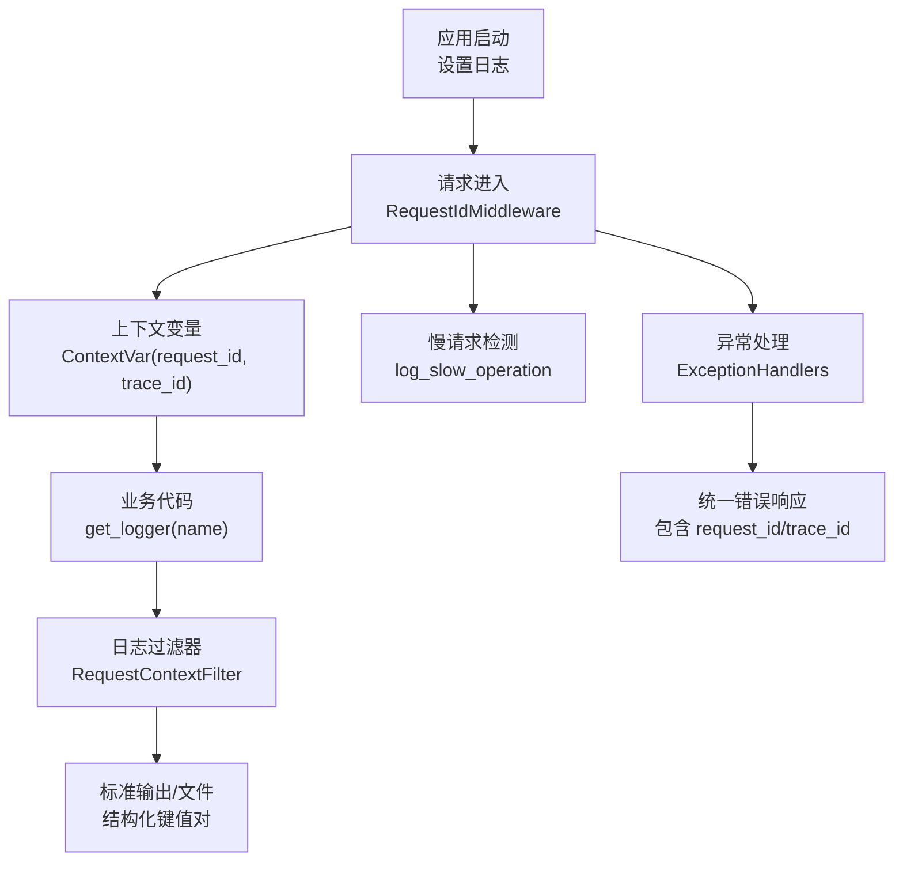
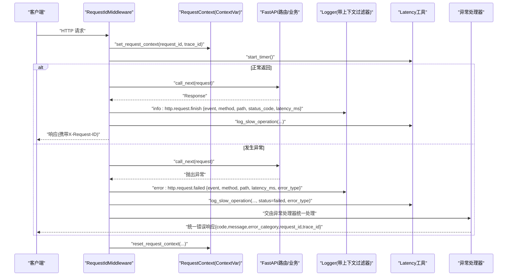
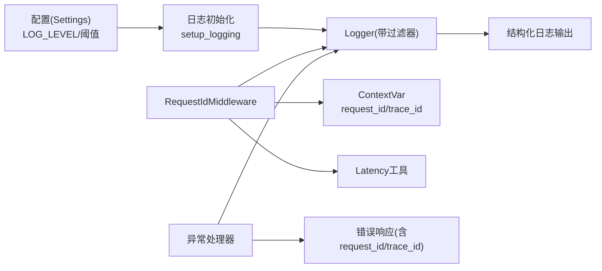

# 结构化日志记录

<cite>
**本文引用的文件**
- [logging.py](file://src/fast_app/core/logging.py)
- [request_context.py](file://src/fast_app/core/request_context.py)
- [request_id_middleware.py](file://src/fast_app/middlewares/request_id_middleware.py)
- [config.py](file://src/fast_app/core/config.py)
- [latency.py](file://src/fast_app/core/latency.py)
- [exception_handlers.py](file://src/fast_app/core/exception_handlers.py)
- [error_responses.py](file://src/fast_app/core/error_responses.py)
</cite>

## 目录
1. [简介](#简介)
2. [项目结构](#项目结构)
3. [核心组件](#核心组件)
4. [架构总览](#架构总览)
5. [详细组件分析](#详细组件分析)
6. [依赖关系分析](#依赖关系分析)
7. [性能考虑](#性能考虑)
8. [故障排查指南](#故障排查指南)
9. [结论](#结论)
10. [附录](#附录)

## 简介
本文件面向运维与研发人员，系统化说明本项目结构化日志的设计与实现，包括：
- 日志格式设计与字段标准化
- 日志级别控制与环境差异
- request_id 与 trace_id 的生成、注入与传递机制
- 错误日志分类处理规范
- 性能相关日志的记录规范
- 日志聚合与分析的最佳实践
- 日志查询与过滤方法，帮助快速定位问题

## 项目结构
本项目将结构化日志能力集中在 core 层，并通过中间件在请求入口统一注入上下文；异常处理器统一输出错误日志；配置中心提供日志级别等开关。

图表来源
- [logging.py:59-76](file://src/fast_app/core/logging.py#L59-L76)
- [request_id_middleware.py:19-98](file://src/fast_app/middlewares/request_id_middleware.py#L19-L98)
- [request_context.py:1-39](file://src/fast_app/core/request_context.py#L1-L39)
- [latency.py:19-38](file://src/fast_app/core/latency.py#L19-L38)
- [exception_handlers.py:26-153](file://src/fast_app/core/exception_handlers.py#L26-L153)

章节来源
- [logging.py:59-76](file://src/fast_app/core/logging.py#L59-L76)
- [request_id_middleware.py:19-98](file://src/fast_app/middlewares/request_id_middleware.py#L19-L98)
- [request_context.py:1-39](file://src/fast_app/core/request_context.py#L1-L39)
- [latency.py:19-38](file://src/fast_app/core/latency.py#L19-L38)
- [exception_handlers.py:26-153](file://src/fast_app/core/exception_handlers.py#L26-L153)

## 核心组件
- 日志初始化与格式化
  - 通过统一入口设置全局日志级别与输出格式，并在根日志器上附加上下文过滤器，使每条日志自动携带 request_id 与 trace_id。
  - 提供统一的字段格式化函数，确保所有日志字段为可解析的结构化键值对，并对集合、元组、字符串等进行规范化处理。
- 请求上下文
  - 使用 ContextVar 维护每个异步请求的 request_id 与 trace_id，支持跨调用链透明传递。
  - 提供设置与重置接口，保证请求结束后上下文清理，避免污染后续请求。
- 请求中间件
  - 在请求入口处生成或透传 request_id，并将其作为 trace_id 起点，写入请求状态与上下文变量。
  - 记录 HTTP 请求完成日志（含耗时），并基于阈值记录慢请求告警。
  - 在异常路径中记录失败日志与慢请求告警，并抛出异常。
- 异常处理器
  - 统一捕获参数校验、HTTP 异常、服务自定义异常与未预期异常，按类别输出结构化错误日志。
  - 错误响应体中包含 request_id 与 trace_id，便于前端与链路追踪系统关联。
- 性能监控
  - 提供计时与慢操作记录工具，按阈值输出慢请求/慢步骤告警日志。
- 配置管理
  - 通过 Settings 集中管理日志级别、慢请求阈值等运行期配置，支持不同环境差异化。

章节来源
- [logging.py:8-56](file://src/fast_app/core/logging.py#L8-L56)
- [request_context.py:1-39](file://src/fast_app/core/request_context.py#L1-L39)
- [request_id_middleware.py:19-98](file://src/fast_app/middlewares/request_id_middleware.py#L19-L98)
- [exception_handlers.py:26-153](file://src/fast_app/core/exception_handlers.py#L26-L153)
- [latency.py:1-38](file://src/fast_app/core/latency.py#L1-L38)
- [config.py:84-52](file://src/fast_app/core/config.py#L84-L52)

## 架构总览
下图展示一次 HTTP 请求从进入、上下文注入、业务执行到返回/异常的完整日志链路。

图表来源
- [request_id_middleware.py:28-98](file://src/fast_app/middlewares/request_id_middleware.py#L28-L98)
- [request_context.py:24-39](file://src/fast_app/core/request_context.py#L24-L39)
- [latency.py:19-38](file://src/fast_app/core/latency.py#L19-L38)
- [exception_handlers.py:26-153](file://src/fast_app/core/exception_handlers.py#L26-L153)

## 详细组件分析

### 日志格式与字段标准化
- 输出格式
  - 时间戳 | 级别 | 模块名 | request_id | trace_id | 消息体
  - 消息体采用 key=value 形式，由统一函数格式化，确保可被日志采集系统解析。
- 字段标准化规则
  - None 统一输出为占位符
  - 字符串、列表、字典使用 JSON 序列化（保留中文）
  - 集合与元组转换为有序列表，保证稳定输出
  - 换行符转义，避免破坏单行日志结构
- 建议
  - 所有业务日志均通过统一格式化函数输出，禁止拼接原始对象
  - 敏感信息需脱敏后再入日志

章节来源
- [logging.py:28-56](file://src/fast_app/core/logging.py#L28-L56)
- [logging.py:59-76](file://src/fast_app/core/logging.py#L59-L76)

### 上下文与链路追踪（request_id 与 trace_id）
- 生成与注入
  - 中间件优先读取请求头中的 X-Request-ID；若缺失则生成 UUID 十六进制串作为 request_id，并以其作为 trace_id 起点。
  - 将 request_id 与 trace_id 写入请求状态与上下文变量，供后续任意层级获取。
- 传递机制
  - 使用 ContextVar 存储，天然支持异步并发隔离，跨线程/协程安全。
  - 日志过滤器在每次打点时从上下文读取并注入到日志记录对象。
- 生命周期
  - 请求结束时通过 token 精确重置上下文，避免跨请求污染。
- 最佳实践
  - 上游系统应传入 X-Request-ID 以打通端到端追踪
  - 下游外部调用可透传 trace_id，便于分布式链路串联

章节来源
- [request_id_middleware.py:28-38](file://src/fast_app/middlewares/request_id_middleware.py#L28-L38)
- [request_context.py:1-39](file://src/fast_app/core/request_context.py#L1-L39)
- [logging.py:8-26](file://src/fast_app/core/logging.py#L8-L26)

### 日志级别与环境配置
- 日志级别
  - 通过配置项控制全局日志级别，默认 INFO，可按环境调整为 DEBUG/WARNING/ERROR。
- 环境差异
  - 开发/测试环境可开启更细粒度日志；生产环境建议仅记录必要信息与告警。
- 慢请求阈值
  - 可通过配置调整 HTTP、RAG、检索、重排、LLM 等阶段的慢阈值，用于告警与优化。
- 建议
  - 使用环境变量或配置文件集中管理，避免硬编码
  - 不同部署环境分别配置，避免误开高开销日志

章节来源
- [config.py:84-52](file://src/fast_app/core/config.py#L84-L52)
- [logging.py:59-76](file://src/fast_app/core/logging.py#L59-L76)

### 错误日志分类处理
- 分类策略
  - 用户错误：参数校验失败、客户端错误（4xx）
  - 外部服务错误：第三方依赖超时、不可用
  - 系统错误：内部异常、未预期错误（5xx）
- 统一出口
  - 异常处理器根据异常类型与状态码选择日志级别与事件标签，并输出结构化字段（事件、类别、错误码、路径、方法、状态码、错误类型、消息等）。
  - 错误响应体包含 request_id 与 trace_id，便于前端与追踪系统关联。
- 建议
  - 业务自定义异常应明确 error_category 与 error_code
  - 对外暴露的消息需脱敏，内部错误细节仅在服务端日志中记录

章节来源
- [exception_handlers.py:26-153](file://src/fast_app/core/exception_handlers.py#L26-L153)
- [error_responses.py:7-64](file://src/fast_app/core/error_responses.py#L7-L64)

### 性能相关日志记录规范
- 指标字段
  - latency_ms：当前阶段耗时（毫秒）
  - threshold_ms：阈值（毫秒）
  - event：事件名称（如 http.request.finish、http.request.slow）
  - slow_component：慢组件标识（如 http_request）
- 触发条件
  - 当实际耗时达到或超过阈值时，输出 WARNING 级别的慢操作日志
- 建议
  - 关键路径（检索、重排、LLM 调用、外部 API）均需埋点
  - 结合告警系统对慢请求进行实时预警

章节来源
- [latency.py:1-38](file://src/fast_app/core/latency.py#L1-L38)
- [request_id_middleware.py:40-91](file://src/fast_app/middlewares/request_id_middleware.py#L40-L91)

### 日志聚合与分析最佳实践
- 采集
  - 将 stdout/stderr 接入日志采集代理（如 Filebeat/Fluent Bit），或直接输出至集中式日志平台
- 解析
  - 使用正则或结构化解析器提取 key=value 字段，建立索引（event、method、path、status_code、error_category、error_code、request_id、trace_id、latency_ms）
- 分析
  - 通过 request_id/trace_id 做全链路聚合
  - 按 error_category/error_code 统计错误分布
  - 按 latency_ms 与阈值对比识别慢请求热点
- 告警
  - 针对高频错误、慢请求比例、异常峰值设置阈值告警

[本节为通用实践指导，不直接分析具体文件]

### 日志查询与过滤方法
- 常用查询维度
  - 按链路：request_id 或 trace_id
  - 按接口：method + path
  - 按结果：status_code、error_category、error_code
  - 按性能：latency_ms >= 阈值
- 示例思路
  - 查找某次请求的全量日志：filter by request_id
  - 定位某接口错误：filter by method=path&error_category=user_error
  - 发现慢请求：filter by latency_ms>=阈值&event=http.request.slow

[本节为通用查询指导，不直接分析具体文件]

## 依赖关系分析

图表来源
- [config.py:84-52](file://src/fast_app/core/config.py#L84-L52)
- [logging.py:59-76](file://src/fast_app/core/logging.py#L59-L76)
- [request_id_middleware.py:19-98](file://src/fast_app/middlewares/request_id_middleware.py#L19-L98)
- [latency.py:19-38](file://src/fast_app/core/latency.py#L19-L38)
- [exception_handlers.py:26-153](file://src/fast_app/core/exception_handlers.py#L26-L153)

章节来源
- [config.py:84-52](file://src/fast_app/core/config.py#L84-L52)
- [logging.py:59-76](file://src/fast_app/core/logging.py#L59-L76)
- [request_id_middleware.py:19-98](file://src/fast_app/middlewares/request_id_middleware.py#L19-L98)
- [latency.py:19-38](file://src/fast_app/core/latency.py#L19-L38)
- [exception_handlers.py:26-153](file://src/fast_app/core/exception_handlers.py#L26-L153)

## 性能考虑
- 日志开销
  - 使用轻量级 key=value 格式，避免复杂序列化
  - 仅在达到阈值时输出慢请求告警，降低日常日志量
- 上下文开销
  - ContextVar 为轻量级内存变量，开销极低
- 建议
  - 生产环境关闭调试级别日志
  - 对高频路径减少冗余日志，聚焦关键指标

[本节为通用性能指导，不直接分析具体文件]

## 故障排查指南
- 快速定位
  - 使用 request_id/trace_id 拉取单次请求全量日志
  - 通过 error_category/error_code 快速区分用户错误、外部服务错误与系统错误
- 常见问题
  - 未收到 X-Request-ID：中间件会自生成，但仍建议在网关层透传
  - 日志无 request_id/trace_id：检查是否在请求上下文中调用 logger，或在非请求路径使用了全局上下文
  - 慢请求过多：调整阈值并查看对应组件耗时
- 建议
  - 在网关/负载均衡层统一注入 X-Request-ID
  - 对关键外部调用增加 try/catch 与结构化错误日志

章节来源
- [request_id_middleware.py:28-98](file://src/fast_app/middlewares/request_id_middleware.py#L28-L98)
- [exception_handlers.py:26-153](file://src/fast_app/core/exception_handlers.py#L26-L153)

## 结论
本项目通过“中间件注入上下文 + 统一日志格式化 + 异常处理器分类输出 + 性能阈值告警”的组合，实现了稳定、可观测、易分析的结构化日志体系。借助 request_id/trace_id 贯穿全链路，配合合理的日志级别与环境配置，可在不同环境下平衡可观测性与性能成本，并为问题定位与性能优化提供可靠依据。

## 附录
- 关键字段说明
  - event：事件名称（如 http.request.finish、http.request.failed、http.error、slow_operation）
  - method/path/status_code：HTTP 基本信息
  - error_category/error_code：错误分类与编码
  - latency_ms/threshold_ms：耗时与阈值
  - request_id/trace_id：链路追踪标识
- 建议的日志模板
  - 成功：event=http.request.finish + 基础信息 + latency_ms
  - 失败：event=http.request.failed + 基础信息 + error_type + latency_ms
  - 慢请求：event=slow_operation + 组件 + latency_ms + threshold_ms
  - 错误：event=http.error + error_category + error_code + 基础信息

[本节为通用规范补充，不直接分析具体文件]