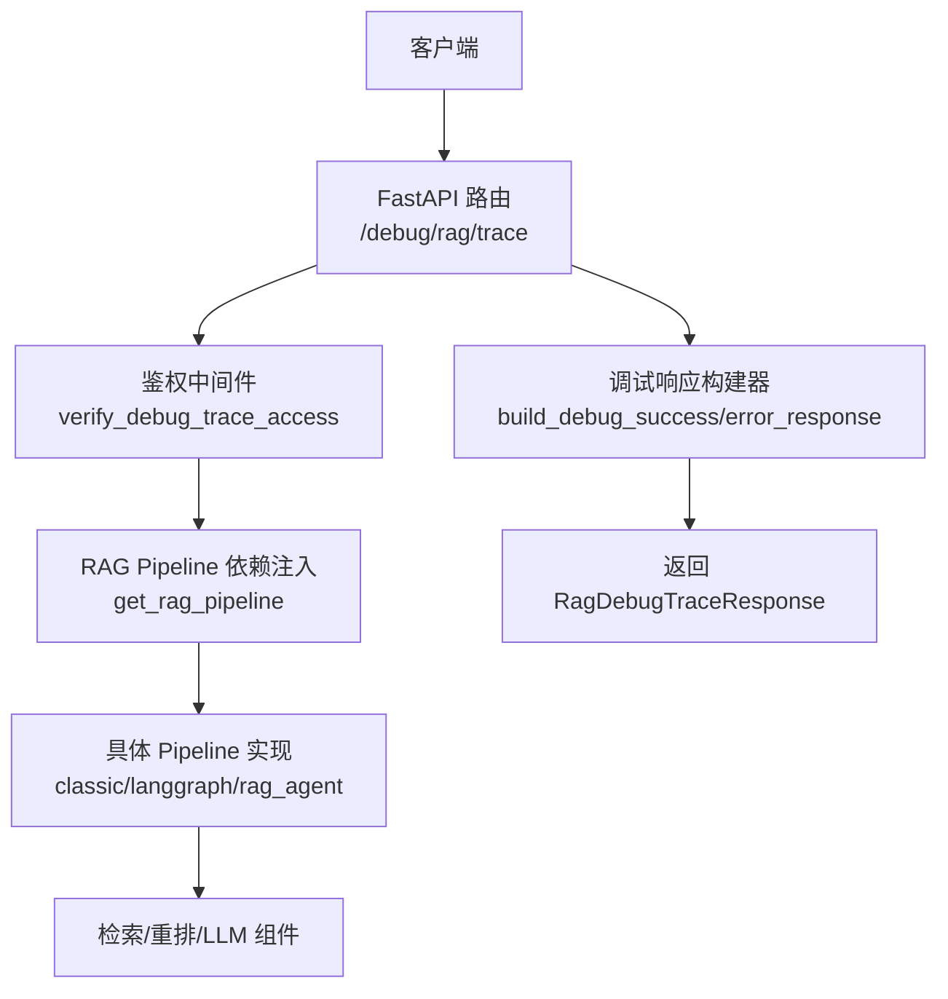
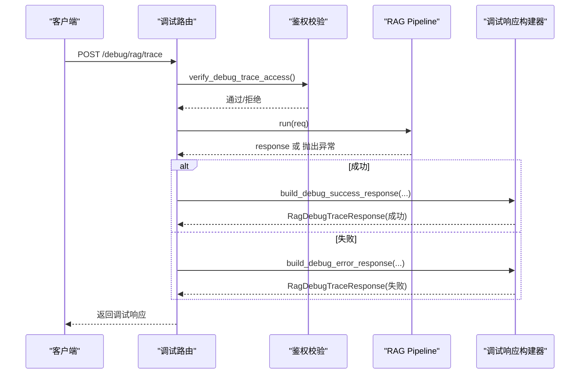
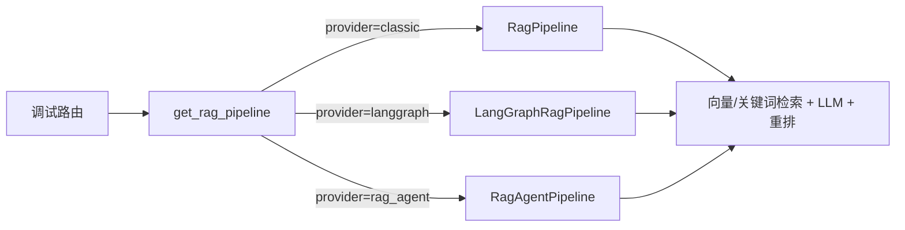

# 调试接口与工具

<cite>
**本文引用的文件**
- [debug_trace_routes.py](file://python-agent-study/src/fast_app/api/debug_trace_routes.py)
- [debug_trace_schema.py](file://python-agent-study/src/fast_app/schemas/debug_trace_schema.py)
- [debug_trace_builder.py](file://python-agent-study/src/fast_app/services/debug_trace_builder.py)
- [config.py](file://python-agent-study/src/fast_app/core/config.py)
- [rag_chat_schema.py](file://python-agent-study/src/fast_app/schemas/rag_chat_schema.py)
- [rag_dependencies.py](file://python-agent-study/src/fast_app/dependencies/rag_dependencies.py)
</cite>

## 目录
1. [简介](#简介)
2. [项目结构](#项目结构)
3. [核心组件](#核心组件)
4. [架构总览](#架构总览)
5. [详细组件分析](#详细组件分析)
6. [依赖关系分析](#依赖关系分析)
7. [性能考量](#性能考量)
8. [故障排查指南](#故障排查指南)
9. [结论](#结论)
10. [附录：调试场景操作手册](#附录：调试场景操作手册)

## 简介
本文件面向开发者与测试人员，系统化说明 RAG 链路的调试接口使用方法、请求参数与响应格式，解释如何通过调试接口获取链路执行详情、中间状态数据与性能指标。文档同时覆盖安全控制（开关与令牌）、访问权限管理、使用限制，并提供链路追踪、性能分析、错误诊断等常见调试场景的操作指南。

## 项目结构
调试能力由以下模块协同实现：
- API 路由层：暴露 /debug 前缀的调试端点，负责鉴权、计时、日志与异常包装。
- 数据模型层：定义调试响应的结构化快照，包括请求快照、运行时配置快照、来源快照与错误快照。
- 构建器层：将正常或异常的 RAG 响应转换为统一的调试响应结构。
- 配置层：提供调试开关、令牌、最大来源数、慢调用阈值等运行期配置。
- 依赖注入层：按配置装配不同的 RAG Pipeline 与检索/重排组件。

图表来源
- [debug_trace_routes.py:22-49](file://python-agent-study/src/fast_app/api/debug_trace_routes.py#L22-L49)
- [debug_trace_builder.py:38-94](file://python-agent-study/src/fast_app/services/debug_trace_builder.py#L38-L94)
- [rag_dependencies.py:463-549](file://python-agent-study/src/fast_app/dependencies/rag_dependencies.py#L463-L549)

章节来源
- [debug_trace_routes.py:22-49](file://python-agent-study/src/fast_app/api/debug_trace_routes.py#L22-L49)
- [debug_trace_schema.py:8-57](file://python-agent-study/src/fast_app/schemas/debug_trace_schema.py#L8-L57)
- [debug_trace_builder.py:14-94](file://python-agent-study/src/fast_app/services/debug_trace_builder.py#L14-L94)
- [config.py:28-52](file://python-agent-study/src/fast_app/core/config.py#L28-L52)
- [rag_dependencies.py:463-549](file://python-agent-study/src/fast_app/dependencies/rag_dependencies.py#L463-L549)

## 核心组件
- 调试路由端点：POST /debug/rag/trace，接收 RAG 聊天请求体，返回包含执行详情与性能的调试响应。
- 安全校验：通过请求头 X-Debug-Trace-Token 与配置的调试令牌比对；支持全局开关 debug_trace_enabled。
- 调试响应构建：成功时封装请求快照、运行时快照、耗时、回答长度、来源列表；失败时封装错误快照与耗时。
- 配置项：调试开关、调试令牌、最大 sources 数量、慢调用阈值等。
- Pipeline 注入：根据 rag_pipeline_provider 选择 classic、langgraph 或 rag_agent 三种执行路径。

章节来源
- [debug_trace_routes.py:28-49](file://python-agent-study/src/fast_app/api/debug_trace_routes.py#L28-L49)
- [debug_trace_builder.py:14-94](file://python-agent-study/src/fast_app/services/debug_trace_builder.py#L14-L94)
- [config.py:28-52](file://python-agent-study/src/fast_app/core/config.py#L28-L52)
- [rag_dependencies.py:463-549](file://python-agent-study/src/fast_app/dependencies/rag_dependencies.py#L463-L549)

## 架构总览
调试端点以 FastAPI 路由为中心，结合依赖注入与配置系统，统一输出结构化调试信息。其关键流程如下：
- 进入路由后先进行鉴权（开关 + 令牌）。
- 记录开始时间并提取 request_id/trace_id。
- 调用 RAG Pipeline 执行查询。
- 捕获业务异常与通用异常，分别构建成功或失败的调试响应。
- 记录结束日志与慢调用告警。
- 返回调试响应。

图表来源
- [debug_trace_routes.py:43-129](file://python-agent-study/src/fast_app/api/debug_trace_routes.py#L43-L129)
- [debug_trace_builder.py:38-94](file://python-agent-study/src/fast_app/services/debug_trace_builder.py#L38-L94)

## 详细组件分析

### 调试路由端点：POST /debug/rag/trace
- 功能：执行一次完整的 RAG 链路，并以调试响应形式返回执行详情、中间状态与性能指标。
- 请求体：复用 RAG 聊天请求模型，支持检索模式、top_k、候选数量、最低分数阈值、过滤条件等。
- 响应体：统一为 RagDebugTraceResponse，包含状态、请求快照、运行时快照、耗时、回答长度、来源数量与来源明细，以及可选的错误快照。
- 安全：必须携带 X-Debug-Trace-Token，且服务需开启 debug_trace_enabled。
- 性能：自动记录耗时，并在超过 slow_rag_pipeline_threshold_ms 时记录慢调用事件。

章节来源
- [debug_trace_routes.py:22-49](file://python-agent-study/src/fast_app/api/debug_trace_routes.py#L22-L49)
- [debug_trace_routes.py:65-129](file://python-agent-study/src/fast_app/api/debug_trace_routes.py#L65-L129)
- [rag_chat_schema.py:17-104](file://python-agent-study/src/fast_app/schemas/rag_chat_schema.py#L17-L104)
- [debug_trace_schema.py:47-57](file://python-agent-study/src/fast_app/schemas/debug_trace_schema.py#L47-L57)

#### 请求参数说明（基于 RagChatRequest）
- query：用户问题，必填，去除空白后非空。
- mode：检索模式，vector / keyword / hybrid，默认 hybrid。
- top_k：最多返回文档数量，范围 1-20，默认 5。
- min_score：最低文档分数阈值，范围 0.0-1.0，默认 0.0。
- candidate_k：每个召回源候选数量，为空时使用 top_k，范围 1-50。
- filters：metadata 过滤条件，如 source_path、section_path。
- allow_web_fallback / allow_direct_web：是否允许公开 Web 搜索相关行为。
- min_knowledge_version：可选的知识版本下限。
- dataset_id / nl2sql_action：可选的结构化数据查询绑定。

章节来源
- [rag_chat_schema.py:17-104](file://python-agent-study/src/fast_app/schemas/rag_chat_schema.py#L17-L104)

#### 响应字段说明（基于 RagDebugTraceResponse）
- status：success 或 failed。
- request_id / trace_id：本次请求标识，用于日志对齐。
- request：请求快照，包含 query、mode、top_k、candidate_k、min_score、filters。
- runtime：运行时快照，包含 pipeline_provider、llm_provider、llm_model_name、向量/关键词检索 provider、reranker provider、rerank_model_name、langsmith_project。
- latency_ms：总耗时（毫秒）。
- answer_length：回答文本长度（失败时可空）。
- source_count：返回来源数量。
- sources：来源快照列表，包含 id、source、retrieval_sources、title、section_path、score、scores、metadata、content_preview。
- error：失败时的错误快照，包含 code、message、error_category、error_type。

章节来源
- [debug_trace_schema.py:8-57](file://python-agent-study/src/fast_app/schemas/debug_trace_schema.py#L8-L57)
- [debug_trace_builder.py:38-94](file://python-agent-study/src/fast_app/services/debug_trace_builder.py#L38-L94)

### 安全控制与访问权限
- 全局开关：debug_trace_enabled 控制调试接口是否可用；关闭时直接返回 404。
- 令牌校验：请求头 X-Debug-Trace-Token 必须与配置中的 debug_trace_token 一致；不一致返回 403。
- 建议：生产环境关闭调试接口，或在受控网络内启用并严格管理令牌。

章节来源
- [debug_trace_routes.py:28-40](file://python-agent-study/src/fast_app/api/debug_trace_routes.py#L28-L40)
- [config.py:28-32](file://python-agent-study/src/fast_app/core/config.py#L28-L32)

### 性能指标与慢调用告警
- 耗时统计：start_timer/elapsed_ms 计算端到端耗时。
- 慢调用阈值：slow_rag_pipeline_threshold_ms 用于标记慢调用事件，便于定位瓶颈。
- 来源裁剪：debug_trace_max_sources 限制返回 sources 的最大数量，避免响应过大。

章节来源
- [debug_trace_routes.py:50-129](file://python-agent-study/src/fast_app/api/debug_trace_routes.py#L50-L129)
- [config.py:28-52](file://python-agent-study/src/fast_app/core/config.py#L28-L52)
- [debug_trace_builder.py:38-70](file://python-agent-study/src/fast_app/services/debug_trace_builder.py#L38-L70)

### 数据来源与中间状态
- 请求快照：记录实际使用的 query、检索模式、top_k、候选数量、最低分数阈值与过滤条件。
- 运行时快照：记录当前使用的 pipeline、LLM、检索与重排组件及 LangSmith 项目名。
- 来源快照：记录每个命中 chunk 的来源、多阶段分数明细、标题、章节路径、元数据与内容预览。
- 错误快照：记录错误码、消息、分类与异常类型，便于快速定位问题。

章节来源
- [debug_trace_schema.py:8-57](file://python-agent-study/src/fast_app/schemas/debug_trace_schema.py#L8-L57)
- [debug_trace_builder.py:14-94](file://python-agent-study/src/fast_app/services/debug_trace_builder.py#L14-L94)

## 依赖关系分析
调试端点依赖 RAG Pipeline 的依赖注入，后者根据配置动态选择具体实现：
- classic：经典 RAG 流水线。
- langgraph：基于 LangGraph 的 RAG 流水线。
- rag_agent：独立的 RAG Agent 图，复用检索/重排/LLM 依赖，并集成对话记忆、任务规划与执行等能力。

图表来源
- [rag_dependencies.py:463-549](file://python-agent-study/src/fast_app/dependencies/rag_dependencies.py#L463-L549)

章节来源
- [rag_dependencies.py:463-549](file://python-agent-study/src/fast_app/dependencies/rag_dependencies.py#L463-L549)

## 性能考量
- 合理设置 top_k 与 candidate_k，避免过大的检索与排序开销。
- 使用 min_score 过滤低质量来源，减少后续处理成本。
- 利用 debug_trace_max_sources 控制响应体积，降低带宽与解析压力。
- 关注 slow_rag_pipeline_threshold_ms 告警，定位慢环节（检索、重排、LLM）。
- 在本地或测试环境可启用 mock 组件以降低外部依赖延迟。

[本节为通用指导，不直接分析具体文件]

## 故障排查指南
- 404 Not Found：调试接口未启用（debug_trace_enabled=false），请检查配置。
- 403 Debug trace access denied：令牌缺失或不匹配，请检查 X-Debug-Trace-Token 与配置。
- 业务异常：查看 error.code、error.message、error.category、error.type，结合日志中的 request_id/trace_id 定位。
- 无来源或来源过少：检查 mode、top_k、candidate_k、min_score 与 filters 设置；确认知识库已正确入库。
- 响应过大：调整 debug_trace_max_sources 或缩小 top_k/candidate_k。
- 慢调用：依据 slow_rag_pipeline_threshold_ms 告警，逐步排查检索、重排、LLM 各环节耗时。

章节来源
- [debug_trace_routes.py:28-40](file://python-agent-study/src/fast_app/api/debug_trace_routes.py#L28-L40)
- [debug_trace_routes.py:76-129](file://python-agent-study/src/fast_app/api/debug_trace_routes.py#L76-L129)
- [debug_trace_schema.py:40-57](file://python-agent-study/src/fast_app/schemas/debug_trace_schema.py#L40-L57)
- [config.py:28-52](file://python-agent-study/src/fast_app/core/config.py#L28-L52)

## 结论
调试接口提供了对 RAG 链路的全景观测能力：从请求参数到运行时配置，从来源明细到错误快照，从端到端耗时到慢调用告警。通过合理的配置与安全控制，可在开发与测试环境中高效完成链路追踪、性能分析与错误诊断。

[本节为总结性内容，不直接分析具体文件]

## 附录：调试场景操作手册

### 场景一：链路追踪
- 目标：验证一次查询经过的检索与生成步骤，确认来源与分数。
- 步骤：
  - 确保调试接口已启用并配置令牌。
  - 发送 POST /debug/rag/trace，携带 query、mode、top_k、min_score、filters。
  - 检查响应中的 request、runtime、sources、latency_ms。
- 关注点：
  - retrieval_sources 显示哪些组件命中了该 chunk。
  - scores 展示各阶段分数明细（向量、关键词、RRF、重排）。
  - source_count 与 sources 列表反映最终上下文规模。

章节来源
- [debug_trace_routes.py:43-129](file://python-agent-study/src/fast_app/api/debug_trace_routes.py#L43-L129)
- [debug_trace_schema.py:28-57](file://python-agent-study/src/fast_app/schemas/debug_trace_schema.py#L28-L57)
- [rag_chat_schema.py:137-186](file://python-agent-study/src/fast_app/schemas/rag_chat_schema.py#L137-L186)

### 场景二：性能分析
- 目标：识别慢调用环节，优化检索与生成性能。
- 步骤：
  - 调整 top_k、candidate_k、min_score，观察 latency_ms 与 source_count 变化。
  - 关注 slow_rag_pipeline_threshold_ms 告警，定位慢组件。
  - 切换 rag_pipeline_provider（classic/langgraph/rag_agent）对比性能。
- 关注点：
  - runtime 中各 provider 与模型名称。
  - 不同 provider 下的检索与重排效果差异。

章节来源
- [debug_trace_routes.py:50-129](file://python-agent-study/src/fast_app/api/debug_trace_routes.py#L50-L129)
- [config.py:28-52](file://python-agent-study/src/fast_app/core/config.py#L28-L52)
- [rag_dependencies.py:463-549](file://python-agent-study/src/fast_app/dependencies/rag_dependencies.py#L463-L549)

### 场景三：错误诊断
- 目标：快速定位失败原因与影响范围。
- 步骤：
  - 发送调试请求，若失败则检查 error 字段。
  - 结合 request_id/trace_id 在后端日志中检索完整上下文。
  - 根据 error_category 与 error_type 判断是输入校验、外部服务还是系统异常。
- 关注点：
  - 404/403 属于安全控制层面，优先检查配置与令牌。
  - 业务异常需结合上游服务状态与输入参数复现。

章节来源
- [debug_trace_routes.py:76-129](file://python-agent-study/src/fast_app/api/debug_trace_routes.py#L76-L129)
- [debug_trace_schema.py:40-57](file://python-agent-study/src/fast_app/schemas/debug_trace_schema.py#L40-L57)

### 场景四：检索策略调优
- 目标：提升召回质量与相关性。
- 步骤：
  - 尝试不同 mode（vector/keyword/hybrid）。
  - 调整 candidate_k 与 min_score，平衡召回量与精度。
  - 使用 filters 限定 source_path/section_path，聚焦特定文档或章节。
- 关注点：
  - 观察 scores 与 source_count 的变化，评估策略效果。
  - 结合 content_preview 与 section_path 验证命中片段的相关性。

章节来源
- [rag_chat_schema.py:17-104](file://python-agent-study/src/fast_app/schemas/rag_chat_schema.py#L17-L104)
- [debug_trace_schema.py:8-37](file://python-agent-study/src/fast_app/schemas/debug_trace_schema.py#L8-L37)

### 场景五：安全与合规
- 目标：确保调试接口仅在受控环境使用。
- 步骤：
  - 在生产环境关闭 debug_trace_enabled。
  - 在开发/测试环境启用并严格管理 debug_trace_token。
  - 限制网络访问与审计调用。
- 关注点：
  - 404/403 响应表明安全控制生效。
  - 避免在生产泄露调试令牌或启用调试接口。

章节来源
- [debug_trace_routes.py:28-40](file://python-agent-study/src/fast_app/api/debug_trace_routes.py#L28-L40)
- [config.py:28-32](file://python-agent-study/src/fast_app/core/config.py#L28-L32)