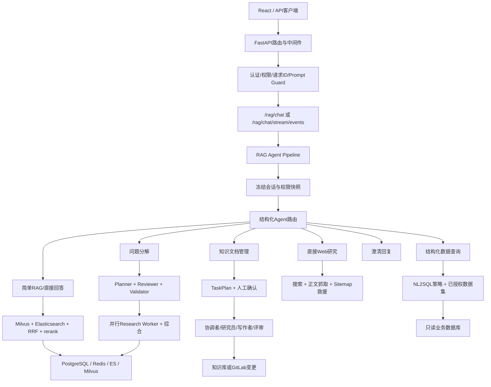
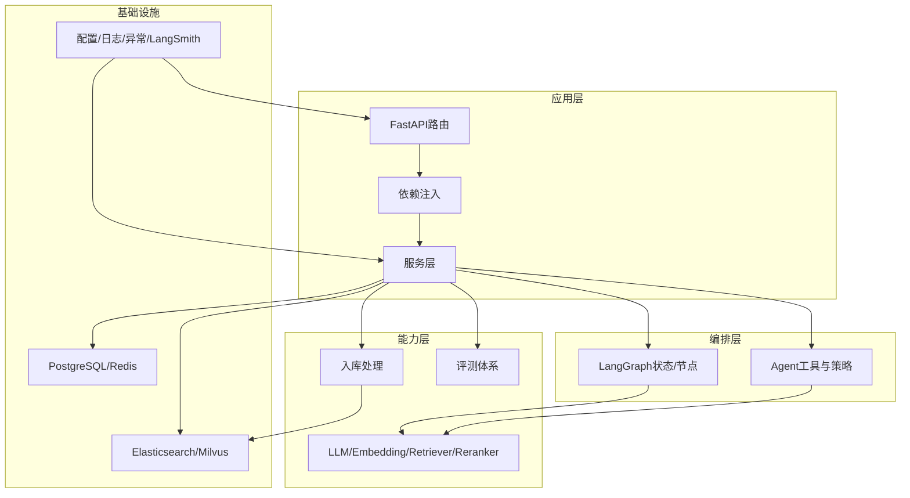
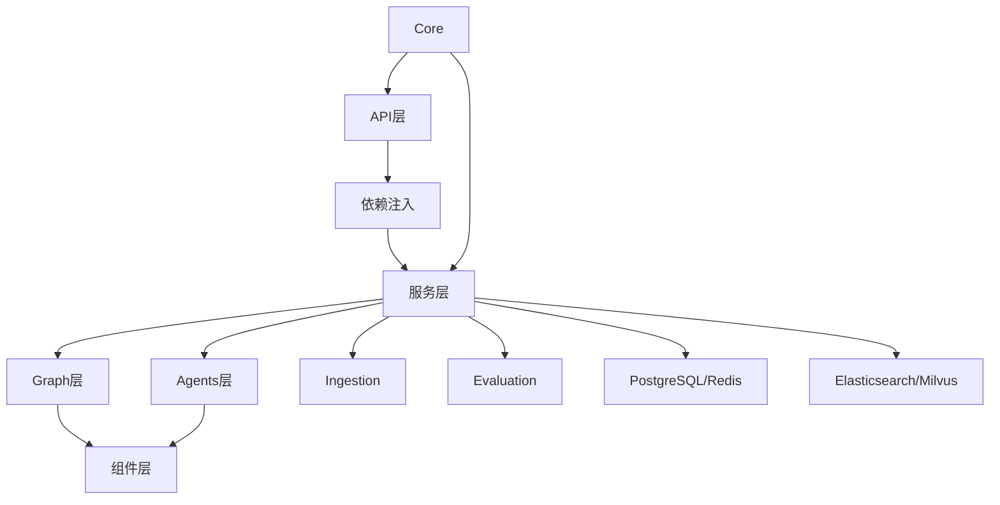

# 学习路径

<cite>
**本文引用的文件**
- [README.md](file://README.md)
- [当前学习进度.md](file://learning-docs/当前学习进度.md)
- [总学习路线.md](file://learning-docs/2026年6月17日备份/GPT修改意见后的文档/GPT修改后-总学习路线.md)
- [学习路线优先级.md](file://learning-docs/学习路线优先级.md)
- [阶段13-1：LangGraph state重新梳理.md](file://learning-docs/phase-13/13-1-LangGraph-state重新梳理.md)
- [阶段14-1：Conversation/Message数据模型.md](file://learning-docs/phase-14/14-1-Conversation-Message-数据模型.md)
</cite>

## 目录
1. [引言](#引言)
2. [项目结构](#项目结构)
3. [核心组件](#核心组件)
4. [架构总览](#架构总览)
5. [详细组件分析](#详细组件分析)
6. [依赖分析](#依赖分析)
7. [性能考虑](#性能考虑)
8. [故障排查指南](#故障排查指南)
9. [结论](#结论)
10. [附录](#附录)

## 引言
本学习路径面向不同经验水平的开发者，基于仓库中的阶段性学习文档与工程现状，制定循序渐进的学习方案。内容覆盖RAG技术基础、LangGraph框架、企业级后端开发、多Agent协作等核心知识点，并给出每个阶段的学习目标、关键概念、实践任务与考核标准，同时提供学习资源推荐与常见问题解答。整体目标是帮助学习者以“可运行、可评测、可观察、可授权”的RAG Agent后端作品为主线，逐步掌握从检索到生成、从单轮到多轮、从工具调用到权限与安全的企业级能力。

## 项目结构
本项目为Python/FastAPI/RAG/Agent后端工程，模块按职责分层组织，包含API层、服务层、图与Agent编排、组件封装、入库Ingestion、评测Evaluation、数据库迁移、测试脚本与运行时数据等。学习时应优先理解分层边界与主链路入口，再按阶段推进具体能力。

图示来源
- [README.md:29-67](file://README.md#L29-L67)

章节来源
- [README.md:99-124](file://README.md#L99-L124)

## 核心组件
- RAG检索与增强：向量检索、关键词检索、混合检索、RRF融合、rerank精排、sources与多阶段分数、stream事件协议。
- LangGraph编排：显式StateGraph、条件边、工具节点、循环控制、错误分支、状态集中管理。
- Ingestion入库：DocumentLoader抽象、ChunkBuilder工程化、metadata标准化、ES/Milvus双写、幂等写入、CLI工具。
- Evaluation评测：检索指标、生成指标、离线评测脚本、回归报告。
- 可观测性：request_id/trace_id、结构化日志、LangSmith trace、调试接口、耗时统计。
- 多轮对话：Conversation/Message模型、历史窗口、query rewrite、短期记忆与持久化。
- 安全与权限：API Key/Bearer Token、JWT、RBAC、部门级ACL、Prompt Guard、输入校验与大小限制。
- 多Agent协作：结构化路由、Agentic Research、文档多Agent、TaskPlan与人工确认。

章节来源
- [当前学习进度.md:119-181](file://learning-docs/当前学习进度.md#L119-L181)
- [README.md:9-27](file://README.md#L9-L27)

## 架构总览
系统采用分层架构：API层负责HTTP/SSE与协议；依赖注入装配Provider；服务层承载RAG/Agent流程；组件层封装LLM/Embedding/Retriever/Reranker；Graph层定义LangGraph状态与节点；Agents层负责工具、MCP适配与运行时策略；Ingestion负责文档加载与双写；Evaluation负责评测；Core提供配置、日志、异常、LangSmith与请求上下文；Schemas与Domain分别定义HTTP模型与内部领域模型。

图示来源
- [README.md:29-67](file://README.md#L29-L67)
- [当前学习进度.md:300-334](file://learning-docs/当前学习进度.md#L300-L334)

## 详细组件分析

### 阶段一：RAG基础与工程化（阶段9）
学习目标
- 掌握RAG检索链路的工程化设计：多阶段分数保留、sources展示、外部client生命周期管理、超时重试降级、stream事件协议。
- 能解释为何不能只用单一score表示检索质量，以及为什么需要保留vector/keyword/rrf/rerank等多阶段信息。

关键概念
- RetrievedDoc/RagSource/FusionResult
- Milvus collection schema与Elasticsearch index mapping对齐
- FastAPI lifespan管理外部client
- timeout/retry/fallback策略
- stream event协议设计

实践任务
- 重构数据模型，保留多阶段分数与retrieval_sources。
- 将Milvus/ES查询参数显式化，完善output_fields与filters。
- 接入真实Markdown ingestion，完成ES/Milvus双写。
- 实现基础stream事件协议，保证token-only兼容。

考核标准
- 能返回稳定的sources与多阶段分数。
- 能在外部服务异常时降级并继续返回可用结果。
- 能通过PowerShell或测试脚本验证流式接口行为。

章节来源
- [总学习路线.md:106-175](file://learning-docs/2026年6月17日备份/GPT修改意见后的文档/GPT修改后-总学习路线.md#L106-L175)
- [当前学习进度.md:340-377](file://learning-docs/当前学习进度.md#L340-L377)

### 阶段二：知识库入库工程化（阶段10）
学习目标
- 建立可重复运行的Ingestion流水线：文档读取、清洗、切分、metadata构建、embedding、双写、幂等写入、重建与清理。
- 理解chunk_id/doc_id稳定性、ES IK中文分词对召回的影响、Milvus output_fields对metadata回流的限制。

关键概念
- DocumentLoader抽象
- ChunkBuilder工程化
- metadata标准化
- Milvus/ES双写一致性
- CLI命令行工具

实践任务
- 实现Markdown/Text DocumentLoader与ChunkBuilder。
- 初始化Milvus collection schema与ES index mapping。
- 实现replace_docs幂等写入与安全reset-stores脚本。
- 提供Ingestion CLI并编写回归测试。

考核标准
- 能稳定导入真实Markdown文档并双写到ES/Milvus。
- 能重建索引并通过测试用例验证召回质量。
- CLI可被脚本化执行，具备幂等性与安全性。

章节来源
- [总学习路线.md:178-249](file://learning-docs/2026年6月17日备份/GPT修改意见后的文档/GPT修改后-总学习路线.md#L178-L249)
- [当前学习进度.md:380-429](file://learning-docs/当前学习进度.md#L380-L429)

### 阶段三：RAG评测体系（阶段11）
学习目标
- 建立离线评测体系：检索指标、生成指标、对比实验、回归报告。
- 能判断改动是否提升或降低质量，避免凭感觉优化。

关键概念
- Recall@K/MRR/first_hit_rank
- 向量召回评测与关键词召回评测
- Hybrid对比实验
- 生成质量：引用来源、编造检测、拒答判定
- 离线pipeline批量评测与报告输出

实践任务
- 构建小型问答评测集。
- 实现Milvus与ES召回评测脚本。
- 实现生成质量评测与Markdown/JSON报告。
- 将评测纳入日常修改流程。

考核标准
- 能输出检索与生成质量报告。
- 能对比vector/keyword/hybrid/rerank效果。
- 能识别无答案问题的拒答稳定性。

章节来源
- [总学习路线.md:252-316](file://learning-docs/2026年6月17日备份/GPT修改意见后的文档/GPT修改后-总学习路线.md#L252-L316)
- [当前学习进度.md:433-487](file://learning-docs/当前学习进度.md#L433-L487)

### 阶段四：可观测性与调试（阶段12）
学习目标
- 让RAG/Agent请求从黑盒变为可观察、可排查、可复盘的工程链路。
- 掌握request_id/trace_id、结构化日志、LangSmith trace、慢请求定位。

关键概念
- RequestIdMiddleware与ContextVar
- 检索链路日志与Milvus/ES查询trace
- LLM调用日志与耗时统计
- 错误日志分层与debug trace接口

实践任务
- 接入LangSmith Python，对齐Classic与LangGraph trace。
- 实现POST /debug/rag/trace内部调试接口。
- 增加结构化日志字段与耗时统计。

考核标准
- 能通过trace定位检索与生成问题。
- 能区分用户错误、外部服务错误与系统错误。
- 能输出慢请求分析与耗时拆解。

章节来源
- [总学习路线.md:319-388](file://learning-docs/2026年6月17日备份/GPT修改意见后的文档/GPT修改后-总学习路线.md#L319-L388)
- [当前学习进度.md:489-545](file://learning-docs/当前学习进度.md#L489-L545)

### 阶段五：LangGraph深化与Agent工程迁移（阶段13）
学习目标
- 将Node.js/Nest中createAgent与middleware经验迁移到Python/FastAPI/LangGraph。
- 掌握条件边、工具节点、循环控制、错误分支、RAG Agent最小闭环。

关键概念
- LangGraph state重新梳理与集中管理
- create_agent风格Agent与显式Graph组装的职责边界
- 工具节点封装与MCP tool adapter最小实现
- 循环终止条件与错误分支策略

实践任务
- 集中管理GraphRagState与initial_state构造。
- 实现条件边：根据query判断是否需要检索。
- 抽象retriever/calculator/web_search为LangGraph tool。
- 实现MCP tool adapter最小链路。
- 实现RAG Agent：先判断、再检索、再回答。

考核标准
- 能清晰说明何时使用Pipeline、Graph或create_agent。
- 能实现可控的Agent流程，避免无限循环与错误扩散。
- 能保持stream协议不变并扩展结构化事件。

章节来源
- [阶段13-1：LangGraph state重新梳理.md:1-526](file://learning-docs/phase-13/13-1-LangGraph-state重新梳理.md#L1-L526)
- [总学习路线.md:391-473](file://learning-docs/2026年6月17日备份/GPT修改意见后的文档/GPT修改后-总学习路线.md#L391-L473)
- [当前学习进度.md:598-741](file://learning-docs/当前学习进度.md#L598-L741)

### 阶段六：多轮对话与记忆（阶段14）
学习目标
- 从单轮问答升级为支持多轮上下文、短期会话记忆、query rewrite的后端服务。
- 掌握Conversation/Message模型、历史窗口、Redis短期记忆与PostgreSQL持久化。

关键概念
- Conversation容器与Message结构化消息
- Memory Store边界与InMemory实现
- 最近N轮历史窗口与query rewrite
- session_id/user_id隔离与多轮回归测试

实践任务
- 定义Conversation/Message数据模型与存储协议。
- 实现最近N轮历史窗口与query rewrite。
- 接入Redis短期记忆与PostgreSQL消息持久化。
- 实现多轮对话回归测试。

考核标准
- 能处理第二轮追问并结合历史改写检索query。
- 能保持现有接口行为不变并扩展session_id。
- 能保存user/assistant消息并在流式完成后持久化。

章节来源
- [阶段14-1：Conversation/Message数据模型.md:1-592](file://learning-docs/phase-14/14-1-Conversation-Message-数据模型.md#L1-L592)
- [总学习路线.md:476-544](file://learning-docs/2026年6月17日备份/GPT修改意见后的文档/GPT修改后-总学习路线.md#L476-L544)
- [当前学习进度.md:151-192](file://learning-docs/当前学习进度.md#L151-L192)

### 阶段七：权限、安全与接口治理（阶段15）
学习目标
- 将RAG/Agent服务从个人学习接口提升为有基本安全边界的后端服务。
- 掌握认证、鉴权、输入校验、限流、敏感信息保护、Agent工具权限。

关键概念
- API Key/Bearer Token认证与JWT
- 用户身份体系与部门级知识库权限
- 输入校验与请求大小限制
- Prompt injection基础防护与debug接口隔离

实践任务
- 实现X-API-Key与Authorization Bearer认证。
- 新增users/api_keys/refresh_tokens表与迁移。
- 实现部门级文档检索权限下推到ES/Milvus。
- 增加RequestSizeLimitMiddleware与MAX_REQUEST_BODY_BYTES。

考核标准
- 能启用AUTH_ENABLED并拒绝未认证请求。
- 能按部门范围过滤检索结果。
- 能拦截超大请求并返回明确错误码。

章节来源
- [当前学习进度.md:161-181](file://learning-docs/当前学习进度.md#L161-L181)
- [总学习路线.md:547-612](file://learning-docs/2026年6月17日备份/GPT修改意见后的文档/GPT修改后-总学习路线.md#L547-L612)

### 阶段八：部署、配置与运行环境（阶段16）
学习目标
- 使项目具备可部署、可配置、可迁移的运行能力。
- 掌握环境变量分层、Docker Compose、健康检查与启动顺序。

关键概念
- Settings分环境配置与.env.example
- Dockerfile与docker-compose.yml
- Milvus/ES初始化与健康检查
- 本地一键启动说明

实践任务
- 提供.env.example与分环境Settings。
- 编写Dockerfile与docker-compose.yml。
- 实现health check与启动脚本。
- 编写本地启动与初始化文档。

考核标准
- 能通过docker-compose拉起依赖服务。
- 能验证Milvus/ES初始化成功。
- 能提供清晰的本地启动手册。

章节来源
- [总学习路线.md:615-682](file://learning-docs/2026年6月17日备份/GPT修改意见后的文档/GPT修改后-总学习路线.md#L615-L682)

### 阶段九：业务数据建模与异步任务（阶段17-18）
学习目标
- 迁移PostgreSQL经验到Python/FastAPI，学习SQLAlchemy/Alembic与事务边界。
- 将耗时任务从HTTP请求拆出，建立后台任务处理能力。

关键概念
- SQLAlchemy模型与Alembic迁移
- Repository/Service分层与事务边界
- 任务队列选型与Redis角色
- 失败重试、幂等与任务日志

实践任务
- 设计用户/知识库/文档/会话/任务等业务表。
- 实现Alembic迁移与Repository层。
- 引入任务队列并实现Ingestion任务化。
- 提供任务进度查询与恢复接口。

考核标准
- 能维护业务事实库并与向量/搜索引擎职责分离。
- 能异步处理长任务并提供可观察状态。
- 能实现幂等重试与失败恢复。

章节来源
- [总学习路线.md:685-795](file://learning-docs/2026年6月17日备份/GPT修改意见后的文档/GPT修改后-总学习路线.md#L685-L795)

### 阶段十：作品化收口（阶段20）
学习目标
- 提前并行推进README、架构图、接口文档、启动手册、评测说明与设计决策记录。
- 形成可展示、可演示、可面试讲述的作品主线。

关键概念
- 项目定位与核心能力列表
- 架构图与主要API说明
- 测试与评测入口
- 已知边界与后续演进

实践任务
- 重写README并整理架构图。
- 整理主要API与关键功能开关。
- 提供测试与评测脚本入口。
- 记录已知边界与后续路线。

考核标准
- README能指导他人快速启动与调用。
- 架构图能清晰表达组件交互与数据流向。
- 接口文档能支撑前端集成。

章节来源
- [当前学习进度.md:147-150](file://learning-docs/当前学习进度.md#L147-L150)
- [README.md:29-97](file://README.md#L29-L97)

## 依赖分析
项目依赖关系遵循分层与职责分离原则：API层依赖依赖注入与服务层；服务层依赖Graph与Agents；Graph与Agents依赖组件层；所有层依赖Core提供的配置、日志与异常处理；服务层与Agents通过Ingestion与Evaluation连接外部存储与评测体系。

图示来源
- [当前学习进度.md:300-334](file://learning-docs/当前学习进度.md#L300-L334)
- [README.md:29-67](file://README.md#L29-L67)

章节来源
- [当前学习进度.md:300-334](file://learning-docs/当前学习进度.md#L300-L334)

## 性能考虑
- 检索链路应保留多阶段分数与sources，便于定位瓶颈与调优。
- 外部服务调用需配置timeout/retry/fallback，避免雪崩。
- 流式接口应保持token-only协议，结构化信息走stream_events。
- 使用LangSmith与结构化日志进行慢请求定位与耗时拆解。
- 大文档Ingestion与批量任务应异步化，避免阻塞HTTP请求。

## 故障排查指南
- 使用POST /debug/rag/trace获取受token保护的RAG调试信息。
- 通过LangSmith trace对齐Classic与LangGraph执行链路。
- 区分用户错误、外部服务错误与系统错误，避免泄露内部细节。
- 检查Milvus/ES查询参数与output_fields，确保metadata回流正确。
- 验证stream事件协议是否被破坏，必要时扩展而非修改token-only流。

章节来源
- [当前学习进度.md:489-545](file://learning-docs/当前学习进度.md#L489-L545)
- [README.md:241-261](file://README.md#L241-L261)

## 结论
本学习路径以“可运行、可评测、可观察、可授权”的RAG Agent后端作品为主线，从RAG基础与工程化起步，逐步进入入库工程化、评测体系、可观测性、LangGraph与Agent工程迁移、多轮对话、权限安全、部署配置、业务建模与异步任务，最终完成作品化收口。每个阶段均提供明确的学习目标、关键概念、实践任务与考核标准，帮助不同经验水平的开发者循序渐进地掌握企业级RAG Agent后端开发能力。

## 附录

### 学习资源推荐
- 官方文档：LangChain、LangGraph、FastAPI、Milvus、Elasticsearch、DashScope/Qwen。
- 项目文档：README、架构图、接口文档、测试与评测手册。
- 阶段文档：各阶段学习文档与验收标准。
- 社区与博客：RAG最佳实践、Agent工程化、可观测性与评测方法。

### 常见问题解答
- 问：如何判断是否需要检索？
  - 答：通过LangGraph条件边根据state字段判断，避免盲目检索。
- 问：如何避免Agent无限循环？
  - 答：设置循环终止条件与最大步数，结合错误分支处理。
- 问：如何保证多轮对话质量？
  - 答：实现history window与query rewrite，结合structured context与严格prompt。
- 问：如何评估RAG质量？
  - 答：使用离线评测集，计算检索与生成指标，输出回归报告。
- 问：如何保障安全与权限？
  - 答：启用认证与RBAC，下推部门级ACL至检索层，限制debug与管理接口。