# 开发工作流程

<cite>
**本文引用的文件**
- [README.md](file://python-agent-study/README.md)
- [requirements.txt](file://python-agent-study/requirements.txt)
- [alembic.ini](file://python-agent-study/alembic.ini)
- [env.py](file://python-agent-study/alembic/env.py)
- [20260731_0012_add_nl2sql_datasets.py](file://python-agent-study/alembic/versions/20260731_0012_add_nl2sql_datasets.py)
- [main.py](file://python-agent-study/src/fast_app/main.py)
- [config.py](file://python-agent-study/src/fast_app/core/config.py)
- [error_responses.py](file://python-agent-study/src/fast_app/core/error_responses.py)
- [exception_handlers.py](file://python-agent-study/src/fast_app/core/exception_handlers.py)
- [conversation_tables.py](file://python-agent-study/src/fast_app/db/conversation_tables.py)
- [nl2sql_tables.py](file://python-agent-study/src/fast_app/db/nl2sql_tables.py)
- [rag_chat_routes.py](file://python-agent-study/src/fast_app/api/rag_chat_routes.py)
- [chat_routes.py](file://python-agent-study/src/fast_app/api/chat_routes.py)
- [agent_task_plan_routes.py](file://python-agent-study/src/fast_app/api/agent_task_plan_routes.py)
- [gitlab_routes.py](file://python-agent-study/src/fast_app/api/gitlab_routes.py)
- [health_routes.py](file://python-agent-study/src/fast_app/api/health_routes.py)
- [request_id_middleware.py](file://python-agent-study/src/fast_app/middlewares/request_id_middleware.py)
- [request_size_middleware.py](file://python-agent-study/src/fast_app/middlewares/request_size_middleware.py)
- [test_agent_task_router.py](file://python-agent-study/scripts/tests/agent_research/test_agent_task_router.py)
- [test_guarded_streaming.py](file://python-agent-study/scripts/tests/document_security/test_guarded_streaming.py)
- [test_markdown_parent_child.py](file://python-agent-study/scripts/tests/ingestion/test_markdown_parent_child.py)
- [test_nl2sql_module.py](file://python-agent-study/scripts/tests/nl2sql/test_nl2sql_module.py)
- [run_real_offline_rag_eval.py](file://python-agent-study/scripts/run_real_offline_rag_eval.py)
</cite>

## 目录
1. [引言](#引言)
2. [项目结构](#项目结构)
3. [核心组件](#核心组件)
4. [架构总览](#架构总览)
5. [详细组件分析](#详细组件分析)
6. [依赖分析](#依赖分析)
7. [性能考虑](#性能考虑)
8. [故障排查指南](#故障排查指南)
9. [结论](#结论)
10. [附录](#附录)

## 引言
本指南面向企业级 RAG Agent 后端项目的完整开发生命周期，覆盖从需求分析、分支策略、代码提交规范、Pull Request 流程、数据库迁移管理、测试与回归、到 CI/CD 流水线与部署上线的全链路实践。项目基于 FastAPI + LangGraph + PostgreSQL/Redis/Milvus/Elasticsearch/GitLab 等外部服务，提供统一聊天入口、结构化路由、文档多 Agent、NL2SQL、评测与可观测能力。

## 项目结构
仓库采用分层与按功能域组织的方式：
- API 层：FastAPI 路由与 SSE 边界
- 领域与服务层：RAG、Agent 任务、认证、会话、NL2SQL、知识文档、集成（GitLab）
- 数据层：SQLAlchemy 表定义、Session、Alembic 迁移
- 配置与基础设施：环境变量、日志、异常处理、请求上下文
- 测试与脚本：按功能分类的可执行回归脚本、离线评测入口
- 运行时数据：本地 TaskPlan、导入任务等运行期产物

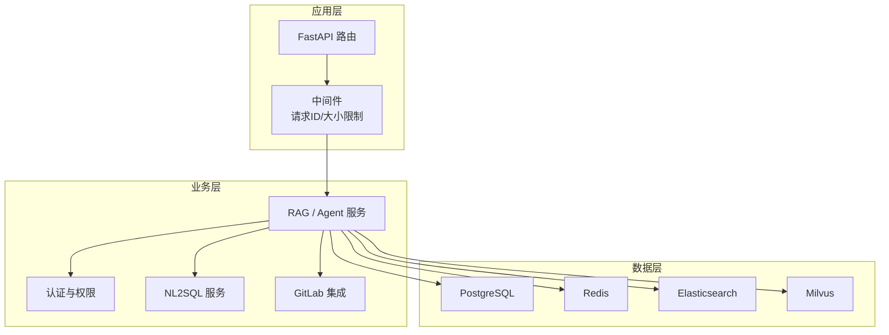

**图表来源**
- [README.md:29-59](file://python-agent-study/README.md#L29-L59)
- [main.py](file://python-agent-study/src/fast_app/main.py)
- [config.py](file://python-agent-study/src/fast_app/core/config.py)

**章节来源**
- [README.md:99-124](file://python-agent-study/README.md#L99-L124)

## 核心组件
- 应用启动与生命周期：FastAPI 应用实例、健康检查、依赖注入、全局中间件注册
- 配置与环境：集中式配置加载、开关控制、敏感信息隔离
- 数据库与迁移：SQLAlchemy 模型、Alembic 迁移脚本、版本化演进
- API 路由：聊天、流式事件、任务计划、知识库导入、NL2SQL、GitLab Webhook
- 中间件：请求 ID 追踪、请求体大小限制、安全与审计
- 错误与异常：统一错误响应、异常处理器、结构化错误码
- 测试与评测：单元/集成/回归脚本、离线评测流水线

**章节来源**
- [README.md:126-193](file://python-agent-study/README.md#L126-L193)
- [alembic.ini:1-6](file://python-agent-study/alembic.ini#L1-L6)
- [requirements.txt:1-111](file://python-agent-study/requirements.txt#L1-L111)

## 架构总览
系统以 FastAPI 为入口，通过中间件完成请求级上下文与安全校验，随后进入 RAG/Agent 主线，依据意图路由至不同子流程（简单检索、问题分解、知识文档管理、Web 研究、结构化查询、澄清回复），最终落盘或调用外部服务并返回结构化结果。

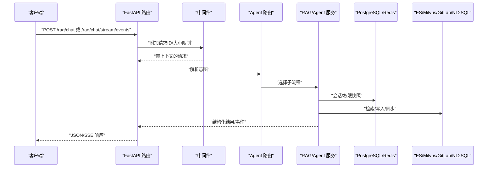

**图表来源**
- [README.md:29-59](file://python-agent-study/README.md#L29-L59)
- [rag_chat_routes.py](file://python-agent-study/src/fast_app/api/rag_chat_routes.py)
- [chat_routes.py](file://python-agent-study/src/fast_app/api/chat_routes.py)
- [agent_task_plan_routes.py](file://python-agent-study/src/fast_app/api/agent_task_plan_routes.py)
- [gitlab_routes.py](file://python-agent-study/src/fast_app/api/gitlab_routes.py)

## 详细组件分析

### 应用启动与健康检查
- 应用入口负责创建 FastAPI 实例、注册路由、中间件、异常处理器和生命周期钩子
- 健康检查接口用于容器编排与探针探测
- 配置模块集中管理环境变量、默认值与开关

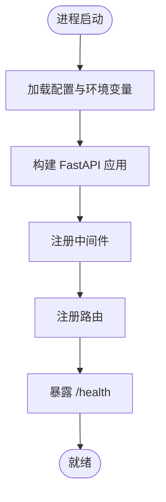

**图表来源**
- [main.py](file://python-agent-study/src/fast_app/main.py)
- [config.py](file://python-agent-study/src/fast_app/core/config.py)
- [health_routes.py](file://python-agent-study/src/fast_app/api/health_routes.py)

**章节来源**
- [README.md:165-181](file://python-agent-study/README.md#L165-L181)

### 数据库迁移管理（Alembic）
- 使用 Alembic 管理 PostgreSQL schema 的版本化演进
- 迁移脚本位于 alembic/versions，命名包含时间戳与变更描述
- 配置文件指定脚本位置与数据库连接字符串
- 新增字段或表时，应生成对应迁移并在 PR 中一并提交

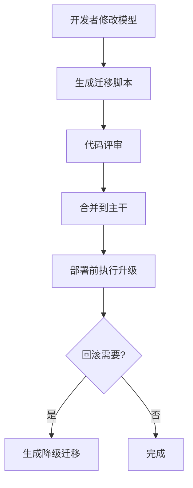

**图表来源**
- [alembic.ini:1-6](file://python-agent-study/alembic.ini#L1-L6)
- [env.py](file://python-agent-study/alembic/env.py)
- [20260731_0012_add_nl2sql_datasets.py](file://python-agent-study/alembic/versions/20260731_0012_add_nl2sql_datasets.py)

**章节来源**
- [alembic.ini:1-6](file://python-agent-study/alembic.ini#L1-L6)
- [README.md:165-169](file://python-agent-study/README.md#L165-L169)

### API 路由与请求流
- 聊天主接口与非流式/流式端点统一由路由层接收并转发
- 任务计划相关接口支持获取、确认、取消、重试等操作
- GitLab Webhook 接收外部事件并进入同步队列
- 健康检查用于服务可用性验证

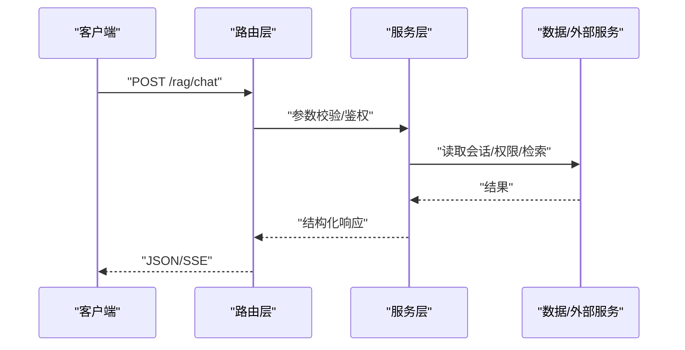

**图表来源**
- [rag_chat_routes.py](file://python-agent-study/src/fast_app/api/rag_chat_routes.py)
- [chat_routes.py](file://python-agent-study/src/fast_app/api/chat_routes.py)
- [agent_task_plan_routes.py](file://python-agent-study/src/fast_app/api/agent_task_plan_routes.py)
- [gitlab_routes.py](file://python-agent-study/src/fast_app/api/gitlab_routes.py)

**章节来源**
- [README.md:69-97](file://python-agent-study/README.md#L69-L97)

### 中间件与请求上下文
- 请求 ID 中间件为每个请求分配唯一标识，贯穿日志与追踪
- 请求大小限制中间件防止过大负载导致资源耗尽
- 这些中间件在应用启动时注册，对所有路由生效

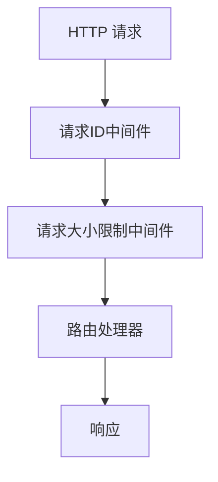

**图表来源**
- [request_id_middleware.py](file://python-agent-study/src/fast_app/middlewares/request_id_middleware.py)
- [request_size_middleware.py](file://python-agent-study/src/fast_app/middlewares/request_size_middleware.py)

**章节来源**
- [README.md:23-24](file://python-agent-study/README.md#L23-L24)

### 错误处理与异常
- 统一错误响应模型保证前端稳定消费
- 异常处理器捕获未预期异常并转换为标准错误格式
- 关键错误路径需记录 request/trace ID 便于定位

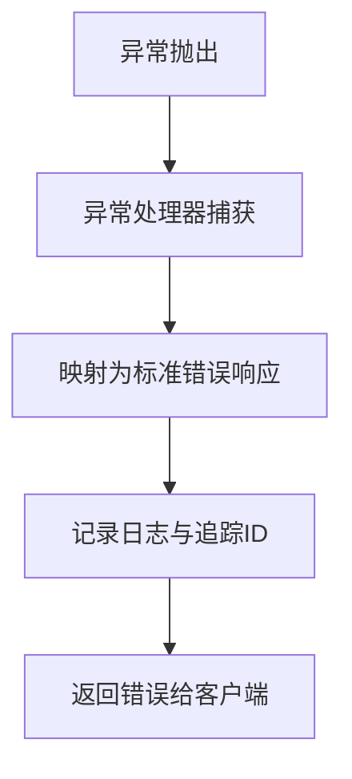

**图表来源**
- [error_responses.py](file://python-agent-study/src/fast_app/core/error_responses.py)
- [exception_handlers.py](file://python-agent-study/src/fast_app/core/exception_handlers.py)

**章节来源**
- [README.md:23-24](file://python-agent-study/README.md#L23-L24)

### 数据模型与持久化
- 对话与会话摘要、NL2SQL 数据集与授权等模型通过 SQLAlchemy 定义
- 迁移脚本驱动数据库结构演进，确保环境一致性
- 对外部服务的访问通过服务层封装，保持 API 层简洁

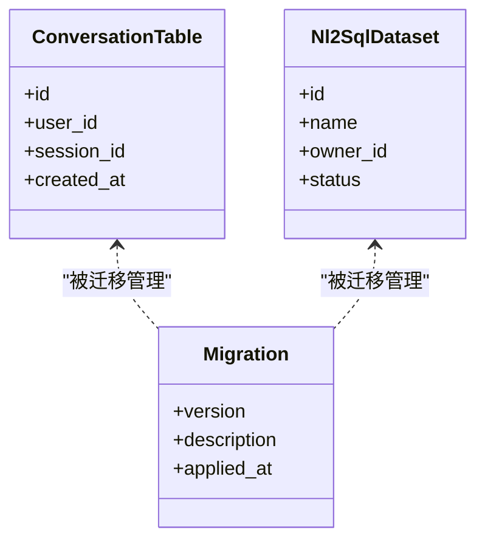

**图表来源**
- [conversation_tables.py](file://python-agent-study/src/fast_app/db/conversation_tables.py)
- [nl2sql_tables.py](file://python-agent-study/src/fast_app/db/nl2sql_tables.py)
- [20260731_0012_add_nl2sql_datasets.py](file://python-agent-study/alembic/versions/20260731_0012_add_nl2sql_datasets.py)

**章节来源**
- [README.md:263-273](file://python-agent-study/README.md#L263-L273)

## 依赖分析
- 应用依赖 FastAPI、Uvicorn、Pydantic、SQLAlchemy、Alembic、AsyncPG、Redis、Elasticsearch、Milvus、LangChain/LangGraph、OpenAI SDK、MCP 等
- 依赖版本锁定在 requirements.txt，便于环境与 CI 一致性
- 外部服务（PostgreSQL、Redis、ES、Milvus、GitLab）需在部署环境中独立准备

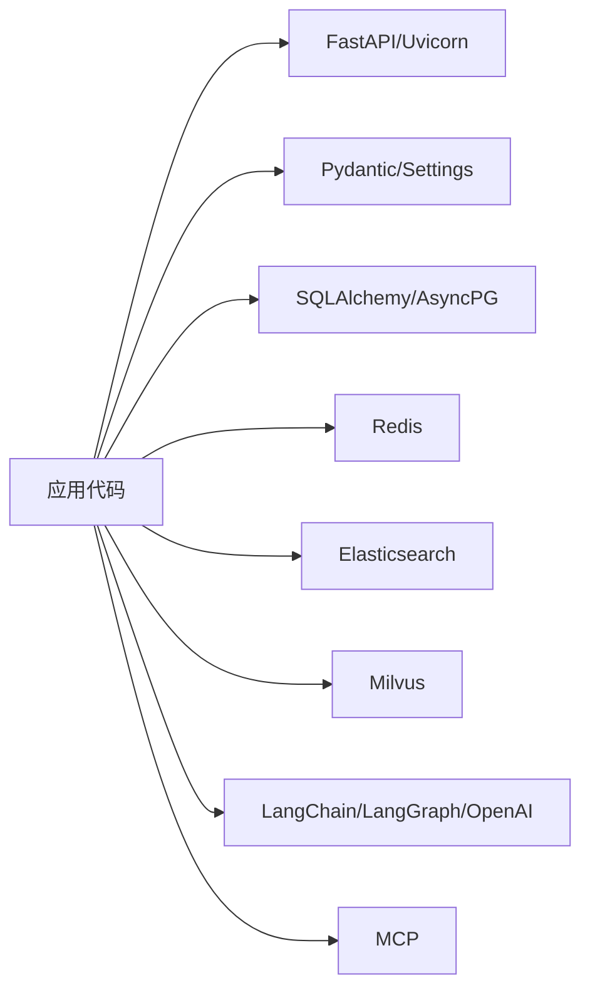

**图表来源**
- [requirements.txt:1-111](file://python-agent-study/requirements.txt#L1-L111)

**章节来源**
- [requirements.txt:1-111](file://python-agent-study/requirements.txt#L1-L111)

## 性能考虑
- 合理设置检索 top_k、min_score、超时与重试策略，避免过度消耗外部服务
- 使用流式接口减少首字节延迟，提升交互体验
- 对高并发场景启用连接池、缓存最近窗口、异步 IO
- 通过 LangSmith/debug trace 定位瓶颈与热点路径
- 对批量导入与索引重建进行限流与分片

[本节为通用指导，不直接分析具体文件]

## 故障排查指南
- 使用 /health 快速判断服务是否可用
- 结合 request/trace ID 在日志中定位请求链路
- 针对认证失败、权限不足、外部服务不可用等常见错误，优先检查配置与网络连通性
- 数据库迁移失败时，核对 alembic 版本与目标库状态，必要时生成降级迁移
- 回归测试失败时，先复现最小用例，再逐步扩大范围

**章节来源**
- [README.md:177-181](file://python-agent-study/README.md#L177-L181)
- [README.md:23-24](file://python-agent-study/README.md#L23-L24)

## 结论
本项目提供了企业级 RAG Agent 后端的完整能力与工程化基础。遵循本文档的分支管理、提交规范、PR 流程、迁移管理、测试与发布流程，可显著提升交付质量与稳定性。建议在团队内固化这些流程并通过 CI/CD 强制落地。

[本节为总结性内容，不直接分析具体文件]

## 附录

### 新功能开发流程
- 需求分析与设计：明确输入输出、权限边界、外部依赖与风险点
- 分支策略：
  - 主干保护：仅允许通过 PR 合并
  - 功能分支：feature/xxx，按需求拆分
  - 修复分支：fix/xxx，hotfix/xxx
  - 发布分支：release/vx.y.z，冻结非紧急变更
- 代码提交规范：
  - 提交信息语义化（feat/fix/chore/docs/refactor）
  - 关联需求编号与影响范围
  - 变更最小化，避免无关改动
- Pull Request 流程：
  - 自测通过后再提 PR
  - 至少一名同行评审
  - 通过 CI 检查（静态检查、单元测试、迁移校验）
  - 合并后自动触发后续流水线

[本节为通用流程指导，不直接分析具体文件]

### 数据库迁移管理
- 新增/修改表或字段时，必须生成 Alembic 迁移脚本
- 迁移脚本需具备幂等性与可回滚能力
- 在 PR 中附带迁移脚本与说明
- 部署前执行升级，生产环境建议灰度与监控

**章节来源**
- [alembic.ini:1-6](file://python-agent-study/alembic.ini#L1-L6)
- [20260731_0012_add_nl2sql_datasets.py](file://python-agent-study/alembic/versions/20260731_0012_add_nl2sql_datasets.py)

### 测试用例编写与回归测试
- 单元测试：覆盖核心逻辑与边界条件
- 集成测试：验证与数据库、缓存、搜索引擎的交互
- 回归测试：按功能分类执行确定性脚本
- 离线评测：使用评测脚本评估检索与生成质量

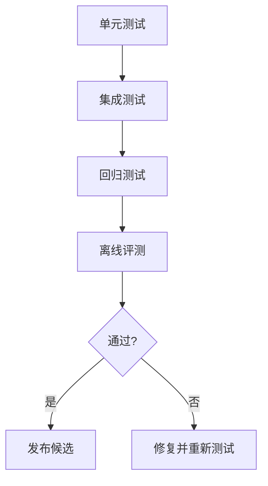

**图表来源**
- [test_agent_task_router.py](file://python-agent-study/scripts/tests/agent_research/test_agent_task_router.py)
- [test_guarded_streaming.py](file://python-agent-study/scripts/tests/document_security/test_guarded_streaming.py)
- [test_markdown_parent_child.py](file://python-agent-study/scripts/tests/ingestion/test_markdown_parent_child.py)
- [test_nl2sql_module.py](file://python-agent-study/scripts/tests/nl2sql/test_nl2sql_module.py)
- [run_real_offline_rag_eval.py](file://python-agent-study/scripts/run_real_offline_rag_eval.py)

**章节来源**
- [README.md:282-319](file://python-agent-study/README.md#L282-L319)

### 性能测试要求
- 基准指标：QPS、P95/P99 延迟、错误率、资源利用率
- 压测场景：高并发聊天、批量导入、检索峰值
- 工具建议：Locust/JMeter 等
- 观察项：外部服务限流、连接池饱和、GC 抖动

[本节为通用指导，不直接分析具体文件]

### GitLab 集成工作流
- Webhook 接收变更事件，进入同步队列
- Worker 独立常驻处理同步与 MR 创建
- 变更需经过审批与发布流程，确保一致性

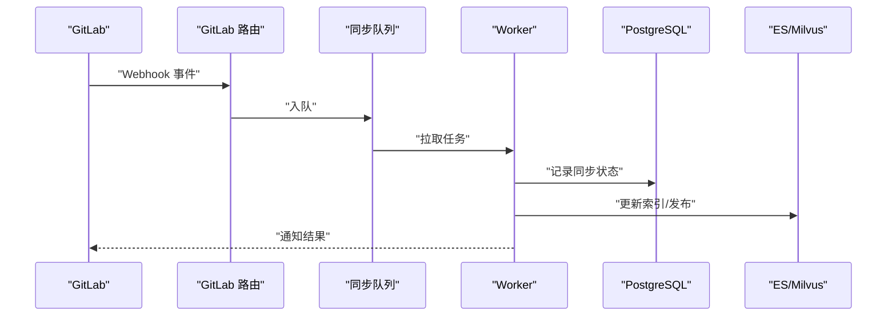

**图表来源**
- [gitlab_routes.py](file://python-agent-study/src/fast_app/api/gitlab_routes.py)
- [README.md:275-280](file://python-agent-study/README.md#L275-L280)

**章节来源**
- [README.md:21-23](file://python-agent-study/README.md#L21-L23)
- [README.md:275-280](file://python-agent-study/README.md#L275-L280)

### CI/CD 流水线配置与部署流程
- 推荐阶段：
  - 安装依赖与缓存
  - 静态检查与格式化
  - 单元测试与集成测试
  - 迁移脚本校验
  - 构建镜像（可选）
  - 部署到预发/生产
- 部署要点：
  - 环境变量与密钥管理
  - 数据库迁移前置
  - 灰度发布与回滚策略
  - 健康检查与探针

[本节为通用指导，不直接分析具体文件]

### 从需求到上线的完整周期
- 需求分析：明确范围、依赖、风险与验收标准
- 设计与评审：架构设计、接口契约、权限模型
- 开发与联调：分支开发、自测、内部联调
- 测试与评测：单元/集成/回归/离线评测
- 预发验证：模拟生产环境验证
- 发布与监控：灰度、监控告警、回滚预案
- 复盘与优化：问题复盘、性能优化、文档更新

[本节为通用指导，不直接分析具体文件]