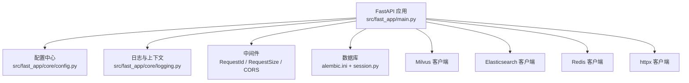
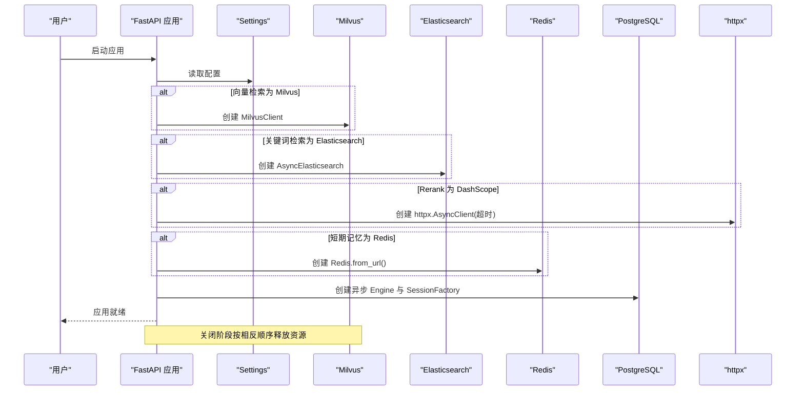
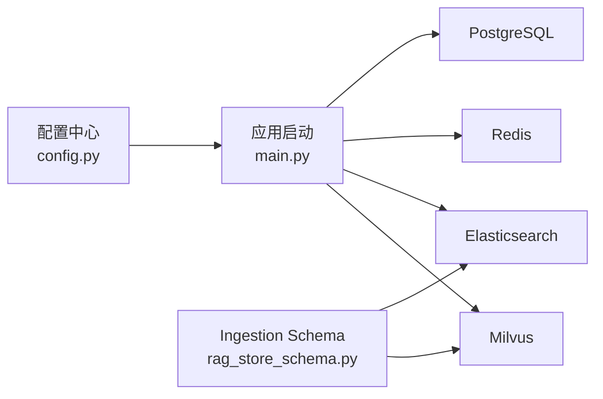

# 开发环境搭建

<cite>
**本文引用的文件**
- [requirements.txt](file://python-agent-study/requirements.txt)
- [src/fast_app/core/config.py](file://python-agent-study/src/fast_app/core/config.py)
- [src/fast_app/main.py](file://python-agent-study/src/fast_app/main.py)
- [alembic.ini](file://python-agent-study/alembic.ini)
- [src/fast_app/db/session.py](file://python-agent-study/src/fast_app/db/session.py)
- [src/fast_app/middlewares/request_id_middleware.py](file://python-agent-study/src/fast_app/middlewares/request_id_middleware.py)
- [src/fast_app/core/logging.py](file://python-agent-study/src/fast_app/core/logging.py)
- [src/fast_app/core/exception_handlers.py](file://python-agent-study/src/fast_app/core/exception_handlers.py)
- [src/fast_app/ingestion/stores/rag_store_schema.py](file://python-agent-study/src/fast_app/ingestion/stores/rag_store_schema.py)
- [scripts/rebuild_rag_demo_stores.py](file://python-agent-study/scripts/rebuild_rag_demo_stores.py)
- [run_rag_eval_local.ps1](file://python-agent-study/run_rag_eval_local.ps1)
- [learning-docs/phase-12/12-7-LangSmith-Python接入+知识点讲解.md](file://python-agent-study/learning-docs/phase-12/12-7-LangSmith-Python接入+知识点讲解.md)
- [learning-docs/phase-14/14-2-Redis短期会话记忆-最近消息-TTL-会话状态.md](file://python-agent-study/learning-docs/phase-14/14-2-Redis短期会话记忆-最近消息-TTL-会话状态.md)
</cite>

## 目录
1. [简介](#简介)
2. [项目结构](#项目结构)
3. [核心组件](#核心组件)
4. [架构总览](#架构总览)
5. [详细组件分析](#详细组件分析)
6. [依赖关系分析](#依赖关系分析)
7. [性能考虑](#性能考虑)
8. [故障排查指南](#故障排查指南)
9. [结论](#结论)
10. [附录](#附录)

## 简介
本指南面向在 Windows PowerShell 环境下从零搭建该 FastAPI RAG Agent 项目的开发者，覆盖 Python 环境、依赖安装、数据库与缓存初始化、外部服务（Milvus、Elasticsearch、Redis）配置、环境变量管理、IDE 设置、应用启动流程、热重载与调试工具使用。文档严格基于仓库中的配置文件与启动逻辑编写，确保步骤可落地、问题可定位。

## 项目结构
- 应用入口与生命周期：FastAPI 应用通过 lifespan 统一创建和关闭外部客户端（Milvus、Elasticsearch、httpx、Redis、PostgreSQL），并注册中间件与路由。
- 配置中心：Settings 集中管理所有环境变量映射，包括 LLM、检索、Rerank、鉴权、NL2SQL、Ingestion、Agent 等。
- 数据层：Alembic 迁移脚本 + SQLAlchemy 异步引擎；默认连接 PostgreSQL。
- 外部存储：Milvus 向量库、Elasticsearch 全文索引、Redis 短期会话记忆。
- 中间件：CORS、请求大小限制、请求 ID 与慢请求追踪、统一异常处理。
- 脚本：Windows PowerShell 评测脚本用于本地运行评估任务。

**图示来源**
- [src/fast_app/main.py:41-129](file://python-agent-study/src/fast_app/main.py#L41-L129)
- [src/fast_app/core/config.py:18-84](file://python-agent-study/src/fast_app/core/config.py#L18-L84)
- [alembic.ini:1-6](file://python-agent-study/alembic.ini#L1-L6)
- [src/fast_app/db/session.py:11-20](file://python-agent-study/src/fast_app/db/session.py#L11-L20)

**章节来源**
- [src/fast_app/main.py:41-129](file://python-agent-study/src/fast_app/main.py#L41-L129)
- [src/fast_app/core/config.py:18-84](file://python-agent-study/src/fast_app/core/config.py#L18-L84)
- [alembic.ini:1-6](file://python-agent-study/alembic.ini#L1-L6)
- [src/fast_app/db/session.py:11-20](file://python-agent-study/src/fast_app/db/session.py#L11-L20)

## 核心组件
- 配置系统：通过 Settings 读取 .env 与环境变量，提供 Milvus、Elasticsearch、Redis、PostgreSQL、LLM、Rerank、Agent、NL2SQL、Ingestion 等全量配置项。
- 应用生命周期：lifespan 中根据 provider 开关按需创建 Milvus/Elasticsearch/httpx/Redis 客户端，创建 PostgreSQL 引擎与 SessionFactory，加载 NL2SQL 数据集，可选启动 Deep Document Runtime。
- 中间件：CORS、请求体大小限制、请求 ID 注入与慢请求阈值、统一异常处理器。
- 日志：结构化日志，自动注入 request_id 与 trace_id。

**章节来源**
- [src/fast_app/core/config.py:18-84](file://python-agent-study/src/fast_app/core/config.py#L18-L84)
- [src/fast_app/main.py:41-129](file://python-agent-study/src/fast_app/main.py#L41-L129)
- [src/fast_app/middlewares/request_id_middleware.py:19-44](file://python-agent-study/src/fast_app/middlewares/request_id_middleware.py#L19-L44)
- [src/fast_app/core/logging.py:59-76](file://python-agent-study/src/fast_app/core/logging.py#L59-L76)

## 架构总览
下图展示了应用启动时外部服务的创建顺序与关闭顺序，以及配置如何驱动不同 Provider 的初始化。

**图示来源**
- [src/fast_app/main.py:41-129](file://python-agent-study/src/fast_app/main.py#L41-L129)
- [src/fast_app/core/config.py:58-84](file://python-agent-study/src/fast_app/core/config.py#L58-L84)

## 详细组件分析

### 环境变量与配置中心
- Settings 从 .env 与环境变量加载，字段包含：
  - 应用基础：APP_NAME、APP_ENV、DEBUG、日志级别、CORS 源。
  - 检索与索引：MILVUS_*、ELASTICSEARCH_*、VECTOR_RETRIEVER_PROVIDER、KEYWORD_RETRIEVER_PROVIDER。
  - 重排序：RERANKER_PROVIDER、RERANK_MODEL_NAME、RERANK_TIMEOUT_SECONDS。
  - 短期记忆：MEMORY_STORE_PROVIDER、REDIS_URL、MEMORY_TTL_SECONDS、MEMORY_MAX_MESSAGES。
  - 数据库：DATABASE_URL、DATABASE_ECHO、DATABASE_POOL_SIZE、DATABASE_MAX_OVERFLOW。
  - LLM/Embedding/Rerank：OPENAI_*、LLM_*、EMBEDDING_*、RERANK_*。
  - Agent/NL2SQL/GitLab/Ingestion：相关开关与超时、路径、并发限制。
- 安全与调试：LANGSMITH_*、DEBUG_TRACE_*、AUTH_ENABLED、JWT_*、MAX_REQUEST_BODY_BYTES、MAX_UPLOAD_FILE_BYTES。
- 获取方式：get_settings() 带 lru_cache，避免重复读取 .env。

**章节来源**
- [src/fast_app/core/config.py:18-84](file://python-agent-study/src/fast_app/core/config.py#L18-L84)
- [src/fast_app/core/config.py:1090-1102](file://python-agent-study/src/fast_app/core/config.py#L1090-L1102)

### 数据库初始化（PostgreSQL + Alembic）
- 默认连接串位于 alembic.ini，可通过 DATABASE_URL 覆盖。
- 应用启动时创建异步 Engine 与 SessionFactory，并在关闭时 dispose。
- 迁移命令：在项目根目录执行 Alembic 迁移以创建或更新表结构。

建议步骤（PowerShell）：
- 确认 PostgreSQL 已运行并可访问。
- 将 alembic.ini 中的 sqlalchemy.url 指向你的实例与数据库名。
- 执行迁移：alembic upgrade head。
- 如需回滚：alembic downgrade <revision>。

**章节来源**
- [alembic.ini:1-6](file://python-agent-study/alembic.ini#L1-L6)
- [src/fast_app/db/session.py:11-20](file://python-agent-study/src/fast_app/db/session.py#L11-L20)
- [src/fast_app/main.py:77-83](file://python-agent-study/src/fast_app/main.py#L77-L83)

### 外部服务配置与集成

#### Milvus（向量检索）
- 配置项：MILVUS_HOST、MILVUS_PORT、MILVUS_COLLECTION_NAME、MILVUS_VECTOR_FIELD、MILVUS_ID_FIELD、MILVUS_CONTENT_FIELD、EMBEDDING_DIM。
- 启动行为：当 VECTOR_RETRIEVER_PROVIDER=milvus 时，lifespan 创建 MilvusClient。
- Collection 与索引：schema 与 index_params 由 ingestion schema 构建，支持 AUTOINDEX/COSINE。

**章节来源**
- [src/fast_app/core/config.py:58-68](file://python-agent-study/src/fast_app/core/config.py#L58-L68)
- [src/fast_app/main.py:49-56](file://python-agent-study/src/fast_app/main.py#L49-L56)
- [src/fast_app/ingestion/stores/rag_store_schema.py:147-179](file://python-agent-study/src/fast_app/ingestion/stores/rag_store_schema.py#L147-L179)
- [src/fast_app/ingestion/stores/rag_store_schema.py:271-279](file://python-agent-study/src/fast_app/ingestion/stores/rag_store_schema.py#L271-L279)

#### Elasticsearch（关键词检索）
- 配置项：ELASTICSEARCH_URL、ELASTICSEARCH_INDEX_NAME、ELASTICSEARCH_USERNAME、ELASTICSEARCH_PASSWORD、ELASTICSEARCH_REQUEST_TIMEOUT。
- 启动行为：当 KEYWORD_RETRIEVER_PROVIDER=elasticsearch 时，lifespan 创建 AsyncElasticsearch。
- Index Mapping：由 ingestion schema 构建 settings 与 mappings。

**章节来源**
- [src/fast_app/core/config.py:71-81](file://python-agent-study/src/fast_app/core/config.py#L71-L81)
- [src/fast_app/main.py:58-62](file://python-agent-study/src/fast_app/main.py#L58-L62)
- [src/fast_app/ingestion/stores/rag_store_schema.py:136-144](file://python-agent-study/src/fast_app/ingestion/stores/rag_store_schema.py#L136-L144)

#### Redis（短期会话记忆）
- 配置项：MEMORY_STORE_PROVIDER、REDIS_URL、MEMORY_TTL_SECONDS、MEMORY_MAX_MESSAGES、MEMORY_HISTORY_MAX_TURNS。
- 启动行为：当 MEMORY_STORE_PROVIDER=redis 时，lifespan 创建 Redis 客户端。
- 数据结构：每个 conversation 使用 List 保存消息 JSON，设置 TTL 与长度裁剪。

**章节来源**
- [src/fast_app/core/config.py:457-484](file://python-agent-study/src/fast_app/core/config.py#L457-L484)
- [src/fast_app/main.py:70-75](file://python-agent-study/src/fast_app/main.py#L70-L75)
- [learning-docs/phase-14/14-2-Redis短期会话记忆-最近消息-TTL-会话状态.md:84-111](file://python-agent-study/learning-docs/phase-14/14-2-Redis短期会话记忆-最近消息-TTL-会话状态.md#L84-L111)

#### LangSmith（可选追踪）
- 配置项：LANGSMITH_TRACING、LANGSMITH_API_KEY、LANGSMITH_ENDPOINT、LANGSMITH_PROJECT、LANGSMITH_TAGS。
- 行为：应用启动时根据配置决定是否启用追踪，避免误写远端。

**章节来源**
- [src/fast_app/core/config.py:86-102](file://python-agent-study/src/fast_app/core/config.py#L86-L102)
- [learning-docs/phase-12/12-7-LangSmith-Python接入+知识点讲解.md:1034-1077](file://python-agent-study/learning-docs/phase-12/12-7-LangSmith-Python接入+知识点讲解.md#L1034-L1077)

### 应用启动流程与中间件
- 启动顺序：
  1) 读取 Settings，初始化日志与 LangSmith。
  2) 根据 provider 创建 Milvus/Elasticsearch/httpx/Redis 客户端。
  3) 创建 PostgreSQL 引擎与 SessionFactory，加载 NL2SQL 数据集。
  4) 可选启动 Deep Document Runtime。
  5) 注册中间件与路由。
- 中间件：
  - CORS：允许前端跨域。
  - 请求大小限制：防止超大 body。
  - 请求 ID：注入 request_id/trace_id，记录慢请求。
  - 异常处理：统一错误响应格式。

**章节来源**
- [src/fast_app/main.py:41-129](file://python-agent-study/src/fast_app/main.py#L41-L129)
- [src/fast_app/middlewares/request_id_middleware.py:19-44](file://python-agent-study/src/fast_app/middlewares/request_id_middleware.py#L19-L44)
- [src/fast_app/core/exception_handlers.py:1-26](file://python-agent-study/src/fast_app/core/exception_handlers.py#L1-L26)

### Windows PowerShell 环境下的完整配置步骤
- 准备 Python 虚拟环境：
  - 在项目根目录创建并使用 .venv。
  - 安装依赖：pip install -r requirements.txt。
- 配置环境变量：
  - 在项目根目录创建 .env 文件，填入必要配置（如数据库、Milvus、Elasticsearch、Redis、LLM、鉴权等）。
  - 也可通过 PowerShell 进程内设置 $env:KEY="value"。
- 初始化数据库：
  - 修改 alembic.ini 的 sqlalchemy.url 指向你的 PostgreSQL。
  - 执行 alembic upgrade head。
- 初始化外部存储：
  - Milvus：确保服务运行，必要时重建 collection 与索引。
  - Elasticsearch：确保服务运行，必要时创建 index mapping。
  - Redis：确保服务运行，MEMORY_STORE_PROVIDER=redis 时生效。
- 启动应用：
  - 使用 uvicorn 启动 main.py 所在模块，开启热重载。
- 运行评测脚本（可选）：
  - 使用 run_rag_eval_local.ps1 设置评测身份与 Judge 配置后执行。

**章节来源**
- [requirements.txt:1-111](file://python-agent-study/requirements.txt#L1-L111)
- [alembic.ini:1-6](file://python-agent-study/alembic.ini#L1-L6)
- [run_rag_eval_local.ps1:19-79](file://python-agent-study/run_rag_eval_local.ps1#L19-L79)

### IDE 设置与调试
- VS Code：
  - 选择项目 .venv 解释器。
  - 设置运行配置：module=uvicorn，args=["fast_app.main:app","--reload"]。
  - 添加环境变量：在 launch.json 或 .env 中配置所需键值。
- PyCharm：
  - 设置 Project Interpreter 为 .venv。
  - 配置 Run/Debug Configuration：Module name 指向 uvicorn，Arguments 指定 fast_app.main:app --reload。
- 断点调试：
  - 在 lifespan、路由、依赖函数处设置断点，观察外部客户端创建与请求处理流程。

[本节为通用实践说明，不直接分析具体文件]

## 依赖关系分析
- 运行时依赖：FastAPI、Uvicorn、Pydantic、SQLAlchemy、asyncpg、redis、pymilvus、elasticsearch、httpx、langchain/langgraph/openai 等。
- 配置依赖：Settings 决定各 Provider 是否启用，影响 lifespan 创建的客户端。
- 数据流依赖：Ingestion 生成 Milvus Schema/Index 与 ES Mapping，RAG 检索链路依赖这些结构。

**图示来源**
- [src/fast_app/core/config.py:58-84](file://python-agent-study/src/fast_app/core/config.py#L58-L84)
- [src/fast_app/main.py:49-75](file://python-agent-study/src/fast_app/main.py#L49-L75)
- [src/fast_app/ingestion/stores/rag_store_schema.py:136-179](file://python-agent-study/src/fast_app/ingestion/stores/rag_store_schema.py#L136-L179)

**章节来源**
- [requirements.txt:1-111](file://python-agent-study/requirements.txt#L1-L111)
- [src/fast_app/core/config.py:58-84](file://python-agent-study/src/fast_app/core/config.py#L58-L84)
- [src/fast_app/main.py:49-75](file://python-agent-study/src/fast_app/main.py#L49-L75)
- [src/fast_app/ingestion/stores/rag_store_schema.py:136-179](file://python-agent-study/src/fast_app/ingestion/stores/rag_store_schema.py#L136-L179)

## 性能考虑
- 连接池与溢出：PostgreSQL 使用 pool_size 与 max_overflow，避免连接耗尽。
- 超时控制：Rerank、ES、LLM、Embedding 均提供超时秒数配置，防止长尾阻塞。
- 请求体限制：max_request_body_bytes 与上传上限防止恶意大请求。
- 慢请求监控：Request ID 中间件记录慢 HTTP 请求阈值，便于定位瓶颈。
- 外部调用重试：external_call_max_retries 与 base delay 提升鲁棒性。

**章节来源**
- [src/fast_app/core/config.py:520-535](file://python-agent-study/src/fast_app/core/config.py#L520-L535)
- [src/fast_app/core/config.py:620-634](file://python-agent-study/src/fast_app/core/config.py#L620-L634)
- [src/fast_app/core/config.py:160-176](file://python-agent-study/src/fast_app/core/config.py#L160-L176)
- [src/fast_app/middlewares/request_id_middleware.py:19-44](file://python-agent-study/src/fast_app/middlewares/request_id_middleware.py#L19-L44)

## 故障排查指南
- 无法连接 PostgreSQL：
  - 检查 alembic.ini 的 sqlalchemy.url 与数据库服务状态。
  - 确认迁移已执行：alembic upgrade head。
- Milvus 不可用：
  - 检查 MILVUS_HOST/MILVUS_PORT 与服务状态。
  - 若需重建集合，可使用脚本重建 demo stores。
- Elasticsearch 不可用：
  - 检查 ELASTICSEARCH_URL 与索引映射是否存在。
- Redis 不可用：
  - 检查 REDIS_URL 与 MEMORY_STORE_PROVIDER=redis。
  - 确认 TTL 与最大消息数配置合理。
- 启动时报错：
  - 查看日志输出，关注 request_id/trace_id 与异常堆栈。
  - 检查 .env 中敏感配置是否正确。
- 评测脚本失败：
  - 检查 run_rag_eval_local.ps1 中的 Judge 与认证配置。
  - 确认虚拟环境与依赖已安装。

**章节来源**
- [alembic.ini:1-6](file://python-agent-study/alembic.ini#L1-L6)
- [scripts/rebuild_rag_demo_stores.py:272-366](file://python-agent-study/scripts/rebuild_rag_demo_stores.py#L272-L366)
- [src/fast_app/core/logging.py:59-76](file://python-agent-study/src/fast_app/core/logging.py#L59-L76)
- [run_rag_eval_local.ps1:19-79](file://python-agent-study/run_rag_eval_local.ps1#L19-L79)

## 结论
通过统一的配置中心与生命周期管理，本项目在 Windows PowerShell 环境下可快速完成环境搭建与服务集成。遵循本文步骤，可稳定启动 FastAPI 应用，正确连接 PostgreSQL、Milvus、Elasticsearch、Redis，并根据需要启用 LangSmith 追踪与调试接口。遇到问题时，结合结构化日志与中间件信息可高效定位。

## 附录

### 环境变量清单（节选）
- 应用与日志：APP_NAME、APP_ENV、DEBUG、LOG_LEVEL、CORS_ALLOW_ORIGINS。
- 检索与索引：MILVUS_HOST、MILVUS_PORT、MILVUS_COLLECTION_NAME、MILVUS_VECTOR_FIELD、MILVUS_ID_FIELD、MILVUS_CONTENT_FIELD、EMBEDDING_DIM；ELASTICSEARCH_URL、ELASTICSEARCH_INDEX_NAME、ELASTICSEARCH_USERNAME、ELASTICSEARCH_PASSWORD、ELASTICSEARCH_REQUEST_TIMEOUT。
- 短期记忆：MEMORY_STORE_PROVIDER、REDIS_URL、MEMORY_TTL_SECONDS、MEMORY_MAX_MESSAGES、MEMORY_HISTORY_MAX_TURNS。
- 数据库：DATABASE_URL、DATABASE_ECHO、DATABASE_POOL_SIZE、DATABASE_MAX_OVERFLOW。
- LLM/Embedding/Rerank：OPENAI_API_KEY、OPENAI_BASE_URL、LLM_MODEL_NAME、LLM_PROVIDER、EMBEDDING_PROVIDER、EMBEDDING_MODEL_NAME、RERANKER_PROVIDER、RERANK_MODEL_NAME、RERANK_TIMEOUT_SECONDS。
- 鉴权与调试：AUTH_ENABLED、JWT_SECRET_KEY、JWT_ALGORITHM、JWT_ISSUER、JWT_AUDIENCE、JWT_ACCESS_TOKEN_EXPIRE_MINUTES、JWT_REFRESH_TOKEN_EXPIRE_DAYS、DEBUG_TRACE_ENABLED、DEBUG_TRACE_TOKEN、DEBUG_TRACE_MAX_SOURCES。
- LangSmith：LANGSMITH_TRACING、LANGSMITH_API_KEY、LANGSMITH_ENDPOINT、LANGSMITH_PROJECT、LANGSMITH_TAGS。

**章节来源**
- [src/fast_app/core/config.py:25-102](file://python-agent-study/src/fast_app/core/config.py#L25-L102)
- [src/fast_app/core/config.py:138-176](file://python-agent-study/src/fast_app/core/config.py#L138-L176)
- [src/fast_app/core/config.py:230-267](file://python-agent-study/src/fast_app/core/config.py#L230-L267)
- [src/fast_app/core/config.py:457-484](file://python-agent-study/src/fast_app/core/config.py#L457-L484)
- [src/fast_app/core/config.py:520-535](file://python-agent-study/src/fast_app/core/config.py#L520-L535)
- [src/fast_app/core/config.py:597-634](file://python-agent-study/src/fast_app/core/config.py#L597-L634)

### 启动与热重载
- 使用 uvicorn 启动：
  - 模块方式：uvicorn fast_app.main:app --host 0.0.0.0 --port 8000 --reload
  - 或通过 IDE 运行配置传入参数。
- 热重载：--reload 参数在开发模式启用代码变更自动重启。

**章节来源**
- [src/fast_app/main.py:132-135](file://python-agent-study/src/fast_app/main.py#L132-L135)

### 常见环境问题与解决方案
- 端口占用：修改 uvicorn 端口或释放占用端口。
- 数据库连接失败：核对 DATABASE_URL 与权限，执行迁移。
- Milvus/ES/Redis 连接失败：核对地址、端口、用户名密码与网络连通性。
- 环境变量未生效：确认 .env 位置与编码，或使用进程内设置 $env:KEY。
- 评测脚本找不到虚拟环境：确保 .venv 与 .venv-rag-eval 存在且依赖已安装。

**章节来源**
- [run_rag_eval_local.ps1:60-67](file://python-agent-study/run_rag_eval_local.ps1#L60-L67)
- [alembic.ini:1-6](file://python-agent-study/alembic.ini#L1-L6)
- [src/fast_app/core/config.py:18-23](file://python-agent-study/src/fast_app/core/config.py#L18-L23)