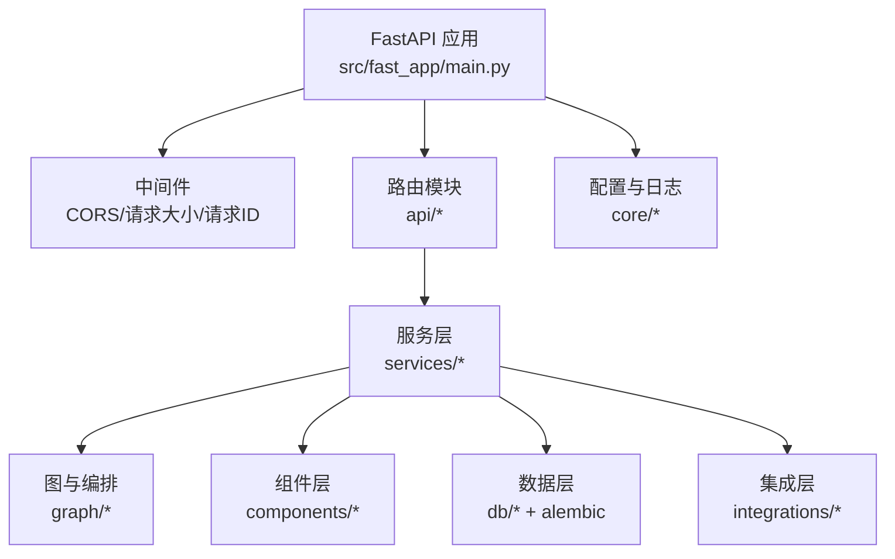
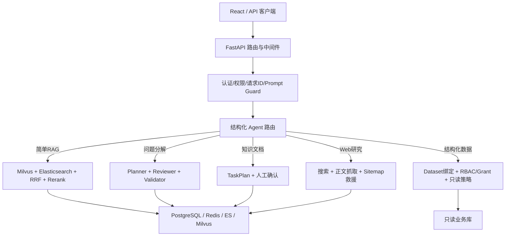
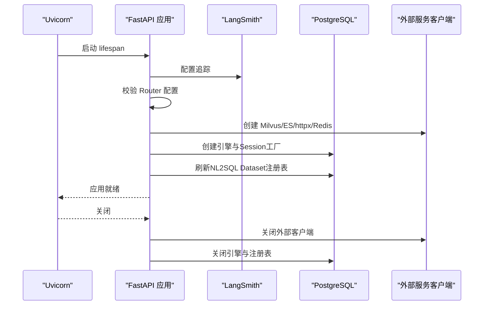
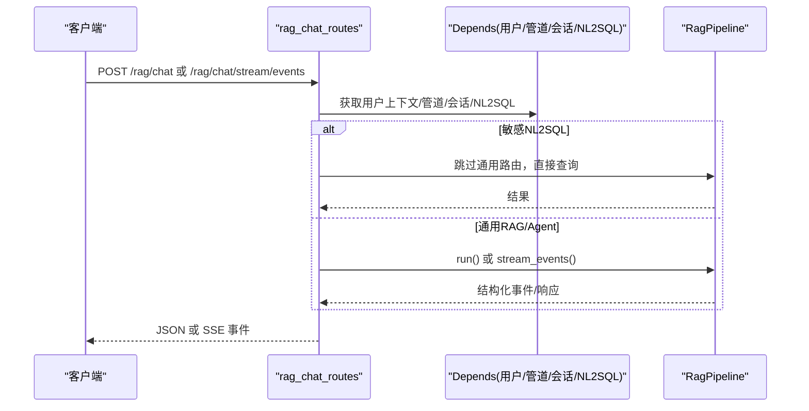
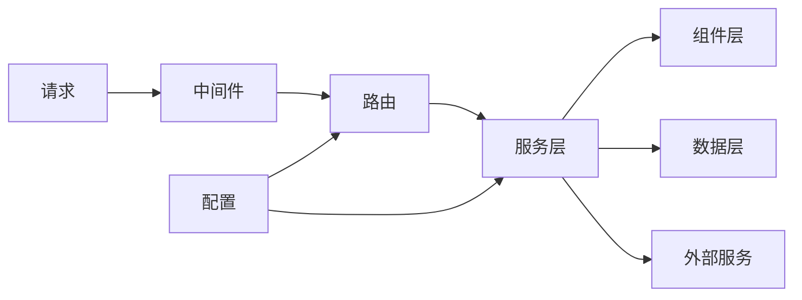

# 开发者指南

<cite>
**本文引用的文件**
- [README.md](file://python-agent-study/README.md)
- [requirements.txt](file://python-agent-study/requirements.txt)
- [AGENTS.md](file://python-agent-study/AGENTS.md)
- [main.py](file://python-agent-study/src/fast_app/main.py)
- [config.py](file://python-agent-study/src/fast_app/core/config.py)
- [rag_chat_routes.py](file://python-agent-study/src/fast_app/api/rag_chat_routes.py)
</cite>

## 目录
1. [简介](#简介)
2. [项目结构](#项目结构)
3. [核心组件](#核心组件)
4. [架构总览](#架构总览)
5. [详细组件分析](#详细组件分析)
6. [依赖关系分析](#依赖关系分析)
7. [性能与可观测性](#性能与可观测性)
8. [故障排查与调试](#故障排查与调试)
9. [贡献流程与代码规范](#贡献流程与代码规范)
10. [测试要求与评测](#测试要求与评测)
11. [学习路径与上手清单](#学习路径与上手清单)
12. [结论](#结论)

## 简介
本项目是一个面向企业知识场景的 Python / FastAPI / LangGraph RAG Agent 后端。它提供统一聊天入口，可在普通 RAG、复杂 Research、知识文档管理、公开 Web 检索和受控 NL2SQL 之间进行结构化路由，并通过 JSON 或 SSE 向后续 React 前端返回稳定状态。系统强调可评测、可观察、可授权、可人工确认，并在启动时集中校验关键配置、创建外部服务客户端、注册中间件与路由。

## 项目结构
仓库采用分层与按领域划分的组织方式：
- 应用入口与生命周期：FastAPI 应用、中间件、异常处理器、全局资源初始化与关闭。
- API 层：REST/SSE 路由，负责请求校验、权限上下文注入、调用服务层。
- 服务层：RAG、Agent 任务、认证、NL2SQL、会话、知识等业务能力。
- 图与编排：LangGraph 状态、节点与 Graph Builder。
- 组件层：嵌入、检索、重排、LLM 等可插拔实现。
- 数据层：Alembic 迁移、SQLAlchemy 表、数据库 Session。
- 集成层：GitLab、Webhook、Worker。
- 评估与评测：离线评测数据集、指标、报告。
- 脚本与测试：按功能分类的可执行回归脚本与说明。

图表来源
- [main.py:132-170](file://python-agent-study/src/fast_app/main.py#L132-L170)
- [rag_chat_routes.py:38-311](file://python-agent-study/src/fast_app/api/rag_chat_routes.py#L38-L311)

章节来源
- [README.md:99-124](file://python-agent-study/README.md#L99-L124)
- [main.py:132-170](file://python-agent-study/src/fast_app/main.py#L132-L170)

## 核心组件
- 应用生命周期：在 lifespan 中完成日志、LangSmith 配置、Router 配置校验、外部客户端（Milvus、Elasticsearch、httpx、Redis）、数据库引擎与只读 Dataset 注册表加载；在 finally 中安全关闭所有资源。
- 配置中心：基于 Pydantic Settings 的环境变量配置，覆盖应用名、环境、CORS、认证、Prompt Guard、LLM/Rerank/Embedding、检索提供者、Agent 预算、Ingestion、NL2SQL、GitLab、记忆存储等。
- 主接口：非流式 `/rag/chat` 与结构化 SSE `/rag/chat/stream/events`，支持 NL2SQL 敏感数据集直连查询、知识库版本控制、陈旧来源提示。
- 路由与依赖：通过 FastAPI Depends 注入用户上下文、RAG Pipeline、数据库 Session、NL2SQL Service。
- 中间件：CORS、请求体大小限制、请求 ID 与慢请求阈值。
- 异常处理：统一注册异常处理器，业务错误与内部错误分别输出。

章节来源
- [main.py:41-129](file://python-agent-study/src/fast_app/main.py#L41-L129)
- [config.py:18-797](file://python-agent-study/src/fast_app/core/config.py#L18-L797)
- [rag_chat_routes.py:47-156](file://python-agent-study/src/fast_app/api/rag_chat_routes.py#L47-L156)
- [rag_chat_routes.py:277-311](file://python-agent-study/src/fast_app/api/rag_chat_routes.py#L277-L311)

## 架构总览
系统以 FastAPI 为边界，承载认证、RBAC、Prompt Guard、请求追踪等横切能力；RAG Agent Pipeline 作为主线，结合 Milvus 向量检索、Elasticsearch 关键词检索、RRF 与 rerank，并对接 PostgreSQL/Redis 等多存储；Agent Router 将意图路由到简单 RAG、问题分解、知识文档管理、Web 研究、结构化数据查询或澄清回复；高风险操作通过 TaskPlan 与人工确认保障安全。

图表来源
- [README.md:29-67](file://python-agent-study/README.md#L29-L67)
- [rag_chat_routes.py:47-156](file://python-agent-study/src/fast_app/api/rag_chat_routes.py#L47-L156)
- [rag_chat_routes.py:277-311](file://python-agent-study/src/fast_app/api/rag_chat_routes.py#L277-L311)

## 详细组件分析

### 应用启动与资源管理
- 启动阶段：设置日志、配置 LangSmith、校验 Agent Router 配置、根据配置创建 Milvus/Elasticsearch/httpx/Redis 客户端、创建异步数据库引擎与 Session Factory、刷新 NL2SQL Dataset 注册表、按需启动 Deep Document Runtime。
- 关闭阶段：依次关闭 Milvus、Elasticsearch、httpx、Redis、Deep Document Runtime、数据库引擎与 Dataset Registry，确保连接池释放。

图表来源
- [main.py:41-129](file://python-agent-study/src/fast_app/main.py#L41-L129)

章节来源
- [main.py:41-129](file://python-agent-study/src/fast_app/main.py#L41-L129)

### 配置体系与环境变量
- 使用 Pydantic Settings 集中管理配置，支持 .env 读取与类型转换。
- 关键开关包括：Pipeline Provider、认证、Prompt Guard、记忆存储、Agent 文档工具、NL2SQL、GitLab、Parent Expansion、LangSmith、Debug Trace 等。
- 生产环境需显式启用认证、收紧 CORS、替换默认凭据、关闭匿名模式与宽松本地配置。

章节来源
- [config.py:18-797](file://python-agent-study/src/fast_app/core/config.py#L18-L797)
- [README.md:241-261](file://python-agent-study/README.md#L241-L261)

### 主接口与非流式/结构化SSE
- 非流式 `/rag/chat`：返回完整答案、sources、request_id、trace_id，适合评测、调试与管理流程。
- 结构化 SSE `/rag/chat/stream/events`：基于 `pipeline.stream_events()`，输出 sources、answer_delta、guard_sanitized、guard_blocked、done、error 等事件，是 React 主流式接口。
- 兼容旧版 `/rag/chat/stream`：仅保留 token-only 兼容，不承载新功能。
- NL2SQL 敏感数据集：直接走受控只读查询，不走通用 Router。

图表来源
- [rag_chat_routes.py:47-156](file://python-agent-study/src/fast_app/api/rag_chat_routes.py#L47-L156)
- [rag_chat_routes.py:277-311](file://python-agent-study/src/fast_app/api/rag_chat_routes.py#L277-L311)

章节来源
- [rag_chat_routes.py:47-156](file://python-agent-study/src/fast_app/api/rag_chat_routes.py#L47-L156)
- [rag_chat_routes.py:277-311](file://python-agent-study/src/fast_app/api/rag_chat_routes.py#L277-L311)

### 中间件与异常处理
- 中间件：CORS、请求体大小限制、请求 ID 与慢请求阈值。
- 异常处理：统一注册异常处理器，区分应用错误与内部错误，便于前端与评测消费。

章节来源
- [main.py:138-156](file://python-agent-study/src/fast_app/main.py#L138-L156)

### 数据与外部服务边界
- PostgreSQL：用户、部门、RBAC、会话、Task audit、导入任务、GitLab 同步、NL2SQL Dataset/Grant。
- Redis：有 TTL 的最近对话窗口。
- Milvus：向量召回与版本/ACL filter。
- Elasticsearch：关键词召回、metadata filter 与已发布知识索引。
- GitLab：企业文档源、版本身份、变更审查与 MR 生命周期。
- NL2SQL 业务库：独立只读连接，由 Dataset Registry、Grant、数据库角色与 RLS 约束。
- LangSmith：RAG/Agent trace，自定义敏感字段默认不上传。

章节来源
- [README.md:263-274](file://python-agent-study/README.md#L263-L274)

## 依赖关系分析
- 运行时依赖：FastAPI、uvicorn、httpx、sse-starlette、pydantic、SQLAlchemy、asyncpg、redis、pymilvus、elasticsearch、langchain/langgraph、openai、deepagents、langsmith 等。
- 启动依赖：PostgreSQL 必须可连接；可选 Redis、Milvus、Elasticsearch、GitLab、Bocha、OpenAI-compatible 模型服务。
- 模块耦合：API 路由依赖服务层；服务层依赖组件层与数据层；组件层可插拔实现（mock/真实）；配置驱动行为切换。

图表来源
- [requirements.txt:1-111](file://python-agent-study/requirements.txt#L1-L111)
- [main.py:132-170](file://python-agent-study/src/fast_app/main.py#L132-L170)

章节来源
- [requirements.txt:1-111](file://python-agent-study/requirements.txt#L1-L111)
- [main.py:132-170](file://python-agent-study/src/fast_app/main.py#L132-L170)

## 性能与可观测性
- 性能特征：
  - 混合检索：Milvus 向量召回 + Elasticsearch 关键词召回 + RRF + rerank。
  - 多轮会话：Redis 最近窗口 + PostgreSQL 摘要，避免无限增长上下文。
  - Agent 预算：最大步数、工具调用次数、并行度、超时与重试策略。
  - Ingestion：父子 Chunk、父块扩展、写入模式与大小限制。
- 可观测性：
  - LangSmith：集中配置、共享元数据、敏感字段策略、业务侧埋点。
  - 日志：慢请求阈值、慢检索/重排/LLM 阈值、结构化事件。
  - 调试：debug trace 接口、request/trace ID、SSE 事件。

章节来源
- [README.md:29-67](file://python-agent-study/README.md#L29-L67)
- [config.py:84-118](file://python-agent-study/src/fast_app/core/config.py#L84-L118)
- [config.py:285-446](file://python-agent-study/src/fast_app/core/config.py#L285-L446)
- [config.py:637-797](file://python-agent-study/src/fast_app/core/config.py#L637-L797)

## 故障排查与调试
- 常见问题定位：
  - 启动失败：检查环境变量、数据库连接、Router 配置、外部服务可达性。
  - 认证失败：确认 AUTH_ENABLED、JWT/API Key、CORS、请求头。
  - 检索无结果：检查 Milvus/ES 索引、ACL 过滤、top_k/min_score、knowledge_version。
  - NL2SQL 报错：确认 dataset_id、action、隐私分级、只读策略。
  - SSE 断流：关注 error 事件、网络中断、服务端异常。
- 调试技巧：
  - 使用 `/health` 健康检查。
  - 开启 LangSmith tracing，查看 trace 与输入输出。
  - 使用 debug trace 接口查看内部链路。
  - 通过 request_id/trace_id 关联日志与事件。

章节来源
- [README.md:171-181](file://python-agent-study/README.md#L171-L181)
- [README.md:241-261](file://python-agent-study/README.md#L241-L261)
- [rag_chat_routes.py:105-156](file://python-agent-study/src/fast_app/api/rag_chat_routes.py#L105-L156)
- [rag_chat_routes.py:217-311](file://python-agent-study/src/fast_app/api/rag_chat_routes.py#L217-L311)

## 贡献流程与代码规范
- 开发环境搭建：
  - 安装依赖：使用虚拟环境与 requirements.txt。
  - 最小启动：设置 PYTHONPATH、DATABASE_URL、RAG_PIPELINE_PROVIDER、LLM_PROVIDER、检索提供者、AUTH_ENABLED 等环境变量。
  - 初始化数据库：执行 Alembic 升级。
  - 启动服务：uvicorn 启动 fast_app.main:app。
- 代码规范：
  - 公共 Pydantic 模型字段必须声明 description，用于 LLM 结构化输出与 OpenAPI。
  - 新增/修改 Schema 后运行 schema 描述回归测试。
  - 保持 LangGraph 显式管线为主，不随意替换为 create_agent。
  - 新工作优先使用结构化 SSE 事件接口，而非废弃 token 流。
  - 高风险操作使用后端控制接口与 TaskPlan 确认。
- 贡献流程：
  - 阅读 AGENTS.md 规则与学习路线。
  - 修改前阅读真实代码与依赖文件，代码为准。
  - 提交前运行对应功能测试与评测脚本。
  - 更新相关文档与配置说明。

章节来源
- [README.md:126-193](file://python-agent-study/README.md#L126-L193)
- [AGENTS.md:1-58](file://python-agent-study/AGENTS.md#L1-L58)
- [AGENTS.md:60-116](file://python-agent-study/AGENTS.md#L60-L116)

## 测试要求与评测
- 测试范围：
  - Agent Research、文档安全、Ingestion、NL2SQL、Web 检索、集成（GitLab/LangSmith/MCP）。
- 快速回归：
  - 运行确定性脚本验证路由、Schema、Guard、Ingestion、NL2SQL、Web 检索、MCP 适配。
- 评测：
  - 使用离线评测入口生成报告，关注检索与生成指标。
- 注意事项：
  - 不同测试可能依赖 PostgreSQL、Redis、GitLab、ES/Milvus、真实模型或公网，以各分类说明为准。

章节来源
- [README.md:282-319](file://python-agent-study/README.md#L282-L319)

## 学习路径与上手清单
- 学习路径：
  - 先理解整体架构与主接口，再深入配置、服务层、组件层与数据层。
  - 重点掌握 RAG 管线、Agent 路由、TaskPlan、NL2SQL、Ingestion、GitLab 集成。
  - 结合评测与调试，逐步完善本地环境与外部服务。
- 上手清单：
  - 安装依赖、配置最小环境、初始化数据库、启动服务、调用健康检查。
  - 尝试非流式与结构化 SSE 接口，观察 sources、guard、done、error 事件。
  - 启用 LangSmith 与 debug trace，定位问题。
  - 运行对应测试与评测脚本，验证功能。

章节来源
- [README.md:126-193](file://python-agent-study/README.md#L126-L193)
- [README.md:194-240](file://python-agent-study/README.md#L194-L240)
- [README.md:282-319](file://python-agent-study/README.md#L282-L319)

## 结论
本指南从环境搭建、项目结构、核心组件、架构设计、依赖关系、性能与可观测性、故障排查、贡献流程、测试评测到学习路径，提供了面向开发者的完整上手与进阶指导。建议新加入开发者按照“最小启动 → 主接口调用 → 配置与组件 → 测试与评测 → 深度定制”的路径逐步深入，并在实践中遵循 AGENTS.md 的编码与协作规范，确保系统稳定、可观测、可授权、可评测。