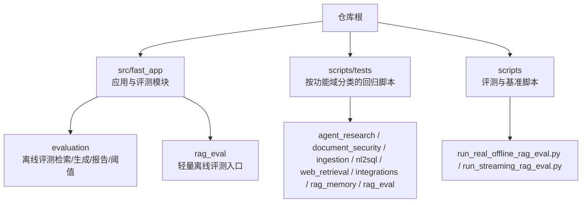
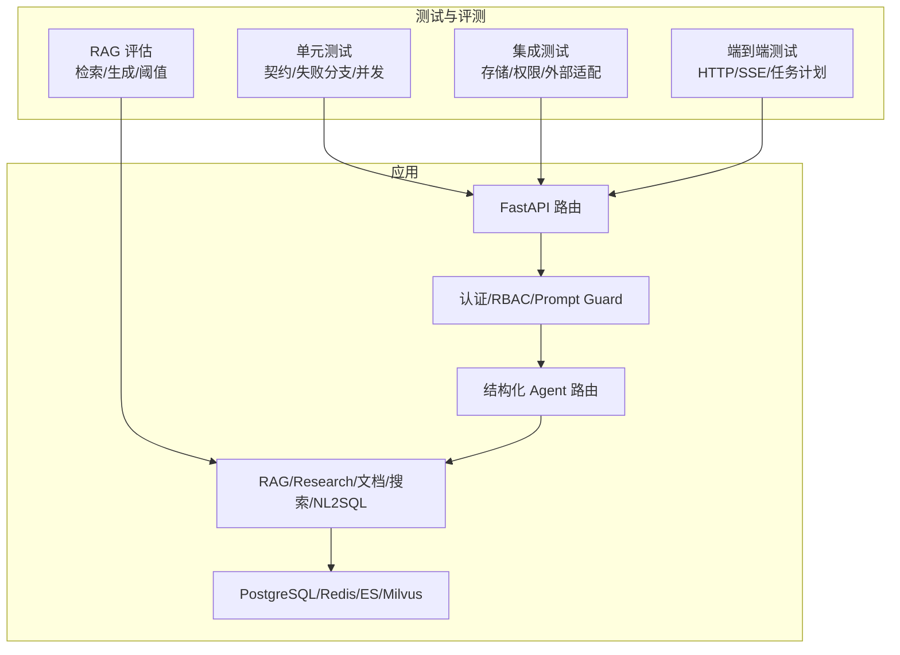
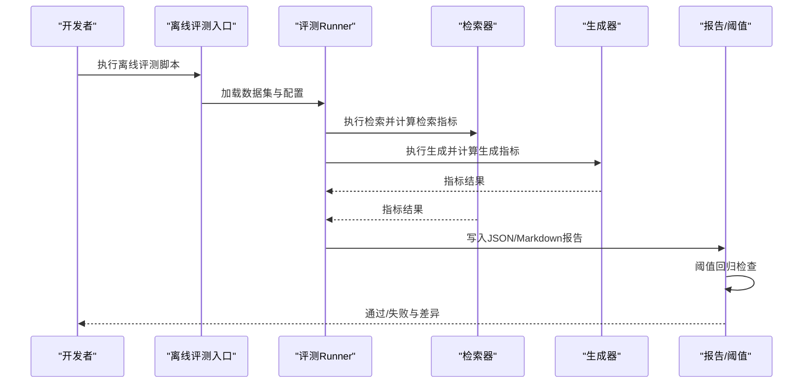
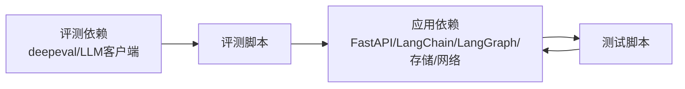

# 测试指南

<cite>
**本文引用的文件**
- [README.md](file://python-agent-study/README.md)
- [requirements.txt](file://python-agent-study/requirements.txt)
- [requirements-eval.txt](file://python-agent-study/requirements-eval.txt)
- [scripts/tests/readme.md](file://python-agent-study/scripts/tests/readme.md)
- [src/fast_app/evaluation/__init__.py](file://python-agent-study/src/fast_app/evaluation/__init__.py)
- [src/fast_app/rag_eval/__init__.py](file://python-agent-study/src/fast_app/rag_eval/__init__.py)
- [scripts/run_real_offline_rag_eval.py](file://python-agent-study/scripts/run_real_offline_rag_eval.py)
- [scripts/run_streaming_rag_eval.py](file://python-agent-study/scripts/run_streaming_rag_eval.py)
- [scripts/tests/agent_research/test_agent_task_router.py](file://python-agent-study/scripts/tests/agent_research/test_agent_task_router.py)
- [scripts/tests/document_security/test_guarded_streaming.py](file://python-agent-study/scripts/tests/document_security/test_guarded_streaming.py)
- [scripts/tests/ingestion/test_markdown_parent_child.py](file://python-agent-study/scripts/tests/ingestion/test_markdown_parent_child.py)
- [scripts/tests/nl2sql/test_nl2sql_module.py](file://python-agent-study/scripts/tests/nl2sql/test_nl2sql_module.py)
- [scripts/tests/web_retrieval/test_enhanced_web_search.py](file://python-agent-study/scripts/tests/web_retrieval/test_enhanced_web_search.py)
- [scripts/tests/integrations/test_mcp_tool_adapter.py](file://python-agent-study/scripts/tests/integrations/test_mcp_tool_adapter.py)
- [scripts/tests/rag_memory/test_rag_provider_matrix.py](file://python-agent-study/scripts/tests/rag_memory/test_rag_provider_matrix.py)
- [scripts/nl2sql/benchmark_real_questions.py](file://python-agent-study/scripts/nl2sql/benchmark_real_questions.py)
</cite>

## 目录
1. [简介](#简介)
2. [项目结构](#项目结构)
3. [核心组件](#核心组件)
4. [架构总览](#架构总览)
5. [详细组件分析](#详细组件分析)
6. [依赖分析](#依赖分析)
7. [性能考虑](#性能考虑)
8. [故障排查指南](#故障排查指南)
9. [结论](#结论)
10. [附录](#附录)

## 简介
本指南面向企业级 RAG Agent 后端，提供从单元测试、集成测试、端到端测试到 RAG 评估测试的完整编写与执行规范。内容覆盖测试框架使用、Mock 策略、测试数据管理、覆盖率要求、RAG 检索质量与生成质量评估、性能基准与回归流程，以及测试脚本使用方法、结果分析与问题定位技巧。

## 项目结构
仓库采用“按功能域组织”的结构：FastAPI 应用位于 src/fast_app，可执行的回归脚本位于 scripts/tests，离线评测模块位于 src/fast_app/evaluation 与独立轻量评测入口位于 src/fast_app/rag_eval。测试脚本按 agent_research、document_security、ingestion、nl2sql、web_retrieval、integrations、rag_memory、rag_eval 等分类存放，便于按能力域运行和隔离依赖。

**章节来源**
- [README.md:99-124](file://python-agent-study/README.md#L99-L124)
- [scripts/tests/readme.md:1-29](file://python-agent-study/scripts/tests/readme.md#L1-L29)

## 核心组件
- 测试运行基线
  - 通过设置 PYTHONPATH 指向 src，关闭 LangSmith 追踪，确保测试在最小依赖下稳定运行。
  - 推荐先运行一组不依赖公网与外部服务的确定性回归用例，验证基础链路。
- 测试分类与职责
  - agent_research：Router、TaskPlan、Research 编排与结构化输出契约。
  - document_security：文档 Agent、Checkpoint、RBAC、ACL、Prompt Guard。
  - ingestion：Markdown、父子 Chunk、PPTX/XLSX 导入。
  - nl2sql：安全、授权、API、路由与真实数据库访问。
  - web_retrieval：Web Search 适配器、过滤、正文、重定向与 Sitemap。
  - integrations：GitLab、LangSmith、MCP、ChatGPT 只读桥接。
  - rag_memory：RAG HTTP/SSE、Provider 矩阵、多轮会话与摘要记忆。
  - rag_eval：检索指标、生成指标、流式目标、子进程安全与适配层。
- Provider 矩阵与环境切换
  - 通过临时覆盖环境变量并清理配置缓存，实现同一进程内对 LLM、向量/关键词检索器、reranker 等组件的切换与隔离。
- 评测体系
  - evaluation：版本化评测契约、数据集加载、检索/生成指标、离线 Runner、快照与报告、阈值回归检查。
  - rag_eval：轻量离线评测，支持真实结构化流与流式目标收集。

**章节来源**
- [README.md:282-319](file://python-agent-study/README.md#L282-L319)
- [scripts/tests/readme.md:1-29](file://python-agent-study/scripts/tests/readme.md#L1-L29)
- [src/fast_app/evaluation/__init__.py:1-12](file://python-agent-study/src/fast_app/evaluation/__init__.py#L1-L12)
- [src/fast_app/rag_eval/__init__.py:1-6](file://python-agent-study/src/fast_app/rag_eval/__init__.py#L1-L6)
- [scripts/tests/rag_memory/test_rag_provider_matrix.py:131-161](file://python-agent-study/scripts/tests/rag_memory/test_rag_provider_matrix.py#L131-L161)

## 架构总览
下图展示测试与评测如何围绕 FastAPI 主链路、Agent 路由、检索与生成组件进行断言与回归。

**图表来源**
- [README.md:29-59](file://python-agent-study/README.md#L29-L59)

## 详细组件分析

### 单元测试：契约、失败分支与并发
- 目标
  - 验证输入校验、错误路径、并发边界、序列化/反序列化契约。
- 建议实践
  - 使用 pytest 组织用例；对异步代码使用合适的异步测试工具。
  - 对外部依赖（LLM、检索器、数据库、网络）使用 Mock 或内存替代。
  - 针对结构化输出（如 Router/TaskPlan）增加字段描述与约束断言。
- 参考脚本
  - 示例：任务路由、Schema 字段描述、受保护流式输出、Markdown 父子块、NL2SQL 模块、Web 增强检索、MCP 工具适配等。

**章节来源**
- [scripts/tests/agent_research/test_agent_task_router.py](file://python-agent-study/scripts/tests/agent_research/test_agent_task_router.py)
- [scripts/tests/agent_research/test_schema_field_descriptions.py](file://python-agent-study/scripts/tests/agent_research/test_schema_field_descriptions.py)
- [scripts/tests/document_security/test_guarded_streaming.py](file://python-agent-study/scripts/tests/document_security/test_guarded_streaming.py)
- [scripts/tests/ingestion/test_markdown_parent_child.py](file://python-agent-study/scripts/tests/ingestion/test_markdown_parent_child.py)
- [scripts/tests/nl2sql/test_nl2sql_module.py](file://python-agent-study/scripts/tests/nl2sql/test_nl2sql_module.py)
- [scripts/tests/web_retrieval/test_enhanced_web_search.py](file://python-agent-study/scripts/tests/web_retrieval/test_enhanced_web_search.py)
- [scripts/tests/integrations/test_mcp_tool_adapter.py](file://python-agent-study/scripts/tests/integrations/test_mcp_tool_adapter.py)

### 集成测试：存储、权限与外部适配
- 目标
  - 验证与 PostgreSQL、Redis、Elasticsearch、Milvus、GitLab、LangSmith、MCP 等组件的交互契约。
- 建议实践
  - 使用容器或本地服务准备测试环境；为每个用例准备隔离数据。
  - 对敏感操作（如文档变更、MR 创建）启用 dry-run 或仅读取模式。
  - 对网络调用设置超时与重试上限，避免测试长时间阻塞。
- 参考脚本
  - GitLab 同步、LangSmith 接入、MCP 工具适配、部门 ACL 验收、RBAC 迁移等。

**章节来源**
- [scripts/tests/integrations/test_gitlab_enterprise_sync.py](file://python-agent-study/scripts/tests/integrations/test_gitlab_enterprise_sync.py)
- [scripts/tests/integrations/test_langsmith_tracing.py](file://python-agent-study/scripts/tests/integrations/test_langsmith_tracing.py)
- [scripts/tests/integrations/test_mcp_tool_adapter.py](file://python-agent-study/scripts/tests/integrations/test_mcp_tool_adapter.py)
- [scripts/tests/document_security/test_department_rag_acl_acceptance.py](file://python-agent-study/scripts/tests/document_security/test_department_rag_acl_acceptance.py)
- [scripts/tests/document_security/test_rbac_auth_migration.py](file://python-agent-study/scripts/tests/document_security/test_rbac_auth_migration.py)

### 端到端测试：HTTP/SSE、任务计划与多轮对话
- 目标
  - 验证从请求到响应/事件的全链路行为，包括认证、路由、检索、生成、任务确认与取消。
- 建议实践
  - 使用最小启动基线（classic + mock retriever）快速验证接口契约。
  - 对 SSE 流式接口，验证事件顺序、状态转换与错误事件。
  - 对 TaskPlan 流程，验证创建、查询、确认、取消、重试的幂等性与一致性。
- 参考脚本
  - 多轮会话、Provider 矩阵、受保护流式输出、NL2SQL 路由等。

**章节来源**
- [README.md:145-193](file://python-agent-study/README.md#L145-L193)
- [scripts/tests/rag_memory/test_rag_provider_matrix.py:131-161](file://python-agent-study/scripts/tests/rag_memory/test_rag_provider_matrix.py#L131-L161)
- [scripts/tests/document_security/test_guarded_streaming.py](file://python-agent-study/scripts/tests/document_security/test_guarded_streaming.py)
- [scripts/tests/nl2sql/test_nl2sql_rag_routing.py](file://python-agent-study/scripts/tests/nl2sql/test_nl2sql_rag_routing.py)

### RAG 评估测试：检索质量、生成质量、性能基准与回归
- 目标
  - 评估检索召回与排序质量、生成答案是否引用来源、是否编造、是否拒答，并对比阈值进行回归判断。
- 关键模块
  - evaluation：版本化评测契约、数据集加载、检索/生成指标、离线 Runner、快照与报告、阈值回归检查。
  - rag_eval：轻量离线评测，支持真实结构化流与流式目标收集。
- 运行方式
  - 使用独立评测脚本批量执行离线评测，输出 JSON/Markdown 报告。
  - 结合 thresholds 模块进行回归判定，未达标时阻断发布。
- 参考脚本
  - 离线评测入口、流式评测入口、NL2SQL 真实问题基准。

**图表来源**
- [src/fast_app/evaluation/__init__.py:1-12](file://python-agent-study/src/fast_app/evaluation/__init__.py#L1-L12)
- [src/fast_app/rag_eval/__init__.py:1-6](file://python-agent-study/src/fast_app/rag_eval/__init__.py#L1-L6)
- [scripts/run_real_offline_rag_eval.py](file://python-agent-study/scripts/run_real_offline_rag_eval.py)
- [scripts/run_streaming_rag_eval.py](file://python-agent-study/scripts/run_streaming_rag_eval.py)

**章节来源**
- [scripts/run_real_offline_rag_eval.py](file://python-agent-study/scripts/run_real_offline_rag_eval.py)
- [scripts/run_streaming_rag_eval.py](file://python-agent-study/scripts/run_streaming_rag_eval.py)
- [scripts/nl2sql/benchmark_real_questions.py:126-140](file://python-agent-study/scripts/nl2sql/benchmark_real_questions.py#L126-L140)

### 测试数据管理
- 数据集与案例
  - 使用版本化的评测数据集（如 stage11_rag_eval_cases.*），保证评测可重复与可回溯。
- 环境与配置
  - 通过环境变量切换 provider（LLM、向量/关键词检索器、reranker），并在用例前后恢复原始值，避免污染。
- 资源隔离
  - 数据库、索引、会话与任务计划应使用隔离命名空间或临时实例，防止跨用例干扰。

**章节来源**
- [scripts/tests/rag_memory/test_rag_provider_matrix.py:131-161](file://python-agent-study/scripts/tests/rag_memory/test_rag_provider_matrix.py#L131-L161)
- [README.md:145-193](file://python-agent-study/README.md#L145-L193)

### 覆盖率要求
- 建议目标
  - 核心领域模型与评测契约：≥90% 行覆盖率。
  - 外部集成与异常路径：≥80% 行覆盖率。
  - 流式处理与并发路径：重点覆盖错误分支与超时路径。
- 工具与实践
  - 使用覆盖率工具统计并生成报告；对关键路径补充单测。
  - 将覆盖率阈值纳入 CI，未达标则阻断合并。

[本节为通用指导，不直接分析具体文件]

### 测试脚本使用方法
- 统一前置
  - 设置 PYTHONPATH=src，关闭 LangSmith 追踪。
  - 使用虚拟环境中的 Python 解释器执行脚本。
- 快速回归
  - 优先运行一组不依赖公网与外部服务的确定性回归脚本，验证基础链路。
- 按需扩展
  - 根据需求启用 PostgreSQL、Redis、GitLab、ES/Milvus、真实模型或公网能力，再运行对应分类脚本。

**章节来源**
- [README.md:282-319](file://python-agent-study/README.md#L282-L319)
- [scripts/tests/readme.md:17-29](file://python-agent-study/scripts/tests/readme.md#L17-L29)

### 测试结果分析与问题定位技巧
- 结果解读
  - 关注 JSON/Markdown 报告中的指标趋势、失败用例与差异项。
  - 对阈值回归失败的指标，定位最近变更与数据漂移。
- 日志与追踪
  - 开启 debug trace 与 LangSmith tracing（必要时），结合 request/trace ID 定位问题。
- 常见定位步骤
  - 复现：使用最小启动基线与相同数据集。
  - 隔离：缩小范围至单一模块或单一用例。
  - 注入：添加断点或中间结果打印，观察数据流转。
  - 回滚：对比上一版本报告，定位引入问题的提交。

**章节来源**
- [README.md:241-260](file://python-agent-study/README.md#L241-L260)
- [scripts/run_real_offline_rag_eval.py](file://python-agent-study/scripts/run_real_offline_rag_eval.py)

## 依赖分析
- 运行时依赖
  - 应用依赖包含 FastAPI、LangChain/LangGraph、Milvus、Elasticsearch、PostgreSQL、Redis、OpenAI 兼容客户端等。
- 评测依赖
  - 独立评测模块额外依赖 deepeval 等评测库，保持生产部署轻量。
- 测试依赖
  - 测试脚本依赖上述运行时依赖；部分脚本需要真实外部服务或公网。

**图表来源**
- [requirements.txt:1-111](file://python-agent-study/requirements.txt#L1-L111)
- [requirements-eval.txt:1-8](file://python-agent-study/requirements-eval.txt#L1-L8)

**章节来源**
- [requirements.txt:1-111](file://python-agent-study/requirements.txt#L1-L111)
- [requirements-eval.txt:1-8](file://python-agent-study/requirements-eval.txt#L1-L8)

## 性能考虑
- 测试执行
  - 控制并发度，避免压垮外部服务；对网络调用设置合理超时与重试上限。
  - 使用内存替代或 Mock 减少 I/O 开销，提升单测速度。
- 评测执行
  - 批量化请求 pipeline，减少连接建立与鉴权开销。
  - 对检索与生成阶段分别计时，识别瓶颈。
- 基准测试
  - 使用真实问题集进行 NL2SQL 基准，记录可执行率与正确率，跟踪趋势。

**章节来源**
- [scripts/nl2sql/benchmark_real_questions.py:126-140](file://python-agent-study/scripts/nl2sql/benchmark_real_questions.py#L126-L140)

## 故障排查指南
- 常见问题
  - 环境变量未生效：检查 get_settings 缓存是否清理。
  - 外部服务不可用：确认服务状态、端口、凭据与网络连通性。
  - 评测指标波动：检查数据集版本、索引版本与模型版本一致性。
- 定位方法
  - 使用最小启动基线复现问题。
  - 打开 debug trace 与 LangSmith tracing，结合 trace ID 定位。
  - 逐步禁用可选能力（如 Web 检索、GitLab 同步），缩小范围。
- 恢复策略
  - 重置索引与知识库，重建 v2 索引后进行回归。
  - 回滚到上一个稳定版本，对比报告差异。

**章节来源**
- [scripts/tests/rag_memory/test_rag_provider_matrix.py:131-161](file://python-agent-study/scripts/tests/rag_memory/test_rag_provider_matrix.py#L131-L161)
- [README.md:241-260](file://python-agent-study/README.md#L241-L260)

## 结论
本指南提供了从单元到端到端、从功能回归到 RAG 评估的完整测试体系。通过清晰的分类、严格的契约断言、可控的环境切换与版本化评测，可在保证质量的同时提升迭代效率。建议在 CI 中固化关键回归与评测流程，持续监控指标趋势与阈值回归结果。

## 附录
- 快速命令
  - 设置环境变量并运行一组确定性回归脚本。
  - 执行离线评测与流式评测，查看 JSON/Markdown 报告。
- 参考入口
  - 评测模块说明与 README。
  - 各分类测试 readme 与前置条件。

**章节来源**
- [README.md:282-319](file://python-agent-study/README.md#L282-L319)
- [scripts/tests/readme.md:1-29](file://python-agent-study/scripts/tests/readme.md#L1-L29)
- [src/fast_app/evaluation/__init__.py:1-12](file://python-agent-study/src/fast_app/evaluation/__init__.py#L1-L12)
- [src/fast_app/rag_eval/__init__.py:1-6](file://python-agent-study/src/fast_app/rag_eval/__init__.py#L1-L6)