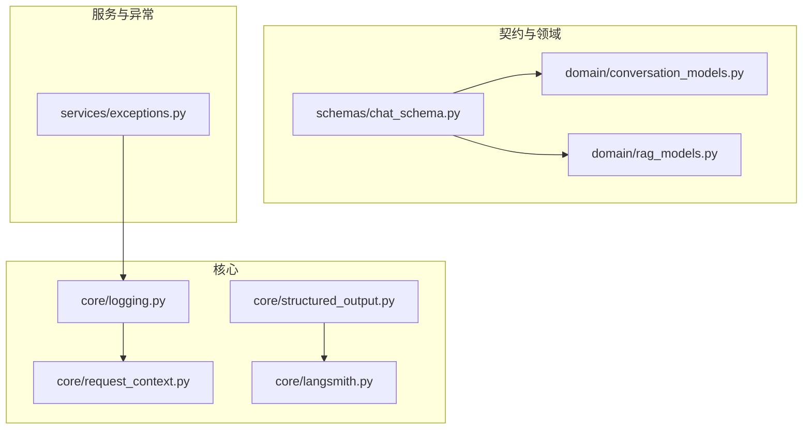
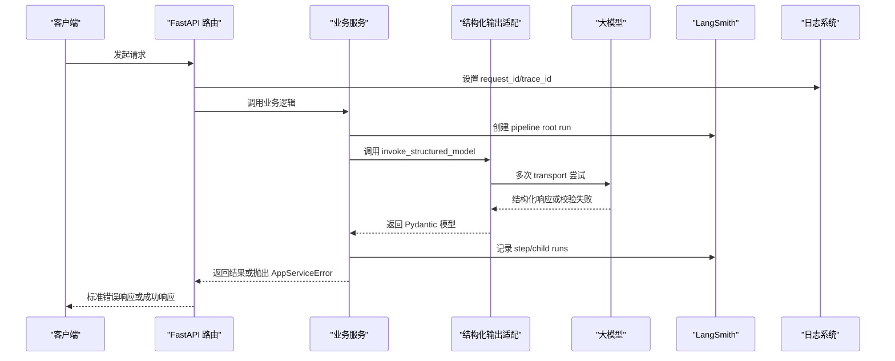
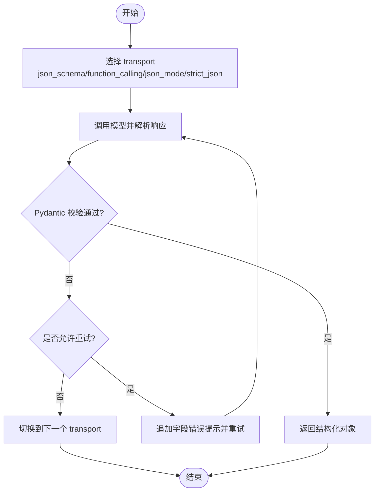
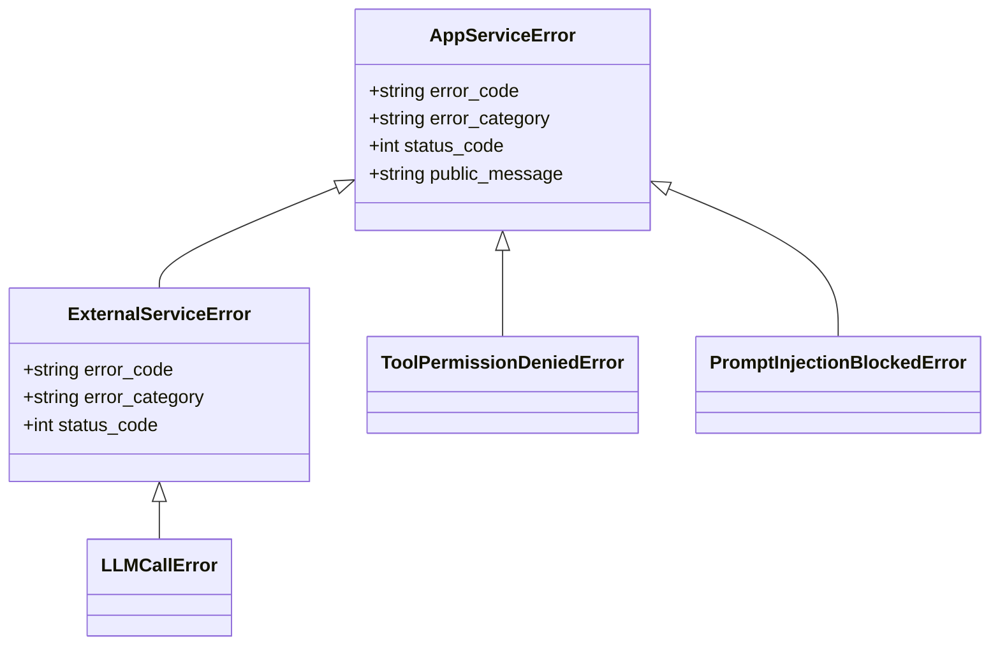
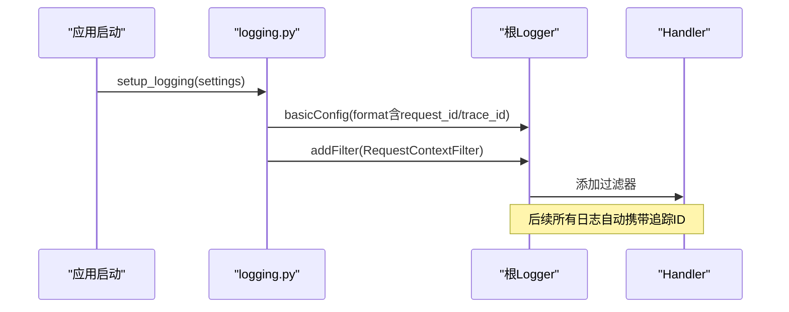
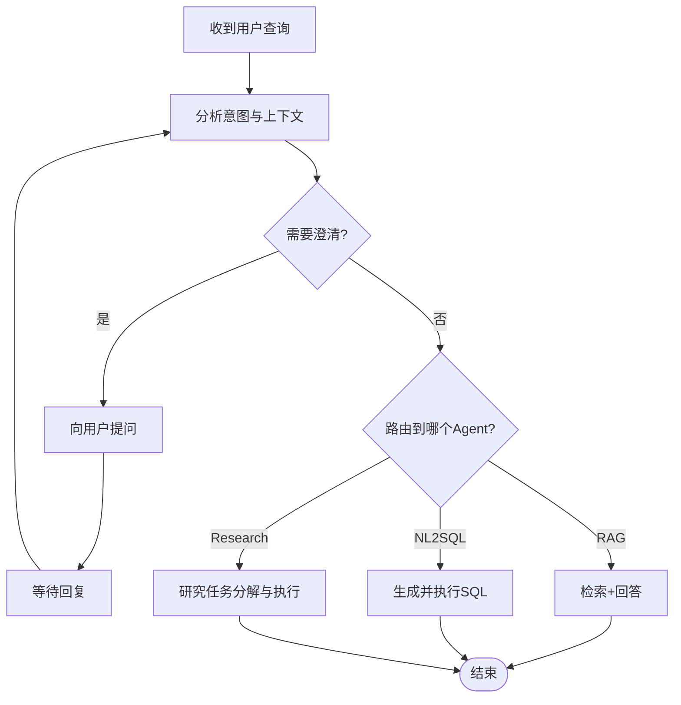
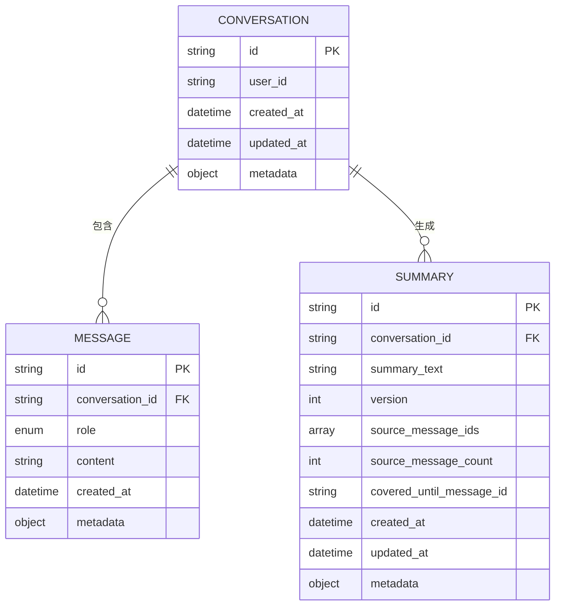
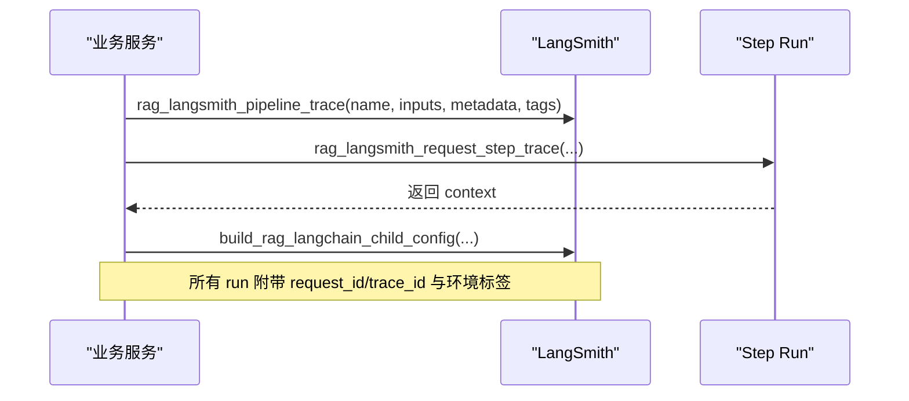
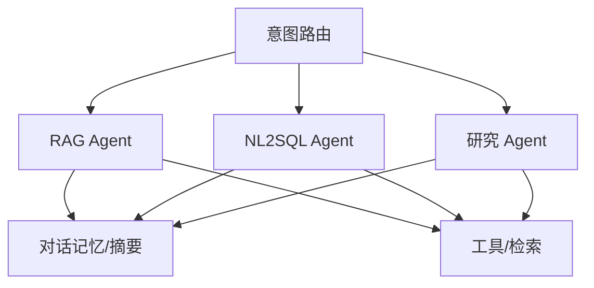
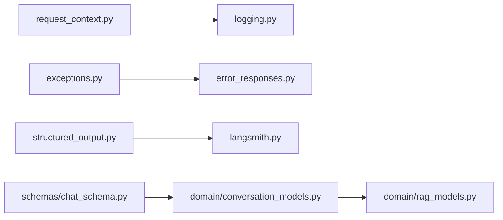

# 编码规范

<cite>
**本文引用的文件**
- [logging.py](file://src/fast_app/core/logging.py)
- [error_responses.py](file://src/fast_app/core/error_responses.py)
- [structured_output.py](file://src/fast_app/core/structured_output.py)
- [chat_schema.py](file://src/fast_app/schemas/chat_schema.py)
- [conversation_models.py](file://src/fast_app/domain/conversation_models.py)
- [langsmith.py](file://src/fast_app/core/langsmith.py)
- [exceptions.py](file://src/fast_app/services/exceptions.py)
- [request_context.py](file://src/fast_app/core/request_context.py)
- [rag_models.py](file://src/fast_app/domain/rag_models.py)
</cite>

## 目录
1. [简介](#简介)
2. [项目结构](#项目结构)
3. [核心组件](#核心组件)
4. [架构总览](#架构总览)
5. [详细组件分析](#详细组件分析)
6. [依赖关系分析](#依赖关系分析)
7. [性能考虑](#性能考虑)
8. [故障排查指南](#故障排查指南)
9. [结论](#结论)
10. [附录：代码审查清单、反模式与重构建议](#附录：代码审查清单反模式与重构建议)

## 简介
本规范面向当前多 Agent、RAG、对话记忆与可观测性集成的工程，目标是统一 Pydantic 模型设计、JSON Schema 字段描述、错误处理、日志记录、命名约定，并明确 Agent 意图路由规则、对话上下文管理规则、LangSmith 可观测性规范以及多 Agent 协作规则。文档同时提供代码级示例路径与违规案例对比，帮助团队在评审中快速定位问题。

## 项目结构
本项目采用分层与按能力域组织相结合的方式：
- core：通用基础设施（日志、请求上下文、结构化输出适配、LangSmith 可观测性）
- schemas：对外 API 的输入输出契约（Pydantic 模型）
- domain：领域模型与内部数据结构（会话、检索、任务计划等）
- services：业务服务层（Agent 任务、RAG、知识、NL2SQL 等）
- graph：图式编排（Classic/LangGraph Pipeline）
- api：FastAPI 路由层
- integrations：外部系统集成（如 GitLab、MCP）
- ingestion：知识入库流水线
- evaluation：评测体系

图表来源
- [logging.py:1-77](file://src/fast_app/core/logging.py#L1-L77)
- [request_context.py:1-39](file://src/fast_app/core/request_context.py#L1-L39)
- [structured_output.py:1-127](file://src/fast_app/core/structured_output.py#L1-L127)
- [langsmith.py:1-604](file://src/fast_app/core/langsmith.py#L1-L604)
- [chat_schema.py:1-41](file://src/fast_app/schemas/chat_schema.py#L1-L41)
- [conversation_models.py:1-129](file://src/fast_app/domain/conversation_models.py#L1-L129)
- [rag_models.py:1-80](file://src/fast_app/domain/rag_models.py#L1-L80)
- [exceptions.py:1-190](file://src/fast_app/services/exceptions.py#L1-L190)

章节来源
- [logging.py:1-77](file://src/fast_app/core/logging.py#L1-L77)
- [request_context.py:1-39](file://src/fast_app/core/request_context.py#L1-L39)
- [structured_output.py:1-127](file://src/fast_app/core/structured_output.py#L1-L127)
- [langsmith.py:1-604](file://src/fast_app/core/langsmith.py#L1-L604)
- [chat_schema.py:1-41](file://src/fast_app/schemas/chat_schema.py#L1-L41)
- [conversation_models.py:1-129](file://src/fast_app/domain/conversation_models.py#L1-L129)
- [rag_models.py:1-80](file://src/fast_app/domain/rag_models.py#L1-L80)
- [exceptions.py:1-190](file://src/fast_app/services/exceptions.py#L1-L190)

## 核心组件
- 日志与追踪上下文：通过 RequestContextFilter 注入 request_id 与 trace_id，统一日志格式；setup_logging 在应用启动时配置根 logger。
- 结构化输出适配：invoke_structured_model 以“json_schema/function_calling/json_mode/strict_json”多种 transport 重试，结合 Pydantic 校验与提示词修正，提高大模型结构化返回稳定性。
- LangSmith 可观测性：集中封装 enable/disable、metadata/tags 构造、payload 脱敏、pipeline/step/child run 创建，保证 Classic/LangGraph 链路一致的可观测性。
- 错误响应与异常体系：AppServiceError 及其子类定义统一的 error_code、status_code、error_category；error_responses 将异常转换为标准 JSON 错误体。
- 会话与对话模型：ConversationMessage/Conversation/Summary 提供消息、会话、摘要的结构化表示，支持版本化与溯源。
- RAG 内部数据模型：RetrievalFilters/Options、RetrievedDoc、ScoreBreakdown、RagContext 表达检索参数、结果与上下文构建。

章节来源
- [logging.py:1-77](file://src/fast_app/core/logging.py#L1-L77)
- [structured_output.py:1-127](file://src/fast_app/core/structured_output.py#L1-L127)
- [langsmith.py:1-604](file://src/fast_app/core/langsmith.py#L1-L604)
- [error_responses.py:1-64](file://src/fast_app/core/error_responses.py#L1-L64)
- [exceptions.py:1-190](file://src/fast_app/services/exceptions.py#L1-L190)
- [conversation_models.py:1-129](file://src/fast_app/domain/conversation_models.py#L1-L129)
- [rag_models.py:1-80](file://src/fast_app/domain/rag_models.py#L1-L80)

## 架构总览
下图展示一次 RAG/Agent 请求从入口到可观测性与错误处理的整体流程，强调结构化输出、日志上下文、LangSmith 追踪与错误分类的统一。

图表来源
- [langsmith.py:221-319](file://src/fast_app/core/langsmith.py#L221-L319)
- [structured_output.py:21-82](file://src/fast_app/core/structured_output.py#L21-L82)
- [logging.py:59-77](file://src/fast_app/core/logging.py#L59-L77)
- [error_responses.py:7-64](file://src/fast_app/core/error_responses.py#L7-L64)

## 详细组件分析

### Pydantic 模型设计规范与 JSON Schema 字段描述要求
- 禁止额外字段：使用 extra="forbid" 防止拼写错误或旧接口兼容导致的静默吞参。
- 字段约束：为字符串设置 min_length/max_length，为数值设置 ge/le，为枚举使用 StrEnum。
- 字段描述：每个字段必须提供 description，便于生成 JSON Schema 与前端表单。
- 自定义校验：使用 field_validator 进行业务校验，并在失败时给出清晰的用户可读信息。
- 默认值与工厂：使用 default_factory 生成唯一 ID、时间戳、列表等可变默认值。
- 不可变与只读：对不应被修改的字段使用 frozen=True 或 property 暴露只读视图。
- 序列化一致性：对外模型与内部模型分离，避免泄露内部实现细节。

参考实现路径
- [chat_schema.py:1-41](file://src/fast_app/schemas/chat_schema.py#L1-L41)
- [conversation_models.py:1-129](file://src/fast_app/domain/conversation_models.py#L1-L129)

章节来源
- [chat_schema.py:1-41](file://src/fast_app/schemas/chat_schema.py#L1-L41)
- [conversation_models.py:1-129](file://src/fast_app/domain/conversation_models.py#L1-L129)

### 结构化输出与 JSON Schema 传输策略
- 多 transport 回退：优先 json_schema/function_calling，其次 json_mode，最后 strict_json。
- 校验失败自愈：当 Pydantic 校验失败时，追加 SystemMessage 提示具体字段错误，最多两次尝试。
- 缓存最佳 transport：按模型标识缓存最近成功的 transport，减少无效调用。
- 安全与脱敏：结构化输出不直接暴露敏感内容，必要时通过 metadata/tags 记录非敏感维度。

图表来源
- [structured_output.py:21-127](file://src/fast_app/core/structured_output.py#L21-L127)

章节来源
- [structured_output.py:1-127](file://src/fast_app/core/structured_output.py#L1-L127)

### 错误处理模式与响应规范
- 异常分类：user_error、external_service_error、system_error 三类，分别对应不同状态码与用户可见语义。
- 统一错误体：包含 code、message、error_category、request_id、trace_id，便于前端与运维定位。
- 外部服务降级：对 LLM/检索/重排等外部依赖失败，抛出 ExternalServiceError 或其子类，由上层决定重试或降级。
- 权限与安全：工具执行需确认、权限拒绝、Prompt Injection 拦截等场景使用专用异常类型。

图表来源
- [exceptions.py:1-190](file://src/fast_app/services/exceptions.py#L1-L190)
- [error_responses.py:1-64](file://src/fast_app/core/error_responses.py#L1-L64)

章节来源
- [exceptions.py:1-190](file://src/fast_app/services/exceptions.py#L1-L190)
- [error_responses.py:1-64](file://src/fast_app/core/error_responses.py#L1-L64)

### 日志记录标准与上下文传播
- 全局日志格式：包含时间、级别、模块名、request_id、trace_id、消息体。
- 上下文注入：RequestContextFilter 自动附加 request_id/trace_id，无需手动传递。
- 结构化日志字段：format_log_fields 将复杂类型标准化为 JSON 字符串，避免换行破坏日志行。
- 启动配置：setup_logging 在应用启动时一次性配置根 logger，确保所有子模块继承。

图表来源
- [logging.py:59-77](file://src/fast_app/core/logging.py#L59-L77)
- [request_context.py:1-39](file://src/fast_app/core/request_context.py#L1-L39)

章节来源
- [logging.py:1-77](file://src/fast_app/core/logging.py#L1-L77)
- [request_context.py:1-39](file://src/fast_app/core/request_context.py#L1-L39)

### Agent 意图路由规则
- 路由目标：根据用户 query 与历史上下文判断是否需要检索、是否需要澄清、是否需要转交专业 Agent（如 NL2SQL、文档研究）。
- 决策依据：query 长度、关键词、历史中的实体与偏好、工具可用性、权限范围。
- 澄清机制：当指代不清或信息不足时，先向用户提问再进入执行路径。
- 终止条件：达到最大轮次或满足完成条件即停止，防止无限循环。

[此图为概念流程图，不直接映射具体源码文件]

### 对话上下文管理规则
- 消息模型：每条消息包含 id、conversation_id、role、content、created_at、metadata。
- 会话容器：Conversation 维护 user_id、时间戳、元数据，支持匿名与会话隔离。
- 摘要机制：ConversationSummary 压缩窗口外历史，保留 source_message_ids/version 以便追溯。
- 结构化摘要：ConversationStructuredSummary 仅保存明确事实，避免模型猜测写入长期记忆。
- 窗口策略：保留最近 N 轮消息，超出部分进入摘要更新流程。

图表来源
- [conversation_models.py:1-129](file://src/fast_app/domain/conversation_models.py#L1-L129)

章节来源
- [conversation_models.py:1-129](file://src/fast_app/domain/conversation_models.py#L1-L129)

### LangSmith 可观测性规范
- 启用判定：is_langsmith_enabled 检查开关与 API Key，避免无凭据访问。
- 配置同步：configure_langsmith 将 Settings 同步到环境变量，供 SDK 读取。
- 元数据与标签：build_langsmith_metadata/build_tags 统一附加 request_id、trace_id、环境、provider、operation、pipeline 等信息。
- 脱敏策略：sanitize_langsmith_payload 递归屏蔽敏感字段，除非显式开启 include_sensitive_data。
- 根运行与步骤：rag_langsmith_pipeline_trace 创建 pipeline root run；rag_langsmith_request_step_trace/state_step_trace 创建 step run；build_rag_langchain_child_config 注入 child run 上下文。
- 名称规范：统一命名 pipeline 与 operation，便于 UI 过滤与聚合。

图表来源
- [langsmith.py:34-107](file://src/fast_app/core/langsmith.py#L34-L107)
- [langsmith.py:109-163](file://src/fast_app/core/langsmith.py#L109-L163)
- [langsmith.py:221-319](file://src/fast_app/core/langsmith.py#L221-L319)
- [langsmith.py:421-537](file://src/fast_app/core/langsmith.py#L421-L537)

章节来源
- [langsmith.py:1-604](file://src/fast_app/core/langsmith.py#L1-L604)

### 多 Agent 协作规则
- 职责边界：RAG Agent、NL2SQL Agent、研究 Agent 各自负责特定领域，通过路由层协调。
- 共享上下文：通过 Conversation/Summary 与 RagContext 传递必要信息，避免重复检索。
- 权限与确认：高风险工具调用需人工确认或权限网关放行。
- 可观测性对齐：各 Agent 的 step run 使用统一命名与标签，便于跨 Agent 追踪。
- 降级与熔断：外部服务不可用时返回明确的 503/422，并记录原因。

[此图为概念架构图，不直接映射具体源码文件]

## 依赖关系分析
- logging 依赖 request_context 注入追踪 ID。
- structured_output 依赖 langchain_core 与 pydantic，用于结构化输出与校验。
- langsmith 依赖 settings、logging、request_context，统一可观测性。
- error_responses 依赖 exceptions 与 request_context，生成标准错误体。
- schemas 与 domain 解耦：API 契约与内部领域模型分离，降低耦合度。

图表来源
- [logging.py:1-77](file://src/fast_app/core/logging.py#L1-L77)
- [request_context.py:1-39](file://src/fast_app/core/request_context.py#L1-L39)
- [structured_output.py:1-127](file://src/fast_app/core/structured_output.py#L1-L127)
- [langsmith.py:1-604](file://src/fast_app/core/langsmith.py#L1-L604)
- [error_responses.py:1-64](file://src/fast_app/core/error_responses.py#L1-L64)
- [chat_schema.py:1-41](file://src/fast_app/schemas/chat_schema.py#L1-L41)
- [conversation_models.py:1-129](file://src/fast_app/domain/conversation_models.py#L1-L129)
- [rag_models.py:1-80](file://src/fast_app/domain/rag_models.py#L1-L80)

章节来源
- [logging.py:1-77](file://src/fast_app/core/logging.py#L1-L77)
- [request_context.py:1-39](file://src/fast_app/core/request_context.py#L1-L39)
- [structured_output.py:1-127](file://src/fast_app/core/structured_output.py#L1-L127)
- [langsmith.py:1-604](file://src/fast_app/core/langsmith.py#L1-L604)
- [error_responses.py:1-64](file://src/fast_app/core/error_responses.py#L1-L64)
- [chat_schema.py:1-41](file://src/fast_app/schemas/chat_schema.py#L1-L41)
- [conversation_models.py:1-129](file://src/fast_app/domain/conversation_models.py#L1-L129)
- [rag_models.py:1-80](file://src/fast_app/domain/rag_models.py#L1-L80)

## 性能考虑
- 结构化输出 transport 缓存：避免重复探测不支持的能力，减少无效调用。
- 日志格式化：format_log_fields 将复杂类型序列化为单行 JSON，降低 I/O 开销。
- LangSmith 元数据最小化：默认只上传必要字段，敏感数据需显式开启，减少网络与存储压力。
- 检索参数控制：top_k/candidate_k/min_score 合理设置，避免过度召回与重排成本。
- 会话摘要：及时压缩历史消息，控制上下文大小，降低 LLM 调用成本。

[本节为通用指导，不直接分析具体文件]

## 故障排查指南
- 结构化输出失败：查看 structured_output 的警告日志，确认 transport 与校验错误详情，必要时调整提示词或模型能力。
- LangSmith 未记录：检查 is_langsmith_enabled 与 configure_langsmith 是否调用，确认环境变量与 API Key。
- 错误响应不一致：确认抛出的异常类型与 error_responses 的映射，确保 error_category 与 status_code 正确。
- 日志缺失追踪 ID：确认 RequestContextFilter 已添加到根 logger，且 set_request_context 在入口处调用。
- 检索结果为空：检查 RetrievalFilters/Options 与权限范围，确认 knowledge_version 与部门 ACL。

章节来源
- [structured_output.py:21-82](file://src/fast_app/core/structured_output.py#L21-L82)
- [langsmith.py:34-107](file://src/fast_app/core/langsmith.py#L34-L107)
- [error_responses.py:7-64](file://src/fast_app/core/error_responses.py#L7-L64)
- [logging.py:59-77](file://src/fast_app/core/logging.py#L59-L77)
- [rag_models.py:1-80](file://src/fast_app/domain/rag_models.py#L1-L80)

## 结论
本规范通过统一的 Pydantic 模型设计、结构化输出适配、错误分类与响应、日志上下文与 LangSmith 可观测性，构建了稳定、可观测、易排错的 Agent/RAG 工程基础。遵循这些规范可显著降低协作成本、提升质量与可维护性。

## 附录：代码审查清单、反模式与重构建议

### 代码审查清单
- Pydantic 模型
  - 是否设置 extra="forbid"？
  - 是否对所有字段提供 description？
  - 是否使用合理的 min_length/max_length/ge/le？
  - 是否使用 field_validator 做业务校验？
  - 是否使用 default_factory 生成可变默认值？
- 结构化输出
  - 是否使用 invoke_structured_model？
  - 是否记录 transport 与校验失败的警告日志？
  - 是否避免在提示词中泄露敏感信息？
- 错误处理
  - 是否抛出合适的 AppServiceError 子类？
  - 是否通过 error_responses 生成标准错误体？
  - 是否区分 user_error/external_service_error/system_error？
- 日志与可观测性
  - 是否在入口处设置 request_id/trace_id？
  - 是否使用 format_log_fields 记录结构化字段？
  - 是否通过 LangSmith 创建 pipeline/step/child run？
  - 是否对敏感数据进行脱敏？
- 对话上下文
  - 是否使用 ConversationMessage/Conversation/Summary？
  - 是否限制消息窗口并生成摘要？
  - 是否避免将模型猜测写入长期记忆？
- 多 Agent 协作
  - 是否明确路由规则与终止条件？
  - 是否对高风险工具调用进行确认或权限检查？
  - 是否在各 Agent 中保持 LangSmith 命名与标签一致？

### 常见反模式
- 在 Pydantic 模型中使用任意 dict 作为字段类型而不加约束。
- 在结构化输出中直接拼接用户输入到提示词，导致注入风险。
- 捕获所有异常并返回 200，掩盖真实错误。
- 在日志中打印完整请求体或 SQL，造成敏感信息泄露。
- 在对话记忆中保存用户隐私或未验证的事实。
- 在多 Agent 间重复检索相同内容，浪费资源。

### 重构建议
- 将 API 契约与领域模型分离，避免泄露内部实现。
- 将 LangSmith 配置集中在启动阶段，避免分散的环境变量设置。
- 将错误分类与响应构建抽取为统一函数，减少重复代码。
- 将结构化输出提示词与校验错误收集集中管理，便于迭代优化。
- 将对话摘要策略抽象为可配置的服务，支持不同窗口与压缩算法。
- 将多 Agent 路由规则与权限检查解耦，便于扩展新 Agent。