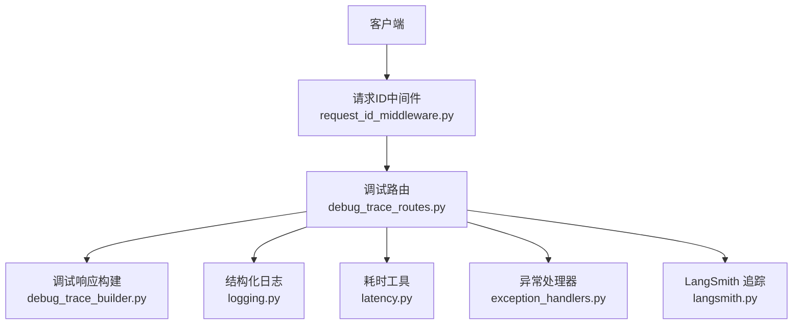
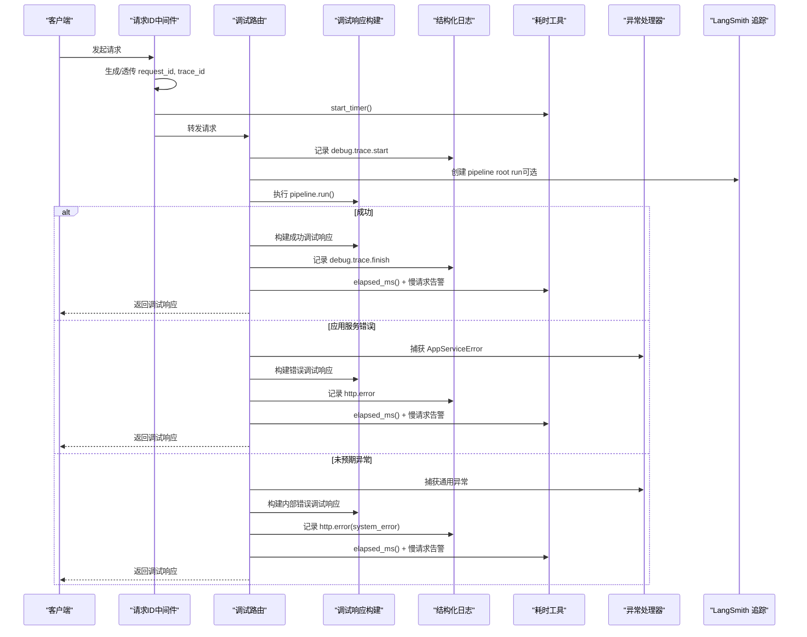
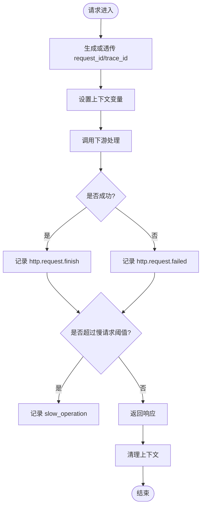
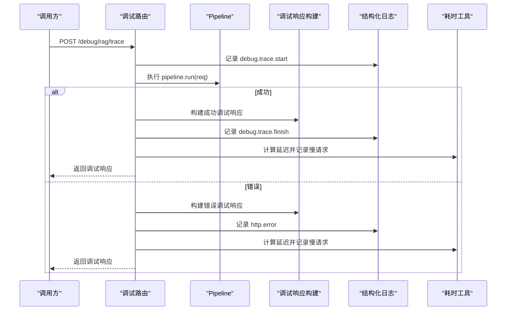
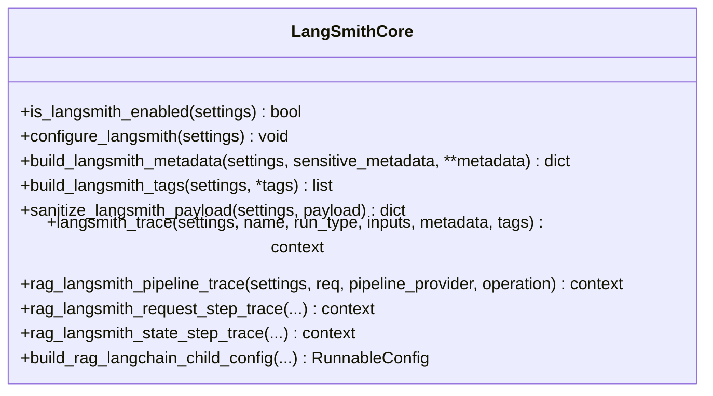
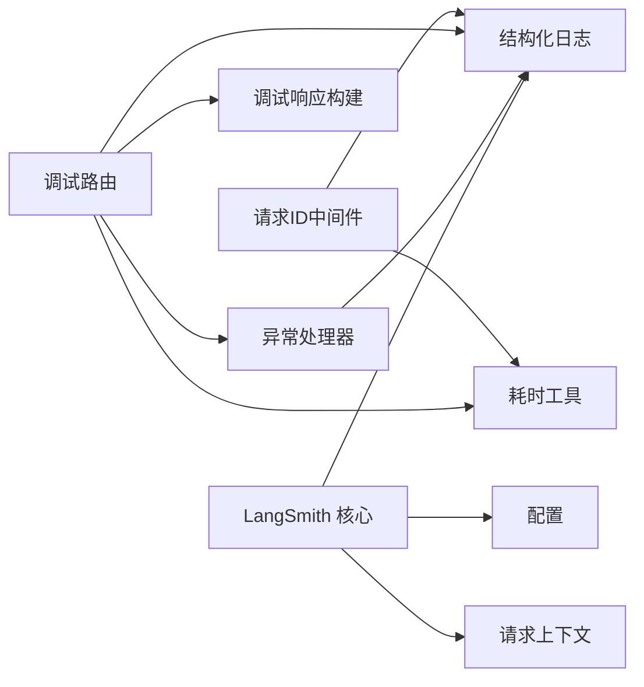

# 调试与故障排查

<cite>
**本文引用的文件**
- [src/fast_app/core/langsmith.py](file://python-agent-study/src/fast_app/core/langsmith.py)
- [src/fast_app/core/logging.py](file://python-agent-study/src/fast_app/core/logging.py)
- [src/fast_app/core/request_context.py](file://python-agent-study/src/fast_app/core/request_context.py)
- [src/fast_app/middlewares/request_id_middleware.py](file://python-agent-study/src/fast_app/middlewares/request_id_middleware.py)
- [src/fast_app/api/debug_trace_routes.py](file://python-agent-study/src/fast_app/api/debug_trace_routes.py)
- [src/fast_app/services/debug_trace_builder.py](file://python-agent-study/src/fast_app/services/debug_trace_builder.py)
- [src/fast_app/core/exception_handlers.py](file://python-agent-study/src/fast_app/core/exception_handlers.py)
- [src/fast_app/core/latency.py](file://python-agent-study/src/fast_app/core/latency.py)
- [AGENTS.md](file://python-agent-study/AGENTS.md)
- [learning-docs/phase-12/12-7-LangSmith-Python接入+知识点讲解.md](file://python-agent-study/learning-docs/phase-12/12-7-LangSmith-Python接入+知识点讲解.md)
</cite>

## 目录
1. [简介](#简介)
2. [项目结构](#项目结构)
3. [核心组件](#核心组件)
4. [架构总览](#架构总览)
5. [详细组件分析](#详细组件分析)
6. [依赖关系分析](#依赖关系分析)
7. [性能考虑](#性能考虑)
8. [故障排查指南](#故障排查指南)
9. [结论](#结论)
10. [附录](#附录)

## 简介
本指南面向生产与开发环境中的调试、日志分析、性能监控和问题定位，覆盖以下主题：
- 常用调试工具使用：内置调试接口、结构化日志、LangSmith 追踪。
- 日志分析方法：请求级 trace_id 串联、事件化日志、慢请求告警。
- 错误堆栈分析：统一异常处理、错误分类、响应体字段对齐。
- 性能瓶颈识别：HTTP 层耗时、RAG Pipeline 耗时、外部服务耗时。
- LangSmith 追踪：自动与手动埋点、metadata/tags、敏感数据脱敏。
- 常见问题诊断步骤、解决方案与预防措施。
- 生产问题排查最佳实践与应急处理流程。

## 项目结构
本项目在 FastAPI 应用中提供统一的调试与可观测性能力，关键路径包括：
- 请求上下文与中间件：生成并传播 request_id/trace_id，记录 HTTP 耗时与慢请求。
- 结构化日志：为所有日志注入 request_id/trace_id，便于跨模块关联。
- 调试接口：受控暴露 /debug/rag/trace，返回一次 RAG 调用的完整快照。
- 异常处理：统一捕获并分类用户错误、外部服务错误、系统错误。
- LangSmith 追踪：集中配置、统一命名、统一 metadata/tags、敏感字段脱敏。

**图表来源**
- [src/fast_app/middlewares/request_id_middleware.py:19-98](file://python-agent-study/src/fast_app/middlewares/request_id_middleware.py#L19-L98)
- [src/fast_app/api/debug_trace_routes.py:22-130](file://python-agent-study/src/fast_app/api/debug_trace_routes.py#L22-L130)
- [src/fast_app/services/debug_trace_builder.py:14-104](file://python-agent-study/src/fast_app/services/debug_trace_builder.py#L14-L104)
- [src/fast_app/core/logging.py:8-77](file://python-agent-study/src/fast_app/core/logging.py#L8-L77)
- [src/fast_app/core/latency.py:7-37](file://python-agent-study/src/fast_app/core/latency.py#L7-L37)
- [src/fast_app/core/exception_handlers.py:26-153](file://python-agent-study/src/fast_app/core/exception_handlers.py#L26-L153)
- [src/fast_app/core/langsmith.py:34-604](file://python-agent-study/src/fast_app/core/langsmith.py#L34-L604)

**章节来源**
- [src/fast_app/middlewares/request_id_middleware.py:19-98](file://python-agent-study/src/fast_app/middlewares/request_id_middleware.py#L19-L98)
- [src/fast_app/api/debug_trace_routes.py:22-130](file://python-agent-study/src/fast_app/api/debug_trace_routes.py#L22-L130)
- [src/fast_app/core/logging.py:8-77](file://python-agent-study/src/fast_app/core/logging.py#L8-L77)
- [src/fast_app/core/latency.py:7-37](file://python-agent-study/src/fast_app/core/latency.py#L7-L37)
- [src/fast_app/core/exception_handlers.py:26-153](file://python-agent-study/src/fast_app/core/exception_handlers.py#L26-L153)
- [src/fast_app/core/langsmith.py:34-604](file://python-agent-study/src/fast_app/core/langsmith.py#L34-L604)

## 核心组件
- 请求上下文与中间件
  - 通过 ContextVar 维护 request_id/trace_id，并在请求开始设置、结束清理，避免跨请求污染。
  - 中间件负责生成或透传 request_id，记录 HTTP 成功/失败事件，并输出慢请求告警。
- 结构化日志
  - 为日志注入 request_id/trace_id，统一格式化键值对，便于日志聚合与检索。
- 调试接口
  - 受控访问的 /debug/rag/trace，返回请求快照、运行时配置、延迟、来源片段或错误信息。
- 异常处理
  - 统一捕获参数校验错误、HTTP 异常、应用服务异常和未预期异常，按类别记录日志并返回标准错误体。
- 耗时统计
  - 提供高精度计时、慢操作告警，贯穿 HTTP 层与调试链路。
- LangSmith 追踪
  - 集中开关与配置同步，统一 metadata/tags，敏感字段脱敏，支持 pipeline root run 与 step run，以及与本地日志对齐的 request_id/trace_id。

**章节来源**
- [src/fast_app/core/request_context.py:1-39](file://python-agent-study/src/fast_app/core/request_context.py#L1-L39)
- [src/fast_app/middlewares/request_id_middleware.py:19-98](file://python-agent-study/src/fast_app/middlewares/request_id_middleware.py#L19-L98)
- [src/fast_app/core/logging.py:8-77](file://python-agent-study/src/fast_app/core/logging.py#L8-L77)
- [src/fast_app/api/debug_trace_routes.py:22-130](file://python-agent-study/src/fast_app/api/debug_trace_routes.py#L22-L130)
- [src/fast_app/services/debug_trace_builder.py:14-104](file://python-agent-study/src/fast_app/services/debug_trace_builder.py#L14-L104)
- [src/fast_app/core/exception_handlers.py:26-153](file://python-agent-study/src/fast_app/core/exception_handlers.py#L26-L153)
- [src/fast_app/core/latency.py:7-37](file://python-agent-study/src/fast_app/core/latency.py#L7-L37)
- [src/fast_app/core/langsmith.py:34-604](file://python-agent-study/src/fast_app/core/langsmith.py#L34-L604)

## 架构总览
下图展示一次调试请求从进入中间件到返回调试响应的完整调用链，以及 LangSmith 追踪如何与本地结构化日志对齐。

**图表来源**
- [src/fast_app/middlewares/request_id_middleware.py:28-98](file://python-agent-study/src/fast_app/middlewares/request_id_middleware.py#L28-L98)
- [src/fast_app/api/debug_trace_routes.py:43-130](file://python-agent-study/src/fast_app/api/debug_trace_routes.py#L43-L130)
- [src/fast_app/services/debug_trace_builder.py:38-104](file://python-agent-study/src/fast_app/services/debug_trace_builder.py#L38-L104)
- [src/fast_app/core/exception_handlers.py:26-153](file://python-agent-study/src/fast_app/core/exception_handlers.py#L26-L153)
- [src/fast_app/core/latency.py:7-37](file://python-agent-study/src/fast_app/core/latency.py#L7-L37)
- [src/fast_app/core/langsmith.py:221-319](file://python-agent-study/src/fast_app/core/langsmith.py#L221-L319)

## 详细组件分析

### 请求上下文与中间件
- 职责
  - 生成或透传 request_id，默认将 trace_id 与 request_id 保持一致。
  - 通过 ContextVar 在请求生命周期内传播上下文，结束后清理，避免并发污染。
  - 记录 HTTP 成功/失败事件，输出慢请求告警。
- 关键点
  - 中间件在 finally 中重置上下文，确保后续任务不被污染。
  - 慢请求阈值可配置，便于在生产中快速发现异常耗时请求。

**图表来源**
- [src/fast_app/middlewares/request_id_middleware.py:28-98](file://python-agent-study/src/fast_app/middlewares/request_id_middleware.py#L28-L98)
- [src/fast_app/core/request_context.py:16-39](file://python-agent-study/src/fast_app/core/request_context.py#L16-L39)
- [src/fast_app/core/latency.py:7-37](file://python-agent-study/src/fast_app/core/latency.py#L7-L37)

**章节来源**
- [src/fast_app/middlewares/request_id_middleware.py:19-98](file://python-agent-study/src/fast_app/middlewares/request_id_middleware.py#L19-L98)
- [src/fast_app/core/request_context.py:1-39](file://python-agent-study/src/fast_app/core/request_context.py#L1-L39)

### 结构化日志
- 职责
  - 为所有日志注入 request_id/trace_id，统一格式化键值对，便于日志聚合与检索。
  - 提供 setup_logging 初始化全局日志器，添加上下文过滤器。
- 关键点
  - 日志格式包含时间、级别、模块名、request_id、trace_id、消息体。
  - 所有业务日志应使用 format_log_fields 构造结构化字段。

**章节来源**
- [src/fast_app/core/logging.py:8-77](file://python-agent-study/src/fast_app/core/logging.py#L8-L77)

### 调试接口
- 职责
  - 提供受控访问的 /debug/rag/trace，返回一次 RAG 调用的完整快照。
  - 支持成功与错误两种响应体，包含请求快照、运行时配置、延迟、来源片段或错误信息。
- 关键点
  - 入口需携带调试令牌头，且需在配置中启用调试接口。
  - 统一记录 debug.trace.start/finish，并输出慢请求告警。

**图表来源**
- [src/fast_app/api/debug_trace_routes.py:28-130](file://python-agent-study/src/fast_app/api/debug_trace_routes.py#L28-L130)
- [src/fast_app/services/debug_trace_builder.py:38-104](file://python-agent-study/src/fast_app/services/debug_trace_builder.py#L38-L104)
- [src/fast_app/core/latency.py:7-37](file://python-agent-study/src/fast_app/core/latency.py#L7-L37)

**章节来源**
- [src/fast_app/api/debug_trace_routes.py:22-130](file://python-agent-study/src/fast_app/api/debug_trace_routes.py#L22-L130)
- [src/fast_app/services/debug_trace_builder.py:14-104](file://python-agent-study/src/fast_app/services/debug_trace_builder.py#L14-L104)

### 异常处理
- 职责
  - 统一捕获参数校验错误、HTTP 异常、应用服务异常和未预期异常。
  - 按错误类别记录日志，返回标准错误体，包含 request_id/trace_id。
- 关键点
  - 外部服务错误使用 error 级别日志，用户错误使用 warning。
  - 未预期异常记录异常堆栈，返回 500。

**章节来源**
- [src/fast_app/core/exception_handlers.py:26-153](file://python-agent-study/src/fast_app/core/exception_handlers.py#L26-L153)

### LangSmith 追踪
- 职责
  - 集中控制 LangSmith 开关与环境变量同步。
  - 提供统一的 metadata/tags 构造方法，保证 pipeline 与 step 的 trace 字段一致。
  - 对敏感字段进行递归脱敏，防止生产泄露。
  - 支持 pipeline root run 与 step run，以及与本地日志对齐的 request_id/trace_id。
- 关键点
  - 自动 tracing 与手动 root trace 结合，既能看到框架内部调用，又能明确业务边界。
  - tags 用于过滤分组，metadata 用于解释本次运行。
  - 新增管线与业务模块必须复用核心 helper，禁止重复实现 request_id/trace_id/app_env 等字段。

**图表来源**
- [src/fast_app/core/langsmith.py:34-604](file://python-agent-study/src/fast_app/core/langsmith.py#L34-L604)

**章节来源**
- [src/fast_app/core/langsmith.py:34-604](file://python-agent-study/src/fast_app/core/langsmith.py#L34-L604)
- [AGENTS.md:80-89](file://python-agent-study/AGENTS.md#L80-L89)
- [learning-docs/phase-12/12-7-LangSmith-Python接入+知识点讲解.md:227-1475](file://python-agent-study/learning-docs/phase-12/12-7-LangSmith-Python接入+知识点讲解.md#L227-L1475)

## 依赖关系分析
- 中间件依赖耗时工具与结构化日志，用于记录 HTTP 事件与慢请求。
- 调试路由依赖调试响应构建、异常处理器、耗时工具与结构化日志。
- 异常处理器依赖结构化日志与错误响应构建。
- LangSmith 核心依赖配置、请求上下文、结构化日志，并为各业务模块提供统一追踪能力。

**图表来源**
- [src/fast_app/middlewares/request_id_middleware.py:19-98](file://python-agent-study/src/fast_app/middlewares/request_id_middleware.py#L19-L98)
- [src/fast_app/api/debug_trace_routes.py:22-130](file://python-agent-study/src/fast_app/api/debug_trace_routes.py#L22-L130)
- [src/fast_app/core/exception_handlers.py:26-153](file://python-agent-study/src/fast_app/core/exception_handlers.py#L26-L153)
- [src/fast_app/core/langsmith.py:34-604](file://python-agent-study/src/fast_app/core/langsmith.py#L34-L604)

**章节来源**
- [src/fast_app/middlewares/request_id_middleware.py:19-98](file://python-agent-study/src/fast_app/middlewares/request_id_middleware.py#L19-L98)
- [src/fast_app/api/debug_trace_routes.py:22-130](file://python-agent-study/src/fast_app/api/debug_trace_routes.py#L22-L130)
- [src/fast_app/core/exception_handlers.py:26-153](file://python-agent-study/src/fast_app/core/exception_handlers.py#L26-L153)
- [src/fast_app/core/langsmith.py:34-604](file://python-agent-study/src/fast_app/core/langsmith.py#L34-L604)

## 性能考虑
- 使用高精度计时 perf_counter 测量耗时，避免低精度时钟影响判断。
- 通过慢请求阈值统一记录 slow_operation，便于在日志系统中筛选慢请求。
- 在 HTTP 层与调试链路均输出耗时与状态，便于分层定位瓶颈。
- LangSmith 追踪仅在配置开启时生效，避免无意义开销。

**章节来源**
- [src/fast_app/core/latency.py:7-37](file://python-agent-study/src/fast_app/core/latency.py#L7-L37)
- [src/fast_app/middlewares/request_id_middleware.py:40-90](file://python-agent-study/src/fast_app/middlewares/request_id_middleware.py#L40-L90)
- [src/fast_app/api/debug_trace_routes.py:65-129](file://python-agent-study/src/fast_app/api/debug_trace_routes.py#L65-L129)
- [src/fast_app/core/langsmith.py:34-80](file://python-agent-study/src/fast_app/core/langsmith.py#L34-L80)

## 故障排查指南

### 常用调试工具使用
- 调试接口
  - 访问 /debug/rag/trace，携带调试令牌头，获取一次 RAG 调用的完整快照。
  - 关注返回体的 status、latency_ms、source_count、error 字段。
- 结构化日志
  - 使用 event 字段区分不同阶段，如 http.request.finish、http.request.failed、debug.trace.start、debug.trace.finish。
  - 通过 request_id/trace_id 跨模块关联日志。
- LangSmith 追踪
  - 通过 metadata 中的 request_id/trace_id 与本地日志对齐。
  - 使用 tags 过滤 pipeline 类型、operation、step 名称。
  - 注意敏感字段默认脱敏，如需查看需显式开启敏感数据上传。

**章节来源**
- [src/fast_app/api/debug_trace_routes.py:28-130](file://python-agent-study/src/fast_app/api/debug_trace_routes.py#L28-L130)
- [src/fast_app/core/logging.py:8-77](file://python-agent-study/src/fast_app/core/logging.py#L8-L77)
- [src/fast_app/core/langsmith.py:83-194](file://python-agent-study/src/fast_app/core/langsmith.py#L83-L194)
- [src/fast_app/core/langsmith.py:221-319](file://python-agent-study/src/fast_app/core/langsmith.py#L221-L319)

### 日志分析方法
- 以 request_id/trace_id 为线索，串联中间件、路由、服务、外部调用日志。
- 优先关注 http.request.failed、http.error、debug.trace.failed 事件。
- 使用 slow_operation 事件定位慢请求，结合 latency_ms 与 threshold_ms 分析瓶颈。
- 在 LangSmith 中通过 tags 过滤 pipeline 与 step，结合 metadata 查看具体参数。

**章节来源**
- [src/fast_app/middlewares/request_id_middleware.py:40-90](file://python-agent-study/src/fast_app/middlewares/request_id_middleware.py#L40-L90)
- [src/fast_app/core/exception_handlers.py:26-153](file://python-agent-study/src/fast_app/core/exception_handlers.py#L26-L153)
- [src/fast_app/core/latency.py:15-37](file://python-agent-study/src/fast_app/core/latency.py#L15-L37)
- [src/fast_app/core/langsmith.py:103-219](file://python-agent-study/src/fast_app/core/langsmith.py#L103-L219)

### 错误堆栈分析
- 参数校验错误：检查请求体是否符合模型定义，关注 validation_error_count。
- HTTP 异常：根据 status_code 与 error_category 判断为用户错误或系统错误。
- 应用服务错误：关注 error_code、error_category、message，必要时结合 LangSmith trace 查看具体步骤。
- 未预期异常：记录异常堆栈，返回 500，需尽快修复代码缺陷。

**章节来源**
- [src/fast_app/core/exception_handlers.py:26-153](file://python-agent-study/src/fast_app/core/exception_handlers.py#L26-L153)

### 性能瓶颈识别
- HTTP 层慢请求：通过 slow_operation 事件与 latency_ms 定位。
- RAG Pipeline 慢请求：通过 debug.trace.slow 事件与 latency_ms 定位。
- 外部服务慢请求：结合 LangSmith step run 的 metadata 与 tags 分析 retriever/rerank/LLM 耗时。
- 建议分段埋点：retriever、rerank、LLM 分别记录耗时，便于精准定位。

**章节来源**
- [src/fast_app/middlewares/request_id_middleware.py:56-90](file://python-agent-study/src/fast_app/middlewares/request_id_middleware.py#L56-L90)
- [src/fast_app/api/debug_trace_routes.py:120-129](file://python-agent-study/src/fast_app/api/debug_trace_routes.py#L120-L129)
- [src/fast_app/core/langsmith.py:322-494](file://python-agent-study/src/fast_app/core/langsmith.py#L322-L494)

### 常见问题诊断步骤
- 现象：查询无结果或结果质量差
  - 检查 mode/top_k/candidate_k/min_score 参数是否正确。
  - 在 LangSmith 中查看 retrieve/rerank 步骤的输入与输出。
  - 核对 filters 是否过严导致命中不足。
- 现象：响应缓慢
  - 查看 HTTP 层与调试接口的 latency_ms。
  - 在 LangSmith 中按 step_name 过滤，定位慢步骤。
  - 检查外部服务超时与重试策略。
- 现象：报错但无法定位
  - 使用 request_id/trace_id 在日志系统中搜索。
  - 在 LangSmith 中打开对应 trace，查看 inputs/metadata/tags。
  - 关注 error_category 与 error_code，区分用户错误、外部服务错误、系统错误。

**章节来源**
- [src/fast_app/core/langsmith.py:137-194](file://python-agent-study/src/fast_app/core/langsmith.py#L137-L194)
- [src/fast_app/core/langsmith.py:322-494](file://python-agent-study/src/fast_app/core/langsmith.py#L322-L494)
- [src/fast_app/core/exception_handlers.py:26-153](file://python-agent-study/src/fast_app/core/exception_handlers.py#L26-L153)

### 解决方案与预防措施
- 解决方案
  - 调整检索参数，提升召回与排序效果。
  - 优化外部服务调用，增加超时与重试降级。
  - 修正错误参数与权限配置。
- 预防措施
  - 统一使用 LangSmith 核心 helper，避免重复埋点与字段不一致。
  - 严格敏感字段脱敏，生产环境关闭敏感数据上传。
  - 建立慢请求阈值与告警机制，持续监控性能指标。

**章节来源**
- [AGENTS.md:80-89](file://python-agent-study/AGENTS.md#L80-L89)
- [src/fast_app/core/langsmith.py:109-135](file://python-agent-study/src/fast_app/core/langsmith.py#L109-L135)
- [src/fast_app/core/latency.py:15-37](file://python-agent-study/src/fast_app/core/latency.py#L15-L37)

### 生产环境问题排查最佳实践
- 先稳后查：优先恢复服务，再深入定位根因。
- 以 trace_id 为主线：从中间件到业务再到外部服务，全链路串联。
- 分层观察：HTTP 层、Pipeline 层、外部服务层分别记录耗时与状态。
- 安全合规：生产环境关闭敏感数据上传，仅保留必要元数据。
- 回归验证：修复后通过调试接口与评估用例验证效果。

**章节来源**
- [src/fast_app/core/langsmith.py:34-80](file://python-agent-study/src/fast_app/core/langsmith.py#L34-L80)
- [src/fast_app/core/langsmith.py:109-135](file://python-agent-study/src/fast_app/core/langsmith.py#L109-L135)
- [src/fast_app/middlewares/request_id_middleware.py:28-98](file://python-agent-study/src/fast_app/middlewares/request_id_middleware.py#L28-L98)

### 应急处理流程
- 立即止血：回滚变更、限流、降级外部服务。
- 快速定位：使用 request_id/trace_id 搜索日志与 LangSmith trace。
- 临时修复：调整参数、关闭非必要功能、启用 mock 替代。
- 复盘改进：补充监控指标、完善错误分类、优化慢请求阈值。

**章节来源**
- [src/fast_app/core/exception_handlers.py:26-153](file://python-agent-study/src/fast_app/core/exception_handlers.py#L26-L153)
- [src/fast_app/api/debug_trace_routes.py:28-130](file://python-agent-study/src/fast_app/api/debug_trace_routes.py#L28-L130)
- [src/fast_app/core/langsmith.py:221-319](file://python-agent-study/src/fast_app/core/langsmith.py#L221-L319)

## 结论
本项目提供了完善的调试与可观测性能力：
- 通过 request_id/trace_id 串联全链路日志。
- 通过结构化日志与慢请求告警快速定位性能问题。
- 通过统一异常处理规范错误分类与响应体。
- 通过 LangSmith 追踪对齐本地日志与业务边界，支持自动与手动埋点。
建议在生产环境中严格遵循敏感数据脱敏、统一埋点规范与慢请求监控，持续提升问题定位效率与系统稳定性。

## 附录
- LangSmith 接入要点
  - 环境变量：LANGSMITH_TRACING、LANGSMITH_API_KEY、LANGSMITH_PROJECT。
  - 自动 tracing 与手动 root trace 结合，明确业务边界。
  - 使用 tags 过滤 pipeline 与 step，使用 metadata 解释运行上下文。
  - 敏感字段默认脱敏，生产环境谨慎开启敏感数据上传。

**章节来源**
- [learning-docs/phase-12/12-7-LangSmith-Python接入+知识点讲解.md:227-1475](file://python-agent-study/learning-docs/phase-12/12-7-LangSmith-Python接入+知识点讲解.md#L227-L1475)
- [src/fast_app/core/langsmith.py:34-80](file://python-agent-study/src/fast_app/core/langsmith.py#L34-L80)
- [src/fast_app/core/langsmith.py:109-135](file://python-agent-study/src/fast_app/core/langsmith.py#L109-L135)
- [src/fast_app/core/langsmith.py:221-319](file://python-agent-study/src/fast_app/core/langsmith.py#L221-L319)