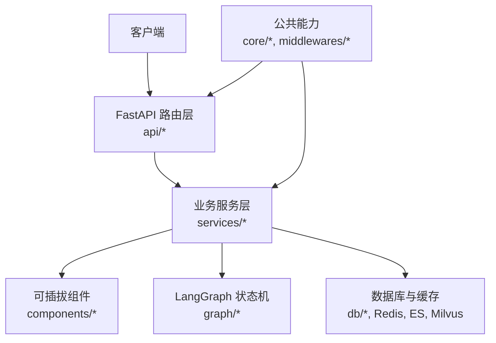
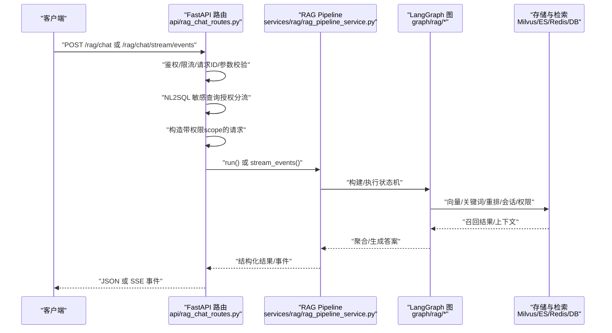
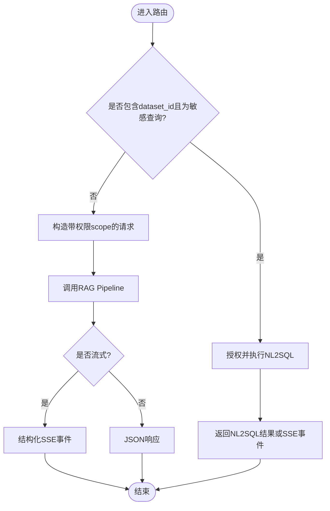
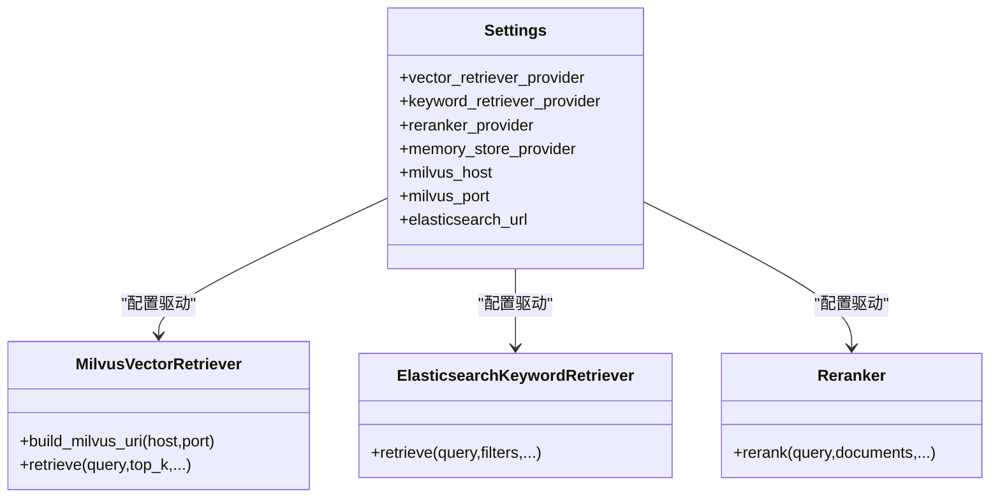
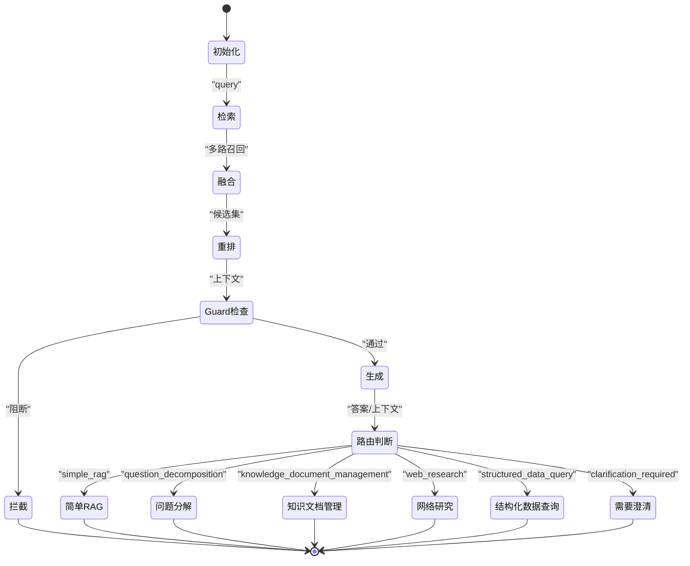
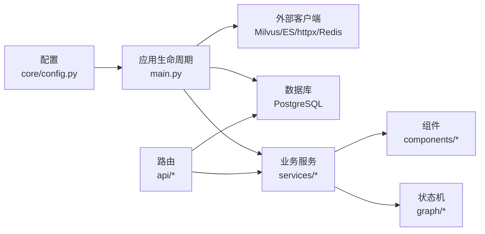

# 项目结构说明

<cite>
**本文引用的文件**
- [src/fast_app/main.py](file://python-agent-study/src/fast_app/main.py)
- [README.md](file://python-agent-study/README.md)
- [src/fast_app/api/rag_chat_routes.py](file://python-agent-study/src/fast_app/api/rag_chat_routes.py)
- [src/fast_app/api/rag_routes.py](file://python-agent-study/src/fast_app/api/rag_routes.py)
- [src/fast_app/core/config.py](file://python-agent-study/src/fast_app/core/config.py)
- [src/fast_app/services/rag/rag_pipeline_service.py](file://python-agent-study/src/fast_app/services/rag/rag_pipeline_service.py)
- [src/fast_app/graph/rag/rag_graph_builder.py](file://python-agent-study/src/fast_app/graph/rag/rag_graph_builder.py)
- [src/fast_app/graph/rag/rag_state.py](file://python-agent-study/src/fast_app/graph/rag/rag_state.py)
- [src/fast_app/components/retrievers/milvus_vector_retriever.py](file://python-agent-study/src/fast_app/components/retrievers/milvus_vector_retriever.py)
</cite>

## 目录
1. [简介](#简介)
2. [项目结构](#项目结构)
3. [核心组件](#核心组件)
4. [架构总览](#架构总览)
5. [详细组件分析](#详细组件分析)
6. [依赖关系分析](#依赖关系分析)
7. [性能与扩展性](#性能与扩展性)
8. [故障排查指南](#故障排查指南)
9. [结论](#结论)
10. [附录：接口契约与数据流向](#附录接口契约与数据流向)

## 简介
本项目是一个面向企业知识场景的 Python / FastAPI / LangGraph RAG Agent 后端。它通过统一的聊天入口，在普通 RAG、复杂 Research、知识文档管理、公开 Web 检索和受控 NL2SQL 之间进行结构化路由，并以 JSON 或 SSE 向客户端返回稳定状态。代码采用分层与模块化设计：api 层负责 HTTP 边界与路由；services 层组织业务逻辑；components 层提供可插拔的检索、嵌入、重排等能力；graph 层基于 LangGraph 实现状态机驱动的 Agent 主线流程。

## 项目结构
FastAPI 应用位于 src/fast_app，整体按职责划分：
- api：HTTP 路由、SSE 流式输出、请求校验与响应封装
- services：RAG、Agent、认证、会话、NL2SQL、Research、知识库等业务服务
- components：可替换的外部能力组件（向量检索、关键词检索、重排器、LLM、Embedding）
- graph：LangGraph 状态、节点与 Graph Builder，承载 RAG/Agent 主流程
- core：配置、日志、异常处理、请求上下文、LangSmith 集成
- db：SQLAlchemy 表定义、Session 管理与持久化边界
- domain：内部领域模型
- schemas：对外暴露的 Pydantic 模型
- ingestion：文档导入、切分、元数据与 ES/Milvus 写入
- integrations：GitLab 等企业系统集成
- evaluation：离线评测体系
- middlewares：请求 ID、大小限制等横切能力

图表来源
- [src/fast_app/main.py:132-170](file://python-agent-study/src/fast_app/main.py#L132-L170)
- [README.md:99-124](file://python-agent-study/README.md#L99-L124)

章节来源
- [README.md:99-124](file://python-agent-study/README.md#L99-L124)

## 核心组件
- 应用生命周期与中间件：在 lifespan 中创建并复用外部客户端（Milvus、Elasticsearch、httpx、Redis）、数据库引擎与 Session 工厂，并在关闭时统一释放资源。注册 CORS、请求大小限制、请求 ID 中间件与全局异常处理器。
- 路由装配：集中 include 健康检查、认证、RAG、流式、任务计划、知识导入、NL2SQL、GitLab、调试追踪等路由模块。
- 配置中心：Settings 集中管理环境变量、默认值、校验与验证方法，贯穿各层使用。
- 依赖注入：路由通过 Depends 获取用户上下文、数据库会话、RAG Pipeline、NL2SQL 服务等，避免硬编码实例。

章节来源
- [src/fast_app/main.py:41-129](file://python-agent-study/src/fast_app/main.py#L41-L129)
- [src/fast_app/main.py:132-170](file://python-agent-study/src/fast_app/main.py#L132-L170)
- [src/fast_app/core/config.py:18-200](file://python-agent-study/src/fast_app/core/config.py#L18-L200)

## 架构总览
从请求到响应的关键路径如下：
- 客户端发起 POST /rag/chat 或 /rag/chat/stream/events
- 路由层解析请求、注入用户上下文与依赖
- 对 NL2SQL 敏感查询进行前置授权与分流
- 构造带权限 scope 的内部请求
- 调用 RagPipeline 执行经典或 LangGraph/Agent 流程
- 将结果标注版本信息并返回 JSON 或结构化 SSE 事件

图表来源
- [src/fast_app/api/rag_chat_routes.py:47-156](file://python-agent-study/src/fast_app/api/rag_chat_routes.py#L47-L156)
- [src/fast_app/api/rag_chat_routes.py:277-311](file://python-agent-study/src/fast_app/api/rag_chat_routes.py#L277-L311)
- [src/fast_app/services/rag/rag_pipeline_service.py](file://python-agent-study/src/fast_app/services/rag/rag_pipeline_service.py)
- [src/fast_app/graph/rag/rag_graph_builder.py](file://python-agent-study/src/fast_app/graph/rag/rag_graph_builder.py)

## 详细组件分析

### API 层路由设计
- 非流式聊天：POST /rag/chat，返回完整答案、sources、request/trace ID，并对 NL2SQL 敏感查询做前置授权与直接返回。
- 结构化流式：POST /rag/chat/stream/events，以 SSE 推送 sources、answer_delta、guard 事件与 done，支持知识版本与过期检测。
- 兼容流式：POST /rag/chat/stream 已标记废弃，仅保留 token-only 兼容。
- 搜索接口：/rag/search、/rag/documents/{doc_id}、/rag/search/stream 提供基础检索能力。

图表来源
- [src/fast_app/api/rag_chat_routes.py:47-156](file://python-agent-study/src/fast_app/api/rag_chat_routes.py#L47-L156)
- [src/fast_app/api/rag_chat_routes.py:277-311](file://python-agent-study/src/fast_app/api/rag_chat_routes.py#L277-L311)
- [src/fast_app/api/rag_routes.py:14-63](file://python-agent-study/src/fast_app/api/rag_routes.py#L14-L63)

章节来源
- [src/fast_app/api/rag_chat_routes.py:47-156](file://python-agent-study/src/fast_app/api/rag_chat_routes.py#L47-L156)
- [src/fast_app/api/rag_chat_routes.py:277-311](file://python-agent-study/src/fast_app/api/rag_chat_routes.py#L277-L311)
- [src/fast_app/api/rag_routes.py:14-63](file://python-agent-study/src/fast_app/api/rag_routes.py#L14-L63)

### Services 层业务逻辑组织
- RAG Pipeline：封装 classic/langgraph/rag_agent 三种模式，提供 run() 与 stream_events()，统一处理检索、融合、重排、Guard、会话与权限。
- 会话与权限：构造 scoped 请求，绑定当前用户上下文、检索权限范围与知识版本。
- NL2SQL 服务：Dataset 授权、只读 SQL Policy、参数化查询与结果封装。
- Research/Agent：Planner/Reviewer/Validator、并行 Worker、证据聚合与预算收敛。
- 外部调用策略：统一超时、重试、降级与错误分类。

章节来源
- [src/fast_app/services/rag/rag_pipeline_service.py](file://python-agent-study/src/fast_app/services/rag/rag_pipeline_service.py)
- [src/fast_app/api/rag_chat_routes.py:84-134](file://python-agent-study/src/fast_app/api/rag_chat_routes.py#L84-L134)

### Components 层组件化设计
- 检索器：Milvus 向量检索、Elasticsearch 关键词检索、Mock 实现，便于本地开发与测试。
- 重排器：DashScope 重排、Mock 实现，支持可插拔替换。
- LLM/Embedding：Qwen 等模型客户端与 Mock，统一抽象接口。
- 启动期客户端：在 lifespan 中根据配置创建并复用 Milvus/Elasticsearch/httpx/Redis 客户端，降低连接开销。

图表来源
- [src/fast_app/core/config.py:54-81](file://python-agent-study/src/fast_app/core/config.py#L54-L81)
- [src/fast_app/components/retrievers/milvus_vector_retriever.py](file://python-agent-study/src/fast_app/components/retrievers/milvus_vector_retriever.py)

章节来源
- [src/fast_app/core/config.py:54-81](file://python-agent-study/src/fast_app/core/config.py#L54-L81)
- [src/fast_app/components/retrievers/milvus_vector_retriever.py](file://python-agent-study/src/fast_app/components/retrievers/milvus_vector_retriever.py)

### Graph 层 LangGraph 状态机实现
- 状态定义：集中描述 RAG/Agent 的状态字段，如 query、context、sources、route_intent、guard 结果等。
- 节点与边：检索、融合、重排、Guard、生成、路由判断等节点，条件边控制分支与循环终止。
- Graph Builder：根据配置选择 provider（classic/langgraph/rag_agent），组装状态机并执行。

图表来源
- [src/fast_app/graph/rag/rag_state.py](file://python-agent-study/src/fast_app/graph/rag/rag_state.py)
- [src/fast_app/graph/rag/rag_graph_builder.py](file://python-agent-study/src/fast_app/graph/rag/rag_graph_builder.py)

章节来源
- [src/fast_app/graph/rag/rag_state.py](file://python-agent-study/src/fast_app/graph/rag/rag_state.py)
- [src/fast_app/graph/rag/rag_graph_builder.py](file://python-agent-study/src/fast_app/graph/rag/rag_graph_builder.py)

## 依赖关系分析
- 应用启动依赖：
  - 配置：Settings 读取环境变量，提供 provider 开关与阈值
  - 客户端：Milvus、Elasticsearch、httpx、Redis、PostgreSQL 引擎与会话工厂
  - 服务：DeepDocumentRuntime、NL2SQL DatasetRegistry
- 路由依赖：
  - 用户上下文、数据库会话、RAG Pipeline、NL2SQL 服务
- 服务依赖：
  - 组件层：检索器、重排器、LLM、Embedding
  - 存储层：Milvus、ES、Redis、PostgreSQL
  - 图层：LangGraph 状态机

图表来源
- [src/fast_app/main.py:41-129](file://python-agent-study/src/fast_app/main.py#L41-L129)
- [src/fast_app/core/config.py:18-200](file://python-agent-study/src/fast_app/core/config.py#L18-L200)

章节来源
- [src/fast_app/main.py:41-129](file://python-agent-study/src/fast_app/main.py#L41-L129)
- [src/fast_app/core/config.py:18-200](file://python-agent-study/src/fast_app/core/config.py#L18-L200)

## 性能与扩展性
- 连接复用：在 lifespan 中创建并复用 Milvus、ES、httpx、Redis、数据库引擎，减少每次请求的连接开销。
- 流式输出：结构化 SSE 事件逐步推送 sources、增量答案与 guard 事件，提升前端体验与可观测性。
- 可插拔组件：通过配置切换 vector/keyword/reranker/memory 提供商，便于本地 mock 与生产真实服务。
- 阈值与降级：慢请求阈值、检索/重排/LLM 阈值、Prompt Guard 规则与 LLM 分类，支持降级与拦截。
- 扩展点：
  - 新增检索器/重排器：实现组件接口并在配置中启用
  - 新增 Graph 节点：在 graph/rag 中添加节点与边，调整状态机
  - 新增路由：在 api/ 下新建路由模块并在 main.py 中 include

[本节为通用指导，不直接分析具体文件]

## 故障排查指南
- 启动失败：检查环境变量与 Settings 校验，确认 Milvus/ES/Redis/PostgreSQL 可达；查看 lifespan 中的客户端创建日志。
- 无搜索结果：检查检索 provider 配置、索引与过滤条件；查看 /rag/search 与 /rag/search/stream 的错误码。
- 流式中断：关注 SSE 事件中的 error 事件与 done 事件；检查 Prompt Guard 是否拦截。
- 权限问题：确认用户上下文、RBAC/ACL 与知识版本；检查 knowledge_version 与 stale_doc_ids。
- NL2SQL 受限：敏感数据集需走专用授权链路；旧流式接口不支持 NL2SQL。

章节来源
- [src/fast_app/api/rag_routes.py:14-63](file://python-agent-study/src/fast_app/api/rag_routes.py#L14-L63)
- [src/fast_app/api/rag_chat_routes.py:277-311](file://python-agent-study/src/fast_app/api/rag_chat_routes.py#L277-L311)
- [src/fast_app/core/config.py:177-200](file://python-agent-study/src/fast_app/core/config.py#L177-L200)

## 结论
该项目以清晰的层次与模块化设计实现了企业级 RAG Agent 后端：api 层专注 HTTP 边界与路由；services 层组织业务逻辑与编排；components 层提供可插拔能力；graph 层用 LangGraph 显式表达 Agent 主线流程。通过配置驱动、依赖注入与统一生命周期管理，系统在可扩展性、可观测性与安全性方面具备良好基础。新开发者可据此快速定位职责边界、理解数据流向与扩展点。

[本节为总结，不直接分析具体文件]

## 附录：接口契约与数据流向
- 主要接口
  - GET /health：健康检查
  - POST /auth/login、/auth/refresh、/auth/me：认证与用户上下文
  - POST /rag/chat：非流式 RAG/Agent 主接口
  - POST /rag/chat/stream/events：结构化 SSE 主流式接口
  - POST /agent/task-plans/*：TaskPlan 状态、确认、取消、重试
  - POST /knowledge-documents/import-jobs/*：知识导入任务
  - GET /nl2sql/datasets、POST /nl2sql/query：受控 NL2SQL
  - POST /integrations/gitlab/webhooks/{source_id}：GitLab Webhook
  - POST /debug/rag/trace：内部调试接口
- 数据流向
  - 请求进入路由层，完成鉴权、限流与参数校验
  - 构造带权限 scope 的内部请求，必要时分流至 NL2SQL
  - 调用 RAG Pipeline，执行检索、融合、重排、Guard 与生成
  - 标注知识版本与过期文档，返回 JSON 或结构化 SSE 事件
  - 存储层：Milvus/ES 召回、Redis 会话窗口、PostgreSQL 会话与审计

章节来源
- [README.md:69-96](file://python-agent-study/README.md#L69-L96)
- [src/fast_app/api/rag_chat_routes.py:47-156](file://python-agent-study/src/fast_app/api/rag_chat_routes.py#L47-L156)
- [src/fast_app/api/rag_chat_routes.py:277-311](file://python-agent-study/src/fast_app/api/rag_chat_routes.py#L277-L311)