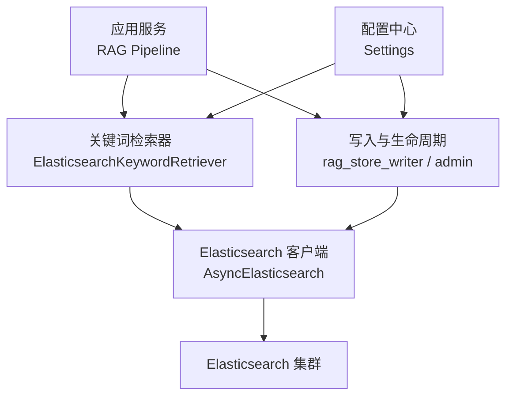
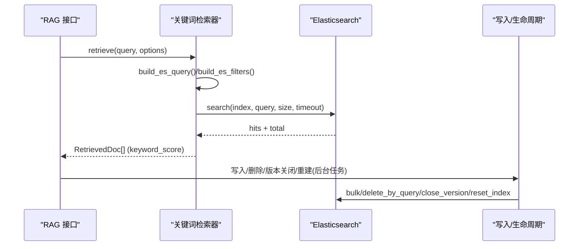
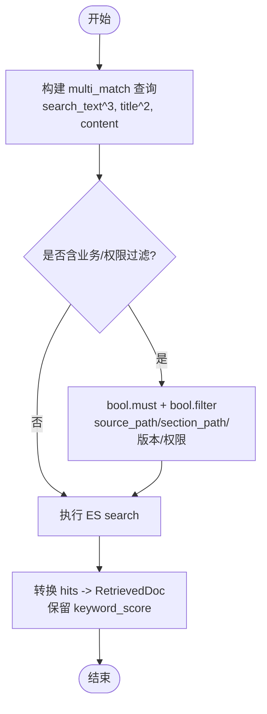
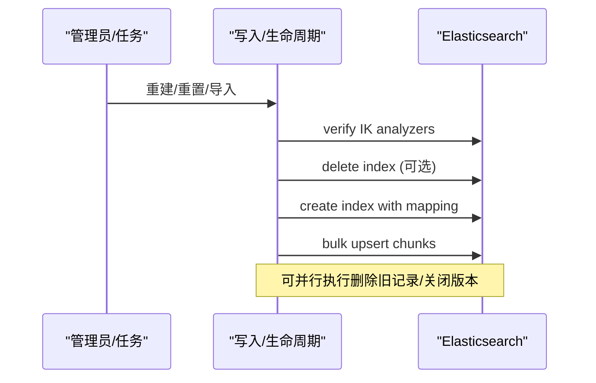
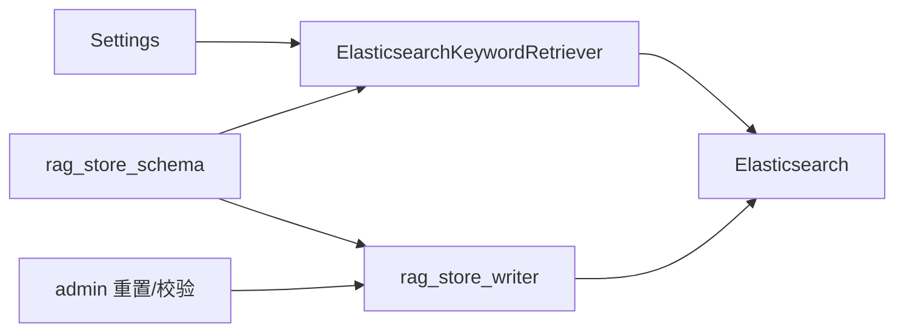

# Elasticsearch 索引设计

<cite>
**本文引用的文件**
- [rag_store_schema.py](file://python-agent-study/src/fast_app/ingestion/stores/rag_store_schema.py)
- [elasticsearch_keyword_retriever.py](file://python-agent-study/src/fast_app/components/retrievers/elasticsearch_keyword_retriever.py)
- [config.py](file://python-agent-study/src/fast_app/core/config.py)
- [ingest_elasticsearch_docs.py](file://python-agent-study/src/app/ingest_elasticsearch_docs.py)
- [rag_store_writer.py](file://python-agent-study/src/fast_app/ingestion/stores/rag_store_writer.py)
- [10-9-删除与重建index和collection的安全脚本.md](file://python-agent-study/learning-docs/phase-10/10-9-删除与重建index和collection的安全脚本.md)
- [test_gitlab_enterprise_sync.py](file://python-agent-study/scripts/tests/integrations/test_gitlab_enterprise_sync.py)
</cite>

## 目录
1. [简介](#简介)
2. [项目结构](#项目结构)
3. [核心组件](#核心组件)
4. [架构总览](#架构总览)
5. [详细组件分析](#详细组件分析)
6. [依赖关系分析](#依赖关系分析)
7. [性能考量](#性能考量)
8. [故障排查指南](#故障排查指南)
9. [结论](#结论)
10. [附录](#附录)

## 简介
本文件面向搜索引擎开发者，系统化说明本项目中 Elasticsearch 的索引设计、分词器配置、查询优化策略、文档映射、字段类型选择与分析器配置；并覆盖混合检索中的关键词匹配、全文搜索与聚合查询实现；同时给出索引生命周期管理、数据同步机制、性能调优参数、查询性能分析与索引维护、故障排查指导。

## 项目结构
围绕 Elasticsearch 的关键代码集中在以下位置：
- 索引与映射定义：存储层 schema 模块集中定义了 ES 字段、分析器、索引设置与 mapping。
- 关键词检索器：封装了 ES 查询构造、权限下推过滤、结果转换与日志埋点。
- 配置中心：ES 连接、超时、默认 top_k、慢检索阈值等运行期参数。
- 写入与生命周期：批量写入、按 doc_id 删除、版本关闭旧记录、索引重建流程。
- 示例与测试：演示建索引、批量写入、冒烟搜索；集成测试验证字段契约与聚合能力。

图表来源
- [elasticsearch_keyword_retriever.py:210-266](file://python-agent-study/src/fast_app/components/retrievers/elasticsearch_keyword_retriever.py#L210-L266)
- [rag_store_writer.py:1-56](file://python-agent-study/src/fast_app/ingestion/stores/rag_store_writer.py#L1-L56)
- [config.py:71-82](file://python-agent-study/src/fast_app/core/config.py#L71-L82)

章节来源
- [rag_store_schema.py:71-140](file://python-agent-study/src/fast_app/ingestion/stores/rag_store_schema.py#L71-L140)
- [elasticsearch_keyword_retriever.py:176-207](file://python-agent-study/src/fast_app/components/retrievers/elasticsearch_keyword_retriever.py#L176-L207)
- [config.py:71-82](file://python-agent-study/src/fast_app/core/config.py#L71-L82)

## 核心组件
- 索引与映射
  - 文本字段使用 ik_max_word 作为索引分析器，ik_smart 作为搜索分析器，支持 keyword 多字段用于精确匹配或排序。
  - metadata 子对象包含路径、可见性、部门、用户、哈希、计数等丰富维度，便于权限与范围过滤。
  - 索引设置采用单分片、零副本，适合开发/测试环境；生产可按规模调整。
- 关键词检索器
  - 通过 multi_match 对标题、搜索文本、正文加权召回，结合 bool.filter 进行业务与权限过滤。
  - 将 ES hits 转换为统一 RetrievedDoc，保留 keyword_score 供后续 RRF/重排使用。
- 配置
  - ES URL、索引名、请求超时、慢检索阈值等通过 Settings 注入，便于环境与容量治理。
- 写入与生命周期
  - 提供批量 upsert、按 doc_id 删除、版本关闭旧记录、索引重建与校验 IK 分析器等能力。

章节来源
- [rag_store_schema.py:58-140](file://python-agent-study/src/fast_app/ingestion/stores/rag_store_schema.py#L58-L140)
- [elasticsearch_keyword_retriever.py:47-207](file://python-agent-study/src/fast_app/components/retrievers/elasticsearch_keyword_retriever.py#L47-L207)
- [config.py:71-82](file://python-agent-study/src/fast_app/core/config.py#L71-L82)
- [rag_store_writer.py:391-429](file://python-agent-study/src/fast_app/ingestion/stores/rag_store_writer.py#L391-L429)

## 架构总览
下图展示从 API 到 ES 的关键词检索链路，以及写入与生命周期管理如何协同工作。

图表来源
- [elasticsearch_keyword_retriever.py:227-309](file://python-agent-study/src/fast_app/components/retrievers/elasticsearch_keyword_retriever.py#L227-L309)
- [rag_store_writer.py:391-429](file://python-agent-study/src/fast_app/ingestion/stores/rag_store_writer.py#L391-L429)
- [10-9-删除与重建index和collection的安全脚本.md:362-432](file://python-agent-study/learning-docs/phase-10/10-9-删除与重建index和collection的安全脚本.md#L362-L432)

## 详细组件分析

### 索引结构与字段类型
- 文本字段
  - content/search_text：text 类型，索引分析器 ik_max_word，搜索分析器 ik_smart，利于中文分词召回。
  - title：text 类型且带 keyword 多字段，既支持全文也支持精确匹配/排序。
- 标识与关联
  - id/doc_id/logical_record_id/source_id/source_revision/record_type/parent_id 等均为 keyword，用于精确路由、去重与父子关系。
- 元数据 metadata
  - source_path/section_path/document_type/visibility/allowed_departments/allowed_users 等用于权限与范围过滤。
  - 增量与一致性相关：content_hash/index_hash/identity_key/builder_schema_version/embedding_fingerprint/file_name/file_extension 等。
  - 统计与定位：token_count/char_count/line_start/line_end/chunk_strategy_version/heading_level/section_index/chunk_index/record_type/parent_index/child_index。
- 时间戳
  - created_at 为 date 类型，便于审计与过期策略。

章节来源
- [rag_store_schema.py:78-133](file://python-agent-study/src/fast_app/ingestion/stores/rag_store_schema.py#L78-L133)

### 分词器配置与分析器
- 索引分析器：ik_max_word，细粒度切分，提升召回覆盖率。
- 搜索分析器：ik_smart，适度切分，兼顾速度与相关性。
- 文本字段在创建时绑定上述分析器，title 额外提供 keyword 子字段以支持精确匹配。

章节来源
- [rag_store_schema.py:58-68](file://python-agent-study/src/fast_app/ingestion/stores/rag_store_schema.py#L58-L68)
- [rag_store_schema.py:71-75](file://python-agent-study/src/fast_app/ingestion/stores/rag_store_schema.py#L71-L75)

### 查询构建与优化策略
- 多字段加权召回
  - multi_match 对 search_text^3、title^2、content 加权，提高标题命中权重。
- 过滤下推
  - 使用 bool.filter 承载 source_path、section_path、知识版本窗口、权限条件，不参与评分，保证硬约束。
- 父块排除
  - must_not 排除 markdown_parent，避免父块参与初始召回，仅做命中后上下文扩展。
- 权限过滤
  - 根据 can_read_all、public、allowed_departments、allowed_users 生成 should 组合，最小匹配为 1，无权限时返回“必不命中”条件。
- 版本窗口
  - valid_from_version <= version 且 (valid_to_version == 0 或 > version)，实现知识快照读取。

图表来源
- [elasticsearch_keyword_retriever.py:176-207](file://python-agent-study/src/fast_app/components/retrievers/elasticsearch_keyword_retriever.py#L176-L207)
- [elasticsearch_keyword_retriever.py:47-133](file://python-agent-study/src/fast_app/components/retrievers/elasticsearch_keyword_retriever.py#L47-L133)

章节来源
- [elasticsearch_keyword_retriever.py:176-207](file://python-agent-study/src/fast_app/components/retrievers/elasticsearch_keyword_retriever.py#L176-L207)
- [elasticsearch_keyword_retriever.py:47-133](file://python-agent-study/src/fast_app/components/retrievers/elasticsearch_keyword_retriever.py#L47-L133)

### 混合检索中的关键词匹配、全文搜索与聚合
- 关键词匹配
  - 通过 multi_match 与 IK 分词实现中文关键词召回，配合 filter 完成权限与范围裁剪。
- 全文搜索
  - text 字段由 IK 分词建立倒排索引，支持短语与模糊语义（视具体查询体）。
- 聚合查询
  - 集成测试中使用 terms 聚合统计 record_type 分布，可用于健康检查与数据质量评估。

章节来源
- [test_gitlab_enterprise_sync.py:246-271](file://python-agent-study/scripts/tests/integrations/test_gitlab_enterprise_sync.py#L246-L271)

### 索引生命周期管理与数据同步
- 索引创建与校验
  - 示例脚本按需创建索引并写入 demo 数据；生产建议先校验 IK 分析器再操作。
- 批量写入
  - 使用 async_bulk 批量 upsert，确保吞吐与幂等。
- 删除与版本关闭
  - 按 doc_id 批量删除；通过 valid_to_version 关闭旧记录，保留历史快照供冻结版本读取。
- 重建与重置
  - 提供 reset_es_index 流程：确认后再删除并重建 mapping，保障 schema 变更安全。

图表来源
- [ingest_elasticsearch_docs.py:45-60](file://python-agent-study/src/app/ingest_elasticsearch_docs.py#L45-L60)
- [rag_store_writer.py:391-429](file://python-agent-study/src/fast_app/ingestion/stores/rag_store_writer.py#L391-L429)
- [10-9-删除与重建index和collection的安全脚本.md:362-432](file://python-agent-study/learning-docs/phase-10/10-9-删除与重建index和collection的安全脚本.md#L362-L432)

章节来源
- [ingest_elasticsearch_docs.py:12-60](file://python-agent-study/src/app/ingest_elasticsearch_docs.py#L12-L60)
- [rag_store_writer.py:391-429](file://python-agent-study/src/fast_app/ingestion/stores/rag_store_writer.py#L391-L429)
- [10-9-删除与重建index和collection的安全脚本.md:362-432](file://python-agent-study/learning-docs/phase-10/10-9-删除与重建index和collection的安全脚本.md#L362-L432)

### 配置项与运行时参数
- ES 连接与索引
  - elasticsearch_url、elasticsearch_index_name、用户名密码（可选）。
- 超时与慢检索
  - elasticsearch_request_timeout、slow_retrieval_threshold_ms，用于保护主链路不被慢查询拖垮。
- 检索规模
  - rag_default_top_k、rag_default_min_score，控制候选集大小与最低分数门槛。

章节来源
- [config.py:71-82](file://python-agent-study/src/fast_app/core/config.py#L71-L82)
- [config.py:41-55](file://python-agent-study/src/fast_app/core/config.py#L41-L55)
- [config.py:628-632](file://python-agent-study/src/fast_app/core/config.py#L628-L632)

## 依赖关系分析
- 检索器依赖
  - 依赖 Settings 获取 ES 地址、索引名、超时与阈值。
  - 依赖 rag_store_schema 常量与 mapping 构建函数，保证字段命名一致。
- 写入与生命周期依赖
  - 依赖 admin 层的 reset_es_index 与 verify_es_ik_analyzers，确保 schema 与分词器正确。
  - 依赖 async_bulk 与 delete_by_query 完成高效写入与删除。

图表来源
- [elasticsearch_keyword_retriever.py:210-266](file://python-agent-study/src/fast_app/components/retrievers/elasticsearch_keyword_retriever.py#L210-L266)
- [rag_store_writer.py:1-56](file://python-agent-study/src/fast_app/ingestion/stores/rag_store_writer.py#L1-L56)

章节来源
- [elasticsearch_keyword_retriever.py:210-266](file://python-agent-study/src/fast_app/components/retrievers/elasticsearch_keyword_retriever.py#L210-L266)
- [rag_store_writer.py:1-56](file://python-agent-study/src/fast_app/ingestion/stores/rag_store_writer.py#L1-L56)

## 性能考量
- 分词器选择
  - 索引 ik_max_word 提升召回率；搜索 ik_smart 平衡速度与精度。
- 查询优化
  - 使用 bool.filter 承载硬约束，不参与评分，减少计算开销。
  - 多字段加权 multi_match 提升标题命中权重，减少无关召回。
- 并发与超时
  - 异步客户端与批量写入提升吞吐；请求级超时防止长尾阻塞。
- 索引设置
  - 当前单分片零副本适合开发；生产需按数据量与 QPS 调整分片与副本数。
- 监控与告警
  - 记录 hit_count、total_value、skipped_hit_count、latency_ms，配合慢检索阈值告警。

章节来源
- [rag_store_schema.py:71-75](file://python-agent-study/src/fast_app/ingestion/stores/rag_store_schema.py#L71-L75)
- [elasticsearch_keyword_retriever.py:240-309](file://python-agent-study/src/fast_app/components/retrievers/elasticsearch_keyword_retriever.py#L240-L309)
- [config.py:41-55](file://python-agent-study/src/fast_app/core/config.py#L41-L55)
- [config.py:628-632](file://python-agent-study/src/fast_app/core/config.py#L628-L632)

## 故障排查指南
- 中文关键词召回不佳
  - 检查 IK 分析器是否正确安装与生效；确认搜索分析器为 ik_smart。
  - 核对 multi_match 字段与权重；必要时调整字段权重或增加同义词。
- 权限过滤导致无结果
  - 检查 metadata.visibility、allowed_departments、allowed_users 是否与当前用户上下文匹配。
  - 确认 can_read_all 与 department_codes/user_id 是否正确传入。
- 脏数据或缺少关键字段
  - 关注 skipped_hit_count；若出现 missing_id_or_content，需修复写入逻辑或清洗数据。
- 版本窗口问题
  - 检查 valid_from_version/valid_to_version 是否符合预期；确认知识版本切换已正确关闭旧记录。
- 慢查询与超时
  - 观察 latency_ms 与 slow_retrieval_threshold_ms；必要时缩小 candidate_k、精简 filter 或优化索引。

章节来源
- [elasticsearch_keyword_retriever.py:47-133](file://python-agent-study/src/fast_app/components/retrievers/elasticsearch_keyword_retriever.py#L47-L133)
- [elasticsearch_keyword_retriever.py:347-398](file://python-agent-study/src/fast_app/components/retrievers/elasticsearch_keyword_retriever.py#L347-L398)
- [rag_store_writer.py:391-429](file://python-agent-study/src/fast_app/ingestion/stores/rag_store_writer.py#L391-L429)

## 结论
本项目围绕 IK 分词的中文关键词检索构建了稳健的 ES 索引与查询体系：通过 multi_match 加权召回、bool.filter 权限与范围下推、版本窗口与权限模型，实现了高可用、可扩展的知识检索能力。写入与生命周期管理提供了安全的重建、批量写入与版本治理能力。配合配置化超时与慢检索阈值，可在不同规模环境下稳定运行。

## 附录
- 快速上手
  - 使用示例脚本创建索引、批量写入 demo 数据并进行冒烟搜索。
- 生产建议
  - 根据数据量与 QPS 调整分片与副本；开启只读副本提升查询吞吐；定期巡检 IK 分词与 mapping 一致性。
- 评测与回归
  - 使用聚合查询与指标评估召回质量；结合日志与 trace 持续优化查询体与索引结构。