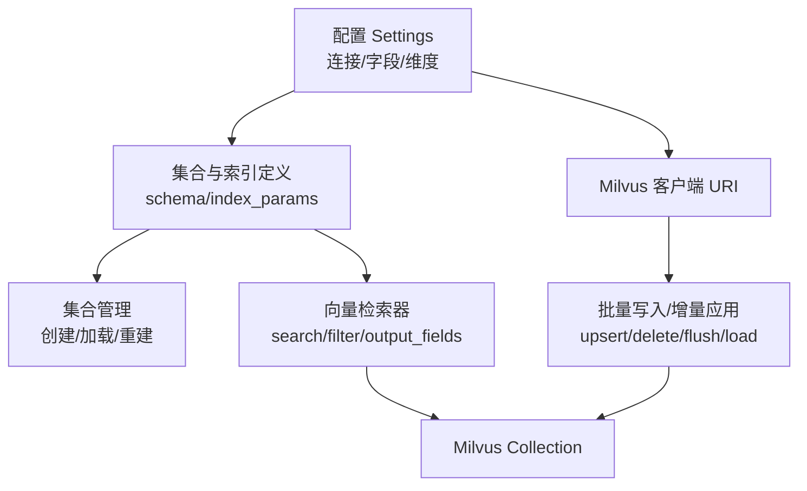
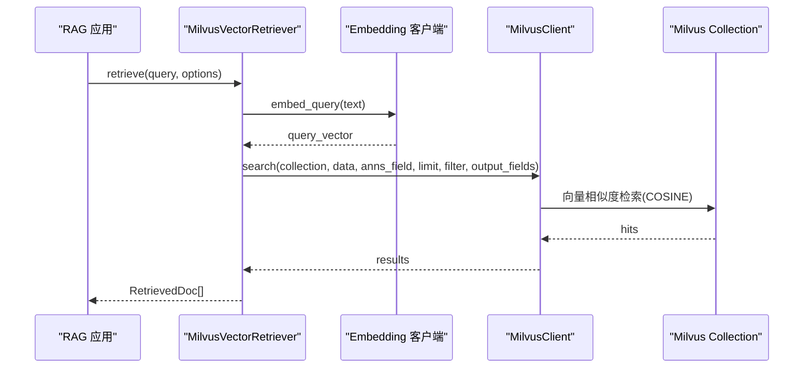
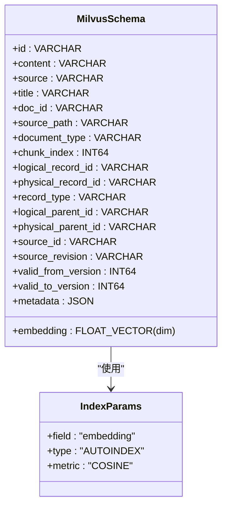
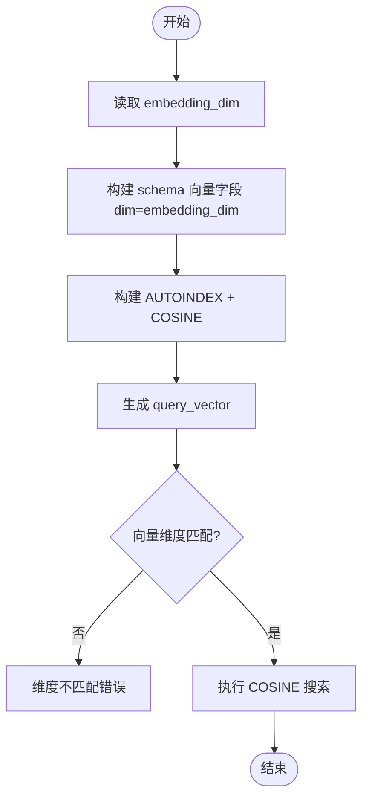
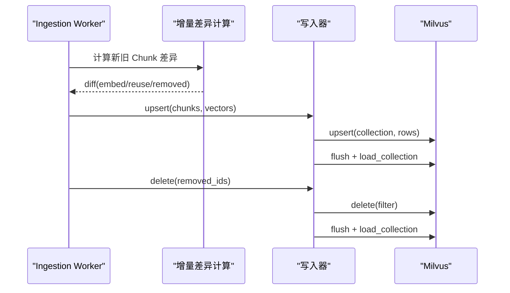
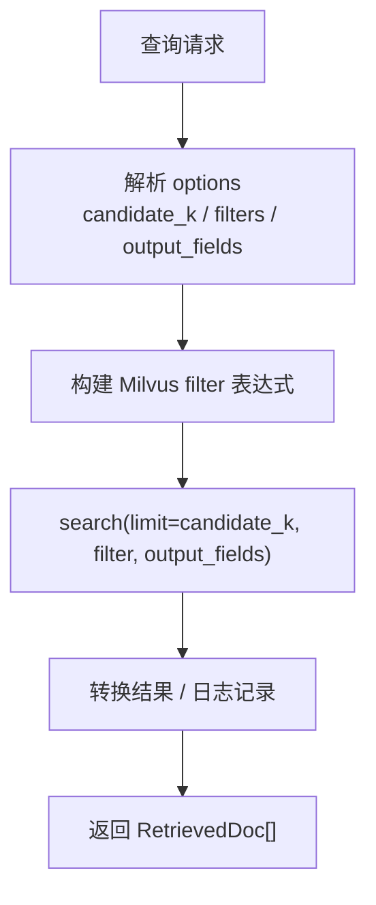
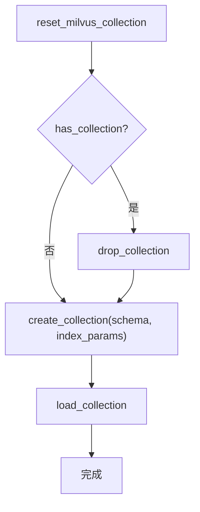
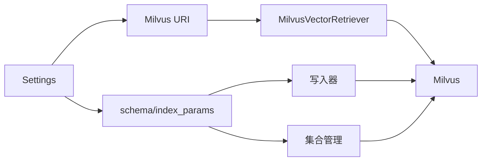

# Milvus 向量存储

<cite>
**本文引用的文件**
- [rag_store_schema.py](file://python-agent-study/src/fast_app/ingestion/stores/rag_store_schema.py)
- [milvus_vector_retriever.py](file://python-agent-study/src/fast_app/components/retrievers/milvus_vector_retriever.py)
- [config.py](file://python-agent-study/src/fast_app/core/config.py)
- [rag_store_admin.py](file://python-agent-study/src/fast_app/ingestion/stores/rag_store_admin.py)
- [rag_store_writer.py](file://python-agent-study/src/fast_app/ingestion/stores/rag_store_writer.py)
- [incremental_store.py](file://python-agent-study/src/fast_app/ingestion/stores/incremental_store.py)
- [cli.py](file://python-agent-study/src/fast_app/ingestion/cli.py)
- [9-7-Milvus ES查询参数显式化.md](file://python-agent-study/learning-docs/phase-9/9-7-Milvus ES查询参数显式化.md)
- [10-7-Milvus与ES双写流程.md](file://python-agent-study/learning-docs/phase-10/10-7-Milvus与ES双写流程.md)
- [10-9-删除与重建index和collection的安全脚本.md](file://python-agent-study/learning-docs/phase-10/10-9-删除与重建index和collection的安全脚本.md)
- [自定义vector函数.md](file://python-agent-study/learning-docs/phase-10/自定义vector函数.md)
- [rebuild_rag_demo_stores.py](file://python-agent-study/scripts/rebuild_rag_demo_stores.py)
</cite>

## 目录
1. [简介](#简介)
2. [项目结构](#项目结构)
3. [核心组件](#核心组件)
4. [架构总览](#架构总览)
5. [详细组件分析](#详细组件分析)
6. [依赖关系分析](#依赖关系分析)
7. [性能与调优](#性能与调优)
8. [故障排查指南](#故障排查指南)
9. [结论](#结论)
10. [附录](#附录)

## 简介
本文件面向 RAG 系统开发者，系统化说明仓库中 Milvus 向量存储的使用方式，包括集合结构设计、索引构建、查询优化、元数据存储设计、批量插入与增量更新机制、数据一致性保证、分片与副本策略建议、性能调优参数、检索最佳实践、查询性能监控与存储空间管理。文档严格基于代码库中的实现与学习文档进行归纳，避免臆测未实现的特性。

## 项目结构
Milvus 相关能力分布在 ingestion（写入与重建）、components/retrievers（检索）、core/config（配置）、以及若干学习与测试脚本中：
- 集合与索引定义：[rag_store_schema.py](file://python-agent-study/src/fast_app/ingestion/stores/rag_store_schema.py)
- 向量检索器：[milvus_vector_retriever.py](file://python-agent-study/src/fast_app/components/retrievers/milvus_vector_retriever.py)
- 配置项（连接、字段名、维度等）：[config.py](file://python-agent-study/src/fast_app/core/config.py)
- 集合管理与重建：[rag_store_admin.py](file://python-agent-study/src/fast_app/ingestion/stores/rag_store_admin.py)
- 批量 upsert、删除、版本关闭：[rag_store_writer.py](file://python-agent-study/src/fast_app/ingestion/stores/rag_store_writer.py)
- 增量差异计算与应用：[incremental_store.py](file://python-agent-study/src/fast_app/ingestion/stores/incremental_store.py)
- CLI 客户端构造：[cli.py](file://python-agent-study/src/fast_app/ingestion/cli.py)
- 查询参数显式化与过滤表达式：[9-7-Milvus ES查询参数显式化.md](file://python-agent-study/learning-docs/phase-9/9-7-Milvus ES查询参数显式化.md)
- 双写与重建策略说明：[10-7-Milvus与ES双写流程.md](file://python-agent-study/learning-docs/phase-10/10-7-Milvus与ES双写流程.md)
- 安全删除与重建入口：[10-9-删除与重建index和collection的安全脚本.md](file://python-agent-study/learning-docs/phase-10/10-9-删除与重建index和collection的安全脚本.md)
- Mock 向量生成与维度约定：[自定义vector函数.md](file://python-agent-study/learning-docs/phase-10/自定义vector函数.md)
- 演示脚本创建集合与索引：[rebuild_rag_demo_stores.py](file://python-agent-study/scripts/rebuild_rag_demo_stores.py)



**图表来源**
- [config.py:58-68](file://python-agent-study/src/fast_app/core/config.py#L58-L68)
- [rag_store_schema.py:147-279](file://python-agent-study/src/fast_app/ingestion/stores/rag_store_schema.py#L147-L279)
- [cli.py:75-76](file://python-agent-study/src/fast_app/ingestion/cli.py#L75-L76)
- [rag_store_admin.py:95-129](file://python-agent-study/src/fast_app/ingestion/stores/rag_store_admin.py#L95-L129)
- [rag_store_writer.py:575-616](file://python-agent-study/src/fast_app/ingestion/stores/rag_store_writer.py#L575-L616)
- [milvus_vector_retriever.py:155-269](file://python-agent-study/src/fast_app/components/retrievers/milvus_vector_retriever.py#L155-L269)

**章节来源**
- [config.py:58-68](file://python-agent-study/src/fast_app/core/config.py#L58-L68)
- [rag_store_schema.py:147-279](file://python-agent-study/src/fast_app/ingestion/stores/rag_store_schema.py#L147-L279)
- [cli.py:75-76](file://python-agent-study/src/fast_app/ingestion/cli.py#L75-L76)
- [rag_store_admin.py:95-129](file://python-agent-study/src/fast_app/ingestion/stores/rag_store_admin.py#L95-L129)
- [rag_store_writer.py:575-616](file://python-agent-study/src/fast_app/ingestion/stores/rag_store_writer.py#L575-L616)
- [milvus_vector_retriever.py:155-269](file://python-agent-study/src/fast_app/components/retrievers/milvus_vector_retriever.py#L155-L269)

## 核心组件
- 集合与索引定义：集中维护 Milvus 的字段类型、主键、向量字段维度、内容字段、元数据 JSON 字段及 AUTOINDEX + COSINE 相似度索引。
- 向量检索器：将查询文本转为向量后执行 search，支持 filter 表达式与 output_fields 控制，返回统一文档对象。
- 写入与增量：提供 upsert、按 doc_id 删除、版本关闭、flush 与 load_collection 等操作；增量阶段通过差异计算复用旧向量或重新嵌入。
- 配置与客户端：从 Settings 读取 Milvus 主机端口、集合名、字段名、embedding 维度；CLI 构造 Milvus URI。
- 管理操作：提供重置/重建 collection 的统一入口，包含 drop、create、load 流程。

**章节来源**
- [rag_store_schema.py:147-279](file://python-agent-study/src/fast_app/ingestion/stores/rag_store_schema.py#L147-L279)
- [milvus_vector_retriever.py:155-269](file://python-agent-study/src/fast_app/components/retrievers/milvus_vector_retriever.py#L155-L269)
- [rag_store_writer.py:575-616](file://python-agent-study/src/fast_app/ingestion/stores/rag_store_writer.py#L575-L616)
- [incremental_store.py:148-225](file://python-agent-study/src/fast_app/ingestion/stores/incremental_store.py#L148-L225)
- [config.py:58-68](file://python-agent-study/src/fast_app/core/config.py#L58-L68)
- [cli.py:75-76](file://python-agent-study/src/fast_app/ingestion/cli.py#L75-L76)
- [rag_store_admin.py:95-129](file://python-agent-study/src/fast_app/ingestion/stores/rag_store_admin.py#L95-L129)

## 架构总览
下图展示了 Milvus 在 RAG 链路中的位置：配置驱动集合与索引，写入端负责批量 upsert 与增量修复，检索端负责向量召回与过滤，最终输出给上层 RAG Pipeline。



**图表来源**
- [milvus_vector_retriever.py:182-269](file://python-agent-study/src/fast_app/components/retrievers/milvus_vector_retriever.py#L182-L269)
- [rag_store_schema.py:271-279](file://python-agent-study/src/fast_app/ingestion/stores/rag_store_schema.py#L271-L279)

## 详细组件分析

### 集合结构与索引
- 主键字段：VARCHAR，长度限制用于稳定 ID。
- 向量字段：FLOAT_VECTOR，维度来自 embedding_dim。
- 内容字段：VARCHAR，最大长度限制。
- 元数据字段：JSON，承载 source/title/doc_id/source_path/document_type/chunk_index/parent_ids/source_id/source_revision/version 范围等。
- 索引：AUTOINDEX，度量 COSINE。



**图表来源**
- [rag_store_schema.py:147-245](file://python-agent-study/src/fast_app/ingestion/stores/rag_store_schema.py#L147-L245)
- [rag_store_schema.py:271-279](file://python-agent-study/src/fast_app/ingestion/stores/rag_store_schema.py#L271-L279)

**章节来源**
- [rag_store_schema.py:147-245](file://python-agent-study/src/fast_app/ingestion/stores/rag_store_schema.py#L147-L245)
- [rag_store_schema.py:271-279](file://python-agent-study/src/fast_app/ingestion/stores/rag_store_schema.py#L271-L279)

### 向量维度选择与相似度算法
- 维度：由 embedding_dim 决定，默认值在配置中给出；Mock 向量客户端也遵循该维度以保持一致性。
- 相似度：索引与检索均使用 COSINE；检索时 search_params 显式指定 metric_type=COSINE。
- 维度校验：检索前会校验向量维度，确保与集合 schema 一致。



**图表来源**
- [config.py:597-603](file://python-agent-study/src/fast_app/core/config.py#L597-L603)
- [rag_store_schema.py:159-163](file://python-agent-study/src/fast_app/ingestion/stores/rag_store_schema.py#L159-L163)
- [rag_store_schema.py:271-279](file://python-agent-study/src/fast_app/ingestion/stores/rag_store_schema.py#L271-L279)
- [milvus_vector_retriever.py:253-265](file://python-agent-study/src/fast_app/components/retrievers/milvus_vector_retriever.py#L253-L265)

**章节来源**
- [config.py:597-603](file://python-agent-study/src/fast_app/core/config.py#L597-L603)
- [rag_store_schema.py:159-163](file://python-agent-study/src/fast_app/ingestion/stores/rag_store_schema.py#L159-L163)
- [rag_store_schema.py:271-279](file://python-agent-study/src/fast_app/ingestion/stores/rag_store_schema.py#L271-L279)
- [milvus_vector_retriever.py:253-265](file://python-agent-study/src/fast_app/components/retrievers/milvus_vector_retriever.py#L253-L265)

### 元数据存储设计
- 使用 JSON 字段集中存储丰富的上下文信息，如来源、标题、文档标识、路径、类型、块索引、父子关系、版本区间等。
- 输出字段列表明确限定，减少网络传输与解析开销。
- 与 ES 映射对齐，便于双写与对账。

```mermaid
erDiagram
CHUNK {
string id PK
float vector embedding
string content
string source
string title
string doc_id
string source_path
string document_type
int chunk_index
string logical_record_id
string physical_record_id
string record_type
string logical_parent_id
string physical_parent_id
string source_id
string source_revision
int valid_from_version
int valid_to_version
json metadata
}
```

**图表来源**
- [rag_store_schema.py:147-245](file://python-agent-study/src/fast_app/ingestion/stores/rag_store_schema.py#L147-L245)

**章节来源**
- [rag_store_schema.py:147-245](file://python-agent-study/src/fast_app/ingestion/stores/rag_store_schema.py#L147-L245)

### 批量插入与增量更新
- 批量 upsert：通过 upsert_milvus_collection 将 chunks 与 vectors 批量写入，随后 flush 并 load_collection。
- 增量差异：比较 ES/Milvus 状态，复用已有向量或仅重新嵌入变化部分；再统一 upsert 与删除。
- 版本关闭：为旧子块设置 valid_to_version，配合查询条件过滤出当前有效版本。
- 删除：按 doc_id 或 chunk_id 批量删除，并 flush/load。



**图表来源**
- [incremental_store.py:148-225](file://python-agent-study/src/fast_app/ingestion/stores/incremental_store.py#L148-L225)
- [rag_store_writer.py:575-616](file://python-agent-study/src/fast_app/ingestion/stores/rag_store_writer.py#L575-L616)
- [rag_store_writer.py:619-681](file://python-agent-study/src/fast_app/ingestion/stores/rag_store_writer.py#L619-L681)

**章节来源**
- [incremental_store.py:148-225](file://python-agent-study/src/fast_app/ingestion/stores/incremental_store.py#L148-L225)
- [rag_store_writer.py:575-616](file://python-agent-study/src/fast_app/ingestion/stores/rag_store_writer.py#L575-L616)
- [rag_store_writer.py:619-681](file://python-agent-study/src/fast_app/ingestion/stores/rag_store_writer.py#L619-L681)

### 查询优化策略
- 显式 top_k/candidate_k：检索 limit 来自选项而非硬编码，便于按请求调整候选集大小。
- 过滤表达式：通过 metadata 字段构建 filter，将权限、来源、段落路径等约束下推到 Milvus 召回阶段，减少无效结果。
- 输出字段控制：只返回必要字段，降低传输与序列化成本。
- 日志与追踪：记录 metric_type、limit、filter_expr、output_fields、命中数等，便于定位慢查询与召回问题。



**图表来源**
- [9-7-Milvus ES查询参数显式化.md:557-612](file://python-agent-study/learning-docs/phase-9/9-7-Milvus ES查询参数显式化.md#L557-L612)
- [milvus_vector_retriever.py:239-269](file://python-agent-study/src/fast_app/components/retrievers/milvus_vector_retriever.py#L239-L269)

**章节来源**
- [9-7-Milvus ES查询参数显式化.md:557-612](file://python-agent-study/learning-docs/phase-9/9-7-Milvus ES查询参数显式化.md#L557-L612)
- [milvus_vector_retriever.py:239-269](file://python-agent-study/src/fast_app/components/retrievers/milvus_vector_retriever.py#L239-L269)

### 集合管理与重建
- 安全入口：提供 reset_milvus_collection，支持存在性检查、drop、create、load。
- 重建策略：当前 ingestion 写入模式默认为 recreate，即删除重建；后续阶段引入幂等 upsert 与 replace_docs。
- 演示脚本：独立脚本可创建集合与索引，便于本地验证。



**图表来源**
- [rag_store_admin.py:95-129](file://python-agent-study/src/fast_app/ingestion/stores/rag_store_admin.py#L95-L129)
- [10-7-Milvus与ES双写流程.md:662-689](file://python-agent-study/learning-docs/phase-10/10-7-Milvus与ES双写流程.md#L662-L689)
- [rebuild_rag_demo_stores.py:272-319](file://python-agent-study/scripts/rebuild_rag_demo_stores.py#L272-L319)

**章节来源**
- [rag_store_admin.py:95-129](file://python-agent-study/src/fast_app/ingestion/stores/rag_store_admin.py#L95-L129)
- [10-7-Milvus与ES双写流程.md:662-689](file://python-agent-study/learning-docs/phase-10/10-7-Milvus与ES双写流程.md#L662-L689)
- [rebuild_rag_demo_stores.py:272-319](file://python-agent-study/scripts/rebuild_rag_demo_stores.py#L272-L319)

### 数据一致性保证
- 双写与对账：ES 与 Milvus 同时写入，测试中对齐 Chunk ID、content_hash、index_hash 等关键属性，确保两边一致。
- 增量修复：当发现单边缺失或版本不一致时，通过差异计算与 apply_chunk_diff 修复。
- 版本区间：通过 valid_from_version 与 valid_to_version 控制可见性，查询时过滤当前有效版本。

**章节来源**
- [10-7-Milvus与ES双写流程.md:662-689](file://python-agent-study/learning-docs/phase-10/10-7-Milvus与ES双写流程.md#L662-L689)
- [incremental_store.py:148-225](file://python-agent-study/src/fast_app/ingestion/stores/incremental_store.py#L148-L225)
- [rag_store_writer.py:619-681](file://python-agent-study/src/fast_app/ingestion/stores/rag_store_writer.py#L619-L681)

### 分片策略、副本配置与性能调优参数
- 分片与副本：当前代码未直接暴露 Milvus 的分片与副本参数；ES 侧 settings 显示 number_of_shards=1、number_of_replicas=0，适用于学习场景。Milvus 集群部署的分片与副本需结合部署配置与运维策略设定。
- 性能调优参数（代码层面）：
  - candidate_k/top_k：控制候选集大小，影响召回质量与延迟。
  - output_fields：仅返回必要字段，降低传输与解析开销。
  - filter：将权限、来源、段落路径等约束下推至 Milvus 召回阶段，减少无效结果。
  - flush/load_collection：写入后刷新并加载集合，确保查询可见性与性能。
  - 超时与重试：外部调用超时、重试次数等配置可用于整体稳定性。

**章节来源**
- [rag_store_schema.py:71-75](file://python-agent-study/src/fast_app/ingestion/stores/rag_store_schema.py#L71-L75)
- [milvus_vector_retriever.py:239-269](file://python-agent-study/src/fast_app/components/retrievers/milvus_vector_retriever.py#L239-L269)
- [rag_store_writer.py:575-616](file://python-agent-study/src/fast_app/ingestion/stores/rag_store_writer.py#L575-L616)
- [config.py:620-634](file://python-agent-study/src/fast_app/core/config.py#L620-L634)

### 检索最佳实践
- 始终显式传入 candidate_k 与 output_fields，避免隐式大结果集。
- 使用 metadata filter 将权限、来源、段落路径等约束下推到 Milvus，提高召回效率。
- 合理设置 min_score 与 top_k，平衡召回质量与延迟。
- 利用日志事件 milvus.search.start 等记录 metric_type、limit、filter_expr、output_fields、命中数，便于定位慢查询与召回问题。

**章节来源**
- [9-7-Milvus ES查询参数显式化.md:557-612](file://python-agent-study/learning-docs/phase-9/9-7-Milvus ES查询参数显式化.md#L557-L612)
- [milvus_vector_retriever.py:239-269](file://python-agent-study/src/fast_app/components/retrievers/milvus_vector_retriever.py#L239-L269)

### 查询性能监控
- 检索日志：记录 event="milvus.search.start"，包含 collection_name、anns_field、metric_type、limit、filter_expr、output_fields、output_field_count。
- 慢检索告警：通过 slow_retrieval_threshold_ms 配置阈值，记录慢检索事件。
- 指标统计：记录 raw_count、filtered_count、returned_count、latency_ms，辅助评估召回与过滤效果。

**章节来源**
- [milvus_vector_retriever.py:239-269](file://python-agent-study/src/fast_app/components/retrievers/milvus_vector_retriever.py#L239-L269)
- [config.py:41-48](file://python-agent-study/src/fast_app/core/config.py#L41-L48)

### 存储空间管理
- 字段长度限制：VARCHAR 字段设置 max_length，避免过长内容占用过多空间。
- JSON 元数据：集中存储结构化元数据，便于按需扩展字段而不改变 schema。
- 版本区间：通过 valid_from_version 与 valid_to_version 控制旧版本可见性，减少无效数据参与查询。
- 删除与重建：提供安全删除与重建入口，便于清理历史数据与恢复一致性。

**章节来源**
- [rag_store_schema.py:147-245](file://python-agent-study/src/fast_app/ingestion/stores/rag_store_schema.py#L147-L245)
- [rag_store_admin.py:95-129](file://python-agent-study/src/fast_app/ingestion/stores/rag_store_admin.py#L95-L129)

## 依赖关系分析
- 配置依赖：Settings 提供 Milvus 连接、集合名、字段名、embedding 维度等。
- 客户端依赖：CLI 构造 Milvus URI；检索器根据 settings 创建或注入 MilvusClient。
- 写入依赖：写入器依赖 schema 与 index_params 确保集合存在且索引正确；增量依赖差异计算与 upsert/delete 原子性。
- 检索依赖：检索器依赖 embedding 客户端生成向量，依赖 Milvus 索引与 filter 能力。



**图表来源**
- [config.py:58-68](file://python-agent-study/src/fast_app/core/config.py#L58-L68)
- [cli.py:75-76](file://python-agent-study/src/fast_app/ingestion/cli.py#L75-L76)
- [rag_store_schema.py:147-279](file://python-agent-study/src/fast_app/ingestion/stores/rag_store_schema.py#L147-L279)
- [milvus_vector_retriever.py:155-269](file://python-agent-study/src/fast_app/components/retrievers/milvus_vector_retriever.py#L155-L269)
- [rag_store_admin.py:95-129](file://python-agent-study/src/fast_app/ingestion/stores/rag_store_admin.py#L95-L129)
- [rag_store_writer.py:575-616](file://python-agent-study/src/fast_app/ingestion/stores/rag_store_writer.py#L575-L616)

**章节来源**
- [config.py:58-68](file://python-agent-study/src/fast_app/core/config.py#L58-L68)
- [cli.py:75-76](file://python-agent-study/src/fast_app/ingestion/cli.py#L75-L76)
- [rag_store_schema.py:147-279](file://python-agent-study/src/fast_app/ingestion/stores/rag_store_schema.py#L147-L279)
- [milvus_vector_retriever.py:155-269](file://python-agent-study/src/fast_app/components/retrievers/milvus_vector_retriever.py#L155-L269)
- [rag_store_admin.py:95-129](file://python-agent-study/src/fast_app/ingestion/stores/rag_store_admin.py#L95-L129)
- [rag_store_writer.py:575-616](file://python-agent-study/src/fast_app/ingestion/stores/rag_store_writer.py#L575-L616)

## 性能与调优
- 候选集大小：通过 candidate_k/top_k 控制召回规模，过大增加延迟与成本，过小影响召回质量。
- 输出字段：仅返回必要字段，减少网络与序列化开销。
- 过滤下推：将权限、来源、段落路径等约束放入 filter，提升召回效率。
- 写入批处理：批量 upsert 后 flush/load_collection，确保查询可见性与性能。
- 超时与重试：外部调用超时与重试配置提升整体稳定性。
- 维度与索引：确保 embedding_dim 与 schema 一致，使用 AUTOINDEX + COSINE 以获得良好召回效果。

[本节为通用指导，不直接分析具体文件]

## 故障排查指南
- 维度不匹配：检索前校验向量维度，若与 schema 不一致会报错；检查 embedding_dim 与模型输出维度。
- 无结果：检查 min_score、candidate_k、filter 表达式是否正确；查看日志中的 metric_type、limit、filter_expr、output_fields。
- 数据不一致：使用对账逻辑检查 ES/Milvus 的 Chunk ID、content_hash、index_hash；通过增量修复补齐缺失。
- 集合不可用：确认集合已创建并 load_collection；必要时使用安全入口重建。
- 慢检索：记录 slow_retrieval_threshold_ms 阈值，分析 candidate_k、filter、output_fields 是否合理。

**章节来源**
- [milvus_vector_retriever.py:239-269](file://python-agent-study/src/fast_app/components/retrievers/milvus_vector_retriever.py#L239-L269)
- [incremental_store.py:148-225](file://python-agent-study/src/fast_app/ingestion/stores/incremental_store.py#L148-L225)
- [rag_store_admin.py:95-129](file://python-agent-study/src/fast_app/ingestion/stores/rag_store_admin.py#L95-L129)
- [config.py:41-48](file://python-agent-study/src/fast_app/core/config.py#L41-L48)

## 结论
本仓库在 Milvus 向量存储方面提供了完整的集合定义、索引构建、批量写入、增量更新、查询优化与一致性保障机制。通过显式配置、过滤下推、输出字段控制与日志追踪，能够在 RAG 场景中实现高效稳定的向量检索。对于分片与副本策略，需结合部署环境进行配置；当前代码更侧重于工程化落地与可观测性。

[本节为总结，不直接分析具体文件]

## 附录
- 配置项参考：Milvus 主机端口、集合名、字段名、embedding 维度、超时与重试等。
- 学习文档参考：查询参数显式化、双写流程、安全删除与重建、Mock 向量函数等。

**章节来源**
- [config.py:58-68](file://python-agent-study/src/fast_app/core/config.py#L58-L68)
- [config.py:597-603](file://python-agent-study/src/fast_app/core/config.py#L597-L603)
- [config.py:620-634](file://python-agent-study/src/fast_app/core/config.py#L620-L634)
- [9-7-Milvus ES查询参数显式化.md:557-612](file://python-agent-study/learning-docs/phase-9/9-7-Milvus ES查询参数显式化.md#L557-L612)
- [10-7-Milvus与ES双写流程.md:662-689](file://python-agent-study/learning-docs/phase-10/10-7-Milvus与ES双写流程.md#L662-L689)
- [10-9-删除与重建index和collection的安全脚本.md:111-760](file://python-agent-study/learning-docs/phase-10/10-9-删除与重建index和collection的安全脚本.md#L111-L760)
- [自定义vector函数.md:1-301](file://python-agent-study/learning-docs/phase-10/自定义vector函数.md#L1-L301)