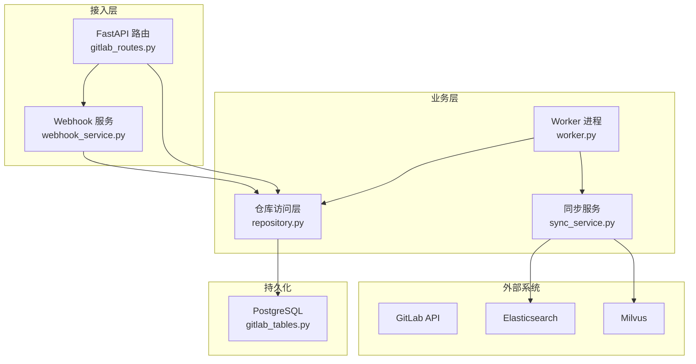
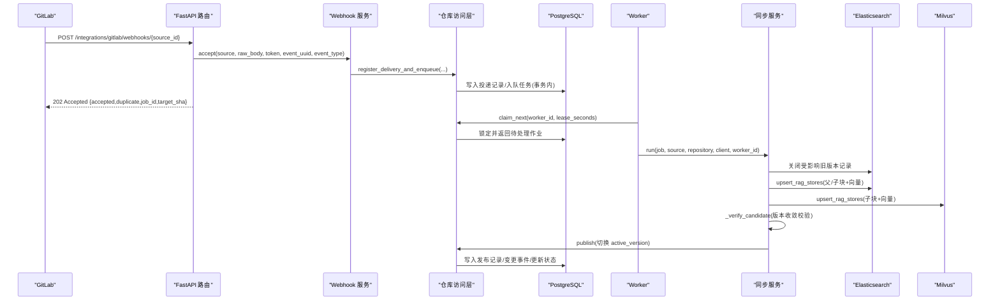
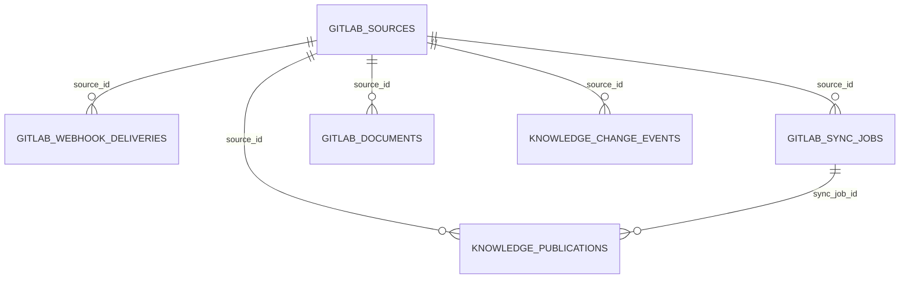
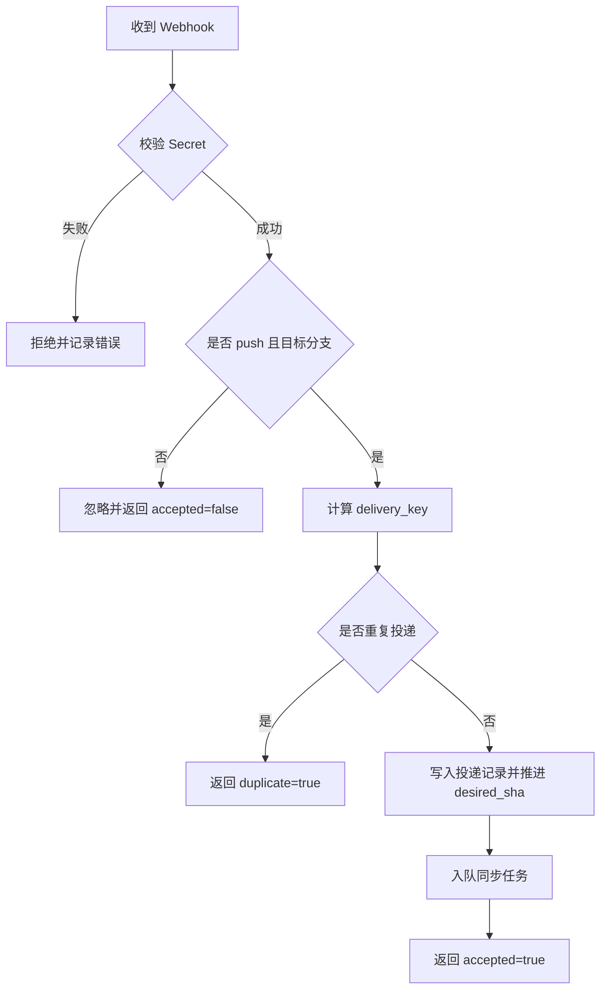
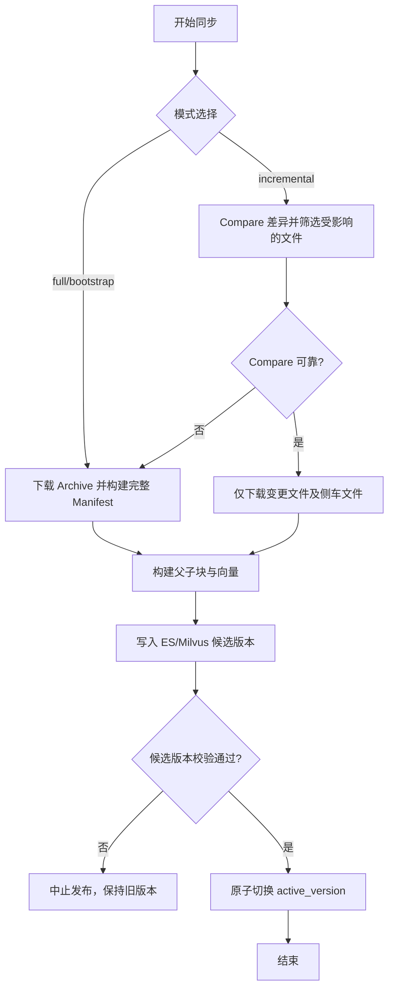
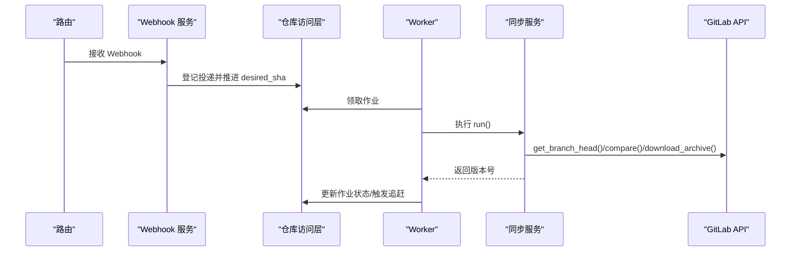
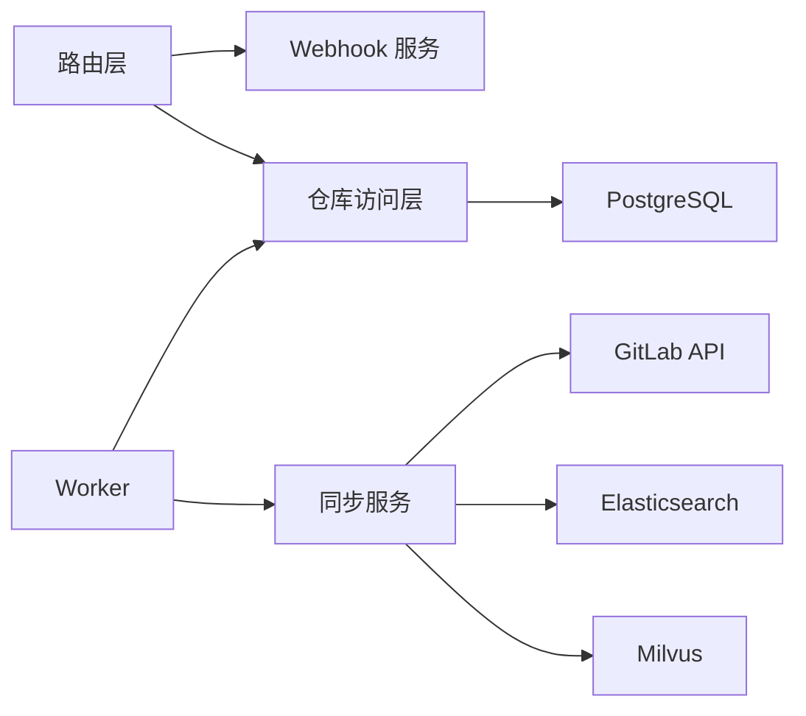

# GitLab 集成数据模型

<cite>
**本文引用的文件**
- [gitlab_tables.py](file://python-agent-study/src/fast_app/db/gitlab_tables.py)
- [20260726_0009_add_gitlab_enterprise_sync.py](file://python-agent-study/alembic/versions/20260726_0009_add_gitlab_enterprise_sync.py)
- [webhook_service.py](file://python-agent-study/src/fast_app/integrations/gitlab/webhook_service.py)
- [sync_service.py](file://python-agent-study/src/fast_app/integrations/gitlab/sync_service.py)
- [worker.py](file://python-agent-study/src/fast_app/integrations/gitlab/worker.py)
- [repository.py](file://python-agent-study/src/fast_app/integrations/gitlab/repository.py)
- [models.py](file://python-agent-study/src/fast_app/integrations/gitlab/models.py)
- [gitlab_routes.py](file://python-agent-study/src/fast_app/api/gitlab_routes.py)
</cite>

## 目录
1. [简介](#简介)
2. [项目结构](#项目结构)
3. [核心组件](#核心组件)
4. [架构总览](#架构总览)
5. [详细组件分析](#详细组件分析)
6. [依赖关系分析](#依赖关系分析)
7. [性能考虑](#性能考虑)
8. [故障排查指南](#故障排查指南)
9. [结论](#结论)
10. [附录](#附录)

## 简介
本文件面向“GitLab 企业文档同步”能力，系统化说明与 GitLab 集成的数据模型、Webhook 事件映射、增量同步与版本发布流程、冲突与一致性保障策略，以及访问令牌与同步状态存储方案。目标读者既包括需要理解整体设计的工程师，也包括希望快速定位问题的运维人员。

## 项目结构
围绕 GitLab 集成的代码主要分布在以下位置：
- 数据库表定义：src/fast_app/db/gitlab_tables.py
- 数据库迁移脚本：alembic/versions/20260726_0009_add_gitlab_enterprise_sync.py
- Webhook 接收与校验：src/fast_app/integrations/gitlab/webhook_service.py
- 同步编排与发布：src/fast_app/integrations/gitlab/sync_service.py
- Worker 任务执行：src/fast_app/integrations/gitlab/worker.py
- 仓库与持久化访问层：src/fast_app/integrations/gitlab/repository.py
- API 路由与对外接口：src/fast_app/api/gitlab_routes.py
- 数据模型与响应结构：src/fast_app/integrations/gitlab/models.py

图表来源
- [gitlab_routes.py:42-70](file://python-agent-study/src/fast_app/api/gitlab_routes.py#L42-L70)
- [webhook_service.py:19-87](file://python-agent-study/src/fast_app/integrations/gitlab/webhook_service.py#L19-L87)
- [sync_service.py:72-181](file://python-agent-study/src/fast_app/integrations/gitlab/sync_service.py#L72-L181)
- [worker.py:28-146](file://python-agent-study/src/fast_app/integrations/gitlab/worker.py#L28-L146)
- [repository.py:32-200](file://python-agent-study/src/fast_app/integrations/gitlab/repository.py#L32-L200)
- [gitlab_tables.py:24-316](file://python-agent-study/src/fast_app/db/gitlab_tables.py#L24-L316)

章节来源
- [gitlab_routes.py:42-70](file://python-agent-study/src/fast_app/api/gitlab_routes.py#L42-L70)
- [gitlab_tables.py:24-316](file://python-agent-study/src/fast_app/db/gitlab_tables.py#L24-L316)

## 核心组件
- 数据模型（表）
  - 项目源配置表：记录 GitLab 实例、项目、分支、部门边界、令牌环境变量、最近成功 SHA、期望追赶 SHA、状态等。
  - Webhook 投递表：幂等登记每次 Webhook 投递事实，支持去重与审计。
  - 同步作业表：记录一次同步任务的模式、阶段、起止 SHA、重试次数、统计信息、错误信息等。
  - 文档清单表：以 source_id + repository_path 唯一键维护每个文档的元数据、内容指纹、ACL 指纹、解析器与分块策略版本等。
  - 变更请求表：用于后续人工审核或自动合并的变更单（如 MR 关联）。
  - 知识发布表与发布状态表：版本化发布与活跃版本指针。
  - 知识变更事件表：按版本记录受影响的文档集合，供前端轮询通知。

- 关键服务
  - Webhook 服务：校验共享密钥、解析推送事件、登记投递并推进 desired_sha，必要时合并/创建队列任务。
  - 同步服务：负责全量/增量准备、构建父子块与向量、写入 ES/Milvus、候选版本验证、原子发布。
  - Worker：领取任务、心跳续租、异常标记失败与重试、完成后触发追赶任务。
  - 仓库访问层：封装对 PostgreSQL 的增删改查、任务抢占、发布预留、状态更新等。

章节来源
- [gitlab_tables.py:24-316](file://python-agent-study/src/fast_app/db/gitlab_tables.py#L24-L316)
- [webhook_service.py:19-87](file://python-agent-study/src/fast_app/integrations/gitlab/webhook_service.py#L19-L87)
- [sync_service.py:72-181](file://python-agent-study/src/fast_app/integrations/gitlab/sync_service.py#L72-L181)
- [worker.py:28-146](file://python-agent-study/src/fast_app/integrations/gitlab/worker.py#L28-L146)
- [repository.py:32-200](file://python-agent-study/src/fast_app/integrations/gitlab/repository.py#L32-L200)

## 架构总览
下图展示从 GitLab Push 到知识发布的端到端数据流，强调幂等性、增量优化与原子发布。

图表来源
- [gitlab_routes.py:42-70](file://python-agent-study/src/fast_app/api/gitlab_routes.py#L42-L70)
- [webhook_service.py:23-78](file://python-agent-study/src/fast_app/integrations/gitlab/webhook_service.py#L23-L78)
- [repository.py:121-200](file://python-agent-study/src/fast_app/integrations/gitlab/repository.py#L121-L200)
- [worker.py:44-146](file://python-agent-study/src/fast_app/integrations/gitlab/worker.py#L44-L146)
- [sync_service.py:90-181](file://python-agent-study/src/fast_app/integrations/gitlab/sync_service.py#L90-L181)

## 详细组件分析

### 数据模型设计
- 项目源配置表（gitlab_sources）
  - 主键：id
  - 关键字段：base_url、host_id、project_id、project_path、target_branch、department_code、default_visibility、sync_token_env、agent_token_env、webhook_secret_env、last_synced_sha、desired_sha、status
  - 约束：host_id + project_id 唯一，避免重复配置同一项目
  - 用途：描述一个可同步的 GitLab 项目及其安全边界、令牌来源、追踪位点与状态

- Webhook 投递表（gitlab_webhook_deliveries）
  - 主键：delivery_key
  - 关键字段：source_id、event_uuid、event_type、before_sha、after_sha、payload_hash
  - 索引：source_id + created_at
  - 用途：幂等登记每次 Webhook 投递，防止重复入队；保留 before/after 用于诊断

- 同步作业表（gitlab_sync_jobs）
  - 主键：id
  - 关键字段：source_id、mode、status、phase、base_sha、target_sha、candidate_version、attempt_count、max_attempts、worker_id、lease_expires_at、document_count、parent_count、child_count、change_counts_json、error_code、error_message、started_at、finished_at
  - 索引：status + created_at；条件唯一索引保证每个 Source 仅有一个活动任务
  - 用途：驱动 Worker 执行一次固定 SHA 的同步，记录进度、统计与错误

- 文档清单表（gitlab_documents）
  - 主键：doc_id
  - 关键字段：source_id、repository_path、blob_id、source_revision、content_hash、acl_hash、parser_version、chunk_strategy_version、chunk_config_fingerprint、document_type、acl_json、status
  - 约束：source_id + repository_path 唯一
  - 用途：维护每个文档的元数据与策略指纹，支撑增量判断与回滚

- 变更请求表（gitlab_change_requests）
  - 主键：id
  - 关键字段：task_plan_id、source_id、branch_name、base_sha、commit_sha、merge_request_iid、merge_request_url、status
  - 用途：跟踪由系统发起的变更单（例如为审阅而创建的分支与 MR）

- 知识发布表（knowledge_publications）
  - 主键：version
  - 关键字段：previous_version、source_id、sync_job_id、target_sha、status、validation_json、created_at、published_at
  - 用途：记录每次候选版本的构建与发布结果

- 发布状态表（knowledge_publication_state）
  - 单例行 id=1，active_version 表示当前正式生效的知识版本
  - 用途：作为全局指针，确保新查询只看到已发布的稳定版本

- 知识变更事件表（knowledge_change_events）
  - 主键：自增 id
  - 关键字段：publication_version、source_id、event_type、affected_documents_json、created_at
  - 用途：按版本记录受影响的文档集合，供前端增量轮询

图表来源
- [gitlab_tables.py:24-316](file://python-agent-study/src/fast_app/db/gitlab_tables.py#L24-L316)

章节来源
- [gitlab_tables.py:24-316](file://python-agent-study/src/fast_app/db/gitlab_tables.py#L24-L316)
- [20260726_0009_add_gitlab_enterprise_sync.py:20-153](file://python-agent-study/alembic/versions/20260726_0009_add_gitlab_enterprise_sync.py#L20-L153)

### Webhook 事件数据映射与变更追踪
- 事件类型与字段映射
  - object_kind == "push" 且 ref 为目标分支时进入同步流程
  - before_sha/after_sha 用于确定增量起点和目标快照
  - X-Gitlab-Token 通过 HMAC 校验，X-Gitlab-Event-UUID 用于幂等键
- 幂等与去重
  - delivery_key = event_uuid 或基于 project_id:before:after:payload_hash 的稳定哈希
  - 投递记录与入队在同一事务中完成，避免半完成状态
- 变更追踪
  - 投递表记录 before/after 与 payload_hash，便于审计与回溯
  - 变更事件表在发布后记录 affected_documents_json，供前端按 after_id 增量拉取

图表来源
- [webhook_service.py:23-78](file://python-agent-study/src/fast_app/integrations/gitlab/webhook_service.py#L23-L78)
- [repository.py:121-200](file://python-agent-study/src/fast_app/integrations/gitlab/repository.py#L121-L200)

章节来源
- [webhook_service.py:23-78](file://python-agent-study/src/fast_app/integrations/gitlab/webhook_service.py#L23-L78)
- [repository.py:121-200](file://python-agent-study/src/fast_app/integrations/gitlab/repository.py#L121-L200)
- [models.py:72-96](file://python-agent-study/src/fast_app/integrations/gitlab/models.py#L72-L96)

### 文档版本控制、增量同步与冲突解决
- 版本控制
  - 使用 knowledge_publications.version 与 knowledge_publication_state.active_version 实现版本化发布
  - 发布前将受影响旧记录的 valid_to_version 设置为新版本，保证读路径平滑过渡
- 增量同步
  - 当 base_sha 存在且 Compare 未超时/未截断时，优先走增量路径
  - 遇到 PDF、权限规则变更、XLSX 等场景自动降级为全量，确保正确性
  - 通过 content_hash/acl_hash/策略指纹判断是否需要重建父子块
- 冲突解决
  - 每个 Source 仅允许一个活动任务，新提交会推进 target_sha 而非并发执行
  - 若 before_sha 与 last_synced_sha 不连续，强制升级为全量对账
  - 发布前进行 ES/Milvus 候选版本一致性校验，不一致则中止发布

图表来源
- [sync_service.py:90-181](file://python-agent-study/src/fast_app/integrations/gitlab/sync_service.py#L90-L181)
- [sync_service.py:276-408](file://python-agent-study/src/fast_app/integrations/gitlab/sync_service.py#L276-L408)
- [sync_service.py:643-796](file://python-agent-study/src/fast_app/integrations/gitlab/sync_service.py#L643-L796)

章节来源
- [sync_service.py:90-181](file://python-agent-study/src/fast_app/integrations/gitlab/sync_service.py#L90-L181)
- [sync_service.py:276-408](file://python-agent-study/src/fast_app/integrations/gitlab/sync_service.py#L276-L408)
- [sync_service.py:643-796](file://python-agent-study/src/fast_app/integrations/gitlab/sync_service.py#L643-L796)

### 项目配置、访问令牌管理与同步状态存储策略
- 项目配置
  - 通过 gitlab_sources 管理多实例、多项目、目标分支、部门边界与默认可见性
  - default_visibility 决定文档默认可见范围，配合 ACL JSON 实现细粒度权限
- 访问令牌管理
  - sync_token_env、agent_token_env、webhook_secret_env 指向环境变量中的敏感值
  - Webhook 使用 webhook secret 做 HMAC 校验；Worker 使用只读 Token 拉取数据
- 同步状态存储
  - desired_sha 表示最终必须追赶到哪里；last_synced_sha 表示最近成功发布
  - 作业表记录 attempt_count、lease_expires_at、worker_id，支持心跳与重试
  - 发布状态表维护 active_version，变更事件表提供增量通知游标

章节来源
- [gitlab_tables.py:24-158](file://python-agent-study/src/fast_app/db/gitlab_tables.py#L24-L158)
- [worker.py:177-184](file://python-agent-study/src/fast_app/integrations/gitlab/worker.py#L177-L184)
- [repository.py:71-119](file://python-agent-study/src/fast_app/integrations/gitlab/repository.py#L71-L119)

### GitLab API 集成数据流与同步流程
- 数据流
  - FastAPI 路由接收 Webhook，调用 Webhook 服务校验与入队
  - Worker 定时领取作业，调用同步服务执行下载、解析、向量化、写入与发布
  - 同步服务通过 GitLabClient 获取分支 HEAD、比较差异、下载文件或归档
- 同步流程
  - 全量：下载归档 -> 构建 Manifest -> 构建父子块 -> 写入 ES/Milvus -> 校验 -> 发布
  - 增量：Compare -> 筛选变更 -> 按需下载 -> 构建增量产物 -> 写入 -> 校验 -> 发布
  - Bootstrap：多 Source 联合构建首个版本后一次性发布

图表来源
- [gitlab_routes.py:42-70](file://python-agent-study/src/fast_app/api/gitlab_routes.py#L42-L70)
- [webhook_service.py:23-78](file://python-agent-study/src/fast_app/integrations/gitlab/webhook_service.py#L23-L78)
- [worker.py:44-146](file://python-agent-study/src/fast_app/integrations/gitlab/worker.py#L44-L146)
- [sync_service.py:90-181](file://python-agent-study/src/fast_app/integrations/gitlab/sync_service.py#L90-L181)

章节来源
- [gitlab_routes.py:42-70](file://python-agent-study/src/fast_app/api/gitlab_routes.py#L42-L70)
- [worker.py:44-146](file://python-agent-study/src/fast_app/integrations/gitlab/worker.py#L44-L146)
- [sync_service.py:90-181](file://python-agent-study/src/fast_app/integrations/gitlab/sync_service.py#L90-L181)

## 依赖关系分析
- 模块耦合
  - 路由层依赖 Webhook 服务与仓库访问层，职责清晰
  - 同步服务依赖 GitLabClient、ES、Milvus、嵌入客户端与分块器，承担复杂编排
  - Worker 与 Repository 通过数据库锁与心跳机制协作，避免重复执行
- 外部依赖
  - GitLab API：用于获取分支 HEAD、比较差异、下载文件/归档
  - Elasticsearch：存储父子块与检索元数据
  - Milvus：存储子块向量
- 循环依赖检查
  - 各模块单向依赖，未发现循环引用

图表来源
- [gitlab_routes.py:42-70](file://python-agent-study/src/fast_app/api/gitlab_routes.py#L42-L70)
- [webhook_service.py:19-87](file://python-agent-study/src/fast_app/integrations/gitlab/webhook_service.py#L19-L87)
- [worker.py:28-146](file://python-agent-study/src/fast_app/integrations/gitlab/worker.py#L28-L146)
- [sync_service.py:72-181](file://python-agent-study/src/fast_app/integrations/gitlab/sync_service.py#L72-L181)
- [repository.py:32-200](file://python-agent-study/src/fast_app/integrations/gitlab/repository.py#L32-L200)

章节来源
- [gitlab_routes.py:42-70](file://python-agent-study/src/fast_app/api/gitlab_routes.py#L42-L70)
- [repository.py:32-200](file://python-agent-study/src/fast_app/integrations/gitlab/repository.py#L32-L200)

## 性能考虑
- 增量优先：在 Compare 可靠时优先增量，减少下载与解析开销
- 幂等投递：基于 event_uuid 或 payload_hash 的去重，避免重复任务
- 并发限制：每个 Source 仅一个活动任务，降低竞争与冲突
- 批量写入：ES/Milvus 写入采用批量 upsert，减少网络往返
- 资源保护：Archive 大小、文件数量、单文件大小限制，防止内存溢出
- 缓存与指纹：content_hash/acl_hash/策略指纹避免重复构建

[本节为通用指导，不直接分析具体文件]

## 故障排查指南
- Webhook 被拒绝
  - 检查 X-Gitlab-Token 是否与配置的 webhook_secret_env 一致
  - 确认事件类型为 push 且 ref 为目标分支
- 任务未执行
  - 检查是否有活动任务占用 Source；desired_sha 是否推进
  - 查看作业状态与 phase，确认 Worker 是否领取
- 同步失败
  - 查看 error_code 与 error_message
  - 区分可重试错误与确定性错误（如 ValueError 不应自动重试）
- 发布不一致
  - 检查候选版本校验日志，确认 ES/Milvus 记录与预期一致
  - 核对 affected_documents_json 与权限过滤逻辑

章节来源
- [webhook_service.py:80-84](file://python-agent-study/src/fast_app/integrations/gitlab/webhook_service.py#L80-L84)
- [worker.py:129-146](file://python-agent-study/src/fast_app/integrations/gitlab/worker.py#L129-L146)
- [sync_service.py:643-796](file://python-agent-study/src/fast_app/integrations/gitlab/sync_service.py#L643-L796)

## 结论
该集成通过“幂等投递 + 增量优先 + 版本化发布 + 候选校验”的设计，在保证一致性的前提下实现了高效可靠的 GitLab 文档同步。数据模型清晰、职责分层明确，适合在企业环境中扩展与维护。

[本节为总结，不直接分析具体文件]

## 附录
- 对外接口概览
  - Webhook 接收：POST /integrations/gitlab/webhooks/{source_id}
  - 管理员查询：GET /admin/gitlab/sources、GET /admin/gitlab/sync-jobs
  - 手动触发：POST /admin/gitlab/sources/{source_id}/sync
  - 重试任务：POST /admin/gitlab/sync-jobs/{job_id}/retry
  - 发布状态：GET /knowledge/publication/status
  - 变更事件：GET /knowledge/change-events

章节来源
- [gitlab_routes.py:42-216](file://python-agent-study/src/fast_app/api/gitlab_routes.py#L42-L216)
- [models.py:99-173](file://python-agent-study/src/fast_app/integrations/gitlab/models.py#L99-L173)