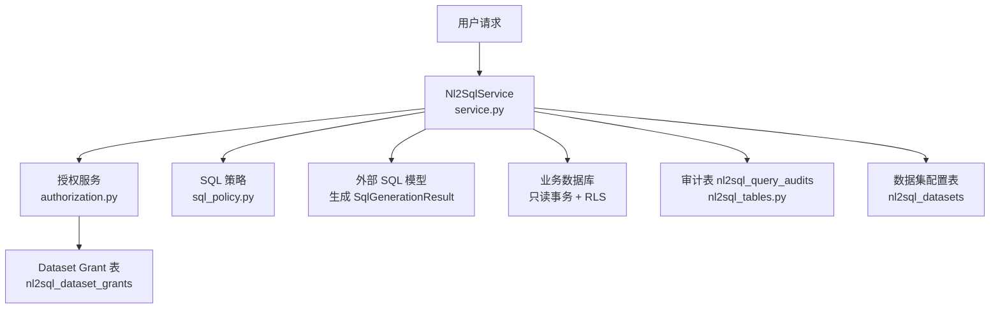
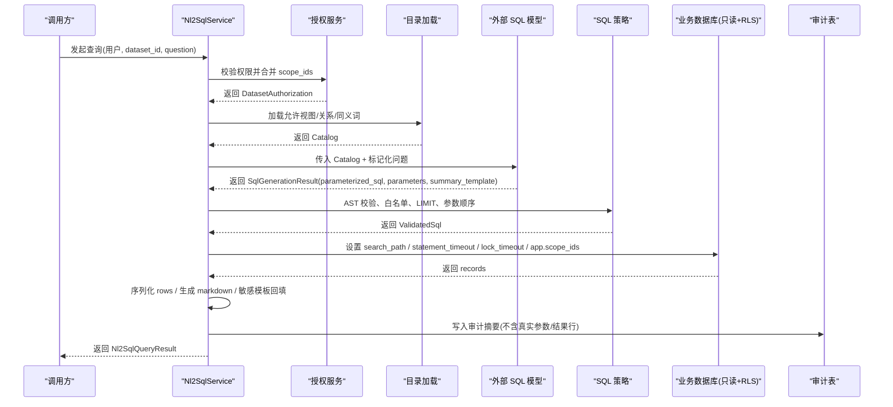
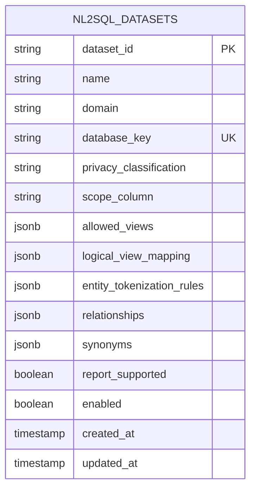
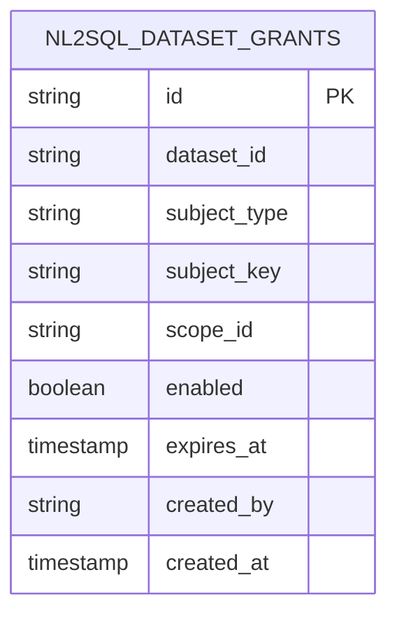
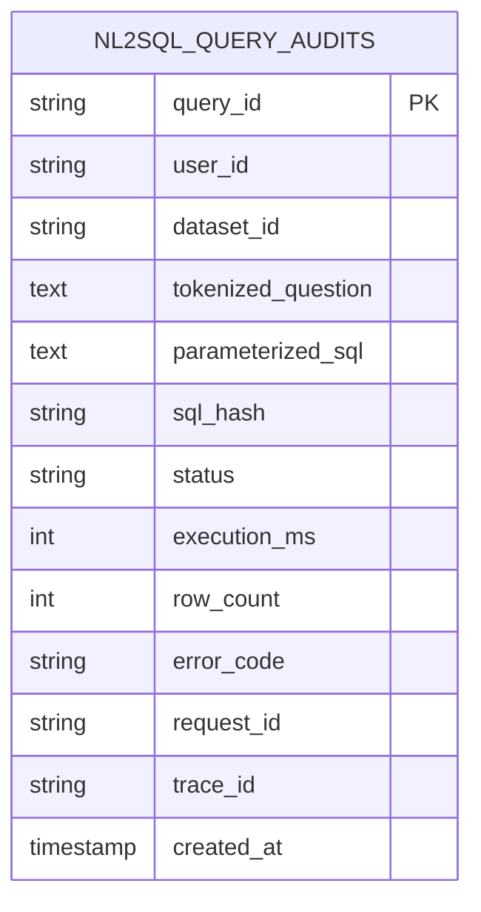
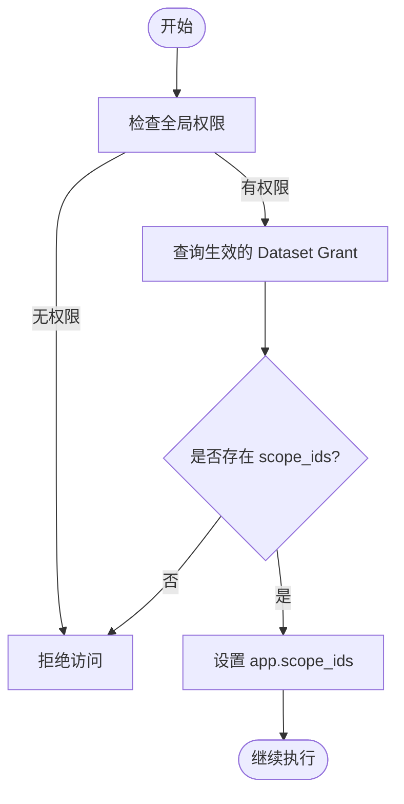
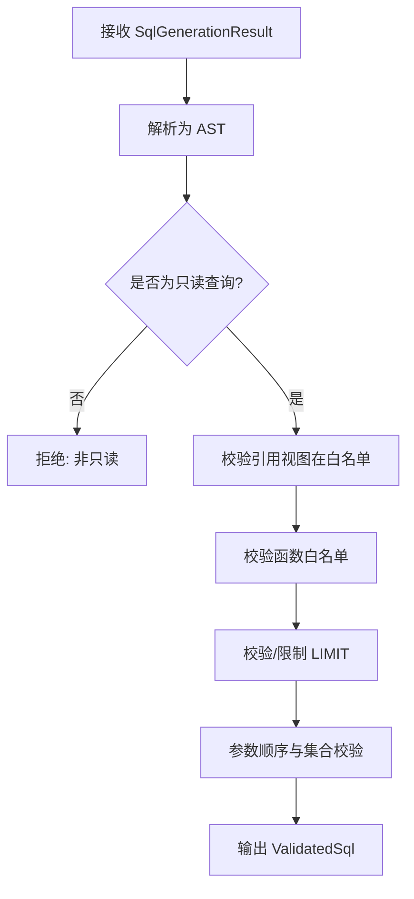
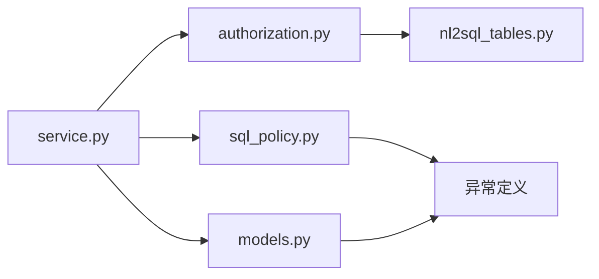

# NL2SQL 数据模型

<cite>
**本文引用的文件**
- [nl2sql_tables.py](file://src/fast_app/db/nl2sql_tables.py)
- [20260729_0011_add_nl2sql_rbac_and_audit.py](file://alembic/versions/20260729_0011_add_nl2sql_rbac_and_audit.py)
- [20260731_0012_add_nl2sql_datasets.py](file://alembic/versions/20260731_0012_add_nl2sql_datasets.py)
- [service.py](file://src/fast_app/services/nl2sql/service.py)
- [models.py](file://src/fast_app/services/nl2sql/models.py)
- [authorization.py](file://src/fast_app/services/nl2sql/authorization.py)
- [sql_policy.py](file://src/fast_app/services/nl2sql/sql_policy.py)
- [grant_employee_dataset_access.py](file://scripts/nl2sql/grant_employee_dataset_access.py)
</cite>

## 目录
1. [简介](#简介)
2. [项目结构](#项目结构)
3. [核心组件](#核心组件)
4. [架构总览](#架构总览)
5. [详细组件分析](#详细组件分析)
6. [依赖关系分析](#依赖关系分析)
7. [性能考虑](#性能考虑)
8. [故障排查指南](#故障排查指南)
9. [结论](#结论)
10. [附录](#附录)

## 简介
本文件面向 NL2SQL（自然语言转 SQL）的数据模型与执行链路，重点说明三类持久化表：数据集表、查询计划表和执行日志表（审计表），并解释中间状态在内存与服务对象中的管理方式。文档覆盖数据集权限控制、查询策略、结果缓存、SQL 模板管理、参数绑定、结果格式化、查询审计与性能分析示例，以及数据安全与访问控制机制。

## 项目结构
NL2SQL 的数据模型由数据库迁移脚本与 ORM 表定义共同描述；服务层通过 Pydantic 模型组织输入输出、授权、策略校验与执行流程。关键位置如下：
- 数据库表定义与迁移：nl2sql_tables.py、两个 Alembic 迁移脚本
- 服务编排与安全策略：service.py、sql_policy.py、authorization.py
- 领域模型与接口契约：models.py
- 授权初始化脚本：grant_employee_dataset_access.py

图表来源
- [service.py:95-284](file://src/fast_app/services/nl2sql/service.py#L95-L284)
- [authorization.py:21-74](file://src/fast_app/services/nl2sql/authorization.py#L21-L74)
- [sql_policy.py:55-179](file://src/fast_app/services/nl2sql/sql_policy.py#L55-L179)
- [nl2sql_tables.py:12-107](file://src/fast_app/db/nl2sql_tables.py#L12-L107)

章节来源
- [nl2sql_tables.py:12-107](file://src/fast_app/db/nl2sql_tables.py#L12-L107)
- [20260729_0011_add_nl2sql_rbac_and_audit.py:17-71](file://alembic/versions/20260729_0011_add_nl2sql_rbac_and_audit.py#L17-L71)
- [20260731_0012_add_nl2sql_datasets.py:18-40](file://alembic/versions/20260731_0012_add_nl2sql_datasets.py#L18-L40)

## 核心组件
- 数据集表（nl2sql_datasets）：存储受控数据集元数据、隐私等级、范围列、允许视图、逻辑视图映射、实体标记化规则、关系、同义词、是否支持报告等。
- 数据集授权表（nl2sql_dataset_grants）：记录用户对 Dataset 的访问授权，包括主体类型（用户/角色/部门）、作用域、有效期和创建者。
- 查询审计表（nl2sql_query_audits）：记录每次查询的摘要信息，包含标记化问题、参数化 SQL、哈希、状态、耗时、行数、错误码、请求与追踪 ID。
- 服务模型（Pydantic）：封装 DatasetDefinition、Nl2SqlQueryRequest、SqlGenerationResult、Nl2SqlQueryResult、DatasetAuthorization 等。
- 授权服务：合并 RBAC 与 Dataset Grant，产出可信 scope_ids。
- SQL 策略：基于 AST 的白名单校验、函数限制、LIMIT 上限、参数顺序与占位符转换。
- 执行服务：串联授权、目录加载、敏感问题标记化、SQL 生成、AST 校验、参数绑定、RLS 执行、结果序列化与审计写入。

章节来源
- [nl2sql_tables.py:12-107](file://src/fast_app/db/nl2sql_tables.py#L12-L107)
- [models.py:12-133](file://src/fast_app/services/nl2sql/models.py#L12-L133)
- [authorization.py:15-74](file://src/fast_app/services/nl2sql/authorization.py#L15-L74)
- [sql_policy.py:52-179](file://src/fast_app/services/nl2sql/sql_policy.py#L52-L179)
- [service.py:41-284](file://src/fast_app/services/nl2sql/service.py#L41-L284)

## 架构总览
下图展示一次完整 NL2SQL 查询从入口到落库的关键步骤，突出“中间数据存储”的位置与边界：敏感实体的真实值仅保存在调用栈内的 Vault 中，不写盘；最终落库的是审计摘要与参数化 SQL。

图表来源
- [service.py:95-284](file://src/fast_app/services/nl2sql/service.py#L95-L284)
- [authorization.py:21-74](file://src/fast_app/services/nl2sql/authorization.py#L21-L74)
- [sql_policy.py:55-179](file://src/fast_app/services/nl2sql/sql_policy.py#L55-L179)
- [nl2sql_tables.py:76-100](file://src/fast_app/db/nl2sql_tables.py#L76-L100)

## 详细组件分析

### 数据集表（nl2sql_datasets）设计
- 主键 dataset_id，唯一 database_key，便于按部署键映射连接。
- privacy_classification 限定为敏感/非敏感，驱动不同处理路径。
- scope_column 指定 RLS 使用的项目范围列。
- allowed_views 白名单视图列表，限制模型可查询的物理对象。
- logical_view_mapping 将逻辑名替换为物理 analytics 视图名，避免模型直接暴露物理名。
- entity_tokenization_rules 用于敏感场景下对实体进行本地标记化。
- relationships/synonyms 辅助模型理解视图间关系与字段别名。
- report_supported 控制是否允许进入外部模型报告链路。
- enabled 控制启用状态。

图表来源
- [nl2sql_tables.py:12-40](file://src/fast_app/db/nl2sql_tables.py#L12-L40)
- [20260731_0012_add_nl2sql_datasets.py:18-40](file://alembic/versions/20260731_0012_add_nl2sql_datasets.py#L18-L40)

章节来源
- [nl2sql_tables.py:12-40](file://src/fast_app/db/nl2sql_tables.py#L12-L40)
- [20260731_0012_add_nl2sql_datasets.py:18-40](file://alembic/versions/20260731_0012_add_nl2sql_datasets.py#L18-L40)

### 数据集授权表（nl2sql_dataset_grants）设计
- 主键 id，dataset_id 关联数据集。
- subject_type 限定为用户/角色/部门，subject_key 对应具体标识。
- scope_id 表示该授权下的项目范围，支持 "*" 全量。
- enabled 与 expires_at 控制授权有效性与过期时间。
- created_by 记录操作者，created_at 记录时间。
- 唯一约束防止重复授予同一主体与作用域。
- 索引优化按 dataset_id 与 enabled 查询。

图表来源
- [nl2sql_tables.py:43-73](file://src/fast_app/db/nl2sql_tables.py#L43-L73)
- [20260729_0011_add_nl2sql_rbac_and_audit.py:17-45](file://alembic/versions/20260729_0011_add_nl2sql_rbac_and_audit.py#L17-L45)

章节来源
- [nl2sql_tables.py:43-73](file://src/fast_app/db/nl2sql_tables.py#L43-L73)
- [20260729_0011_add_nl2sql_rbac_and_audit.py:17-45](file://alembic/versions/20260729_0011_add_nl2sql_rbac_and_audit.py#L17-L45)

### 查询审计表（nl2sql_query_audits）设计
- query_id 作为本次查询的稳定审计 ID。
- user_id/dataset_id 标识主体与数据集。
- tokenized_question 保存标记化后的问题（敏感场景）。
- parameterized_sql 保存参数化 SQL 文本，不包含真实参数值。
- sql_hash 用于去重与相似度分析。
- status/execution_ms/row_count/error_code 记录执行状态与指标。
- request_id/trace_id 关联请求与追踪。
- 索引优化按用户/数据集与时间查询。

图表来源
- [nl2sql_tables.py:76-100](file://src/fast_app/db/nl2sql_tables.py#L76-L100)
- [20260729_0011_add_nl2sql_rbac_and_audit.py:46-71](file://alembic/versions/20260729_0011_add_nl2sql_rbac_and_audit.py#L46-L71)

章节来源
- [nl2sql_tables.py:76-100](file://src/fast_app/db/nl2sql_tables.py#L76-L100)
- [20260729_0011_add_nl2sql_rbac_and_audit.py:46-71](file://alembic/versions/20260729_0011_add_nl2sql_rbac_and_audit.py#L46-L71)

### 中间数据存储与管理
- 敏感实体 Vault：仅在 Python 调用栈内存在，用于将真实实体替换为带类型的占位符，并在执行前回填真实值。Vault 不写 TaskPlan、审计或日志。
- 目录与上下文：catalog 在服务方法内构造，承载允许视图、关系、同义词等信息，供 SQL 模型生成参考。
- 会话与事务：执行在只读事务中进行，设置 statement_timeout、lock_timeout、search_path 与 app.scope_ids，确保隔离与限流。
- 结果序列化：Decimal/date/UUID/长文本等统一序列化为安全格式，超长字段截断并产生警告。
- 审计写入：成功路径写入 tokenized_question、parameterized_sql、sql_hash、执行指标；失败路径写入最小必要信息，避免泄露。

章节来源
- [service.py:138-284](file://src/fast_app/services/nl2sql/service.py#L138-L284)
- [service.py:286-360](file://src/fast_app/services/nl2sql/service.py#L286-L360)
- [service.py:426-465](file://src/fast_app/services/nl2sql/service.py#L426-L465)
- [service.py:521-563](file://src/fast_app/services/nl2sql/service.py#L521-L563)

### 数据集权限控制
- 全局权限：要求具备 data:query:execute 权限。
- 角色豁免：系统管理员可直接获得全量 scope。
- Dataset Grant：根据当前用户的 user_id、全局角色、部门代码查询生效的 grant，合并 scope_ids。
- 作用域传递：scope_ids 以应用级配置形式注入数据库连接，配合 RLS 实现数据库级限制。

图表来源
- [authorization.py:21-74](file://src/fast_app/services/nl2sql/authorization.py#L21-L74)
- [service.py:511-518](file://src/fast_app/services/nl2sql/service.py#L511-L518)

章节来源
- [authorization.py:21-74](file://src/fast_app/services/nl2sql/authorization.py#L21-L74)
- [grant_employee_dataset_access.py:39-112](file://scripts/nl2sql/grant_employee_dataset_access.py#L39-L112)

### 查询策略与 SQL 模板管理
- SQL 生成：外部模型输出必须为 SqlGenerationResult，包含参数化 SQL、参数字典与总结模板。
- AST 校验：仅允许 SELECT/Union/Intersect/Except，禁止写入与控制命令，禁止 SELECT *。
- 白名单对象：所有 Table 引用必须在 allowed_views 中。
- 函数白名单：匿名函数需显式允许，内置危险函数禁用。
- LIMIT 保护：强制上限，参数化 LIMIT 需为正整数且不超过上限。
- 参数绑定：将 :name 转换为 $n 位置参数，严格匹配参数集合。
- 模板回填：敏感场景使用后端模板与受限字段（如 row_count、truncated）生成结论，避免泄露真实数据。

图表来源
- [sql_policy.py:55-179](file://src/fast_app/services/nl2sql/sql_policy.py#L55-L179)
- [models.py:75-93](file://src/fast_app/services/nl2sql/models.py#L75-L93)
- [service.py:426-465](file://src/fast_app/services/nl2sql/service.py#L426-L465)

章节来源
- [sql_policy.py:55-179](file://src/fast_app/services/nl2sql/sql_policy.py#L55-L179)
- [models.py:75-93](file://src/fast_app/services/nl2sql/models.py#L75-L93)
- [service.py:362-424](file://src/fast_app/services/nl2sql/service.py#L362-L424)

### 结果缓存
- 当前实现未提供跨请求的结果缓存。每次查询会重新生成并执行 SQL。
- 如需缓存，建议基于 parameterized_sql 的哈希与数据集/作用域维度建立缓存键，并结合 TTL 与失效策略。

[本节为通用建议，不直接分析具体文件]

### 查询审计与性能分析示例
以下示例基于已存在的索引与字段，可用于审计与性能分析：
- 按用户与时间检索最近失败查询：
  - 选择条件：user_id、status=failed、created_at 范围
  - 排序：created_at 降序
  - 目的：快速定位近期异常
- 按数据集统计每日执行次数与平均耗时：
  - 分组：dataset_id、日期(created_at)
  - 聚合：count(*)、avg(execution_ms)、sum(row_count)
  - 目的：评估负载与热点数据集
- 查找高耗时查询：
  - 条件：execution_ms > 阈值
  - 排序：execution_ms 降序
  - 目的：识别慢查询与潜在风险
- 审计去重与重复率：
  - 条件：sql_hash 相同
  - 分组：sql_hash
  - 聚合：count(*)
  - 目的：发现重复或回归查询

章节来源
- [nl2sql_tables.py:76-100](file://src/fast_app/db/nl2sql_tables.py#L76-L100)
- [20260729_0011_add_nl2sql_rbac_and_audit.py:62-71](file://alembic/versions/20260729_0011_add_nl2sql_rbac_and_audit.py#L62-L71)

### 数据安全策略与访问控制机制
- 最小权限原则：仅允许读取白名单视图，禁止写入与控制命令。
- 参数化与 AST 校验：杜绝拼接注入与越权对象访问。
- 敏感数据处理：实体标记化与 Vault 隔离，真实值不落地；结论模板受限字段回填。
- 作用域隔离：app.scope_ids 结合 RLS 实现数据库级范围限制。
- 超时与锁限制：statement_timeout、lock_timeout 防止长时间占用资源。
- 审计留痕：记录参数化 SQL 与执行指标，不记录真实参数与结果行。

章节来源
- [service.py:138-284](file://src/fast_app/services/nl2sql/service.py#L138-L284)
- [service.py:426-465](file://src/fast_app/services/nl2sql/service.py#L426-L465)
- [sql_policy.py:55-179](file://src/fast_app/services/nl2sql/sql_policy.py#L55-L179)
- [authorization.py:21-74](file://src/fast_app/services/nl2sql/authorization.py#L21-L74)

## 依赖关系分析
NL2SQL 模块内部依赖关系如下：
- service.py 依赖 authorization.py、sql_policy.py、models.py
- authorization.py 依赖 nl2sql_tables.py 与用户上下文
- sql_policy.py 依赖 sqlglot 与异常定义
- models.py 定义输入输出契约，被 service 与 API 层共用

图表来源
- [service.py:41-56](file://src/fast_app/services/nl2sql/service.py#L41-L56)
- [authorization.py:15-19](file://src/fast_app/services/nl2sql/authorization.py#L15-L19)
- [sql_policy.py:52-53](file://src/fast_app/services/nl2sql/sql_policy.py#L52-L53)
- [models.py:12-16](file://src/fast_app/services/nl2sql/models.py#L12-L16)

章节来源
- [service.py:41-56](file://src/fast_app/services/nl2sql/service.py#L41-L56)
- [authorization.py:15-19](file://src/fast_app/services/nl2sql/authorization.py#L15-L19)
- [sql_policy.py:52-53](file://src/fast_app/services/nl2sql/sql_policy.py#L52-L53)
- [models.py:12-16](file://src/fast_app/services/nl2sql/models.py#L12-L16)

## 性能考虑
- 只读事务与超时：设置 statement_timeout 与 lock_timeout，降低阻塞风险。
- 结果截断：默认限制返回行数，额外取一行判断是否 truncated，避免大结果集传输。
- 长文本裁剪：响应中对超长字段进行截断并提示，减少网络与渲染开销。
- 索引利用：审计表按用户/数据集与时间建立索引，提升审计与分析查询效率。
- 模型调用超时：外部 SQL 模型调用设置超时，避免阻塞服务线程。

章节来源
- [service.py:159-160](file://src/fast_app/services/nl2sql/service.py#L159-L160)
- [service.py:227-232](file://src/fast_app/services/nl2sql/service.py#L227-L232)
- [service.py:458-464](file://src/fast_app/services/nl2sql/service.py#L458-L464)
- [service.py:521-543](file://src/fast_app/services/nl2sql/service.py#L521-L543)
- [nl2sql_tables.py:97-100](file://src/fast_app/db/nl2sql_tables.py#L97-L100)

## 故障排查指南
- 常见错误分类：
  - 语法错误：SQL 无法解析，需调整模型输出或修复字段引用
  - 不安全 SQL：包含写入/控制命令、SELECT *、非白名单对象或函数
  - 权限不足：缺少全局权限或 Dataset Grant
  - 执行失败：数据库拒绝只读查询或超时
- 排查步骤：
  - 查看审计表 status、error_code、execution_ms、row_count
  - 核对 parameterized_sql 与 sql_hash，确认是否重复或回归
  - 检查授权：用户是否具备 data:query:execute，Grant 是否生效且未过期
  - 验证白名单：SQL 引用的视图是否在 allowed_views
  - 检查 LIMIT：是否超过上限或被强制截断
- 恢复建议：
  - 修正 SQL 结构与参数
  - 补充或刷新 Dataset Grant
  - 调整 max_rows 或后端默认限制
  - 增加索引或优化视图查询

章节来源
- [service.py:196-225](file://src/fast_app/services/nl2sql/service.py#L196-L225)
- [service.py:111-136](file://src/fast_app/services/nl2sql/service.py#L111-L136)
- [sql_policy.py:70-179](file://src/fast_app/services/nl2sql/sql_policy.py#L70-L179)
- [authorization.py:33-74](file://src/fast_app/services/nl2sql/authorization.py#L33-L74)

## 结论
本数据模型与服务实现围绕“可控、可审、可追溯”的目标构建：通过数据集表集中管理元数据与策略，通过授权表实现细粒度作用域控制，通过审计表保留执行轨迹而不泄露敏感数据。SQL 策略基于 AST 白名单与参数化绑定，确保生成的查询安全、只读且受限于最大行数。敏感场景采用标记化与模板回填，避免真实数据外泄。整体方案兼顾安全性、可维护性与可扩展性。

[本节为总结性内容，不直接分析具体文件]

## 附录
- 授权初始化脚本：可通过脚本为已有员工账号授予 data_analyst 角色与特定 Dataset Scope，幂等创建或启用 Grant。
- 迁移脚本：包含 RBAC、审计表与数据集表的创建与初始数据填充。

章节来源
- [grant_employee_dataset_access.py:39-112](file://scripts/nl2sql/grant_employee_dataset_access.py#L39-L112)
- [20260729_0011_add_nl2sql_rbac_and_audit.py:17-71](file://alembic/versions/20260729_0011_add_nl2sql_rbac_and_audit.py#L17-L71)
- [20260731_0012_add_nl2sql_datasets.py:18-121](file://alembic/versions/20260731_0012_add_nl2sql_datasets.py#L18-L121)