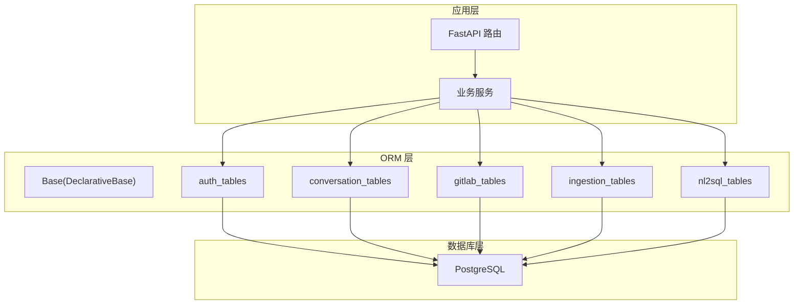
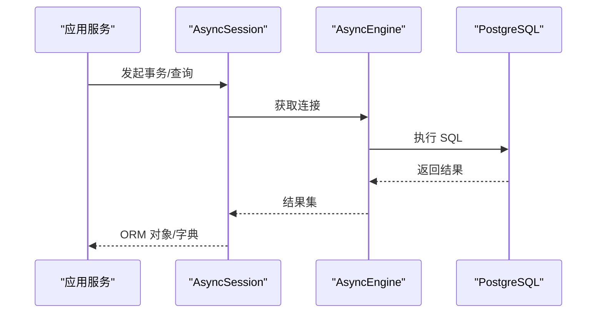
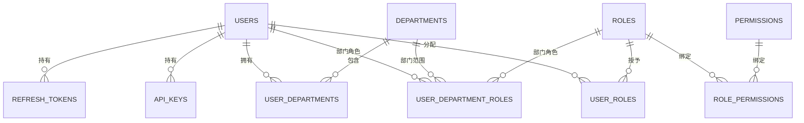
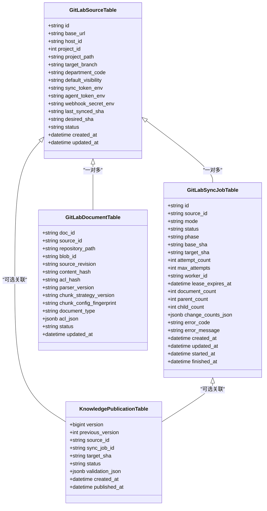
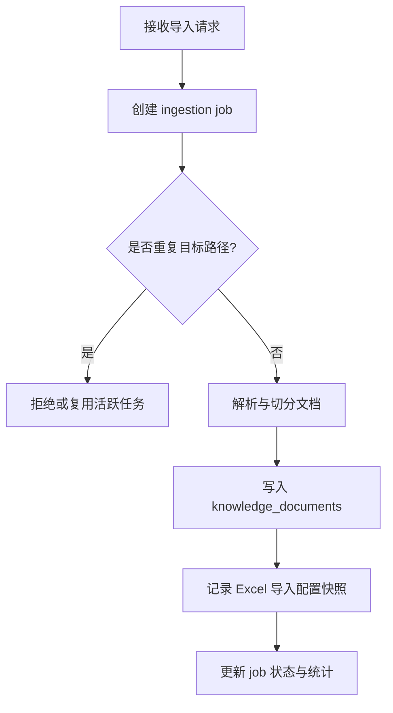
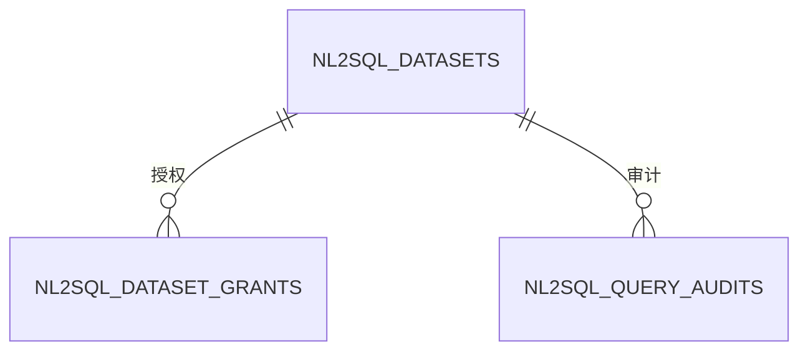
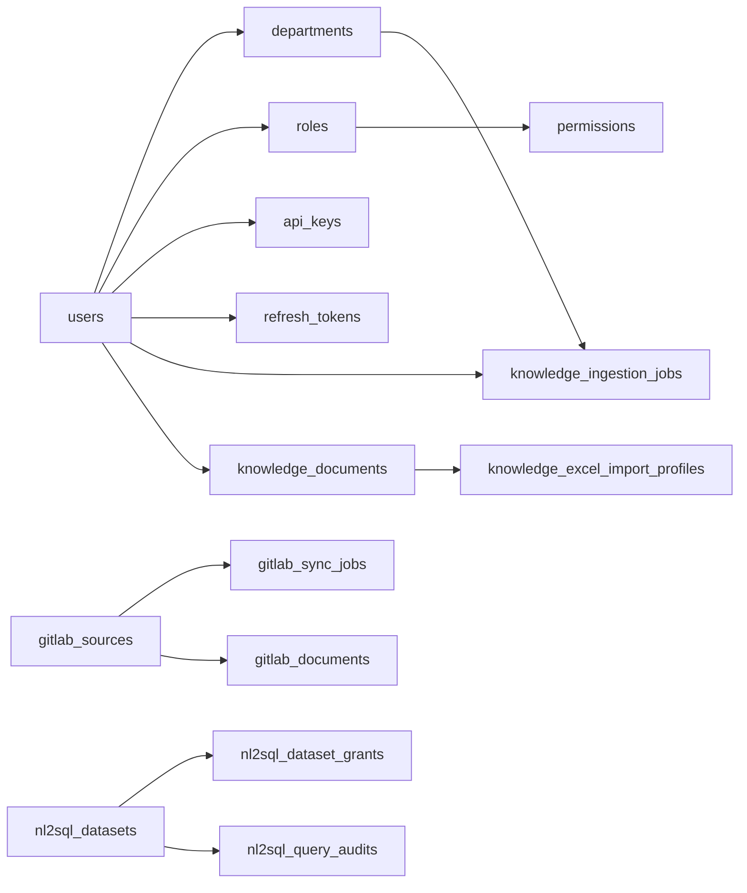
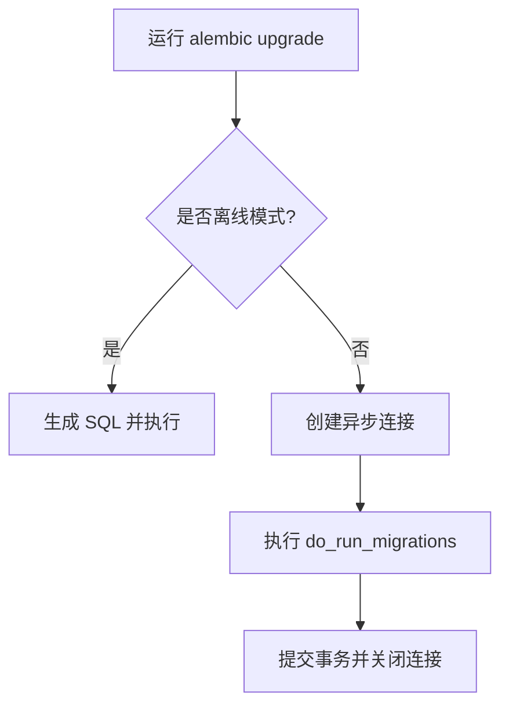

# PostgreSQL 数据库设计

<cite>
**本文引用的文件**
- [src/fast_app/db/base.py](file://src/fast_app/db/base.py)
- [src/fast_app/db/session.py](file://src/fast_app/db/session.py)
- [alembic/env.py](file://alembic/env.py)
- [src/fast_app/db/auth_tables.py](file://src/fast_app/db/auth_tables.py)
- [src/fast_app/db/conversation_tables.py](file://src/fast_app/db/conversation_tables.py)
- [src/fast_app/db/gitlab_tables.py](file://src/fast_app/db/gitlab_tables.py)
- [src/fast_app/db/ingestion_tables.py](file://src/fast_app/db/ingestion_tables.py)
- [src/fast_app/db/nl2sql_tables.py](file://src/fast_app/db/nl2sql_tables.py)
- [alembic/versions/20260624_0001_create_conversation_tables.py](file://alembic/versions/20260624_0001_create_conversation_tables.py)
- [alembic/versions/20260626_0003_create_auth_tables.py](file://alembic/versions/20260626_0003_create_auth_tables.py)
- [alembic/versions/20260729_0011_add_nl2sql_rbac_and_audit.py](file://alembic/versions/20260729_0011_add_nl2sql_rbac_and_audit.py)
- [src/fast_app/core/config.py](file://src/fast_app/core/config.py)
</cite>

## 目录
1. [简介](#简介)
2. [项目结构](#项目结构)
3. [核心组件](#核心组件)
4. [架构总览](#架构总览)
5. [详细组件分析](#详细组件分析)
6. [依赖关系分析](#依赖关系分析)
7. [性能与连接池配置](#性能与连接池配置)
8. [数据迁移管理方案](#数据迁移管理方案)
9. [故障排查指南](#故障排查指南)
10. [结论](#结论)
11. [附录：DDL 参考与调优建议](#附录ddl-参考与调优建议)

## 简介
本文件面向数据库管理员与后端开发者，系统化说明本项目基于 PostgreSQL 的数据库设计。内容覆盖：
- 所有数据表的结构定义、字段类型、约束条件与索引策略
- 用户认证表、对话历史表、GitLab 集成表、文档导入表、NL2SQL 相关表的实体关系
- SQLAlchemy ORM 模型映射、查询优化策略与连接池配置
- Alembic 版本控制与回滚策略
- 为 DBA 提供的 DDL 参考与性能调优建议

## 项目结构
数据库相关的代码组织遵循“按领域分表模块 + 统一基类 + 异步会话工厂 + Alembic 迁移”的工程化模式：
- 基础与连接
  - Base：所有 ORM 模型的共同基类
  - session：异步 Engine 与 AsyncSession 工厂
  - config：数据库 URL、连接池大小、是否打印 SQL 等配置
- 领域表模块
  - auth_tables：用户、部门、角色、权限、API Key、刷新令牌等
  - conversation_tables：会话、消息、摘要
  - gitlab_tables：GitLab 数据源、Webhook、同步任务、文档、变更请求、发布与事件
  - ingestion_tables：知识导入任务、文档元数据、Excel 导入配置快照
  - nl2sql_tables：数据集、授权、审计
- 迁移
  - alembic/env.py：加载 Settings、注册所有表模块、执行在线/离线迁移
  - alembic/versions/*：按时间戳命名的迁移脚本，包含 upgrade/downgrade

**图表来源**
- [src/fast_app/db/base.py:1-8](file://src/fast_app/db/base.py#L1-L8)
- [src/fast_app/db/auth_tables.py:1-431](file://src/fast_app/db/auth_tables.py#L1-L431)
- [src/fast_app/db/conversation_tables.py:1-171](file://src/fast_app/db/conversation_tables.py#L1-L171)
- [src/fast_app/db/gitlab_tables.py:1-317](file://src/fast_app/db/gitlab_tables.py#L1-L317)
- [src/fast_app/db/ingestion_tables.py:1-204](file://src/fast_app/db/ingestion_tables.py#L1-L204)
- [src/fast_app/db/nl2sql_tables.py:1-108](file://src/fast_app/db/nl2sql_tables.py#L1-L108)

**章节来源**
- [src/fast_app/db/base.py:1-8](file://src/fast_app/db/base.py#L1-L8)
- [src/fast_app/db/session.py:1-33](file://src/fast_app/db/session.py#L1-L33)
- [alembic/env.py:1-84](file://alembic/env.py#L1-L84)

## 核心组件
- 统一基类：所有表继承自 DeclarativeBase，便于集中管理 metadata 与迁移发现
- 异步会话工厂：使用 asyncpg 创建异步引擎与会话，支持连接池、ping 检测、提交后不失效
- 配置中心：通过 Settings 读取 DATABASE_URL、pool_size、max_overflow、echo 等参数
- 迁移环境：Alembic 在 env.py 中注入所有表模块，自动发现并执行迁移

**章节来源**
- [src/fast_app/db/base.py:1-8](file://src/fast_app/db/base.py#L1-L8)
- [src/fast_app/db/session.py:11-32](file://src/fast_app/db/session.py#L11-L32)
- [src/fast_app/core/config.py:520-535](file://src/fast_app/core/config.py#L520-L535)
- [alembic/env.py:18-34](file://alembic/env.py#L18-L34)

## 架构总览
下图展示从应用到数据库的整体调用链，以及各模块间的依赖关系。

**图表来源**
- [src/fast_app/db/session.py:11-32](file://src/fast_app/db/session.py#L11-L32)
- [src/fast_app/core/config.py:520-535](file://src/fast_app/core/config.py#L520-L535)

## 详细组件分析

### 用户认证域（users、departments、roles、permissions、api_keys、refresh_tokens）
- 主键与唯一性
  - users：id 为主键；username、email 唯一
  - departments：id 为主键；code 唯一
  - roles：id 为主键；code 唯一
  - permissions：id 为主键；code 唯一
  - api_keys：id 为主键；key_fingerprint 唯一
  - refresh_tokens：id 为主键；token_hash 唯一
- 外键与级联
  - user_departments：user_id -> users.id，department_code -> departments.code，ondelete CASCADE
  - role_permissions：role_id -> roles.id，permission_id -> permissions.id，ondelete CASCADE
  - user_roles：user_id -> users.id，role_id -> roles.id，ondelete CASCADE
  - user_department_roles：user_id -> users.id，department_code -> departments.code，role_id -> roles.id，ondelete CASCADE
  - api_keys：user_id -> users.id，ondelete CASCADE
  - refresh_tokens：user_id -> users.id，ondelete CASCADE
- 默认值与非空
  - status 多采用 'active' 默认
  - created_at/updated_at 使用 now() 默认或更新时刷新
  - JSONB 字段提供 '{}'::jsonb 默认
- 索引策略
  - user_departments：user_id、department_code 单列索引
  - role_permissions：role_id、permission_id 单列索引
  - user_roles：user_id、role_id 单列索引
  - user_department_roles：user_id、department_code、role_id 三列索引
  - api_keys：user_id+status 复合索引
  - refresh_tokens：user_id+status 复合索引

**图表来源**
- [src/fast_app/db/auth_tables.py:13-431](file://src/fast_app/db/auth_tables.py#L13-L431)

**章节来源**
- [src/fast_app/db/auth_tables.py:13-431](file://src/fast_app/db/auth_tables.py#L13-L431)
- [alembic/versions/20260626_0003_create_auth_tables.py:20-145](file://alembic/versions/20260626_0003_create_auth_tables.py#L20-L145)

### 对话历史域（conversations、conversation_messages、conversation_summaries）
- 主键与外键
  - conversations：id 为主键
  - conversation_messages：id 为主键；conversation_id -> conversations.id，ondelete CASCADE
  - conversation_summaries：id 为主键；conversation_id -> conversations.id，ondelete CASCADE
- 序列与排序
  - conversation_messages.sequence_no 使用 Identity 自增，用于稳定顺序
- 默认值与非空
  - created_at/updated_at 使用 now()
  - JSONB 字段提供 '{}'::jsonb 默认
- 索引策略
  - conversation_messages：conversation_id+created_at、conversation_id+sequence_no 复合索引
  - conversation_summaries：conversation_id+version 复合索引

**图表来源**
- [src/fast_app/db/conversation_tables.py:24-171](file://src/fast_app/db/conversation_tables.py#L24-L171)

**章节来源**
- [src/fast_app/db/conversation_tables.py:24-171](file://src/fast_app/db/conversation_tables.py#L24-L171)
- [alembic/versions/20260624_0001_create_conversation_tables.py:20-86](file://alembic/versions/20260624_0001_create_conversation_tables.py#L20-L86)

### GitLab 集成域（gitlab_sources、gitlab_webhook_deliveries、gitlab_sync_jobs、gitlab_documents、gitlab_change_requests、knowledge_publications、knowledge_publication_state、knowledge_change_events）
- 主键与唯一性
  - gitlab_sources：id 为主键；host_id+project_id 唯一
  - gitlab_webhook_deliveries：delivery_key 为主键
  - gitlab_sync_jobs：id 为主键；source_id+唯一活动状态（部分状态）
  - gitlab_documents：doc_id 为主键；source_id+repository_path 唯一
  - gitlab_change_requests：id 为主键；task_plan_id+source_id 唯一
  - knowledge_publications：version 为主键
  - knowledge_publication_state：固定一行 id=1
  - knowledge_change_events：自增 id 为主键
- 外键与级联
  - webhook_deliveries/source_id -> gitlab_sources.id，CASCADE
  - sync_jobs/source_id -> gitlab_sources.id，CASCADE
  - documents/source_id -> gitlab_sources.id，CASCADE
  - change_requests/source_id -> gitlab_sources.id，RESTRICT
  - publications/source_id/sync_job_id -> SET NULL
  - change_events/publication_version -> publications.version，CASCADE
- 默认值与非空
  - target_branch 默认 'main'
  - default_visibility 默认 'department'
  - status 多采用 'active'/'pending'/'draft' 等默认
  - JSONB 字段提供 '{}'::jsonb 默认
- 索引策略
  - gitlab_webhook_deliveries：source_id+created_at
  - gitlab_sync_jobs：status+created_at；source_id 活动状态唯一索引（条件唯一）
  - gitlab_documents：source_id+status
  - knowledge_change_events：publication_version+id

**图表来源**
- [src/fast_app/db/gitlab_tables.py:24-317](file://src/fast_app/db/gitlab_tables.py#L24-L317)

**章节来源**
- [src/fast_app/db/gitlab_tables.py:24-317](file://src/fast_app/db/gitlab_tables.py#L24-L317)

### 文档导入域（knowledge_ingestion_jobs、knowledge_documents、knowledge_excel_import_profiles）
- 主键与唯一性
  - knowledge_ingestion_jobs：id 为主键；target_path 在活动状态下唯一（条件唯一）
  - knowledge_documents：doc_id 为主键；source_path 唯一
  - knowledge_excel_import_profiles：id 为主键；doc_id+version 唯一
- 外键与级联
  - ingestion_jobs.user_id -> users.id，CASCADE
  - ingestion_jobs.department_code -> departments.code，CASCADE
  - knowledge_documents.department_code -> departments.code，CASCADE
  - knowledge_documents.created_by/updated_by -> users.id，RESTRICT
  - excel_profiles.doc_id -> knowledge_documents.doc_id，CASCADE
- 默认值与非空
  - status/phase 多采用 'pending'/'queued' 等默认
  - JSONB 字段提供 '{}'::jsonb 或 '[]'::jsonb 默认
- 索引策略
  - ingestion_jobs：user_id+created_at、status+created_at
  - excel_profiles：doc_id+status

**图表来源**
- [src/fast_app/db/ingestion_tables.py:24-204](file://src/fast_app/db/ingestion_tables.py#L24-L204)

**章节来源**
- [src/fast_app/db/ingestion_tables.py:24-204](file://src/fast_app/db/ingestion_tables.py#L24-L204)

### NL2SQL 域（nl2sql_datasets、nl2sql_dataset_grants、nl2sql_query_audits）
- 主键与唯一性
  - nl2sql_datasets：dataset_id 为主键；database_key 唯一
  - nl2sql_dataset_grants：id 为主键；dataset_id+subject_type+subject_key+scope_id 唯一
  - nl2sql_query_audits：query_id 为主键
- 默认值与非空
  - enabled 默认 true
  - 审计表禁止保存真实参数和结果行，仅保留哈希与统计
- 索引策略
  - dataset_grants：dataset_id+enabled 查找索引
  - query_audits：user_id+created_at、dataset_id+created_at

**图表来源**
- [src/fast_app/db/nl2sql_tables.py:12-108](file://src/fast_app/db/nl2sql_tables.py#L12-L108)

**章节来源**
- [src/fast_app/db/nl2sql_tables.py:12-108](file://src/fast_app/db/nl2sql_tables.py#L12-L108)
- [alembic/versions/20260729_0011_add_nl2sql_rbac_and_audit.py:17-139](file://alembic/versions/20260729_0011_add_nl2sql_rbac_and_audit.py#L17-L139)

## 依赖关系分析
- 跨域外键
  - 认证域与其他域：users.id、departments.code 被多处引用
  - 对话域：仅内部关联
  - GitLab 域：主要围绕 gitlab_sources.id
  - 导入域：users.id、departments.code
  - NL2SQL 域：独立控制平面，不直接引用业务库凭证
- 潜在循环依赖
  - 导入域中 knowledge_documents 与 Excel 导入配置通过 doc_id 单向引用，避免双向强耦合
- 外部依赖
  - 通过 Settings 读取数据库 URL 与连接池参数
  - Alembic 在 env.py 中显式导入所有表模块以发现 metadata

**图表来源**
- [src/fast_app/db/auth_tables.py:13-431](file://src/fast_app/db/auth_tables.py#L13-L431)
- [src/fast_app/db/ingestion_tables.py:24-204](file://src/fast_app/db/ingestion_tables.py#L24-L204)
- [src/fast_app/db/gitlab_tables.py:24-317](file://src/fast_app/db/gitlab_tables.py#L24-L317)
- [src/fast_app/db/nl2sql_tables.py:12-108](file://src/fast_app/db/nl2sql_tables.py#L12-L108)

**章节来源**
- [src/fast_app/db/auth_tables.py:13-431](file://src/fast_app/db/auth_tables.py#L13-L431)
- [src/fast_app/db/ingestion_tables.py:24-204](file://src/fast_app/db/ingestion_tables.py#L24-L204)
- [src/fast_app/db/gitlab_tables.py:24-317](file://src/fast_app/db/gitlab_tables.py#L24-L317)
- [src/fast_app/db/nl2sql_tables.py:12-108](file://src/fast_app/db/nl2sql_tables.py#L12-L108)

## 性能与连接池配置
- 连接池参数
  - pool_size：默认 5，控制常驻连接数
  - max_overflow：默认 10，允许临时溢出连接
  - pool_pre_ping：启用，连接前探测存活
  - echo：可开启 SQL 日志用于调试
- 会话策略
  - expire_on_commit=False：提交后对象仍可用，减少二次查询
- 索引与查询优化
  - 高频过滤字段建立复合索引（如 conversation_id+created_at）
  - 使用条件唯一索引避免并发冲突（如 active 状态的同步任务）
  - 对大表使用分区或归档策略（如 audits、events）
- 建议
  - 根据并发与负载调整 pool_size 与 max_overflow
  - 对 JSONB 字段使用GIN索引（若频繁查询键）
  - 定期 VACUUM/ANALYZE 维护统计信息

**章节来源**
- [src/fast_app/db/session.py:11-32](file://src/fast_app/db/session.py#L11-L32)
- [src/fast_app/core/config.py:520-535](file://src/fast_app/core/config.py#L520-L535)
- [src/fast_app/db/conversation_tables.py:94-105](file://src/fast_app/db/conversation_tables.py#L94-L105)
- [src/fast_app/db/gitlab_tables.py:148-158](file://src/fast_app/db/gitlab_tables.py#L148-L158)

## 数据迁移管理方案
- 迁移环境
  - env.py 加载 Settings，设置 sqlalchemy.url，并导入所有表模块以收集 metadata
  - 支持离线模式（仅生成 SQL）与在线模式（通过 asyncpg 执行）
- 版本控制
  - 每个迁移脚本包含 revision、down_revision、upgrade、downgrade
  - 示例：对话表、认证表、NL2SQL RBAC 与审计
- 回滚策略
  - 每个迁移提供 downgrade 逻辑，删除索引与表
  - 建议在升级前备份关键数据，并在测试环境验证 down/upgrade 流程

**图表来源**
- [alembic/env.py:37-83](file://alembic/env.py#L37-L83)

**章节来源**
- [alembic/env.py:18-83](file://alembic/env.py#L18-L83)
- [alembic/versions/20260624_0001_create_conversation_tables.py:20-86](file://alembic/versions/20260624_0001_create_conversation_tables.py#L20-L86)
- [alembic/versions/20260626_0003_create_auth_tables.py:20-145](file://alembic/versions/20260626_0003_create_auth_tables.py#L20-L145)
- [alembic/versions/20260729_0011_add_nl2sql_rbac_and_audit.py:17-139](file://alembic/versions/20260729_0011_add_nl2sql_rbac_and_audit.py#L17-L139)

## 故障排查指南
- 常见问题
  - 连接失败：检查 DATABASE_URL、网络连通性与认证凭据
  - 连接泄漏：确认每次请求正确打开/关闭 Session
  - 迁移失败：核对 down_revision 与当前版本，查看迁移日志
  - 并发冲突：关注条件唯一索引与锁等待
- 定位方法
  - 开启 database_echo 输出 SQL
  - 检查索引命中情况（EXPLAIN/EXPLAIN ANALYZE）
  - 审查 JSONB 查询与 GIN 索引使用情况
  - 监控连接池使用率与溢出次数

**章节来源**
- [src/fast_app/core/config.py:520-535](file://src/fast_app/core/config.py#L520-L535)
- [alembic/env.py:61-83](file://alembic/env.py#L61-L83)

## 结论
本项目采用清晰的领域分表与统一的 ORM/迁移体系，结合 PostgreSQL 的强约束与索引能力，支撑了用户认证、对话历史、GitLab 集成、文档导入与 NL2SQL 等多域场景。通过合理的连接池配置与迁移策略，系统在可扩展性与可维护性方面具备良好基础。建议在生产环境中持续监控性能指标，并根据实际负载优化索引与连接池参数。

## 附录：DDL 参考与调优建议
- DDL 参考
  - 对话表：见迁移脚本 create_conversation_tables
  - 认证表：见迁移脚本 create_auth_tables
  - NL2SQL RBAC 与审计：见迁移脚本 add_nl2sql_rbac_and_audit
- 调优建议
  - 为大表添加合适索引，避免全表扫描
  - 对 JSONB 字段按需创建 GIN 索引
  - 合理设置连接池大小与溢出上限
  - 定期维护（VACUUM/ANALYZE）并监控慢查询

**章节来源**
- [alembic/versions/20260624_0001_create_conversation_tables.py:20-86](file://alembic/versions/20260624_0001_create_conversation_tables.py#L20-L86)
- [alembic/versions/20260626_0003_create_auth_tables.py:20-145](file://alembic/versions/20260626_0003_create_auth_tables.py#L20-L145)
- [alembic/versions/20260729_0011_add_nl2sql_rbac_and_audit.py:17-139](file://alembic/versions/20260729_0011_add_nl2sql_rbac_and_audit.py#L17-L139)