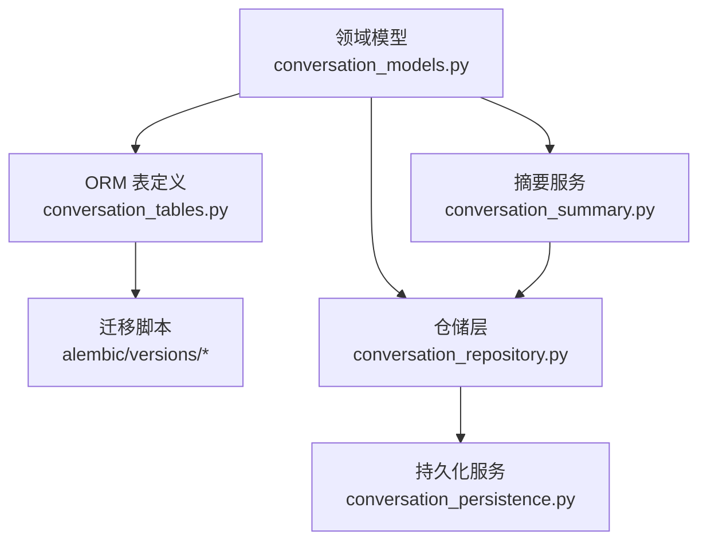
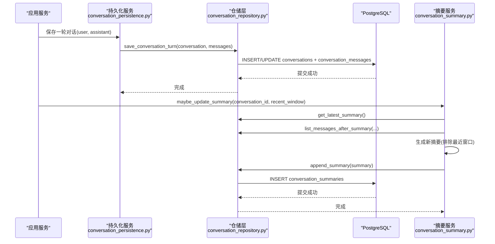
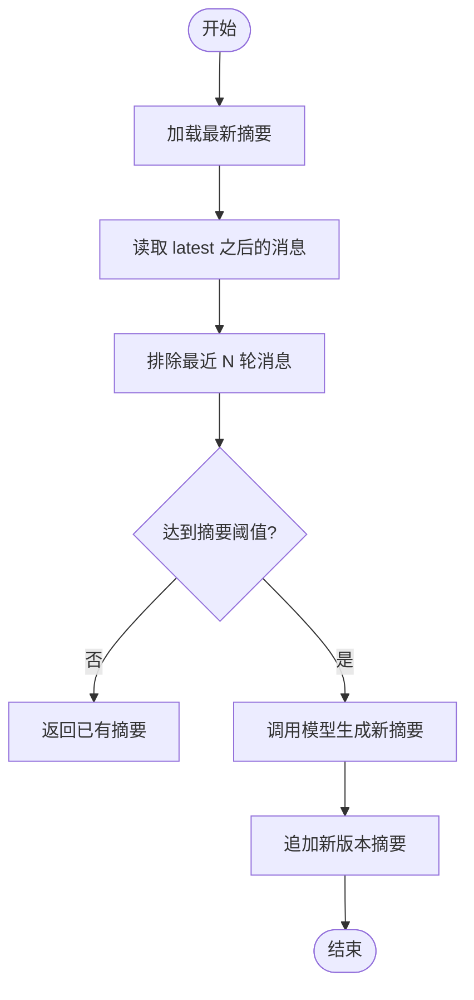
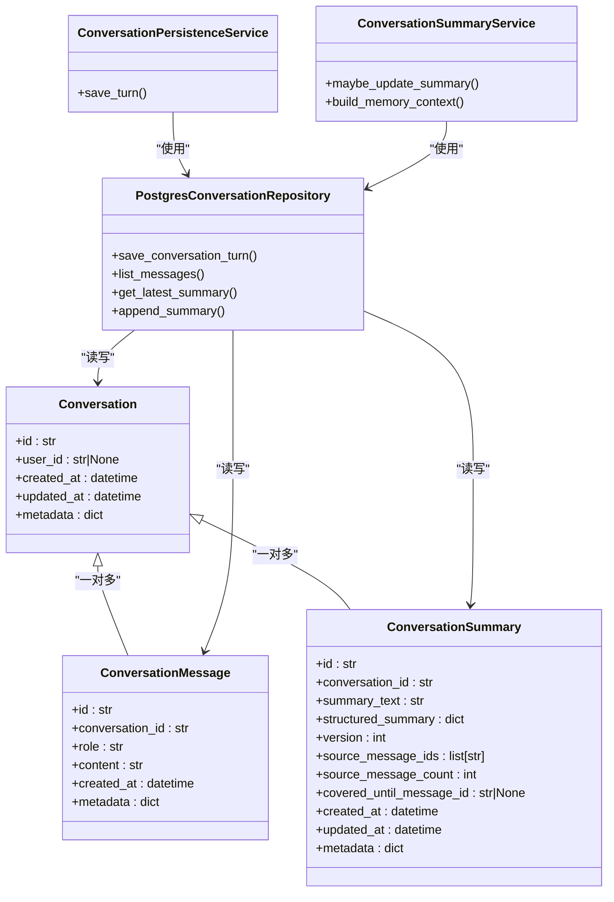

# 对话历史数据模型

<cite>
**本文引用的文件**
- [conversation_tables.py](file://src/fast_app/db/conversation_tables.py)
- [conversation_models.py](file://src/fast_app/domain/conversation_models.py)
- [20260624_0001_create_conversation_tables.py](file://alembic/versions/20260624_0001_create_conversation_tables.py)
- [20260624_0002_create_conversation_summaries.py](file://alembic/versions/20260624_0002_create_conversation_summaries.py)
- [20260713_0006_add_conversation_message_sequence.py](file://alembic/versions/20260713_0006_add_conversation_message_sequence.py)
- [conversation_repository.py](file://src/fast_app/services/conversation/conversation_repository.py)
- [conversation_persistence.py](file://src/fast_app/services/conversation/conversation_persistence.py)
- [conversation_summary.py](file://src/fast_app/services/conversation/conversation_summary.py)
- [14-1-Conversation-Message-数据模型.md](file://learning-docs/phase-14/14-1-Conversation-Message-数据模型.md)
</cite>

## 目录
1. [简介](#简介)
2. [项目结构](#项目结构)
3. [核心组件](#核心组件)
4. [架构总览](#架构总览)
5. [详细组件分析](#详细组件分析)
6. [依赖关系分析](#依赖关系分析)
7. [性能与查询优化](#性能与查询优化)
8. [故障排查指南](#故障排查指南)
9. [结论](#结论)
10. [附录：SQL 示例与归档策略](#附录sql-示例与归档策略)

## 简介
本文件面向“多轮对话”的持久化设计，围绕三张核心表展开：
- conversations：会话容器，记录用户、创建与更新时间以及扩展元数据。
- conversation_messages：消息明细，承载 user/assistant/system 三类发言，提供序列号、时间戳与元数据。
- conversation_summaries：摘要版本，用于长对话的历史压缩与可追溯性，支撑后续 query rewrite 和上下文构建。

文档同时说明多轮上下文的窗口管理（最近 N 轮）、摘要触发与增量更新、消息存储策略（JSONB 元数据）、检索优化（索引与排序），并给出按用户、会话、时间范围等典型查询思路与归档建议。

## 项目结构
对话历史数据模型由领域模型、ORM 表定义、迁移脚本与服务仓储共同构成：
- 领域模型：Pydantic 对象，描述 Conversation、ConversationMessage、ConversationSummary 及其结构化摘要字段。
- ORM 表：SQLAlchemy 表映射到 PostgreSQL，定义主键、外键、JSONB 字段、默认值与索引。
- 迁移脚本：Alembic 版本化建表与索引变更。
- 服务与仓储：封装事务写入、分页读取、摘要生成与追加、最近消息窗口过滤等逻辑。

图表来源
- [conversation_models.py:39-115](file://src/fast_app/domain/conversation_models.py#L39-L115)
- [conversation_tables.py:24-171](file://src/fast_app/db/conversation_tables.py#L24-L171)
- [conversation_repository.py:18-314](file://src/fast_app/services/conversation/conversation_repository.py#L18-L314)
- [conversation_persistence.py:10-64](file://src/fast_app/services/conversation/conversation_persistence.py#L10-L64)
- [conversation_summary.py:72-394](file://src/fast_app/services/conversation/conversation_summary.py#L72-L394)

章节来源
- [conversation_models.py:39-115](file://src/fast_app/domain/conversation_models.py#L39-L115)
- [conversation_tables.py:24-171](file://src/fast_app/db/conversation_tables.py#L24-L171)
- [conversation_repository.py:18-314](file://src/fast_app/services/conversation/conversation_repository.py#L18-L314)
- [conversation_persistence.py:10-64](file://src/fast_app/services/conversation/conversation_persistence.py#L10-L64)
- [conversation_summary.py:72-394](file://src/fast_app/services/conversation/conversation_summary.py#L72-L394)

## 核心组件
- 会话容器 Conversation：唯一会话 ID、可选用户 ID、创建/更新时间、扩展元数据。
- 消息 ConversationMessage：消息 ID、所属会话、角色、正文、创建时间、扩展元数据；通过 sequence_no 保证确定顺序。
- 摘要 ConversationSummary：自然语言摘要、结构化摘要、版本号、来源消息 ID 列表、覆盖到的最后一条消息 ID、创建/更新时间、扩展元数据。

这些模型在仓储层被转换为 ORM 表对象进行持久化，并在摘要服务中参与增量压缩与版本管理。

章节来源
- [conversation_models.py:39-115](file://src/fast_app/domain/conversation_models.py#L39-L115)
- [conversation_tables.py:24-171](file://src/fast_app/db/conversation_tables.py#L24-L171)

## 架构总览
下图展示从业务侧到数据库的完整链路：领域模型经仓储层落库，摘要服务基于最近窗口与历史消息生成新版本摘要，并通过仓库追加到数据库。

图表来源
- [conversation_persistence.py:20-60](file://src/fast_app/services/conversation/conversation_persistence.py#L20-L60)
- [conversation_repository.py:52-81](file://src/fast_app/services/conversation/conversation_repository.py#L52-L81)
- [conversation_repository.py:162-222](file://src/fast_app/services/conversation/conversation_repository.py#L162-L222)
- [conversation_summary.py:140-218](file://src/fast_app/services/conversation/conversation_summary.py#L140-L218)

## 详细组件分析

### 表结构与字段语义
- conversations
  - id：主键，会话标识。
  - user_id：可选的用户标识，用于多用户隔离。
  - created_at / updated_at：带时区的时间戳，自动维护创建与更新时间。
  - metadata_json：JSONB 扩展字段，存放会话级元数据。
- conversation_messages
  - id：消息主键。
  - sequence_no：自增整数，确保同一会话内消息的确定性顺序。
  - conversation_id：外键关联 conversations.id，删除级联。
  - role：消息角色（user/assistant/system）。
  - content：消息正文。
  - created_at：消息创建时间。
  - metadata_json：JSONB 扩展字段，存放消息级元数据。
  - 索引：按 (conversation_id, created_at) 与 (conversation_id, sequence_no) 建立复合索引，支持按会话+时间或会话+序列号高效检索。
- conversation_summaries
  - id：摘要主键。
  - conversation_id：外键关联 conversations.id，删除级联。
  - summary_text：自然语言摘要文本。
  - structured_summary_json：结构化摘要 JSONB，包含目标、约束、决策、未解决问题、用户偏好、重要实体等。
  - version：摘要版本号，支持增量更新。
  - source_message_ids_json：参与生成摘要的原始消息 ID 列表，便于追溯。
  - source_message_count：参与摘要的消息数量。
  - covered_until_message_id：摘要覆盖到的最后一条消息 ID。
  - created_at / updated_at：带时区时间戳。
  - metadata_json：JSONB 扩展字段。
  - 索引：按 (conversation_id, version) 建立复合索引，便于获取最新版本。

章节来源
- [conversation_tables.py:24-171](file://src/fast_app/db/conversation_tables.py#L24-L171)
- [20260624_0001_create_conversation_tables.py:20-76](file://alembic/versions/20260624_0001_create_conversation_tables.py#L20-L76)
- [20260624_0002_create_conversation_summaries.py:20-76](file://alembic/versions/20260624_0002_create_conversation_summaries.py#L20-L76)
- [20260713_0006_add_conversation_message_sequence.py:20-35](file://alembic/versions/20260713_0006_add_conversation_message_sequence.py#L20-L35)

### 多轮对话上下文管理机制
- 消息序列号：使用 sequence_no 作为会话内消息的确定顺序键，避免仅依赖 created_at 带来的并发不确定性。
- 时间戳：created_at 用于辅助排序与时间范围查询；updated_at 用于会话与摘要的最新状态。
- 状态字段：当前模型未引入显式“消息状态”字段，但可通过 metadata_json 标记消息生命周期（如是否已压缩进摘要、是否被重写等）。
- 最近窗口：摘要服务会排除“最近 N 轮”消息，只压缩窗口外的旧消息，保留近期细节供 query rewrite 使用。

章节来源
- [conversation_repository.py:83-105](file://src/fast_app/services/conversation/conversation_repository.py#L83-L105)
- [conversation_summary.py:163-187](file://src/fast_app/services/conversation/conversation_summary.py#L163-L187)
- [conversation_summary.py:321-331](file://src/fast_app/services/conversation/conversation_summary.py#L321-L331)

### 对话摘要实现与版本管理
- 触发条件：当“可压缩消息数”达到阈值且排除最近窗口后仍满足要求时，触发摘要生成。
- 增量更新：以 latest summary 为基础，结合新的旧消息生成新版本，version 递增。
- 可追溯性：source_message_ids 与 source_message_count 记录来源；covered_until_message_id 指明覆盖边界。
- 结构化摘要：structured_summary 固定字段便于 Agent 稳定读取事实，避免将猜测写入长期记忆。

图表来源
- [conversation_summary.py:140-218](file://src/fast_app/services/conversation/conversation_summary.py#L140-L218)
- [conversation_summary.py:238-289](file://src/fast_app/services/conversation/conversation_summary.py#L238-L289)
- [conversation_repository.py:193-222](file://src/fast_app/services/conversation/conversation_repository.py#L193-L222)

章节来源
- [conversation_summary.py:72-394](file://src/fast_app/services/conversation/conversation_summary.py#L72-L394)
- [conversation_repository.py:162-222](file://src/fast_app/services/conversation/conversation_repository.py#L162-L222)

### 消息内容存储策略与元数据处理
- 正文存储：content 使用 Text 类型，适合大段文本。
- 元数据存储：metadata_json 使用 JSONB，支持灵活扩展（如 trace_id、sources、rewritten_query、工具调用结果等）。
- 序列化/反序列化：仓储层负责 Pydantic 模型与 ORM 表之间的转换，结构化摘要通过 model_dump()/model_validate() 与 JSONB 字段互转。

章节来源
- [conversation_tables.py:60-105](file://src/fast_app/db/conversation_tables.py#L60-L105)
- [conversation_repository.py:225-310](file://src/fast_app/services/conversation/conversation_repository.py#L225-L310)

### 检索优化
- 索引设计：
  - conversation_messages 上建立 (conversation_id, created_at) 与 (conversation_id, sequence_no) 复合索引，支持按会话+时间或会话+序列号的高效排序与分页。
  - conversation_summaries 上建立 (conversation_id, version) 复合索引，支持快速定位最新版本。
- 排序策略：优先使用 sequence_no 升序，确保消息顺序确定性；时间范围查询可结合 created_at。
- 分页与限制：list_messages 支持 limit 与 offset，避免全量拉取。

章节来源
- [conversation_tables.py:94-105](file://src/fast_app/db/conversation_tables.py#L94-L105)
- [conversation_tables.py:164-170](file://src/fast_app/db/conversation_tables.py#L164-L170)
- [conversation_repository.py:83-105](file://src/fast_app/services/conversation/conversation_repository.py#L83-L105)

## 依赖关系分析
- 领域模型依赖：无外部强依赖，仅使用标准库与 Pydantic。
- ORM 表依赖：SQLAlchemy 与 PostgreSQL JSONB 方言。
- 仓储层依赖：AsyncSession、SQLAlchemy Select，负责 SQL 构造与结果映射。
- 持久化服务依赖：领域模型与仓储层，封装一轮对话的原子写入。
- 摘要服务依赖：配置、仓储层、LLM（可选），负责摘要生成与版本管理。

图表来源
- [conversation_models.py:39-115](file://src/fast_app/domain/conversation_models.py#L39-L115)
- [conversation_repository.py:18-314](file://src/fast_app/services/conversation/conversation_repository.py#L18-L314)
- [conversation_persistence.py:10-64](file://src/fast_app/services/conversation/conversation_persistence.py#L10-L64)
- [conversation_summary.py:72-394](file://src/fast_app/services/conversation/conversation_summary.py#L72-L394)

章节来源
- [conversation_repository.py:18-314](file://src/fast_app/services/conversation/conversation_repository.py#L18-L314)
- [conversation_persistence.py:10-64](file://src/fast_app/services/conversation/conversation_persistence.py#L10-L64)
- [conversation_summary.py:72-394](file://src/fast_app/services/conversation/conversation_summary.py#L72-L394)

## 性能与查询优化
- 使用 sequence_no 排序：相比仅依赖 created_at，sequence_no 能提供更稳定的顺序，减少并发写入导致的乱序风险。
- 复合索引：
  - (conversation_id, created_at)：支持按会话+时间范围查询。
  - (conversation_id, sequence_no)：支持按会话+序列号分页。
  - (conversation_id, version)：支持快速获取最新版本摘要。
- 分页与限制：list_messages 使用 limit/offset，避免全量扫描。
- 摘要触发阈值：通过配置控制何时压缩旧消息，降低频繁 LLM 调用成本。
- 最近窗口排除：避免重复压缩近期消息，提升摘要效率与质量。

[本节为通用性能建议，不直接分析具体代码行]

## 故障排查指南
- 摘要模型不可用：当配置关闭或未启用 Qwen provider 时，摘要服务降级为返回已有摘要，需检查配置与密钥。
- 结构化输出失败：若 json_mode 失败，会回退到普通文本链解析；如遇解析错误，需检查模型返回格式与 Prompt 约束。
- 事务异常：save_conversation_turn 在 commit 失败时会回滚，避免半成功状态；需关注日志中的异常类型与堆栈。
- 越权访问：读取消息时应通过 user_id + conversation_id 联合校验，避免裸 session_id 导致的数据泄露。

章节来源
- [conversation_summary.py:113-138](file://src/fast_app/services/conversation/conversation_summary.py#L113-L138)
- [conversation_summary.py:291-318](file://src/fast_app/services/conversation/conversation_summary.py#L291-L318)
- [conversation_repository.py:52-81](file://src/fast_app/services/conversation/conversation_repository.py#L52-L81)
- [conversation_repository.py:107-134](file://src/fast_app/services/conversation/conversation_repository.py#L107-L134)

## 结论
该数据模型通过清晰的三层结构（会话、消息、摘要）实现了多轮对话的持久化与历史压缩。借助序列号、时间戳与 JSONB 元数据，系统既能保证消息顺序与可扩展性，又能通过索引与分页优化检索性能。摘要机制在不丢失近期细节的前提下，对长对话进行可追溯的版本化管理，为后续的 query rewrite 与上下文构建提供了坚实基础。

[本节为总结性内容，不直接分析具体代码行]

## 附录：SQL 示例与归档策略

### 典型查询思路（概念性示例）
- 按用户与会话查询最近消息：
  - 使用 WHERE conversation_id = ? AND user_id = ?，ORDER BY sequence_no ASC，LIMIT N。
- 按时间范围查询消息：
  - 使用 WHERE conversation_id = ? AND created_at BETWEEN ? AND ?，ORDER BY created_at ASC。
- 获取会话最新摘要：
  - 使用 WHERE conversation_id = ? ORDER BY version DESC LIMIT 1。

注意：以上为概念性查询思路，实际 SQL 应结合现有索引与分页参数编写，避免全表扫描。

### 数据归档与存储空间管理建议
- 冷热分层：
  - 热数据：最近 N 轮消息与最新摘要，保持高频访问。
  - 冷数据：早期消息与历史摘要，可考虑归档至低成本存储或分区表。
- 摘要压缩：
  - 定期触发摘要生成，减少上下文长度，降低 LLM 调用成本。
- 元数据清理：
  - 定期清理 metadata_json 中的临时字段，避免膨胀。
- 索引维护：
  - 监控索引大小与命中率，必要时重建或调整索引策略。
- 生命周期策略：
  - 根据业务需求设置消息与摘要的保留周期，到期后归档或删除。

[本节为通用归档建议，不直接分析具体代码行]