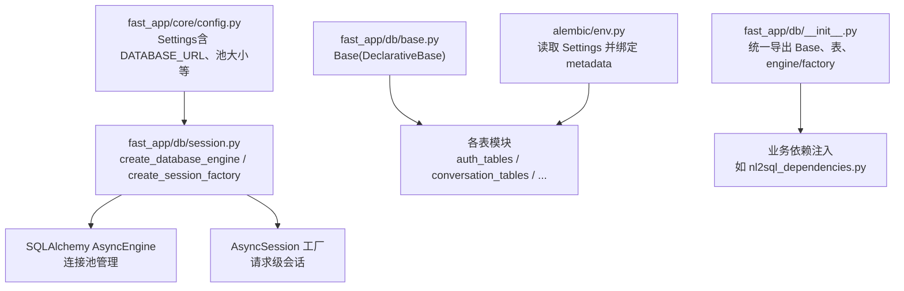
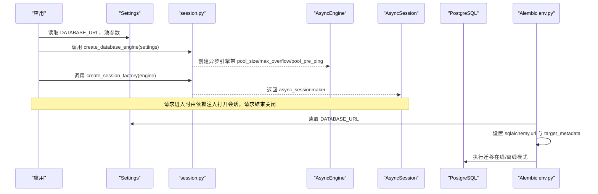
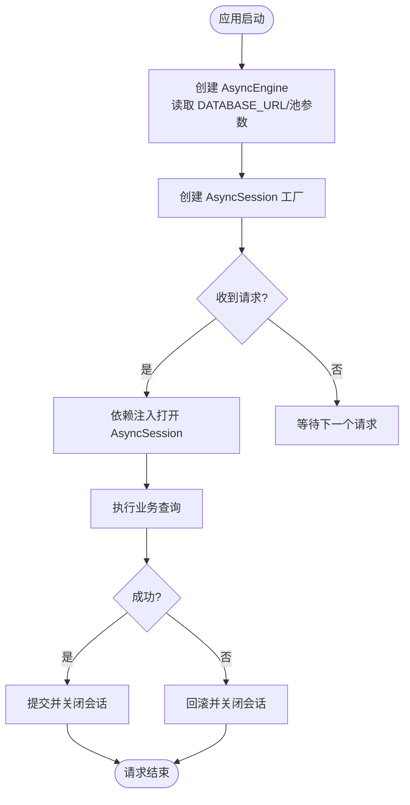
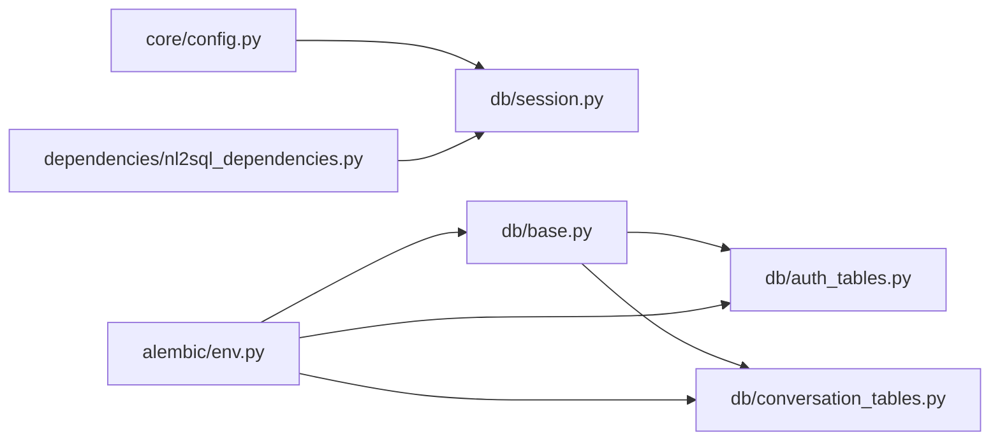

# 数据库基础配置

<cite>
**本文引用的文件**
- [src/fast_app/db/base.py](file://src/fast_app/db/base.py)
- [src/fast_app/db/session.py](file://src/fast_app/db/session.py)
- [src/fast_app/core/config.py](file://src/fast_app/core/config.py)
- [alembic/env.py](file://alembic/env.py)
- [src/fast_app/db/__init__.py](file://src/fast_app/db/__init__.py)
- [src/fast_app/db/auth_tables.py](file://src/fast_app/db/auth_tables.py)
- [src/fast_app/db/conversation_tables.py](file://src/fast_app/db/conversation_tables.py)
- [src/fast_app/dependencies/nl2sql_dependencies.py](file://src/fast_app/dependencies/nl2sql_dependencies.py)
</cite>

## 目录
1. [简介](#简介)
2. [项目结构](#项目结构)
3. [核心组件](#核心组件)
4. [架构总览](#架构总览)
5. [详细组件分析](#详细组件分析)
6. [依赖关系分析](#依赖关系分析)
7. [性能与连接池调优](#性能与连接池调优)
8. [故障排查指南](#故障排查指南)
9. [结论](#结论)
10. [附录：扩展指南](#附录：扩展指南)

## 简介
本文件面向开发者，系统化说明本项目基于 SQLAlchemy 的数据库基础配置与使用方式。内容涵盖：
- SQLAlchemy Base 基类的设计模式
- 异步 Session 会话管理与请求级生命周期
- 数据库引擎初始化、连接池参数与连接复用策略
- 数据库连接字符串配置、超时与回退机制
- 事务处理边界与最佳实践
- Alembic 迁移集成与模型注册
- 常见错误定位与性能优化建议

## 项目结构
数据库相关代码集中在 fast_app/db 包中，并通过 alembic/env.py 与 ORM 模型和配置进行集成；业务层通过 FastAPI 依赖注入获取 AsyncSession 执行查询。

图表来源
- [src/fast_app/core/config.py:520-535](file://src/fast_app/core/config.py#L520-L535)
- [src/fast_app/db/session.py:11-32](file://src/fast_app/db/session.py#L11-L32)
- [src/fast_app/db/base.py:1-8](file://src/fast_app/db/base.py#L1-L8)
- [alembic/env.py:18-34](file://alembic/env.py#L18-L34)
- [src/fast_app/db/__init__.py:1-44](file://src/fast_app/db/__init__.py#L1-L44)

章节来源
- [src/fast_app/db/base.py:1-8](file://src/fast_app/db/base.py#L1-L8)
- [src/fast_app/db/session.py:1-33](file://src/fast_app/db/session.py#L1-L33)
- [src/fast_app/core/config.py:520-535](file://src/fast_app/core/config.py#L520-L535)
- [alembic/env.py:18-84](file://alembic/env.py#L18-L84)
- [src/fast_app/db/__init__.py:1-78](file://src/fast_app/db/__init__.py#L1-L78)

## 核心组件
- Base 基类：所有 ORM 表继承自 DeclarativeBase，集中管理元数据与表声明。
- 引擎与会话工厂：根据 Settings 创建异步 Engine 与 AsyncSession 工厂，支持连接池与预检查。
- 配置中心：Settings 提供数据库 URL、是否打印 SQL、连接池大小与溢出上限等关键参数。
- Alembic 集成：迁移脚本从 Settings 读取数据库 URL，并将所有表的 metadata 注册到目标元数据。
- 依赖注入：业务层通过 FastAPI 依赖注入获取 AsyncSession，实现请求级会话生命周期管理。

章节来源
- [src/fast_app/db/base.py:1-8](file://src/fast_app/db/base.py#L1-L8)
- [src/fast_app/db/session.py:11-32](file://src/fast_app/db/session.py#L11-L32)
- [src/fast_app/core/config.py:520-535](file://src/fast_app/core/config.py#L520-L535)
- [alembic/env.py:18-34](file://alembic/env.py#L18-L34)
- [src/fast_app/dependencies/nl2sql_dependencies.py:1-27](file://src/fast_app/dependencies/nl2sql_dependencies.py#L1-L27)

## 架构总览
下图展示了从配置到引擎、会话再到业务层的完整链路，以及 Alembic 如何接入同一套模型与配置。

图表来源
- [src/fast_app/core/config.py:520-535](file://src/fast_app/core/config.py#L520-L535)
- [src/fast_app/db/session.py:11-32](file://src/fast_app/db/session.py#L11-L32)
- [alembic/env.py:18-84](file://alembic/env.py#L18-L84)

## 详细组件分析

### SQLAlchemy Base 基类设计
- 采用 DeclarativeBase 作为统一基类，所有表模型继承该基类以共享元数据与映射行为。
- 优点：集中管理 metadata、简化表定义、便于 Alembic 自动发现模型变更。

章节来源
- [src/fast_app/db/base.py:1-8](file://src/fast_app/db/base.py#L1-L8)

### 会话管理与连接池配置
- 引擎创建：使用 create_async_engine，传入 database_url、echo、pool_size、max_overflow、pool_pre_ping。
- 会话工厂：使用 async_sessionmaker 绑定引擎，expire_on_commit=False 避免提交后再次访问属性触发额外查询。
- 请求级会话：通过 FastAPI 依赖注入在请求开始时创建会话，结束时释放，确保连接复用与资源安全。

图表来源
- [src/fast_app/db/session.py:11-32](file://src/fast_app/db/session.py#L11-L32)

章节来源
- [src/fast_app/db/session.py:11-32](file://src/fast_app/db/session.py#L11-L32)

### 数据库连接字符串与配置项
- 连接字符串：DATABASE_URL 默认指向 PostgreSQL 异步驱动。
- 调试开关：DATABASE_ECHO 控制是否输出 SQL 日志。
- 连接池：DATABASE_POOL_SIZE 与 DATABASE_MAX_OVERFLOW 控制常驻连接数与临时溢出连接数。
- 健康检查：pool_pre_ping=True 在每次借出连接前进行探测，降低死连接风险。

章节来源
- [src/fast_app/core/config.py:520-535](file://src/fast_app/core/config.py#L520-L535)
- [src/fast_app/db/session.py:11-20](file://src/fast_app/db/session.py#L11-L20)

### 事务处理与连接复用策略
- 事务边界：建议在业务服务层或依赖注入中显式包裹事务，确保一致性。
- 连接复用：通过连接池复用底层 TCP 连接，减少握手开销；请求结束后归还连接。
- 提交策略：expire_on_commit=False 可减少重复加载属性的额外查询，提高吞吐。

章节来源
- [src/fast_app/db/session.py:23-32](file://src/fast_app/db/session.py#L23-L32)

### Alembic 迁移集成
- 迁移入口：alembic/env.py 从 Settings 读取 DATABASE_URL，并设置 sqlalchemy.url。
- 模型注册：target_metadata=Base.metadata，确保所有表模型被迁移系统识别。
- 执行模式：支持离线生成 SQL 与在线执行迁移；在线模式通过异步引擎执行同步迁移函数。

章节来源
- [alembic/env.py:18-84](file://alembic/env.py#L18-L84)

### 表模型示例与关系
- 认证域：用户、角色、权限、部门及其多对多关系，包含索引与级联删除策略。
- 对话域：会话容器、消息序列、摘要版本化存储，附带时间戳与 JSONB 元数据。
- 这些表均继承自 Base，便于 Alembic 统一管理。

章节来源
- [src/fast_app/db/auth_tables.py:13-431](file://src/fast_app/db/auth_tables.py#L13-L431)
- [src/fast_app/db/conversation_tables.py:24-171](file://src/fast_app/db/conversation_tables.py#L24-L171)

## 依赖关系分析
- 配置依赖：session.py 依赖 core.config.Settings 获取数据库 URL 与池参数。
- 模型依赖：alembic/env.py 导入 Base 与各表模块，将 metadata 暴露给迁移系统。
- 业务依赖：nl2sql_dependencies.py 通过 FastAPI 依赖注入获取 AsyncSession，供 NL2SQL 服务使用。

图表来源
- [src/fast_app/core/config.py:520-535](file://src/fast_app/core/config.py#L520-L535)
- [src/fast_app/db/session.py:11-32](file://src/fast_app/db/session.py#L11-L32)
- [alembic/env.py:18-34](file://alembic/env.py#L18-L34)
- [src/fast_app/db/auth_tables.py:1-20](file://src/fast_app/db/auth_tables.py#L1-L20)
- [src/fast_app/db/conversation_tables.py:1-22](file://src/fast_app/db/conversation_tables.py#L1-L22)
- [src/fast_app/dependencies/nl2sql_dependencies.py:1-27](file://src/fast_app/dependencies/nl2sql_dependencies.py#L1-L27)

章节来源
- [src/fast_app/db/__init__.py:1-44](file://src/fast_app/db/__init__.py#L1-L44)
- [src/fast_app/dependencies/nl2sql_dependencies.py:1-27](file://src/fast_app/dependencies/nl2sql_dependencies.py#L1-L27)

## 性能与连接池调优
- 连接池大小：DATABASE_POOL_SIZE 应结合并发请求数与数据库最大连接数设置；过大可能导致数据库压力，过小会导致排队等待。
- 溢出连接：DATABASE_MAX_OVERFLOW 允许短时突发流量借用额外连接，但需监控数据库负载。
- 连接健康：pool_pre_ping=True 可检测失效连接并重建，提升稳定性。
- SQL 日志：开发环境开启 DATABASE_ECHO 便于调试，生产环境建议关闭以减少 IO。
- 会话过期：expire_on_commit=False 减少提交后的额外查询，适合读多写少场景。
- 查询超时：当前未直接配置 SQLAlchemy 查询超时；可在上层服务或驱动层设置超时，并结合重试与降级策略。
- 连接泄漏检测：确保每个请求都正确关闭会话；可通过中间件或依赖注入上下文管理器保证释放。

[本节为通用指导，不直接分析具体文件]

## 故障排查指南
- 无法连接数据库：检查 DATABASE_URL 是否正确，网络可达性与凭据无误。
- 连接池耗尽：观察并发峰值与 DATABASE_POOL_SIZE/DATABASE_MAX_OVERFLOW 配置，必要时扩容或限流。
- 慢查询：开启 DATABASE_ECHO 定位 SQL，结合数据库 EXPLAIN 分析索引与执行计划。
- 迁移失败：确认 alembic/env.py 已正确设置 sqlalchemy.url 与 target_metadata；核对模型变更与迁移脚本一致性。
- 会话未释放：检查依赖注入是否正确打开/关闭会话，避免请求结束后仍持有连接。

章节来源
- [src/fast_app/core/config.py:520-535](file://src/fast_app/core/config.py#L520-L535)
- [src/fast_app/db/session.py:11-32](file://src/fast_app/db/session.py#L11-L32)
- [alembic/env.py:18-84](file://alembic/env.py#L18-L84)

## 结论
本项目采用 SQLAlchemy 异步栈与 Alembic 迁移，通过统一的 Base 基类与集中配置实现可扩展、可维护的数据库基础设施。借助连接池与健康检查提升稳定性，配合请求级会话管理保障资源安全。开发者可在此基础上快速扩展新表与新服务，同时遵循事务边界与性能调优建议，确保系统在规模增长时的可靠性与效率。

[本节为总结性内容，不直接分析具体文件]

## 附录：扩展指南
- 新增表模型：
  - 在对应表模块中定义继承自 Base 的表类，合理设置主键、外键、索引与约束。
  - 运行 Alembic 生成并执行迁移，确保数据库结构与代码一致。
- 新增数据库源：
  - 在 Settings 中增加新的连接字符串与池参数。
  - 在 session.py 中扩展引擎创建逻辑，或按模块拆分引擎工厂。
- 事务封装：
  - 在服务层封装事务边界，确保异常时回滚，成功时提交。
- 监控与告警：
  - 记录连接池使用率、慢查询与错误率，结合数据库指标进行容量规划。

[本节为概念性指导，不直接分析具体文件]