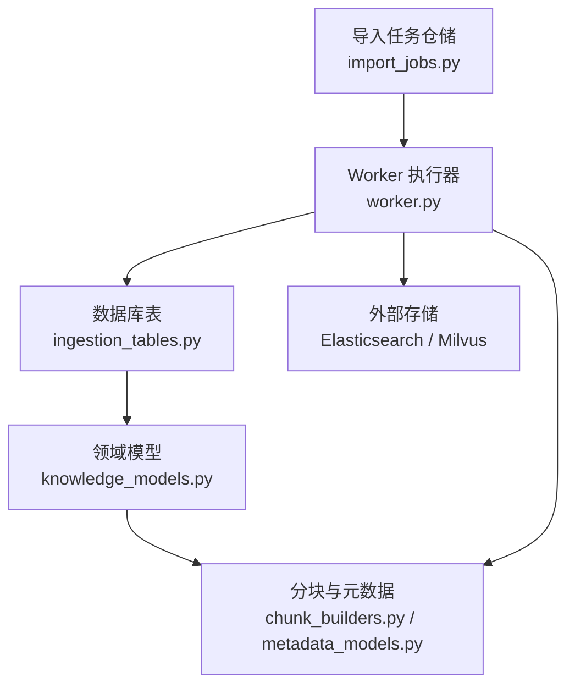
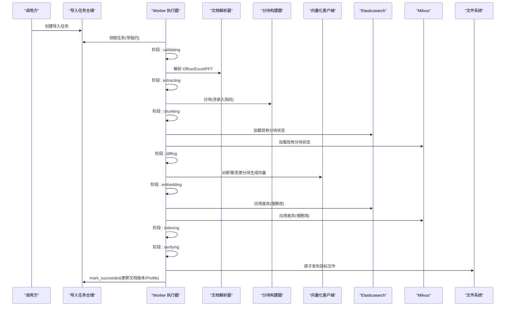
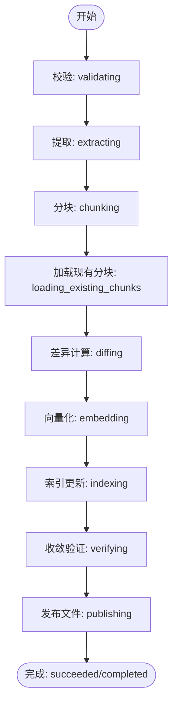
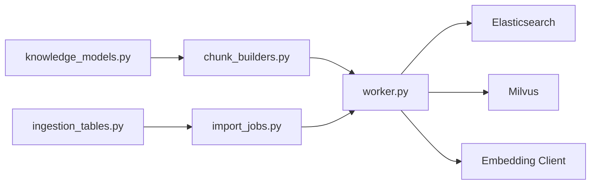
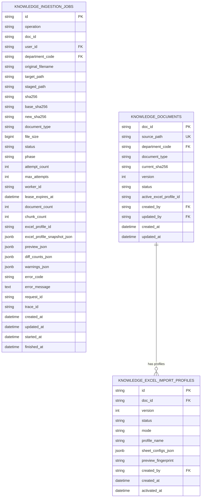

# 文档导入数据模型

<cite>
**本文引用的文件**
- [ingestion_tables.py](file://src/fast_app/db/ingestion_tables.py)
- [knowledge_models.py](file://src/fast_app/domain/knowledge_models.py)
- [import_jobs.py](file://src/fast_app/ingestion/import_jobs.py)
- [worker.py](file://src/fast_app/ingestion/worker.py)
- [chunk_builders.py](file://src/fast_app/ingestion/processing/chunk_builders.py)
- [metadata_models.py](file://src/fast_app/ingestion/processing/metadata_models.py)
</cite>

## 目录
1. [简介](#简介)
2. [项目结构](#项目结构)
3. [核心组件](#核心组件)
4. [架构总览](#架构总览)
5. [详细组件分析](#详细组件分析)
6. [依赖关系分析](#依赖关系分析)
7. [性能考虑](#性能考虑)
8. [故障排查指南](#故障排查指南)
9. [结论](#结论)
10. [附录](#附录)

## 简介
本文件聚焦于知识库文档导入的数据模型与处理流水线，围绕以下目标展开：
- 详细说明导入作业表、文档版本表和分块表（以领域模型为主）的结构设计。
- 解释文档处理的流水线状态管理：解析、分块、向量化和索引构建各阶段。
- 说明文档元数据的存储格式与版本控制机制。
- 描述批量导入的任务调度、进度跟踪与错误处理的数据结构设计。
- 提供文档检索的关联查询示例与性能优化建议。
- 解释数据清理策略与存储空间管理方案。

## 项目结构
与导入相关的关键代码分布在数据库表定义、领域模型、导入任务仓储、Worker 执行器以及分块与元数据处理模块中：
- 数据库表定义：导入作业、文档注册、Excel 导入配置快照。
- 领域模型：LoadedDocument、KnowledgeChunk 等内存数据结构。
- 导入任务仓储：任务创建、领取、租约、阶段推进、成功/失败落盘。
- Worker 执行器：端到端编排解析、分块、向量、索引、发布与回滚。
- 分块与元数据：Markdown/Office 分块策略、稳定 ID 生成、权限元数据规范化。

图表来源
- [ingestion_tables.py:24-196](file://src/fast_app/db/ingestion_tables.py#L24-L196)
- [knowledge_models.py:8-109](file://src/fast_app/domain/knowledge_models.py#L8-L109)
- [chunk_builders.py:14-202](file://src/fast_app/ingestion/processing/chunk_builders.py#L14-L202)
- [metadata_models.py:21-367](file://src/fast_app/ingestion/processing/metadata_models.py#L21-L367)
- [import_jobs.py:86-525](file://src/fast_app/ingestion/import_jobs.py#L86-L525)
- [worker.py:94-419](file://src/fast_app/ingestion/worker.py#L94-L419)

章节来源
- [ingestion_tables.py:24-196](file://src/fast_app/db/ingestion_tables.py#L24-L196)
- [knowledge_models.py:8-109](file://src/fast_app/domain/knowledge_models.py#L8-L109)
- [import_jobs.py:86-525](file://src/fast_app/ingestion/import_jobs.py#L86-L525)
- [worker.py:94-419](file://src/fast_app/ingestion/worker.py#L94-L419)
- [chunk_builders.py:14-202](file://src/fast_app/ingestion/processing/chunk_builders.py#L14-L202)
- [metadata_models.py:21-367](file://src/fast_app/ingestion/processing/metadata_models.py#L21-L367)

## 核心组件
- 导入作业表（knowledge_ingestion_jobs）：记录一次导入任务的输入、归属、状态机、租约、结果与追踪信息。
- 文档版本表（knowledge_documents）：维护服务端文档身份、目标路径、当前已提交版本与激活的 Excel Profile 指针。
- Excel 导入配置表（knowledge_excel_import_profiles）：保存用户确认的字段映射与导入模式快照，支持多版本与激活切换。
- 领域模型 LoadedDocument/KnowledgeChunk：贯穿解析、分块、向量化与索引阶段的内存数据结构。
- 导入任务仓储 KnowledgeImportJobRepository：封装任务持久化、并发领取、租约续期、阶段推进与终态提交。
- Worker KnowledgeImportWorker：编排完整导入流程，包含校验、解析、分块、差异同步、向量化、索引更新、验证与发布。
- 分块与元数据模块：负责 Markdown/Office 的分块策略、稳定 ID 生成、权限元数据规范化与写入。

章节来源
- [ingestion_tables.py:24-196](file://src/fast_app/db/ingestion_tables.py#L24-L196)
- [knowledge_models.py:8-109](file://src/fast_app/domain/knowledge_models.py#L8-L109)
- [import_jobs.py:86-525](file://src/fast_app/ingestion/import_jobs.py#L86-L525)
- [worker.py:94-419](file://src/fast_app/ingestion/worker.py#L94-L419)
- [chunk_builders.py:14-202](file://src/fast_app/ingestion/processing/chunk_builders.py#L14-L202)
- [metadata_models.py:21-367](file://src/fast_app/ingestion/processing/metadata_models.py#L21-L367)

## 架构总览
导入系统采用“任务驱动 + 工作进程”的架构：
- API/上层服务创建导入任务并持久化到数据库。
- Worker 周期性领取待执行任务，持有租约执行处理。
- 处理过程分为多个阶段：校验、提取、分块、加载现有分块、计算差异、向量化、索引更新、收敛验证、发布文件、提交终态。
- 双写存储：Elasticsearch（关键词/全文）与 Milvus（向量），通过增量差异应用保证一致性。
- 失败恢复：崩溃后可由其他 Worker 接管，按 Create/Update 操作语义进行清理或向前修复。

图表来源
- [worker.py:116-419](file://src/fast_app/ingestion/worker.py#L116-L419)
- [import_jobs.py:297-452](file://src/fast_app/ingestion/import_jobs.py#L297-L452)
- [chunk_builders.py:79-202](file://src/fast_app/ingestion/processing/chunk_builders.py#L79-L202)
- [metadata_models.py:21-46](file://src/fast_app/ingestion/processing/metadata_models.py#L21-L46)

## 详细组件分析

### 导入作业表（knowledge_ingestion_jobs）
- 作用：持久化一次导入任务的状态机、租约、结果与追踪信息。
- 关键字段：
  - id：任务主键。
  - operation：create/update，决定失败时的清理/修复策略。
  - doc_id：关联文档标识。
  - user_id/department_code：归属与权限边界。
  - original_filename/target_path/staged_path：原始文件名、目标路径、暂存路径。
  - sha256/base_sha256/new_sha256：内容哈希，用于版本冲突检测与回滚决策。
  - document_type/file_size：文档类型与大小。
  - status/phase：终态与运行期细粒度阶段（pending/running/awaiting_configuration/succeeded/failed；queued/validating/extracting/chunking/loading_existing_chunks/diffing/embedding/indexing/verifying/publishing/completed）。
  - attempt_count/max_attempts：重试次数控制。
  - worker_id/lease_expires_at：租约所有权与过期时间。
  - document_count/chunk_count：产出统计。
  - excel_profile_id/excel_profile_snapshot_json：Excel 导入配置快照。
  - preview_json/diff_counts_json/warnings_json/error_code/error_message/request_id/trace_id：中间产物与追踪。
  - created_at/updated_at/started_at/finished_at：生命周期时间戳。
- 索引与约束：
  - 基于 user_id、created_at、status 的复合索引便于查询。
  - 唯一约束限制同一路径同时存在多个活动任务（pending/running/awaiting_configuration）。

章节来源
- [ingestion_tables.py:24-120](file://src/fast_app/db/ingestion_tables.py#L24-L120)
- [import_jobs.py:22-26](file://src/fast_app/ingestion/import_jobs.py#L22-L26)

### 文档版本表（knowledge_documents）
- 作用：服务端文档的身份、目标路径与当前已提交版本。
- 关键字段：
  - doc_id：主键，稳定标识。
  - source_path：唯一的目标路径。
  - department_code/document_type：部门与类型。
  - current_sha256/version/status：当前哈希、版本号、状态（pending/active）。
  - active_excel_profile_id：指向当前生效的 Excel 导入配置。
  - created_by/updated_by：操作者。
  - created_at/updated_at：时间戳。
- 版本控制机制：
  - 成功提交时 version 自增，current_sha256 更新为 new/sha256。
  - 与 Update 操作的 base_sha256 配合实现乐观锁，避免并发覆盖。

章节来源
- [ingestion_tables.py:123-162](file://src/fast_app/db/ingestion_tables.py#L123-L162)
- [import_jobs.py:404-452](file://src/fast_app/ingestion/import_jobs.py#L404-L452)

### Excel 导入配置表（knowledge_excel_import_profiles）
- 作用：保存经用户确认的 Excel 字段身份、主键与导入模式快照。
- 关键字段：
  - id/doc_id/version/status/mode/profile_name：配置标识、文档关联、版本、状态、模式与名称。
  - sheet_configs_json：工作表配置 JSON。
  - preview_fingerprint：预览指纹，用于防抖与并发保护。
  - created_by/activated_at：创建者与激活时间。
- 版本与激活：
  - 同一文档多版本共存，最新激活版本被文档表指针引用。
  - 新激活时将旧 active 标记为 superseded。

章节来源
- [ingestion_tables.py:164-196](file://src/fast_app/db/ingestion_tables.py#L164-L196)
- [import_jobs.py:241-295](file://src/fast_app/ingestion/import_jobs.py#L241-L295)

### 领域模型：LoadedDocument 与 KnowledgeChunk
- LoadedDocument：承载原始文档路径、未切分内容、文档类型与文档级元数据。
- KnowledgeChunk：承载分块 ID、文本内容、来源、标题、分块级元数据与可选检索文本。
- 用途：在解析、分块、向量化、索引构建过程中作为统一数据载体。

章节来源
- [knowledge_models.py:8-109](file://src/fast_app/domain/knowledge_models.py#L8-L109)

### 分块构建与元数据
- 分块选项 ChunkBuildOptions：source、max_chars、overlap_chars、max_tokens、min_chars。
- MarkdownChunkBuilder：按标题层级构建章节，使用 TextSplitter 滑动窗口切分，生成稳定 chunk_id 与元数据。
- 元数据生成：
  - build_doc_id/build_chunk_id：基于路径与章节路径的稳定 ID。
  - build_document_metadata：文档级基础字段与权限元数据。
  - build_permission_metadata：从规则文件与 sidecar 合并权限，规范化 visibility/allowed_departments/allowed_users。
  - build_chunk_metadata：在文档元数据基础上补充 chunk_id/title/section_path/heading_level/section_index/chunk_index。

章节来源
- [chunk_builders.py:14-202](file://src/fast_app/ingestion/processing/chunk_builders.py#L14-L202)
- [metadata_models.py:21-367](file://src/fast_app/ingestion/processing/metadata_models.py#L21-L367)

### Worker 流水线与状态管理
- 阶段推进：validating → extracting → chunking → loading_existing_chunks → diffing → embedding → indexing → verifying → publishing → completed。
- 租约与心跳：每 60 秒续租，防止长耗时阶段丢失所有权。
- 差异同步：对比 ES/Milvus 现有分块状态，仅对新增/变更分块进行向量化与索引更新。
- 发布与提交：先完成双存储收敛，再原子发布目标文件，最后提交任务成功并更新文档版本与 Profile。
- 失败与恢复：
  - 可重试外部故障：有限退避后重新入队。
  - 永久失败：清理 staging 与必要产物，记录错误码与消息。
  - 崩溃恢复：Create 清理新建产物；Update 根据文件提交点选择回滚或向前修复。

图表来源
- [worker.py:268-419](file://src/fast_app/ingestion/worker.py#L268-L419)
- [import_jobs.py:359-452](file://src/fast_app/ingestion/import_jobs.py#L359-L452)

章节来源
- [worker.py:94-419](file://src/fast_app/ingestion/worker.py#L94-L419)
- [import_jobs.py:297-452](file://src/fast_app/ingestion/import_jobs.py#L297-L452)

## 依赖关系分析
- 数据库层：ingestion_tables.py 定义三张核心表，提供任务、文档与配置快照的持久化能力。
- 领域层：knowledge_models.py 提供内存数据结构，供解析与分块模块复用。
- 处理层：chunk_builders.py 与 metadata_models.py 实现分块策略与元数据规范化。
- 执行层：import_jobs.py 提供任务仓储，worker.py 编排端到端流程。
- 外部依赖：Elasticsearch 与 Milvus 作为双写存储，embedding 客户端用于向量化。

图表来源
- [ingestion_tables.py:24-196](file://src/fast_app/db/ingestion_tables.py#L24-L196)
- [knowledge_models.py:8-109](file://src/fast_app/domain/knowledge_models.py#L8-L109)
- [chunk_builders.py:14-202](file://src/fast_app/ingestion/processing/chunk_builders.py#L14-L202)
- [import_jobs.py:86-525](file://src/fast_app/ingestion/import_jobs.py#L86-L525)
- [worker.py:94-419](file://src/fast_app/ingestion/worker.py#L94-L419)

章节来源
- [ingestion_tables.py:24-196](file://src/fast_app/db/ingestion_tables.py#L24-L196)
- [knowledge_models.py:8-109](file://src/fast_app/domain/knowledge_models.py#L8-L109)
- [chunk_builders.py:14-202](file://src/fast_app/ingestion/processing/chunk_builders.py#L14-L202)
- [import_jobs.py:86-525](file://src/fast_app/ingestion/import_jobs.py#L86-L525)
- [worker.py:94-419](file://src/fast_app/ingestion/worker.py#L94-L419)

## 性能考虑
- 分块策略优化：
  - 使用 max_chars/min_chars/overlap_chars 控制窗口大小与重叠，减少重复与碎片。
  - 结合 max_tokens 估算 token 长度，避免过大分块导致向量化与检索成本上升。
- 差异同步：
  - 仅对新增/变更分块进行向量化与索引更新，降低外部服务压力。
  - 通过 load_es_chunk_states/load_milvus_chunk_states 并行加载状态，提升吞吐。
- 并发与租约：
  - SKIP LOCKED 与 with_for_update 确保多 Worker 无锁竞争领取任务。
  - 心跳续租保障长耗时阶段不丢失所有权。
- 存储优化：
  - 双写存储分别承担关键词与向量检索职责，查询时可按需路由。
  - 稳定 ID 与元数据规范化减少索引重建与过滤开销。

[本节为通用性能指导，无需特定文件来源]

## 故障排查指南
- 常见错误码与场景：
  - KNOWLEDGE_IMPORT_CONFLICT：同名文档已有活动导入任务。
  - KNOWLEDGE_IMPORT_JOB_NOT_FOUND：任务不存在或无权感知。
  - KNOWLEDGE_IMPORT_INVALID_FILE：上传文件名、部门或 OOXML 内容不符合约束。
  - KNOWLEDGE_IMPORT_FILE_TOO_LARGE：文件大小超过上限。
  - KNOWLEDGE_DOCUMENT_VERSION_CONFLICT：客户端基于的文档版本已变化。
  - EXCEL_PREVIEW_CHANGED：用户确认的预览并非最近一次生成的预览。
  - KNOWLEDGE_IMPORT_STAGING_MISSING：暂存文件缺失或哈希不一致。
  - KNOWLEDGE_IMPORT_PARSE_FAILED：Office 文档解析失败。
  - KNOWLEDGE_IMPORT_CHUNK_VALIDATION_FAILED：分块校验失败。
  - KNOWLEDGE_IMPORT_ROLLBACK_FAILED：回滚失败，保留旧文件与 staging 供排查。
  - KNOWLEDGE_IMPORT_EXTERNAL_FAILURE：外部服务失败，达到最大尝试次数。
- 排查要点：
  - 检查任务状态与阶段：status/phase 定位卡点。
  - 查看 error_code/error_message 与 warnings_json/diff_counts_json 获取上下文。
  - 核对 base_sha256/current_sha256/new_sha256 判断版本冲突。
  - 关注租约与心跳：worker_id/lease_expires_at 是否被回收。
  - 检查双写存储收敛：verify_chunk_convergence 是否通过。

章节来源
- [import_jobs.py:29-76](file://src/fast_app/ingestion/import_jobs.py#L29-L76)
- [worker.py:72-91](file://src/fast_app/ingestion/worker.py#L72-L91)
- [worker.py:201-260](file://src/fast_app/ingestion/worker.py#L201-L260)
- [worker.py:561-580](file://src/fast_app/ingestion/worker.py#L561-L580)

## 结论
本系统通过明确的数据库表结构与领域模型，实现了稳健的文档导入流水线。导入作业表与文档版本表共同支撑任务调度与版本控制；Excel 导入配置表提供灵活的字段映射与模式切换；Worker 在多阶段中维护租约与进度，并通过差异同步与双写存储保证一致性与性能。元数据规范化与稳定 ID 为检索与溯源提供了坚实基础。结合完善的错误码与恢复策略，系统在大规模批量导入场景中具备高可用性与可运维性。

[本节为总结性内容，无需特定文件来源]

## 附录

### 数据模型关系图

图表来源
- [ingestion_tables.py:24-196](file://src/fast_app/db/ingestion_tables.py#L24-L196)

### 检索关联查询示例与建议
- 基于元数据的过滤：
  - 使用 chunk.metadata.visibility/allowed_departments/allowed_users 进行权限过滤。
  - 使用 section_path/heading_level 限定检索范围，提高相关性。
- 性能优化建议：
  - 优先使用关键词检索缩小候选集，再进行向量相似度排序。
  - 合理设置 top_k 与阈值，避免过度召回。
  - 利用分块元数据中的 title/section_path 做重排或展示优化。

[本节为概念性指导，无需特定文件来源]

### 数据清理与存储空间管理
- Create 失败清理：删除新建的目标文件与该 doc_id 的全部分块。
- Update 失败回滚：若文件提交点未完成，则回滚旧版；若已完成，则向前修复重建索引。
- 失败保留策略：当回滚失败时保留旧目标文件与 staging，便于管理员排查。
- 存储收敛：每次索引更新后进行收敛验证，确保 ES/Milvus 一致。

章节来源
- [worker.py:581-663](file://src/fast_app/ingestion/worker.py#L581-L663)
- [worker.py:724-743](file://src/fast_app/ingestion/worker.py#L724-L743)