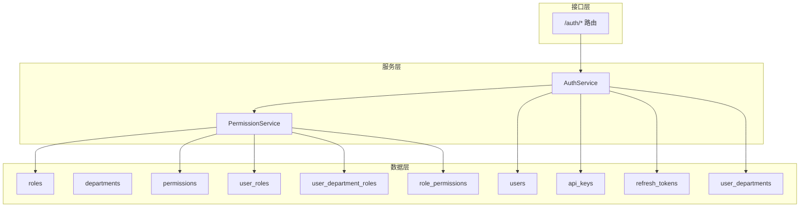
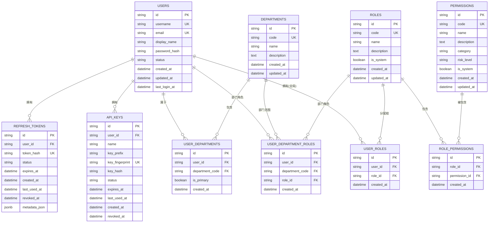
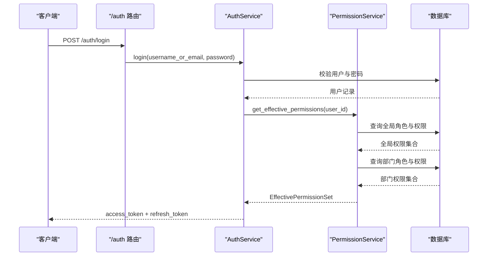
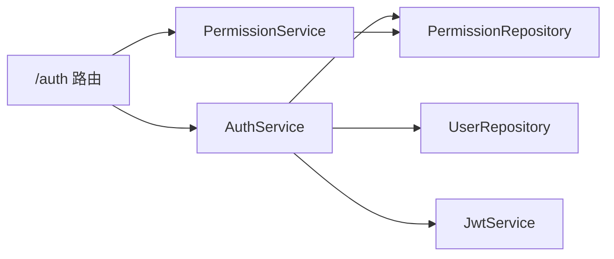

# 认证授权数据模型

<cite>
**本文引用的文件**
- [auth_tables.py](file://python-agent-study/src/fast_app/db/auth_tables.py)
- [20260626_0003_create_auth_tables.py](file://python-agent-study/alembic/versions/20260626_0003_create_auth_tables.py)
- [20260628_0004_create_department_acl_tables.py](file://python-agent-study/alembic/versions/20260628_0004_create_department_acl_tables.py)
- [20260704_0005_create_agent_tool_permission_tables.py](file://python-agent-study/alembic/versions/20260704_0005_create_agent_tool_permission_tables.py)
- [20260729_0011_add_nl2sql_rbac_and_audit.py](file://python-agent-study/alembic/versions/20260729_0011_add_nl2sql_rbac_and_audit.py)
- [auth_models.py](file://python-agent-study/src/fast_app/domain/auth_models.py)
- [auth_schema.py](file://python-agent-study/src/fast_app/schemas/auth_schema.py)
- [auth_service.py](file://python-agent-study/src/fast_app/services/auth/auth_service.py)
- [permission_service.py](file://python-agent-study/src/fast_app/services/auth/permission_service.py)
- [auth_routes.py](file://python-agent-study/src/fast_app/api/auth_routes.py)
</cite>

## 目录
1. [简介](#简介)
2. [项目结构](#项目结构)
3. [核心组件](#核心组件)
4. [架构总览](#架构总览)
5. [详细组件分析](#详细组件分析)
6. [依赖关系分析](#依赖关系分析)
7. [性能考虑](#性能考虑)
8. [故障排查指南](#故障排查指南)
9. [结论](#结论)
10. [附录](#附录)

## 简介
本文件面向认证与授权子系统的数据模型，系统性说明用户、部门、角色、权限及其关联表的结构、约束、索引与外键关系；解释 RBAC 多对多设计如何支撑“全局权限 + 部门作用域权限”的双通道授权；详述 API Key 与刷新令牌的安全存储策略；提供权限查询的 SQL 示例与优化建议；并给出级联删除策略与数据完整性保障机制。

## 项目结构
认证授权相关代码分布在以下层次：
- 数据模型定义：SQLAlchemy ORM 表定义位于数据库模型层，迁移脚本位于 Alembic 版本目录。
- 领域模型与接口契约：Pydantic 领域模型与请求/响应 Schema 用于服务层与 API 层。
- 服务与路由：认证服务负责登录、刷新、API Key 管理、上下文构建；权限服务负责计算有效权限；路由暴露 HTTP 接口。

图表来源
- [auth_tables.py:13-431](file://python-agent-study/src/fast_app/db/auth_tables.py#L13-L431)
- [auth_service.py:35-327](file://python-agent-study/src/fast_app/services/auth/auth_service.py#L35-L327)
- [permission_service.py:11-29](file://python-agent-study/src/fast_app/services/auth/permission_service.py#L11-L29)
- [auth_routes.py:19-112](file://python-agent-study/src/fast_app/api/auth_routes.py#L19-L112)

章节来源
- [auth_tables.py:13-431](file://python-agent-study/src/fast_app/db/auth_tables.py#L13-L431)
- [20260626_0003_create_auth_tables.py:20-145](file://python-agent-study/alembic/versions/20260626_0003_create_auth_tables.py#L20-L145)
- [20260628_0004_create_department_acl_tables.py:19-121](file://python-agent-study/alembic/versions/20260628_0004_create_department_acl_tables.py#L19-L121)
- [20260704_0005_create_agent_tool_permission_tables.py:132-266](file://python-agent-study/alembic/versions/20260704_0005_create_agent_tool_permission_tables.py#L132-L266)
- [20260729_0011_add_nl2sql_rbac_and_audit.py:17-139](file://python-agent-study/alembic/versions/20260729_0011_add_nl2sql_rbac_and_audit.py#L17-L139)

## 核心组件
- 用户表 users：存储用户身份、密码哈希、状态与审计时间戳，作为所有认证与授权的主体。
- 部门表 departments：组织维度，用于限定文档或资源的可见范围。
- 角色表 roles：可复用的权限集合（套餐）。
- 权限表 permissions：原子操作能力（如读取、修改、删除等），带分类与风险等级。
- 关联表：
  - user_departments：用户与部门的多对多关系，支持主部门标记。
  - user_roles：用户全局角色。
  - user_department_roles：用户在某部门的角色（部门作用域权限）。
  - role_permissions：角色与权限的多对多关系。
- 凭证表：
  - api_keys：程序化访问凭证，仅保存前缀、指纹与哈希，不存明文。
  - refresh_tokens：长期刷新凭证，仅保存 token 哈希与元数据。

章节来源
- [auth_tables.py:13-431](file://python-agent-study/src/fast_app/db/auth_tables.py#L13-L431)
- [auth_models.py:41-112](file://python-agent-study/src/fast_app/domain/auth_models.py#L41-L112)

## 架构总览
RBAC 双通道授权：
- 全局通道：users → user_roles → roles → role_permissions → permissions
- 部门通道：users → user_department_roles → roles → role_permissions → permissions（附带 department_code）

图表来源
- [auth_tables.py:13-431](file://python-agent-study/src/fast_app/db/auth_tables.py#L13-L431)

## 详细组件分析

### 用户表 users
- 字段类型与约束
  - id：字符串主键，唯一标识用户。
  - username/email：唯一索引，便于账号查找。
  - password_hash：不可为空，禁止明文存储。
  - status：默认 active，用于启用/禁用控制。
  - 时间戳：created_at/updated_at/last_login_at，支持审计与活跃度统计。
- 关系
  - 一对多：api_keys、refresh_tokens、user_departments、user_roles、user_department_roles。
- 索引与优化
  - 通过 username/email 唯一索引加速登录查找。
  - 结合业务查询，可在 (status, created_at) 上建立复合索引以支持按状态筛选与排序。

章节来源
- [auth_tables.py:13-64](file://python-agent-study/src/fast_app/db/auth_tables.py#L13-L64)
- [20260626_0003_create_auth_tables.py:20-62](file://python-agent-study/alembic/versions/20260626_0003_create_auth_tables.py#L20-L62)

### 部门表 departments
- 字段类型与约束
  - id/code/name/description：code 唯一，便于跨系统稳定引用。
  - 时间戳：created_at/updated_at。
- 关系
  - 一对多：user_departments。
- 索引与优化
  - code 唯一索引保证部门编码稳定性。
  - 可按需为 name 添加模糊搜索索引（视数据库方言而定）。

章节来源
- [auth_tables.py:66-91](file://python-agent-study/src/fast_app/db/auth_tables.py#L66-L91)
- [20260628_0004_create_department_acl_tables.py:19-40](file://python-agent-study/alembic/versions/20260628_0004_create_department_acl_tables.py#L19-L40)

### 角色表 roles 与权限表 permissions
- 字段类型与约束
  - roles：id/code/name/description/is_system，code 唯一。
  - permissions：id/code/name/description/category/risk_level/is_system，code 唯一。
- 关系
  - role_permissions：角色与权限的多对多，含唯一约束避免重复授权。
- 索引与优化
  - role_permissions 在 role_id 与 permission_id 上建索引，加速角色展开与权限检查。

章节来源
- [auth_tables.py:134-206](file://python-agent-study/src/fast_app/db/auth_tables.py#L134-L206)
- [auth_tables.py:208-244](file://python-agent-study/src/fast_app/db/auth_tables.py#L208-L244)
- [20260704_0005_create_agent_tool_permission_tables.py:132-171](file://python-agent-study/alembic/versions/20260704_0005_create_agent_tool_permission_tables.py#L132-L171)

### 关联表：用户-部门、用户-角色、用户-部门-角色
- user_departments
  - 多对多：user_id + department_code 唯一约束，is_primary 标记主部门。
  - 索引：user_id、department_code 单列索引。
- user_roles
  - 多对多：user_id + role_id 唯一约束。
  - 索引：user_id、role_id 单列索引。
- user_department_roles
  - 三元多对多：user_id + department_code + role_id 唯一约束。
  - 索引：user_id、department_code、role_id 单列索引。

章节来源
- [auth_tables.py:93-132](file://python-agent-study/src/fast_app/db/auth_tables.py#L93-L132)
- [auth_tables.py:246-320](file://python-agent-study/src/fast_app/db/auth_tables.py#L246-L320)
- [20260628_0004_create_department_acl_tables.py:42-80](file://python-agent-study/alembic/versions/20260628_0004_create_department_acl_tables.py#L42-L80)
- [20260704_0005_create_agent_tool_permission_tables.py:173-212](file://python-agent-study/alembic/versions/20260704_0005_create_agent_tool_permission_tables.py#L173-L212)

### API Key 表 api_keys
- 安全设计
  - 不存储明文 key，仅保存 key_prefix（展示用）、key_fingerprint（指纹）、key_hash（校验用）。
  - 状态 status 与过期时间 expires_at 控制可用性。
  - 审计字段：last_used_at、created_at、revoked_at。
- 索引与优化
  - 复合索引 (user_id, status) 加速当前用户活跃 Key 列表查询。
  - key_fingerprint 唯一索引确保指纹唯一性。

章节来源
- [auth_tables.py:322-369](file://python-agent-study/src/fast_app/db/auth_tables.py#L322-L369)
- [20260626_0003_create_auth_tables.py:64-96](file://python-agent-study/alembic/versions/20260626_0003_create_auth_tables.py#L64-L96)

### 刷新令牌表 refresh_tokens
- 安全设计
  - 仅保存 token_hash，使用 pepper 进行哈希，避免泄露。
  - 状态 status、过期时间 expires_at、审计字段 last_used_at、revoked_at。
  - JSONB 元数据 metadata_json 记录设备/IP 等上下文信息。
- 索引与优化
  - 复合索引 (user_id, status) 加速刷新流程中用户活跃 Token 查找。
  - token_hash 唯一索引防止重复注册。

章节来源
- [auth_tables.py:371-417](file://python-agent-study/src/fast_app/db/auth_tables.py#L371-L417)
- [20260626_0003_create_auth_tables.py:98-133](file://python-agent-study/alembic/versions/20260626_0003_create_auth_tables.py#L98-L133)

### RBAC 权限模型与多维关系
- 全局权限链路
  - users → user_roles → roles → role_permissions → permissions
- 部门权限链路
  - users → user_department_roles → roles → role_permissions → permissions（附加 department_code）
- 用户-部门关系
  - user_departments 表示用户可访问的部门集合，is_primary 标记主部门，用于默认上下文。

图表来源
- [auth_routes.py:22-44](file://python-agent-study/src/fast_app/api/auth_routes.py#L22-L44)
- [auth_service.py:75-112](file://python-agent-study/src/fast_app/services/auth/auth_service.py#L75-L112)
- [permission_service.py:17-29](file://python-agent-study/src/fast_app/services/auth/permission_service.py#L17-L29)

章节来源
- [auth_service.py:236-267](file://python-agent-study/src/fast_app/services/auth/auth_service.py#L236-L267)
- [permission_service.py:11-29](file://python-agent-study/src/fast_app/services/auth/permission_service.py#L11-L29)

### 权限查询 SQL 示例与优化建议
- 获取用户的全局权限集合
  - 思路：从 user_roles 找到角色，再经 role_permissions 展开到 permissions。
  - 示例要点：SELECT p.code FROM permissions p JOIN role_permissions rp ON rp.permission_id = p.id JOIN user_roles ur ON ur.role_id = rp.role_id WHERE ur.user_id = ?;
- 获取用户在某部门的权限集合
  - 思路：从 user_department_roles 定位部门角色，再展开到权限。
  - 示例要点：SELECT p.code FROM permissions p JOIN role_permissions rp ON rp.permission_id = p.id JOIN user_department_roles udr ON udr.role_id = rp.role_id WHERE udr.user_id = ? AND udr.department_code = ?;
- 获取用户所属部门列表
  - 示例要点：SELECT d.code FROM departments d JOIN user_departments ud ON ud.department_code = d.code WHERE ud.user_id = ?;
- 性能优化建议
  - 充分利用已定义的索引：user_roles(user_id, role_id)、user_department_roles(user_id, department_code, role_id)、role_permissions(role_id, permission_id)。
  - 将高频查询封装为视图或物化结果缓存（例如 Redis 中的用户权限集），减少多表 JOIN 开销。
  - 对大表查询增加分页与过滤条件，避免全表扫描。
  - 定期分析慢查询日志，评估是否需要新增复合索引（例如 (user_id, status) 已在凭证表使用）。

章节来源
- [auth_tables.py:246-320](file://python-agent-study/src/fast_app/db/auth_tables.py#L246-L320)
- [auth_tables.py:208-244](file://python-agent-study/src/fast_app/db/auth_tables.py#L208-L244)
- [20260704_0005_create_agent_tool_permission_tables.py:173-212](file://python-agent-study/alembic/versions/20260704_0005_create_agent_tool_permission_tables.py#L173-L212)

### 级联删除策略与数据完整性
- 外键与级联
  - 关联表对外键均设置 ondelete="CASCADE"，当用户或部门/角色被删除时，自动清理关联记录，避免孤儿数据。
- 唯一约束
  - user_departments：(user_id, department_code) 唯一，防止重复归属。
  - user_roles：(user_id, role_id) 唯一，防止重复授权。
  - user_department_roles：(user_id, department_code, role_id) 唯一，防止重复部门角色。
  - role_permissions：(role_id, permission_id) 唯一，防止重复权限绑定。
  - api_keys.key_fingerprint、refresh_tokens.token_hash 唯一，防止重复凭证。
- 检查约束
  - nl2sql_dataset_grants.subject_type 限制为枚举值，增强数据一致性。

章节来源
- [auth_tables.py:93-132](file://python-agent-study/src/fast_app/db/auth_tables.py#L93-L132)
- [auth_tables.py:246-320](file://python-agent-study/src/fast_app/db/auth_tables.py#L246-L320)
- [auth_tables.py:208-244](file://python-agent-study/src/fast_app/db/auth_tables.py#L208-L244)
- [auth_tables.py:322-417](file://python-agent-study/src/fast_app/db/auth_tables.py#L322-L417)
- [20260729_0011_add_nl2sql_rbac_and_audit.py:17-45](file://python-agent-study/alembic/versions/20260729_0011_add_nl2sql_rbac_and_audit.py#L17-L45)

## 依赖关系分析
- 服务依赖
  - AuthService 依赖 UserRepository、JwtService、PermissionService，统一处理认证与上下文构建。
  - PermissionService 依赖 PermissionRepository，计算用户的有效权限（全局+部门）。
- 路由依赖
  - auth_routes 通过 FastAPI 依赖注入获取 AuthService 与 CurrentUserContext，暴露登录、刷新、API Key 管理等接口。

图表来源
- [auth_routes.py:1-112](file://python-agent-study/src/fast_app/api/auth_routes.py#L1-L112)
- [auth_service.py:35-52](file://python-agent-study/src/fast_app/services/auth/auth_service.py#L35-L52)
- [permission_service.py:11-29](file://python-agent-study/src/fast_app/services/auth/permission_service.py#L11-L29)

章节来源
- [auth_routes.py:1-112](file://python-agent-study/src/fast_app/api/auth_routes.py#L1-L112)
- [auth_service.py:35-52](file://python-agent-study/src/fast_app/services/auth/auth_service.py#L35-L52)
- [permission_service.py:11-29](file://python-agent-study/src/fast_app/services/auth/permission_service.py#L11-L29)

## 性能考虑
- 查询路径优化
  - 优先使用已有索引：user_roles、user_department_roles、role_permissions 的单列索引。
  - 将权限计算结果缓存至内存或 Redis，降低频繁 JOIN 带来的延迟。
- 写入路径优化
  - 批量插入角色与权限时使用 bulk_insert（迁移脚本已体现），减少往返次数。
  - 对高频更新字段（如 last_used_at）注意索引选择性，避免写放大。
- 存储优化
  - 使用 JSONB 存储元数据（refresh_tokens.metadata_json），灵活扩展且查询高效。
  - 合理设置时间戳默认值与触发器，减少应用层负担。

[本节为通用性能指导，不直接分析具体文件]

## 故障排查指南
- 常见问题
  - 登录失败：检查用户名/邮箱是否存在、密码哈希是否匹配、用户状态是否为 active。
  - Refresh token 无效：检查 token_hash 是否存在、状态是否为 active、是否已过期或被撤销。
  - API Key 认证失败：检查 fingerprint 是否存在、hash 校验是否通过、状态与过期时间。
- 排查步骤
  - 查看对应表的记录是否存在且状态正确。
  - 检查外键约束是否满足（如用户被删除导致关联记录被级联删除）。
  - 审查权限链路：全局 vs 部门，确认角色与权限是否正确绑定。
- 日志与审计
  - 利用 last_used_at、created_at、revoked_at 等字段追踪凭证使用情况。
  - 结合 nl2sql_query_audits 等审计表进行问题回溯（若涉及 NL2SQL 场景）。

章节来源
- [auth_service.py:75-170](file://python-agent-study/src/fast_app/services/auth/auth_service.py#L75-L170)
- [auth_service.py:172-234](file://python-agent-study/src/fast_app/services/auth/auth_service.py#L172-L234)
- [20260729_0011_add_nl2sql_rbac_and_audit.py:46-71](file://python-agent-study/alembic/versions/20260729_0011_add_nl2sql_rbac_and_audit.py#L46-L71)

## 结论
该认证授权数据模型采用标准 RBAC 并结合部门作用域，形成“全局权限 + 部门权限”的双通道授权体系。通过严格的外键约束、唯一约束与索引设计，保障了数据一致性与查询性能。API Key 与刷新令牌采用哈希存储策略，避免明文泄露，并提供完善的审计字段。配合服务层的权限计算与上下文构建，系统能够高效、安全地支撑多租户、多部门的复杂授权场景。

[本节为总结性内容，不直接分析具体文件]

## 附录
- 领域模型与接口契约
  - 领域模型：AuthUser、ApiKeyCredential、RefreshTokenRecord 等，描述持久化视图与业务语义。
  - 接口契约：LoginRequest、RefreshTokenRequest、CurrentUserResponse、CreateApiKeyRequest/Response 等，规范 API 输入输出。
- 迁移历史
  - 初始认证表创建、部门 ACL 表创建、Agent 工具权限表创建、NL2SQL RBAC 与审计表扩展。

章节来源
- [auth_models.py:41-112](file://python-agent-study/src/fast_app/domain/auth_models.py#L41-L112)
- [auth_schema.py:8-123](file://python-agent-study/src/fast_app/schemas/auth_schema.py#L8-L123)
- [20260626_0003_create_auth_tables.py:20-145](file://python-agent-study/alembic/versions/20260626_0003_create_auth_tables.py#L20-L145)
- [20260628_0004_create_department_acl_tables.py:19-121](file://python-agent-study/alembic/versions/20260628_0004_create_department_acl_tables.py#L19-L121)
- [20260704_0005_create_agent_tool_permission_tables.py:132-266](file://python-agent-study/alembic/versions/20260704_0005_create_agent_tool_permission_tables.py#L132-L266)
- [20260729_0011_add_nl2sql_rbac_and_audit.py:17-139](file://python-agent-study/alembic/versions/20260729_0011_add_nl2sql_rbac_and_audit.py#L17-L139)