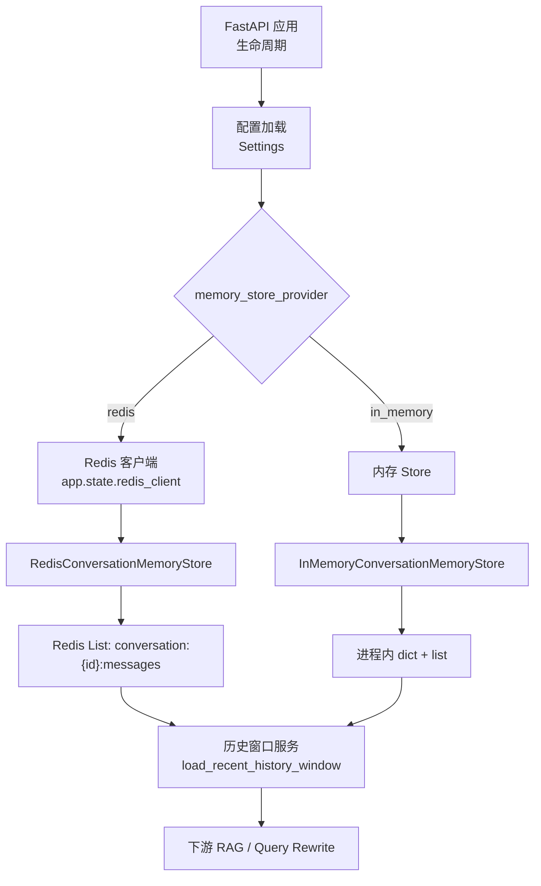
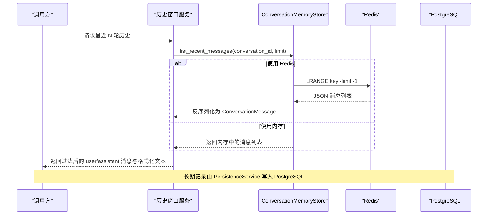
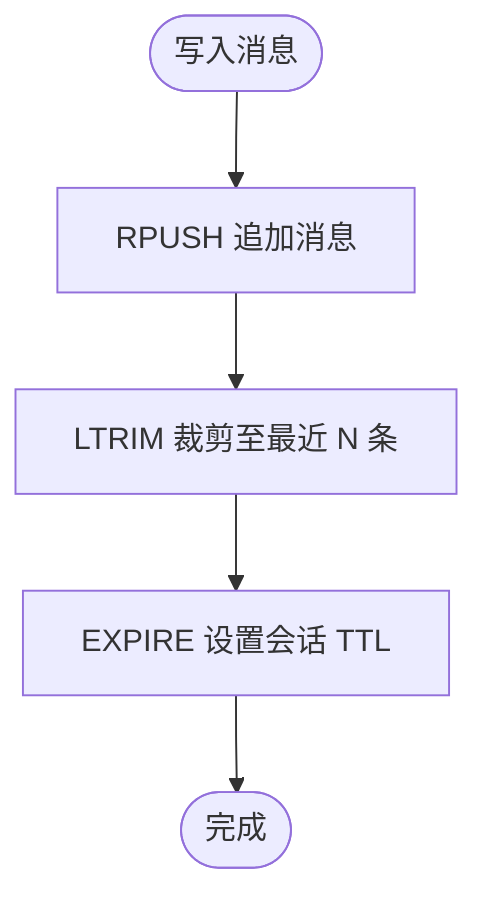
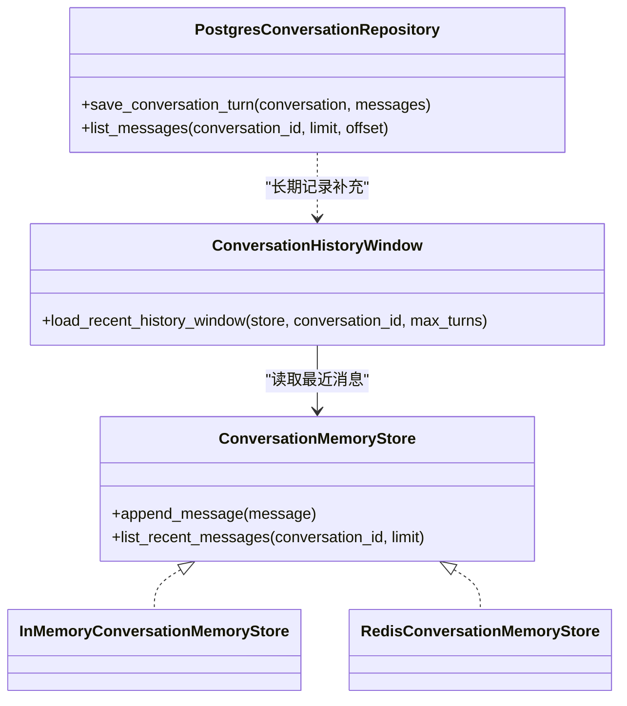

# Redis 缓存策略

<cite>
**本文引用的文件**
- [conversation_memory.py](file://src/fast_app/services/conversation/conversation_memory.py)
- [main.py](file://src/fast_app/main.py)
- [config.py](file://src/fast_app/core/config.py)
- [conversation_models.py](file://src/fast_app/domain/conversation_models.py)
- [conversation_history.py](file://src/fast_app/services/conversation/conversation_history.py)
- [conversation_repository.py](file://src/fast_app/services/conversation/conversation_repository.py)
- [conversation_persistence.py](file://src/fast_app/services/conversation/conversation_persistence.py)
- [14-2-Redis短期会话记忆-最近消息-TTL-会话状态.md](file://learning-docs/phase-14/14-2-Redis短期会话记忆-最近消息-TTL-会话状态.md)
- [14-4-历史消息窗口-保留最近N轮.md](file://learning-docs/phase-14/14-4-历史消息窗口-保留最近N轮.md)
- [14-9-多用户隔离-user_id-session_id-permission.md](file://learning-docs/phase-14/14-9-多用户隔离-user_id-session_id-permission.md)
</cite>

## 目录
1. [简介](#简介)
2. [项目结构](#项目结构)
3. [核心组件](#核心组件)
4. [架构总览](#架构总览)
5. [详细组件分析](#详细组件分析)
6. [依赖关系分析](#依赖关系分析)
7. [性能与容量规划](#性能与容量规划)
8. [故障恢复与一致性](#故障恢复与一致性)
9. [监控与可观测性](#监控与可观测性)
10. [最佳实践与常见问题](#最佳实践与常见问题)
11. [结论](#结论)

## 简介
本文件围绕项目中“Redis 短期会话记忆”的缓存策略，系统说明会话状态存储、短期记忆管理、热点数据缓存的设计与实现。重点覆盖：
- 会话 ID 生成策略与多用户隔离
- TTL 过期机制与内存清理策略
- 数据结构设计（Redis List）、序列化格式（JSON）与读写路径
- 与 PostgreSQL 持久化的边界与协作
- 命中率、内存使用与容量规划的指导
- 常见问题的定位与解决方案

## 项目结构
本项目将“短期会话记忆”抽象为存储协议，并提供内存与 Redis 两种实现；应用启动时根据配置创建并注入 Redis 客户端；上层通过历史窗口服务读取最近 N 轮对话，用于后续改写或检索增强。

图表来源
- [main.py:70-75](file://src/fast_app/main.py#L70-L75)
- [config.py:457-484](file://src/fast_app/core/config.py#L457-L484)
- [conversation_memory.py:60-105](file://src/fast_app/services/conversation/conversation_memory.py#L60-L105)
- [conversation_history.py:85-107](file://src/fast_app/services/conversation/conversation_history.py#L85-L107)

章节来源
- [main.py:70-75](file://src/fast_app/main.py#L70-L75)
- [config.py:457-484](file://src/fast_app/core/config.py#L457-L484)

## 核心组件
- 存储协议与实现
  - ConversationMemoryStore：定义 append_message 与 list_recent_messages 两个最小能力，屏蔽底层存储差异。
  - InMemoryConversationMemoryStore：进程内临时存储，适合学习与测试。
  - RedisConversationMemoryStore：基于 Redis List 的短期会话记忆，支持 LTRIM 裁剪与 EXPIRE 过期。
- 历史窗口服务
  - load_recent_history_window：从 store 读取最近 N 轮 user/assistant 消息，过滤 system 角色，输出格式化文本供下游使用。
- 持久化服务
  - ConversationPersistenceService：负责将完整对话写入 PostgreSQL，不替代 Redis 短期记忆。
- 领域模型
  - ConversationMessage、Conversation：包含 id、conversation_id、role、content、时间戳与元数据等字段。

章节来源
- [conversation_memory.py:10-112](file://src/fast_app/services/conversation/conversation_memory.py#L10-L112)
- [conversation_history.py:85-107](file://src/fast_app/services/conversation/conversation_history.py#L85-L107)
- [conversation_persistence.py:10-63](file://src/fast_app/services/conversation/conversation_persistence.py#L10-L63)
- [conversation_models.py:39-72](file://src/fast_app/domain/conversation_models.py#L39-L72)

## 架构总览
短期会话记忆采用“协议 + 双实现”的分层设计：
- 上层只依赖 ConversationMemoryStore 接口，不关心具体存储。
- 应用启动时根据配置选择 Redis 或内存实现，并注入到依赖中。
- 历史窗口服务统一读取最近消息，屏蔽存储细节。
- 长期记忆由 PostgreSQL 仓储承担，短期记忆仅保存最近若干条消息。

图表来源
- [conversation_history.py:85-107](file://src/fast_app/services/conversation/conversation_history.py#L85-L107)
- [conversation_memory.py:90-105](file://src/fast_app/services/conversation/conversation_memory.py#L90-L105)
- [conversation_persistence.py:20-63](file://src/fast_app/services/conversation/conversation_persistence.py#L20-L63)

## 详细组件分析

### 会话 ID 与多用户隔离
- 会话 ID 生成
  - 默认使用 UUID hex 生成，保证唯一性与不可预测性。
  - 也可由外部 session_id 映射而来，便于前端控制会话生命周期。
- 多用户隔离
  - 当前学习项目在单用户场景下工作良好；进入多用户环境后，应避免不同用户共享同一 session_id，否则会出现会话记忆串扰。
  - 建议在接入认证体系后，将 user_id 与会话绑定，并在查询时校验权限。

章节来源
- [conversation_models.py:13-20](file://src/fast_app/domain/conversation_models.py#L13-L20)
- [conversation_models.py:54-72](file://src/fast_app/domain/conversation_models.py#L54-L72)
- [14-9-多用户隔离-user_id-session_id-permission.md:188-196](file://learning-docs/phase-14/14-9-多用户隔离-user_id-session_id-permission.md#L188-L196)

### Redis 数据结构与序列化
- 数据结构
  - 每个会话一个 Redis List，键名约定为 conversation:{conversation_id}:messages。
  - 追加消息使用 RPUSH，读取最近消息使用 LRANGE，限制长度使用 LTRIM。
- 序列化格式
  - 每条消息以 ConversationMessage 的 JSON 字符串形式存储。
  - 读取时再反序列化为领域对象，保持类型安全与可扩展性。
- 优势
  - 顺序天然符合对话时序。
  - 易于裁剪与过期控制。
  - 与 Pydantic 模型无缝对接。

章节来源
- [conversation_memory.py:60-105](file://src/fast_app/services/conversation/conversation_memory.py#L60-L105)
- [14-2-Redis短期会话记忆-最近消息-TTL-会话状态.md:330-364](file://learning-docs/phase-14/14-2-Redis短期会话记忆-最近消息-TTL-会话状态.md#L330-L364)

### TTL 过期与内存清理
- TTL 策略
  - 每次追加消息后刷新 TTL，确保活跃会话续期。
  - 仅读取不刷新 TTL，避免无意延长旧会话的生命周期。
- 内存清理
  - 通过 LTRIM 限制每个会话最多保留 max_messages 条消息，防止无限增长。
  - 结合 EXPIRE 自动清理过期会话，降低维护成本。

图表来源
- [conversation_memory.py:80-88](file://src/fast_app/services/conversation/conversation_memory.py#L80-L88)
- [14-2-Redis短期会话记忆-最近消息-TTL-会话状态.md:357-364](file://learning-docs/phase-14/14-2-Redis短期会话记忆-最近消息-TTL-会话状态.md#L357-L364)

章节来源
- [conversation_memory.py:80-88](file://src/fast_app/services/conversation/conversation_memory.py#L80-L88)
- [14-2-Redis短期会话记忆-最近消息-TTL-会话状态.md:357-364](file://learning-docs/phase-14/14-2-Redis短期会话记忆-最近消息-TTL-会话状态.md#L357-L364)

### 历史窗口与下游使用
- 历史窗口服务会读取最近 N 轮对话，过滤 system 角色，仅保留 user 与 assistant 消息。
- 输出包含原始消息列表与格式化文本，便于下游进行 query rewrite 或上下文构建。
- 该窗口是短期记忆的“消费视图”，不改变存储层的裁剪与过期策略。

章节来源
- [conversation_history.py:85-107](file://src/fast_app/services/conversation/conversation_history.py#L85-L107)
- [14-4-历史消息窗口-保留最近N轮.md:105-148](file://learning-docs/phase-14/14-4-历史消息窗口-保留最近N轮.md#L105-L148)

### 与 PostgreSQL 持久化的边界
- 短期记忆（Redis）：快速读写最近消息，具备 TTL 与自动清理。
- 长期记忆（PostgreSQL）：保存完整会话与消息，支持按用户与会话查询、摘要版本管理等。
- 两者职责清晰：短期服务于实时体验，长期服务于审计与回溯。

章节来源
- [conversation_repository.py:18-160](file://src/fast_app/services/conversation/conversation_repository.py#L18-L160)
- [conversation_persistence.py:10-63](file://src/fast_app/services/conversation/conversation_persistence.py#L10-L63)

## 依赖关系分析
- 应用启动阶段根据 memory_store_provider 选择实现，并创建 Redis 客户端（若启用）。
- 历史窗口服务依赖 ConversationMemoryStore 协议，解耦具体存储。
- 持久化服务依赖 PostgreSQL 仓储，负责长期落库。

图表来源
- [conversation_memory.py:10-112](file://src/fast_app/services/conversation/conversation_memory.py#L10-L112)
- [conversation_history.py:85-107](file://src/fast_app/services/conversation/conversation_history.py#L85-L107)
- [conversation_repository.py:18-160](file://src/fast_app/services/conversation/conversation_repository.py#L18-L160)

章节来源
- [main.py:70-75](file://src/fast_app/main.py#L70-L75)
- [config.py:457-484](file://src/fast_app/core/config.py#L457-L484)

## 性能与容量规划
- 读路径优化
  - 使用 LRANGE -limit -1 直接获取最近消息，避免全量扫描。
  - 限制 effective_limit 不超过 max_messages，减少网络传输与序列化开销。
- 写路径优化
  - 使用 pipeline 批量执行 RPUSH、LTRIM、EXPIRE，降低 RTT。
  - 合理设置 max_messages，平衡上下文长度与内存占用。
- TTL 与过期
  - 仅在写入时刷新 TTL，避免频繁读取导致的误续期。
  - 根据业务活跃度调整 MEMORY_TTL_SECONDS，避免过早过期或资源浪费。
- 容量规划建议
  - 估算单条消息大小（含 JSON 头与元数据），乘以 max_messages 得到单会话峰值内存。
  - 结合并发会话数与 TTL，估算 Redis 内存需求，预留 20%-30% 缓冲。
  - 对热点会话可考虑独立命名空间或分片策略，避免大 Key 问题。

章节来源
- [conversation_memory.py:80-105](file://src/fast_app/services/conversation/conversation_memory.py#L80-L105)
- [config.py:466-484](file://src/fast_app/core/config.py#L466-L484)

## 故障恢复与一致性
- 短期记忆丢失
  - Redis 重启或过期会导致最近消息丢失，但长期记录仍在 PostgreSQL，可通过仓库补齐。
- 幂等与顺序
  - 消息顺序由 Redis List 的自然顺序保证；写入失败应重试或降级为内存存储（开发环境）。
- 事务与一致性
  - 短期记忆与长期记录不在同一事务中，属于最终一致；关键审计信息以 PostgreSQL 为准。
- 降级策略
  - 当 Redis 不可用时，可回退到内存实现，保证服务可用性与用户体验。

章节来源
- [conversation_repository.py:83-160](file://src/fast_app/services/conversation/conversation_repository.py#L83-L160)
- [conversation_persistence.py:20-63](file://src/fast_app/services/conversation/conversation_persistence.py#L20-L63)

## 监控与可观测性
- 命中率监控
  - 统计 list_recent_messages 的命中与未命中比例，评估 TTL 与 max_messages 是否合理。
- 内存使用分析
  - 定期采样 Redis 内存与键数量，识别异常增长或热点键。
  - 关注单个会话的消息数量是否接近 max_messages，必要时调整阈值。
- 延迟与错误率
  - 记录历史窗口服务的 P95/P99 延迟与错误率，定位瓶颈。
- 容量预警
  - 设置内存使用阈值告警，提前扩容或清理过期会话。

[本节为通用指导，无需特定文件引用]

## 最佳实践与常见问题
- 最佳实践
  - 明确短期记忆与长期记忆的边界：短期用于实时体验，长期用于审计与回溯。
  - 使用协议抽象存储实现，便于替换与扩展。
  - 合理设置 TTL 与 max_messages，避免内存膨胀与上下文过长。
  - 在写入时使用 pipeline 提升吞吐，降低网络开销。
- 常见问题
  - 多用户会话串扰：确保 session_id 与 user_id 绑定，避免跨用户共享。
  - TTL 过短导致频繁重建上下文：根据业务活跃度调优 TTL。
  - 大 Key 风险：控制单会话消息数量，必要时拆分或归档。
  - 序列化兼容：升级 ConversationMessage 字段时需考虑向后兼容。

章节来源
- [14-9-多用户隔离-user_id-session_id-permission.md:188-196](file://learning-docs/phase-14/14-9-多用户隔离-user_id-session_id-permission.md#L188-L196)
- [14-2-Redis短期会话记忆-最近消息-TTL-会话状态.md:330-364](file://learning-docs/phase-14/14-2-Redis短期会话记忆-最近消息-TTL-会话状态.md#L330-L364)

## 结论
本项目通过协议抽象与双实现，实现了灵活、可插拔的短期会话记忆方案。Redis 作为热点数据的缓存层，提供低延迟、可过期、易裁剪的能力；PostgreSQL 作为长期记忆层，保障数据持久化与审计。通过合理的 TTL、内存裁剪与容量规划，系统在多用户、多进程环境下具备良好的可扩展性与稳定性。未来可进一步引入命中率监控、内存分析与降级策略，以提升整体可靠性与可观测性。